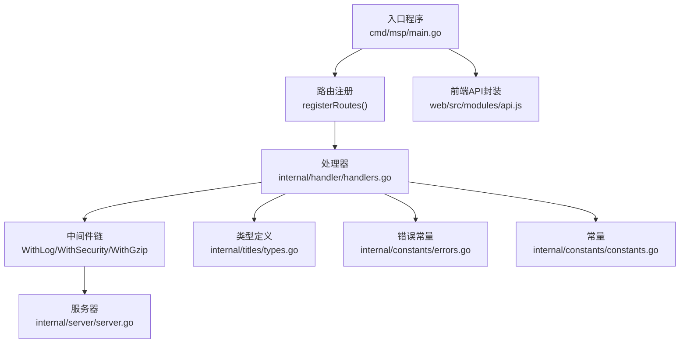
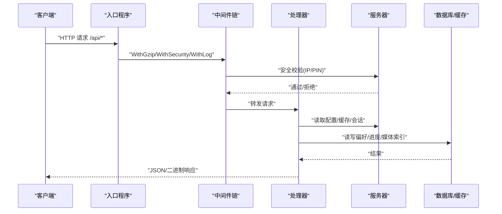
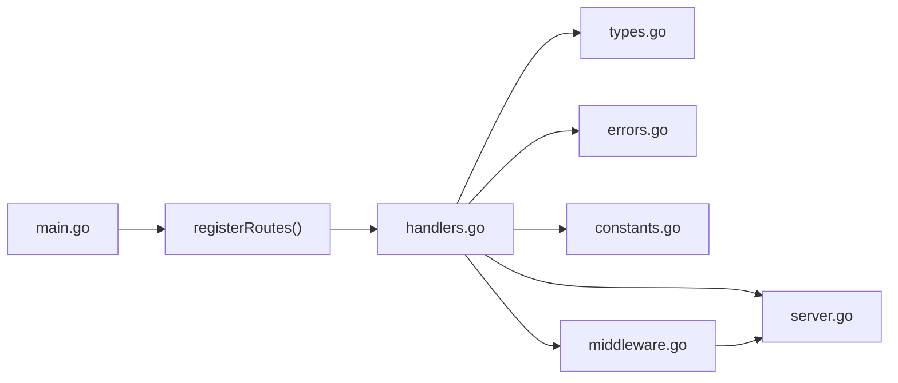
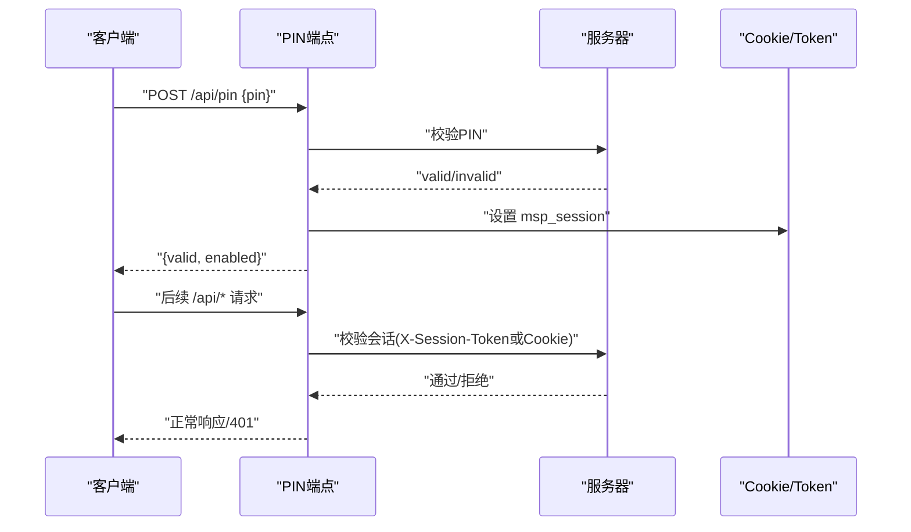

# API接口文档

<cite>
**本文档引用的文件**
- [main.go](file://cmd/msp/main.go)
- [handlers.go](file://internal/handler/handlers.go)
- [middleware.go](file://internal/handler/middleware.go)
- [server.go](file://internal/server/server.go)
- [types.go](file://internal/titles/types.go)
- [errors.go](file://internal/constants/errors.go)
- [constants.go](file://internal/constants/constants.go)
- [API_REFERENCE.md](file://docs/API_REFERENCE.md)
- [SECURITY.md](file://docs/SECURITY.md)
- [config.example.json](file://config.example.json)
- [api.js](file://web/src/modules/api.js)
- [PERFORMANCE_ANALYSIS.md](file://PERFORMANCE_ANALYSIS.md)
</cite>

## 目录
1. [简介](#简介)
2. [项目结构](#项目结构)
3. [核心组件](#核心组件)
4. [架构总览](#架构总览)
5. [详细组件分析](#详细组件分析)
6. [依赖关系分析](#依赖关系分析)
7. [性能考虑](#性能考虑)
8. [故障排除指南](#故障排除指南)
9. [结论](#结论)
10. [附录](#附录)

## 简介
本文件为 MSP 项目的完整 API 接口文档，覆盖所有 REST API 端点的请求/响应格式、认证机制、错误码说明、使用示例与最佳实践。MSP 提供媒体索引、播放与流媒体、字幕处理、用户偏好与进度、系统与安全等功能，采用 Go 编写的后端服务与前端模块化 JavaScript 前端配合。

## 项目结构
MSP 的 API 路由注册集中在入口程序中，处理器负责具体业务逻辑，中间件提供日志、安全与压缩能力，服务器负责配置、缓存与会话管理。

**图表来源**
- [main.go](file://cmd/msp/main.go#L85-L107)
- [handlers.go](file://internal/handler/handlers.go#L1-L721)
- [middleware.go](file://internal/handler/middleware.go#L1-L229)
- [server.go](file://internal/server/server.go#L1-L627)
- [types.go](file://internal/titles/types.go#L1-L112)
- [errors.go](file://internal/constants/errors.go#L1-L68)
- [constants.go](file://internal/constants/constants.go#L1-L115)
- [api.js](file://web/src/modules/api.js#L1-L155)

**章节来源**
- [main.go](file://cmd/msp/main.go#L26-L83)
- [handlers.go](file://internal/handler/handlers.go#L45-L104)
- [middleware.go](file://internal/handler/middleware.go#L25-L120)
- [server.go](file://internal/server/server.go#L31-L74)

## 核心组件
- 路由与入口
  - 入口程序负责初始化配置、数据库、日志与 Web 资源，注册 /api/* 路由并应用中间件链。
- 处理器
  - 统一处理 /api/* 端点，包含配置、共享目录、媒体、流媒体、字幕、探针、IP、偏好、进度、日志、PIN 等。
- 中间件
  - 日志记录、安全校验（IP 白/黑名单、PIN 会话）、Gzip 压缩。
- 服务器
  - 配置热重载、媒体缓存（内存+磁盘）、ETag、会话管理（随机令牌、过期清理）。
- 类型与常量
  - 统一的请求/响应模型与错误消息常量，便于前后端契约一致。

**章节来源**
- [handlers.go](file://internal/handler/handlers.go#L28-L43)
- [middleware.go](file://internal/handler/middleware.go#L45-L120)
- [server.go](file://internal/server/server.go#L31-L74)
- [types.go](file://internal/titles/types.go#L54-L112)
- [errors.go](file://internal/constants/errors.go#L4-L67)
- [constants.go](file://internal/constants/constants.go#L8-L50)

## 架构总览
MSP 的请求处理流程如下：

**图表来源**
- [main.go](file://cmd/msp/main.go#L65-L83)
- [middleware.go](file://internal/handler/middleware.go#L77-L120)
- [handlers.go](file://internal/handler/handlers.go#L45-L66)
- [server.go](file://internal/server/server.go#L140-L188)

## 详细组件分析

### 1) 配置管理 (GET/POST /api/config)
- 方法与路径
  - GET /api/config：获取当前运行时配置与局域网 IP、访问 URL、时间戳。
  - POST /api/config：全量更新配置（需管理员权限或 PIN 通过）。
- 请求体
  - POST 时为完整配置对象（参考示例配置文件）。
- 响应体
  - GET：ConfigResponse，包含 config、lanIPs、urls、nowUnix。
  - POST：ConfigResponse，包含更新后的 config；失败时返回包含 error 的响应。
- 错误
  - 写入配置失败：内部错误。
- 示例
  - GET：返回当前配置快照与网络可达信息。
  - POST：提交新的 playback、shares、security 等配置。

**章节来源**
- [handlers.go](file://internal/handler/handlers.go#L45-L66)
- [API_REFERENCE.md](file://docs/API_REFERENCE.md#L12-L39)
- [config.example.json](file://config.example.json#L1-L56)
- [errors.go](file://internal/constants/errors.go#L8-L12)

### 2) 共享目录管理 (POST /api/shares)
- 方法与路径
  - POST /api/shares：添加或移除共享目录。
- 请求体
  - SharesOpRequest：包含 op（"add"|"remove"）、path（目录路径）、label（可选标签）。
- 响应体
  - SharesOpResponse：包含更新后的配置；失败时返回 error。
- 行为
  - add：校验目录存在且可访问，去重与规范化后写回配置。
  - remove：按路径移除，触发媒体缓存失效。
- 错误
  - 目录不存在/不可访问：400。
  - 写入配置失败：500。

**章节来源**
- [handlers.go](file://internal/handler/handlers.go#L68-L94)
- [handlers.go](file://internal/handler/handlers.go#L106-L149)
- [API_REFERENCE.md](file://docs/API_REFERENCE.md#L41-L57)
- [errors.go](file://internal/constants/errors.go#L14-L18)

### 3) 媒体索引 (GET /api/media)
- 方法与路径
  - GET /api/media：获取已索引的媒体列表（视频/音频/图片/其他）。
- 查询参数
  - refresh：1 表示强制后台重建缓存。
  - limit：限制返回数量（低内存模式）。
- 响应体
  - MediaResponse：包含 videos、audios、images、others 及总数字段；若 scanning=true 表示后台扫描中。
- 缓存与 ETag
  - 支持条件请求与内存缓存，带 ETag；limit>0 时关闭缓存。
- 错误
  - 读取进度失败：500。

**章节来源**
- [handlers.go](file://internal/handler/handlers.go#L333-L362)
- [handlers.go](file://internal/handler/handlers.go#L364-L411)
- [API_REFERENCE.md](file://docs/API_REFERENCE.md#L59-L86)
- [errors.go](file://internal/constants/errors.go#L20-L24)

### 4) 播放与流媒体
#### 4.1 媒体流 (GET /api/stream)
- 方法与路径
  - GET /api/stream：返回媒体二进制流，支持断点续传。
- 查询参数
  - id：媒体文件 ID（必需）。
  - transcode：1 请求转码；start：转码起始秒；format/bitrate：转码格式与码率。
- 响应
  - 视频：video/mp4；音频：audio/mpeg；带 X-MSP-Transcode 标记。
- 策略
  - 默认优先直连；对高风险容器/编码可选择转码；.wmv 原始头为 video/x-ms-wmv。
- 错误
  - 缺少 id/bad id/not allowed/open failed/not found：400/403/404。
  - 转码禁用：403。

**章节来源**
- [handlers.go](file://internal/handler/handlers.go#L413-L446)
- [handlers.go](file://internal/handler/handlers.go#L448-L486)
- [handlers.go](file://internal/handler/handlers.go#L513-L532)
- [handlers.go](file://internal/handler/handlers.go#L534-L564)
- [handlers.go](file://internal/handler/handlers.go#L566-L579)
- [API_REFERENCE.md](file://docs/API_REFERENCE.md#L88-L106)
- [errors.go](file://internal/constants/errors.go#L50-L51)

#### 4.2 字幕流 (GET /api/subtitle)
- 方法与路径
  - GET /api/subtitle：返回字幕文本（VTT/SRT/ASS 自动转换）。
- 查询参数
  - id：字幕文件 ID。
- 响应
  - VTT 文本；SRT/ASS 会转换为 VTT；超大文件（>8MB）拒绝转换。
- 错误
  - 不支持的格式：400；读取失败：500；过大：413。

**章节来源**
- [handlers.go](file://internal/handler/handlers.go#L623-L646)
- [handlers.go](file://internal/handler/handlers.go#L648-L668)
- [handlers.go](file://internal/handler/handlers.go#L670-L684)
- [API_REFERENCE.md](file://docs/API_REFERENCE.md#L107-L114)
- [errors.go](file://internal/constants/errors.go#L65-L48)

#### 4.3 媒体探针 (GET /api/probe)
- 方法与路径
  - GET /api/probe：返回容器、视频/音频编码与字幕信息，辅助前端决策是否转码。
- 查询参数
  - id：媒体文件 ID。
- 响应
  - ProbeResponse：包含 container、video、audio、subtitles。
- 错误
  - 缺少 id/bad id/not allowed：400；禁止访问：403。

**章节来源**
- [handlers.go](file://internal/handler/handlers.go#L581-L621)
- [API_REFERENCE.md](file://docs/API_REFERENCE.md#L115-L135)
- [errors.go](file://internal/constants/errors.go#L26-L42)

### 5) 用户数据
#### 5.1 播放进度 (GET/POST /api/progress)
- 方法与路径
  - GET /api/progress：获取某媒体上次播放时间。
  - POST /api/progress：保存播放进度。
- 请求体（POST）
  - {"id": "...", "time": number}。
- 响应
  - GET：{"time": number}；POST：204 No Content。
- 错误
  - 缺少 id：400；读写失败：500。

**章节来源**
- [handlers.go](file://internal/handler/handlers.go#L192-L233)
- [API_REFERENCE.md](file://docs/API_REFERENCE.md#L140-L159)
- [errors.go](file://internal/constants/errors.go#L20-L24)

#### 5.2 偏好设置 (GET/POST /api/prefs)
- 方法与路径
  - GET /api/prefs：获取所有用户偏好。
  - POST /api/prefs：批量更新偏好。
- 请求体（POST）
  - {"prefs": {...}}。
- 响应
  - GET/POST：{"prefs": {...}}；缺失 prefs：400。
- 错误
  - 读写失败：500。

**章节来源**
- [handlers.go](file://internal/handler/handlers.go#L161-L190)
- [API_REFERENCE.md](file://docs/API_REFERENCE.md#L160-L178)
- [errors.go](file://internal/constants/errors.go#L14-L18)

### 6) 系统与安全
#### 6.1 获取局域网 IP (GET /api/ip)
- 方法与路径
  - GET /api/ip：返回服务器局域网 IPv4 列表。
- 响应
  - {"lanIPs": [...]}

**章节来源**
- [handlers.go](file://internal/handler/handlers.go#L151-L159)
- [API_REFERENCE.md](file://docs/API_REFERENCE.md#L183-L185)

#### 6.2 PIN 认证 (POST /api/pin)
- 方法与路径
  - POST /api/pin：验证 PIN，成功后设置 msp_session 会话 Cookie。
- 请求体
  - {"pin": "1234"}（4-8 位数字）。
- 响应
  - {"valid": true/false, "enabled": true/false}。
- 会话传递
  - Cookie：msp_session；或请求头：X-Session-Token。
- 特殊豁免
  - /api/pin、/api/ip、/api/config 不需要 PIN。
- 错误
  - 无效请求/负载过大：400/413；内部错误：500。

**章节来源**
- [handlers.go](file://internal/handler/handlers.go#L255-L319)
- [middleware.go](file://internal/handler/middleware.go#L77-L120)
- [server.go](file://internal/server/server.go#L570-L627)
- [API_REFERENCE.md](file://docs/API_REFERENCE.md#L187-L203)
- [SECURITY.md](file://docs/SECURITY.md#L61-L168)

#### 6.3 前端日志上报 (POST /api/log)
- 方法与路径
  - POST /api/log：接收前端上报的错误/调试信息。
- 请求体
  - {"level": "error"|"info"|"debug", "msg": "..."}。
- 响应
  - 204 No Content；失败：400/500。

**章节来源**
- [handlers.go](file://internal/handler/handlers.go#L235-L253)
- [API_REFERENCE.md](file://docs/API_REFERENCE.md#L204-L215)

### 7) 中间件与安全策略
- WithGzip
  - 对 /api/*（除 /api/stream、/api/subtitle）启用 gzip 压缩，设置 Vary: Accept-Encoding。
- WithLog
  - 记录请求耗时、状态码、User-Agent，错误级别自动提升。
- WithSecurity
  - 应用安全头（X-Content-Type-Options、X-Frame-Options、X-XSS-Protection、Referrer-Policy）。
  - IP 白/黑名单校验（仅信任 RemoteAddr，支持 CIDR）。
  - PIN 会话校验：要求 /api/*（豁免路径）携带有效会话令牌。

**章节来源**
- [middleware.go](file://internal/handler/middleware.go#L25-L120)
- [middleware.go](file://internal/handler/middleware.go#L122-L229)
- [SECURITY.md](file://docs/SECURITY.md#L1-L188)

## 依赖关系分析

**图表来源**
- [main.go](file://cmd/msp/main.go#L85-L107)
- [handlers.go](file://internal/handler/handlers.go#L1-L721)
- [middleware.go](file://internal/handler/middleware.go#L1-L229)
- [server.go](file://internal/server/server.go#L1-L627)
- [types.go](file://internal/titles/types.go#L1-L112)
- [errors.go](file://internal/constants/errors.go#L1-L68)
- [constants.go](file://internal/constants/constants.go#L1-L115)

**章节来源**
- [main.go](file://cmd/msp/main.go#L85-L107)
- [handlers.go](file://internal/handler/handlers.go#L1-L721)
- [middleware.go](file://internal/handler/middleware.go#L1-L229)
- [server.go](file://internal/server/server.go#L1-L627)

## 性能考虑
- 缓存策略
  - 媒体列表缓存 TTL=2 分钟，内存中缓存序列化 JSON，支持 ETag 条件请求；limit>0 时禁用缓存。
- 流媒体传输
  - 支持 HTTP Range；直连使用 http.ServeContent；转码流使用分块传输，禁用 Content-Length。
- 转码与并发
  - 限制并发转码会话数；智能转码策略；可配置码率与格式。
- 前端优化
  - API 请求去重、PWA 缓存策略、资源预加载与代码分割建议。
- 内存与 GC
  - 积极 GC 与周期性 FreeOSMemory；目录缓存 LRU 化建议；会话与 IP 映射清理。

**章节来源**
- [PERFORMANCE_ANALYSIS.md](file://PERFORMANCE_ANALYSIS.md#L260-L297)
- [PERFORMANCE_ANALYSIS.md](file://PERFORMANCE_ANALYSIS.md#L219-L258)
- [PERFORMANCE_ANALYSIS.md](file://PERFORMANCE_ANALYSIS.md#L151-L217)
- [PERFORMANCE_ANALYSIS.md](file://PERFORMANCE_ANALYSIS.md#L301-L426)
- [PERFORMANCE_ANALYSIS.md](file://PERFORMANCE_ANALYSIS.md#L464-L541)

## 故障排除指南
- 常见错误码
  - 400：JSON 解析失败、无效请求、缺少参数、不支持的格式、打开文件失败、读取失败。
  - 401：未授权（PIN 会话无效）。
  - 403：访问被拒绝（IP 不在白名单/在黑名单）。
  - 404：资源不存在。
  - 413：请求实体过大。
  - 500：内部错误（读写配置/偏好/进度、转码失败等）。
- 定位步骤
  - 查看服务器日志（按配置级别输出），确认错误级别与时间戳。
  - 使用 /api/ip 确认局域网可达性。
  - 若启用 PIN，确认会话 Cookie/X-Session-Token 是否正确传递。
  - 对 /api/probe 获取媒体编码信息，判断是否需要转码。
- 建议
  - 保持配置热重载生效（默认 2 秒检测间隔）。
  - 对大文件字幕与转码操作设置合理限制，避免内存压力。

**章节来源**
- [errors.go](file://internal/constants/errors.go#L4-L67)
- [middleware.go](file://internal/handler/middleware.go#L77-L120)
- [server.go](file://internal/server/server.go#L222-L248)
- [API_REFERENCE.md](file://docs/API_REFERENCE.md#L181-L215)

## 结论
MSP 的 API 设计清晰、安全可控，结合前端模块化封装，能够满足家庭局域网内的媒体分享与播放需求。通过 PIN 与 IP 白/黑名单双重防护，以及完善的缓存与流媒体策略，可在保证安全的同时获得良好的用户体验。建议在生产环境中启用 PIN 并严格配置 IP 白名单，同时关注性能分析文档中的优化建议。

## 附录

### A. API 端点一览与示例
- 配置
  - GET /api/config：获取运行时配置与网络信息。
  - POST /api/config：全量更新配置。
- 共享目录
  - POST /api/shares：{"op":"add","path":"...","label":"..."} 或 {"op":"remove","path":"..."}。
- 媒体
  - GET /api/media?refresh=1&limit=100：获取媒体列表（可限流）。
- 流媒体
  - GET /api/stream?id=...&transcode=1&format=mp4&bitrate=2M：转码流。
  - GET /api/subtitle?id=...：字幕流（自动 SRT/ASS->VTT）。
  - GET /api/probe?id=...：媒体探针。
- 用户数据
  - GET /api/progress?id=...：获取进度。
  - POST /api/progress：{"id":"...","time":120.5}。
  - GET /api/prefs：获取偏好。
  - POST /api/prefs：{"prefs":{"...":"..."}}。
- 系统与安全
  - GET /api/ip：获取局域网 IP。
  - POST /api/pin：{"pin":"1234"}。
  - POST /api/log：{"level":"error","msg":"..."}。

**章节来源**
- [API_REFERENCE.md](file://docs/API_REFERENCE.md#L1-L215)
- [handlers.go](file://internal/handler/handlers.go#L45-L66)
- [handlers.go](file://internal/handler/handlers.go#L68-L94)
- [handlers.go](file://internal/handler/handlers.go#L333-L362)
- [handlers.go](file://internal/handler/handlers.go#L413-L446)
- [handlers.go](file://internal/handler/handlers.go#L623-L646)
- [handlers.go](file://internal/handler/handlers.go#L581-L621)
- [handlers.go](file://internal/handler/handlers.go#L192-L233)
- [handlers.go](file://internal/handler/handlers.go#L161-L190)
- [handlers.go](file://internal/handler/handlers.go#L151-L159)
- [handlers.go](file://internal/handler/handlers.go#L255-L319)
- [handlers.go](file://internal/handler/handlers.go#L235-L253)

### B. 认证与会话流程图

**图表来源**
- [handlers.go](file://internal/handler/handlers.go#L255-L319)
- [middleware.go](file://internal/handler/middleware.go#L77-L120)
- [server.go](file://internal/server/server.go#L570-L627)

### C. 错误处理与返回格式
- 统一错误包装
  - 所有错误响应均包含 error 字段（ApiError：{"message":"..."}）。
- 状态码对照
  - 400：无效 JSON/请求参数缺失/不支持格式/读取失败。
  - 401：未授权（会话无效）。
  - 403：访问被拒绝（IP 黑/白名单）。
  - 404：资源不存在。
  - 413：请求实体过大。
  - 500：内部错误（配置/偏好/进度/转码等）。

**章节来源**
- [errors.go](file://internal/constants/errors.go#L4-L67)
- [handlers.go](file://internal/handler/handlers.go#L710-L720)

### D. 前端调用示例与最佳实践
- 使用封装的 apiGet/apiPost，统一处理错误与 204/404 情况。
- 偏好设置采用批量写入与本地存储结合，减少频繁请求。
- 媒体探针结果缓存（Map），避免重复请求。
- 进度上报异步、幂等，失败不阻塞主流程。

**章节来源**
- [api.js](file://web/src/modules/api.js#L1-L155)