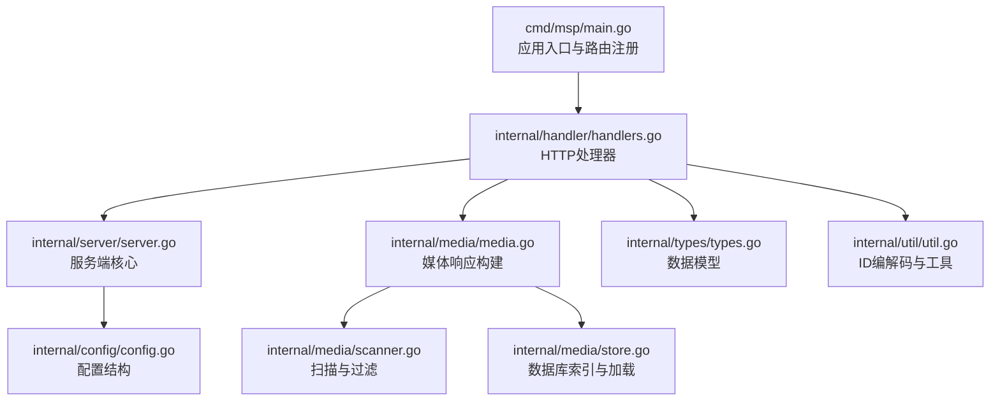
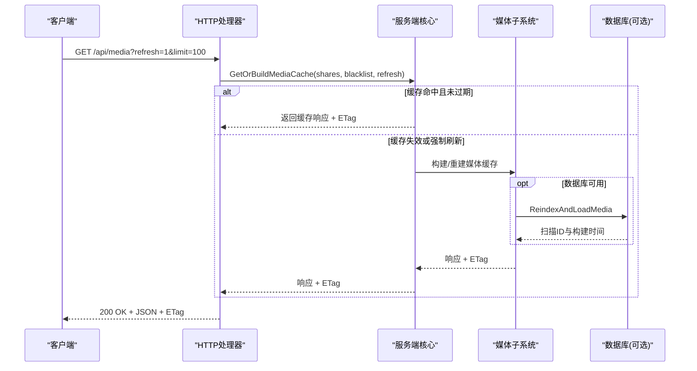
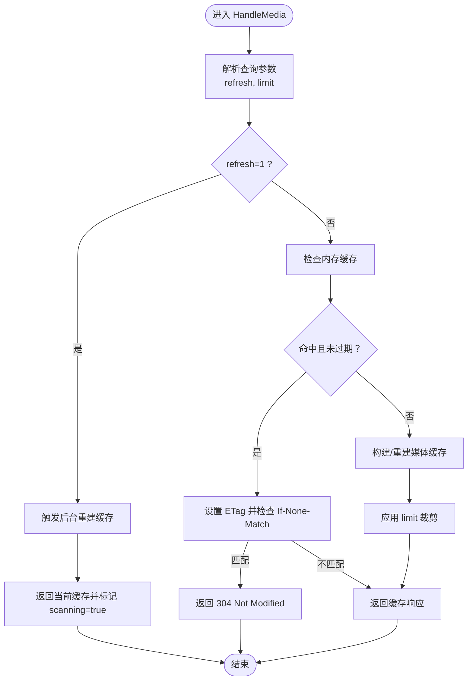
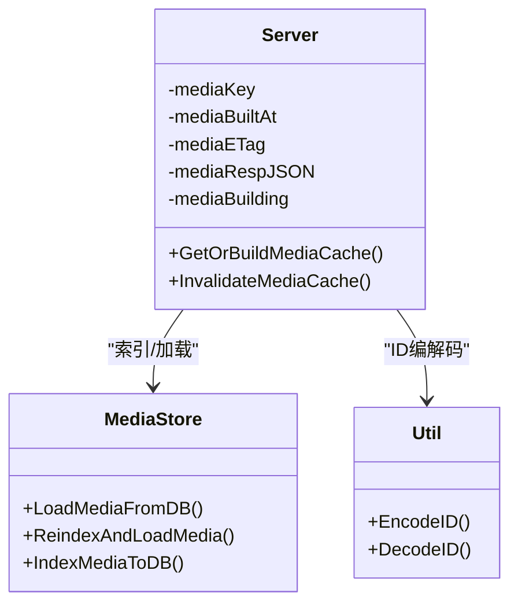
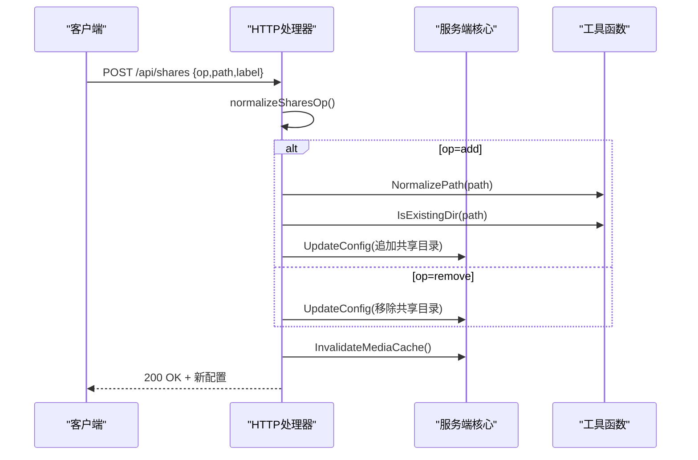
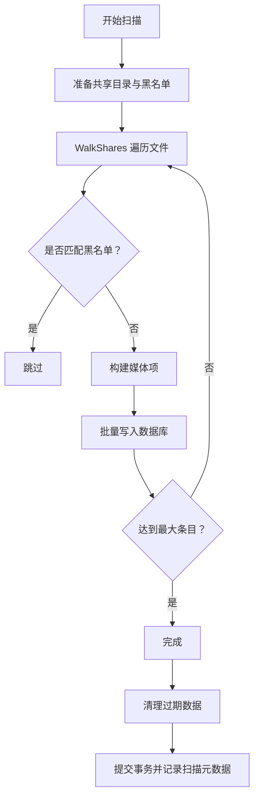
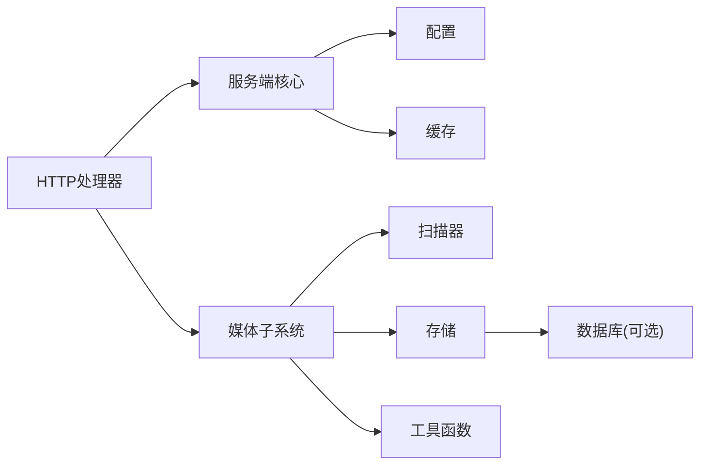

# 媒体管理API

<cite>
**本文引用的文件**
- [main.go](file://cmd/msp/main.go)
- [handlers.go](file://internal/handler/handlers.go)
- [server.go](file://internal/server/server.go)
- [media.go](file://internal/media/media.go)
- [scanner.go](file://internal/media/scanner.go)
- [store.go](file://internal/media/store.go)
- [types.go](file://internal/types/types.go)
- [util.go](file://internal/util/util.go)
- [config.go](file://internal/config/config.go)
- [API_REFERENCE.md](file://docs/API_REFERENCE.md)
- [CONFIG_EXAMPLE.md](file://docs/CONFIG_EXAMPLE.md)
</cite>

## 目录
1. [简介](#简介)
2. [项目结构](#项目结构)
3. [核心组件](#核心组件)
4. [架构总览](#架构总览)
5. [详细组件分析](#详细组件分析)
6. [依赖关系分析](#依赖关系分析)
7. [性能考量](#性能考量)
8. [故障排查指南](#故障排查指南)
9. [结论](#结论)
10. [附录](#附录)

## 简介
本文件为媒体管理API的完整技术文档，聚焦以下目标：
- 详细说明 /media 端点用于获取媒体列表，包括查询参数如 refresh 刷新缓存、limit 限制数量等。
- 解释媒体响应结构，包括 videos、audios、images、others 等分类和总数统计字段。
- 说明媒体缓存机制与 ETag 支持。
- 详细说明 /share 端点用于动态添加和移除共享目录。
- 介绍媒体扫描状态查询与增量更新机制。
- 说明媒体文件ID的编码与解码方法及使用示例。

## 项目结构
项目采用分层设计，核心模块如下：
- cmd/msp：应用入口，注册路由与启动HTTP服务。
- internal/handler：HTTP处理器，实现各API端点逻辑。
- internal/server：服务端核心，负责配置、缓存、日志、会话等。
- internal/media：媒体扫描、索引、缓存与数据库交互。
- internal/types：统一的数据模型定义。
- internal/util：通用工具函数（含ID编解码、路径处理等）。
- internal/config：配置结构与默认值。
- docs：官方API参考与配置示例文档。

图表来源
- [main.go](file://cmd/msp/main.go#L85-L107)
- [handlers.go](file://internal/handler/handlers.go#L333-L362)
- [server.go](file://internal/server/server.go#L332-L396)
- [media.go](file://internal/media/media.go#L12-L52)
- [scanner.go](file://internal/media/scanner.go#L25-L57)
- [store.go](file://internal/media/store.go#L17-L47)
- [types.go](file://internal/types/types.go#L54-L66)
- [util.go](file://internal/util/util.go#L18-L34)
- [config.go](file://internal/config/config.go#L77-L88)

章节来源
- [main.go](file://cmd/msp/main.go#L85-L107)
- [handlers.go](file://internal/handler/handlers.go#L333-L362)
- [server.go](file://internal/server/server.go#L332-L396)
- [media.go](file://internal/media/media.go#L12-L52)
- [scanner.go](file://internal/media/scanner.go#L25-L57)
- [store.go](file://internal/media/store.go#L17-L47)
- [types.go](file://internal/types/types.go#L54-L66)
- [util.go](file://internal/util/util.go#L18-L34)
- [config.go](file://internal/config/config.go#L77-L88)

## 核心组件
- HTTP处理器：负责解析请求、调用服务端能力、构造响应。
- 服务端核心：维护配置、缓存、日志、会话与媒体缓存。
- 媒体子系统：扫描共享目录、构建响应、数据库索引与增量更新。
- 数据模型：统一的媒体项、响应、扫描元数据等结构。
- 工具函数：ID编解码、路径规范化、大小解析、安全校验等。

章节来源
- [handlers.go](file://internal/handler/handlers.go#L28-L43)
- [server.go](file://internal/server/server.go#L31-L74)
- [media.go](file://internal/media/media.go#L12-L52)
- [types.go](file://internal/types/types.go#L16-L66)
- [util.go](file://internal/util/util.go#L18-L34)

## 架构总览
媒体管理API围绕“配置—缓存—扫描—响应”的主流程工作：
- 配置：通过 /api/config 获取或更新配置，支持热重载。
- 缓存：内存缓存与磁盘缓存（无数据库时）结合，使用弱ETag。
- 扫描：按共享目录与黑名单规则扫描，支持限流与增量索引。
- 响应：按类别分类返回媒体列表，支持limit裁剪与ETag条件返回。

图表来源
- [handlers.go](file://internal/handler/handlers.go#L333-L362)
- [server.go](file://internal/server/server.go#L332-L396)
- [store.go](file://internal/media/store.go#L33-L47)

## 详细组件分析

### /media 端点：媒体列表获取
- 方法与路径：GET /api/media
- 查询参数
  - refresh：1 表示强制触发后台重建缓存（返回当前可用数据并标记 scanning=true）。
  - limit：限制每个分类返回的数量，用于低内存环境。
- 响应结构
  - shares：共享目录列表。
  - videos/audios/images/others：媒体列表。
  - videosTotal/audiosTotal/imagesTotal/othersTotal：各分类总数（由服务端填充）。
  - limited：是否进行了裁剪。
  - scanning：后台扫描中（当refresh或缓存重建时）。
- 缓存与ETag
  - 若未刷新且缓存有效，设置 ETag 并支持 If-None-Match 条件返回 304。
  - 缓存过期时异步重建，保持快速响应。
- 限流与排序
  - limit 参数用于裁剪，避免一次性返回过多数据。
  - 媒体按共享标签与名称排序。

图表来源
- [handlers.go](file://internal/handler/handlers.go#L333-L411)
- [server.go](file://internal/server/server.go#L332-L396)

章节来源
- [handlers.go](file://internal/handler/handlers.go#L333-L411)
- [server.go](file://internal/server/server.go#L332-L396)
- [media.go](file://internal/media/media.go#L12-L52)
- [types.go](file://internal/types/types.go#L54-L66)

### 媒体响应结构与总数统计
- 结构字段
  - shares：共享目录数组。
  - videos/audios/images/others：媒体项数组。
  - videosTotal/audiosTotal/imagesTotal/othersTotal：各分类的总数（服务端在返回前计算）。
  - limited：是否发生裁剪。
  - scanning：后台扫描状态。
- 媒体项字段
  - id：媒体文件ID（Base64 URL安全编码）。
  - name/ext/size/modTime：文件名、扩展名、大小、修改时间。
  - kind：分类（video/audio/image/other）。
  - shareLabel：所属共享目录标签。
  - subtitles：字幕列表（视频）。
  - coverId/lyricsId：封面与歌词ID（音频）。
- 总数统计
  - 服务端在返回前为各分类设置 Total 字段，便于前端展示。

章节来源
- [types.go](file://internal/types/types.go#L16-L66)
- [handlers.go](file://internal/handler/handlers.go#L346-L356)

### 媒体缓存机制与ETag支持
- 缓存键
  - 基于共享目录与黑名单规则生成缓存键，确保内容变化时缓存失效。
- 内存缓存
  - 存储序列化的JSON字节、构建时间、ETag与键值。
  - TTL过期时异步重建，避免阻塞请求。
- 磁盘缓存（无数据库时）
  - 将缓存键、构建时间、ETag与响应持久化到磁盘文件，启动时尝试加载。
- ETag
  - 弱ETag，由缓存键与构建时间哈希生成，支持条件请求。
- 重建策略
  - refresh=1 或缓存过期时触发后台重建，返回当前可用数据并标记 scanning=true。

图表来源
- [server.go](file://internal/server/server.go#L332-L437)
- [store.go](file://internal/media/store.go#L17-L47)
- [util.go](file://internal/util/util.go#L18-L34)

章节来源
- [server.go](file://internal/server/server.go#L332-L437)
- [store.go](file://internal/media/store.go#L17-L47)
- [util.go](file://internal/util/util.go#L18-L34)

### /shares 端点：动态添加/移除共享目录
- 方法与路径：POST /api/shares
- 请求体
  - op：操作类型，"add" 或 "remove"。
  - path：共享目录绝对路径。
  - label：可选，目录标签；若省略则使用目录名。
- 行为
  - add：校验目录存在且为目录，去重与规范化后更新配置。
  - remove：根据路径移除对应共享目录。
  - 成功后使媒体缓存失效并返回最新配置。
- 错误处理
  - 路径不存在或不可访问时返回 400。
  - 其他内部错误返回 500。

图表来源
- [handlers.go](file://internal/handler/handlers.go#L68-L94)
- [handlers.go](file://internal/handler/handlers.go#L96-L149)
- [server.go](file://internal/server/server.go#L133-L138)
- [util.go](file://internal/util/util.go#L142-L146)

章节来源
- [handlers.go](file://internal/handler/handlers.go#L68-L94)
- [handlers.go](file://internal/handler/handlers.go#L96-L149)
- [server.go](file://internal/server/server.go#L133-L138)
- [util.go](file://internal/util/util.go#L142-L146)

### 媒体扫描状态查询与增量更新机制
- 扫描状态
  - 当 refresh=1 或缓存重建时，响应中标记 scanning=true，提示数据可能不完整。
- 增量更新
  - 数据库可用时，使用索引扫描（IndexMediaToDB）与数据库记录（MediaScan）实现增量更新。
  - 通过扫描ID与完成标志（Complete）控制清理与提交。
- 黑名单与限流
  - 支持按扩展名、文件名、文件夹名与大小规则过滤。
  - 支持最大扫描条目限制，避免长时间扫描。

图表来源
- [store.go](file://internal/media/store.go#L49-L94)
- [scanner.go](file://internal/media/scanner.go#L25-L57)
- [scanner.go](file://internal/media/scanner.go#L108-L146)

章节来源
- [store.go](file://internal/media/store.go#L49-L94)
- [scanner.go](file://internal/media/scanner.go#L25-L57)
- [scanner.go](file://internal/media/scanner.go#L108-L146)

### 媒体文件ID编码与解码
- 编码
  - 使用 Base64 URL安全编码，输入为绝对路径。
- 解码
  - 从ID还原为原始绝对路径，用于安全校验与文件打开。
- 安全性
  - 解码后进行路径安全校验（解析符号链接、防止越界），确保仅允许共享目录内的文件被访问。
- 使用示例
  - 流媒体：GET /api/stream?id=编码后的媒体ID。
  - 媒体探针：GET /api/probe?id=编码后的媒体ID。

章节来源
- [util.go](file://internal/util/util.go#L18-L34)
- [handlers.go](file://internal/handler/handlers.go#L448-L486)
- [handlers.go](file://internal/handler/handlers.go#L581-L621)

## 依赖关系分析
- 组件耦合
  - HTTP处理器依赖服务端核心与媒体子系统。
  - 服务端核心依赖配置、缓存与数据库（可选）。
  - 媒体子系统依赖扫描器、存储与工具函数。
- 关键依赖链
  - /api/media → Server.GetOrBuildMediaCache → Media.BuildMediaResponse/IndexMediaToDB → DB（可选）。
  - /api/shares → Server.UpdateConfig → Server.InvalidateMediaCache。

图表来源
- [handlers.go](file://internal/handler/handlers.go#L333-L362)
- [server.go](file://internal/server/server.go#L332-L396)
- [store.go](file://internal/media/store.go#L17-L47)
- [scanner.go](file://internal/media/scanner.go#L25-L57)
- [util.go](file://internal/util/util.go#L18-L34)

章节来源
- [handlers.go](file://internal/handler/handlers.go#L333-L362)
- [server.go](file://internal/server/server.go#L332-L396)
- [store.go](file://internal/media/store.go#L17-L47)
- [scanner.go](file://internal/media/scanner.go#L25-L57)
- [util.go](file://internal/util/util.go#L18-L34)

## 性能考量
- 缓存策略
  - 内存缓存与弱ETag减少重复扫描与网络传输。
  - 磁盘缓存（无数据库时）提升冷启动性能。
- 扫描优化
  - 批量写入数据库，降低事务开销。
  - 目录与文件遍历中使用黑名单快速过滤。
- 限流与裁剪
  - limit 参数与最大扫描条目限制，避免内存压力。
- 媒体流
  - 大文件设置缓存控制头，小文件禁用缓存，平衡性能与一致性。

## 故障排查指南
- /api/media 返回 304 Not Modified
  - 检查客户端是否正确设置 If-None-Match 头。
  - 服务端 ETag 由缓存键与构建时间生成，确保未强制刷新。
- /api/shares 返回 400
  - 检查请求体 op 是否为 "add" 或 "remove"。
  - add 时 path 是否存在且为目录。
- 媒体ID无效
  - 确认ID为Base64 URL安全编码，且解码后路径在共享目录范围内。
- 增量更新未生效
  - 确认数据库可用且扫描元数据记录正确。
  - 检查黑名单规则与最大扫描条目限制。

章节来源
- [handlers.go](file://internal/handler/handlers.go#L398-L411)
- [handlers.go](file://internal/handler/handlers.go#L117-L149)
- [util.go](file://internal/util/util.go#L148-L182)
- [store.go](file://internal/media/store.go#L17-L47)

## 结论
本API提供了高效、可扩展的媒体管理能力：
- 通过缓存与ETag显著降低重复请求成本。
- 支持动态共享目录管理与增量索引，适应多变的媒体库。
- 提供清晰的响应结构与ID编解码机制，便于前端集成与安全控制。
- 配置与文档完善，适合家庭与小型团队部署。

## 附录
- API参考与配置示例可参考官方文档：
  - [API_REFERENCE.md](file://docs/API_REFERENCE.md)
  - [CONFIG_EXAMPLE.md](file://docs/CONFIG_EXAMPLE.md)