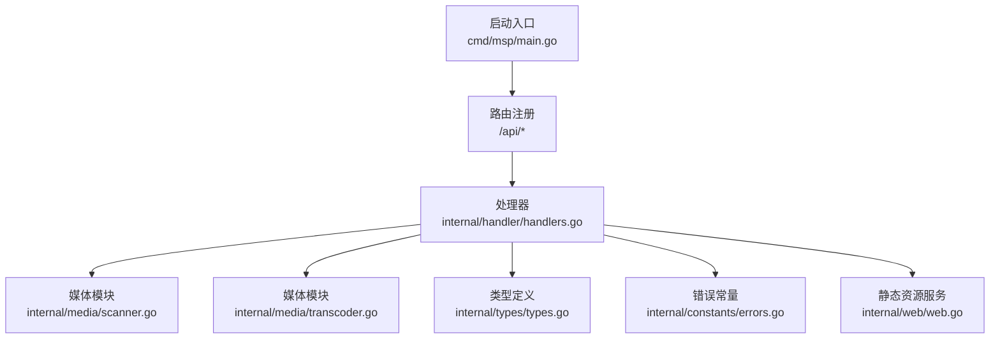
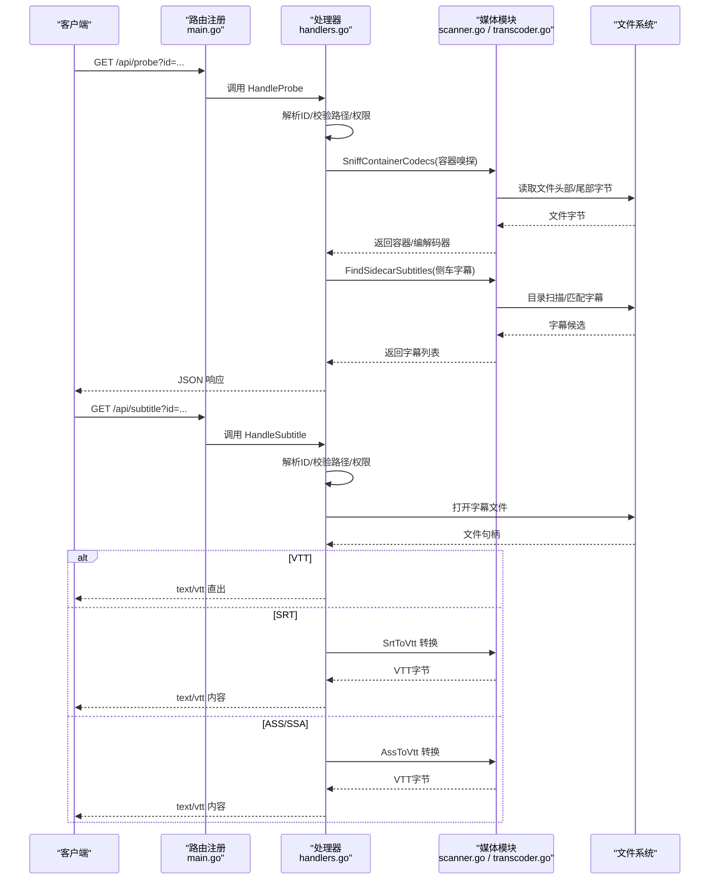
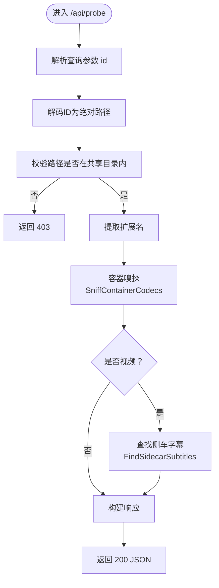
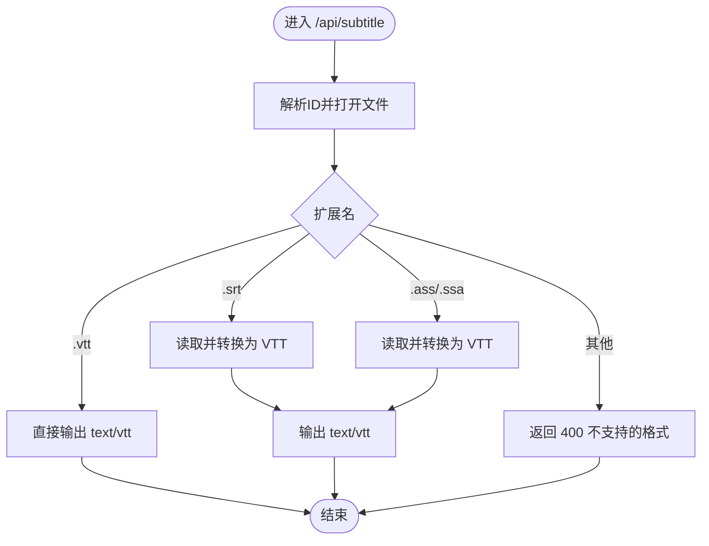
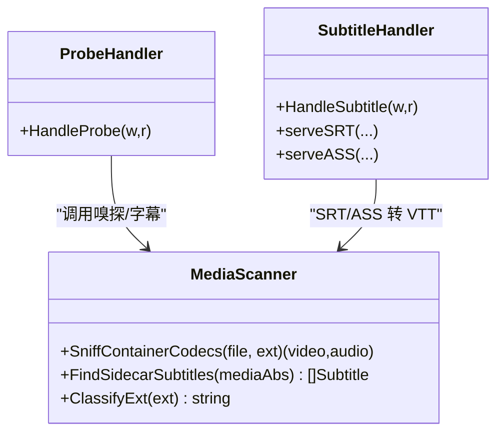
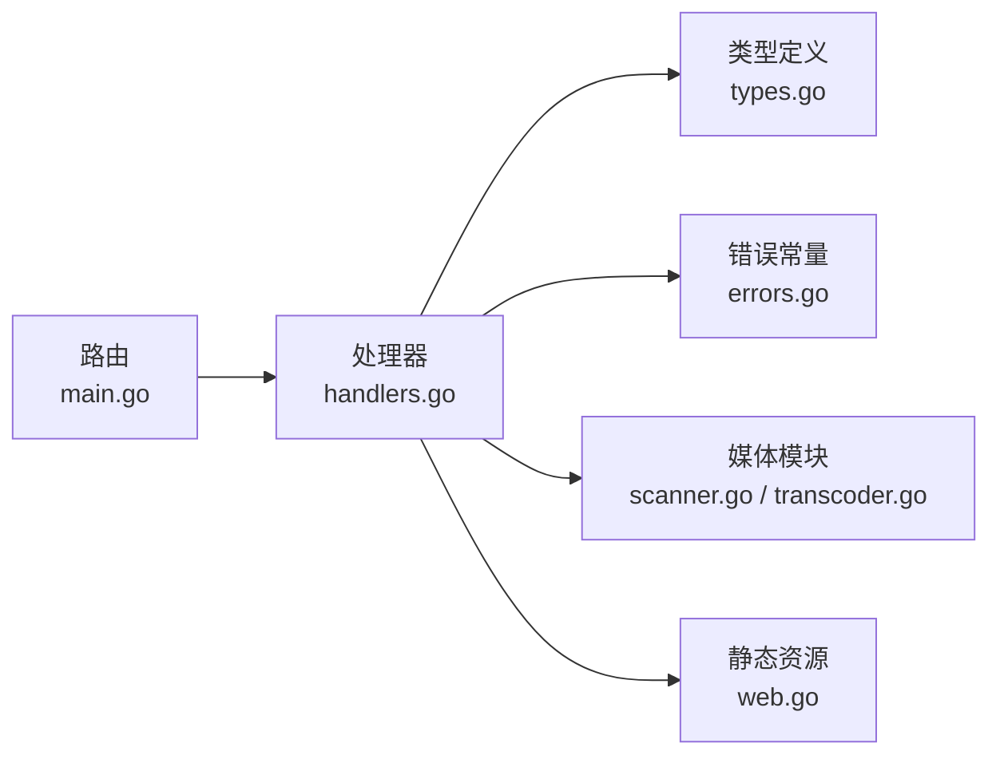

# 工具类API

<cite>
**本文引用的文件**
- [cmd/msp/main.go](file://cmd/msp/main.go)
- [internal/handler/handlers.go](file://internal/handler/handlers.go)
- [internal/media/scanner.go](file://internal/media/scanner.go)
- [internal/media/transcoder.go](file://internal/media/transcoder.go)
- [internal/types/types.go](file://internal/types/types.go)
- [internal/constants/errors.go](file://internal/constants/errors.go)
- [docs/API_REFERENCE.md](file://docs/API_REFERENCE.md)
- [config.example.json](file://config.example.json)
- [internal/web/web.go](file://internal/web/web.go)
</cite>

## 目录
1. [简介](#简介)
2. [项目结构](#项目结构)
3. [核心组件](#核心组件)
4. [架构总览](#架构总览)
5. [详细组件分析](#详细组件分析)
6. [依赖关系分析](#依赖关系分析)
7. [性能考量](#性能考量)
8. [故障排查指南](#故障排查指南)
9. [结论](#结论)
10. [附录](#附录)

## 简介
本文件系统性梳理工具类API，重点覆盖以下两个端点：
- /api/probe：媒体探测，返回容器、音视频编解码器与字幕信息，用于前端决策是否需要转码。
- /api/subtitle：字幕文件处理，支持 VTT、SRT、ASS/SSA 等格式转换与直出，统一以 WebVTT 输出给播放器。

同时，文档解释实现原理、性能与安全考虑、错误处理与边界情况，并提供客户端使用示例与集成指南。

## 项目结构
- 启动入口负责注册路由与中间件，绑定 /api/* 端点。
- 处理器模块负责业务逻辑与HTTP响应封装。
- 媒体模块负责媒体探测、字幕嗅探与转换、转码控制。
- 类型与常量定义提供统一的数据结构与错误消息。
- 文档与配置提供API参考与运行配置示例。

图表来源
- [cmd/msp/main.go](file://cmd/msp/main.go#L85-L107)
- [internal/handler/handlers.go](file://internal/handler/handlers.go#L1-L721)
- [internal/media/scanner.go](file://internal/media/scanner.go#L1-L870)
- [internal/media/transcoder.go](file://internal/media/transcoder.go#L1-L249)
- [internal/types/types.go](file://internal/types/types.go#L1-L112)
- [internal/constants/errors.go](file://internal/constants/errors.go#L1-L68)
- [internal/web/web.go](file://internal/web/web.go#L1-L84)

章节来源
- [cmd/msp/main.go](file://cmd/msp/main.go#L85-L107)
- [internal/handler/handlers.go](file://internal/handler/handlers.go#L1-L721)

## 核心组件
- 探针端点 /api/probe
  - 输入：媒体文件ID（查询参数 id）
  - 输出：容器、视频/音频编解码器、侧车字幕列表
  - 关键实现：调用媒体嗅探与侧车字幕查找
- 字幕端点 /api/subtitle
  - 输入：字幕文件ID（查询参数 id）
  - 输出：对应格式的字幕内容（VTT/SRT/ASS统一转换为VTT）
  - 关键实现：根据扩展名选择直出或转换

章节来源
- [internal/handler/handlers.go](file://internal/handler/handlers.go#L581-L684)
- [internal/media/scanner.go](file://internal/media/scanner.go#L578-L870)
- [docs/API_REFERENCE.md](file://docs/API_REFERENCE.md#L115-L135)

## 架构总览
下图展示工具类API的端到端流程：请求进入路由，经处理器解析参数与鉴权，调用媒体模块完成探测或字幕转换，最终返回JSON或字节流。

图表来源
- [cmd/msp/main.go](file://cmd/msp/main.go#L85-L107)
- [internal/handler/handlers.go](file://internal/handler/handlers.go#L581-L684)
- [internal/media/scanner.go](file://internal/media/scanner.go#L578-L870)
- [internal/media/transcoder.go](file://internal/media/transcoder.go#L1-L249)

## 详细组件分析

### /api/probe 媒体探测
- 功能概述
  - 返回媒体容器、视频/音频编解码器，以及该视频的侧车字幕列表。
  - 用于前端判断是否需要转码，或选择合适的字幕源。
- 关键流程
  - 解析并校验 id，解码为绝对路径，检查是否在共享目录内。
  - 读取文件扩展名，调用容器嗅探函数识别容器与编解码器。
  - 若为视频文件，扫描同目录下的字幕文件，构建字幕列表（含语言标签、默认项等）。
- 数据模型
  - 响应结构包含容器、视频/音频编解码器、字幕数组。

图表来源
- [internal/handler/handlers.go](file://internal/handler/handlers.go#L581-L621)
- [internal/media/scanner.go](file://internal/media/scanner.go#L578-L586)

章节来源
- [internal/handler/handlers.go](file://internal/handler/handlers.go#L581-L621)
- [internal/media/scanner.go](file://internal/media/scanner.go#L578-L586)
- [internal/types/types.go](file://internal/types/types.go#L91-L97)

### /api/subtitle 字幕处理
- 功能概述
  - 支持 VTT、SRT、ASS/SSA 三种格式。
  - VTT 直接输出；SRT/ASS/SSA 统一转换为 WebVTT 输出。
- 关键流程
  - 解析并校验 id，打开字幕文件。
  - 根据扩展名选择直出或转换。
  - 设置 Content-Type 为 text/vtt；限制最大字幕体积，避免过大文件导致内存压力。
- 技术细节
  - SRT 转 VTT：规范化换行、时间轴格式、去除序号行。
  - ASS/SSA 转 VTT：解析事件段落，清理样式标签，转换时间格式，合并文本。

图表来源
- [internal/handler/handlers.go](file://internal/handler/handlers.go#L623-L684)
- [internal/media/scanner.go](file://internal/media/scanner.go#L689-L870)

章节来源
- [internal/handler/handlers.go](file://internal/handler/handlers.go#L623-L684)
- [internal/media/scanner.go](file://internal/media/scanner.go#L689-L870)

### 媒体嗅探与侧车字幕检测机制
- 媒体嗅探
  - 读取文件头部与尾部有限字节，针对 MKV/MP4/MOV 等容器匹配特征字符串，识别视频/音频编解码器。
  - 通过预定义模式表快速判定编码类型。
- 侧车字幕检测
  - 基于视频文件名派生候选字幕名，尝试多种变体（去分辨率/编码/发布组等），匹配同目录字幕文件。
  - 自动排序：中文优先、其次按标签排序；首个字幕标记为默认。
  - 语言标签映射：将常见语言代码映射为显示标签。

图表来源
- [internal/media/scanner.go](file://internal/media/scanner.go#L578-L870)
- [internal/handler/handlers.go](file://internal/handler/handlers.go#L581-L684)

章节来源
- [internal/media/scanner.go](file://internal/media/scanner.go#L578-L870)

### 转码与播放策略（辅助理解）
- 转码开关与白名单
  - 仅允许指定格式（如 mp4、mp3、aac、webm、ogg）。
  - 限制并发转码会话，避免CPU过载。
- 智能参数选择
  - 视频：h264 直拷贝，否则使用 libx264 快速预设；音频：aac/mp3 直拷贝，否则转 AAC。
  - 输出格式优化：MP4 添加 faststart；保留时间戳便于进度条。
- 播放策略
  - 默认优先直连原始流；高风险容器/编码时再考虑转码。

章节来源
- [internal/media/transcoder.go](file://internal/media/transcoder.go#L1-L249)
- [docs/API_REFERENCE.md](file://docs/API_REFERENCE.md#L88-L106)

## 依赖关系分析
- 路由层
  - 启动入口注册 /api/* 路由，绑定处理器方法。
- 处理器层
  - 负责参数解析、鉴权、错误处理、响应封装。
  - 依赖媒体模块执行嗅探与字幕转换。
- 媒体模块
  - 提供嗅探、侧车字幕、SRT/ASS 转 VTT、转码能力。
- 类型与常量
  - 统一响应结构与错误消息，保证前后端契约一致。

图表来源
- [cmd/msp/main.go](file://cmd/msp/main.go#L85-L107)
- [internal/handler/handlers.go](file://internal/handler/handlers.go#L1-L721)
- [internal/types/types.go](file://internal/types/types.go#L1-L112)
- [internal/constants/errors.go](file://internal/constants/errors.go#L1-L68)
- [internal/media/scanner.go](file://internal/media/scanner.go#L1-L870)
- [internal/media/transcoder.go](file://internal/media/transcoder.go#L1-L249)
- [internal/web/web.go](file://internal/web/web.go#L1-L84)

## 性能考量
- 嗅探性能
  - 仅读取文件头部与尾部有限字节，避免全文件扫描；对大文件也只读取固定上限，降低IO与内存占用。
- 并发与限流
  - 转码并发限制为2，防止CPU争抢；转码失败时回退直连，提升鲁棒性。
- 缓存与响应
  - /api/media 支持 ETag/If-None-Match，减少重复传输。
  - /api/probe 结合前端缓存（示例代码中对结果进行本地缓存），避免频繁请求。
- 字幕体积限制
  - 对 SRT/ASS/SSA 转换设置了最大字节限制，防止超大字幕造成内存压力。

章节来源
- [internal/media/scanner.go](file://internal/media/scanner.go#L588-L616)
- [internal/media/transcoder.go](file://internal/media/transcoder.go#L15-L17)
- [internal/handler/handlers.go](file://internal/handler/handlers.go#L33-L36, file://internal/handler/handlers.go#L655-L684)
- [docs/API_REFERENCE.md](file://docs/API_REFERENCE.md#L61-L84)

## 故障排查指南
- 常见错误与原因
  - 400 缺少 id 或 bad id：检查查询参数 id 是否存在且合法。
  - 403 not allowed：路径不在共享目录内或被黑名单过滤。
  - 400 不支持的字幕格式：仅支持 VTT、SRT、ASS/SSA。
  - 413 payload too large：请求体超过限制（JSON相关接口）。
  - 413 subtitle too large：字幕文件超过最大体积限制。
  - 500 read failed：文件读取失败，检查文件权限与路径。
- 边界情况
  - 非视频文件：不会返回侧车字幕列表。
  - 字幕语言标签：若无法识别语言代码，保持原始token作为标签。
  - SRT/ASS/SSA 转 VTT：去除样式标签、规范化时间格式、处理换行。
- 安全与鉴权
  - /api/pin 可开启PIN认证，成功后设置会话Cookie；PIN验证失败返回 400。
  - /api/log 允许前端上报日志，便于定位问题。

章节来源
- [internal/constants/errors.go](file://internal/constants/errors.go#L1-L68)
- [internal/handler/handlers.go](file://internal/handler/handlers.go#L581-L684)
- [docs/API_REFERENCE.md](file://docs/API_REFERENCE.md#L181-L215)

## 结论
- /api/probe 与 /api/subtitle 是媒体探测与字幕处理的核心工具类API，前者提供容器与编解码器信息，后者统一输出 WebVTT，简化前端播放兼容性。
- 实现上采用轻量嗅探、侧车字幕智能匹配与格式转换，兼顾性能与可用性。
- 建议在前端结合探测结果与播放策略，优先直连，必要时再转码；对字幕采用统一VTT输出，确保跨平台一致性。

## 附录

### API 定义与使用示例
- /api/probe
  - 方法：GET
  - 查询参数：id（媒体文件ID）
  - 响应：包含容器、视频/音频编解码器与字幕列表
  - 参考：[API参考](file://docs/API_REFERENCE.md#L115-L135)
- /api/subtitle
  - 方法：GET
  - 查询参数：id（字幕文件ID）
  - 响应：text/vtt 内容
  - 参考：[API参考](file://docs/API_REFERENCE.md#L107-L114)

章节来源
- [docs/API_REFERENCE.md](file://docs/API_REFERENCE.md#L115-L135)
- [docs/API_REFERENCE.md](file://docs/API_REFERENCE.md#L107-L114)

### 客户端使用示例与集成指南
- 基础请求
  - 使用 fetch 发起 GET 请求，携带 id 参数。
  - 对 /api/probe 的结果进行缓存（示例：最多缓存100项）。
- 错误处理
  - 捕获异常并提示用户；根据错误消息区分“缺少参数”、“路径不允许”、“格式不支持”等场景。
- 集成建议
  - 在播放前先调用 /api/probe 判断容器与编解码器，再决定是否请求 /api/stream 或 /api/subtitle。
  - 对 SRT/ASS/SSA 字幕统一走 /api/subtitle，确保输出为 WebVTT。

章节来源
- [docs/API_REFERENCE.md](file://docs/API_REFERENCE.md#L115-L135)
- [web/src/modules/api.js](file://web/src/modules/api.js#L49-L96)

### 配置与部署要点
- 运行端口、共享目录、转码策略等可通过配置文件调整。
- 示例配置参考：[配置示例](file://config.example.json#L1-L56)

章节来源
- [config.example.json](file://config.example.json#L1-L56)