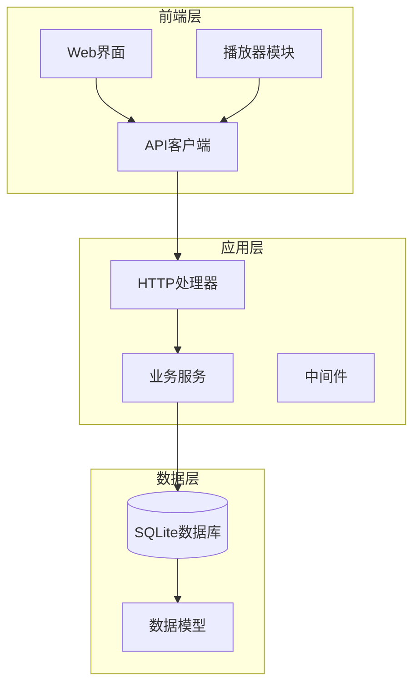
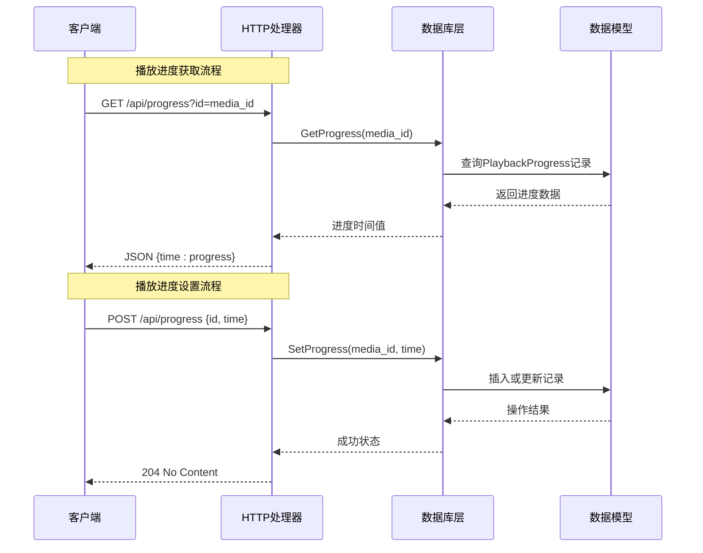
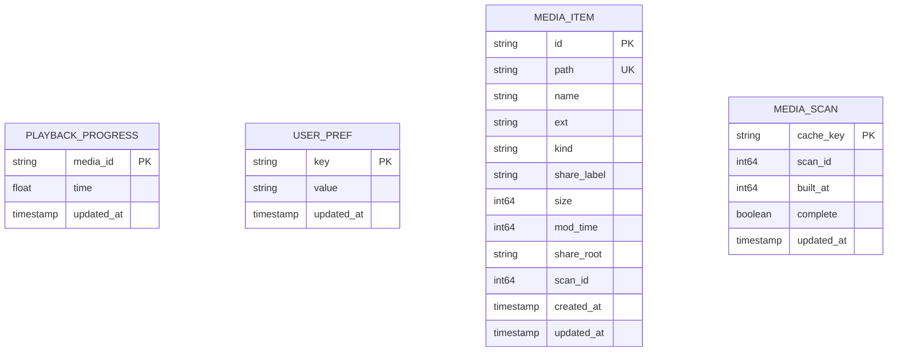
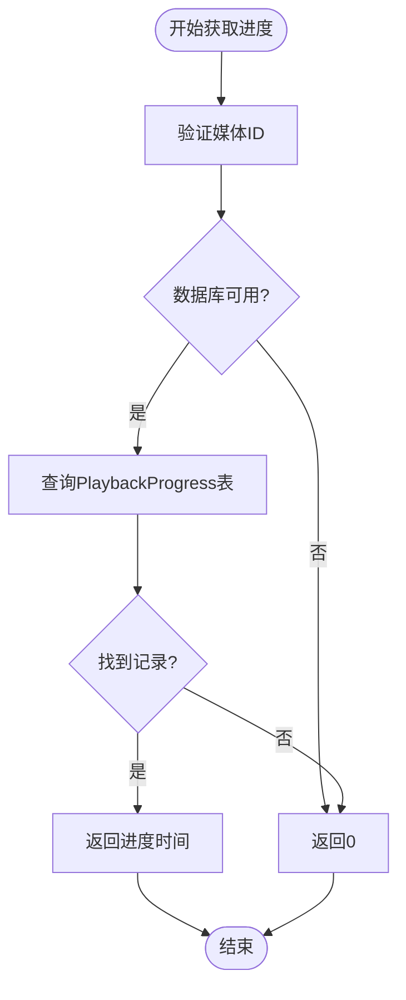
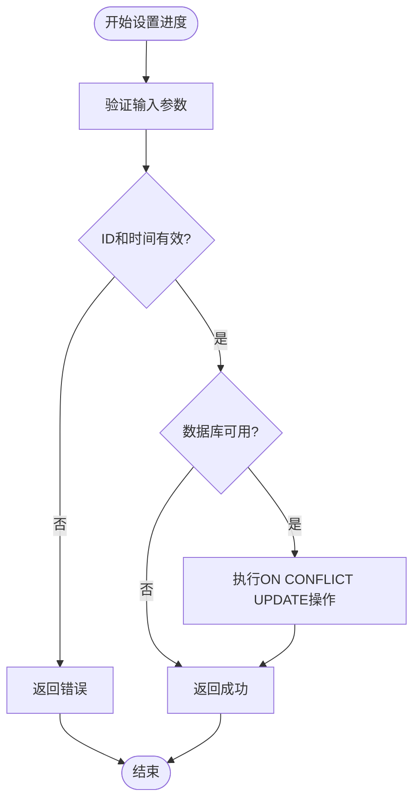
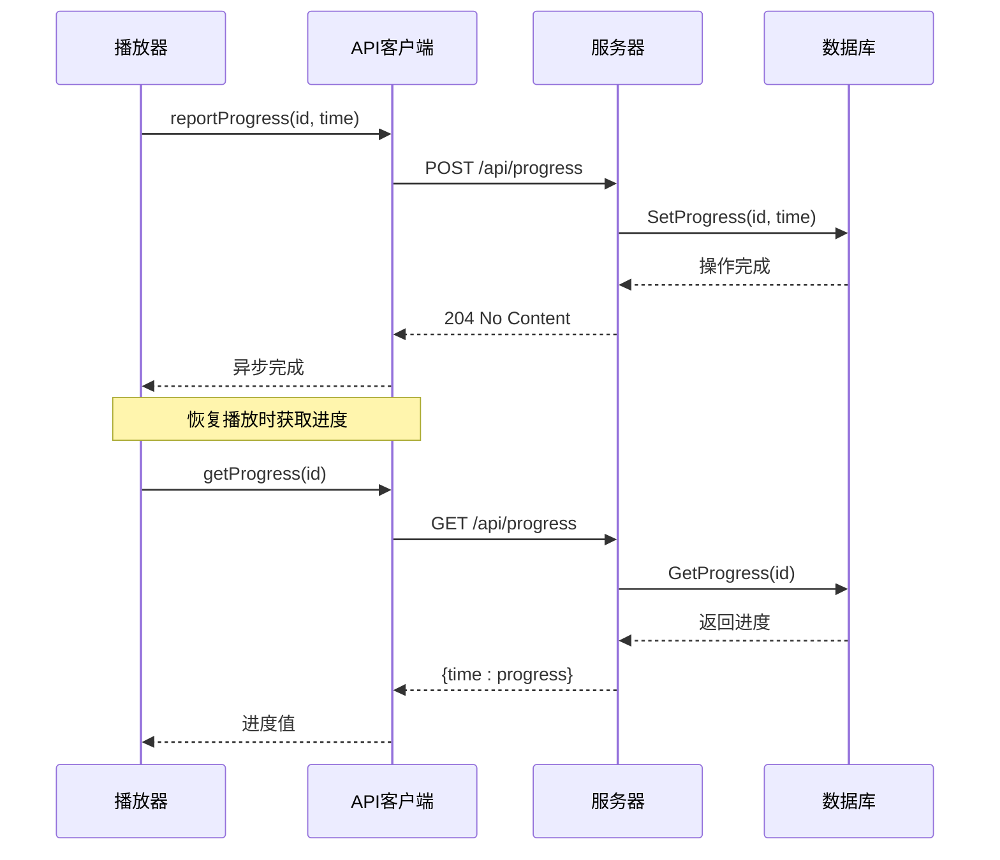
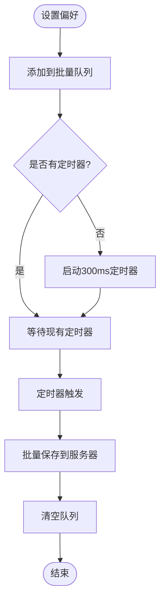
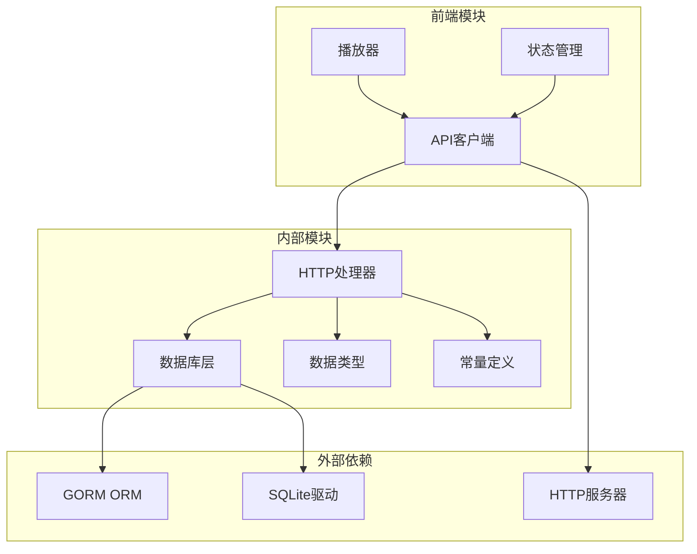

# 播放控制API

<cite>
**本文档引用的文件**
- [main.go](file://cmd/msp/main.go)
- [handlers.go](file://internal/handler/handlers.go)
- [db.go](file://internal/db/db.go)
- [types.go](file://internal/types/types.go)
- [api.js](file://web/src/modules/api.js)
- [player.js](file://web/src/modules/player.js)
- [errors.go](file://internal/constants/errors.go)
- [constants.go](file://internal/constants/constants.go)
- [state.js](file://web/src/modules/state.js)
</cite>

## 目录
1. [简介](#简介)
2. [项目结构](#项目结构)
3. [核心组件](#核心组件)
4. [架构概览](#架构概览)
5. [详细组件分析](#详细组件分析)
6. [依赖关系分析](#依赖关系分析)
7. [性能考虑](#性能考虑)
8. [故障排除指南](#故障排除指南)
9. [结论](#结论)

## 简介

播放控制API是MSP（Media Streaming Platform）项目的核心组件之一，负责提供媒体播放进度跟踪和用户偏好设置管理功能。该API采用RESTful设计原则，为前端播放器提供精确的播放控制能力，包括进度读取、进度设置、偏好管理等功能。

系统基于Go语言开发，使用SQLite作为数据存储后端，结合GORM ORM框架实现数据持久化。前端采用JavaScript模块化架构，通过HTTP接口与后端进行通信。

## 项目结构

MSP项目采用分层架构设计，主要分为以下层次：

**图表来源**
- [main.go](file://cmd/msp/main.go#L85-L107)
- [handlers.go](file://internal/handler/handlers.go#L38-L43)

**章节来源**
- [main.go](file://cmd/msp/main.go#L1-L151)
- [handlers.go](file://internal/handler/handlers.go#L1-L721)

## 核心组件

### 播放进度API (/api/progress)

播放进度API提供完整的播放进度跟踪功能，支持GET获取进度和POST设置进度两种操作模式。

#### GET /api/progress
- **功能**: 获取指定媒体文件的播放进度
- **参数**: 
  - `id`: 媒体文件ID（必需）
- **响应**: 包含`time`字段的JSON对象，表示播放进度（秒）

#### POST /api/progress
- **功能**: 保存媒体文件的播放进度
- **请求体**: JSON对象，包含`id`和`time`字段
- **响应**: 204 No Content（成功时）

### 用户偏好设置API (/api/prefs)

用户偏好设置API负责管理用户的播放偏好和配置信息。

#### GET /api/prefs
- **功能**: 获取所有用户偏好设置
- **响应**: 包含`prefs`字段的JSON对象，映射为键值对

#### POST /api/prefs
- **功能**: 批量更新用户偏好设置
- **请求体**: JSON对象，包含`prefs`字段（键值对映射）
- **响应**: 返回更新后的偏好设置

**章节来源**
- [handlers.go](file://internal/handler/handlers.go#L161-L190)
- [handlers.go](file://internal/handler/handlers.go#L192-L233)

## 架构概览

播放控制API采用分层架构，各层职责明确：

**图表来源**
- [handlers.go](file://internal/handler/handlers.go#L192-L233)
- [db.go](file://internal/db/db.go#L74-L99)

**章节来源**
- [handlers.go](file://internal/handler/handlers.go#L1-L721)
- [db.go](file://internal/db/db.go#L1-L270)

## 详细组件分析

### 数据库存储机制

系统使用SQLite作为数据存储后端，通过GORM ORM框架实现数据持久化。

#### 数据模型设计

**图表来源**
- [types.go](file://internal/types/types.go#L16-L52)

#### 数据库初始化配置

系统在启动时进行数据库初始化，配置包括：

- **WAL模式**: 启用写前日志模式，提高并发性能
- **连接池**: 单连接配置，避免SQLite锁竞争
- **缓存优化**: PRAGMA缓存大小设置为2MB
- **同步模式**: NORMAL模式平衡性能和安全性

**章节来源**
- [db.go](file://internal/db/db.go#L32-L72)

### 播放进度跟踪实现

#### 进度获取流程

**图表来源**
- [db.go](file://internal/db/db.go#L74-L86)

#### 进度设置流程

**图表来源**
- [db.go](file://internal/db/db.go#L88-L99)

**章节来源**
- [db.go](file://internal/db/db.go#L74-L99)

### 用户偏好设置管理

#### 偏好设置存储结构

用户偏好设置采用键值对存储方式，支持任意字符串类型的键和值。

#### 批量更新机制

系统提供批量更新功能，通过单次API调用更新多个偏好设置项，减少网络往返次数。

#### 优先级处理

前端实现双层存储机制：
1. **本地存储**: 使用localStorage存储偏好设置
2. **服务器存储**: 通过API同步到服务器数据库

**章节来源**
- [db.go](file://internal/db/db.go#L226-L259)
- [api.js](file://web/src/modules/api.js#L110-L144)

### 前端集成实现

#### 播放器进度同步

前端播放器通过以下机制实现进度同步：

**图表来源**
- [player.js](file://web/src/modules/player.js#L15-L50)
- [api.js](file://web/src/modules/api.js#L95-L108)

#### 偏好设置批量保存

前端实现300ms批量保存机制，将短时间内多次设置的偏好合并为一次网络请求：

**图表来源**
- [api.js](file://web/src/modules/api.js#L126-L144)

**章节来源**
- [player.js](file://web/src/modules/player.js#L15-L155)
- [api.js](file://web/src/modules/api.js#L95-L155)

## 依赖关系分析

播放控制API的依赖关系如下：

**图表来源**
- [handlers.go](file://internal/handler/handlers.go#L3-L26)
- [db.go](file://internal/db/db.go#L3-L16)

**章节来源**
- [handlers.go](file://internal/handler/handlers.go#L1-L721)
- [db.go](file://internal/db/db.go#L1-L270)

## 性能考虑

### 数据库性能优化

1. **WAL模式**: 启用写前日志模式，提高并发读写性能
2. **单连接配置**: 避免SQLite锁竞争问题
3. **缓存优化**: PRAGMA缓存大小设置为2MB
4. **索引设计**: 为常用查询字段建立索引

### 网络性能优化

1. **批量操作**: 偏好设置支持批量更新
2. **异步处理**: 进度保存采用异步方式，不影响播放体验
3. **缓存策略**: 前端实现本地缓存机制

### 内存管理

1. **垃圾回收**: 设置GC百分比为50，保持内存占用合理
2. **连接池**: 优化数据库连接池配置
3. **资源清理**: 及时关闭数据库连接

## 故障排除指南

### 常见错误及解决方案

#### 数据库连接问题
- **症状**: API调用返回500错误
- **原因**: 数据库初始化失败或连接异常
- **解决方案**: 检查数据库文件权限和磁盘空间

#### 进度获取失败
- **症状**: 获取播放进度返回0
- **原因**: 媒体ID无效或记录不存在
- **解决方案**: 验证媒体ID格式和有效性

#### 偏好设置保存失败
- **症状**: 偏好设置无法持久化
- **原因**: 网络连接异常或服务器错误
- **解决方案**: 检查网络连接和服务器状态

**章节来源**
- [errors.go](file://internal/constants/errors.go#L1-L68)

### 调试建议

1. **启用详细日志**: 检查服务器日志中的错误信息
2. **验证API响应**: 使用curl命令测试API端点
3. **监控数据库**: 检查数据库文件大小和性能指标
4. **前端调试**: 使用浏览器开发者工具查看网络请求

## 结论

播放控制API为MSP项目提供了完整的媒体播放控制能力，具有以下特点：

1. **简洁高效**: API设计简洁，响应速度快
2. **可靠稳定**: 基于SQLite的持久化存储，数据安全可靠
3. **易于扩展**: 模块化设计便于功能扩展和维护
4. **用户体验**: 支持精确的播放进度跟踪和偏好设置管理

该API为前端播放器提供了强大的后端支持，实现了跨设备的播放进度同步和个性化设置功能，为用户提供了优质的媒体播放体验。