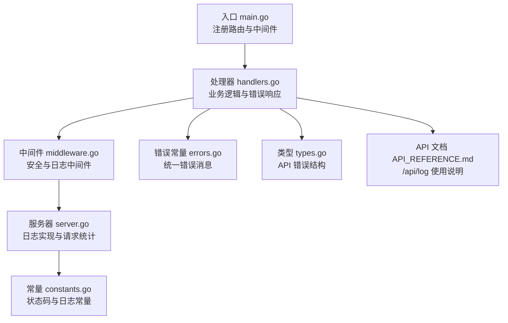
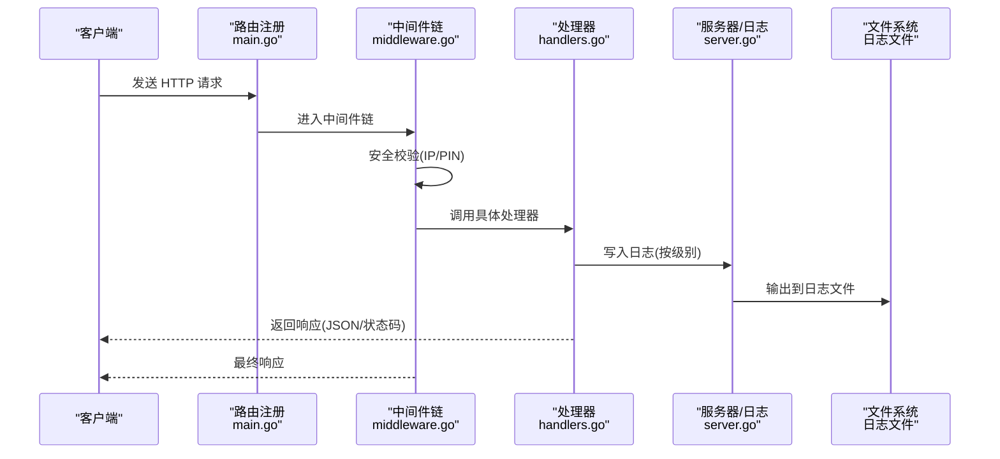
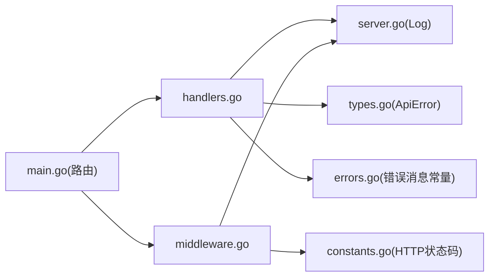

# 日志与错误处理

<cite>
**本文引用的文件**
- [main.go](file://cmd/msp/main.go)
- [handlers.go](file://internal/handler/handlers.go)
- [middleware.go](file://internal/handler/middleware.go)
- [server.go](file://internal/server/server.go)
- [errors.go](file://internal/constants/errors.go)
- [constants.go](file://internal/constants/constants.go)
- [types.go](file://internal/types/types.go)
- [API_REFERENCE.md](file://docs/API_REFERENCE.md)
</cite>

## 目录
1. [简介](#简介)
2. [项目结构](#项目结构)
3. [核心组件](#核心组件)
4. [架构总览](#架构总览)
5. [详细组件分析](#详细组件分析)
6. [依赖关系分析](#依赖关系分析)
7. [性能考量](#性能考量)
8. [故障排除指南](#故障排除指南)
9. [结论](#结论)
10. [附录](#附录)

## 简介
本文件聚焦于系统的日志与错误处理机制，涵盖以下内容：
- /api/log 远程日志记录端点的使用方式、日志级别与消息格式
- 错误码与错误消息的标准格式
- HTTP 状态码使用规范与错误响应结构
- 常见错误场景的诊断与解决方案
- 错误日志的收集与分析方法
- API 调用中的错误传播机制与异常处理策略
- 错误监控与告警配置指南
- 调试工具与故障排除实用技巧

## 项目结构
围绕日志与错误处理的关键模块如下：
- 入口与路由注册：cmd/msp/main.go
- 处理器层：internal/handler/handlers.go
- 中间件层：internal/handler/middleware.go
- 服务器与日志实现：internal/server/server.go
- 错误消息常量：internal/constants/errors.go
- 常量与状态码：internal/constants/constants.go
- 数据模型与错误结构：internal/types/types.go
- API 文档：docs/API_REFERENCE.md

图表来源
- [main.go](file://cmd/msp/main.go#L85-L107)
- [handlers.go](file://internal/handler/handlers.go#L235-L253)
- [middleware.go](file://internal/handler/middleware.go#L45-L52)
- [server.go](file://internal/server/server.go#L222-L248)
- [constants.go](file://internal/constants/constants.go#L97-L108)
- [errors.go](file://internal/constants/errors.go#L1-L68)
- [types.go](file://internal/types/types.go#L76-L78)
- [API_REFERENCE.md](file://docs/API_REFERENCE.md#L204-L215)

章节来源
- [main.go](file://cmd/msp/main.go#L85-L107)
- [handlers.go](file://internal/handler/handlers.go#L235-L253)
- [middleware.go](file://internal/handler/middleware.go#L45-L52)
- [server.go](file://internal/server/server.go#L222-L248)
- [constants.go](file://internal/constants/constants.go#L97-L108)
- [errors.go](file://internal/constants/errors.go#L1-L68)
- [types.go](file://internal/types/types.go#L76-L78)
- [API_REFERENCE.md](file://docs/API_REFERENCE.md#L204-L215)

## 核心组件
- 日志记录与级别控制
  - 服务器实现集中日志输出，支持 debug/info/error 三级，并根据配置过滤输出
  - 自动日志轮转，按大小阈值与计数间隔触发
- 错误消息标准化
  - 统一错误消息常量，便于前后端一致识别与展示
- HTTP 错误响应
  - 明确的状态码映射与错误响应结构，支持 JSON 错误对象
- 中间件链路
  - 安全中间件负责 IP 白黑名单与 PIN 认证
  - 日志中间件负责请求统计与日志输出
- /api/log 端点
  - 前端可上报错误或调试信息，后端以指定级别写入日志

章节来源
- [server.go](file://internal/server/server.go#L222-L248)
- [server.go](file://internal/server/server.go#L250-L284)
- [errors.go](file://internal/constants/errors.go#L1-L68)
- [constants.go](file://internal/constants/constants.go#L97-L108)
- [middleware.go](file://internal/handler/middleware.go#L77-L120)
- [middleware.go](file://internal/handler/middleware.go#L45-L52)
- [handlers.go](file://internal/handler/handlers.go#L235-L253)

## 架构总览
下图展示了从客户端请求到日志落盘的整体流程，以及错误传播与中间件的作用位置。

图表来源
- [main.go](file://cmd/msp/main.go#L65-L83)
- [middleware.go](file://internal/handler/middleware.go#L77-L120)
- [handlers.go](file://internal/handler/handlers.go#L235-L253)
- [server.go](file://internal/server/server.go#L222-L248)

## 详细组件分析

### /api/log 远程日志记录
- 端点定义与行为
  - 方法：POST
  - 路径：/api/log
  - 请求体：包含 level 与 msg 字段
  - 成功：无响应体，返回 204 No Content；若请求体解析失败则返回 400 或 413
- 日志级别与消息格式
  - 支持级别：error、info、debug
  - 消息格式：由服务器统一格式化输出，包含时间戳、级别与消息
- 配置与落盘
  - 日志文件路径来自配置，若未设置则使用默认路径
  - 支持日志轮转，按大小阈值与计数间隔触发
- 使用建议
  - 前端在捕获异常或调试时调用该端点，便于集中收集
  - 避免在高频场景中频繁上报，以免影响性能

章节来源
- [handlers.go](file://internal/handler/handlers.go#L235-L253)
- [types.go](file://internal/types/types.go#L108-L112)
- [server.go](file://internal/server/server.go#L222-L248)
- [server.go](file://internal/server/server.go#L190-L220)
- [API_REFERENCE.md](file://docs/API_REFERENCE.md#L204-L215)

### 错误码与错误消息标准
- HTTP 状态码
  - 200 OK、204 No Content、304 Not Modified、400 Bad Request、401 Unauthorized、403 Forbidden、404 Not Found、405 Method Not Allowed、413 Payload Too Large、500 Internal Server Error
- 错误消息常量
  - 包含 JSON 解析失败、配置读写失败、偏好设置读写失败、播放进度读写失败、缺少参数、非法 ID、访问被拒绝、未授权、无效请求、方法不允许、不支持的字幕格式等
- 错误响应结构
  - 统一使用 ApiError 结构体包装 message 字段
  - JSON 错误响应示例：{"error": {"message": "..."}}

章节来源
- [constants.go](file://internal/constants/constants.go#L97-L108)
- [errors.go](file://internal/constants/errors.go#L1-L68)
- [types.go](file://internal/types/types.go#L76-L78)
- [handlers.go](file://internal/handler/handlers.go#L686-L720)

### HTTP 状态码使用规范与错误响应结构
- 规范
  - 400：请求体解析失败、参数缺失或格式错误
  - 401：PIN 认证失败
  - 403：IP 黑名单拒绝、转码未启用
  - 404：资源不存在
  - 405：方法不允许
  - 413：请求体过大
  - 500：内部错误（数据库、文件系统、转码等）
- 错误响应
  - JSON 错误对象：{"error": {"message": "..."}}
  - 特殊场景：/api/progress 在解析失败时返回 {"error": "invalid json"} 或 {"error": "payload too large"}

章节来源
- [handlers.go](file://internal/handler/handlers.go#L16-L23)
- [handlers.go](file://internal/handler/handlers.go#L212-L218)
- [handlers.go](file://internal/handler/handlers.go#L241-L247)
- [middleware.go](file://internal/handler/middleware.go#L88-L93)
- [constants.go](file://internal/constants/constants.go#L97-L108)

### 错误传播机制与异常处理策略
- 处理器层
  - 对 JSON 解析失败进行区分：超大负载与非法 JSON，分别返回 413 与 400
  - 对数据库操作失败进行捕获并返回 500，同时记录日志
  - 对业务错误（如缺少参数、非法 ID）返回 400
- 中间件层
  - 安全中间件：IP 白黑名单拒绝返回 403；PIN 认证失败返回 401
  - 日志中间件：统计请求耗时与状态码，5xx 自动提升为 error 级别日志
- 服务器层
  - 统一日志输出与轮转，确保错误信息可追踪

章节来源
- [handlers.go](file://internal/handler/handlers.go#L686-L720)
- [handlers.go](file://internal/handler/handlers.go#L161-L190)
- [handlers.go](file://internal/handler/handlers.go#L235-L253)
- [middleware.go](file://internal/handler/middleware.go#L77-L120)
- [server.go](file://internal/server/server.go#L286-L311)

### 日志实现与中间件
- 日志级别与过滤
  - error：始终输出
  - info：当配置级别为 info 或 debug 时输出
  - debug：仅当配置级别为 debug 时输出
- 日志格式与轮转
  - 时间戳 + 级别 + 消息
  - 按大小阈值与计数间隔轮转
- 请求日志
  - 记录方法、路径、状态码、User-Agent、耗时
  - 5xx 自动标记为 error 级别
  - 新设备首次访问记录提示

章节来源
- [server.go](file://internal/server/server.go#L222-L248)
- [server.go](file://internal/server/server.go#L250-L284)
- [server.go](file://internal/server/server.go#L286-L311)
- [middleware.go](file://internal/handler/middleware.go#L45-L52)

### 安全中间件与错误处理
- IP 白黑名单
  - 支持精确 IP 与 CIDR，白名单优先
- PIN 认证
  - 仅对 /api/* 生效（豁免端点除外）
  - 通过 Cookie 或请求头传递会话令牌
- 安全头
  - 设置 nosniff、DENY、block XSS、严格来源策略等

章节来源
- [middleware.go](file://internal/handler/middleware.go#L77-L120)
- [middleware.go](file://internal/handler/middleware.go#L122-L132)
- [middleware.go](file://internal/handler/middleware.go#L203-L228)

## 依赖关系分析
- 处理器依赖服务器日志能力与配置服务
- 中间件依赖服务器配置与会话管理
- 错误常量与状态码为全局共享
- 类型定义统一错误结构

图表来源
- [handlers.go](file://internal/handler/handlers.go#L1-L26)
- [server.go](file://internal/server/server.go#L31-L56)
- [types.go](file://internal/types/types.go#L76-L78)
- [errors.go](file://internal/constants/errors.go#L1-L68)
- [constants.go](file://internal/constants/constants.go#L97-L108)
- [main.go](file://cmd/msp/main.go#L85-L107)

章节来源
- [handlers.go](file://internal/handler/handlers.go#L1-L26)
- [server.go](file://internal/server/server.go#L31-L56)
- [types.go](file://internal/types/types.go#L76-L78)
- [errors.go](file://internal/constants/errors.go#L1-L68)
- [constants.go](file://internal/constants/constants.go#L97-L108)
- [main.go](file://cmd/msp/main.go#L85-L107)

## 性能考量
- 日志轮转频率控制：通过计数间隔减少 Stat 开销
- JSON 编码优化：关闭 HTML 转义，避免额外字符转义成本
- 响应头缓存策略：针对不同内容类型设置合适的 Cache-Control
- 媒体流传输：支持断点续传与转码回退，降低解码失败概率

章节来源
- [server.go](file://internal/server/server.go#L243-L247)
- [handlers.go](file://internal/handler/handlers.go#L686-L697)
- [handlers.go](file://internal/handler/handlers.go#L566-L579)

## 故障排除指南
- 常见错误场景与诊断
  - 400/413：检查请求体大小与 JSON 格式；确认字段齐全
  - 401：确认 PIN 已启用且会话有效；检查 Cookie 或请求头
  - 403：检查 IP 是否在白名单或黑名单；确认转码策略
  - 404：确认资源 ID 是否正确；检查文件是否存在
  - 500：查看日志文件定位具体错误；关注数据库或文件系统异常
- 日志收集与分析
  - 查看配置中的日志文件路径；按时间顺序排查
  - 关注 5xx 请求与新设备访问提示
  - 使用轮转后的日志文件进行离线分析
- 调试工具与技巧
  - 使用 /api/ip 获取可用访问地址
  - 通过 /api/log 上报关键信息，便于复现问题
  - 合理设置日志级别：开发阶段使用 debug，生产环境使用 info

章节来源
- [handlers.go](file://internal/handler/handlers.go#L161-L190)
- [handlers.go](file://internal/handler/handlers.go#L235-L253)
- [middleware.go](file://internal/handler/middleware.go#L88-L120)
- [server.go](file://internal/server/server.go#L190-L220)
- [server.go](file://internal/server/server.go#L286-L311)
- [API_REFERENCE.md](file://docs/API_REFERENCE.md#L183-L215)

## 结论
本系统采用“中间件 + 处理器 + 服务器”的分层设计，实现了统一的日志输出与错误处理策略。通过明确的 HTTP 状态码与错误响应结构，结合安全中间件与日志轮转机制，能够有效支撑生产环境下的可观测性与稳定性。建议在生产环境中：
- 合理配置日志级别与轮转策略
- 明确错误响应规范并与前端协同
- 利用 /api/log 进行前端错误上报与归档
- 建立基于日志的监控与告警机制

## 附录
- /api/log 使用参考
  - 端点：POST /api/log
  - 请求体：{"level": "error|info|debug", "msg": "日志消息"}
  - 成功：204 No Content
  - 失败：400/413（解析失败/超大负载）

章节来源
- [API_REFERENCE.md](file://docs/API_REFERENCE.md#L204-L215)
- [handlers.go](file://internal/handler/handlers.go#L235-L253)
- [types.go](file://internal/types/types.go#L108-L112)