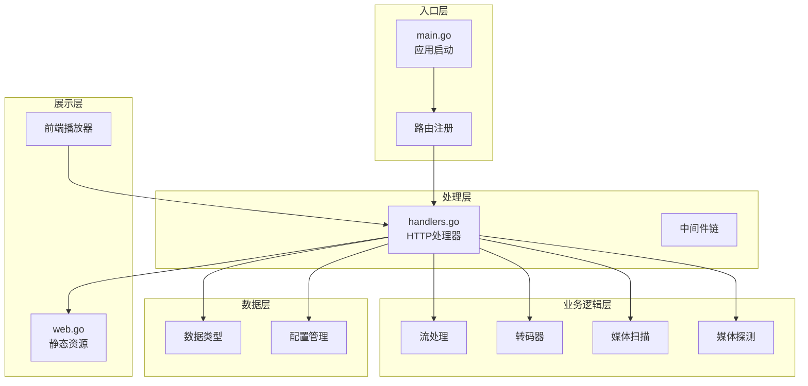
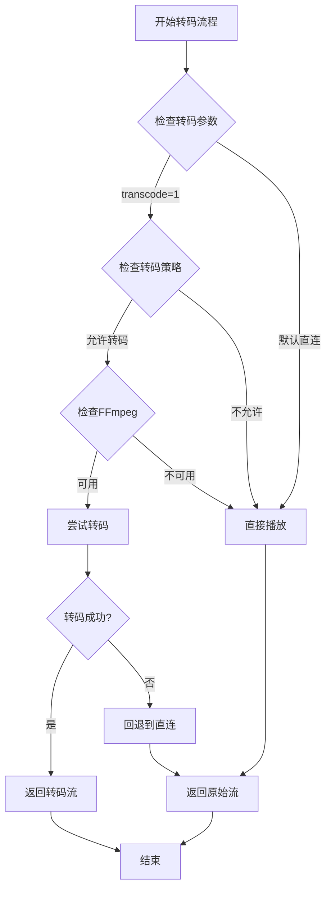
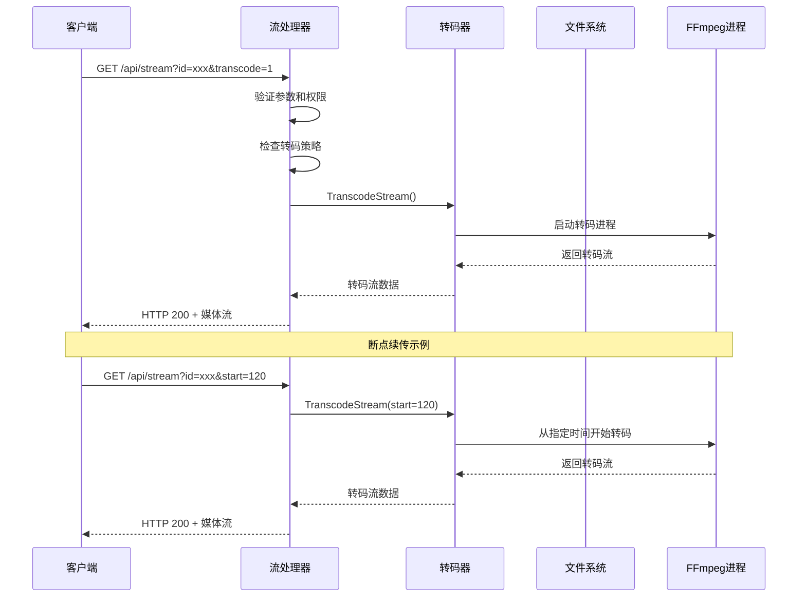
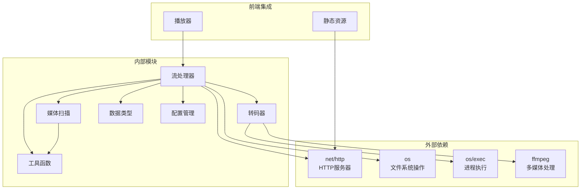
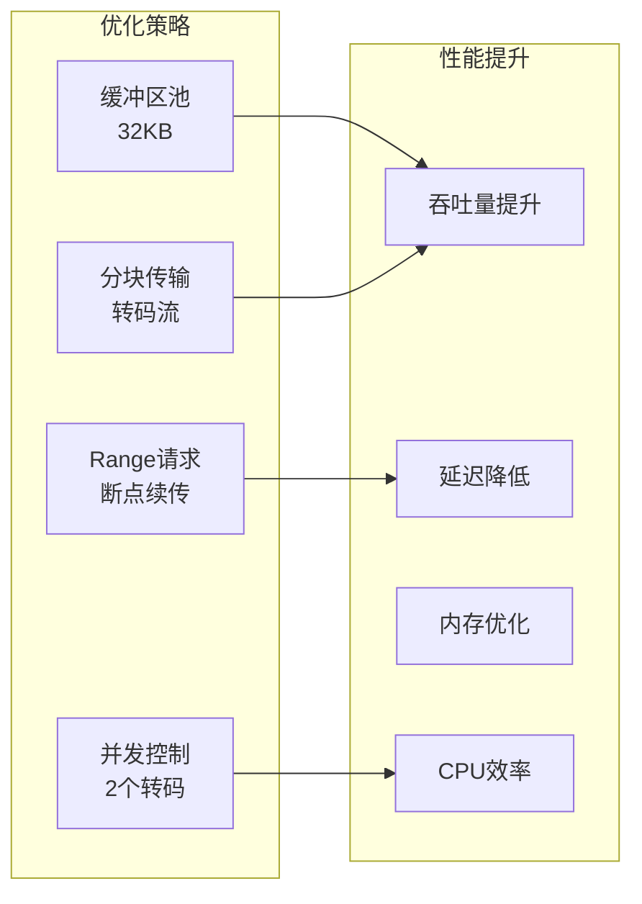

# 流媒体传输API

<cite>
**本文档引用的文件**
- [main.go](file://cmd/msp/main.go)
- [handlers.go](file://internal/handler/handlers.go)
- [transcoder.go](file://internal/media/transcoder.go)
- [scanner.go](file://internal/media/scanner.go)
- [types.go](file://internal/types/types.go)
- [config.go](file://internal/config/config.go)
- [web.go](file://internal/web/web.go)
- [API_REFERENCE.md](file://docs/API_REFERENCE.md)
- [PERFORMANCE_ANALYSIS.md](file://PERFORMANCE_ANALYSIS.md)
- [player.js](file://web/src/modules/player.js)
</cite>

## 目录
1. [简介](#简介)
2. [项目结构](#项目结构)
3. [核心组件](#核心组件)
4. [架构概览](#架构概览)
5. [详细组件分析](#详细组件分析)
6. [依赖关系分析](#依赖关系分析)
7. [性能考虑](#性能考虑)
8. [故障排除指南](#故障排除指南)
9. [结论](#结论)
10. [附录](#附录)

## 简介

流媒体传输API是MSP（Media Share & Preview）服务器的核心组件，负责提供高效的媒体文件流式传输服务。该API支持HTTP Range请求实现断点续传，提供直接播放和转码播放两种模式，并具备智能转码策略和完善的缓存机制。

本API主要服务于以下场景：
- 局域网媒体共享和播放
- 跨平台媒体流传输
- 智能转码适配不同播放设备
- 断点续传和进度保持
- 字幕支持和多语言字幕切换

## 项目结构



**图表来源**
- [main.go](file://cmd/msp/main.go#L85-L107)
- [handlers.go](file://internal/handler/handlers.go#L413-L446)
- [transcoder.go](file://internal/media/transcoder.go#L138-L249)

**章节来源**
- [main.go](file://cmd/msp/main.go#L26-L83)
- [handlers.go](file://internal/handler/handlers.go#L85-L107)

## 核心组件

### 流媒体传输端点

**/api/stream** 端点提供媒体文件的流式传输服务，支持以下特性：

#### 必需参数
- `id`: 媒体文件的唯一标识符（必需）

#### 可选参数
- `transcode`: 是否启用转码（1表示启用，默认0）
- `start`: 转码流的起始时间（秒）
- `format`: 目标格式（如mp4、mp3、webm等）
- `bitrate`: 目标码率（如2M、192k等）

#### HTTP方法支持
- GET: 获取媒体流
- HEAD: 获取响应头信息

**章节来源**
- [handlers.go](file://internal/handler/handlers.go#L413-L446)
- [API_REFERENCE.md](file://docs/API_REFERENCE.md#L88-L106)

### 转码策略

系统采用智能转码策略，根据媒体格式和播放需求动态选择最优方案：



**图表来源**
- [handlers.go](file://internal/handler/handlers.go#L430-L442)
- [transcoder.go](file://internal/media/transcoder.go#L138-L249)

**章节来源**
- [handlers.go](file://internal/handler/handlers.go#L513-L532)
- [transcoder.go](file://internal/media/transcoder.go#L195-L222)

### HTTP Range请求支持

系统完全支持HTTP Range请求实现断点续传和拖动功能：

- 设置 `Accept-Ranges: bytes` 响应头
- 使用 `http.ServeContent` 处理范围请求
- 支持随机访问和精确跳转
- 自动处理缓存和条件请求

**章节来源**
- [handlers.go](file://internal/handler/handlers.go#L566-L579)
- [web.go](file://internal/web/web.go#L67-L83)

## 架构概览



**图表来源**
- [handlers.go](file://internal/handler/handlers.go#L413-L446)
- [transcoder.go](file://internal/media/transcoder.go#L138-L249)

## 详细组件分析

### 流处理器组件

流处理器是媒体传输的核心组件，负责处理所有流媒体请求：

#### 主要职责
- 参数解析和验证
- 权限检查和路径验证
- 直连播放和转码播放决策
- HTTP响应头设置
- 错误处理和状态码返回

#### 关键方法

**resolveMediaTarget**: 解析和验证媒体文件路径
- 验证ID有效性
- 检查文件存在性和可访问性
- 应用共享目录白名单
- 返回文件句柄和元数据

**checkTranscodePolicy**: 检查转码策略
- 解析transcode参数
- 检查配置中的转码开关
- 验证媒体类型（视频/音频）
- 返回转码决策结果

**serveDirect**: 直接播放实现
- 设置适当的Content-Type
- 配置缓存策略
- 使用http.ServeContent处理Range请求
- 支持条件请求和ETag

**tryServeTranscode**: 转码播放实现
- 验证转码参数
- 调用TranscodeStream
- 设置转码响应头
- 返回转码流数据

**章节来源**
- [handlers.go](file://internal/handler/handlers.go#L448-L486)
- [handlers.go](file://internal/handler/handlers.go#L513-L532)
- [handlers.go](file://internal/handler/handlers.go#L566-L579)
- [handlers.go](file://internal/handler/handlers.go#L534-L564)

### 转码器组件

转码器负责将媒体文件转换为目标格式，支持多种输出格式和参数：

#### 转码选项
- **Format**: 目标格式（mp4、mp3、aac、webm、ogg）
- **Bitrate**: 目标码率（支持k、m后缀）
- **Offset**: 起始偏移量（秒）

#### 智能转码策略

**音频转码策略**:
- 目标格式为mp3/aac时，若源码率匹配则直接复制
- 否则使用libmp3lame编码器
- 支持自定义码率控制

**视频转码策略**:
- 视频流：h264直接复制，其他格式转码为libx264
- 音频流：aac/mp3直接复制，其他格式转码为aac
- 输出格式优化：添加faststart标志
- 时间戳处理：使用-copyts保持时间同步

#### 并发控制
- 全局转码并发限制（2个同时进行）
- 使用信号量防止CPU过载
- 自动资源清理和错误处理

**章节来源**
- [transcoder.go](file://internal/media/transcoder.go#L19-L70)
- [transcoder.go](file://internal/media/transcoder.go#L195-L222)
- [transcoder.go](file://internal/media/transcoder.go#L159-L173)

### 媒体扫描组件

媒体扫描组件负责发现和索引共享目录中的媒体文件：

#### 扫描策略
- 支持多共享目录遍历
- 黑名单过滤（扩展名、文件名、文件夹名、大小）
- 并发扫描优化
- 增量扫描支持

#### 文件分类
- 视频文件：.mp4, .webm, .mkv, .mov, .avi, .m4v, .wmv
- 音频文件：.mp3, .aac, .wav, .flac, .m4a, .ogg, .opus
- 图片文件：.jpg, .jpeg, .png, .gif, .webp, .bmp, .svg
- 其他文件：按扩展名分类

#### 字幕和歌词支持
- 外挂字幕文件自动发现（.vtt, .srt, .ass, .ssa）
- 歌词文件自动发现（.lrc）
- 字幕语言自动识别和排序
- 封面图片自动发现

**章节来源**
- [scanner.go](file://internal/media/scanner.go#L233-L246)
- [scanner.go](file://internal/media/scanner.go#L259-L285)
- [scanner.go](file://internal/media/scanner.go#L490-L576)

### 数据模型

系统使用标准化的数据模型来表示媒体信息：

#### MediaItem 结构
- `id`: 媒体文件唯一标识符
- `name`: 文件名
- `ext`: 文件扩展名
- `kind`: 媒体类型（video/audio/image/other）
- `shareLabel`: 共享目录标签
- `size`: 文件大小
- `modTime`: 修改时间
- `subtitles`: 字幕列表
- `coverId`: 封面图片ID
- `lyricsId`: 歌词文件ID

#### Subtitle 结构
- `id`: 字幕文件ID
- `label`: 显示标签
- `lang`: 语言代码
- `src`: 字幕源URL
- `default`: 是否默认字幕

#### 配置模型
- `playback.audio.transcode`: 音频转码开关
- `playback.video.transcode`: 视频转码开关
- `shares`: 共享目录配置
- `blacklist`: 黑名单规则

**章节来源**
- [types.go](file://internal/types/types.go#L16-L32)
- [types.go](file://internal/types/types.go#L8-L14)
- [config.go](file://internal/config/config.go#L23-L47)

## 依赖关系分析



**图表来源**
- [handlers.go](file://internal/handler/handlers.go#L1-L26)
- [transcoder.go](file://internal/media/transcoder.go#L3-L13)
- [scanner.go](file://internal/media/scanner.go#L3-L19)

### 组件耦合度分析

系统采用松耦合设计，各组件职责明确：

- **高内聚**: 每个组件专注于特定功能
- **低耦合**: 组件间通过清晰的接口交互
- **可扩展性**: 新增功能不影响现有组件
- **可测试性**: 组件独立，便于单元测试

**章节来源**
- [handlers.go](file://internal/handler/handlers.go#L28-L43)
- [transcoder.go](file://internal/media/transcoder.go#L15-L17)

## 性能考虑

### 缓存策略

系统实现了多层次的缓存机制：

#### 媒体列表缓存
- **缓存时间**: 2分钟
- **缓存内容**: 已扫描的媒体列表
- **失效机制**: 基于ETag和条件请求
- **重建策略**: 后台异步重建

#### 文件缓存
- **大文件**: 1小时内缓存
- **小文件**: 不缓存
- **静态资源**: 智能缓存策略

#### 转码缓存
- **并发限制**: 最多2个同时转码
- **资源回收**: 自动清理转码进程
- **错误处理**: 转码失败自动回退

### 性能优化措施



**图表来源**
- [PERFORMANCE_ANALYSIS.md](file://PERFORMANCE_ANALYSIS.md#L229-L258)

**章节来源**
- [PERFORMANCE_ANALYSIS.md](file://PERFORMANCE_ANALYSIS.md#L219-L266)

### 断点续传机制

系统完整支持HTTP Range请求：

#### 技术实现
- `Accept-Ranges: bytes` 响应头
- `Content-Range` 响应头
- `206 Partial Content` 状态码
- 条件请求支持（If-Range）

#### 用户体验
- 精确跳转支持
- 进度条拖动
- 网络中断恢复
- 智能重试机制

**章节来源**
- [handlers.go](file://internal/handler/handlers.go#L566-L579)
- [web.go](file://internal/web/web.go#L67-L83)

## 故障排除指南

### 常见问题及解决方案

#### 转码失败
**症状**: 转码请求返回错误
**原因分析**:
- FFmpeg未安装或不可执行
- 输入文件损坏
- 硬件资源不足
- 转码参数无效

**解决步骤**:
1. 检查FFmpeg安装状态
2. 验证输入文件完整性
3. 监控系统资源使用情况
4. 简化转码参数

#### 播放卡顿
**症状**: 媒体播放过程中出现卡顿
**可能原因**:
- 网络带宽不足
- 转码性能瓶颈
- 缓存配置不当
- 客户端解码能力限制

**优化建议**:
1. 调整转码码率
2. 启用合适的缓存策略
3. 优化网络环境
4. 选择兼容的播放格式

#### 字幕显示问题
**症状**: 字幕无法正常显示
**解决方法**:
1. 确认字幕文件格式（VTT/SRT/ASS）
2. 检查字幕语言代码
3. 验证字幕文件编码
4. 确认字幕与媒体文件关联

**章节来源**
- [handlers.go](file://internal/handler/handlers.go#L623-L684)
- [transcoder.go](file://internal/media/transcoder.go#L138-L173)

### 调试技巧

#### 日志记录
- 启用详细日志级别
- 监控转码进程状态
- 记录性能指标
- 追踪错误堆栈

#### 性能监控
- 监控转码并发数
- 跟踪内存使用情况
- 分析网络带宽
- 评估CPU利用率

## 结论

流媒体传输API提供了完整、高效、可靠的媒体流式传输解决方案。通过智能转码策略、完善的缓存机制和断点续传支持，系统能够适应各种播放场景和设备需求。

### 主要优势
- **灵活性**: 支持多种媒体格式和转码选项
- **性能**: 优化的缓存策略和并发控制
- **兼容性**: 智能转码适配不同播放设备
- **可靠性**: 完善的错误处理和回退机制

### 适用场景
- 家庭媒体中心
- 局域网媒体共享
- 跨平台媒体播放
- 移动设备媒体访问

## 附录

### 客户端集成示例

#### JavaScript集成
```javascript
// 基础流播放
function playMedia(mediaId, options = {}) {
    const baseUrl = '/api/stream';
    const params = new URLSearchParams({
        id: mediaId,
        transcode: options.transcode ? 1 : 0,
        start: options.start || 0,
        format: options.format || '',
        bitrate: options.bitrate || ''
    });
    
    const url = `${baseUrl}?${params}`;
    return fetch(url);
}

// 断点续传
function resumePlayback(mediaId, currentTime) {
    return playMedia(mediaId, {
        start: Math.floor(currentTime),
        transcode: detectDeviceCapabilities()
    });
}

// 字幕支持
function setupSubtitles(videoElement, subtitleList) {
    subtitleList.forEach(subtitle => {
        const track = document.createElement('track');
        track.kind = 'subtitles';
        track.label = subtitle.label;
        track.srclang = subtitle.lang;
        track.src = `/api/subtitle?id=${subtitle.id}`;
        videoElement.appendChild(track);
    });
}
```

#### 前端播放器集成
系统前端播放器提供了完整的集成示例：

- **自动转码回退**: 播放失败时自动尝试转码
- **智能字幕**: 支持外挂字幕和内封字幕
- **进度保持**: 自动保存和恢复播放进度
- **多设备适配**: 根据设备能力选择最佳播放方案

**章节来源**
- [player.js](file://web/src/modules/player.js#L270-L281)
- [player.js](file://web/src/modules/player.js#L394-L437)
- [player.js](file://web/src/modules/player.js#L557-L624)

### 配置参考

#### 转码配置
```json
{
    "playback": {
        "audio": {
            "transcode": true
        },
        "video": {
            "transcode": true
        }
    }
}
```

#### 性能优化配置
```json
{
    "maxItems": 1000,
    "blacklist": {
        "sizeRule": ">=100M"
    }
}
```