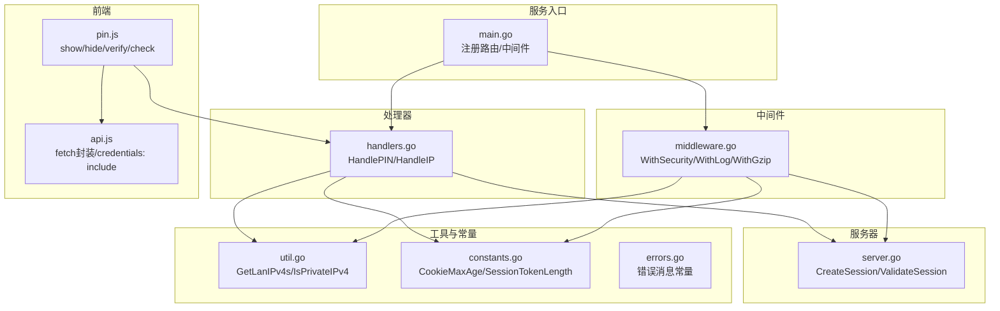
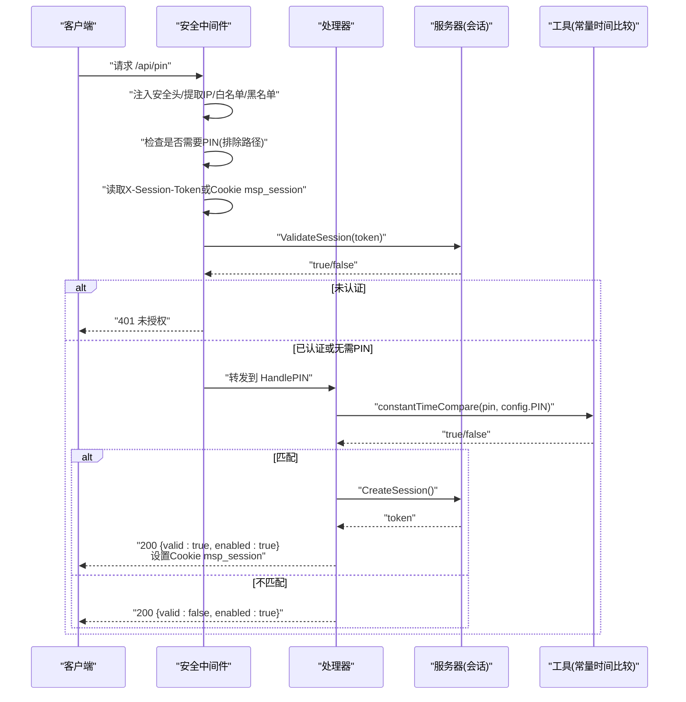
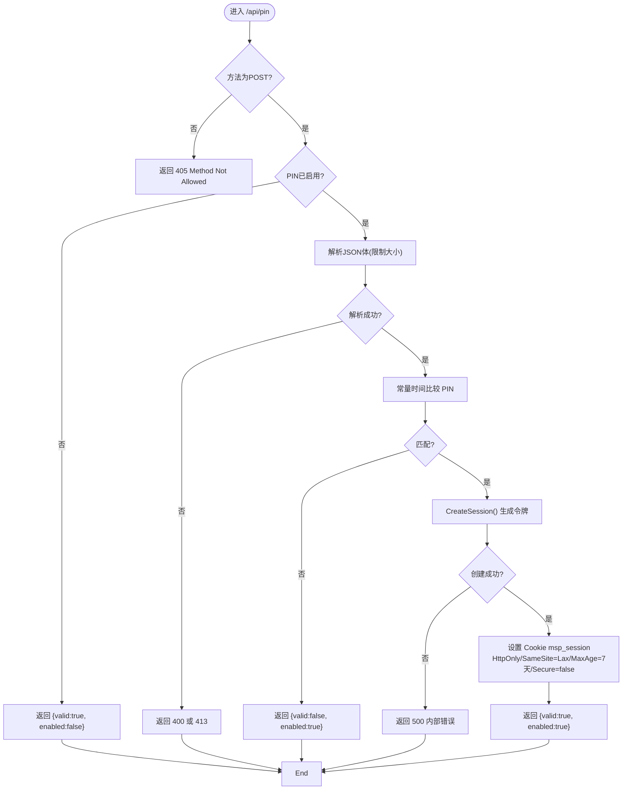
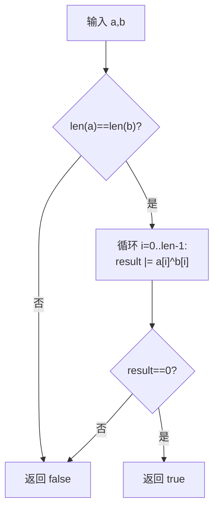
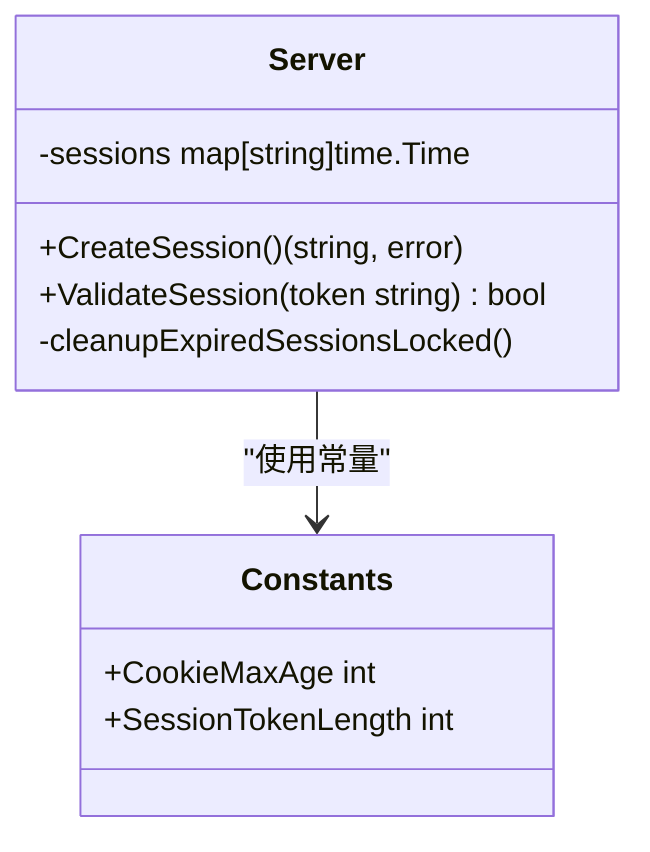
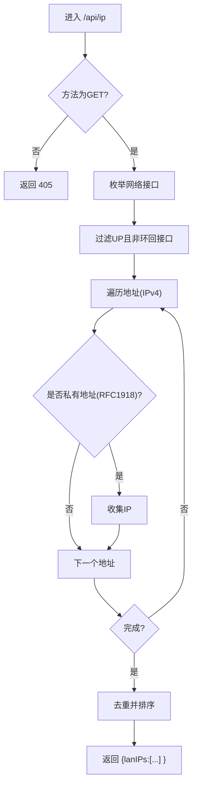
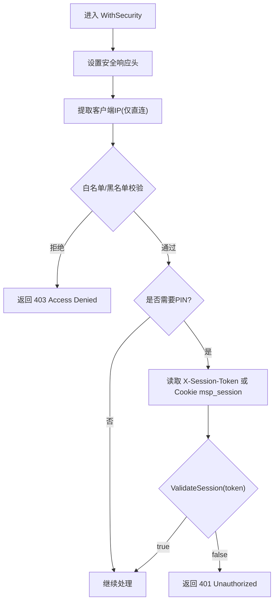
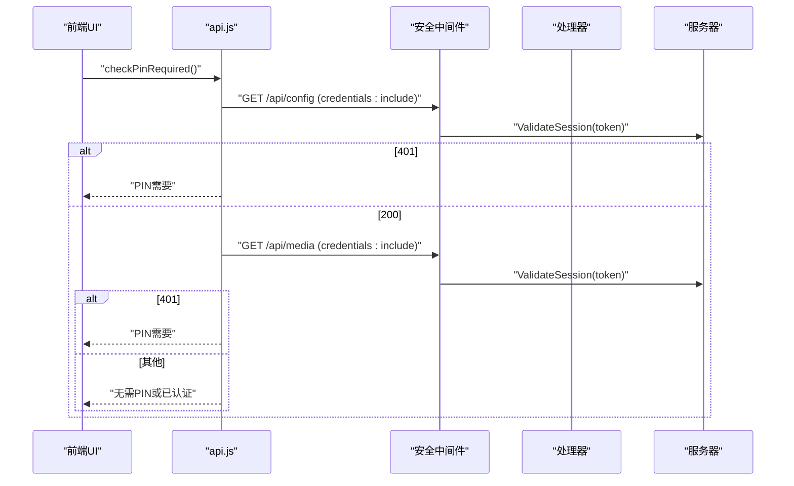
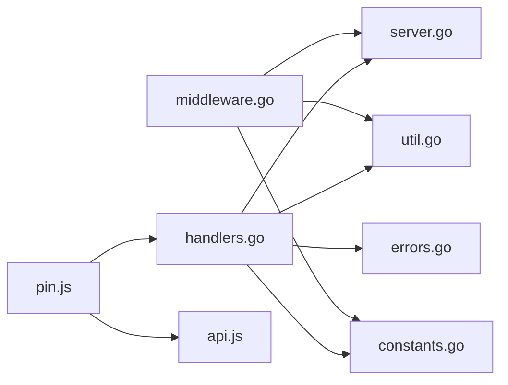

# 认证相关API

<cite>
**本文引用的文件**
- [cmd/msp/main.go](file://cmd/msp/main.go)
- [internal/handler/handlers.go](file://internal/handler/handlers.go)
- [internal/handler/middleware.go](file://internal/handler/middleware.go)
- [internal/server/server.go](file://internal/server/server.go)
- [internal/constants/constants.go](file://internal/constants/constants.go)
- [internal/constants/errors.go](file://internal/constants/errors.go)
- [internal/util/util.go](file://internal/util/util.go)
- [web/src/modules/pin.js](file://web/src/modules/pin.js)
- [web/src/modules/api.js](file://web/src/modules/api.js)
</cite>

## 目录
1. [简介](#简介)
2. [项目结构](#项目结构)
3. [核心组件](#核心组件)
4. [架构总览](#架构总览)
5. [详细组件分析](#详细组件分析)
6. [依赖关系分析](#依赖关系分析)
7. [性能考量](#性能考量)
8. [故障排查指南](#故障排查指南)
9. [结论](#结论)
10. [附录](#附录)

## 简介
本文件聚焦于认证相关API，特别是/PIN端点的PIN认证验证流程、会话创建与Cookie管理、常量时间比较算法、会话管理与安全Cookie设置、/ip端点的局域网IP查询、认证失败的错误处理与安全日志记录、认证状态检查与维护机制，以及客户端集成示例与安全建议。内容基于仓库中的实际实现进行梳理与可视化说明。

## 项目结构
认证相关能力由以下模块协同实现：
- 服务入口与路由注册：在服务启动时注册/PIN与/IP等API端点，并应用安全中间件链。
- 处理器层：实现/PIN与/IP的具体业务逻辑，负责请求解析、响应构造与错误处理。
- 中间件层：统一注入安全头、IP白名单/黑名单校验、PIN会话校验。
- 服务器层：会话令牌生成、会话校验与过期清理。
- 工具与常量：提供LAN IP枚举、常量时间比较、安全常量等。
- 前端模块：PIN对话框展示、PIN校验调用、认证状态检测与会话保持。

图表来源
- [cmd/msp/main.go](file://cmd/msp/main.go#L85-L107)
- [internal/handler/handlers.go](file://internal/handler/handlers.go#L255-L331)
- [internal/handler/middleware.go](file://internal/handler/middleware.go#L77-L120)
- [internal/server/server.go](file://internal/server/server.go#L572-L615)
- [internal/util/util.go](file://internal/util/util.go#L218-L273)
- [internal/constants/constants.go](file://internal/constants/constants.go#L45-L50)
- [web/src/modules/pin.js](file://web/src/modules/pin.js#L32-L72)
- [web/src/modules/api.js](file://web/src/modules/api.js#L16-L36)

章节来源
- [cmd/msp/main.go](file://cmd/msp/main.go#L85-L107)
- [internal/handler/handlers.go](file://internal/handler/handlers.go#L255-L331)
- [internal/handler/middleware.go](file://internal/handler/middleware.go#L77-L120)
- [internal/server/server.go](file://internal/server/server.go#L572-L615)
- [internal/util/util.go](file://internal/util/util.go#L218-L273)
- [internal/constants/constants.go](file://internal/constants/constants.go#L45-L50)
- [web/src/modules/pin.js](file://web/src/modules/pin.js#L32-L72)
- [web/src/modules/api.js](file://web/src/modules/api.js#L16-L36)

## 核心组件
- /PIN端点：接收客户端提交的PIN，进行常量时间比较，成功后创建会话令牌并设置安全Cookie。
- /IP端点：返回当前主机的局域网IPv4地址列表。
- 安全中间件：统一注入安全响应头，执行IP白名单/黑名单过滤，PIN认证拦截与会话校验。
- 会话管理：生成随机会话令牌，存储并按过期时间清理；提供会话校验能力。
- 常量时间比较：防止时序攻击的字符串比较算法。
- 错误与日志：统一错误消息常量与请求日志记录。

章节来源
- [internal/handler/handlers.go](file://internal/handler/handlers.go#L255-L331)
- [internal/handler/middleware.go](file://internal/handler/middleware.go#L77-L120)
- [internal/server/server.go](file://internal/server/server.go#L572-L615)
- [internal/constants/errors.go](file://internal/constants/errors.go#L53-L67)

## 架构总览
认证与安全控制的整体流程如下：
- 请求进入：先经安全中间件，再进入具体处理器。
- 安全中间件：
  - 注入安全响应头。
  - 仅信任直连TCP远端地址提取客户端IP，执行白名单/黑名单校验。
  - 对需要PIN保护的API路径，检查会话令牌（优先从请求头X-Session-Token，其次从Cookie msp_session），校验失败返回未授权。
- 处理器：
  - /PIN：若PIN启用，接收JSON体中的pin字段，常量时间比较，匹配则创建会话并设置Cookie。
  - /IP：返回LAN IPv4地址数组。
- 会话管理：服务器侧生成随机令牌并记录过期时间，定期清理过期项。

图表来源
- [internal/handler/middleware.go](file://internal/handler/middleware.go#L77-L120)
- [internal/handler/handlers.go](file://internal/handler/handlers.go#L255-L331)
- [internal/server/server.go](file://internal/server/server.go#L572-L615)
- [internal/constants/constants.go](file://internal/constants/constants.go#L45-L50)

## 详细组件分析

### /PIN端点：认证流程、会话创建与Cookie管理
- 请求方法与输入：仅接受POST，JSON体包含pin字段。
- PIN启用判断：若配置中未启用PIN，则直接返回valid=true且enabled=false。
- 请求体解析：限制最大字节数，超限返回413，非法JSON返回400。
- 常量时间比较：长度相等且逐字节异或累积结果为0才视为匹配，避免时序攻击。
- 会话创建与Cookie设置：
  - 成功匹配后生成随机会话令牌（长度由常量定义）。
  - 设置Cookie msp_session，属性包括HttpOnly、SameSite=Lax、MaxAge=7天、Secure=false（局域网模式）。
  - 响应返回valid=true与enabled=true。
- 失败处理：匹配失败返回valid=false与enabled=true；会话创建失败返回500。

图表来源
- [internal/handler/handlers.go](file://internal/handler/handlers.go#L255-L331)
- [internal/server/server.go](file://internal/server/server.go#L572-L590)
- [internal/constants/constants.go](file://internal/constants/constants.go#L45-L50)

章节来源
- [internal/handler/handlers.go](file://internal/handler/handlers.go#L255-L331)
- [internal/server/server.go](file://internal/server/server.go#L572-L590)
- [internal/constants/constants.go](file://internal/constants/constants.go#L45-L50)

### 常量时间比较算法：防时序攻击
- 实现要点：先比较长度，长度不同立即返回false；随后对每个字节进行异或并累积到result，最终只有result==0才认为匹配。
- 作用：无论输入多长，比较耗时与输入无关，避免通过观察响应时间推断正确PIN的部分字符。

图表来源
- [internal/handler/handlers.go](file://internal/handler/handlers.go#L321-L331)

章节来源
- [internal/handler/handlers.go](file://internal/handler/handlers.go#L321-L331)

### 会话管理与安全Cookie设置
- 会话令牌生成：使用加密安全的随机源生成指定长度字节，再以十六进制编码为字符串。
- 存储与过期：以令牌为键、过期时间为值存入内存映射表，过期时间由常量定义（7天）。
- 校验流程：读取令牌，检查是否存在且未过期；过期则删除并返回false。
- Cookie属性：名称msp_session，路径“/”，HttpOnly防止XSS窃取，SameSite=Lax，MaxAge=7天，Secure=false（局域网模式）。

图表来源
- [internal/server/server.go](file://internal/server/server.go#L572-L615)
- [internal/constants/constants.go](file://internal/constants/constants.go#L45-L50)

章节来源
- [internal/server/server.go](file://internal/server/server.go#L572-L615)
- [internal/constants/constants.go](file://internal/constants/constants.go#L45-L50)

### /IP端点：局域网IP地址查询
- 请求方法：GET。
- 返回内容：包含lanIPs字段，值为当前主机所有私有网络IPv4地址列表。
- 实现细节：遍历网络接口，过滤UP且非环回接口，提取IPv4地址，筛选RFC1918私有地址，去重并排序。

图表来源
- [internal/handler/handlers.go](file://internal/handler/handlers.go#L151-L159)
- [internal/util/util.go](file://internal/util/util.go#L218-L273)
- [internal/constants/constants.go](file://internal/constants/constants.go#L62-L80)

章节来源
- [internal/handler/handlers.go](file://internal/handler/handlers.go#L151-L159)
- [internal/util/util.go](file://internal/util/util.go#L218-L273)
- [internal/constants/constants.go](file://internal/constants/constants.go#L62-L80)

### 安全中间件：IP过滤、PIN会话校验与安全头
- 安全头：X-Content-Type-Options、X-Frame-Options、X-XSS-Protection、Referrer-Policy。
- IP策略：仅信任直连TCP远端地址，不信任代理头；支持白名单/黑名单，CIDR匹配。
- PIN拦截：对API路径（除特定豁免路径）要求会话有效；会话来源优先请求头X-Session-Token，其次Cookie msp_session。
- 会话校验：调用服务器ValidateSession，失败返回401。

图表来源
- [internal/handler/middleware.go](file://internal/handler/middleware.go#L77-L120)

章节来源
- [internal/handler/middleware.go](file://internal/handler/middleware.go#L77-L120)

### 认证状态检查与维护机制
- 客户端检查：通过访问/api/config与/api/media等受保护资源，结合响应状态判断是否需要PIN。
- 会话保持：前端使用fetch并携带credentials: include，确保Cookie随请求发送；PIN验证成功后刷新页面以建立带认证的会话。
- 服务器维护：定期清理过期会话，保证内存占用可控。

图表来源
- [web/src/modules/pin.js](file://web/src/modules/pin.js#L42-L72)
- [web/src/modules/api.js](file://web/src/modules/api.js#L16-L36)
- [internal/handler/middleware.go](file://internal/handler/middleware.go#L95-L118)

章节来源
- [web/src/modules/pin.js](file://web/src/modules/pin.js#L42-L72)
- [web/src/modules/api.js](file://web/src/modules/api.js#L16-L36)
- [internal/handler/middleware.go](file://internal/handler/middleware.go#L95-L118)

### 客户端认证集成示例与安全建议
- 前端集成步骤：
  - 在应用启动时调用检查函数，根据返回值决定是否显示PIN对话框。
  - 用户输入PIN后调用验证函数，成功后刷新页面以建立带认证的会话。
  - 所有后续API请求均需携带Cookie（fetch使用credentials: include）。
- 安全建议：
  - 局域网模式下Cookie未标记Secure，建议仅在可信局域网使用；若部署在公网或HTTPS环境，应在上游反向代理或服务端强制HTTPS。
  - 使用HttpOnly Cookie防止XSS窃取；SameSite=Lax可降低CSRF风险。
  - PIN启用后，所有受保护API路径均需会话校验；豁免路径仅限必要场景。
  - 定期清理过期会话，避免内存泄漏。

章节来源
- [web/src/modules/pin.js](file://web/src/modules/pin.js#L32-L112)
- [web/src/modules/api.js](file://web/src/modules/api.js#L16-L36)
- [internal/handler/middleware.go](file://internal/handler/middleware.go#L77-L120)
- [internal/server/server.go](file://internal/server/server.go#L572-L615)

## 依赖关系分析
- 处理器依赖：
  - 服务器：会话创建与校验。
  - 工具：LAN IP枚举与常量时间比较。
  - 常量：Cookie有效期与会话长度。
  - 错误：统一错误消息常量。
- 中间件依赖：
  - 服务器：会话校验。
  - 工具：IP提取与私有地址判断。
  - 常量：Cookie有效期与会话长度。
- 前端依赖：
  - 处理器：/api/pin与/api/ip。
  - 服务器：会话校验（间接通过中间件）。

图表来源
- [internal/handler/handlers.go](file://internal/handler/handlers.go#L255-L331)
- [internal/handler/middleware.go](file://internal/handler/middleware.go#L77-L120)
- [internal/server/server.go](file://internal/server/server.go#L572-L615)
- [internal/util/util.go](file://internal/util/util.go#L218-L273)
- [internal/constants/constants.go](file://internal/constants/constants.go#L45-L50)
- [internal/constants/errors.go](file://internal/constants/errors.go#L53-L67)
- [web/src/modules/pin.js](file://web/src/modules/pin.js#L32-L112)
- [web/src/modules/api.js](file://web/src/modules/api.js#L16-L36)

章节来源
- [internal/handler/handlers.go](file://internal/handler/handlers.go#L255-L331)
- [internal/handler/middleware.go](file://internal/handler/middleware.go#L77-L120)
- [internal/server/server.go](file://internal/server/server.go#L572-L615)
- [internal/util/util.go](file://internal/util/util.go#L218-L273)
- [internal/constants/constants.go](file://internal/constants/constants.go#L45-L50)
- [internal/constants/errors.go](file://internal/constants/errors.go#L53-L67)
- [web/src/modules/pin.js](file://web/src/modules/pin.js#L32-L112)
- [web/src/modules/api.js](file://web/src/modules/api.js#L16-L36)

## 性能考量
- 常量时间比较：O(n)线性复杂度，n为PIN长度，但避免分支导致的时序泄漏。
- 会话存储：内存映射表查找与过期清理均为O(1)/O(n)；定期清理减少存储规模。
- 中间件：IP匹配使用标准库CIDR解析，支持精确IP与CIDR两种形式；白/黑名单为空时跳过匹配。
- 压缩：对API响应启用gzip压缩（除流媒体与字幕），提升传输效率。

[本节为通用性能讨论，不直接分析具体文件]

## 故障排查指南
- /api/pin返回401：
  - 可能原因：会话令牌无效或过期；IP不在白名单或在黑名单；PIN未启用但客户端仍尝试校验。
  - 排查步骤：确认Cookie msp_session存在且未过期；检查安全中间件日志；确认配置中PIN启用状态。
- /api/pin返回400/413：
  - 可能原因：请求体过大或JSON格式错误。
  - 排查步骤：检查请求体大小与JSON格式；查看错误消息常量。
- /api/ip返回空列表：
  - 可能原因：主机无可用UP且非环回的IPv4接口；私有地址范围判断异常。
  - 排查步骤：检查网络接口状态；确认私有地址范围常量。
- 安全日志：
  - 中间件在拒绝访问时记录“Access denied for IP”；可通过服务端日志定位问题。

章节来源
- [internal/handler/middleware.go](file://internal/handler/middleware.go#L89-L93)
- [internal/constants/errors.go](file://internal/constants/errors.go#L53-L67)
- [internal/handler/handlers.go](file://internal/handler/handlers.go#L274-L287)

## 结论
本认证体系通过安全中间件统一注入安全头、执行IP白/黑名单与PIN会话校验，结合/PIN端点的常量时间比较与会话Cookie管理，提供了在局域网场景下的基础认证能力。配合/IP端点的LAN IP查询与统一错误消息常量，整体实现了可维护、可扩展且具备基本安全性的认证方案。建议在公网部署时增加HTTPS与更严格的会话策略。

[本节为总结性内容，不直接分析具体文件]

## 附录
- 关键常量：
  - CookieMaxAge：7天
  - SessionTokenLength：32字节（生成64字符十六进制）
- 错误消息常量：
  - Unauthorized、Access Denied、Invalid request、JSON解析失败等

章节来源
- [internal/constants/constants.go](file://internal/constants/constants.go#L45-L50)
- [internal/constants/errors.go](file://internal/constants/errors.go#L53-L67)