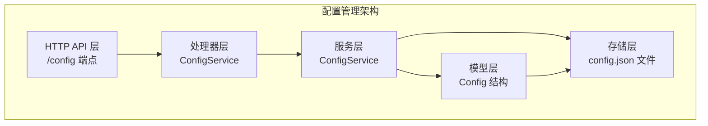
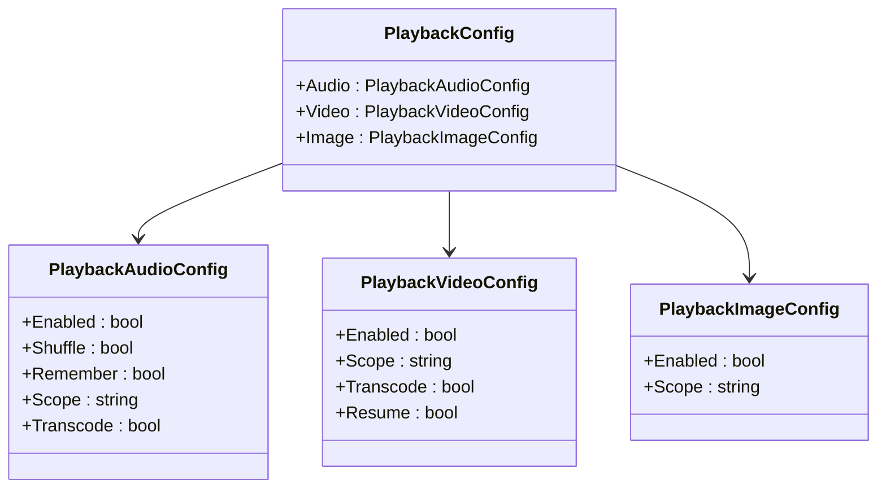
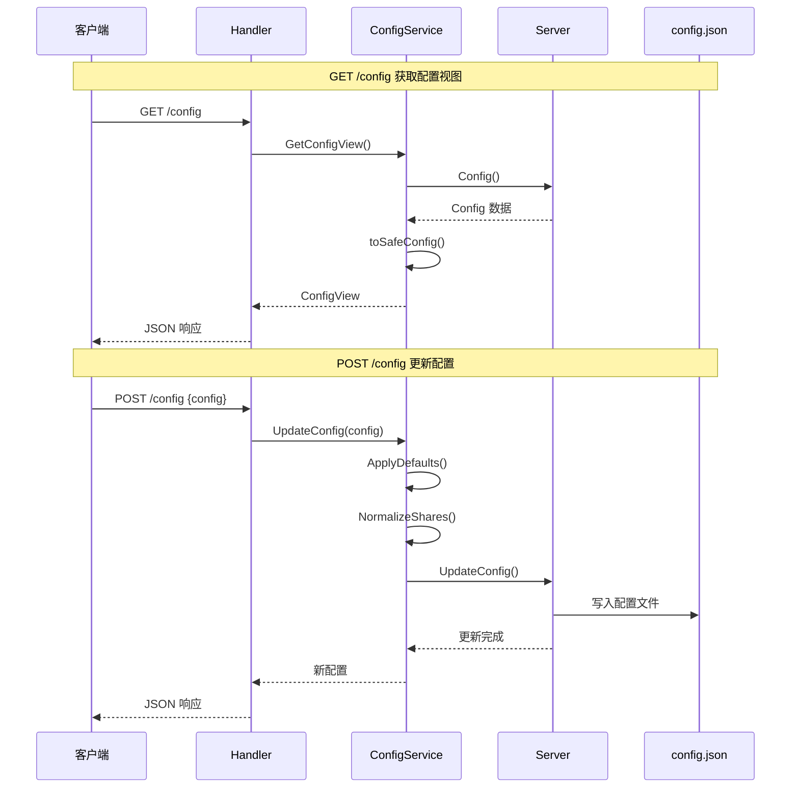
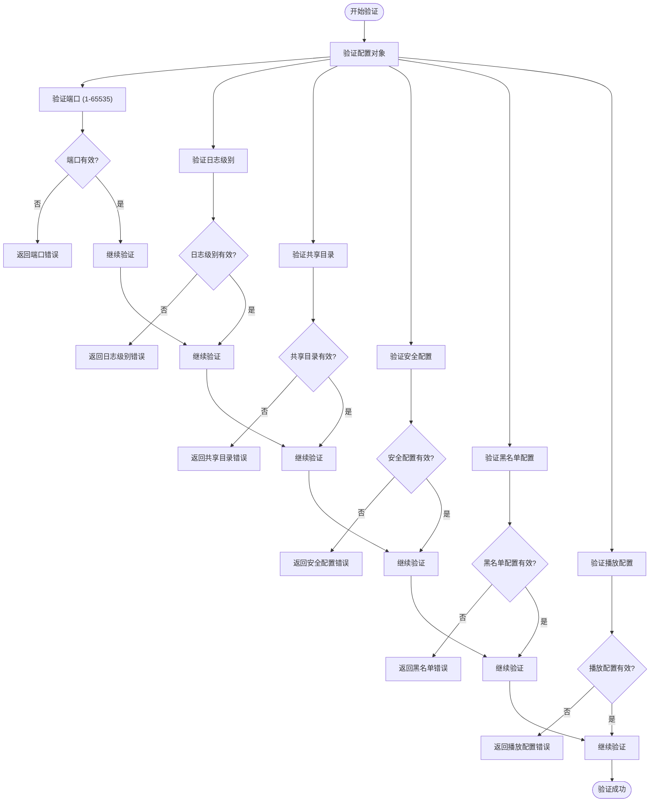
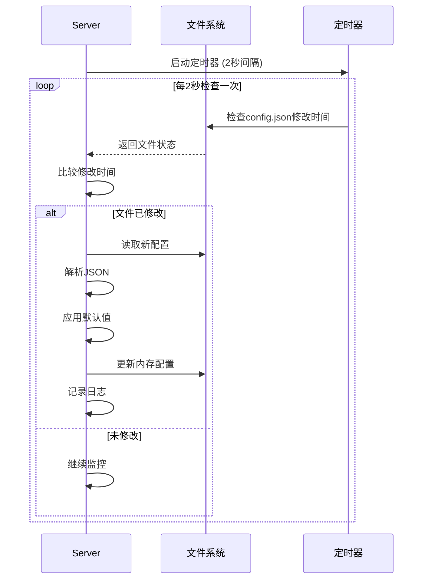
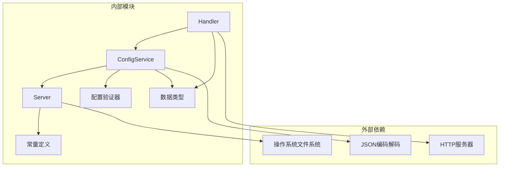

# 配置管理API

<cite>
**本文档引用的文件**
- [internal/config/config.go](file://internal/config/config.go)
- [internal/config/validate.go](file://internal/config/validate.go)
- [internal/service/config.go](file://internal/service/config.go)
- [internal/handler/handlers.go](file://internal/handler/handlers.go)
- [internal/server/server.go](file://internal/server/server.go)
- [internal/types/types.go](file://internal/types/types.go)
- [internal/constants/constants.go](file://internal/constants/constants.go)
- [config.example.json](file://config.example.json)
- [docs/CONFIG_EXAMPLE.md](file://docs/CONFIG_EXAMPLE.md)
- [docs/SECURITY.md](file://docs/SECURITY.md)
</cite>

## 目录
1. [简介](#简介)
2. [项目结构](#项目结构)
3. [核心组件](#核心组件)
4. [架构概览](#架构概览)
5. [详细组件分析](#详细组件分析)
6. [依赖关系分析](#依赖关系分析)
7. [性能考虑](#性能考虑)
8. [故障排除指南](#故障排除指南)
9. [结论](#结论)
10. [附录](#附录)

## 简介
本文档详细说明了MSP项目的配置管理API，重点介绍/config端点的所有HTTP方法，包括GET用于获取当前配置视图，POST用于更新配置。文档涵盖了配置数据结构、验证规则、错误处理机制、热重载工作原理以及备份和恢复的最佳实践。

## 项目结构
配置管理API位于MSP项目的后端服务中，采用分层架构设计：



**图表来源**
- [internal/handler/handlers.go](file://internal/handler/handlers.go#L45-L66)
- [internal/service/config.go](file://internal/service/config.go#L12-L18)
- [internal/config/config.go](file://internal/config/config.go#L77-L88)

**章节来源**
- [internal/handler/handlers.go](file://internal/handler/handlers.go#L1-L721)
- [internal/service/config.go](file://internal/service/config.go#L1-L123)
- [internal/config/config.go](file://internal/config/config.go#L1-L286)

## 核心组件

### 配置数据结构
配置系统采用分层结构设计，包含以下主要组件：

#### 基础配置结构
- **端口配置**：监听端口号，默认8099
- **共享目录**：数组形式的Share对象集合
- **日志配置**：日志级别和文件路径
- **扫描限制**：最大项目数量限制

#### 功能配置
- **速度控制**：播放速度开关和选项
- **质量设置**：画质选择功能
- **字幕支持**：字幕显示功能
- **播放列表**：播放列表管理功能

#### 用户界面配置
- **默认标签页**：默认显示的标签页
- **其他内容显示**：是否显示其他类型内容

#### 播放配置
播放配置分为三个子系统：



**图表来源**
- [internal/config/config.go](file://internal/config/config.go#L43-L47)
- [internal/config/config.go](file://internal/config/config.go#L23-L41)

#### 安全配置
- **IP白名单**：允许访问的IP地址列表
- **IP黑名单**：禁止访问的IP地址列表
- **代理信任**：代理服务器信任设置
- **PIN认证**：密码保护功能

#### 黑名单配置
- **扩展名过滤**：按文件扩展名过滤
- **文件名过滤**：按文件名过滤
- **文件夹过滤**：按文件夹过滤
- **大小规则**：文件大小过滤规则

**章节来源**
- [internal/config/config.go](file://internal/config/config.go#L5-L88)
- [internal/config/config.go](file://internal/config/config.go#L95-L146)

## 架构概览

### 配置管理API架构


**图表来源**
- [internal/handler/handlers.go](file://internal/handler/handlers.go#L45-L66)
- [internal/service/config.go](file://internal/service/config.go#L73-L90)
- [internal/service/config.go](file://internal/service/config.go#L92-L122)

### 配置验证流程


**图表来源**
- [internal/config/validate.go](file://internal/config/validate.go#L19-L58)
- [internal/config/validate.go](file://internal/config/validate.go#L90-L139)

**章节来源**
- [internal/config/validate.go](file://internal/config/validate.go#L1-L412)

## 详细组件分析

### HTTP API端点

#### GET /config - 获取配置视图
此端点返回当前配置的安全视图，隐藏敏感信息如PIN码。

**请求参数**
- 方法：GET
- 路径：/config
- 认证：可选（取决于安全配置）

**响应结构**
```json
{
  "config": {
    "port": 8099,
    "shares": [],
    "features": {
      "speed": true,
      "speedOptions": [0.5, 0.75, 1, 1.25, 1.5, 2],
      "quality": false,
      "captions": true,
      "playlist": true
    },
    "ui": {
      "defaultTab": "video",
      "showOthers": false
    },
    "playback": {
      "audio": {
        "enabled": true,
        "shuffle": false,
        "remember": true,
        "scope": "all",
        "transcode": false
      },
      "video": {
        "enabled": true,
        "scope": "folder",
        "transcode": false,
        "resume": true
      },
      "image": {
        "enabled": true,
        "scope": "folder"
      }
    },
    "blacklist": {
      "extensions": [],
      "filenames": [],
      "folders": [],
      "sizeRule": ""
    },
    "security": {
      "ipWhitelist": [],
      "ipBlacklist": [],
      "pinEnabled": false
    }
  },
  "lanIPs": ["192.168.1.100", "10.0.0.1"],
  "urls": ["http://127.0.0.1:8099/", "http://192.168.1.100:8099/"],
  "nowUnix": 1700000000,
  "ffmpegAvailable": true,
  "ffprobeAvailable": true
}
```

**状态码**
- 200 OK：成功获取配置
- 404 Not Found：配置文件不存在
- 500 Internal Server Error：服务器内部错误

#### POST /config - 更新配置
此端点用于更新服务器配置，支持部分更新。

**请求参数**
- 方法：POST
- 路径：/config
- 内容类型：application/json
- 认证：可选（取决于安全配置）

**请求体示例**
```json
{
  "port": 8099,
  "shares": [
    {
      "label": "我的视频",
      "path": "/home/user/videos"
    }
  ],
  "features": {
    "speed": true,
    "quality": false,
    "captions": true,
    "playlist": true
  },
  "ui": {
    "defaultTab": "video",
    "showOthers": false
  },
  "playback": {
    "audio": {
      "enabled": true,
      "shuffle": false,
      "remember": true,
      "scope": "all",
      "transcode": false
    },
    "video": {
      "enabled": true,
      "scope": "folder",
      "transcode": false,
      "resume": true
    },
    "image": {
      "enabled": true,
      "scope": "folder"
    }
  },
  "blacklist": {
    "extensions": [".tmp", ".cache"],
    "filenames": [],
    "folders": [],
    "sizeRule": ""
  },
  "security": {
    "ipWhitelist": [],
    "ipBlacklist": [],
    "pinEnabled": false,
    "pin": "0000"
  }
}
```

**响应结构**
```json
{
  "config": {
    "port": 8099,
    "shares": [
      {
        "label": "我的视频",
        "path": "/home/user/videos"
      }
    ],
    "features": {
      "speed": true,
      "quality": false,
      "captions": true,
      "playlist": true
    },
    "ui": {
      "defaultTab": "video",
      "showOthers": false
    },
    "playback": {
      "audio": {
        "enabled": true,
        "shuffle": false,
        "remember": true,
        "scope": "all",
        "transcode": false
      },
      "video": {
        "enabled": true,
        "scope": "folder",
        "transcode": false,
        "resume": true
      },
      "image": {
        "enabled": true,
        "scope": "folder"
      }
    },
    "blacklist": {
      "extensions": [".tmp", ".cache"],
      "filenames": [],
      "folders": [],
      "sizeRule": ""
    },
    "security": {
      "ipWhitelist": [],
      "ipBlacklist": [],
      "pinEnabled": false
    }
  }
}
```

**状态码**
- 200 OK：配置更新成功
- 400 Bad Request：请求格式错误或配置验证失败
- 413 Payload Too Large：请求体过大
- 500 Internal Server Error：配置写入失败

**章节来源**
- [internal/handler/handlers.go](file://internal/handler/handlers.go#L45-L66)
- [internal/types/types.go](file://internal/types/types.go#L68-L78)

### 配置验证规则

#### 端口验证
- 必须为正整数
- 范围：1-65535
- 小于1024的端口需要管理员权限

#### 日志级别验证
有效值：debug、info、error、none
默认值：info

#### 共享目录验证
- 路径不能为空
- 路径必须存在且为目录
- 标签不能为空
- 路径和标签都必须唯一

#### 安全配置验证
- **IP地址格式**：支持IPv4地址和CIDR格式
- **PIN码格式**：4-8位数字，仅允许0-9
- **白名单优先级**：如果设置白名单，只有白名单中的IP可访问
- **黑名单优先级**：黑名单优先于白名单

#### 黑名单配置验证
- **扩展名格式**：必须以点号开头（如".mp4"）
- **大小规则格式**：
  - 范围格式："min-max"（如"100MB-1GB"）
  - 比较格式：">=value"、"<value"等

#### 播放配置验证
- **播放范围**：必须为"all"、"folder"或"share"
- **转码设置**：音频和视频分别独立控制

**章节来源**
- [internal/config/validate.go](file://internal/config/validate.go#L19-L58)
- [internal/config/validate.go](file://internal/config/validate.go#L60-L391)

### 错误处理机制

#### 验证错误
配置验证失败时返回详细的错误信息：

```json
{
  "error": {
    "message": "配置验证错误 [shares[0].path]: 共享目录路径不能为空"
  }
}
```

#### 服务器错误
配置写入失败时返回：

```json
{
  "error": {
    "message": "写入配置文件失败"
  }
}
```

#### JSON解析错误
请求体格式错误时返回：

```json
{
  "error": {
    "message": "无效的JSON格式"
  }
}
```

#### 负载过大错误
请求体超过1MB限制时返回：

```json
{
  "error": {
    "message": "负载过大"
  }
}
```

**章节来源**
- [internal/handler/handlers.go](file://internal/handler/handlers.go#L52-L65)
- [internal/handler/handlers.go](file://internal/handler/handlers.go#L709-L720)

### 配置热重载工作原理

#### 自动监控机制
服务器启动时会启动配置文件监控任务：



**图表来源**
- [internal/server/server.go](file://internal/server/server.go#L140-L188)

#### 热重载触发条件
- 配置文件被修改（基于文件修改时间）
- 配置文件被重新写入
- 应用默认值并保存到磁盘

#### 注意事项
- 热重载检查间隔：2秒
- 配置更新后立即生效
- 建议观察日志确认重载成功
- 如果配置损坏，服务器会记录错误并继续使用旧配置

**章节来源**
- [internal/server/server.go](file://internal/server/server.go#L140-L188)
- [internal/constants/constants.go](file://internal/constants/constants.go#L42-L44)

### 配置备份和恢复最佳实践

#### 备份策略
1. **定期备份**：建议每天备份config.json文件
2. **多版本保留**：保留最近7天的备份
3. **异地存储**：将备份文件存储在不同位置
4. **自动化**：使用脚本定期执行备份任务

#### 恢复流程
1. **停止服务**：先停止MSP服务
2. **备份当前配置**：复制当前config.json
3. **恢复备份**：将备份文件复制回原位置
4. **重启服务**：启动MSP服务
5. **验证配置**：检查服务是否正常运行

#### 配置迁移
- **版本兼容性**：新版本通常向后兼容旧配置
- **字段缺失**：新版本会自动应用默认值
- **配置验证**：恢复后会自动验证配置有效性

**章节来源**
- [docs/CONFIG_EXAMPLE.md](file://docs/CONFIG_EXAMPLE.md#L178-L200)

## 依赖关系分析

### 组件依赖关系


**图表来源**
- [internal/handler/handlers.go](file://internal/handler/handlers.go#L3-L26)
- [internal/service/config.go](file://internal/service/config.go#L3-L10)
- [internal/server/server.go](file://internal/server/server.go#L1-L25)

### 关键依赖链
1. **Handler** → **ConfigService**：处理器依赖服务层
2. **ConfigService** → **Server**：服务层依赖服务器实例
3. **ConfigService** → **Validator**：服务层依赖验证器
4. **Server** → **Constants**：服务器依赖常量定义

**章节来源**
- [internal/handler/handlers.go](file://internal/handler/handlers.go#L28-L43)
- [internal/service/config.go](file://internal/service/config.go#L12-L18)
- [internal/server/server.go](file://internal/server/server.go#L68-L112)

## 性能考虑

### 配置加载性能
- **内存缓存**：配置存储在内存中，读取速度快
- **文件监控**：2秒检查间隔，平衡性能和实时性
- **增量更新**：只在配置文件变化时才重新加载

### 验证性能
- **快速验证**：验证逻辑简单，执行速度快
- **早期失败**：发现错误立即返回，避免后续处理
- **批量验证**：一次性验证所有配置项

### 存储性能
- **原子写入**：使用临时文件和重命名确保原子性
- **权限控制**：配置文件权限设置为0600
- **磁盘IO优化**：避免频繁写入，只在必要时保存

## 故障排除指南

### 常见问题及解决方案

#### 配置验证失败
**症状**：POST /config返回验证错误
**可能原因**：
- 端口超出范围
- IP地址格式不正确
- PIN码格式不符合要求
- 共享目录路径不存在

**解决步骤**：
1. 检查配置文件格式
2. 验证所有字段格式
3. 确认共享目录存在且可访问
4. 重新发送请求

#### 配置文件无法写入
**症状**：配置更新后重启失效
**可能原因**：
- 文件权限不足
- 磁盘空间不足
- 配置文件被其他进程锁定

**解决步骤**：
1. 检查文件权限
2. 确认磁盘空间
3. 关闭其他可能访问配置文件的程序
4. 重新尝试配置更新

#### 热重载不生效
**症状**：修改配置文件后服务未响应
**可能原因**：
- 文件监控线程异常
- 文件系统事件未触发
- 配置解析失败

**解决步骤**：
1. 检查服务器日志
2. 确认配置文件格式正确
3. 重启服务器
4. 检查文件系统事件支持

**章节来源**
- [internal/config/validate.go](file://internal/config/validate.go#L19-L58)
- [internal/server/server.go](file://internal/server/server.go#L140-L188)

## 结论
MSP项目的配置管理API提供了完整、安全且易于使用的配置管理功能。通过分层架构设计，实现了清晰的关注点分离；通过严格的验证机制，确保了配置的正确性和安全性；通过热重载机制，提供了灵活的配置更新能力。配合完善的备份和恢复策略，为用户提供了可靠的配置管理体验。

## 附录

### 配置示例
完整的配置示例可参考以下文件：
- [config.example.json](file://config.example.json#L1-L56)
- [docs/CONFIG_EXAMPLE.md](file://docs/CONFIG_EXAMPLE.md#L113-L202)

### 安全配置指南
详细的安全配置说明：
- [docs/SECURITY.md](file://docs/SECURITY.md#L1-L174)

### 常量定义
系统使用的常量定义：
- [internal/constants/constants.go](file://internal/constants/constants.go#L1-L115)