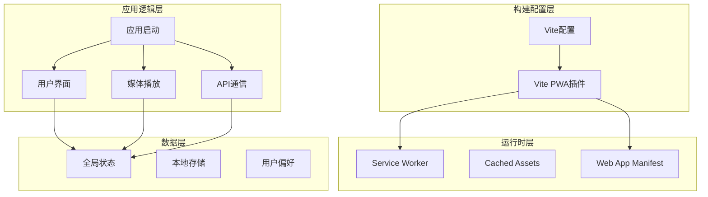
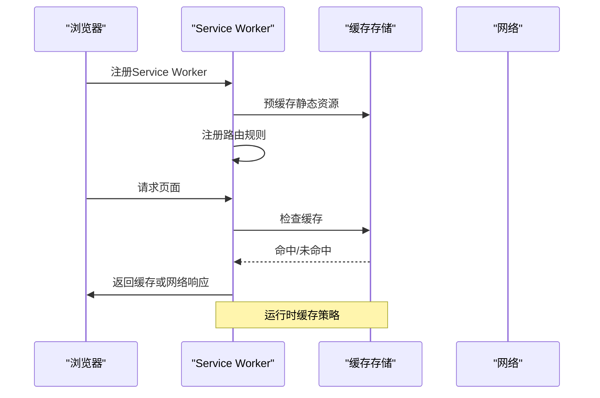
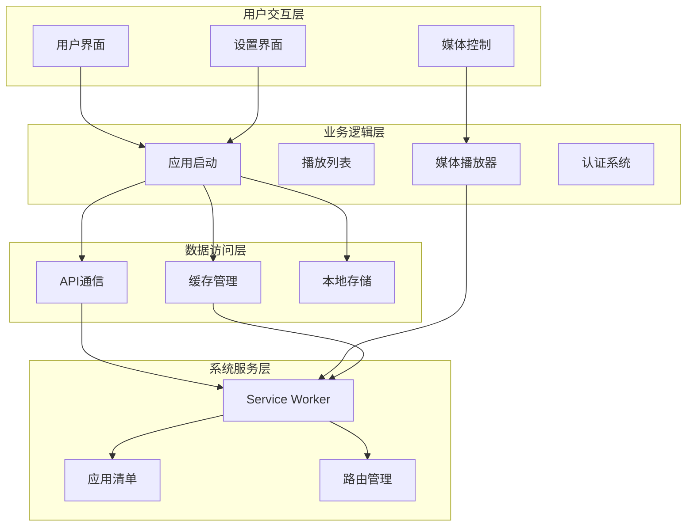
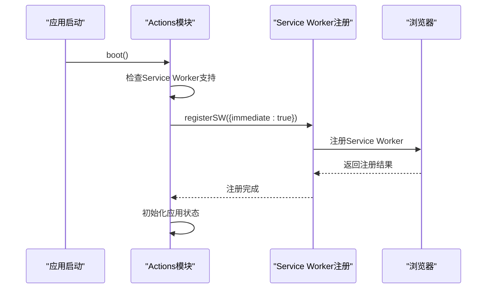
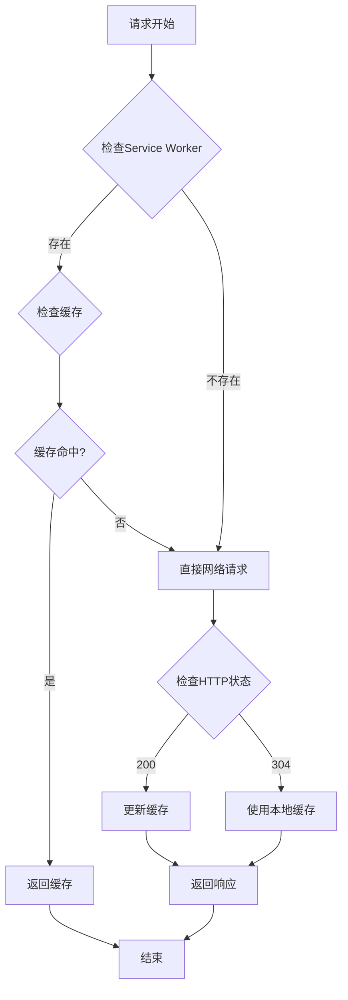
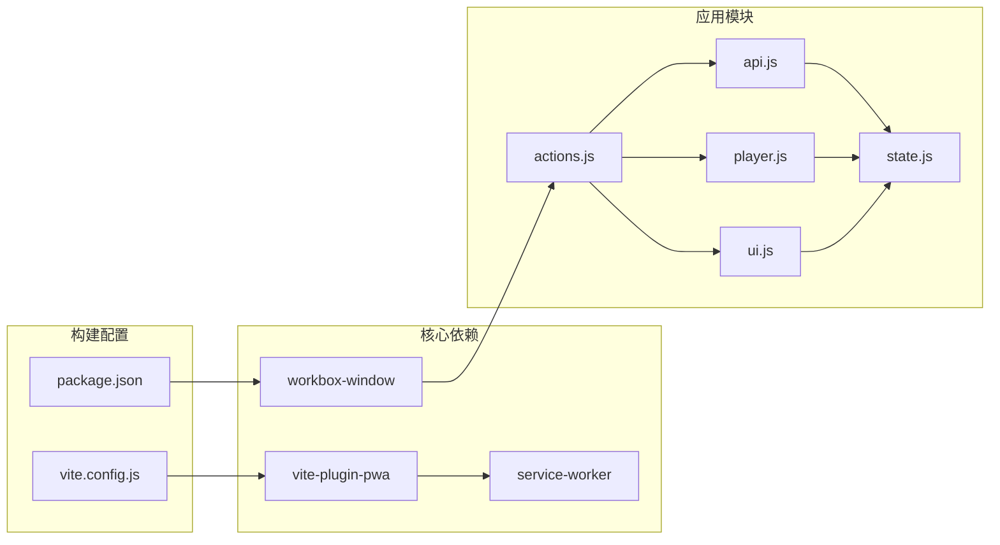
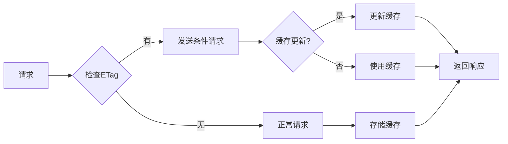

# PWA功能实现

<cite>
**本文档引用的文件**
- [web/vite.config.js](file://web/vite.config.js)
- [web/package.json](file://web/package.json)
- [web/dist/sw.js](file://web/dist/sw.js)
- [web/dist/manifest.webmanifest](file://web/dist/manifest.webmanifest)
- [web/src/app.js](file://web/src/app.js)
- [web/src/modules/actions.js](file://web/src/modules/actions.js)
- [web/src/modules/api.js](file://web/src/modules/api.js)
- [web/src/modules/player.js](file://web/src/modules/player.js)
- [web/src/modules/state.js](file://web/src/modules/state.js)
- [web/src/modules/ui.js](file://web/src/modules/ui.js)
- [web/src/modules/playlist.js](file://web/src/modules/playlist.js)
- [web/src/modules/pin.js](file://web/src/modules/pin.js)
- [web/src/modules/theme.js](file://web/src/modules/theme.js)
- [web/src/modules/utils.js](file://web/src/modules/utils.js)
- [web/index.html](file://web/index.html)
</cite>

## 目录
1. [简介](#简介)
2. [项目结构](#项目结构)
3. [核心组件](#核心组件)
4. [架构概览](#架构概览)
5. [详细组件分析](#详细组件分析)
6. [依赖关系分析](#依赖关系分析)
7. [性能考虑](#性能考虑)
8. [故障排除指南](#故障排除指南)
9. [结论](#结论)

## 简介

MSP项目实现了完整的PWA（Progressive Web App）功能，为用户提供类似原生应用的体验。该系统基于现代Web技术栈构建，包括Vite构建工具、Workbox缓存策略、Service Worker服务以及响应式设计。

PWA功能的核心目标是：
- 提供离线访问能力
- 实现快速加载和流畅体验
- 支持渐进式增强
- 确保跨平台兼容性
- 优化移动端用户体验

## 项目结构

MSP项目的前端架构采用模块化设计，主要分为以下层次：



**图表来源**
- [web/vite.config.js](file://web/vite.config.js#L1-L48)
- [web/package.json](file://web/package.json#L1-L25)

**章节来源**
- [web/vite.config.js](file://web/vite.config.js#L1-L48)
- [web/package.json](file://web/package.json#L1-L25)

## 核心组件

### Service Worker配置

Service Worker是PWA的核心组件，负责缓存管理和网络拦截。系统使用Workbox进行高级缓存管理。



**图表来源**
- [web/dist/sw.js](file://web/dist/sw.js#L1-L2)
- [web/vite.config.js](file://web/vite.config.js#L7-L33)

### Workbox缓存策略

系统采用多层缓存策略：

1. **预缓存策略**：构建时确定的静态资源
2. **运行时缓存**：动态生成的内容
3. **网络优先策略**：API请求处理

**章节来源**
- [web/dist/sw.js](file://web/dist/sw.js#L1-L2)
- [web/vite.config.js](file://web/vite.config.js#L10-L18)

### Web App Manifest

应用清单文件定义了PWA的基本信息和行为规范。

**章节来源**
- [web/dist/manifest.webmanifest](file://web/dist/manifest.webmanifest#L1-L2)
- [web/vite.config.js](file://web/vite.config.js#L19-L31)

## 架构概览

MSP的PWA架构采用分层设计，确保各组件职责清晰且松耦合：



**图表来源**
- [web/src/app.js](file://web/src/app.js#L1-L5)
- [web/src/modules/actions.js](file://web/src/modules/actions.js#L93-L164)
- [web/src/modules/player.js](file://web/src/modules/player.js#L1-L800)

## 详细组件分析

### Service Worker注册流程

Service Worker的注册采用了延迟加载策略，确保在合适的时机激活缓存功能。



**图表来源**
- [web/src/modules/actions.js](file://web/src/modules/actions.js#L93-L106)

**章节来源**
- [web/src/modules/actions.js](file://web/src/modules/actions.js#L93-L106)

### 缓存策略实现

系统实现了多层次的缓存策略来优化性能：



**图表来源**
- [web/src/modules/actions.js](file://web/src/modules/actions.js#L38-L91)
- [web/src/modules/api.js](file://web/src/modules/api.js#L16-L22)

**章节来源**
- [web/src/modules/actions.js](file://web/src/modules/actions.js#L38-L91)
- [web/src/modules/api.js](file://web/src/modules/api.js#L16-L22)

### Workbox配置详解

Vite PWA插件提供了完整的Workbox配置选项：

**预缓存配置**：
- 自动包含构建产物
- 静态资源版本控制
- 导航回退处理

**运行时缓存**：
- API请求网络优先
- 自定义缓存策略
- 缓存清理机制

**应用清单配置**：
- 应用名称和描述
- 主题颜色配置
- 图标资源定义

**章节来源**
- [web/vite.config.js](file://web/vite.config.js#L7-L33)

### 离线访问机制

系统实现了智能的离线访问能力：

```mermaid
stateDiagram-v2
[*] --> Online
Online --> CheckingCache : 用户请求资源
CheckingCache --> CacheAvailable{缓存可用?}
CacheAvailable --> |是| ServeFromCache : 从缓存提供
CacheAvailable --> |否| FetchFromNetwork : 从网络获取
FetchFromNetwork --> UpdateCache : 更新缓存
UpdateCache --> ServeFromCache
FetchFromNetwork --> NetworkError{网络错误?}
NetworkError --> |是| ServeFromCache
NetworkError --> |否| ServeFromNetwork : 从网络提供
ServeFromCache --> Online
ServeFromNetwork --> Online
Online --> Offline : 网络断开
Offline --> CheckingCache : 尝试缓存
Offline --> UseFallback : 使用备用内容
UseFallback --> Online : 网络恢复
```

**图表来源**
- [web/src/modules/actions.js](file://web/src/modules/actions.js#L94-L97)
- [web/src/modules/player.js](file://web/src/modules/player.js#L365-L443)

**章节来源**
- [web/src/modules/actions.js](file://web/src/modules/actions.js#L94-L97)
- [web/src/modules/player.js](file://web/src/modules/player.js#L365-L443)

### Web App Manifest配置

应用清单文件定义了PWA的核心属性：

**基本信息**：
- 应用名称：MSP Media Share
- 短名称：MSP
- 描述：本地局域网媒体共享与预览

**显示配置**：
- standalone模式
- 背景颜色：#ffffff
- 主题颜色：#ffffff
- 作用域：/

**图标配置**：
- SVG格式图标
- 动态图标支持
- 多尺寸适配

**章节来源**
- [web/dist/manifest.webmanifest](file://web/dist/manifest.webmanifest#L1-L2)
- [web/vite.config.js](file://web/vite.config.js#L19-L31)

## 依赖关系分析

PWA功能的实现涉及多个模块间的复杂依赖关系：



**图表来源**
- [web/package.json](file://web/package.json#L11-L16)
- [web/vite.config.js](file://web/vite.config.js#L1-L48)

**章节来源**
- [web/package.json](file://web/package.json#L11-L16)
- [web/vite.config.js](file://web/vite.config.js#L1-L48)

## 性能考虑

### 缓存优化策略

系统采用了多种缓存优化技术：

1. **智能缓存键生成**：基于文件内容生成哈希值
2. **缓存清理机制**：定期清理过期缓存
3. **版本控制**：构建时自动添加版本信息
4. **条件请求**：使用ETag实现增量更新

### 网络请求优化



**图表来源**
- [web/src/modules/actions.js](file://web/src/modules/actions.js#L41-L91)

**章节来源**
- [web/src/modules/actions.js](file://web/src/modules/actions.js#L41-L91)

### 资源加载优化

系统实现了智能的资源加载策略：

- **按需加载**：只加载当前需要的资源
- **预加载关键资源**：提前加载重要资源
- **懒加载非关键资源**：延后加载次要资源
- **资源压缩**：自动压缩静态资源

## 故障排除指南

### 常见问题诊断

**Service Worker无法注册**：
1. 检查HTTPS环境
2. 验证Service Worker文件路径
3. 查看浏览器开发者工具控制台
4. 确认跨域配置正确

**缓存失效问题**：
1. 检查版本号更新
2. 验证缓存清理策略
3. 确认网络请求头设置
4. 检查ETag生成逻辑

**离线功能异常**：
1. 验证预缓存清单完整性
2. 检查运行时缓存配置
3. 确认导航回退处理
4. 测试不同网络状态

### 调试技巧

**开发环境调试**：
- 使用浏览器开发者工具的Application标签
- 监控Service Worker状态
- 查看缓存存储情况
- 分析网络请求行为

**生产环境监控**：
- 监控Service Worker生命周期
- 跟踪缓存命中率
- 分析用户离线行为
- 收集性能指标

**章节来源**
- [web/src/modules/actions.js](file://web/src/modules/actions.js#L94-L97)
- [web/src/modules/player.js](file://web/src/modules/player.js#L365-L443)

## 结论

MSP项目的PWA实现展现了现代Web应用的最佳实践。通过合理的架构设计和优化策略，系统成功实现了：

1. **完整的离线访问能力**：通过Workbox实现智能缓存管理
2. **优秀的用户体验**：快速加载和流畅的交互体验
3. **良好的可维护性**：模块化设计和清晰的依赖关系
4. **强大的扩展性**：支持自定义缓存策略和功能扩展

该实现为类似的媒体应用提供了宝贵的参考，展示了如何在保证功能完整性的同时，最大化提升用户体验和应用性能。