# Service Worker配置

<cite>
**本文档引用的文件**
- [sw.js](file://web/dist/sw.js)
- [workbox-7fba23ee.js](file://web/dist/workbox-7fba23ee.js)
- [package.json](file://web/package.json)
- [vite.config.js](file://web/vite.config.js)
- [actions.js](file://web/src/modules/actions.js)
- [api.js](file://web/src/modules/api.js)
- [state.js](file://web/src/modules/state.js)
- [utils.js](file://web/src/modules/utils.js)
- [index.html](file://web/index.html)
- [manifest.webmanifest](file://web/dist/manifest.webmanifest)
</cite>

## 目录
1. [简介](#简介)
2. [项目结构](#项目结构)
3. [核心组件](#核心组件)
4. [架构概览](#架构概览)
5. [详细组件分析](#详细组件分析)
6. [依赖关系分析](#依赖关系分析)
7. [性能考虑](#性能考虑)
8. [故障排除指南](#故障排除指南)
9. [结论](#结论)

## 简介

本文件详细说明了MSP项目中Service Worker的配置和实现。Service Worker作为PWA的核心组件，负责应用的离线缓存、网络请求拦截和更新管理。本文将深入解析以下关键方面：

- Service Worker的注册机制和生命周期管理
- skipWaiting()和clientsClaim()的作用和实现原理
- Workbox库的集成方式，包括模块加载机制和版本管理
- precacheAndRoute()的预缓存策略，包括静态资源的版本控制和缓存失效处理
- NavigationRoute的配置，包括路由匹配规则和API请求的网络优先策略
- Service Worker调试技巧和常见问题解决方案

## 项目结构

基于仓库分析，Service Worker相关的核心文件分布如下：

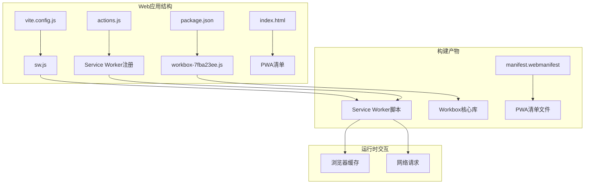

**图表来源**
- [vite.config.js](file://web/vite.config.js#L1-L47)
- [sw.js](file://web/dist/sw.js#L1-L2)
- [workbox-7fba23ee.js](file://web/dist/workbox-7fba23ee.js#L1-L2)

**章节来源**
- [vite.config.js](file://web/vite.config.js#L1-L47)
- [package.json](file://web/package.json#L1-L25)

## 核心组件

### Service Worker注册机制

Service Worker的注册通过VitePWA插件自动完成，主要实现位于以下文件中：

#### 注册流程分析

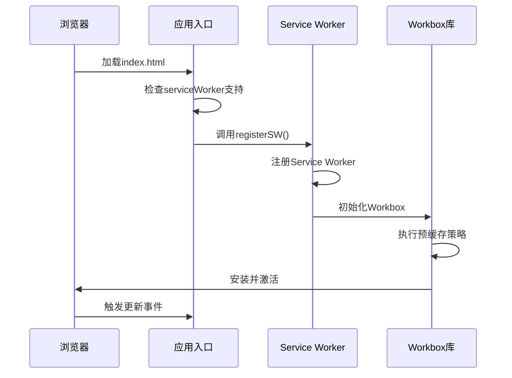

**图表来源**
- [actions.js](file://web/src/modules/actions.js#L93-L164)
- [sw.js](file://web/dist/sw.js#L1-L2)

#### 生命周期管理

Service Worker的生命周期包含以下几个关键阶段：

1. **安装阶段**：执行预缓存清单的资源下载和存储
2. **激活阶段**：清理过期缓存，获取客户端控制权
3. **激活阶段**：处理更新后的资源替换
4. **运行阶段**：拦截网络请求，应用缓存策略

**章节来源**
- [actions.js](file://web/src/modules/actions.js#L93-L164)
- [sw.js](file://web/dist/sw.js#L1-L2)

## 架构概览

### 整体架构设计

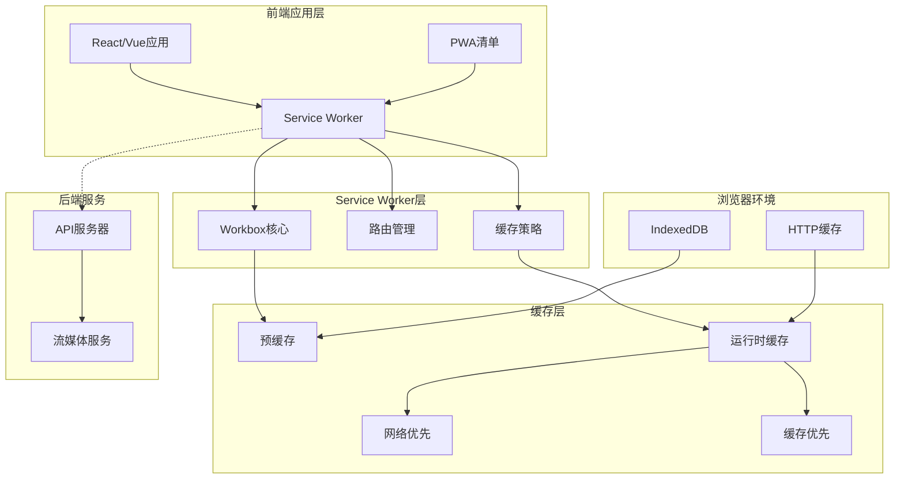

**图表来源**
- [vite.config.js](file://web/vite.config.js#L7-L32)
- [sw.js](file://web/dist/sw.js#L1-L2)

### 预缓存策略架构

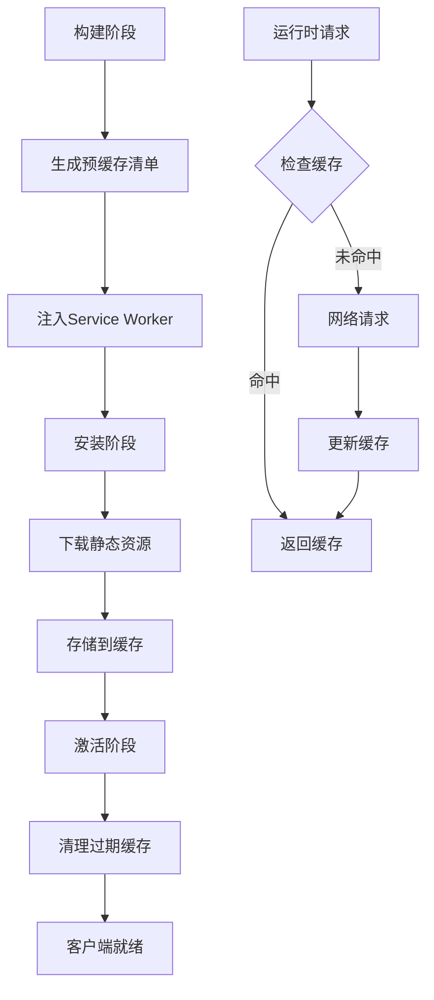

**图表来源**
- [sw.js](file://web/dist/sw.js#L1-L2)
- [workbox-7fba23ee.js](file://web/dist/workbox-7fba23ee.js#L1-L2)

## 详细组件分析

### Service Worker核心实现

#### 预缓存配置分析

Service Worker通过预缓存机制确保应用在离线状态下仍能正常运行。预缓存清单包含了所有静态资源的URL和版本信息。

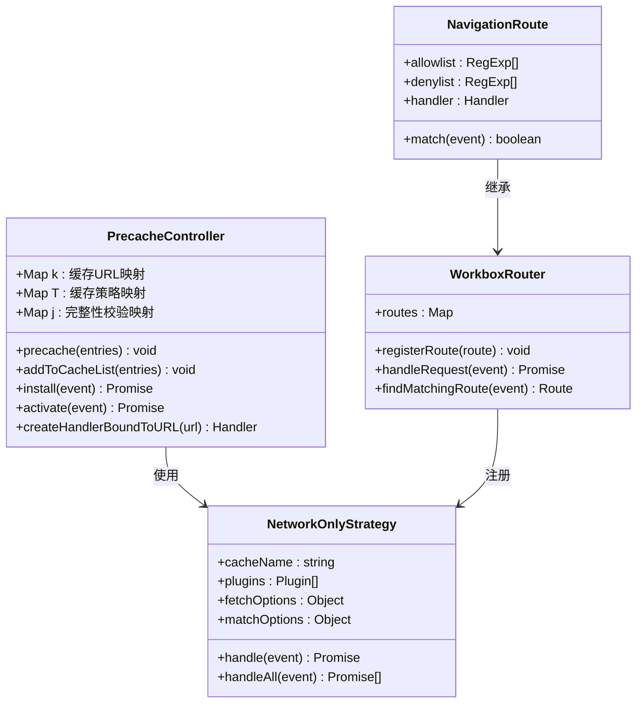

**图表来源**
- [workbox-7fba23ee.js](file://web/dist/workbox-7fba23ee.js#L1-L2)

#### 关键配置参数说明

| 参数 | 类型 | 默认值 | 描述 |
|------|------|--------|------|
| `navigateFallbackDenylist` | RegExp[] | [/^\/api\/]/ | 导航回退拒绝列表，API请求不走导航回退 |
| `runtimeCaching` | Array | [] | 运行时缓存规则数组 |
| `registerType` | string | 'autoUpdate' | 自动更新注册类型 |

**章节来源**
- [vite.config.js](file://web/vite.config.js#L10-L17)

### Workbox库集成分析

#### 版本管理机制

Workbox库采用模块化设计，通过版本化的模块名称确保缓存的正确性和安全性：

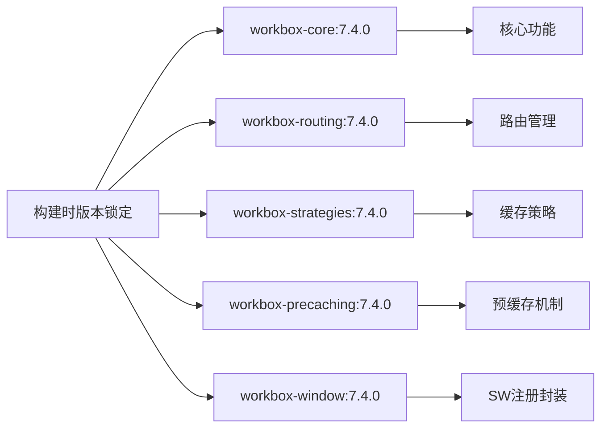

**图表来源**
- [package.json](file://web/package.json#L11-L16)
- [pnpm-lock.yaml](file://web/pnpm-lock.yaml#L1837-L3981)

#### 模块加载机制

Workbox采用自定义的模块加载器，支持动态加载和缓存：

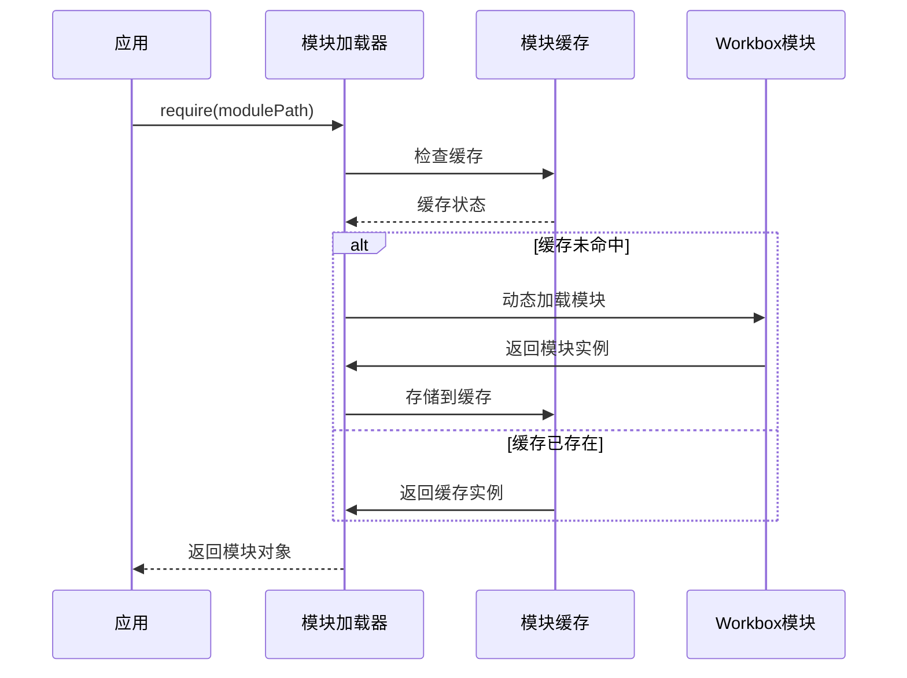

**图表来源**
- [workbox-7fba23ee.js](file://web/dist/workbox-7fba23ee.js#L1-L2)

**章节来源**
- [package.json](file://web/package.json#L11-L16)
- [pnpm-lock.yaml](file://web/pnpm-lock.yaml#L1837-L3981)

### 预缓存策略详解

#### 静态资源版本控制

预缓存策略通过为每个静态资源添加版本标识来实现精确的版本控制：

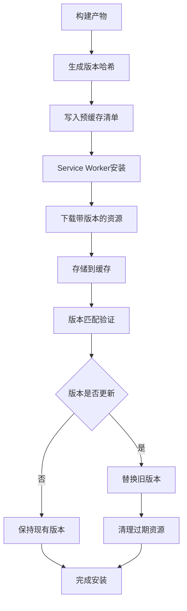

**图表来源**
- [sw.js](file://web/dist/sw.js#L1-L2)

#### 缓存失效处理机制

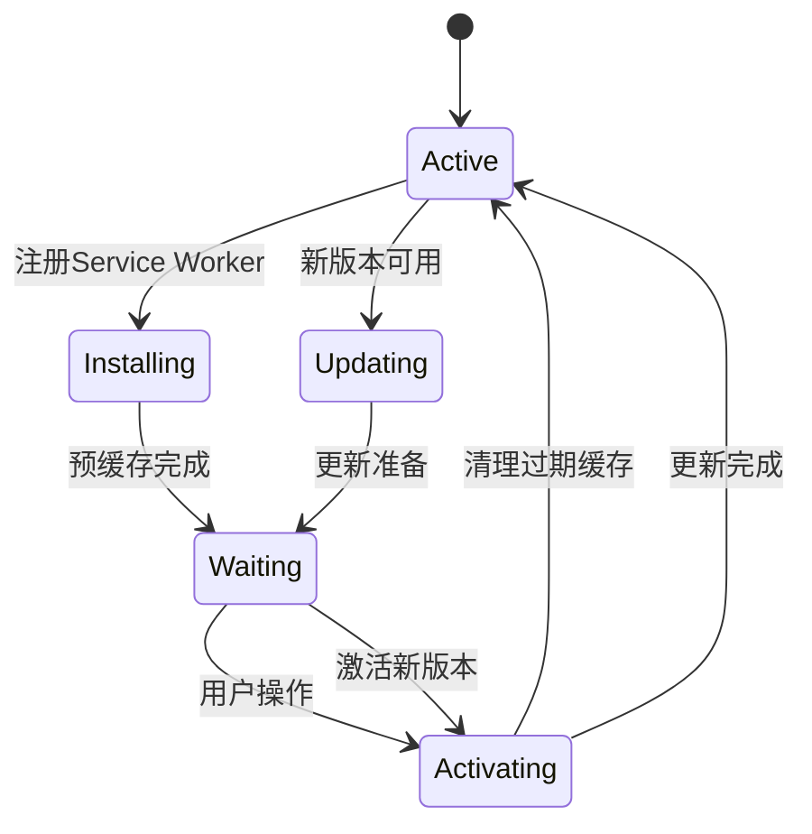

**图表来源**
- [workbox-7fba23ee.js](file://web/dist/workbox-7fba23ee.js#L1-L2)

**章节来源**
- [sw.js](file://web/dist/sw.js#L1-L2)
- [workbox-7fba23ee.js](file://web/dist/workbox-7fba23ee.js#L1-L2)

### NavigationRoute配置分析

#### 路由匹配规则

NavigationRoute实现了智能的路由匹配逻辑，确保单页应用的导航行为符合预期：

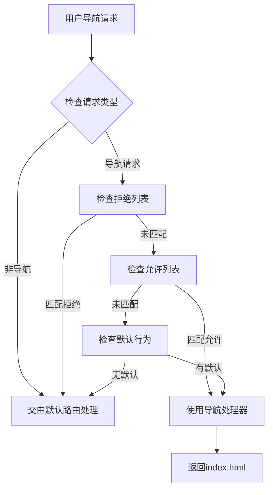

**图表来源**
- [workbox-7fba23ee.js](file://web/dist/workbox-7fba23ee.js#L1-L2)

#### API请求网络优先策略

API请求采用NetworkOnly策略，确保实时数据的准确性：

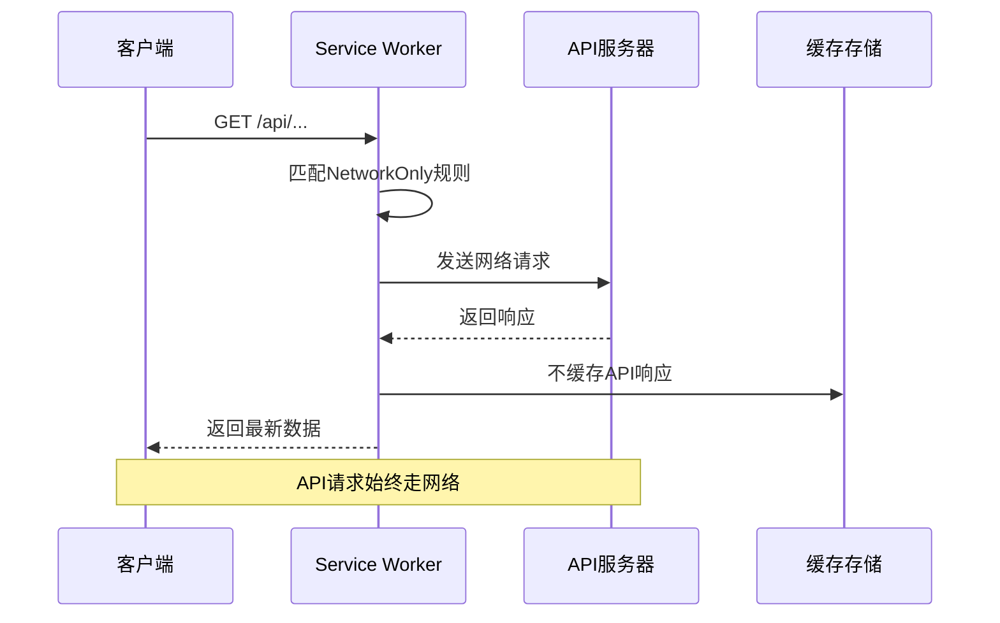

**图表来源**
- [vite.config.js](file://web/vite.config.js#L12-L17)

**章节来源**
- [vite.config.js](file://web/vite.config.js#L10-L17)
- [workbox-7fba23ee.js](file://web/dist/workbox-7fba23ee.js#L1-L2)

## 依赖关系分析

### 外部依赖关系

```mermaid
graph TB
subgraph "开发依赖"
A[vite-plugin-pwa@1.2.0] --> B[workbox-build@7.4.0]
A --> C[workbox-window@7.4.0]
end
subgraph "运行时依赖"
D[workbox-window@7.4.0] --> E[workbox-core@7.4.0]
F[workbox-precaching@7.4.0] --> E
G[workbox-routing@7.4.0] --> E
H[workbox-strategies@7.4.0] --> E
end
subgraph "版本锁定"
I[package.json] --> J[语义化版本]
K[pnpm-lock.yaml] --> L[精确版本号]
end
A --> M[Vite构建工具]
D --> N[浏览器运行时]
```

**图表来源**
- [package.json](file://web/package.json#L11-L16)
- [pnpm-lock.yaml](file://web/pnpm-lock.yaml#L1837-L3981)

### 内部模块依赖

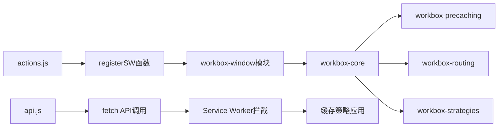

**图表来源**
- [actions.js](file://web/src/modules/actions.js#L1-L10)
- [api.js](file://web/src/modules/api.js#L16-L22)

**章节来源**
- [package.json](file://web/package.json#L11-L16)
- [pnpm-lock.yaml](file://web/pnpm-lock.yaml#L1837-L3981)

## 性能考虑

### 缓存策略优化

1. **预缓存策略**：所有静态资源在安装阶段预缓存，减少首次加载时间
2. **运行时缓存**：根据资源类型采用不同的缓存策略
3. **缓存清理**：定期清理过期缓存，避免存储空间无限增长

### 网络请求优化

1. **API请求直连**：避免API响应被缓存，确保数据实时性
2. **流媒体优化**：支持断点续传和范围请求
3. **错误重试机制**：在网络不稳定时提供重试支持

## 故障排除指南

### 常见问题及解决方案

#### Service Worker无法注册

**问题症状**：
- 控制台出现注册失败错误
- 应用无法离线工作

**排查步骤**：
1. 检查浏览器控制台是否有Service Worker注册错误
2. 验证HTTPS环境（localhost除外）
3. 确认Service Worker文件路径正确

**解决方案**：
```javascript
// 在actions.js中添加错误处理
if ('serviceWorker' in navigator) {
    try {
        registerSW({ immediate: true });
    } catch (error) {
        console.error('Service Worker注册失败:', error);
        // 回退到无PWA模式
    }
}
```

#### 缓存更新问题

**问题症状**：
- 更新后页面显示旧内容
- 新增资源无法访问

**排查步骤**：
1. 检查Service Worker状态（waiting/activating）
2. 验证预缓存清单中的版本信息
3. 确认cleanupOutdatedCaches函数执行

**解决方案**：
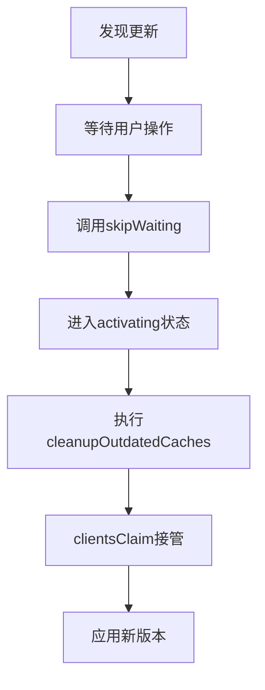

#### 调试技巧

1. **浏览器开发者工具**：
   - Application面板查看Service Worker状态
   - Cache Storage面板检查缓存内容
   - Network面板监控缓存命中率

2. **日志输出**：
   ```javascript
   // 在Service Worker中添加调试信息
   self.addEventListener('message', (event) => {
       console.log('Service Worker收到消息:', event.data);
   });
   ```

3. **强制更新**：
   ```javascript
   // 强制重新注册Service Worker
   navigator.serviceWorker.getRegistrations().then((registrations) => {
       registrations.forEach((registration) => {
           registration.unregister();
       });
   });
   ```

**章节来源**
- [actions.js](file://web/src/modules/actions.js#L93-L164)
- [workbox-7fba23ee.js](file://web/dist/workbox-7fba23ee.js#L1-L2)

## 结论

本项目的Service Worker配置展现了现代PWA的最佳实践：

1. **完整的离线支持**：通过预缓存策略确保应用在各种网络环境下都能正常运行
2. **智能的缓存管理**：针对不同类型的资源采用差异化的缓存策略
3. **可靠的更新机制**：通过版本控制和缓存清理确保用户始终获得最新内容
4. **完善的错误处理**：提供了全面的错误处理和调试支持

通过合理配置Workbox库和Service Worker，项目实现了高性能、高可用的渐进式Web应用体验。建议在生产环境中持续监控缓存命中率和更新成功率，及时调整缓存策略以优化用户体验。