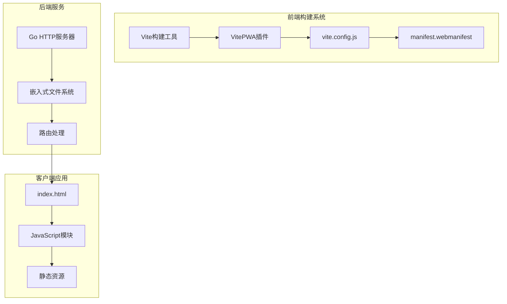
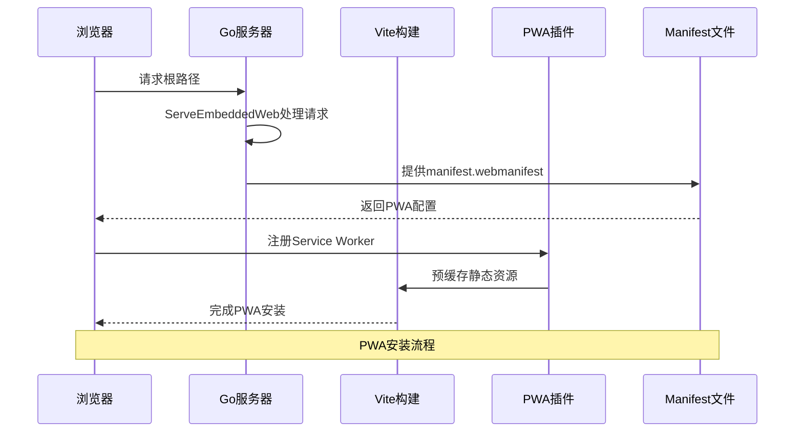
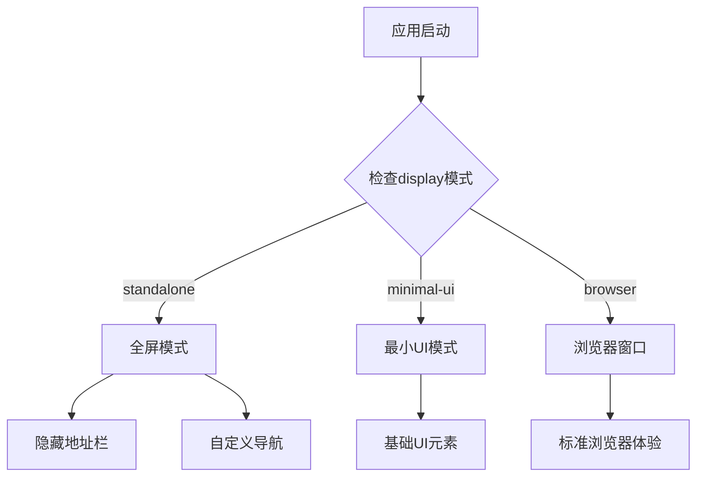
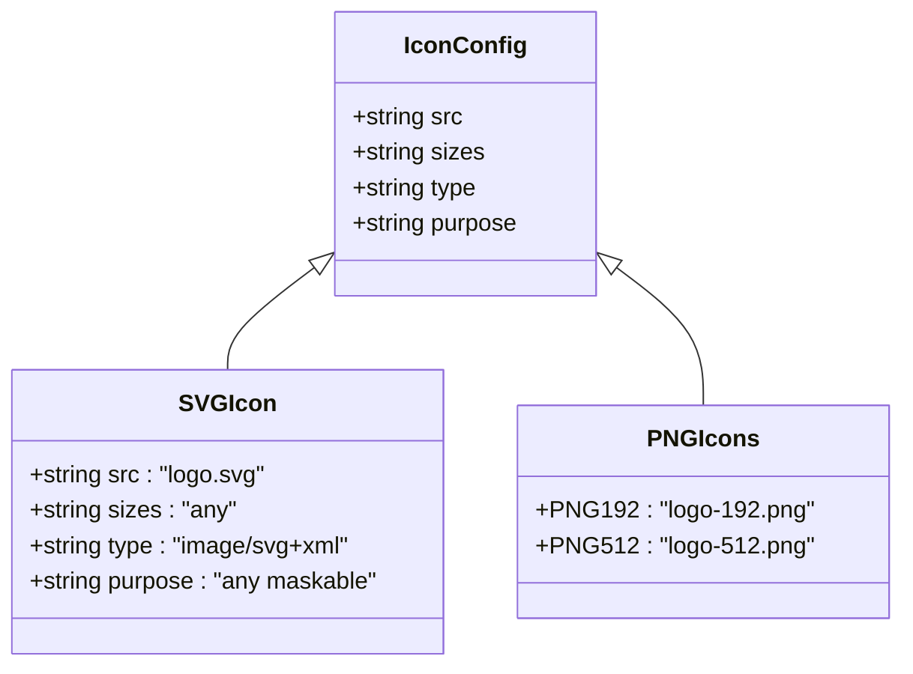
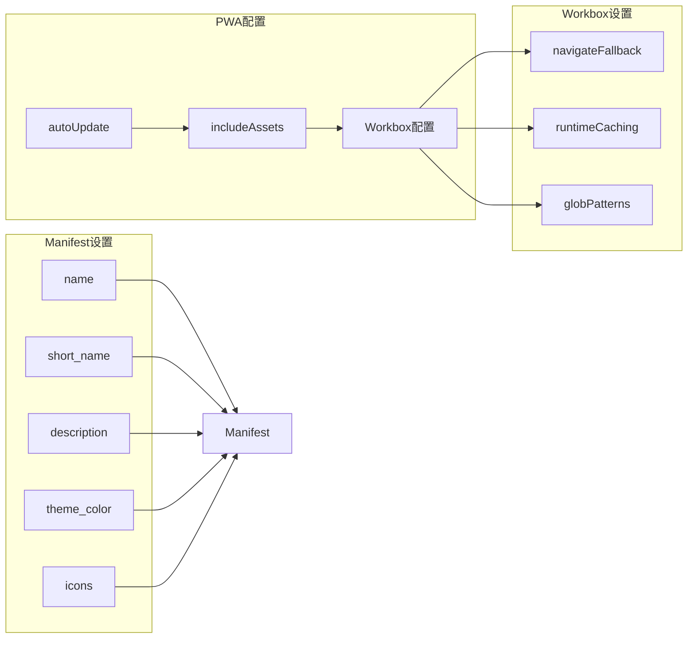
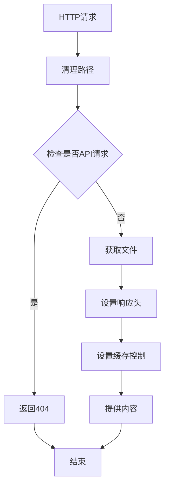
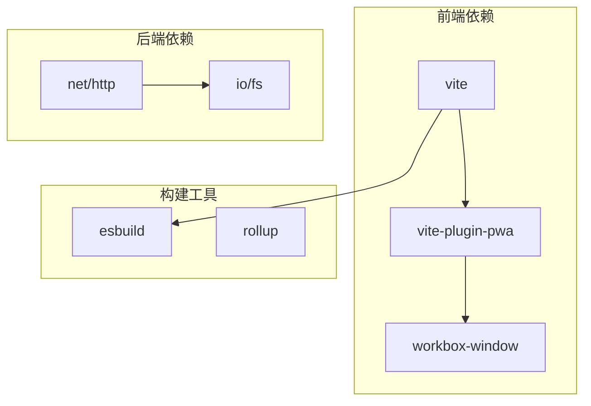
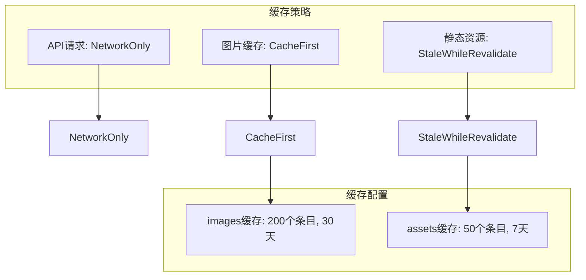

# Web App Manifest配置

<cite>
**本文档引用的文件**
- [web/dist/manifest.webmanifest](file://web/dist/manifest.webmanifest)
- [web/index.html](file://web/index.html)
- [web/vite.config.js](file://web/vite.config.js)
- [web/package.json](file://web/package.json)
- [cmd/msp/main.go](file://cmd/msp/main.go)
- [internal/web/web.go](file://internal/web/web.go)
- [PERFORMANCE_ANALYSIS.md](file://PERFORMANCE_ANALYSIS.md)
- [web/src/modules/actions.js](file://web/src/modules/actions.js)
</cite>

## 目录
1. [简介](#简介)
2. [项目结构](#项目结构)
3. [核心组件](#核心组件)
4. [架构概览](#架构概览)
5. [详细组件分析](#详细组件分析)
6. [依赖关系分析](#依赖关系分析)
7. [性能考虑](#性能考虑)
8. [故障排除指南](#故障排除指南)
9. [结论](#结论)

## 简介

本文档详细介绍了MSP媒体分享应用的Web App Manifest配置。该应用是一个基于PWA技术的局域网媒体分享平台，支持视频、音频和图片的在线预览。本文档将深入解析manifest.json文件的各项配置项，包括应用名称、显示模式、主题颜色、启动画面等核心配置。

## 项目结构

MSP项目采用前后端分离架构，前端使用Vite构建工具和PWA插件，后端使用Go语言开发。Web应用的PWA配置主要集中在前端构建配置中。

**图表来源**
- [web/vite.config.js](file://web/vite.config.js#L1-L47)
- [cmd/msp/main.go](file://cmd/msp/main.go#L53-L107)
- [internal/web/web.go](file://internal/web/web.go#L14-L32)

**章节来源**
- [web/vite.config.js](file://web/vite.config.js#L1-L47)
- [cmd/msp/main.go](file://cmd/msp/main.go#L53-L107)
- [internal/web/web.go](file://internal/web/web.go#L14-L32)

## 核心组件

### Manifest配置文件

应用的PWA配置主要通过VitePWA插件在构建时生成manifest.webmanifest文件。当前配置包含了以下关键字段：

- **应用标识**: name、short_name、description
- **显示配置**: display、scope、start_url
- **视觉配置**: theme_color、background_color、icons
- **国际化**: lang

### 构建配置系统

Vite构建系统通过vite.config.js配置PWA插件，实现了自动更新注册、资源包含和工作框配置。

### 服务端集成

Go后端通过嵌入式文件系统提供静态资源服务，确保PWA文件能够正确加载。

**章节来源**
- [web/dist/manifest.webmanifest](file://web/dist/manifest.webmanifest#L1-L2)
- [web/vite.config.js](file://web/vite.config.js#L7-L33)
- [cmd/msp/main.go](file://cmd/msp/main.go#L53-L107)

## 架构概览

MSP应用的PWA架构采用了现代化的前端构建和部署策略：

**图表来源**
- [cmd/msp/main.go](file://cmd/msp/main.go#L103-L105)
- [internal/web/web.go](file://internal/web/web.go#L14-L32)
- [web/vite.config.js](file://web/vite.config.js#L7-L33)

## 详细组件分析

### Manifest配置详解

#### 应用基本信息配置

应用的核心标识信息通过以下字段定义：

| 字段 | 值 | 说明 |
|------|-----|------|
| name | "MSP Media Share" | 完整的应用名称 |
| short_name | "MSP" | 短名称，用于应用启动器 |
| description | "Local LAN Media Share & Preview" | 应用描述 |

#### 显示模式配置

**图表来源**
- [web/dist/manifest.webmanifest](file://web/dist/manifest.webmanifest#L1-L2)

#### 主题颜色配置

应用使用白色作为主题色和背景色，确保在不同设备上的一致性体验：

- **theme_color**: "#ffffff" - 控制浏览器地址栏和任务切换器的颜色
- **background_color**: "#ffffff" - 控制启动画面的背景颜色

#### 图标配置系统

当前配置使用SVG格式的单个图标，但完整的配置应包含多种尺寸以支持不同场景：

**图表来源**
- [web/dist/manifest.webmanifest](file://web/dist/manifest.webmanifest#L1-L2)
- [PERFORMANCE_ANALYSIS.md](file://PERFORMANCE_ANALYSIS.md#L788-L806)

#### 启动配置

- **start_url**: "/" - 应用的起始页面
- **scope**: "/" - 应用的作用域范围
- **display**: "standalone" - 独立显示模式

**章节来源**
- [web/dist/manifest.webmanifest](file://web/dist/manifest.webmanifest#L1-L2)
- [PERFORMANCE_ANALYSIS.md](file://PERFORMANCE_ANALYSIS.md#L779-L807)

### 构建配置分析

#### VitePWA插件配置

VitePWA插件提供了完整的PWA功能集成：

**图表来源**
- [web/vite.config.js](file://web/vite.config.js#L7-L33)

#### 工作框配置

工作框（Workbox）提供了智能的缓存策略：

- **navigateFallback**: "/index.html" - 离线页面回退
- **navigateFallbackDenylist**: [/^\/api\//] - API请求不进行导航回退
- **runtimeCaching**: 自定义运行时缓存策略

**章节来源**
- [web/vite.config.js](file://web/vite.config.js#L10-L18)

### 服务端集成机制

#### 嵌入式文件系统

Go后端通过嵌入式文件系统提供静态资源服务：

**图表来源**
- [internal/web/web.go](file://internal/web/web.go#L14-L32)

#### 路由处理

主程序将所有非API请求路由到嵌入式文件系统：

**章节来源**
- [internal/web/web.go](file://internal/web/web.go#L14-L32)
- [cmd/msp/main.go](file://cmd/msp/main.go#L103-L105)

## 依赖关系分析

### 技术栈依赖

**图表来源**
- [web/package.json](file://web/package.json#L11-L16)
- [web/pnpm-lock.yaml](file://web/pnpm-lock.yaml#L3801-L3810)

### 组件耦合度分析

应用采用了松耦合的设计模式：

- **前端与后端解耦**: 通过RESTful API通信
- **构建工具独立**: Vite配置独立于业务逻辑
- **PWA功能模块化**: 通过插件系统集成

**章节来源**
- [web/package.json](file://web/package.json#L11-L16)
- [web/pnpm-lock.yaml](file://web/pnpm-lock.yaml#L3801-L3810)

## 性能考虑

### 缓存策略优化

根据性能分析文档，建议实施以下缓存策略：

**图表来源**
- [PERFORMANCE_ANALYSIS.md](file://PERFORMANCE_ANALYSIS.md#L749-L777)

### 预缓存清单

建议添加更全面的预缓存清单以提升离线体验：

**章节来源**
- [PERFORMANCE_ANALYSIS.md](file://PERFORMANCE_ANALYSIS.md#L742-L748)

## 故障排除指南

### 常见问题诊断

#### Manifest验证问题

1. **文件路径错误**: 确保manifest.webmanifest位于正确的发布目录
2. **MIME类型问题**: 服务器需要正确设置application/manifest+json MIME类型
3. **缓存问题**: 清除浏览器缓存重新加载应用

#### PWA安装失败

1. **HTTPS要求**: 生产环境必须使用HTTPS协议
2. **Service Worker注册**: 检查浏览器开发者工具中的注册状态
3. **离线页面**: 确保navigateFallback指向有效的HTML文件

#### 图标显示问题

1. **格式兼容性**: 确保提供多种格式的图标文件
2. **尺寸要求**: 提供192x192和512x512尺寸的PNG图标
3. **SVG兼容性**: 检查SVG图标的maskable属性设置

**章节来源**
- [web/dist/manifest.webmanifest](file://web/dist/manifest.webmanifest#L1-L2)
- [web/vite.config.js](file://web/vite.config.js#L19-L31)

### 兼容性测试

#### 浏览器支持情况

| 浏览器 | 支持版本 | PWA特性 | 备注 |
|--------|----------|---------|------|
| Chrome | 60+ | 完整支持 | 最佳支持 |
| Firefox | 55+ | 部分支持 | 需要实验性功能 |
| Safari | 11.3+ | 基础支持 | iOS Safari限制较多 |
| Edge | 79+ | 完整支持 | Chromium版Edge |
| Opera | 47+ | 完整支持 | 基于Chromium |

#### 适配方案

1. **渐进式增强**: 为不支持PWA的浏览器提供基础功能
2. **功能检测**: 使用Modernizr等工具检测PWA特性
3. **降级策略**: 为不支持的服务工作线程提供传统Web应用体验

## 结论

MSP应用的Web App Manifest配置展现了现代PWA开发的最佳实践。通过VitePWA插件的自动化配置，应用实现了完整的PWA功能，包括应用安装、离线支持和智能缓存。

### 关键优势

1. **简洁配置**: 通过单一配置文件管理所有PWA设置
2. **智能缓存**: 利用Workbox实现高效的资源缓存策略
3. **跨平台兼容**: 支持多种浏览器和设备类型
4. **易于维护**: 构建时生成manifest文件，减少运行时开销

### 改进建议

1. **增强图标系统**: 添加多种尺寸和格式的图标文件
2. **完善缓存策略**: 实施更精细的缓存分类和过期策略
3. **离线体验**: 提供更丰富的离线页面和功能
4. **性能监控**: 集成PWA性能指标收集和分析

该配置为MSP应用提供了坚实的PWA基础，为用户提供了类似原生应用的体验，同时保持了Web应用的易用性和可访问性优势。