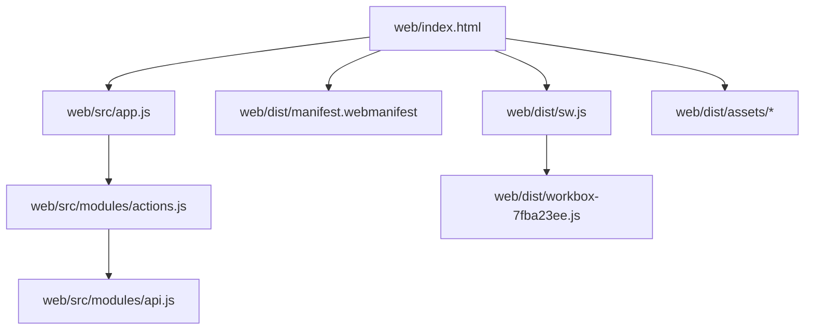
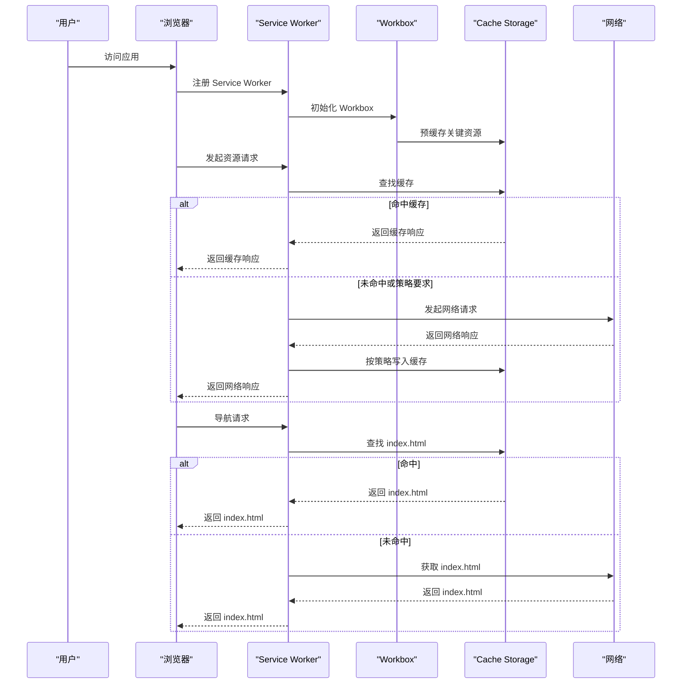
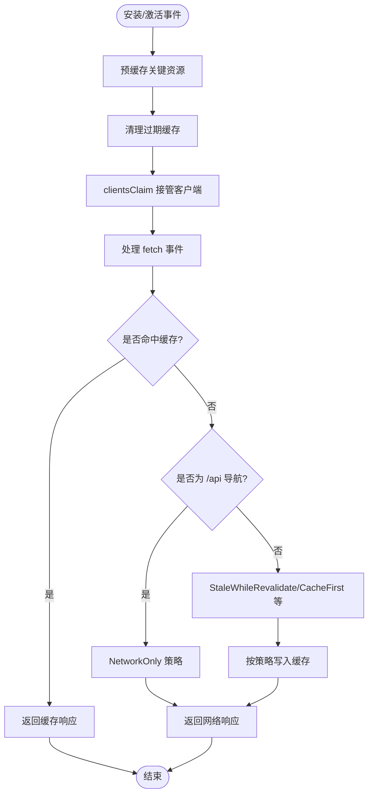
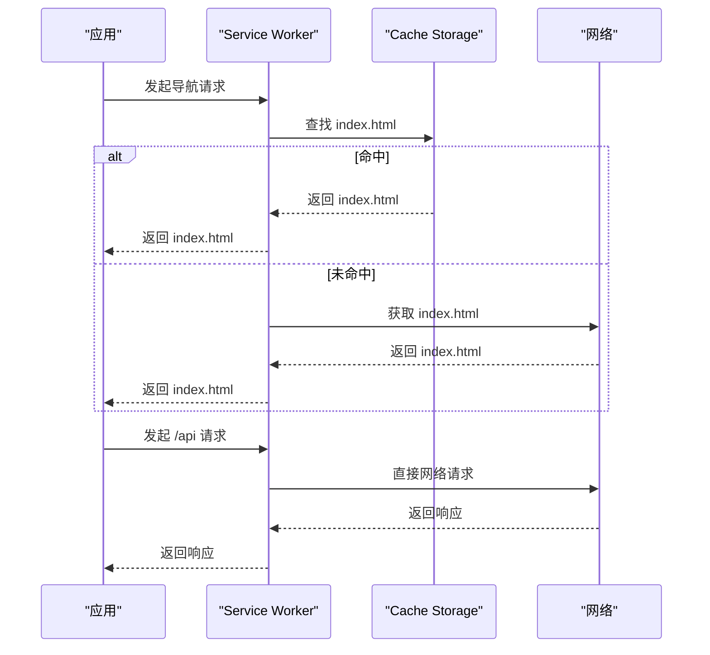
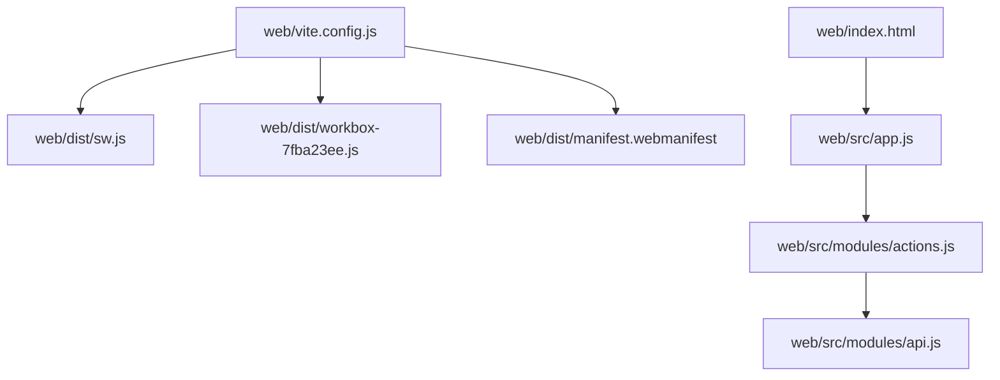

# 离线访问能力

<cite>
**本文档引用的文件**
- [web/vite.config.js](file://web/vite.config.js)
- [web/dist/sw.js](file://web/dist/sw.js)
- [web/dist/workbox-7fba23ee.js](file://web/dist/workbox-7fba23ee.js)
- [web/dist/manifest.webmanifest](file://web/dist/manifest.webmanifest)
- [web/index.html](file://web/index.html)
- [web/src/app.js](file://web/src/app.js)
- [web/src/modules/actions.js](file://web/src/modules/actions.js)
- [web/src/modules/state.js](file://web/src/modules/state.js)
- [web/src/modules/api.js](file://web/src/modules/api.js)
- [web/src/modules/player.js](file://web/src/modules/player.js)
- [PERFORMANCE_ANALYSIS.md](file://PERFORMANCE_ANALYSIS.md)
</cite>

## 目录
1. [简介](#简介)
2. [项目结构](#项目结构)
3. [核心组件](#核心组件)
4. [架构总览](#架构总览)
5. [详细组件分析](#详细组件分析)
6. [依赖关系分析](#依赖关系分析)
7. [性能考虑](#性能考虑)
8. [故障排除指南](#故障排除指南)
9. [结论](#结论)

## 简介
本文件系统性阐述 MSP Web 前端的离线访问能力，涵盖 PWA 离线工作原理、Service Worker 拦截与缓存策略、关键资源预缓存与增量缓存、网络降级处理（离线状态检测、错误页面与用户提示）、以及测试与调试方法。目标是帮助开发者与运维人员全面理解并优化离线体验。

## 项目结构
前端采用 Vite + Workbox 的 PWA 构建方式，核心产物位于 web/dist 目录，包含 Service Worker、Workbox 运行时脚本、应用清单与静态资源。入口 HTML 与模块化 JS 组成运行时逻辑，通过 VitePWA 插件生成离线缓存与导航回退。

图表来源
- [web/index.html](file://web/index.html#L1-L195)
- [web/src/app.js](file://web/src/app.js#L1-L5)
- [web/src/modules/actions.js](file://web/src/modules/actions.js#L93-L164)
- [web/src/modules/api.js](file://web/src/modules/api.js#L1-L47)
- [web/dist/manifest.webmanifest](file://web/dist/manifest.webmanifest#L1-L2)
- [web/dist/sw.js](file://web/dist/sw.js#L1-L2)
- [web/dist/workbox-7fba23ee.js](file://web/dist/workbox-7fba23ee.js#L1-L2)

章节来源
- [web/index.html](file://web/index.html#L1-L195)
- [web/vite.config.js](file://web/vite.config.js#L1-L48)

## 核心组件
- Service Worker 与 Workbox：负责预缓存、导航回退、运行时缓存策略与缓存清理。
- 应用清单（manifest.webmanifest）：定义 PWA 显示属性、图标与作用域。
- 运行时引导：注册 Service Worker，初始化 UI、语言与主题，并执行首次数据加载。
- 网络请求与缓存策略：对 /api 路由采用 NetworkOnly，对静态资源采用 StaleWhileRevalidate/CacheFirst 等策略。
- 离线降级：通过导航回退与错误提示保障基本可用性。

章节来源
- [web/dist/sw.js](file://web/dist/sw.js#L1-L2)
- [web/dist/manifest.webmanifest](file://web/dist/manifest.webmanifest#L1-L2)
- [web/src/app.js](file://web/src/app.js#L1-L5)
- [web/src/modules/actions.js](file://web/src/modules/actions.js#L93-L164)
- [web/vite.config.js](file://web/vite.config.js#L7-L33)

## 架构总览
PWA 离线架构围绕 Service Worker 与 Workbox 展开：构建阶段由 VitePWA 生成预缓存清单与运行时缓存规则；安装激活阶段完成资源预缓存与缓存清理；运行阶段通过 fetch 事件拦截请求，按路由策略返回缓存或网络响应；导航请求在离线时回退到 index.html，保证单页应用可用。

图表来源
- [web/dist/sw.js](file://web/dist/sw.js#L1-L2)
- [web/dist/workbox-7fba23ee.js](file://web/dist/workbox-7fba23ee.js#L1-L2)
- [web/vite.config.js](file://web/vite.config.js#L10-L18)

## 详细组件分析

### Service Worker 与 Workbox 实现
- 预缓存与导航回退：通过 precacheAndRoute 注册预缓存清单，cleanupOutdatedCaches 清理过期缓存，clientsClaim 使新 SW 立即接管客户端；NavigationRoute 将导航请求回退到 index.html，denylist 排除 /api 前缀。
- 运行时缓存策略：对 /api 使用 NetworkOnly，确保实时数据；对静态资源采用 StaleWhileRevalidate/CacheFirst 等策略（见构建配置）。
- 资源拦截与处理：Workbox 路由系统根据匹配规则选择处理器，支持缓存命中、网络回退与错误处理回调。

图表来源
- [web/dist/sw.js](file://web/dist/sw.js#L1-L2)
- [web/dist/workbox-7fba23ee.js](file://web/dist/workbox-7fba23ee.js#L1-L2)
- [web/vite.config.js](file://web/vite.config.js#L10-L18)

章节来源
- [web/dist/sw.js](file://web/dist/sw.js#L1-L2)
- [web/dist/workbox-7fba23ee.js](file://web/dist/workbox-7fba23ee.js#L1-L2)
- [web/vite.config.js](file://web/vite.config.js#L7-L33)

### 关键资源预缓存策略
- 预缓存清单：构建时由 VitePWA 生成，包含 index.html、静态资源与清单文件等，确保首次加载与离线可用。
- 版本控制：通过 revision 参数实现强缓存与更新控制，避免陈旧资源。
- 过期清理：激活阶段清理与当前版本不一致的过期缓存，释放存储空间。

章节来源
- [web/dist/sw.js](file://web/dist/sw.js#L1-L2)
- [web/vite.config.js](file://web/vite.config.js#L7-L33)

### 增量缓存机制
- 运行时缓存：对 /api 采用 NetworkOnly，确保数据实时性；对静态资源采用 StaleWhileRevalidate/CacheFirst 等策略，平衡新鲜度与性能。
- 缓存键与匹配：Workbox 提供 cacheKey、matchOptions 等参数，支持精确匹配与忽略查询参数等场景。
- 缓存淘汰：通过 maxEntries、maxAgeSeconds 等配置控制容量与有效期，避免缓存膨胀。

章节来源
- [web/vite.config.js](file://web/vite.config.js#L10-L18)
- [web/dist/workbox-7fba23ee.js](file://web/dist/workbox-7fba23ee.js#L1-L2)

### 网络降级处理
- 导航回退：对非 /api 的导航请求，若无可用缓存则回退到 index.html，保证单页应用路由可用。
- 错误页面与提示：应用层通过错误处理与 UI 提示（如元信息、错误消息）告知用户当前状态；播放器错误处理包含解码失败、源不支持等场景的降级提示。
- 离线状态检测：通过 Service Worker 的 fetch 事件与缓存命中情况间接反映离线状态；应用层可通过网络状态与请求结果判断。

图表来源
- [web/dist/sw.js](file://web/dist/sw.js#L1-L2)
- [web/src/modules/actions.js](file://web/src/modules/actions.js#L131-L162)

章节来源
- [web/src/modules/actions.js](file://web/src/modules/actions.js#L131-L162)
- [web/src/modules/player.js](file://web/src/modules/player.js#L360-L443)

### 运行时引导与首次加载
- Service Worker 注册：应用启动时检测并注册 Service Worker，确保离线能力可用。
- 首次数据加载：通过 apiRetry 与 loadMedia 实现带重试的配置与媒体列表加载，结合 ETag 实现条件请求与增量更新。
- UI 初始化：语言、主题、事件绑定与播放器初始化在引导流程中完成。

章节来源
- [web/src/app.js](file://web/src/app.js#L1-L5)
- [web/src/modules/actions.js](file://web/src/modules/actions.js#L93-L164)
- [web/src/modules/api.js](file://web/src/modules/api.js#L5-L14)

## 依赖关系分析
- 构建与插件：VitePWA 插件负责生成 Service Worker、预缓存清单与运行时缓存策略。
- 运行时依赖：workbox-window 用于在应用侧管理 Service Worker 生命周期与更新提示。
- 资源依赖：HTML 引入样式、脚本与模块入口；清单文件定义 PWA 行为。

图表来源
- [web/vite.config.js](file://web/vite.config.js#L1-L48)
- [web/index.html](file://web/index.html#L1-L195)
- [web/src/app.js](file://web/src/app.js#L1-L5)
- [web/src/modules/actions.js](file://web/src/modules/actions.js#L1-L164)
- [web/src/modules/api.js](file://web/src/modules/api.js#L1-L47)

章节来源
- [web/vite.config.js](file://web/vite.config.js#L1-L48)
- [web/index.html](file://web/index.html#L1-L195)

## 性能考虑
- 预缓存关键资源：减少首次加载与离线依赖，提升可用性。
- 运行时缓存策略：对静态资源采用 StaleWhileRevalidate/CacheFirst，降低带宽与延迟。
- 缓存容量与有效期：通过 maxEntries 与 maxAgeSeconds 控制缓存规模，避免过度占用存储。
- 条件请求与 ETag：配合 Service Worker 缓存，减少不必要的网络往返。

章节来源
- [PERFORMANCE_ANALYSIS.md](file://PERFORMANCE_ANALYSIS.md#L732-L808)
- [web/vite.config.js](file://web/vite.config.js#L10-L18)
- [web/src/modules/actions.js](file://web/src/modules/actions.js#L38-L91)

## 故障排除指南
- 浏览器开发者工具
  - Application/Service Workers：查看 SW 注册状态、版本与缓存组，确认 clientsClaim 是否生效。
  - Cache Storage：检查预缓存与运行时缓存内容，定位资源缺失或版本不一致。
  - Network：观察 /api 与静态资源请求是否命中缓存，识别策略问题。
- 缓存模拟
  - 使用开发者工具的“禁用缓存”与“离线”模式验证导航回退与错误提示。
  - 模拟弱网与断网环境，验证 NetworkOnly 与缓存回退行为。
- 常见问题
  - 预缓存未生效：检查 manifest 与 sw.js 是否正确生成，确认安装事件是否触发。
  - 导航回退异常：核对 NavigationRoute 的 denylist 与 allowlist，确保 /api 不被回退。
  - 静态资源更新：确认 revision 参数与清理策略，避免陈旧资源滞留。

章节来源
- [web/dist/sw.js](file://web/dist/sw.js#L1-L2)
- [web/dist/workbox-7fba23ee.js](file://web/dist/workbox-7fba23ee.js#L1-L2)
- [web/vite.config.js](file://web/vite.config.js#L10-L18)

## 结论
MSP 的离线访问能力基于 VitePWA 与 Workbox 构建，通过预缓存关键资源、对 /api 采用 NetworkOnly、对静态资源采用 StaleWhileRevalidate/CacheFirst 等策略，实现了稳定的离线体验。配合导航回退与应用层错误提示，能够在网络异常时保持基本可用。建议持续关注缓存容量、版本控制与策略调整，以平衡性能与新鲜度。