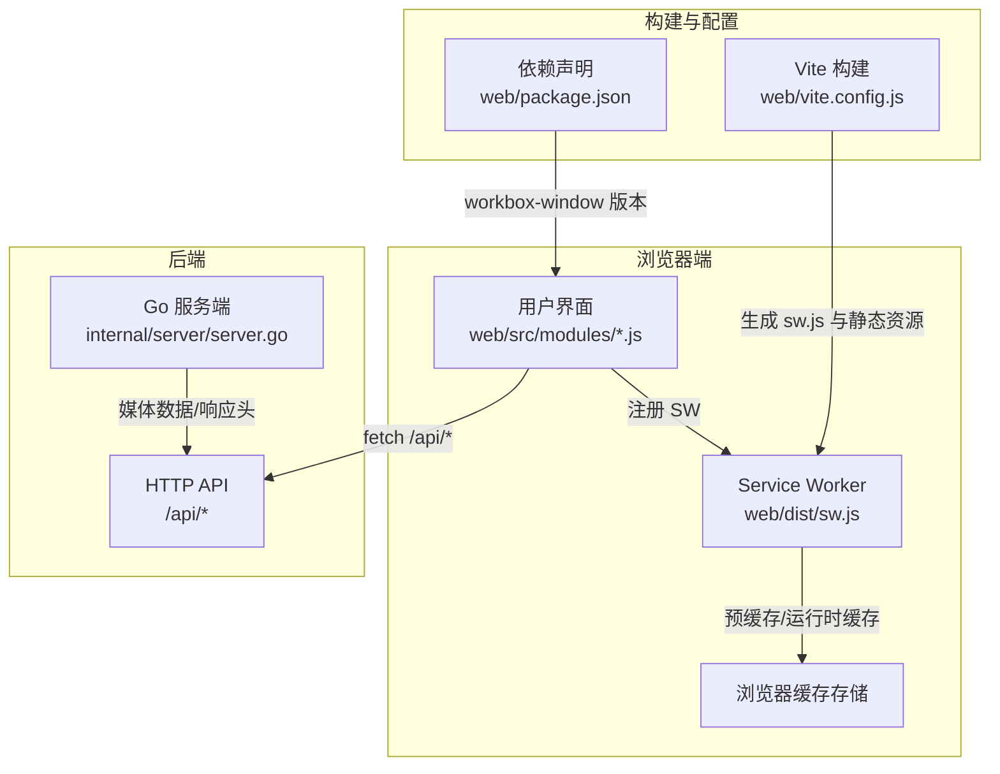
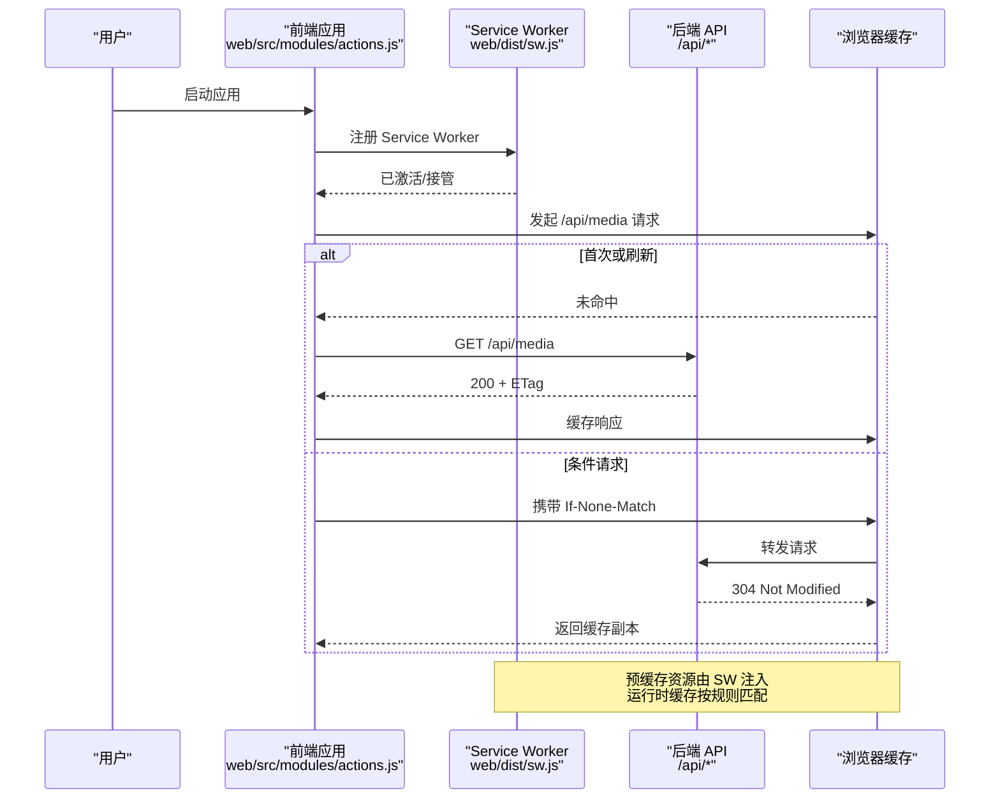
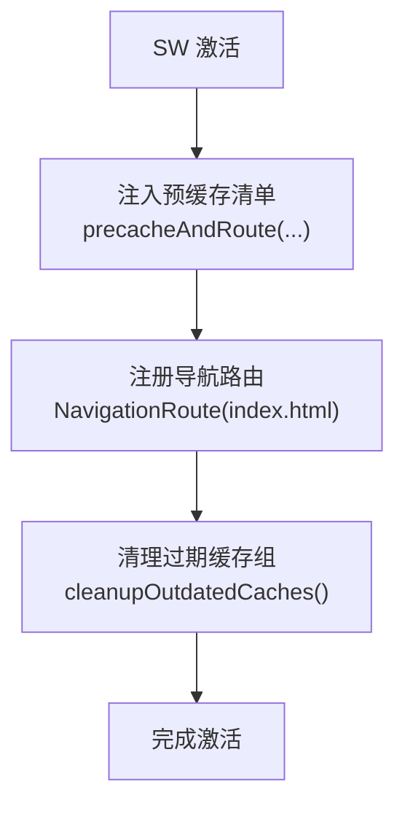
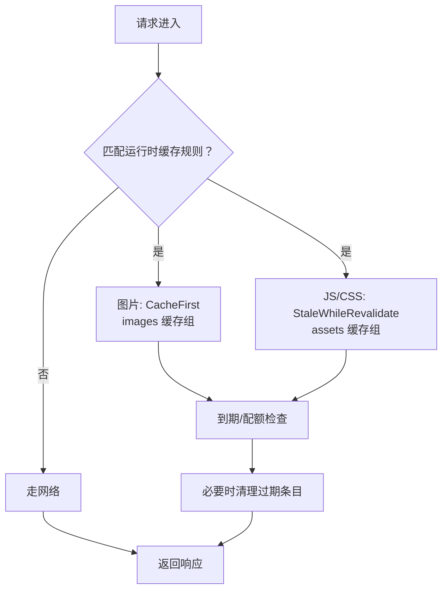
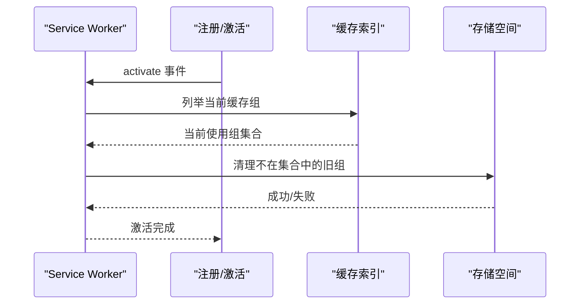
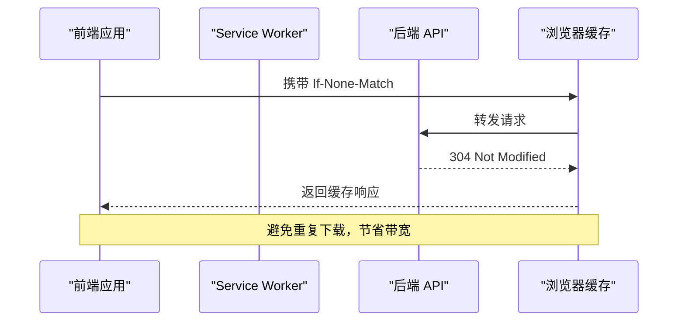
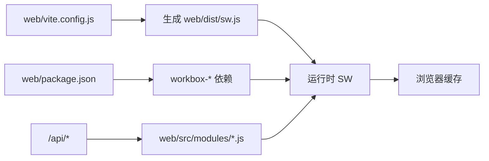

# 缓存策略管理

<cite>
**本文档引用的文件**
- [sw.js](file://web/dist/sw.js)
- [vite.config.js](file://web/vite.config.js)
- [package.json](file://web/package.json)
- [PERFORMANCE_ANALYSIS.md](file://PERFORMANCE_ANALYSIS.md)
- [actions.js](file://web/src/modules/actions.js)
- [api.js](file://web/src/modules/api.js)
- [server.go](file://internal/server/server.go)
- [constants.go](file://internal/constants/constants.go)
- [metrics.go](file://internal/server/metrics.go)
</cite>

## 目录
1. [简介](#简介)
2. [项目结构](#项目结构)
3. [核心组件](#核心组件)
4. [架构总览](#架构总览)
5. [详细组件分析](#详细组件分析)
6. [依赖关系分析](#依赖关系分析)
7. [性能考量](#性能考量)
8. [故障排查指南](#故障排查指南)
9. [结论](#结论)

## 简介
本文件系统性阐述 MSP 项目的缓存策略管理，重点覆盖 Workbox 的三大缓存策略：预缓存（precache）、运行时缓存（runtime cache）与网络优先策略；详解 cleanupOutdatedCaches() 的过期缓存清理机制；给出针对 HTML、CSS、JS、图片、字体等静态资源的策略选择建议；并提供缓存监控与性能调优实践，包括缓存命中率统计与存储空间管理。

## 项目结构
前端通过 Vite 构建，结合 VitePWA 插件生成 Service Worker 与 Manifest；后端提供媒体列表等 API 接口；前端在启动时注册 SW 并进行条件缓存与 ETag 协作。

图表来源
- [sw.js](file://web/dist/sw.js#L1-L2)
- [vite.config.js](file://web/vite.config.js#L1-L48)
- [package.json](file://web/package.json#L1-L25)
- [server.go](file://internal/server/server.go#L411-L437)

章节来源
- [sw.js](file://web/dist/sw.js#L1-L2)
- [vite.config.js](file://web/vite.config.js#L1-L48)
- [package.json](file://web/package.json#L1-L25)

## 核心组件
- Service Worker 与 Workbox：负责预缓存清单注入、导航回退、运行时缓存路由与清理过期缓存。
- VitePWA 配置：定义预缓存模式、运行时缓存规则、导航回退与 Manifest。
- 前端应用：在启动时注册 SW，并在媒体列表接口中使用 ETag 实现条件请求。
- 后端服务：提供 API 数据，配合前端缓存策略与浏览器缓存头。

章节来源
- [sw.js](file://web/dist/sw.js#L1-L2)
- [vite.config.js](file://web/vite.config.js#L7-L33)
- [actions.js](file://web/src/modules/actions.js#L93-L163)
- [api.js](file://web/src/modules/api.js#L16-L22)
- [server.go](file://internal/server/server.go#L411-L437)

## 架构总览
下图展示浏览器端缓存与后端 API 的交互流程，以及 SW 的预缓存与运行时缓存策略如何协同工作。

图表来源
- [actions.js](file://web/src/modules/actions.js#L38-L91)
- [api.js](file://web/src/modules/api.js#L16-L22)
- [sw.js](file://web/dist/sw.js#L1-L2)

## 详细组件分析

### 预缓存（Precache）与导航回退
- 预缓存清单由构建阶段注入到 SW 中，确保关键静态资源在首次安装时即缓存。
- 导航回退（navigateFallback）指向首页，配合 denylist 排除 /api 前缀，避免对 API 请求走离线页。
- cleanupOutdatedCaches() 会在激活阶段清理过期缓存组，保证缓存一致性。

图表来源
- [sw.js](file://web/dist/sw.js#L1-L2)

章节来源
- [sw.js](file://web/dist/sw.js#L1-L2)

### 运行时缓存策略与路由
- API 请求（/api/*）采用 NetworkOnly，避免缓存动态数据。
- 图片资源（png/jpg/jpeg/svg/gif/webp）采用 CacheFirst，并设置缓存名称与过期策略。
- JS/CSS 资源采用 StaleWhileRevalidate，兼顾新鲜度与性能。
- 预缓存模式 globPatterns 包含 js/css/html/svg/png/ico/woff2 等静态资源。

图表来源
- [vite.config.js](file://web/vite.config.js#L10-L18)
- [PERFORMANCE_ANALYSIS.md](file://PERFORMANCE_ANALYSIS.md#L737-L777)

章节来源
- [vite.config.js](file://web/vite.config.js#L10-L18)
- [PERFORMANCE_ANALYSIS.md](file://PERFORMANCE_ANALYSIS.md#L737-L777)

### 网络优先策略说明
- 当前配置未显式定义“网络优先”策略；如需对特定资源启用网络优先，可在 runtimeCaching 中增加对应 urlPattern 与 handler。
- 对于需要强一致性的 API 或临时性资源，NetworkOnly 已满足需求。

章节来源
- [vite.config.js](file://web/vite.config.js#L10-L18)

### 过期缓存清理机制（cleanupOutdatedCaches）
- 在 SW 激活阶段调用 cleanupOutdatedCaches()，自动移除不再使用的旧缓存组，释放存储空间并避免版本冲突。
- 结合 expiration 配置（maxEntries/maxAgeSeconds），可实现基于配额与时间的双重淘汰。

图表来源
- [sw.js](file://web/dist/sw.js#L1-L2)

章节来源
- [sw.js](file://web/dist/sw.js#L1-L2)

### 不同资源类型的缓存策略选择
- HTML：预缓存（globPatterns），确保离线引导页可用。
- CSS/JS：StaleWhileRevalidate，平衡新鲜度与加载速度。
- 图片：CacheFirst，显著降低带宽与延迟。
- 字体（woff2）：根据实际访问频率与体积，可采用 CacheFirst 或 StaleWhileRevalidate。
- API：NetworkOnly，避免缓存动态/私有数据。

章节来源
- [PERFORMANCE_ANALYSIS.md](file://PERFORMANCE_ANALYSIS.md#L737-L777)
- [vite.config.js](file://web/vite.config.js#L10-L18)

### 前端条件缓存与 ETag 协作
- 前端在媒体列表请求中携带 If-None-Match，后端返回 304 时浏览器直接使用缓存副本，减少传输。
- 前端在非受限请求中保存并复用 ETag，提升后续请求命中率。

图表来源
- [actions.js](file://web/src/modules/actions.js#L38-L91)
- [api.js](file://web/src/modules/api.js#L16-L22)

章节来源
- [actions.js](file://web/src/modules/actions.js#L38-L91)
- [api.js](file://web/src/modules/api.js#L16-L22)

## 依赖关系分析
- 构建侧：VitePWA 插件生成 SW 与 Manifest，Workbox 版本由 package.json 管控。
- 运行侧：SW 依赖 Workbox 核心模块；前端通过 workbox-window 注册 SW；后端提供 API 数据并与前端缓存策略协作。

图表来源
- [vite.config.js](file://web/vite.config.js#L1-L48)
- [package.json](file://web/package.json#L11-L12)
- [sw.js](file://web/dist/sw.js#L1-L2)

章节来源
- [vite.config.js](file://web/vite.config.js#L1-L48)
- [package.json](file://web/package.json#L11-L12)
- [sw.js](file://web/dist/sw.js#L1-L2)

## 性能考量
- 缓存命中率统计：可通过浏览器开发者工具的 Application/Cache Storage 面板观察命中/未命中情况；也可在服务端集成 expvar 指标导出，记录缓存命中/未命中计数。
- 存储空间管理：合理设置 expiration.maxEntries 与 maxAgeSeconds，避免缓存膨胀；定期清理过期缓存组（cleanupOutdatedCaches）。
- 资源体积与数量：对大体积图片采用 CacheFirst，对频繁更新的 JS/CSS 采用 StaleWhileRevalidate；字体资源可考虑长效缓存。
- 网络波动：API 使用 NetworkOnly，避免缓存污染；静态资源采用合适的过期策略，确保版本更新及时生效。

章节来源
- [PERFORMANCE_ANALYSIS.md](file://PERFORMANCE_ANALYSIS.md#L875-L929)

## 故障排查指南
- SW 未生效或缓存未更新
  - 检查 sw.js 是否正确注入预缓存清单与路由。
  - 确认激活阶段是否调用 cleanupOutdatedCaches()。
- API 数据异常或显示过期
  - 确认前端请求未被浏览器缓存（cache: "no-store"）。
  - 检查后端 ETag 生成与 304 返回逻辑。
- 图片/字体加载缓慢
  - 检查运行时缓存规则是否匹配目标资源类型。
  - 调整 expiration 配置，确保缓存命中且不过期。
- 存储空间不足
  - 降低 maxEntries 或缩短 maxAgeSeconds。
  - 定期执行清理流程，避免缓存堆积。

章节来源
- [sw.js](file://web/dist/sw.js#L1-L2)
- [actions.js](file://web/src/modules/actions.js#L38-L91)
- [api.js](file://web/src/modules/api.js#L16-L22)
- [PERFORMANCE_ANALYSIS.md](file://PERFORMANCE_ANALYSIS.md#L875-L929)

## 结论
MSP 项目通过 VitePWA 与 Workbox 实现了完善的前端缓存体系：预缓存确保关键资源快速可用，运行时缓存针对不同资源类型采用差异化策略，过期清理保障缓存健康。结合前端 ETag 条件请求与后端 API 的协作，整体在性能与一致性之间取得良好平衡。建议持续监控命中率与存储使用，按需调整过期策略与配额，以适应业务变化与用户规模增长。