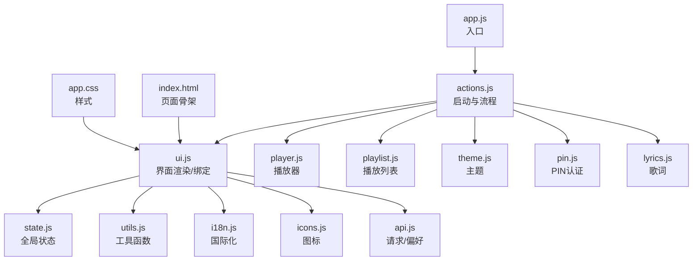
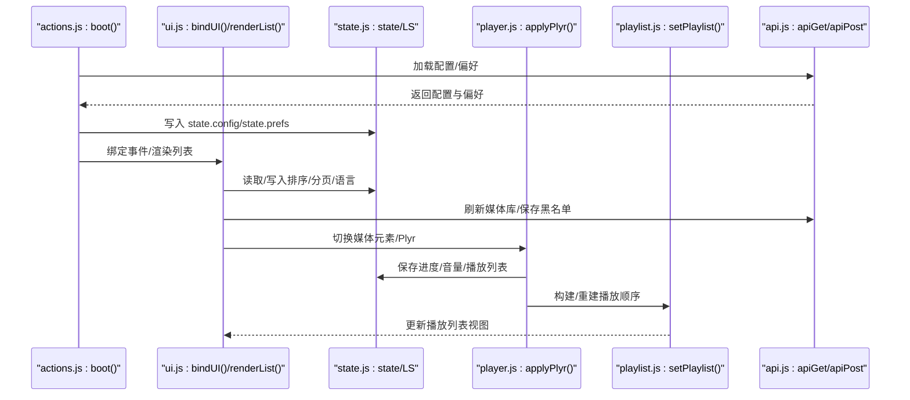
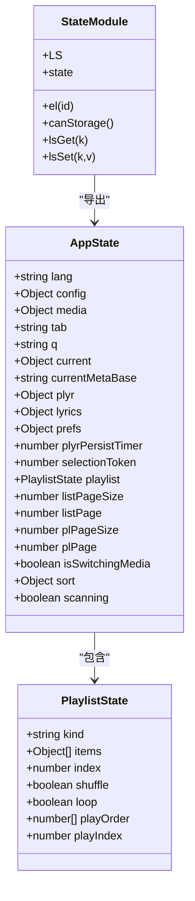
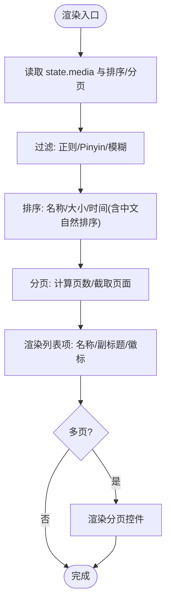
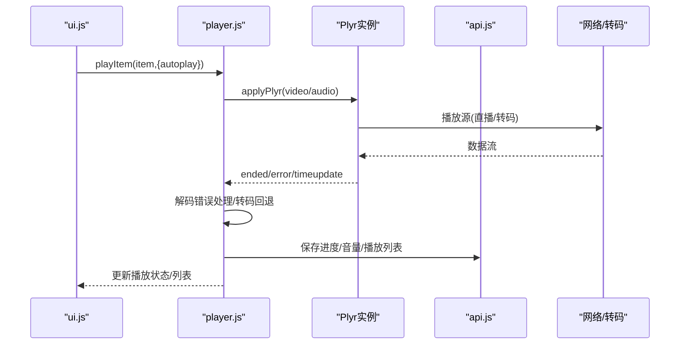
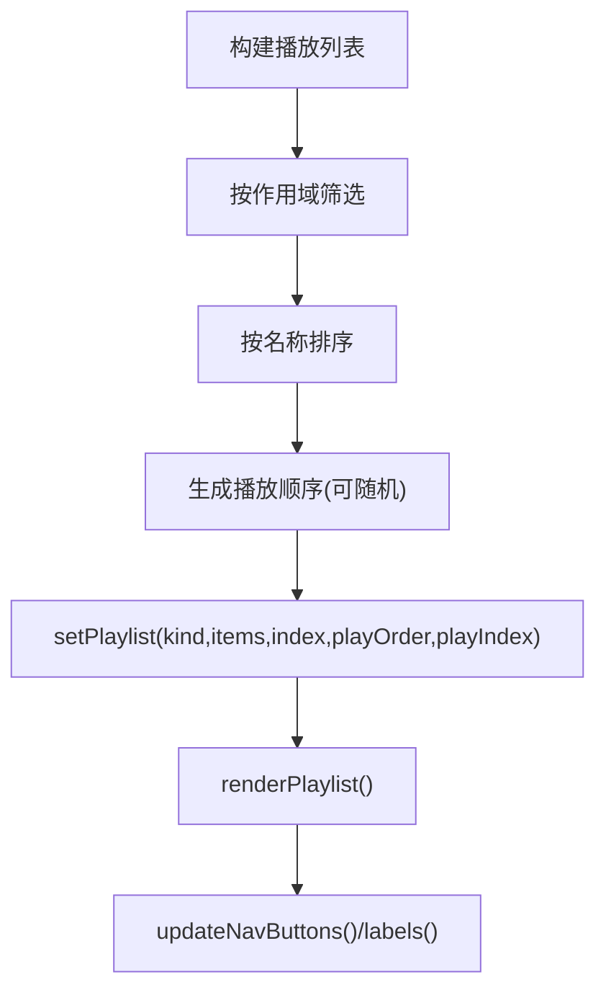
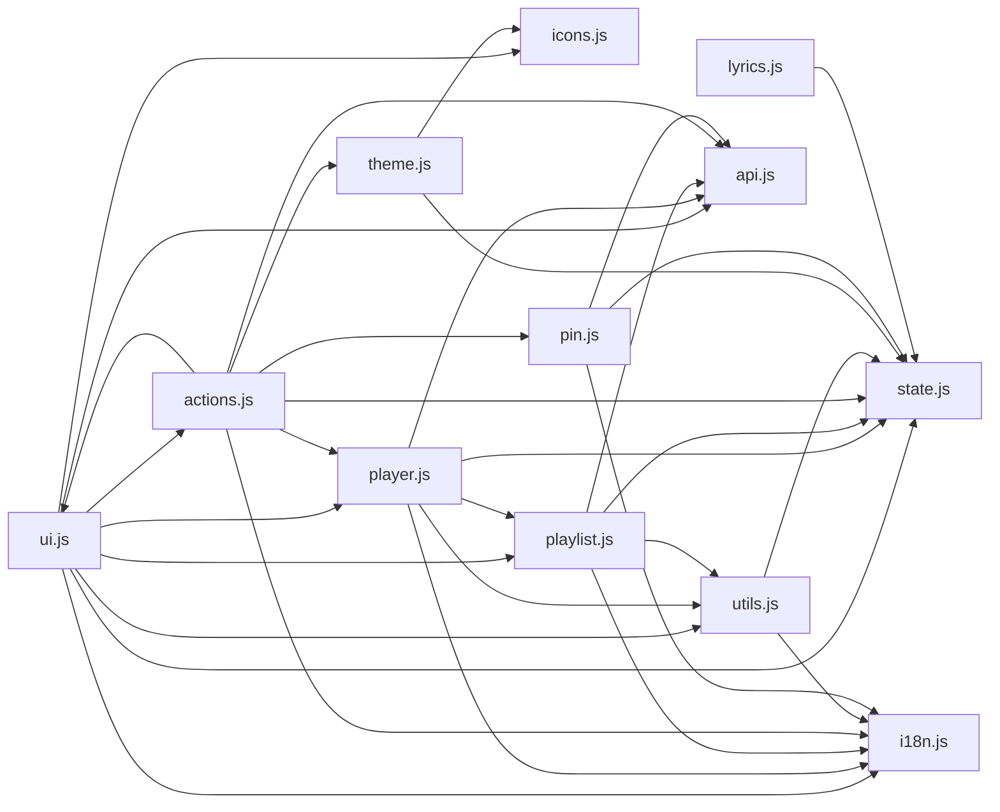

# UI组件系统

<cite>
**本文档引用的文件**
- [web/src/modules/ui.js](file://web/src/modules/ui.js)
- [web/src/modules/state.js](file://web/src/modules/state.js)
- [web/src/modules/utils.js](file://web/src/modules/utils.js)
- [web/src/modules/actions.js](file://web/src/modules/actions.js)
- [web/src/modules/player.js](file://web/src/modules/player.js)
- [web/src/modules/playlist.js](file://web/src/modules/playlist.js)
- [web/src/modules/icons.js](file://web/src/modules/icons.js)
- [web/src/modules/i18n.js](file://web/src/modules/i18n.js)
- [web/src/modules/theme.js](file://web/src/modules/theme.js)
- [web/src/modules/pin.js](file://web/src/modules/pin.js)
- [web/src/modules/lyrics.js](file://web/src/modules/lyrics.js)
- [web/src/modules/api.js](file://web/src/modules/api.js)
- [web/index.html](file://web/index.html)
- [web/src/app.js](file://web/src/app.js)
- [web/src/app.css](file://web/src/app.css)
</cite>

## 目录
1. [简介](#简介)
2. [项目结构](#项目结构)
3. [核心组件](#核心组件)
4. [架构总览](#架构总览)
5. [详细组件分析](#详细组件分析)
6. [依赖关系分析](#依赖关系分析)
7. [性能考虑](#性能考虑)
8. [故障排除指南](#故障排除指南)
9. [结论](#结论)
10. [附录](#附录)

## 简介
本文件系统性梳理 MSP 项目的 UI 组件体系，涵盖模块化设计、组件分类、命名规范、依赖关系、交互组件实现、状态管理、工具函数模块、复用与扩展实践，以及常见问题与解决方案。目标是帮助开发者快速理解并高效使用与扩展 UI 子系统。

## 项目结构
UI 子系统位于 web/src/modules 下，采用“功能域模块化”的组织方式，每个模块聚焦特定职责：
- ui.js：界面渲染与交互绑定
- state.js：全局状态与本地存储
- utils.js：通用工具函数
- actions.js：应用启动与流程编排
- player.js：播放器与媒体控制
- playlist.js：播放列表与分页
- icons.js：图标 SVG 生成
- i18n.js：国际化文案
- theme.js：主题切换
- pin.js：PIN 认证对话框
- lyrics.js：歌词解析与展示
- api.js：HTTP 请求与偏好存储

页面结构由 web/index.html 提供骨架，样式由 web/src/app.css 统一管理。

图表来源
- [web/src/app.js](file://web/src/app.js#L1-L5)
- [web/src/modules/actions.js](file://web/src/modules/actions.js#L1-L164)
- [web/src/modules/ui.js](file://web/src/modules/ui.js#L1-L417)
- [web/src/modules/state.js](file://web/src/modules/state.js#L1-L127)
- [web/src/modules/utils.js](file://web/src/modules/utils.js#L1-L124)
- [web/src/modules/player.js](file://web/src/modules/player.js#L1-L800)
- [web/src/modules/playlist.js](file://web/src/modules/playlist.js#L1-L457)
- [web/src/modules/icons.js](file://web/src/modules/icons.js#L1-L34)
- [web/src/modules/i18n.js](file://web/src/modules/i18n.js#L1-L201)
- [web/src/modules/theme.js](file://web/src/modules/theme.js#L1-L67)
- [web/src/modules/pin.js](file://web/src/modules/pin.js#L1-L112)
- [web/src/modules/lyrics.js](file://web/src/modules/lyrics.js#L1-L74)
- [web/src/modules/api.js](file://web/src/modules/api.js#L1-L155)
- [web/index.html](file://web/index.html#L1-L195)
- [web/src/app.css](file://web/src/app.css#L1-L800)

章节来源
- [web/src/app.js](file://web/src/app.js#L1-L5)
- [web/src/modules/actions.js](file://web/src/modules/actions.js#L93-L163)
- [web/index.html](file://web/index.html#L1-L195)

## 核心组件
- 全局状态中心：集中管理语言、配置、媒体库、播放列表、排序、分页等
- 界面渲染与交互：负责 DOM 渲染、事件绑定、国际化更新、对话框管理
- 播放器与媒体控制：Plyr 封装、错误处理、转码回退、音轨/字幕管理
- 播放列表：构建、分页、排序、导航、随机/循环
- 工具函数：格式化、MIME 推断、流地址生成、探测信息
- 主题与国际化：动态主题切换、多语言文案
- 认证与歌词：PIN 对话框、歌词解析与滚动高亮

章节来源
- [web/src/modules/state.js](file://web/src/modules/state.js#L61-L93)
- [web/src/modules/ui.js](file://web/src/modules/ui.js#L10-L72)
- [web/src/modules/player.js](file://web/src/modules/player.js#L356-L706)
- [web/src/modules/playlist.js](file://web/src/modules/playlist.js#L91-L102)
- [web/src/modules/utils.js](file://web/src/modules/utils.js#L4-L124)
- [web/src/modules/theme.js](file://web/src/modules/theme.js#L4-L66)
- [web/src/modules/i18n.js](file://web/src/modules/i18n.js#L3-L183)
- [web/src/modules/pin.js](file://web/src/modules/pin.js#L5-L72)
- [web/src/modules/lyrics.js](file://web/src/modules/lyrics.js#L3-L74)

## 架构总览
UI 子系统遵循“状态驱动渲染”的单向数据流：
- actions.js 负责应用启动、网络请求与初始状态设置
- state.js 提供全局状态与本地存储接口
- ui.js 负责根据 state 渲染 DOM 并绑定事件
- player.js/playlist.js 管理媒体播放与列表状态
- utils.js/i18n.js/theme.js/pin.js/lyrics.js/api.js 提供支撑能力

图表来源
- [web/src/modules/actions.js](file://web/src/modules/actions.js#L93-L163)
- [web/src/modules/ui.js](file://web/src/modules/ui.js#L275-L416)
- [web/src/modules/state.js](file://web/src/modules/state.js#L61-L127)
- [web/src/modules/player.js](file://web/src/modules/player.js#L356-L706)
- [web/src/modules/playlist.js](file://web/src/modules/playlist.js#L91-L102)
- [web/src/modules/api.js](file://web/src/modules/api.js#L16-L36)

## 详细组件分析

### 状态管理组件
- 全局状态 state：包含语言、配置、媒体库、当前播放项、播放列表、排序、分页、扫描状态等
- 本地存储 LS：键空间统一管理，用于持久化用户偏好与 UI 状态
- 偏好存储 gpGet/gpSet：优先使用服务端偏好，回退本地存储，并批量异步保存

图表来源
- [web/src/modules/state.js](file://web/src/modules/state.js#L6-L93)

章节来源
- [web/src/modules/state.js](file://web/src/modules/state.js#L61-L127)
- [web/src/modules/api.js](file://web/src/modules/api.js#L120-L144)

### 交互组件实现
- 列表渲染与分页：按页大小切片，支持多字段排序与搜索过滤
- 标签页切换：切换当前类别并更新 UI
- 对话框：设置/黑名单/认证对话框的显示/隐藏与内容更新
- 播放控制：上一个/下一个、随机/循环、封面/字幕/音轨管理
- 输入框：搜索、路径输入、黑名单规则编辑

图表来源
- [web/src/modules/ui.js](file://web/src/modules/ui.js#L74-L170)
- [web/src/modules/playlist.js](file://web/src/modules/playlist.js#L57-L89)
- [web/src/modules/playlist.js](file://web/src/modules/playlist.js#L38-L55)

章节来源
- [web/src/modules/ui.js](file://web/src/modules/ui.js#L74-L170)
- [web/src/modules/playlist.js](file://web/src/modules/playlist.js#L39-L55)
- [web/src/modules/playlist.js](file://web/src/modules/playlist.js#L57-L89)

### 播放器与媒体控制
- Plyr 初始化：根据设备与配置启用控件、字幕、速度、全屏、存储
- 错误处理：解码错误近尾部自动跳过、源错误一次性重试、转码回退
- 智能寻址：转码流的 seek 动态切换源并保持 UI 时间线一致
- 音轨/字幕：原生 API 检测与恢复用户选择，定期持久化

图表来源
- [web/src/modules/player.js](file://web/src/modules/player.js#L356-L706)
- [web/src/modules/api.js](file://web/src/modules/api.js#L95-L108)

章节来源
- [web/src/modules/player.js](file://web/src/modules/player.js#L356-L706)
- [web/src/modules/api.js](file://web/src/modules/api.js#L95-L108)

### 播放列表与导航
- 构建：按作用域（全部/文件夹/共享）筛选并排序
- 分页：自适应高度计算，动态调整每页数量
- 导航：上一个/下一个/索引跳转，支持循环与随机
- 重建：基于当前项重建播放顺序，保持当前曲目位置

图表来源
- [web/src/modules/playlist.js](file://web/src/modules/playlist.js#L400-L424)
- [web/src/modules/playlist.js](file://web/src/modules/playlist.js#L91-L102)
- [web/src/modules/playlist.js](file://web/src/modules/playlist.js#L327-L342)

章节来源
- [web/src/modules/playlist.js](file://web/src/modules/playlist.js#L91-L102)
- [web/src/modules/playlist.js](file://web/src/modules/playlist.js#L327-L342)
- [web/src/modules/playlist.js](file://web/src/modules/playlist.js#L400-L424)
- [web/src/modules/playlist.js](file://web/src/modules/playlist.js#L426-L457)

### 国际化与主题
- 国际化：I18N 字典按语言维护，动态替换文本/占位符/标题
- 主题：基于 data-theme 的明暗主题切换，支持系统偏好与动画过渡

章节来源
- [web/src/modules/i18n.js](file://web/src/modules/i18n.js#L3-L183)
- [web/src/modules/theme.js](file://web/src/modules/theme.js#L4-L66)

### 认证与歌词
- PIN 认证：检查是否需要 PIN，显示/隐藏对话框，校验后刷新页面
- 歌词：LRC 解析、按时间滚动高亮、空状态提示

章节来源
- [web/src/modules/pin.js](file://web/src/modules/pin.js#L5-L72)
- [web/src/modules/lyrics.js](file://web/src/modules/lyrics.js#L8-L74)

## 依赖关系分析
- ui.js 依赖 state.js、i18n.js、playlist.js、player.js、utils.js、icons.js、api.js、actions.js
- player.js 依赖 state.js、i18n.js、api.js、utils.js、playlist.js
- playlist.js 依赖 state.js、i18n.js、utils.js、api.js
- actions.js 依赖 state.js、i18n.js、api.js、ui.js、player.js、theme.js、pin.js
- utils.js 依赖 state.js、i18n.js
- 其他模块相对独立，通过 state 与 api 协作

图表来源
- [web/src/modules/ui.js](file://web/src/modules/ui.js#L1-L8)
- [web/src/modules/player.js](file://web/src/modules/player.js#L1-L6)
- [web/src/modules/playlist.js](file://web/src/modules/playlist.js#L1-L5)
- [web/src/modules/actions.js](file://web/src/modules/actions.js#L1-L8)
- [web/src/modules/utils.js](file://web/src/modules/utils.js#L1-L2)
- [web/src/modules/theme.js](file://web/src/modules/theme.js#L1-L2)
- [web/src/modules/pin.js](file://web/src/modules/pin.js#L1-L3)
- [web/src/modules/lyrics.js](file://web/src/modules/lyrics.js#L1-L2)

章节来源
- [web/src/modules/ui.js](file://web/src/modules/ui.js#L1-L8)
- [web/src/modules/player.js](file://web/src/modules/player.js#L1-L6)
- [web/src/modules/playlist.js](file://web/src/modules/playlist.js#L1-L5)
- [web/src/modules/actions.js](file://web/src/modules/actions.js#L1-L8)

## 性能考虑
- 列表分页与自适应：playlist.js 自动测量行高与分页器高度，动态调整每页条数，减少重排
- 播放器心跳检测：避免播放卡死导致的资源占用，15 秒无进度强制结束
- 转码回退与智能寻址：仅在必要时启用转码，seek 时动态切换源，降低内存与带宽压力
- 批量偏好保存：300ms 批次合并，减少网络请求频率
- 本地存储探测：统一异常捕获，避免阻塞主线程

章节来源
- [web/src/modules/playlist.js](file://web/src/modules/playlist.js#L190-L236)
- [web/src/modules/player.js](file://web/src/modules/player.js#L524-L555)
- [web/src/modules/api.js](file://web/src/modules/api.js#L129-L144)
- [web/src/modules/state.js](file://web/src/modules/state.js#L103-L127)

## 故障排除指南
- 播放失败（解码/源不支持）
  - 现象：出现“不支持”提示或播放器报错
  - 处理：开启转码回退；尝试“在新标签打开”下载查看；检查浏览器支持的编解码器
  - 参考：播放器错误拦截与转码回退逻辑
- 列表空白或无媒体
  - 现象：提示“未配置共享目录”或为空
  - 处理：进入设置添加共享目录；刷新媒体库；检查黑名单规则
  - 参考：ui.js 渲染与 actions.js 加载流程
- PIN 认证失败
  - 现象：弹出认证对话框且提示错误
  - 处理：确认 PIN；重新输入；刷新页面重试
  - 参考：pin.js 认证流程
- 主题切换无效
  - 现象：切换主题无效果
  - 处理：检查 data-theme 属性；确认系统偏好；刷新页面
  - 参考：theme.js 主题切换

章节来源
- [web/src/modules/player.js](file://web/src/modules/player.js#L363-L442)
- [web/src/modules/actions.js](file://web/src/modules/actions.js#L10-L36)
- [web/src/modules/pin.js](file://web/src/modules/pin.js#L74-L112)
- [web/src/modules/theme.js](file://web/src/modules/theme.js#L32-L66)

## 结论
MSP 的 UI 组件系统以模块化为核心，通过清晰的状态中心与稳定的渲染/交互层，实现了媒体浏览、播放、列表管理与用户体验优化的完整闭环。其设计强调：
- 状态驱动渲染，降低耦合
- 播放器健壮性与兼容性（转码回退、心跳检测）
- 列表性能优化（自适应分页）
- 国际化与主题的可扩展性
- 认证与歌词等周边功能的完善

## 附录

### 组件分类与命名规范
- 模块命名：按功能域划分，如 ui、state、player、playlist、utils、i18n、theme、pin、lyrics、api
- 文件命名：小写加连字符，如 ui.js、state.js、player.js
- 类型注释：state.js 使用 JSDoc 定义复杂对象结构，提升可读性
- 常量命名：LS 作为本地存储键空间统一前缀

章节来源
- [web/src/modules/state.js](file://web/src/modules/state.js#L42-L58)

### 工具函数模块
- 格式化：字节、时间、文件名
- MIME 推断：根据扩展名推断媒体类型
- 探测：媒体探测缓存、错误文案映射
- 偏好：gpGet/gpSet 批量保存

章节来源
- [web/src/modules/utils.js](file://web/src/modules/utils.js#L4-L124)
- [web/src/modules/api.js](file://web/src/modules/api.js#L42-L108)

### 组件复用与扩展最佳实践
- 封装：将 DOM 创建与事件绑定封装为可复用函数（如 renderList、renderPlaylist）
- 属性传递：通过 state 与 props（通过 state 传递）实现跨组件通信
- 事件冒泡：统一在 ui.js 中绑定事件，避免重复监听
- 扩展点：新增组件时，优先复用 utils/i18n/icons 等模块，保持一致性

章节来源
- [web/src/modules/ui.js](file://web/src/modules/ui.js#L275-L416)
- [web/src/modules/utils.js](file://web/src/modules/utils.js#L62-L70)
- [web/src/modules/i18n.js](file://web/src/modules/i18n.js#L185-L192)
- [web/src/modules/icons.js](file://web/src/modules/icons.js#L21-L33)