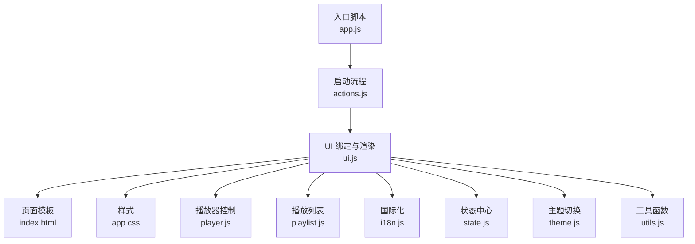
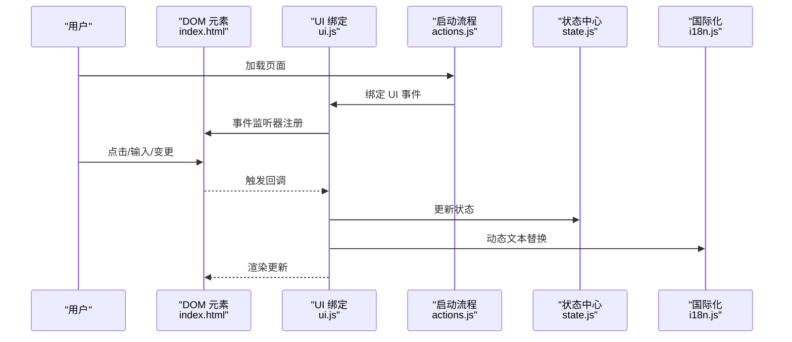
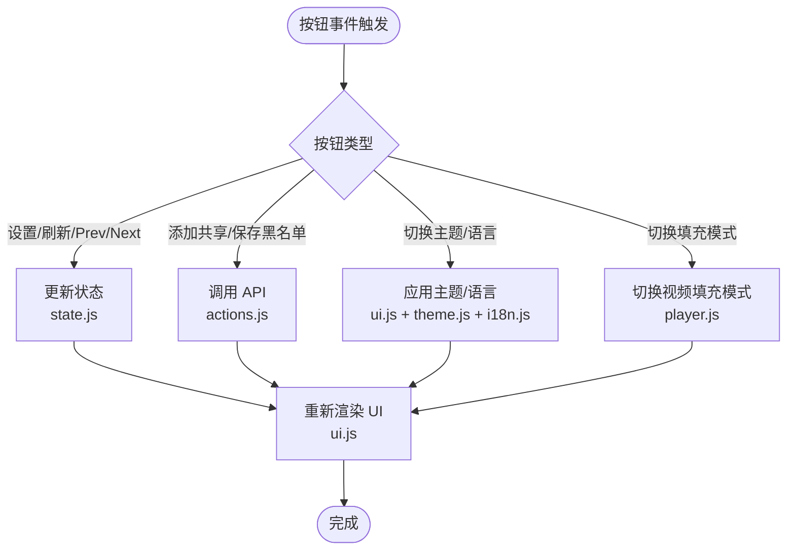
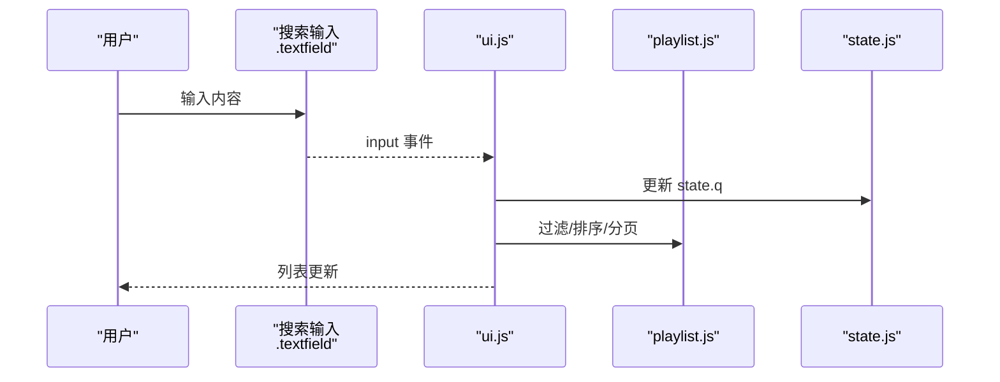
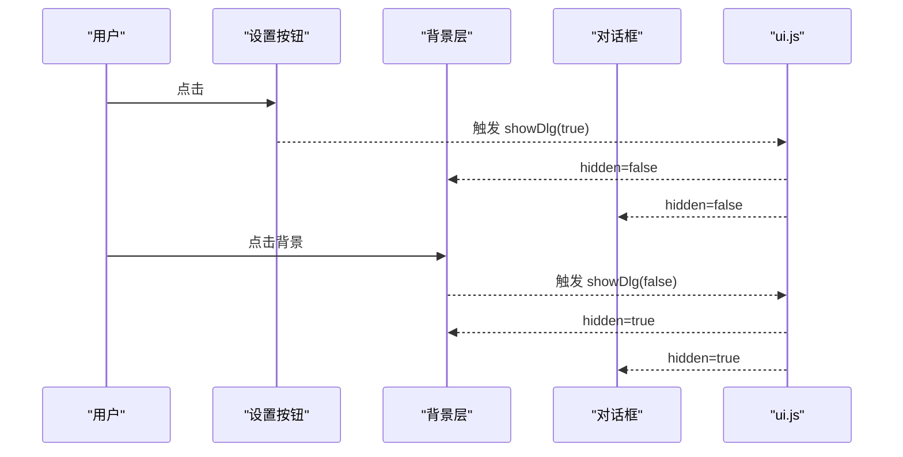
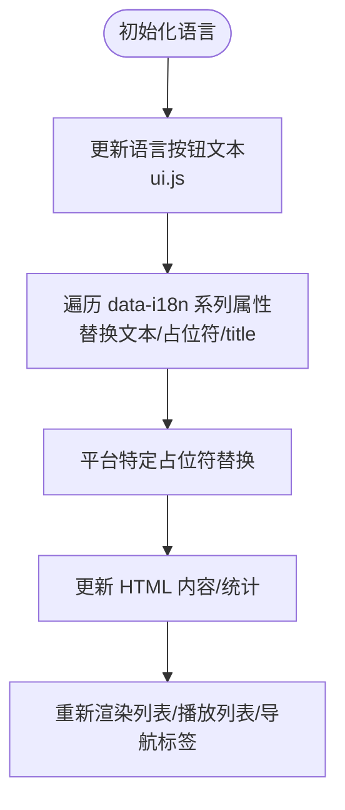
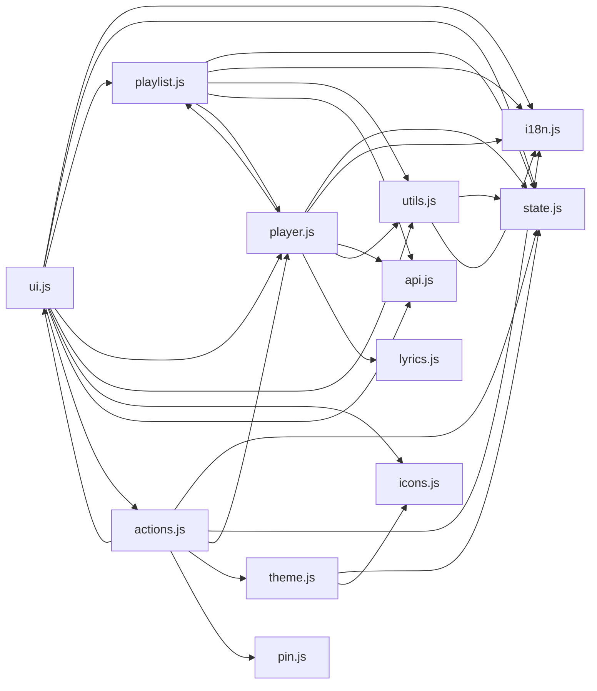

# 交互组件

<cite>
**本文引用的文件**
- [index.html](file://web/index.html)
- [app.js](file://web/src/app.js)
- [app.css](file://web/src/app.css)
- [ui.js](file://web/src/modules/ui.js)
- [actions.js](file://web/src/modules/actions.js)
- [i18n.js](file://web/src/modules/i18n.js)
- [state.js](file://web/src/modules/state.js)
- [player.js](file://web/src/modules/player.js)
- [playlist.js](file://web/src/modules/playlist.js)
- [theme.js](file://web/src/modules/theme.js)
- [utils.js](file://web/src/modules/utils.js)
</cite>

## 目录
1. [简介](#简介)
2. [项目结构](#项目结构)
3. [核心组件](#核心组件)
4. [架构总览](#架构总览)
5. [详细组件分析](#详细组件分析)
6. [依赖关系分析](#依赖关系分析)
7. [性能考量](#性能考量)
8. [故障排查指南](#故障排查指南)
9. [结论](#结论)
10. [附录](#附录)

## 简介
本文件聚焦 MSP 前端交互组件，围绕 UI 组件中的交互元素展开，包括按钮组件（btn、btn--ghost）、输入框组件、对话框组件（dlgBackdrop、dlg）等基础交互元素；解释事件绑定机制（点击、输入、变更等）；说明组件状态管理（激活、禁用、可见性控制）；阐述国际化文本更新机制（data-i18n 等属性与动态替换）；并给出组件复用最佳实践（事件委托、DOM 操作优化、内存泄漏防护）及常见问题解决方案。

## 项目结构
前端位于 web 目录，采用模块化组织：
- 入口脚本：app.js
- 样式：app.css
- 页面模板：index.html
- 模块：
  - ui.js：界面渲染与交互绑定
  - actions.js：应用启动流程与数据加载
  - i18n.js：多语言词典与翻译函数
  - state.js：全局状态与本地存储键
  - player.js：播放器与媒体元素控制
  - playlist.js：播放列表构建与导航
  - theme.js：主题切换与图标
  - utils.js：工具函数（格式化、MIME、URL 构造等）

图表来源
- [app.js](file://web/src/app.js#L1-L5)
- [actions.js](file://web/src/modules/actions.js#L93-L164)
- [ui.js](file://web/src/modules/ui.js#L275-L417)
- [index.html](file://web/index.html#L1-L195)
- [app.css](file://web/src/app.css#L1-L1373)
- [player.js](file://web/src/modules/player.js#L1-L800)
- [playlist.js](file://web/src/modules/playlist.js#L1-L457)
- [i18n.js](file://web/src/modules/i18n.js#L1-L201)
- [state.js](file://web/src/modules/state.js#L1-L127)
- [theme.js](file://web/src/modules/theme.js#L1-L67)
- [utils.js](file://web/src/modules/utils.js#L1-L124)

章节来源
- [app.js](file://web/src/app.js#L1-L5)
- [index.html](file://web/index.html#L1-L195)

## 核心组件
- 按钮组件
  - 主要类：.btn、.btn--ghost
  - 行为：悬停、主题色、过渡动画
  - 示例：设置、刷新、上一个/下一个、添加共享、保存黑名单、关闭对话框等
- 输入框组件
  - 类：.textfield
  - 行为：聚焦高亮、占位符国际化、暗色模式优化
  - 示例：搜索框、共享路径、别名、黑名单字段等
- 对话框组件
  - 背景层：.dialog__backdrop
  - 对话框：.dialog
  - 示例：设置对话框（共享目录、黑名单）、PIN 验证对话框
- 通用交互元素
  - 标签页：.tab/.tab--active
  - 列表项：.item
  - 主题切换：.theme-btn
  - 播放控制：.btn（Prev/Next/Resume/Open Raw/Fit Mode）
  - 列表分页：.pager（Prev/Next/页码）

章节来源
- [app.css](file://web/src/app.css#L149-L175)
- [index.html](file://web/index.html#L13-L188)
- [ui.js](file://web/src/modules/ui.js#L14-L17)
- [ui.js](file://web/src/modules/ui.js#L324-L353)
- [ui.js](file://web/src/modules/ui.js#L355-L373)

## 架构总览
交互组件由“页面模板 + 样式 + 模块化逻辑”构成，事件绑定集中在 ui.js 的 bindUI 中，状态集中于 state.js，国际化由 i18n.js 提供，播放器与列表由 player.js 和 playlist.js 协作。

图表来源
- [actions.js](file://web/src/modules/actions.js#L93-L164)
- [ui.js](file://web/src/modules/ui.js#L275-L417)
- [state.js](file://web/src/modules/state.js#L61-L93)
- [i18n.js](file://web/src/modules/i18n.js#L185-L201)

## 详细组件分析

### 按钮组件（btn、btn--ghost）
- 样式与主题
  - .btn：主色背景、白色文字
  - .btn--ghost：透明背景、边框、主题色文字
  - 悬停与过渡：hover 背景色变化，统一 transition
- 交互行为
  - 设置、刷新、上一个/下一个、添加共享、保存黑名单、关闭对话框、切换填充模式、恢复播放、打开原始文件等
- 状态管理
  - 激活/禁用：根据播放列表、当前媒体、配置开关控制 disabled/hidden
  - 可见性：根据功能开关（如 others 标签、播放列表）控制隐藏/显示

图表来源
- [ui.js](file://web/src/modules/ui.js#L275-L417)
- [theme.js](file://web/src/modules/theme.js#L1-L67)
- [player.js](file://web/src/modules/player.js#L211-L226)
- [actions.js](file://web/src/modules/actions.js#L10-L91)

章节来源
- [app.css](file://web/src/app.css#L149-L175)
- [ui.js](file://web/src/modules/ui.js#L275-L417)
- [theme.js](file://web/src/modules/theme.js#L1-L67)
- [player.js](file://web/src/modules/player.js#L211-L226)

### 输入框组件（.textfield）
- 样式与焦点
  - 边框、圆角、背景、主题色
  - focus/focus-visible 高亮与阴影
- 国际化占位符
  - data-i18n-ph：动态替换占位符文本
- 交互行为
  - 搜索框 input 事件：更新查询参数并重新渲染列表
  - 排序字段 change 事件：更新排序字段并持久化
  - 黑名单输入框：逗号/中文逗号分割，保存到配置

图表来源
- [ui.js](file://web/src/modules/ui.js#L324-L333)
- [playlist.js](file://web/src/modules/playlist.js#L57-L89)
- [state.js](file://web/src/modules/state.js#L61-L93)

章节来源
- [app.css](file://web/src/app.css#L417-L461)
- [ui.js](file://web/src/modules/ui.js#L324-L333)
- [playlist.js](file://web/src/modules/playlist.js#L57-L89)

### 对话框组件（.dialog__backdrop、.dialog）
- 结构
  - 背景层：用于点击外部关闭
  - 对话框：标题、主体、动作区
- 交互
  - 显示/隐藏：通过 showDlg 控制两个元素的 hidden 属性
  - 关闭：点击背景层、关闭按钮
- 国际化
  - data-i18n、data-i18n-ph、data-i18n-title：动态文本替换

图表来源
- [ui.js](file://web/src/modules/ui.js#L14-L17)
- [ui.js](file://web/src/modules/ui.js#L282-L284)
- [index.html](file://web/index.html#L117-L188)

章节来源
- [ui.js](file://web/src/modules/ui.js#L14-L17)
- [index.html](file://web/index.html#L117-L188)

### 事件绑定机制
- 绑定入口：bindUI（ui.js）
- 常见事件类型
  - 点击：设置、刷新、Prev/Next、添加共享、保存黑名单、关闭对话框、切换主题/语言、切换填充模式、恢复播放
  - 输入：搜索框
  - 变更：排序字段、切换播放模式（shuffle/loop）
- 事件委托与直接绑定
  - 大量直接绑定到具体元素 ID
  - 列表项点击事件在渲染时动态附加到 .item 元素
- 错误处理
  - 异步 API 调用使用 try/catch 并弹窗提示

章节来源
- [ui.js](file://web/src/modules/ui.js#L275-L417)

### 组件状态管理
- 全局状态：state.js
  - 语言、配置、媒体库、当前标签、搜索词、当前播放项、播放列表、排序、分页等
  - 本地存储键：LS 对象统一管理
- 可视性控制
  - 通过 hidden 属性控制 .dialog、.dialog__backdrop、.tab、.pager 等元素
  - 通过 disabled 控制按钮可用性
- 激活状态
  - .tab--active：根据当前 tab 切换
  - .plitem--active：根据播放顺序定位当前项

章节来源
- [state.js](file://web/src/modules/state.js#L61-L93)
- [ui.js](file://web/src/modules/ui.js#L223-L273)
- [playlist.js](file://web/src/modules/playlist.js#L238-L325)

### 国际化文本更新机制
- 数据源：i18n.js 中 I18N 字典
- 动态替换
  - data-i18n：替换元素文本
  - data-i18n-ph：替换占位符
  - data-i18n-title：替换 title 属性
- 更新流程：updateUIForLang（ui.js）
  - 更新语言按钮文本与 html lang
  - 遍历带 data-i18n 系列属性的元素执行替换
  - 平台特定占位符（Windows/macOS/Linux）
  - 更新 HTML 内容（innerHTML）与统计信息

图表来源
- [i18n.js](file://web/src/modules/i18n.js#L185-L201)
- [ui.js](file://web/src/modules/ui.js#L19-L72)

章节来源
- [i18n.js](file://web/src/modules/i18n.js#L1-L201)
- [ui.js](file://web/src/modules/ui.js#L19-L72)

### 组件复用与最佳实践
- 事件委托
  - 列表项点击在渲染时直接绑定到 .item，避免重复选择器
- DOM 操作优化
  - 批量更新：渲染前清空容器，一次性 append 子节点
  - 分页：按需生成分页器，减少不必要的 DOM
- 内存泄漏防护
  - 播放器销毁：destroyPlyr
  - 媒体元素重置：hideAllMedia/resetMediaEl
  - 定时器清理：播放器心跳定时器、持久化定时器
- 可维护性
  - 统一的 el 工具函数获取元素，避免散落的 querySelector
  - 状态集中管理，避免跨模块直接修改 DOM

章节来源
- [ui.js](file://web/src/modules/ui.js#L74-L170)
- [player.js](file://web/src/modules/player.js#L157-L199)

## 依赖关系分析
- ui.js 依赖 i18n.js、state.js、playlist.js、player.js、utils.js、icons.js、api.js、actions.js
- actions.js 依赖 ui.js、state.js、i18n.js、api.js、player.js、theme.js、pin.js
- player.js 依赖 state.js、i18n.js、api.js、utils.js、lyrics.js、playlist.js
- playlist.js 依赖 state.js、i18n.js、utils.js、api.js、player.js
- theme.js 依赖 state.js、icons.js
- utils.js 依赖 state.js、i18n.js

图表来源
- [ui.js](file://web/src/modules/ui.js#L1-L8)
- [actions.js](file://web/src/modules/actions.js#L1-L9)
- [player.js](file://web/src/modules/player.js#L1-L7)
- [playlist.js](file://web/src/modules/playlist.js#L1-L6)
- [theme.js](file://web/src/modules/theme.js#L1-L3)
- [utils.js](file://web/src/modules/utils.js#L1-L3)

章节来源
- [ui.js](file://web/src/modules/ui.js#L1-L8)
- [actions.js](file://web/src/modules/actions.js#L1-L9)
- [player.js](file://web/src/modules/player.js#L1-L7)
- [playlist.js](file://web/src/modules/playlist.js#L1-L6)
- [theme.js](file://web/src/modules/theme.js#L1-L3)
- [utils.js](file://web/src/modules/utils.js#L1-L3)

## 性能考量
- 渲染优化
  - 列表与播放列表分页渲染，避免一次性大量 DOM
  - 自适应分页：根据容器高度动态计算每页条数
- 媒体播放
  - 播放器错误拦截与降级：解码错误近尾部时视为结束，避免卡顿
  - 转码回退：根据配置与格式自动尝试转码流
  - 心跳检测：检测播放停滞并强制结束，防止 UI 卡死
- 事件与存储
  - 事件直接绑定到 ID，减少选择器开销
  - 本地存储键集中管理，避免重复读写

章节来源
- [playlist.js](file://web/src/modules/playlist.js#L190-L236)
- [player.js](file://web/src/modules/player.js#L341-L443)
- [player.js](file://web/src/modules/player.js#L524-L555)

## 故障排查指南
- 对话框无法关闭
  - 检查 showDlg 是否被调用，确认 .dialog__backdrop 与 .dialog 的 hidden 属性同步
  - 确认点击背景层事件是否绑定成功
- 搜索无结果
  - 检查 input 事件是否更新 state.q
  - 确认 filterFiles 逻辑（正则、拼音、模糊）
- 排序无效
  - 检查 change 事件是否更新 state.sort.field，并持久化到本地存储
  - 确认 sortFiles 的排序字段与顺序
- 播放异常
  - 查看播放器错误拦截日志，确认是否触发转码回退
  - 检查 canPlayType 与 MIME 映射
- 语言/主题切换不生效
  - 确认 updateUIForLang 是否执行
  - 检查 data-i18n 系列属性与占位符是否正确
  - 主题切换需确认 data-theme 属性与图标更新

章节来源
- [ui.js](file://web/src/modules/ui.js#L14-L17)
- [ui.js](file://web/src/modules/ui.js#L282-L284)
- [ui.js](file://web/src/modules/ui.js#L324-L333)
- [playlist.js](file://web/src/modules/playlist.js#L39-L55)
- [player.js](file://web/src/modules/player.js#L341-L443)
- [utils.js](file://web/src/modules/utils.js#L72-L93)
- [i18n.js](file://web/src/modules/i18n.js#L185-L201)
- [theme.js](file://web/src/modules/theme.js#L1-L67)

## 结论
MSP 的交互组件以模块化为核心，通过统一的状态中心与国际化机制，结合清晰的事件绑定与渲染策略，实现了稳定且可维护的 UI 交互体验。遵循本文的最佳实践，可在保证功能完整性的同时提升性能与可维护性。

## 附录
- 实际使用示例
  - 打开设置对话框：点击“设置”按钮
  - 切换语言：点击右上角语言按钮
  - 切换主题：点击主题按钮
  - 切换排序：点击排序按钮，再次点击切换正序/倒序
  - 切换填充模式：在视频预览时点击“填充模式”按钮
  - 播放列表导航：点击上一个/下一个按钮或直接点击播放列表项
- 常见问题
  - 列表不更新：确认 input/change 事件是否触发 renderList
  - 对话框不显示：确认 showDlg(true) 是否被调用
  - 媒体无法播放：检查浏览器支持与转码配置