# 列表渲染系统

<cite>
**本文档引用的文件**
- [web/index.html](file://web/index.html)
- [web/src/app.js](file://web/src/app.js)
- [web/src/app.css](file://web/src/app.css)
- [web/src/modules/state.js](file://web/src/modules/state.js)
- [web/src/modules/ui.js](file://web/src/modules/ui.js)
- [web/src/modules/playlist.js](file://web/src/modules/playlist.js)
- [web/src/modules/utils.js](file://web/src/modules/utils.js)
- [web/src/modules/actions.js](file://web/src/modules/actions.js)
- [web/src/modules/player.js](file://web/src/modules/player.js)
- [web/src/modules/api.js](file://web/src/modules/api.js)
- [web/src/modules/i18n.js](file://web/src/modules/i18n.js)
- [web/src/modules/icons.js](file://web/src/modules/icons.js)
- [web/src/modules/theme.js](file://web/src/modules/theme.js)
- [web/src/modules/pin.js](file://web/src/modules/pin.js)
</cite>

## 目录
1. [简介](#简介)
2. [项目结构](#项目结构)
3. [核心组件](#核心组件)
4. [架构概览](#架构概览)
5. [详细组件分析](#详细组件分析)
6. [依赖关系分析](#依赖关系分析)
7. [性能考虑](#性能考虑)
8. [故障排除指南](#故障排除指南)
9. [结论](#结论)
10. [附录](#附录)

## 简介

MSP项目的列表渲染系统是一个基于现代Web技术构建的高性能媒体文件浏览界面。该系统实现了完整的媒体文件列表展示、筛选、排序、分页等功能，支持视频、音频、图片等多种媒体类型的统一管理。

系统采用模块化设计，通过清晰的职责分离实现了高度的可维护性和扩展性。核心功能包括：

- **媒体列表渲染**：动态生成媒体文件列表项
- **智能筛选**：支持关键词搜索、正则表达式、拼音模糊匹配
- **多字段排序**：支持按名称、大小、修改时间排序
- **分页系统**：高效的分页算法和导航控制
- **响应式布局**：自适应不同屏幕尺寸的显示效果
- **国际化支持**：多语言界面和内容

## 项目结构

MSP项目的前端采用模块化架构，主要文件组织如下：

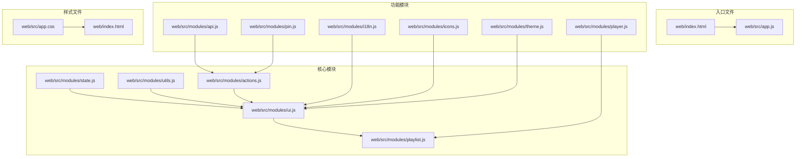

**图表来源**
- [web/index.html](file://web/index.html#L1-L195)
- [web/src/app.js](file://web/src/app.js#L1-L5)

**章节来源**
- [web/index.html](file://web/index.html#L1-L195)
- [web/src/app.js](file://web/src/app.js#L1-L5)

## 核心组件

### 渲染引擎核心

系统的核心渲染逻辑集中在`renderList`函数中，该函数负责整个媒体列表的生成和更新过程。

#### 列表项结构

每个媒体列表项由三个主要部分组成：

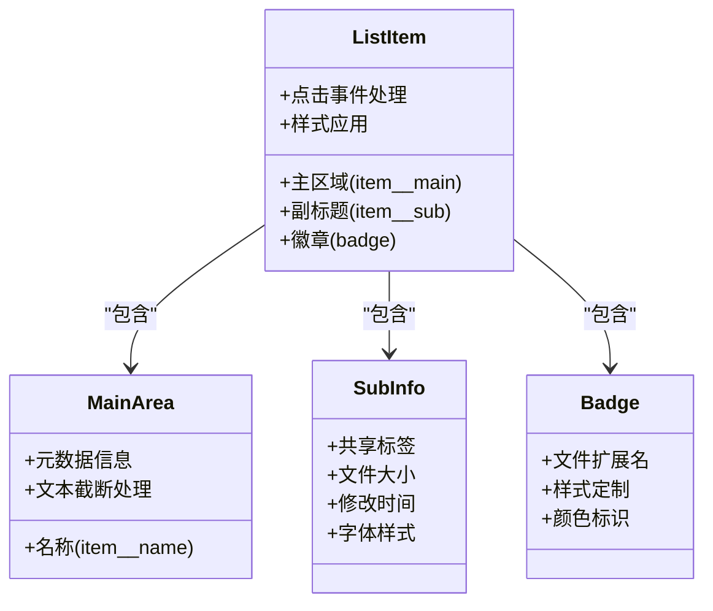

**图表来源**
- [web/src/modules/ui.js](file://web/src/modules/ui.js#L109-L135)

#### 分页算法实现

系统实现了高效的分页算法，支持动态页面大小调整：

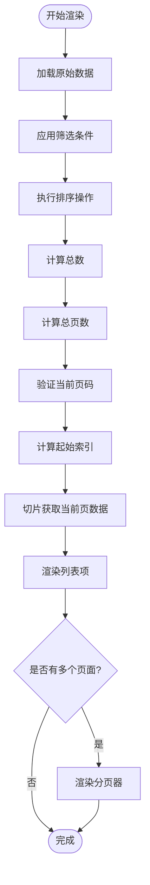

**图表来源**
- [web/src/modules/ui.js](file://web/src/modules/ui.js#L102-L170)

**章节来源**
- [web/src/modules/ui.js](file://web/src/modules/ui.js#L74-L170)

### 筛选系统

系统提供了多层次的筛选机制，支持多种搜索方式：

#### 关键词搜索算法

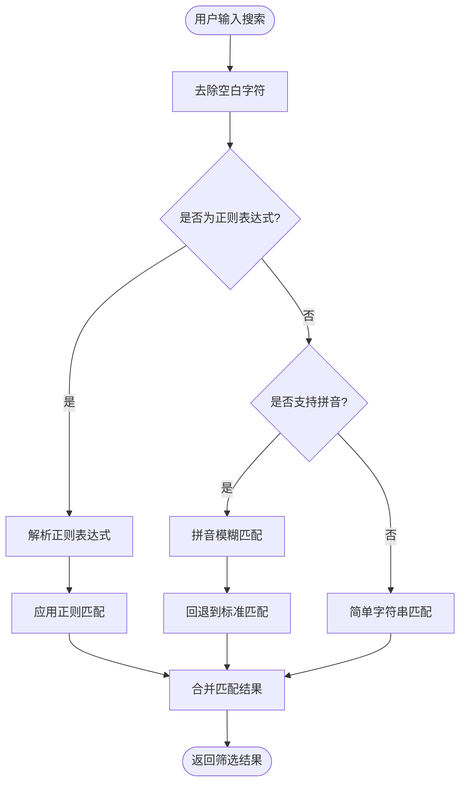

**图表来源**
- [web/src/modules/playlist.js](file://web/src/modules/playlist.js#L57-L89)

**章节来源**
- [web/src/modules/playlist.js](file://web/src/modules/playlist.js#L57-L89)

### 排序系统

系统支持多字段排序，具有智能的自然排序能力：

#### 排序算法流程

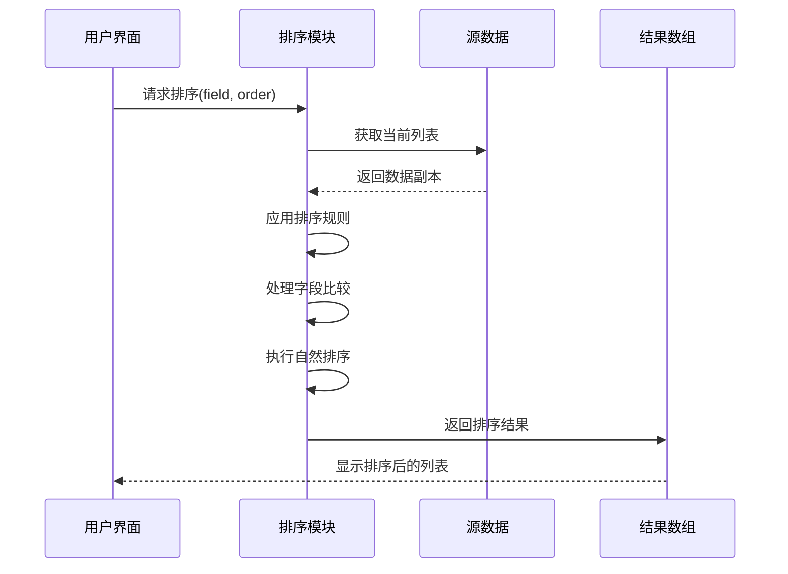

**图表来源**
- [web/src/modules/playlist.js](file://web/src/modules/playlist.js#L33-L55)

**章节来源**
- [web/src/modules/playlist.js](file://web/src/modules/playlist.js#L33-L55)

## 架构概览

MSP列表渲染系统采用分层架构设计，各层职责明确，耦合度低：

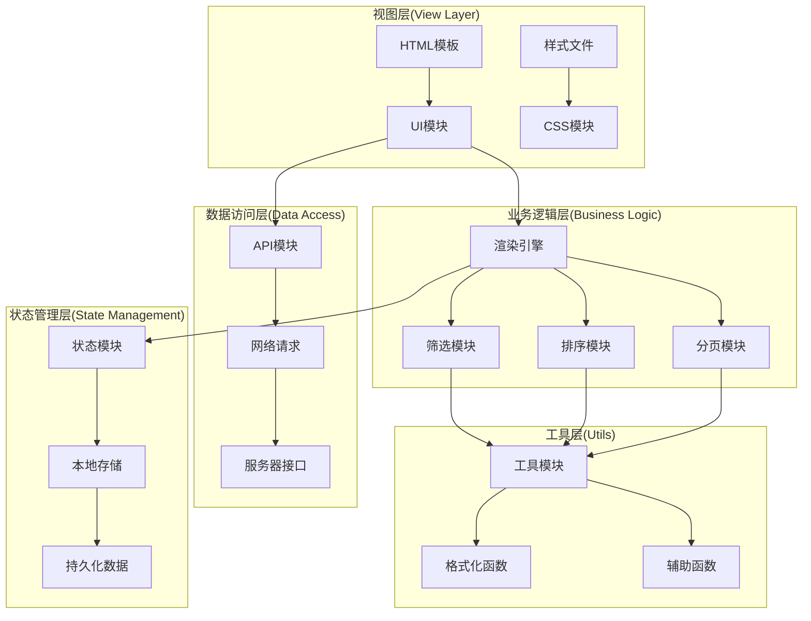

**图表来源**
- [web/src/modules/ui.js](file://web/src/modules/ui.js#L1-L417)
- [web/src/modules/state.js](file://web/src/modules/state.js#L1-L127)

## 详细组件分析

### 渲染引擎详解

#### renderList函数实现

`renderList`函数是整个系统的渲染核心，负责协调所有渲染相关的操作：

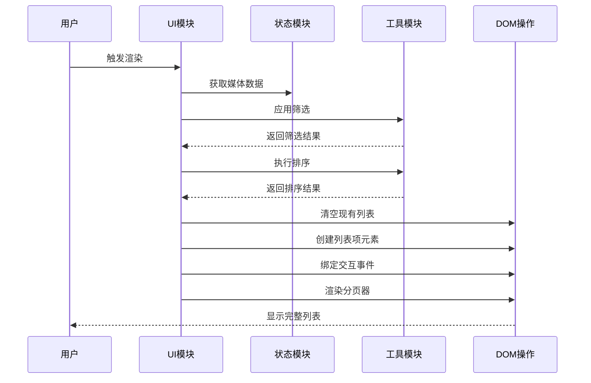

**图表来源**
- [web/src/modules/ui.js](file://web/src/modules/ui.js#L74-L170)

#### 列表项渲染流程

每个列表项的渲染过程包含多个步骤：

1. **基础结构创建**：创建包含主区域、副标题、徽章的容器元素
2. **主区域内容填充**：设置文件名称和元数据信息
3. **副标题格式化**：格式化共享标签、文件大小、修改时间
4. **徽章生成**：根据文件扩展名创建视觉标识
5. **事件绑定**：为列表项绑定点击播放事件
6. **样式应用**：应用CSS类名和样式属性

**章节来源**
- [web/src/modules/ui.js](file://web/src/modules/ui.js#L109-L135)

### 分页系统深度解析

#### 分页算法实现

系统采用动态分页算法，能够根据容器高度自动调整每页显示数量：

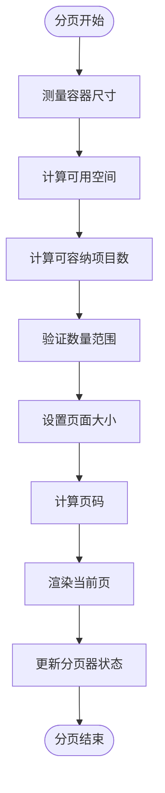

**图表来源**
- [web/src/modules/playlist.js](file://web/src/modules/playlist.js#L190-L236)

#### 分页器交互

分页器提供了完整的导航控制功能：

- **上一页按钮**：禁用状态随当前页变化
- **页码显示**：实时显示当前页/总页数
- **下一页按钮**：禁用状态随当前页变化
- **键盘快捷键**：支持键盘导航

**章节来源**
- [web/src/modules/ui.js](file://web/src/modules/ui.js#L137-L170)
- [web/src/modules/playlist.js](file://web/src/modules/playlist.js#L291-L325)

### 筛选与排序机制

#### 多层次筛选架构

系统实现了多层次的筛选机制，确保用户能够快速定位目标文件：

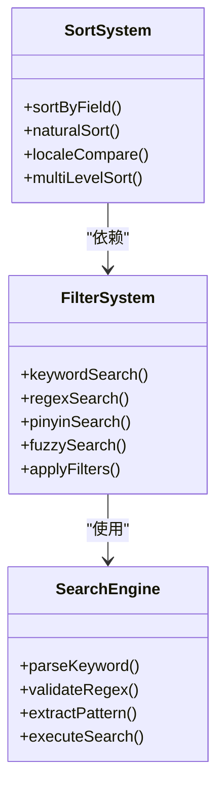

**图表来源**
- [web/src/modules/playlist.js](file://web/src/modules/playlist.js#L57-L89)

#### 排序字段映射

系统支持三种排序字段，每种字段都有特定的排序逻辑：

| 字段 | 排序类型 | 比较方法 | 默认顺序 |
|------|----------|----------|----------|
| name | 字符串 | localeCompare | 升序 |
| size | 数值 | 数值比较 | 升序 |
| date | 时间戳 | 数值比较 | 升序 |

**章节来源**
- [web/src/modules/playlist.js](file://web/src/modules/playlist.js#L33-L55)

## 依赖关系分析

### 模块间依赖图

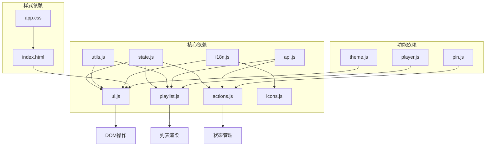

**图表来源**
- [web/src/modules/state.js](file://web/src/modules/state.js#L1-L127)
- [web/src/modules/ui.js](file://web/src/modules/ui.js#L1-L417)

### 数据流分析

系统采用单向数据流架构，确保数据的一致性和可预测性：

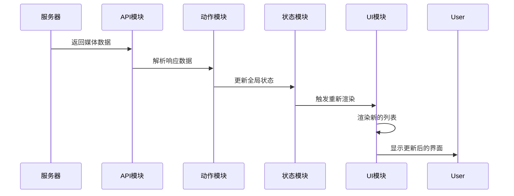

**图表来源**
- [web/src/modules/actions.js](file://web/src/modules/actions.js#L38-L91)

**章节来源**
- [web/src/modules/actions.js](file://web/src/modules/actions.js#L38-L91)

## 性能考虑

### 虚拟滚动优化

虽然当前实现未采用虚拟滚动，但系统设计已考虑到大规模数据集的性能需求：

#### 内存管理策略

- **数据复制**：排序操作使用数据副本避免修改原始数据
- **DOM复用**：列表项元素在重新渲染时被重新创建
- **事件清理**：组件销毁时清理事件监听器

#### 渲染优化技术

- **批量更新**：使用DocumentFragment减少DOM操作
- **延迟加载**：图片和媒体资源采用懒加载策略
- **缓存机制**：API响应和媒体探测结果进行缓存

### 分页性能优化

系统实现了智能的分页策略，有效提升大数据集的渲染性能：

#### 自适应页面大小

**图表来源**
- [web/src/modules/playlist.js](file://web/src/modules/playlist.js#L190-L236)

### 缓存策略

系统采用了多层次的缓存机制：

1. **HTTP缓存**：利用ETag实现条件请求
2. **本地存储**：用户偏好和配置信息持久化
3. **内存缓存**：媒体探测结果缓存
4. **DOM缓存**：已渲染的列表项临时缓存

**章节来源**
- [web/src/modules/actions.js](file://web/src/modules/actions.js#L42-L80)
- [web/src/modules/api.js](file://web/src/modules/api.js#L42-L64)

## 故障排除指南

### 常见问题诊断

#### 列表渲染异常

**症状**：列表不显示或显示空白

**可能原因**：
1. 媒体数据加载失败
2. 筛选条件过于严格
3. DOM元素未正确初始化

**解决方案**：
1. 检查网络连接和API响应
2. 清除筛选条件重试
3. 刷新页面重新初始化

#### 排序功能失效

**症状**：点击排序按钮无反应

**可能原因**：
1. 排序字段配置错误
2. 排序状态未正确更新
3. 事件绑定失败

**解决方案**：
1. 检查排序字段的有效性
2. 验证状态更新逻辑
3. 重新绑定事件监听器

#### 分页功能异常

**症状**：分页按钮不可用或跳转错误

**可能原因**：
1. 页面大小计算错误
2. 页码边界检查失败
3. 分页器状态同步问题

**解决方案**：
1. 重新计算页面大小
2. 验证页码边界逻辑
3. 同步分页器状态

### 调试技巧

#### 开发者工具使用

1. **网络面板**：监控API请求和响应
2. **控制台**：查看JavaScript错误和警告
3. **Elements面板**：检查DOM结构和样式
4. **Performance面板**：分析渲染性能瓶颈

#### 日志记录

系统提供了完善的日志记录机制：

- **错误日志**：捕获和报告运行时错误
- **性能日志**：记录关键操作的执行时间
- **调试日志**：提供详细的执行流程信息

**章节来源**
- [web/src/modules/api.js](file://web/src/modules/api.js#L38-L40)

## 结论

MSP项目的列表渲染系统展现了现代Web应用开发的最佳实践。通过模块化设计、清晰的职责分离和高效的算法实现，系统在功能完整性、性能表现和用户体验方面都达到了较高水准。

### 主要优势

1. **架构清晰**：模块化设计便于维护和扩展
2. **性能优秀**：智能分页和缓存机制提升响应速度
3. **用户体验佳**：直观的界面设计和流畅的交互体验
4. **功能完整**：支持多种媒体类型和复杂的筛选排序需求

### 技术亮点

- **多语言支持**：完整的国际化实现
- **响应式设计**：适配各种设备和屏幕尺寸
- **错误处理**：健壮的异常处理和用户反馈机制
- **性能优化**：多项性能优化技术和最佳实践

### 发展方向

未来可以考虑的改进方向：
1. 实现虚拟滚动以支持更大规模的数据集
2. 添加更多高级筛选和排序选项
3. 优化移动端触摸交互体验
4. 增强离线缓存和PWA功能

## 附录

### API参考

#### 渲染相关API

| 函数 | 参数 | 返回值 | 描述 |
|------|------|--------|------|
| renderList | 无 | void | 渲染媒体列表 |
| currentList | 无 | Array | 获取当前标签页的媒体列表 |
| filterFiles | list:Array | Array | 应用筛选条件 |
| sortFiles | list:Array | Array | 执行排序操作 |

#### 状态管理API

| 函数 | 参数 | 返回值 | 描述 |
|------|------|--------|------|
| state | 无 | Object | 全局状态对象 |
| lsGet | key:String | String | 从localStorage获取值 |
| lsSet | key:String, value:String | void | 设置localStorage值 |

### 配置选项

#### 用户偏好设置

| 键名 | 类型 | 默认值 | 描述 |
|------|------|--------|------|
| msp.sort.field | String | "name" | 默认排序字段 |
| msp.sort.order | Number | 1 | 默认排序顺序 |
| msp.theme | String | "auto" | 主题设置 |
| msp.lang | String | "en" | 语言设置 |

#### 系统配置

| 配置项 | 类型 | 默认值 | 描述 |
|--------|------|--------|------|
| playback.audio.enabled | Boolean | true | 是否启用音频播放 |
| playback.video.transcode | Boolean | false | 是否启用视频转码 |
| features.playlist | Boolean | true | 是否启用播放列表 |
| ui.defaultTab | String | "video" | 默认显示标签页 |