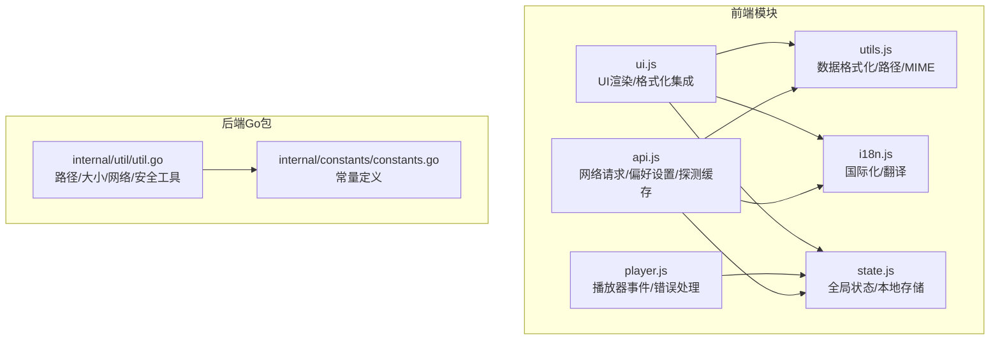
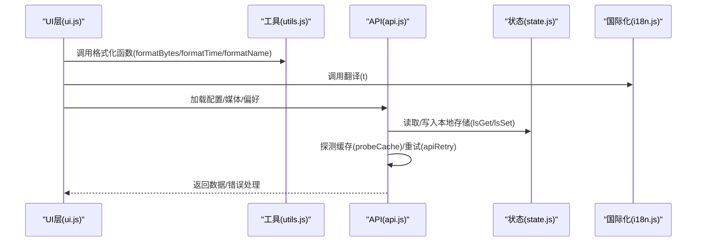
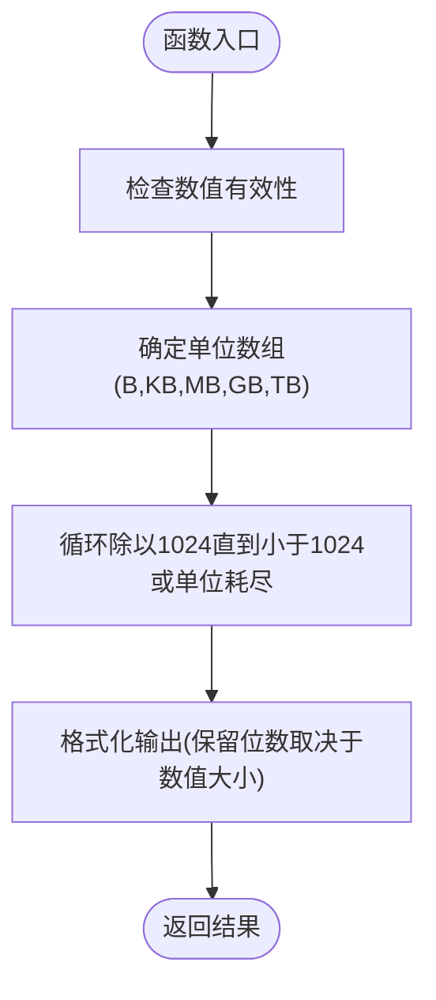
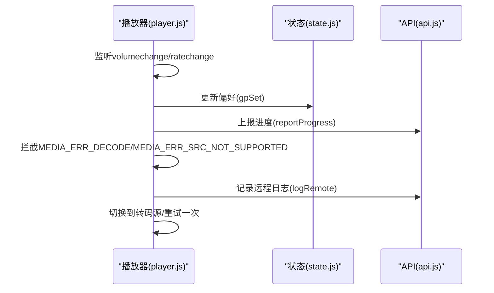
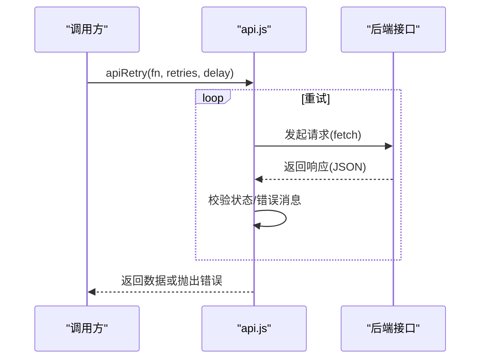
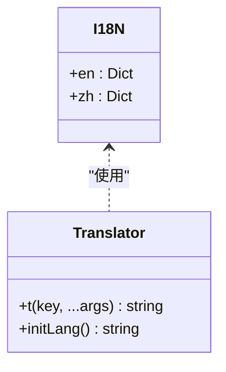
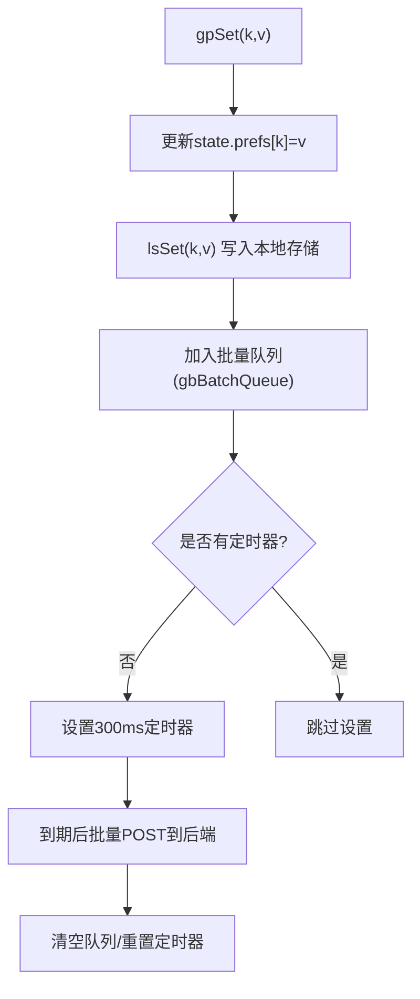
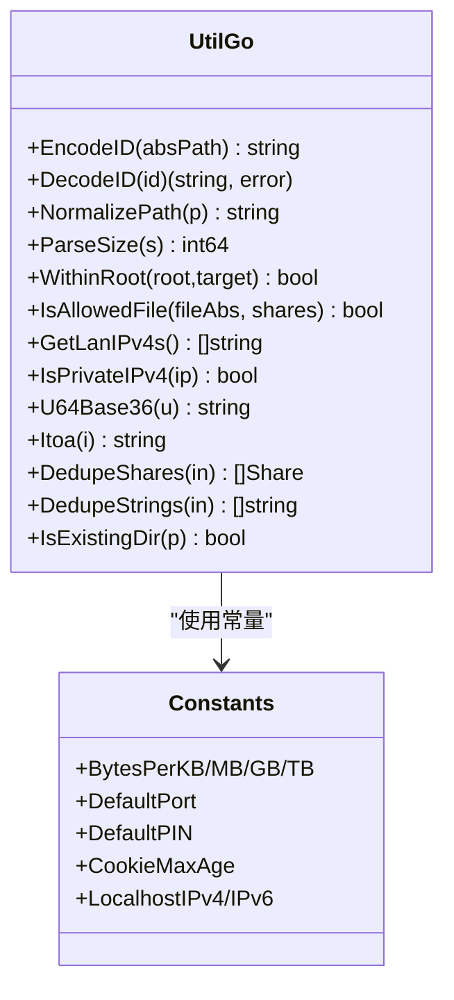
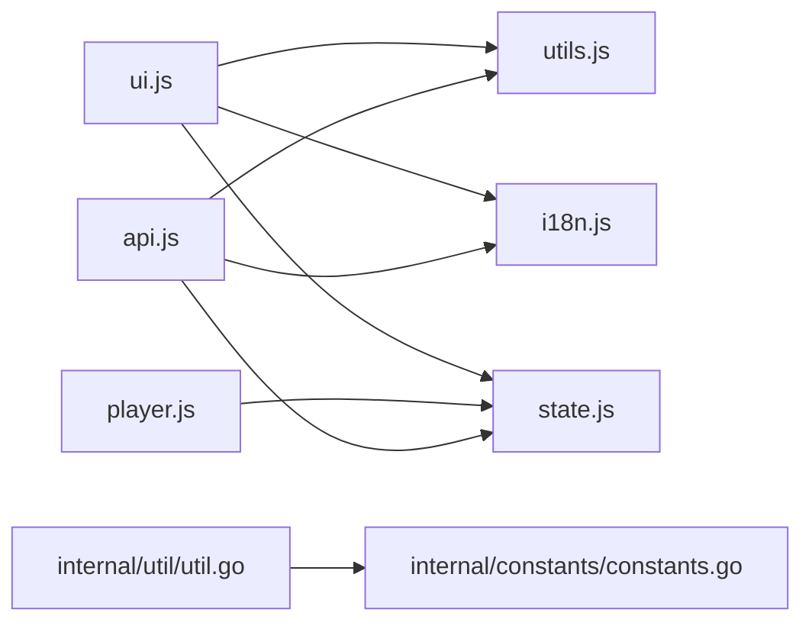

# 工具函数模块

<cite>
**本文档引用的文件**
- [web/src/modules/utils.js](file://web/src/modules/utils.js)
- [web/src/modules/api.js](file://web/src/modules/api.js)
- [web/src/modules/i18n.js](file://web/src/modules/i18n.js)
- [web/src/modules/state.js](file://web/src/modules/state.js)
- [web/src/modules/ui.js](file://web/src/modules/ui.js)
- [web/src/modules/player.js](file://web/src/modules/player.js)
- [internal/util/util.go](file://internal/util/util.go)
- [internal/constants/constants.go](file://internal/constants/constants.go)
- [internal/util/util_test.go](file://internal/util/util_test.go)
</cite>

## 目录
1. [简介](#简介)
2. [项目结构](#项目结构)
3. [核心组件](#核心组件)
4. [架构总览](#架构总览)
5. [详细组件分析](#详细组件分析)
6. [依赖关系分析](#依赖关系分析)
7. [性能考量](#性能考量)
8. [故障排查指南](#故障排查指南)
9. [结论](#结论)
10. [附录](#附录)

## 简介
本文件聚焦于MSP项目的工具函数模块，系统性梳理前端与后端的实用工具函数，涵盖：
- 数据格式化函数（文件大小、时间、文件名）
- DOM操作与事件处理辅助
- API通信封装与错误处理
- 国际化工具函数与多语言支持
- 本地存储与偏好设置
- 后端通用工具（路径处理、大小解析、网络地址等）
- 扩展方法与最佳实践

## 项目结构
工具函数模块主要分布在前端模块与后端Go包中：
- 前端模块：utils.js（数据格式化、路径与MIME处理）、api.js（网络请求封装、偏好设置）、i18n.js（国际化）、state.js（全局状态与本地存储）、ui.js（UI渲染与格式化集成）、player.js（播放器错误处理与事件）
- 后端Go包：internal/util/util.go（路径、大小、网络、安全等工具）

图表来源
- [web/src/modules/utils.js](file://web/src/modules/utils.js#L1-L124)
- [web/src/modules/api.js](file://web/src/modules/api.js#L1-L155)
- [web/src/modules/i18n.js](file://web/src/modules/i18n.js#L1-L201)
- [web/src/modules/state.js](file://web/src/modules/state.js#L1-L127)
- [web/src/modules/ui.js](file://web/src/modules/ui.js#L1-L200)
- [web/src/modules/player.js](file://web/src/modules/player.js#L360-L429)
- [internal/util/util.go](file://internal/util/util.go#L1-L288)
- [internal/constants/constants.go](file://internal/constants/constants.go#L1-L115)

章节来源
- [web/src/modules/utils.js](file://web/src/modules/utils.js#L1-L124)
- [web/src/modules/api.js](file://web/src/modules/api.js#L1-L155)
- [web/src/modules/i18n.js](file://web/src/modules/i18n.js#L1-L201)
- [web/src/modules/state.js](file://web/src/modules/state.js#L1-L127)
- [web/src/modules/ui.js](file://web/src/modules/ui.js#L1-L200)
- [web/src/modules/player.js](file://web/src/modules/player.js#L360-L429)
- [internal/util/util.go](file://internal/util/util.go#L1-L288)
- [internal/constants/constants.go](file://internal/constants/constants.go#L1-L115)

## 核心组件
- 数据格式化工具：文件大小、时间、文件名、MIME类型推断、媒体播放能力判断
- API通信工具：GET/POST封装、重试机制、探测缓存、进度上报与查询、偏好设置加载与批量保存
- 国际化工具：多语言词典、动态翻译、语言初始化
- 本地存储工具：全局状态、本地存储读写、偏好设置持久化
- 后端通用工具：路径规范化、大小解析、网络地址检测、安全校验

章节来源
- [web/src/modules/utils.js](file://web/src/modules/utils.js#L4-L124)
- [web/src/modules/api.js](file://web/src/modules/api.js#L5-L155)
- [web/src/modules/i18n.js](file://web/src/modules/i18n.js#L3-L201)
- [web/src/modules/state.js](file://web/src/modules/state.js#L42-L127)
- [internal/util/util.go](file://internal/util/util.go#L18-L288)

## 架构总览
前端工具函数通过模块化方式协作，统一由UI层调用；后端工具函数服务于安全与数据处理。

图表来源
- [web/src/modules/ui.js](file://web/src/modules/ui.js#L5-L72)
- [web/src/modules/utils.js](file://web/src/modules/utils.js#L4-L70)
- [web/src/modules/api.js](file://web/src/modules/api.js#L5-L40)
- [web/src/modules/state.js](file://web/src/modules/state.js#L114-L126)
- [web/src/modules/i18n.js](file://web/src/modules/i18n.js#L185-L192)

## 详细组件分析

### 数据格式化函数
- formatBytes：将字节转换为人类可读的单位（B/KB/MB/GB/TB），根据数值大小保留一位或整数位
- formatTime：将Unix秒时间戳转换为本地化日期时间字符串（中文使用zh-CN，英文使用en-US）
- formatName：去除媒体项名称末尾的扩展名，保持显示整洁
- MIME推断与播放能力判断：根据扩展名映射到标准MIME类型，并结合canPlayType与配置判断是否可直接播放或需要转码

图表来源
- [web/src/modules/utils.js](file://web/src/modules/utils.js#L4-L14)

章节来源
- [web/src/modules/utils.js](file://web/src/modules/utils.js#L4-L124)

### DOM操作与事件处理辅助
- 全局元素获取：el(id)用于快速获取DOM节点
- UI更新：setMeta、showDlg、updateUIForLang等
- 事件绑定：播放器音量、速率变化监听，快捷键处理（空格、方向键、M键等）
- 错误拦截与降级：对解码错误进行智能处理，必要时触发转码回退

图表来源
- [web/src/modules/player.js](file://web/src/modules/player.js#L648-L665)
- [web/src/modules/player.js](file://web/src/modules/player.js#L360-L429)
- [web/src/modules/api.js](file://web/src/modules/api.js#L38-L40)
- [web/src/modules/api.js](file://web/src/modules/api.js#L95-L98)

章节来源
- [web/src/modules/state.js](file://web/src/modules/state.js#L40-L40)
- [web/src/modules/ui.js](file://web/src/modules/ui.js#L10-L72)
- [web/src/modules/player.js](file://web/src/modules/player.js#L648-L665)
- [web/src/modules/player.js](file://web/src/modules/player.js#L360-L429)

### API通信工具
- 重试机制：apiRetry(fn, retries, delay)在失败时按指数退避重试
- GET/POST封装：apiGet/apiPost统一处理响应与错误，支持204无内容
- 探测缓存：probeCache基于Map实现，限制容量并淘汰最早项
- 进度上报与查询：reportProgress/getProgress
- 偏好设置：loadPrefs、gpGet/gpSet（内存+本地+批量后端同步）

图表来源
- [web/src/modules/api.js](file://web/src/modules/api.js#L5-L14)
- [web/src/modules/api.js](file://web/src/modules/api.js#L16-L36)

章节来源
- [web/src/modules/api.js](file://web/src/modules/api.js#L5-L155)

### 国际化工具函数
- I18N词典：包含英文与中文键值，覆盖界面文案、错误信息、提示语等
- 动态翻译：t(key, ...args)按当前语言返回对应文本，并进行占位符替换
- 语言初始化：initLang从本地存储读取语言设置，设置HTML lang属性

图表来源
- [web/src/modules/i18n.js](file://web/src/modules/i18n.js#L3-L183)
- [web/src/modules/i18n.js](file://web/src/modules/i18n.js#L185-L201)

章节来源
- [web/src/modules/i18n.js](file://web/src/modules/i18n.js#L3-L201)

### 本地存储工具
- 全局状态state：集中管理语言、配置、媒体、播放列表、排序等
- 本地存储LS键：音量、主题、语言、排序、播放历史等
- 读写封装：lsGet/lsSet/canStorage，统一异常处理
- 偏好设置：gpGet/gpSet优先读取内存偏好，其次读取本地存储，最后写入后端批量同步

图表来源
- [web/src/modules/api.js](file://web/src/modules/api.js#L129-L144)
- [web/src/modules/state.js](file://web/src/modules/state.js#L42-L58)
- [web/src/modules/state.js](file://web/src/modules/state.js#L114-L126)

章节来源
- [web/src/modules/state.js](file://web/src/modules/state.js#L42-L127)
- [web/src/modules/api.js](file://web/src/modules/api.js#L111-L155)

### 后端通用工具
- 路径处理：EncodeID/DecodeID、NormalizePath、WithinRoot、IsAllowedFile、SamePath
- 大小解析：ParseSize支持B/KB/MB/GB/TB
- 网络与安全：GetLanIPv4s、IsPrivateIPv4、MustExeDir
- 其他：U64Base36、Itoa、DedupeShares/DedupeStrings、IsExistingDir

图表来源
- [internal/util/util.go](file://internal/util/util.go#L18-L288)
- [internal/constants/constants.go](file://internal/constants/constants.go#L82-L115)

章节来源
- [internal/util/util.go](file://internal/util/util.go#L18-L288)
- [internal/constants/constants.go](file://internal/constants/constants.go#L1-L115)
- [internal/util/util_test.go](file://internal/util/util_test.go#L1-L258)

## 依赖关系分析
- 前端模块间耦合：ui.js依赖utils.js、i18n.js、state.js；player.js依赖state.js；api.js依赖state.js与i18n.js
- 后端工具与常量：util.go依赖constants.go中的常量定义
- 低耦合高内聚：各模块职责清晰，通过state统一协调

图表来源
- [web/src/modules/ui.js](file://web/src/modules/ui.js#L1-L8)
- [web/src/modules/player.js](file://web/src/modules/player.js#L648-L665)
- [web/src/modules/api.js](file://web/src/modules/api.js#L1-L3)
- [internal/util/util.go](file://internal/util/util.go#L1-L16)
- [internal/constants/constants.go](file://internal/constants/constants.go#L1-L6)

章节来源
- [web/src/modules/ui.js](file://web/src/modules/ui.js#L1-L8)
- [web/src/modules/player.js](file://web/src/modules/player.js#L648-L665)
- [web/src/modules/api.js](file://web/src/modules/api.js#L1-L3)
- [internal/util/util.go](file://internal/util/util.go#L1-L16)
- [internal/constants/constants.go](file://internal/constants/constants.go#L1-L6)

## 性能考量
- 探测缓存：前端使用Map缓存探测结果，限制容量并淘汰最早项，降低重复请求
- 批量偏好保存：300ms窗口聚合写入，减少后端压力
- 本地存储：统一异常捕获，避免阻塞主流程
- 后端工具：路径规范化、大小解析、网络地址检测均采用高效算法与常量，减少重复计算

## 故障排查指南
- 网络请求失败：检查apiGet/apiPost的错误分支，确认响应状态与错误消息字段
- 探测缓存失效：probePeek返回null时，重新调用probeItem并观察缓存大小
- 偏好设置未持久化：确认gpBatchTimer是否触发，检查后端批量写入是否成功
- 播放器错误：关注MEDIA_ERR_DECODE/MEDIA_ERR_SRC_NOT_SUPPORTED，必要时启用转码回退
- 本地存储不可用：canStorage探测失败时，需提示用户开启或更换浏览器

章节来源
- [web/src/modules/api.js](file://web/src/modules/api.js#L42-L64)
- [web/src/modules/api.js](file://web/src/modules/api.js#L129-L144)
- [web/src/modules/player.js](file://web/src/modules/player.js#L360-L429)
- [web/src/modules/state.js](file://web/src/modules/state.js#L103-L112)

## 结论
工具函数模块通过清晰的职责划分与模块化设计，实现了数据格式化、API通信、国际化、本地存储与后端通用工具的统一支撑。前端与后端工具相辅相成，既保证了用户体验（如智能转码回退、批量偏好保存），也确保了系统的安全性与稳定性（如路径安全校验、私有网络地址检测）。

## 附录

### 实际使用示例（路径引用）
- 格式化文件大小：在UI渲染列表时调用formatBytes
  - [web/src/modules/ui.js](file://web/src/modules/ui.js#L119-L123)
- 时间格式化：在预览元信息中调用formatTime
  - [web/src/modules/ui.js](file://web/src/modules/ui.js#L69-L71)
- 文件名处理：在列表名称显示前调用formatName
  - [web/src/modules/ui.js](file://web/src/modules/ui.js#L119)
- MIME与播放能力：canPlayMedia结合配置判断是否需要转码
  - [web/src/modules/utils.js](file://web/src/modules/utils.js#L95-L123)
- 网络请求与重试：加载配置/媒体时使用apiRetry
  - [web/src/modules/api.js](file://web/src/modules/api.js#L5-L14)
- 偏好设置：gpSet批量写入，300ms窗口聚合
  - [web/src/modules/api.js](file://web/src/modules/api.js#L129-L144)
- 国际化：t函数用于界面文案与错误提示
  - [web/src/modules/i18n.js](file://web/src/modules/i18n.js#L185-L192)
- 本地存储：lsGet/lsSet统一读写
  - [web/src/modules/state.js](file://web/src/modules/state.js#L114-L126)

### 扩展方法与最佳实践
- 新增数据格式化函数
  - 遵循现有命名规范（如formatXxx），统一参数与返回值类型
  - 在utils.js中新增导出函数，并在ui.js中按需调用
- 优化API通信
  - 对高频请求增加探活/缓存策略，避免重复请求
  - 批量写入时控制窗口大小与频率，平衡实时性与性能
- 国际化扩展
  - 在i18n.js中新增词条，确保中英文双语覆盖
  - 使用占位符替换时注意参数顺序与类型
- 本地存储优化
  - 对大对象采用JSON序列化，注意存储上限与异常处理
  - 重要配置采用内存+本地+后端三层备份策略
- 后端工具增强
  - 路径处理：增加跨平台兼容性测试
  - 网络检测：扩展IPv6支持与多网卡场景
  - 安全校验：完善符号链接解析与目录遍历防护