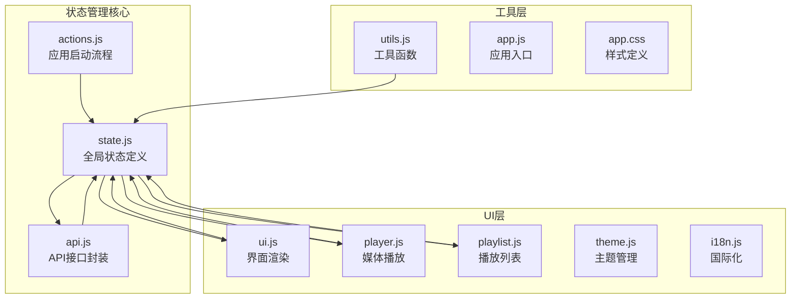
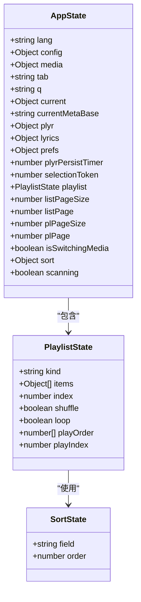
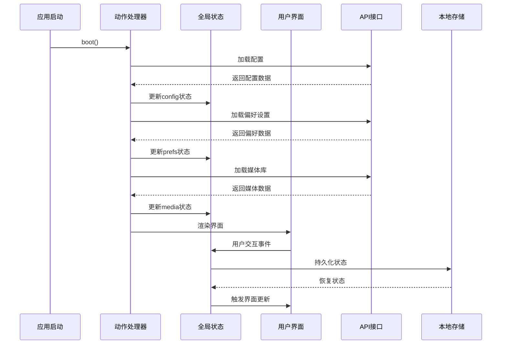
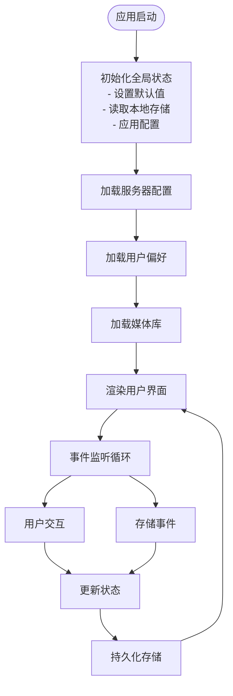
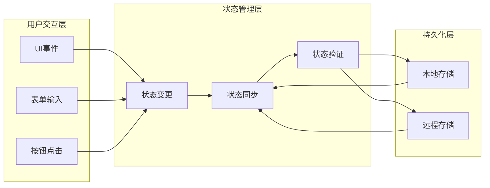
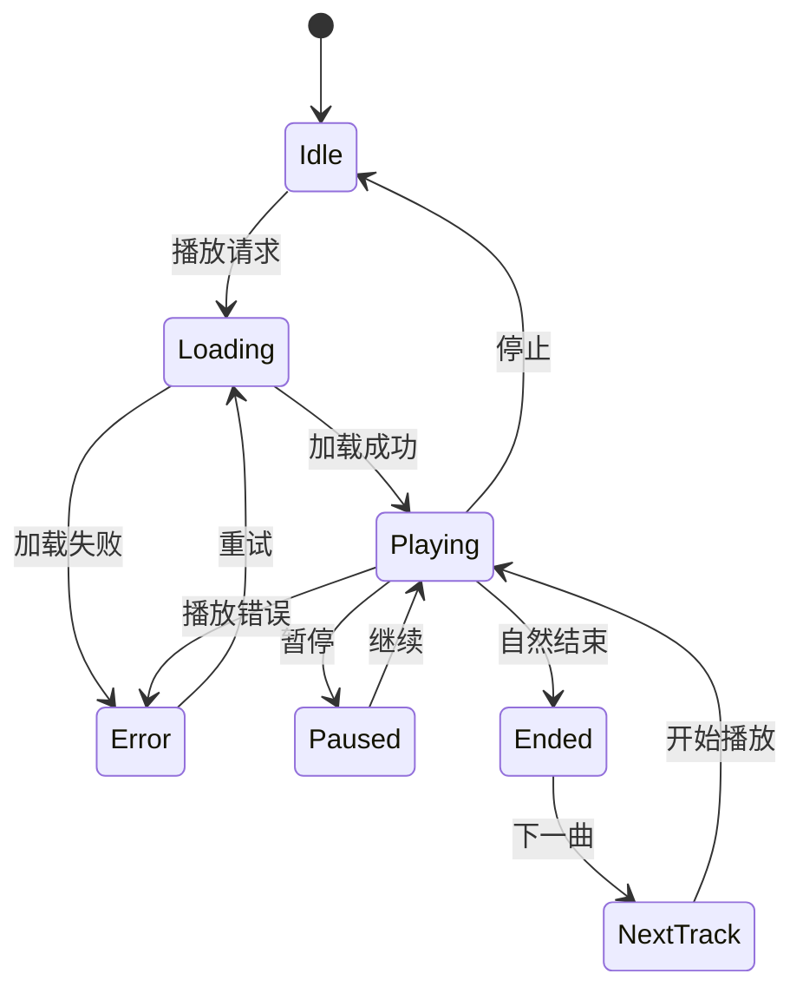
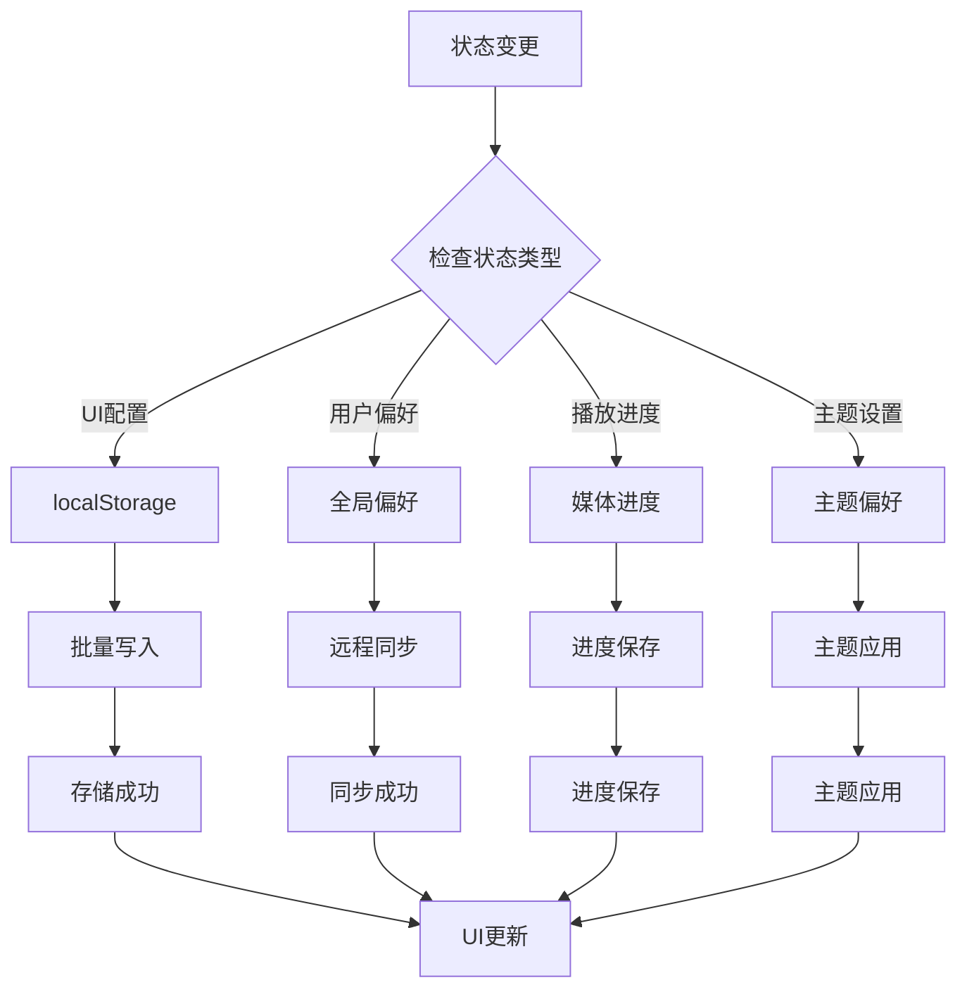
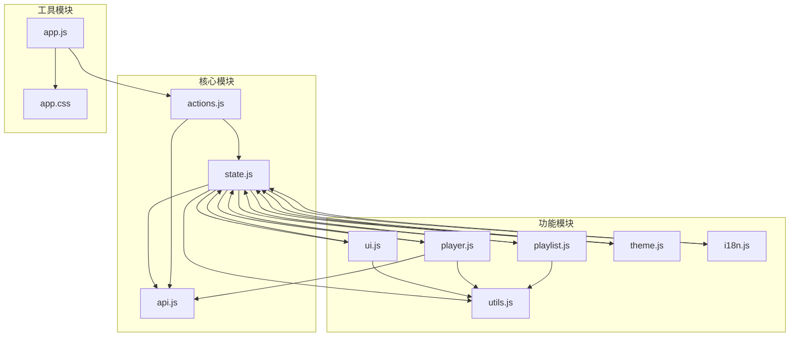

# 状态管理系统

<cite>
**本文档引用的文件**
- [state.js](file://web/src/modules/state.js)
- [actions.js](file://web/src/modules/actions.js)
- [ui.js](file://web/src/modules/ui.js)
- [api.js](file://web/src/modules/api.js)
- [player.js](file://web/src/modules/player.js)
- [playlist.js](file://web/src/modules/playlist.js)
- [utils.js](file://web/src/modules/utils.js)
- [theme.js](file://web/src/modules/theme.js)
- [i18n.js](file://web/src/modules/i18n.js)
- [app.js](file://web/src/app.js)
- [app.css](file://web/src/app.css)
</cite>

## 目录
1. [简介](#简介)
2. [项目结构](#项目结构)
3. [核心组件](#核心组件)
4. [架构概览](#架构概览)
5. [详细组件分析](#详细组件分析)
6. [依赖关系分析](#依赖关系分析)
7. [性能考虑](#性能考虑)
8. [故障排除指南](#故障排除指南)
9. [结论](#结论)

## 简介

MSP项目状态管理系统是一个基于JavaScript的前端状态管理解决方案，采用全局单例模式设计。该系统通过统一的状态对象管理应用的所有状态，实现了UI状态与应用状态的双向绑定，提供了完整的本地存储管理机制，以及事件驱动的状态更新流程。

系统的核心设计理念是：
- **单一真相源**：所有状态都集中在一个全局state对象中
- **响应式更新**：通过事件监听和状态变更触发UI更新
- **持久化存储**：自动处理本地存储的读写操作
- **类型安全**：使用JSDoc注释定义状态结构
- **模块化设计**：清晰的功能模块划分和职责分离

## 项目结构

MSP项目采用模块化的前端架构，状态管理系统主要分布在以下文件中：

**图表来源**
- [state.js](file://web/src/modules/state.js#L1-L127)
- [actions.js](file://web/src/modules/actions.js#L1-L164)
- [ui.js](file://web/src/modules/ui.js#L1-L417)

**章节来源**
- [state.js](file://web/src/modules/state.js#L1-L127)
- [app.js](file://web/src/app.js#L1-L5)

## 核心组件

### 全局状态对象

状态管理系统的核心是全局的`state`对象，它包含了应用运行所需的所有状态信息：

**图表来源**
- [state.js](file://web/src/modules/state.js#L6-L38)

### 本地存储管理

系统提供了完整的本地存储管理机制，包括：

- **LS常量**：定义了所有本地存储键名
- **lsGet/lsSet**：本地存储读写函数
- **canStorage**：存储能力检测
- **gpGet/gpSet**：全局参数管理（优先级：内存 > 本地存储 > 远程配置）

**章节来源**
- [state.js](file://web/src/modules/state.js#L42-L127)
- [api.js](file://web/src/modules/api.js#L120-L144)

## 架构概览

MSP状态管理系统的整体架构采用了典型的MVVM模式，实现了数据驱动的界面更新：

**图表来源**
- [actions.js](file://web/src/modules/actions.js#L93-L163)
- [state.js](file://web/src/modules/state.js#L61-L93)

## 详细组件分析

### 状态初始化与生命周期

状态系统在应用启动时完成初始化，并建立了完整的生命周期管理：

**图表来源**
- [actions.js](file://web/src/modules/actions.js#L93-L163)
- [state.js](file://web/src/modules/state.js#L95-L101)

**章节来源**
- [actions.js](file://web/src/modules/actions.js#L93-L163)
- [state.js](file://web/src/modules/state.js#L61-L101)

### UI状态与应用状态的双向绑定

系统实现了完整的UI状态与应用状态的双向绑定机制：

**图表来源**
- [ui.js](file://web/src/modules/ui.js#L275-L416)
- [api.js](file://web/src/modules/api.js#L129-L144)

**章节来源**
- [ui.js](file://web/src/modules/ui.js#L275-L416)
- [api.js](file://web/src/modules/api.js#L129-L144)

### 媒体播放状态管理

播放状态管理是系统的核心功能之一，实现了复杂的播放列表管理和状态同步：

**图表来源**
- [player.js](file://web/src/modules/player.js#L341-L354)
- [playlist.js](file://web/src/modules/playlist.js#L344-L381)

**章节来源**
- [player.js](file://web/src/modules/player.js#L15-L155)
- [playlist.js](file://web/src/modules/playlist.js#L344-L381)

### 本地存储持久化机制

系统提供了多层次的持久化存储机制：

**图表来源**
- [state.js](file://web/src/modules/state.js#L114-L127)
- [api.js](file://web/src/modules/api.js#L129-L144)

**章节来源**
- [state.js](file://web/src/modules/state.js#L114-L127)
- [api.js](file://web/src/modules/api.js#L129-L144)

## 依赖关系分析

MSP状态管理系统的模块间依赖关系清晰明确：

**图表来源**
- [state.js](file://web/src/modules/state.js#L1-L127)
- [actions.js](file://web/src/modules/actions.js#L1-L164)

**章节来源**
- [state.js](file://web/src/modules/state.js#L1-L127)
- [actions.js](file://web/src/modules/actions.js#L1-L164)

## 性能考虑

### 状态更新优化

系统采用了多种性能优化策略：

1. **批量状态更新**：通过队列机制减少重复渲染
2. **懒加载机制**：按需加载媒体资源
3. **缓存策略**：智能缓存API响应数据
4. **虚拟滚动**：大列表的性能优化

### 内存管理

- **状态清理**：及时清理不再使用的状态引用
- **事件监听器管理**：避免内存泄漏
- **定时器管理**：合理使用和清理定时器

### 网络优化

- **条件请求**：使用ETag实现条件请求
- **重试机制**：智能的API重试策略
- **并发控制**：限制同时进行的网络请求数量

## 故障排除指南

### 常见问题及解决方案

#### 状态不同步问题

**症状**：UI显示与实际状态不一致

**解决方案**：
1. 检查状态更新是否通过正确的API进行
2. 确认事件监听器是否正确绑定
3. 验证状态持久化是否正常工作

#### 本地存储异常

**症状**：偏好设置无法保存或丢失

**解决方案**：
1. 检查浏览器是否禁用了localStorage
2. 验证存储空间是否充足
3. 确认存储权限是否正确

#### 媒体播放问题

**症状**：媒体无法正常播放或播放中断

**解决方案**：
1. 检查媒体格式是否受支持
2. 验证网络连接状态
3. 确认播放权限是否正确

**章节来源**
- [player.js](file://web/src/modules/player.js#L363-L442)
- [state.js](file://web/src/modules/state.js#L103-L112)

## 结论

MSP项目的状态管理系统展现了现代前端应用的最佳实践：

**设计优势**：
- **简洁性**：通过全局单例模式简化了状态管理
- **可维护性**：清晰的模块划分和职责分离
- **可扩展性**：良好的架构设计支持功能扩展
- **用户体验**：流畅的响应式更新和状态同步

**技术亮点**：
- 实现了完整的MVVM架构
- 提供了完善的本地存储管理
- 采用了事件驱动的状态更新机制
- 实现了多层级的状态持久化

**改进建议**：
- 可以考虑引入更强大的状态管理库（如Redux）
- 增加状态变更的日志记录功能
- 实现更细粒度的状态订阅机制
- 添加状态快照和撤销功能

这个状态管理系统为MSP项目提供了稳定可靠的基础，支持了丰富的媒体播放功能和良好的用户体验。