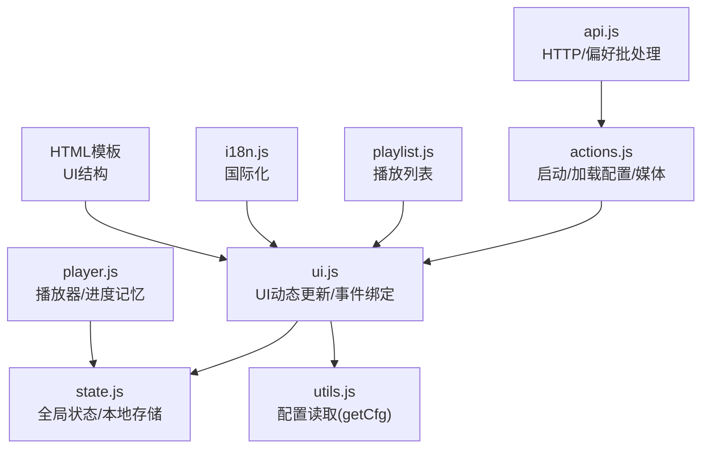
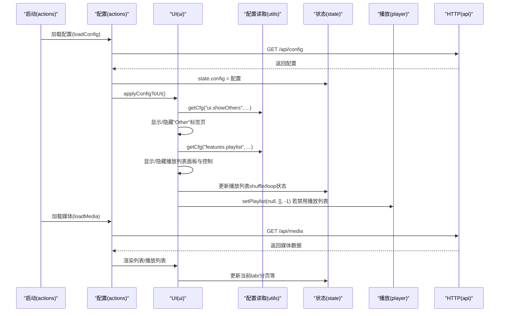
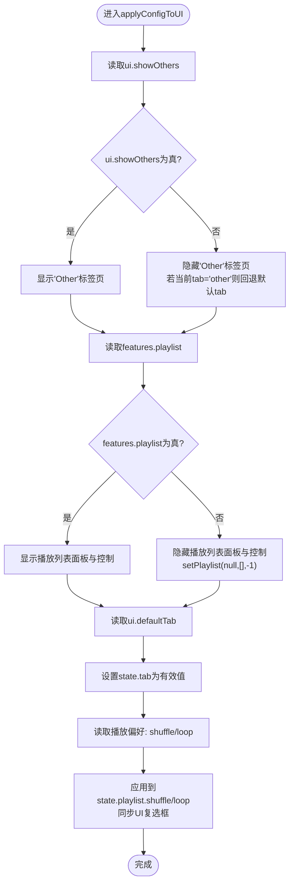
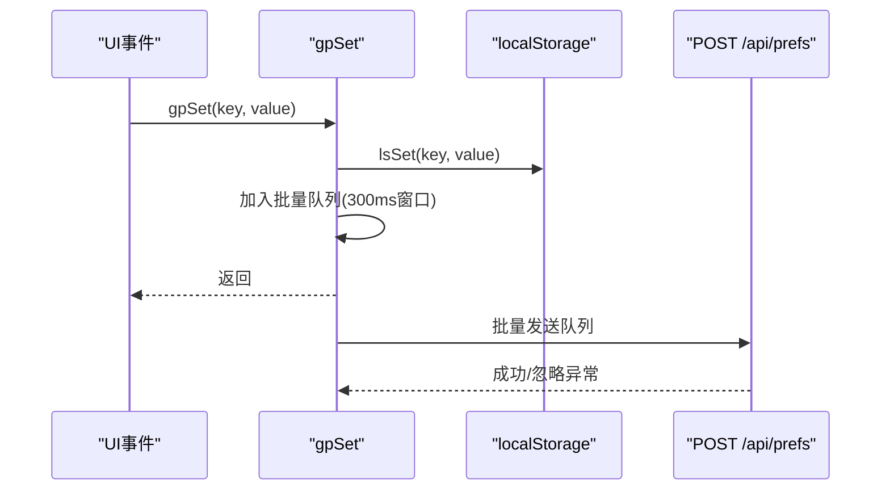
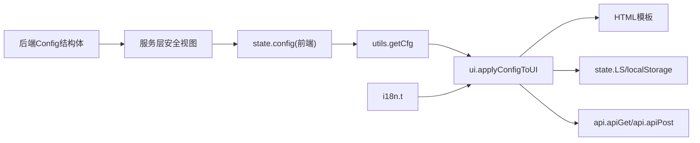

# 配置界面组件

<cite>
**本文档引用的文件**
- [web/src/modules/ui.js](file://web/src/modules/ui.js)
- [web/src/modules/state.js](file://web/src/modules/state.js)
- [web/src/modules/utils.js](file://web/src/modules/utils.js)
- [web/src/modules/actions.js](file://web/src/modules/actions.js)
- [web/src/modules/player.js](file://web/src/modules/player.js)
- [web/src/modules/playlist.js](file://web/src/modules/playlist.js)
- [web/src/modules/api.js](file://web/src/modules/api.js)
- [web/src/modules/i18n.js](file://web/src/modules/i18n.js)
- [web/index.html](file://web/index.html)
- [web/dist/index.html](file://web/dist/index.html)
- [internal/config/config.go](file://internal/config/config.go)
- [internal/service/config.go](file://internal/service/config.go)
</cite>

## 目录
1. [简介](#简介)
2. [项目结构](#项目结构)
3. [核心组件](#核心组件)
4. [架构总览](#架构总览)
5. [详细组件分析](#详细组件分析)
6. [依赖关系分析](#依赖关系分析)
7. [性能考虑](#性能考虑)
8. [故障排除指南](#故障排除指南)
9. [结论](#结论)
10. [附录](#附录)

## 简介
本文件聚焦于MSP项目的配置界面组件，系统性阐述以下内容：
- 动态更新机制：applyConfigToUI函数如何依据配置调整UI显示
- 功能开关控制：其他文件类型标签页显示、播放列表面板显示、音频播放控制等
- 用户偏好持久化：localStorage与后端偏好接口的协同工作方式
- 条件渲染：基于配置状态的组件显隐逻辑
- 配置项扩展方法：新增功能开关与界面布局调整的步骤
- 实际使用示例与最佳实践

## 项目结构
前端采用模块化组织，关键模块如下：
- ui.js：UI动态更新、绑定事件、条件渲染
- state.js：全局状态与localStorage封装
- utils.js：配置读取工具getCfg、格式化等
- actions.js：应用启动流程、配置与媒体数据加载
- player.js：播放器控制、进度记忆与偏好保存
- playlist.js：播放列表构建与渲染
- api.js：HTTP请求封装、偏好批处理保存
- i18n.js：国际化文本映射
- HTML模板：定义UI结构与初始状态

图表来源
- [web/src/modules/ui.js](file://web/src/modules/ui.js#L1-L417)
- [web/src/modules/state.js](file://web/src/modules/state.js#L1-L127)
- [web/src/modules/utils.js](file://web/src/modules/utils.js#L1-L124)
- [web/src/modules/actions.js](file://web/src/modules/actions.js#L1-L164)
- [web/src/modules/player.js](file://web/src/modules/player.js#L1-L800)
- [web/src/modules/playlist.js](file://web/src/modules/playlist.js#L1-L457)
- [web/src/modules/api.js](file://web/src/modules/api.js#L1-L155)
- [web/src/modules/i18n.js](file://web/src/modules/i18n.js#L1-L201)
- [web/index.html](file://web/index.html#L1-L195)

章节来源
- [web/src/modules/ui.js](file://web/src/modules/ui.js#L1-L417)
- [web/src/modules/state.js](file://web/src/modules/state.js#L1-L127)
- [web/src/modules/utils.js](file://web/src/modules/utils.js#L1-L124)
- [web/src/modules/actions.js](file://web/src/modules/actions.js#L1-L164)
- [web/src/modules/player.js](file://web/src/modules/player.js#L1-L800)
- [web/src/modules/playlist.js](file://web/src/modules/playlist.js#L1-L457)
- [web/src/modules/api.js](file://web/src/modules/api.js#L1-L155)
- [web/src/modules/i18n.js](file://web/src/modules/i18n.js#L1-L201)
- [web/index.html](file://web/index.html#L1-L195)

## 核心组件
- applyConfigToUI：根据配置动态调整UI可见性与状态
- getCfg：按点分路径读取state.config中的配置值
- 绑定事件：语言切换、设置对话框、播放控制、排序等
- 偏好持久化：gpGet/gpSet结合localStorage与后端批量保存
- 条件渲染：根据配置显隐标签页、播放列表、播放控制等

章节来源
- [web/src/modules/ui.js](file://web/src/modules/ui.js#L223-L273)
- [web/src/modules/utils.js](file://web/src/modules/utils.js#L23-L31)
- [web/src/modules/api.js](file://web/src/modules/api.js#L120-L144)
- [web/src/modules/state.js](file://web/src/modules/state.js#L42-L58)

## 架构总览
配置界面的运行时架构由“配置加载—UI更新—事件绑定—偏好持久化—播放控制”构成。

图表来源
- [web/src/modules/actions.js](file://web/src/modules/actions.js#L10-L91)
- [web/src/modules/ui.js](file://web/src/modules/ui.js#L223-L273)
- [web/src/modules/utils.js](file://web/src/modules/utils.js#L23-L31)
- [web/src/modules/player.js](file://web/src/modules/player.js#L92-L118)
- [web/src/modules/api.js](file://web/src/modules/api.js#L16-L36)

## 详细组件分析

### applyConfigToUI 动态更新机制
- 其他文件类型标签页控制
  - 读取配置：ui.showOthers
  - 显隐逻辑：当禁用时隐藏“Other”标签页；若当前tab为“other”，回退到默认tab
- 播放列表面板与播放控制
  - 读取配置：features.playlist
  - 显隐逻辑：禁用时隐藏播放列表面板与prev/next/shuffle控制；同时清空播放列表
- 默认标签页
  - 读取配置：ui.defaultTab，限定为video/audio/image或其他（需ui.showOthers为真）
- 音频播放偏好
  - 读取顺序：gpGet("msp.audio.shuffle") → gpGet("msp.audio.loop") → 配置playback.audio.shuffle/loop
  - 应用到state.playlist.shuffle/loop并同步UI复选框

图表来源
- [web/src/modules/ui.js](file://web/src/modules/ui.js#L223-L273)
- [web/src/modules/utils.js](file://web/src/modules/utils.js#L23-L31)
- [web/src/modules/api.js](file://web/src/modules/api.js#L120-L144)

章节来源
- [web/src/modules/ui.js](file://web/src/modules/ui.js#L223-L273)

### 功能开关控制
- 其他文件类型标签页
  - 配置项：ui.showOthers
  - 影响：tabOther元素的hidden属性
- 播放列表面板
  - 配置项：features.playlist
  - 影响：playlistPanel元素的hidden属性
- 播放控制
  - 配置项：features.playlist
  - 影响：prev/next按钮与shuffleWrap（仅音频且启用播放列表时显示）
- 默认标签页
  - 配置项：ui.defaultTab
  - 影响：state.tab的初始值

章节来源
- [web/src/modules/ui.js](file://web/src/modules/ui.js#L223-L273)
- [web/index.html](file://web/index.html#L29-L76)

### 用户偏好持久化
- 本地存储封装
  - state.lsGet/lsSet：封装localStorage存取
- 偏好读取优先级
  - gpGet：优先取state.prefs中的值，否则回退到localStorage
- 偏好写入策略
  - gpSet：更新state.prefs与localStorage，并在300ms内批量合并后通过POST /api/prefs上报
- 播放偏好
  - 音频：msp.audio.shuffle、msp.audio.loop
  - 视频：msp.video.fit
  - 通用：msp.volume、msp.sort.field/order、msp.theme、msp.lang等

图表来源
- [web/src/modules/api.js](file://web/src/modules/api.js#L129-L144)
- [web/src/modules/state.js](file://web/src/modules/state.js#L114-L126)

章节来源
- [web/src/modules/api.js](file://web/src/modules/api.js#L120-L144)
- [web/src/modules/state.js](file://web/src/modules/state.js#L42-L58)

### 界面元素的条件渲染
- 标签页
  - video/audio/image：始终显示
  - other：受ui.showOthers控制
- 播放列表面板
  - 受features.playlist控制
- 播放控制
  - prev/next：受features.playlist控制
  - shuffleWrap：受features.playlist且当前媒体为音频控制
- 视频填充模式按钮
  - 受视频播放状态与配置控制

章节来源
- [web/src/modules/ui.js](file://web/src/modules/ui.js#L223-L273)
- [web/src/modules/player.js](file://web/src/modules/player.js#L211-L226)
- [web/index.html](file://web/index.html#L29-L76)

### 配置项扩展方法
- 新增功能开关
  - 在后端配置模型中添加字段（internal/config/config.go）
  - 在服务层安全视图中暴露（internal/service/config.go）
  - 在前端通过getCfg读取（web/src/modules/utils.js）
  - 在UI中使用applyConfigToUI进行条件渲染（web/src/modules/ui.js）
- 新增界面布局
  - 在HTML模板中预留元素（web/index.html）
  - 在ui.js中读取配置并控制显隐
  - 如需持久化用户偏好，使用gpSet/gpGet并在300ms批处理中上报

章节来源
- [internal/config/config.go](file://internal/config/config.go#L18-L88)
- [internal/service/config.go](file://internal/service/config.go#L29-L71)
- [web/src/modules/utils.js](file://web/src/modules/utils.js#L23-L31)
- [web/src/modules/ui.js](file://web/src/modules/ui.js#L223-L273)
- [web/index.html](file://web/index.html#L1-L195)

## 依赖关系分析
- 配置来源
  - 后端Config结构体与默认值（internal/config/config.go）
  - 服务层安全视图（internal/service/config.go）
  - 前端state.config接收并传递给UI
- UI依赖
  - utils.getCfg用于读取配置
  - state.LS用于本地键名
  - api.apiGet/api.apiPost用于加载配置与保存偏好
  - i18n.t用于国际化文案

图表来源
- [internal/config/config.go](file://internal/config/config.go#L77-L146)
- [internal/service/config.go](file://internal/service/config.go#L29-L71)
- [web/src/modules/utils.js](file://web/src/modules/utils.js#L23-L31)
- [web/src/modules/ui.js](file://web/src/modules/ui.js#L223-L273)
- [web/src/modules/api.js](file://web/src/modules/api.js#L16-L36)
- [web/src/modules/i18n.js](file://web/src/modules/i18n.js#L185-L192)

章节来源
- [internal/config/config.go](file://internal/config/config.go#L77-L146)
- [internal/service/config.go](file://internal/service/config.go#L29-L71)
- [web/src/modules/ui.js](file://web/src/modules/ui.js#L223-L273)
- [web/src/modules/utils.js](file://web/src/modules/utils.js#L23-L31)
- [web/src/modules/api.js](file://web/src/modules/api.js#L16-L36)
- [web/src/modules/i18n.js](file://web/src/modules/i18n.js#L185-L192)

## 性能考虑
- 配置加载与缓存
  - 首次加载配置后，后续可通过loadMedia的304缓存机制减少请求
- 偏好批处理
  - gpSet采用300ms窗口批量上报，降低网络开销
- 列表与播放列表自适应
  - 自动计算每页条数，避免滚动条频繁出现
- 国际化与占位符
  - 一次性更新多处文案，减少DOM操作次数

## 故障排除指南
- 配置加载失败
  - actions.loadConfig捕获异常并降级：清空state.config，调用applyConfigToUI，渲染空共享列表
- 偏好保存失败
  - api.apiPost保存偏好时忽略异常，保证主流程不受影响
- 播放失败与转码回退
  - player.applyPlyr对解码错误进行近尾段判断与转码回退，必要时提示错误
- 本地存储不可用
  - state.canStorage探测localStorage可用性，避免异常

章节来源
- [web/src/modules/actions.js](file://web/src/modules/actions.js#L29-L35)
- [web/src/modules/api.js](file://web/src/modules/api.js#L134-L144)
- [web/src/modules/player.js](file://web/src/modules/player.js#L365-L442)
- [web/src/modules/state.js](file://web/src/modules/state.js#L103-L112)

## 结论
MSP的配置界面通过“配置驱动UI”的设计，实现了高度灵活的功能开关与界面布局控制。applyConfigToUI作为核心协调者，结合getCfg与gpSet/gpGet，将后端配置与前端偏好无缝衔接。借助条件渲染与批处理机制，既保证了用户体验，也兼顾了性能与可维护性。

## 附录

### 实际使用示例
- 启动流程
  - actions.boot：初始化语言/主题、绑定UI、检查PIN、加载配置与媒体、后台轮询
  - actions.loadConfig：获取state.config并调用applyConfigToUI
  - actions.loadMedia：按需加载媒体数据，支持304缓存与扫描状态
- 设置对话框
  - 添加/删除共享目录、保存黑名单规则
  - 保存后重新加载媒体并刷新UI

章节来源
- [web/src/modules/actions.js](file://web/src/modules/actions.js#L93-L163)
- [web/src/modules/ui.js](file://web/src/modules/ui.js#L275-L416)

### 配置最佳实践
- 后端配置
  - 使用Default与ApplyDefaults确保字段完整性
  - 通过服务层安全视图隐藏敏感字段
- 前端配置
  - 使用getCfg读取嵌套配置，提供合理默认值
  - 通过applyConfigToUI集中处理UI显隐与状态同步
- 偏好管理
  - 优先使用gpGet/gpSet，利用批处理提升性能
  - 本地键名统一在state.LS中管理，避免硬编码
- UI一致性
  - 国际化文案通过i18n.t集中管理
  - 条件渲染遵循配置开关，避免冗余DOM

章节来源
- [internal/config/config.go](file://internal/config/config.go#L95-L146)
- [internal/service/config.go](file://internal/service/config.go#L53-L71)
- [web/src/modules/utils.js](file://web/src/modules/utils.js#L23-L31)
- [web/src/modules/ui.js](file://web/src/modules/ui.js#L223-L273)
- [web/src/modules/api.js](file://web/src/modules/api.js#L120-L144)
- [web/src/modules/i18n.js](file://web/src/modules/i18n.js#L185-L192)