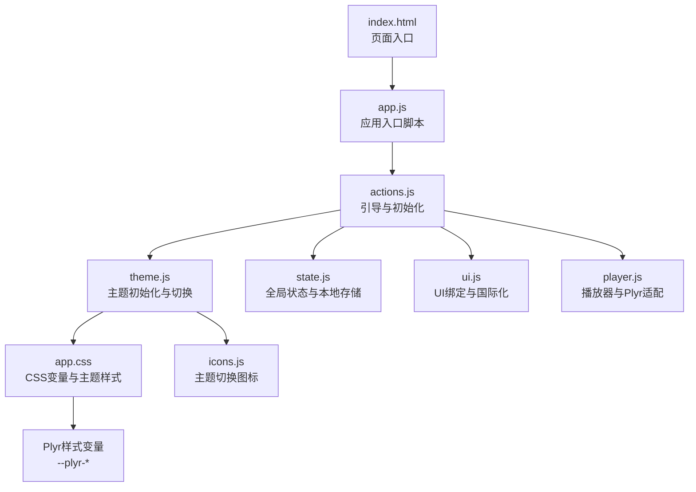
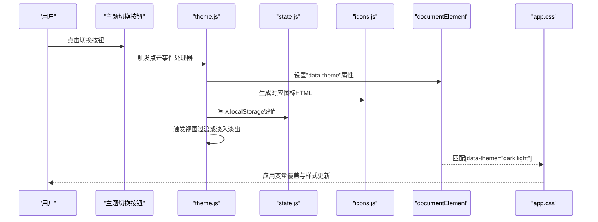
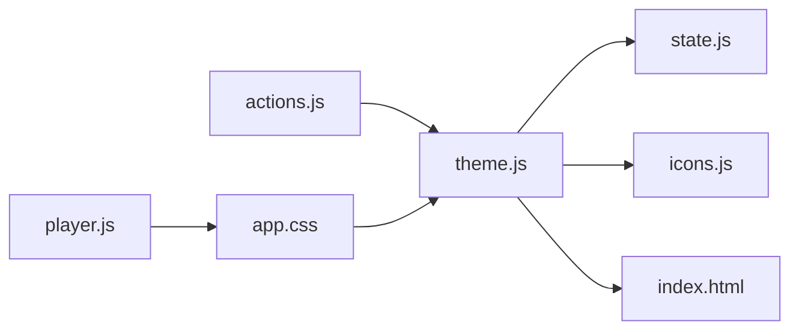

# 主题系统

<cite>
**本文档引用的文件**
- [web/src/modules/theme.js](file://web/src/modules/theme.js)
- [web/src/modules/state.js](file://web/src/modules/state.js)
- [web/src/modules/icons.js](file://web/src/modules/icons.js)
- [web/src/app.css](file://web/src/app.css)
- [web/index.html](file://web/index.html)
- [web/src/modules/actions.js](file://web/src/modules/actions.js)
- [web/src/modules/ui.js](file://web/src/modules/ui.js)
- [web/src/modules/player.js](file://web/src/modules/player.js)
- [web/vite.config.js](file://web/vite.config.js)
- [web/package.json](file://web/package.json)
</cite>

## 目录
1. [简介](#简介)
2. [项目结构](#项目结构)
3. [核心组件](#核心组件)
4. [架构总览](#架构总览)
5. [详细组件分析](#详细组件分析)
6. [依赖关系分析](#依赖关系分析)
7. [性能考量](#性能考量)
8. [故障排查指南](#故障排查指南)
9. [结论](#结论)
10. [附录](#附录)

## 简介
本文件系统性阐述 MSP 前端的主题系统，重点覆盖以下方面：
- CSS 变量的定义与管理：如何在根作用域与主题选择器中声明变量，并通过数据属性驱动主题切换。
- 动态切换机制：用户偏好存储、系统主题检测、手动切换控制与过渡动画。
- 继承关系与覆盖策略：浅色与深色主题变量的差异、组件级覆盖与第三方库（如 Plyr）的适配。
- 响应式设计：断点与布局适配、移动端优化、组件样式调整。
- 颜色系统设计原则：主色调、辅助色、语义化颜色与对比度策略。
- 主题定制最佳实践：自定义变量、组件样式覆盖、第三方样式集成。

## 项目结构
主题系统位于前端资源目录中，核心文件如下：
- 主题逻辑：web/src/modules/theme.js
- 全局状态与本地存储：web/src/modules/state.js
- 图标生成：web/src/modules/icons.js
- 样式与变量：web/src/app.css
- 页面入口：web/index.html
- 应用启动流程：web/src/modules/actions.js
- UI 绑定与国际化：web/src/modules/ui.js
- 媒体播放器与 Plyr 适配：web/src/modules/player.js
- 构建与 PWA 配置：web/vite.config.js、web/package.json

图表来源
- [web/index.html](file://web/index.html#L1-L195)
- [web/src/app.js](file://web/src/app.js#L1-L5)
- [web/src/modules/actions.js](file://web/src/modules/actions.js#L93-L109)
- [web/src/modules/theme.js](file://web/src/modules/theme.js#L4-L66)
- [web/src/modules/state.js](file://web/src/modules/state.js#L42-L58)
- [web/src/modules/ui.js](file://web/src/modules/ui.js#L275-L373)
- [web/src/modules/player.js](file://web/src/modules/player.js#L356-L706)
- [web/src/app.css](file://web/src/app.css#L33-L117)
- [web/src/modules/icons.js](file://web/src/modules/icons.js#L1-L34)

章节来源
- [web/index.html](file://web/index.html#L1-L195)
- [web/src/app.js](file://web/src/app.js#L1-L5)
- [web/src/modules/actions.js](file://web/src/modules/actions.js#L93-L109)

## 核心组件
- 主题初始化与切换：负责根据用户偏好、系统偏好与时间自动选择主题，并更新根元素的数据属性与图标。
- CSS 变量与主题选择器：在 :root 中定义浅色变量，在 [data-theme="dark"] 中覆盖深色变量；组件样式统一引用变量。
- 本地存储与状态：通过常量枚举与工具函数持久化主题选择。
- 图标生成：根据主题状态生成太阳/月亮图标。
- 响应式与组件样式：在不同断点下调整布局与组件尺寸，保证在移动端的良好体验。
- 第三方库适配：为 Plyr 控制器与提示层提供主题一致的颜色变量。

章节来源
- [web/src/modules/theme.js](file://web/src/modules/theme.js#L4-L66)
- [web/src/app.css](file://web/src/app.css#L33-L117)
- [web/src/modules/state.js](file://web/src/modules/state.js#L42-L58)
- [web/src/modules/icons.js](file://web/src/modules/icons.js#L1-L34)
- [web/src/modules/ui.js](file://web/src/modules/ui.js#L1222-L1328)
- [web/src/modules/player.js](file://web/src/modules/player.js#L690-L706)

## 架构总览
主题系统采用“CSS 变量 + 数据属性 + 本地存储”的轻量方案，避免运行时重排与复杂计算，同时提供流畅的切换动画与无障碍支持。

图表来源
- [web/src/modules/theme.js](file://web/src/modules/theme.js#L31-L66)
- [web/src/modules/state.js](file://web/src/modules/state.js#L42-L58)
- [web/src/modules/icons.js](file://web/src/modules/icons.js#L1-L34)
- [web/src/app.css](file://web/src/app.css#L86-L117)

## 详细组件分析

### 主题初始化与切换（theme.js）
- 初始化优先级：
  1) 读取本地存储的用户偏好；
  2) 若无偏好，则根据系统暗色模式与当前小时（夜间自动）决定初始主题；
  3) 根据结果设置根元素的 data-theme 属性并渲染对应图标。
- 切换逻辑：
  - 读取当前主题状态，取反作为下一状态；
  - 优先使用 View Transition API 进行平滑过渡，否则回退到类名添加与定时移除的淡入淡出效果；
  - 将新主题写入本地存储，键名为 LS.theme。
- 系统偏好监听：
  - 当用户未手动设置偏好时，监听系统暗色模式变化，按需自动切换；
  - 同样尊重无障碍中的“减少运动”偏好，直接应用而不触发过渡。
- 自动主题判断：
  - 夜间时段（22:00-06:00）或系统暗色模式开启时，视为深色主题。

章节来源
- [web/src/modules/theme.js](file://web/src/modules/theme.js#L4-L66)
- [web/src/modules/state.js](file://web/src/modules/state.js#L42-L58)

### CSS 变量与主题选择器（app.css）
- 变量定义位置：
  - :root：定义浅色主题下的基础变量，包括字体族、主色、表面色、背景色、文本色、边框色、危险色、悬停/激活态透明度、玻璃背景与边框、阴影与圆角、过渡曲线、Plyr 主色等。
  - [data-theme="dark"]：覆盖深色主题下的主色、表面色、背景色、文本色、边框色、危险色、悬停/激活态透明度、玻璃背景与边框、阴影与软阴影等。
- 组件样式引用：
  - 文本、背景、边框、按钮、标签页、输入框、面板、播放器容器、歌词区、对话框、页脚等均通过 var(--md-*) 引用变量，确保随主题自动切换。
- 特殊适配：
  - 输入框在深色主题下增加半透明背景与边框优化；
  - Plyr 控件颜色通过 --plyr-color-main 与若干内部变量统一适配；
  - 顶部栏与播放器容器使用模糊滤镜与 backdrop-filter，配合 --blur-md 实现毛玻璃效果。

章节来源
- [web/src/app.css](file://web/src/app.css#L33-L117)
- [web/src/app.css](file://web/src/app.css#L446-L461)
- [web/src/app.css](file://web/src/app.css#L690-L701)

### 本地存储与状态（state.js）
- 常量枚举 LS：
  - 包含主题键名 msp.theme，用于持久化用户偏好。
- 工具函数：
  - lsGet(lsSet)：封装 localStorage 的读写，异常安全；
  - canStorage：探测本地存储可用性。
- 应用启动时加载排序设置等偏好，主题偏好通过 theme.js 写入。

章节来源
- [web/src/modules/state.js](file://web/src/modules/state.js#L42-L58)
- [web/src/modules/state.js](file://web/src/modules/state.js#L114-L126)

### 图标生成（icons.js）
- 提供太阳与月亮图标 SVG 的字符串生成函数，用于主题切换按钮的视觉反馈。
- 通过 theme.js 在切换时动态替换按钮内容。

章节来源
- [web/src/modules/icons.js](file://web/src/modules/icons.js#L1-L34)

### 页面入口与初始化（index.html、actions.js）
- 页面入口：
  - index.html 中包含主题切换按钮与播放器容器等关键节点；
  - 引入 Plyr 资源与应用入口脚本。
- 应用启动：
  - actions.js 在 boot() 中调用 initLang、initTheme，并绑定 UI、热键、PIN 对话框；
  - theme.js 在 initTheme() 中完成主题初始化与事件绑定。

章节来源
- [web/index.html](file://web/index.html#L16-L21)
- [web/index.html](file://web/index.html#L190-L192)
- [web/src/modules/actions.js](file://web/src/modules/actions.js#L93-L109)
- [web/src/modules/theme.js](file://web/src/modules/theme.js#L4-L66)

### 响应式设计与断点（app.css）
- 主要断点与布局：
  - 移动端（max-width: 640px）：音频元信息垂直堆叠、封面尺寸调整、歌词高度限制、视频最大高度约束。
  - 平板/小屏（max-width: 980px）：三栏布局改为纵向顺序（舞台 -> 播放列表 -> 侧边栏），播放器容器高度自适应，音频封面居中，歌词区高度限制，视频最大高度约束。
- 组件样式调整：
  - 按钮、输入框、标签页、面板、对话框等在不同断点下调整间距、字号与最小高度，确保可读性与可用性。
- 动画与过渡：
  - 主题切换与组件过渡使用统一的贝塞尔曲线与持续时间，提升一致性与流畅感。

章节来源
- [web/src/app.css](file://web/src/app.css#L798-L816)
- [web/src/app.css](file://web/src/app.css#L1222-L1328)

### 第三方样式集成（Plyr）
- 变量适配：
  - 通过 --plyr-color-main 与若干内部变量（--plyr-video-control-color、--plyr-menu-background 等）统一控制 Plyr 控件颜色与提示层颜色。
- 组件覆盖：
  - 针对音频模式容器与播放器控件进行显式覆盖，确保在深色主题下仍保持高对比度与可读性。
- 无障碍与交互：
  - 为进度条与音量控件强制指针光标，提升触控设备的交互一致性。

章节来源
- [web/src/app.css](file://web/src/app.css#L690-L701)
- [web/src/app.css](file://web/src/app.css#L1350-L1373)
- [web/src/modules/player.js](file://web/src/modules/player.js#L356-L706)

## 依赖关系分析
- 主题模块依赖：
  - theme.js 依赖 state.js（本地存储键名）、icons.js（图标生成）、index.html（按钮节点）。
  - actions.js 在启动时调用 initTheme，形成启动链路。
- 样式依赖：
  - app.css 通过变量与选择器覆盖实现主题切换，无需 JS 重绘。
- 第三方依赖：
  - Plyr 通过 CSS 变量与类名覆盖实现主题一致。

图表来源
- [web/src/modules/theme.js](file://web/src/modules/theme.js#L1-L66)
- [web/src/modules/state.js](file://web/src/modules/state.js#L42-L58)
- [web/src/modules/icons.js](file://web/src/modules/icons.js#L1-L34)
- [web/src/modules/actions.js](file://web/src/modules/actions.js#L93-L109)
- [web/src/app.css](file://web/src/app.css#L33-L117)
- [web/src/modules/player.js](file://web/src/modules/player.js#L356-L706)

章节来源
- [web/src/modules/theme.js](file://web/src/modules/theme.js#L1-L66)
- [web/src/modules/state.js](file://web/src/modules/state.js#L42-L58)
- [web/src/modules/icons.js](file://web/src/modules/icons.js#L1-L34)
- [web/src/modules/actions.js](file://web/src/modules/actions.js#L93-L109)
- [web/src/app.css](file://web/src/app.css#L33-L117)
- [web/src/modules/player.js](file://web/src/modules/player.js#L356-L706)

## 性能考量
- 低开销切换：通过设置根元素 data-theme 与 CSS 变量覆盖，避免 JS 重排与重绘，仅触发合成层动画。
- 过渡优化：优先使用 View Transition API，若不可用则采用类名添加/移除的淡入淡出，避免昂贵的布局计算。
- 无障碍友好：尊重 prefers-reduced-motion，直接应用主题而不过渡，保障可访问性。
- 响应式节流：在小屏断点下减少不必要的 will-change 与过度模糊，避免过度合成导致卡顿。

## 故障排查指南
- 主题未生效：
  - 检查根元素是否正确设置 data-theme；
  - 确认 app.css 中 :root 与 [data-theme="dark"] 的变量覆盖是否完整；
  - 排查是否有更高优先级的选择器覆盖了变量引用。
- 切换无动画：
  - 确认浏览器支持 View Transition API；
  - 检查是否处于 prefers-reduced-motion 状态；
  - 确认未禁用 CSS 过渡。
- 深色模式下文字不可读：
  - 检查 [data-theme="dark"] 下的文本色与背景色对比度；
  - 确认 Plyr 控件颜色变量已正确覆盖。
- 移动端布局异常：
  - 检查断点范围与媒体查询；
  - 确认容器高度与最大高度设置合理。

章节来源
- [web/src/modules/theme.js](file://web/src/modules/theme.js#L39-L47)
- [web/src/app.css](file://web/src/app.css#L86-L117)
- [web/src/app.css](file://web/src/app.css#L1222-L1328)

## 结论
MSP 的主题系统以 CSS 变量为核心，结合数据属性与本地存储，实现了轻量、可维护且高性能的主题切换。通过合理的变量分层与组件覆盖策略，系统在浅色与深色主题之间无缝切换，并在移动端与桌面端均提供了良好的可读性与交互体验。第三方库（Plyr）通过 CSS 变量与类名覆盖被自然地纳入主题体系，整体架构清晰、扩展性强。

## 附录

### 颜色系统设计原则
- 主色调：用于强调、按钮与选中状态，浅色为 Indigo 600/700，深色为 Indigo 400/500。
- 表面色与背景色：浅色为白色与 Zinc 100，深色为 Zinc 900 与 Zinc 950，确保足够的对比度。
- 文本与次级文本：浅色为 Zinc 900 与 Zinc 500，深色为 Zinc 50 与 Zinc 400。
- 边框与危险色：浅色为 Zinc 200 与 Red 500，深色为 Zinc 800 与 Red 400。
- 悬停与激活态：通过透明度叠加实现，避免颜色突变。
- 玻璃效果：通过半透明背景与模糊滤镜实现，圆角与阴影统一使用变量。

章节来源
- [web/src/app.css](file://web/src/app.css#L40-L117)

### 主题定制最佳实践
- 自定义变量：
  - 在 :root 中新增或调整变量，确保在 [data-theme="dark"] 中有对应的覆盖。
- 组件样式覆盖：
  - 优先使用变量引用，避免硬编码颜色；
  - 对第三方组件（如 Plyr）通过 CSS 变量或类名覆盖实现主题一致。
- 第三方样式集成：
  - 为外部库提供主题变量映射，必要时在组件初始化后追加类名或内联样式。
- 用户偏好与无障碍：
  - 保留用户偏好优先级，尊重系统暗色模式与减少运动偏好；
  - 在切换时提供过渡动画，但不强制执行。

章节来源
- [web/src/app.css](file://web/src/app.css#L33-L117)
- [web/src/modules/theme.js](file://web/src/modules/theme.js#L39-L66)
- [web/src/modules/player.js](file://web/src/modules/player.js#L690-L706)