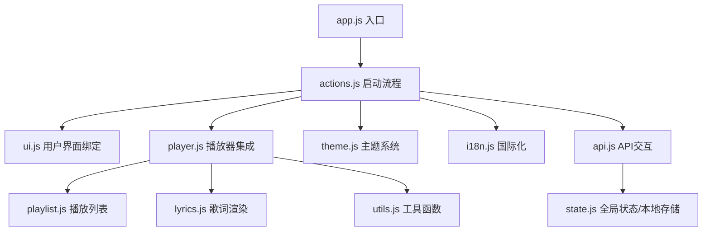
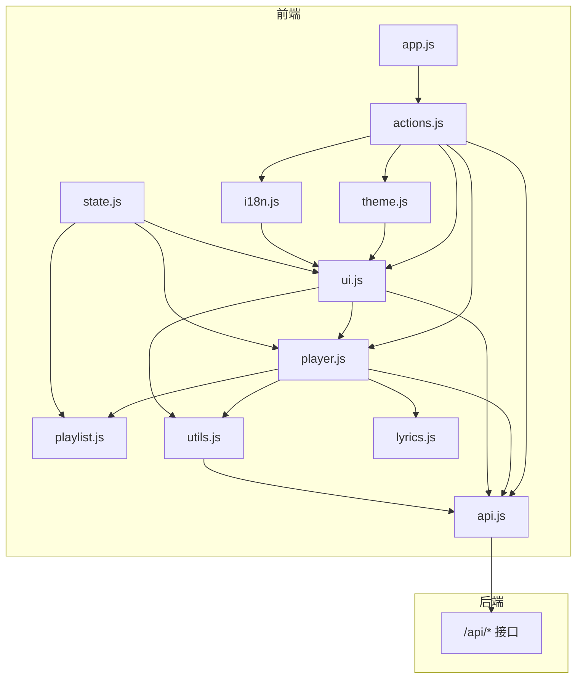
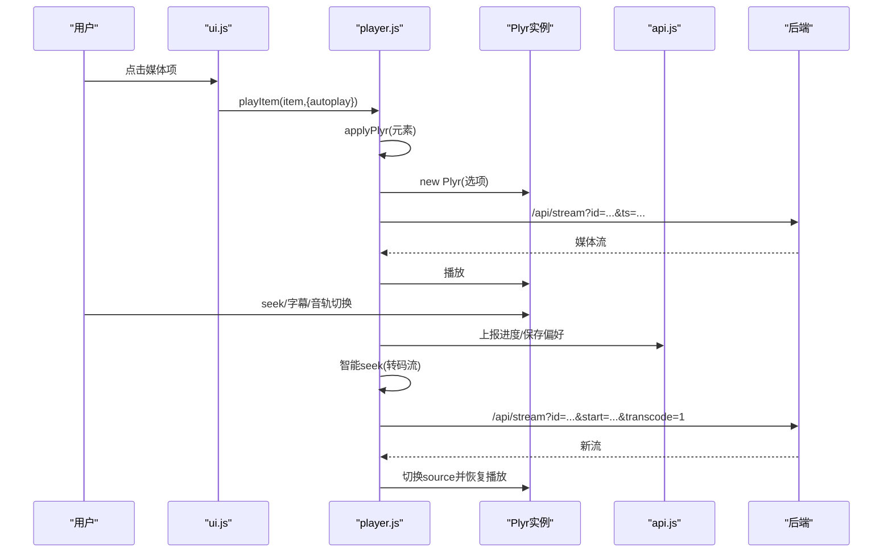
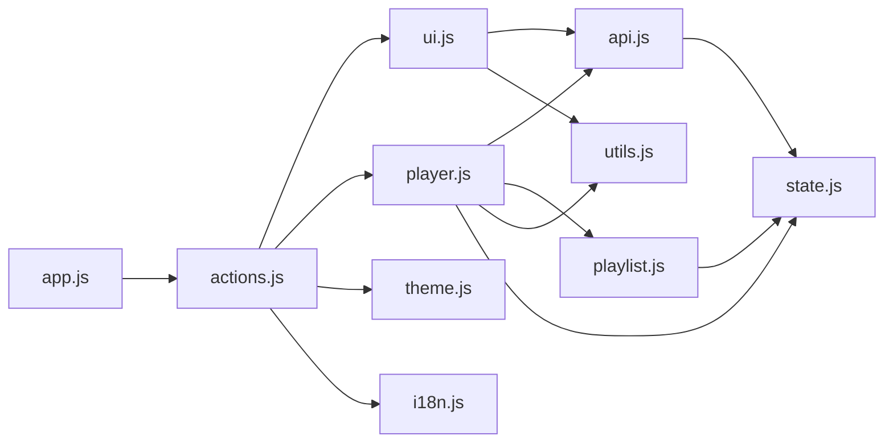

# 前端应用架构

<cite>
**本文引用的文件**
- [web/src/app.js](file://web/src/app.js)
- [web/src/app.css](file://web/src/app.css)
- [web/src/modules/state.js](file://web/src/modules/state.js)
- [web/src/modules/player.js](file://web/src/modules/player.js)
- [web/src/modules/theme.js](file://web/src/modules/theme.js)
- [web/src/modules/actions.js](file://web/src/modules/actions.js)
- [web/src/modules/ui.js](file://web/src/modules/ui.js)
- [web/src/modules/i18n.js](file://web/src/modules/i18n.js)
- [web/src/modules/utils.js](file://web/src/modules/utils.js)
- [web/src/modules/playlist.js](file://web/src/modules/playlist.js)
- [web/src/modules/api.js](file://web/src/modules/api.js)
- [web/src/modules/lyrics.js](file://web/src/modules/lyrics.js)
- [web/src/modules/icons.js](file://web/src/modules/icons.js)
- [web/vite.config.js](file://web/vite.config.js)
- [web/package.json](file://web/package.json)
</cite>

## 目录
1. [引言](#引言)
2. [项目结构](#项目结构)
3. [核心组件](#核心组件)
4. [架构总览](#架构总览)
5. [详细组件分析](#详细组件分析)
6. [依赖关系分析](#依赖关系分析)
7. [性能考量](#性能考量)
8. [故障排查指南](#故障排查指南)
9. [结论](#结论)
10. [附录](#附录)

## 引言
本文件面向MSP项目的前端应用，系统性阐述单页应用（SPA）的整体架构设计，包括模块化组织、组件结构、状态管理、播放器集成、PWA能力、主题系统、国际化、前端性能优化与调试技巧，以及前端与后端API的交互模式与数据流。

## 项目结构
前端位于 web 目录，采用模块化组织，核心入口为 app.js，样式集中于 app.css，业务逻辑拆分为多个功能模块（state、player、ui、playlist、api、i18n、utils、theme、lyrics、icons），构建与PWA由Vite与VitePWA插件负责。

图表来源
- [web/src/app.js](file://web/src/app.js#L1-L5)
- [web/src/modules/actions.js](file://web/src/modules/actions.js#L93-L164)
- [web/src/modules/ui.js](file://web/src/modules/ui.js#L275-L417)
- [web/src/modules/player.js](file://web/src/modules/player.js#L356-L707)
- [web/src/modules/theme.js](file://web/src/modules/theme.js#L4-L67)
- [web/src/modules/i18n.js](file://web/src/modules/i18n.js#L194-L201)
- [web/src/modules/api.js](file://web/src/modules/api.js#L1-L155)
- [web/src/modules/playlist.js](file://web/src/modules/playlist.js#L91-L102)
- [web/src/modules/lyrics.js](file://web/src/modules/lyrics.js#L27-L74)
- [web/src/modules/utils.js](file://web/src/modules/utils.js#L53-L60)
- [web/src/modules/state.js](file://web/src/modules/state.js#L40-L127)

章节来源
- [web/src/app.js](file://web/src/app.js#L1-L5)
- [web/src/modules/state.js](file://web/src/modules/state.js#L60-L93)
- [web/src/modules/actions.js](file://web/src/modules/actions.js#L93-L164)
- [web/src/modules/ui.js](file://web/src/modules/ui.js#L275-L417)
- [web/src/modules/player.js](file://web/src/modules/player.js#L356-L707)
- [web/src/modules/theme.js](file://web/src/modules/theme.js#L4-L67)
- [web/src/modules/i18n.js](file://web/src/modules/i18n.js#L194-L201)
- [web/src/modules/api.js](file://web/src/modules/api.js#L1-L155)
- [web/src/modules/playlist.js](file://web/src/modules/playlist.js#L91-L102)
- [web/src/modules/lyrics.js](file://web/src/modules/lyrics.js#L27-L74)
- [web/src/modules/utils.js](file://web/src/modules/utils.js#L53-L60)
- [web/vite.config.js](file://web/vite.config.js#L1-L48)
- [web/package.json](file://web/package.json#L1-L25)

## 核心组件
- 全局状态与本地存储：集中于 state.js，定义全局状态、本地存储键名、localStorage封装。
- 启动与生命周期：actions.js 负责注册Service Worker、初始化语言与主题、绑定UI、加载配置与媒体、处理PIN鉴权、引导全量/增量加载。
- 播放器与媒体控制：player.js 集成Plyr，处理错误降级、转码回退、智能seek、音轨/字幕持久化、进度记录与恢复。
- 界面与交互：ui.js 渲染列表、分页、设置面板、排序与搜索、快捷键、播放列表联动更新。
- 播放列表：playlist.js 维护播放队列、顺序生成、页面自适应、导航按钮状态。
- 国际化：i18n.js 提供多语言字典与翻译函数，配合UI动态更新。
- 工具函数：utils.js 提供格式化、MIME判断、URL构造、探测缓存等。
- API交互：api.js 封装GET/POST、重试、进度上报、偏好批处理、探测信息。
- 主题系统：theme.js 基于CSS变量与data-theme属性，支持系统跟随与过渡动画。
- 歌词：lyrics.js 解析LRC、渲染与高亮滚动。
- 图标：icons.js 提供SVG图标片段。
- 构建与PWA：vite.config.js 配置PWA、Workbox缓存策略、代理后端API。

章节来源
- [web/src/modules/state.js](file://web/src/modules/state.js#L60-L127)
- [web/src/modules/actions.js](file://web/src/modules/actions.js#L93-L164)
- [web/src/modules/player.js](file://web/src/modules/player.js#L356-L707)
- [web/src/modules/ui.js](file://web/src/modules/ui.js#L74-L171)
- [web/src/modules/playlist.js](file://web/src/modules/playlist.js#L91-L102)
- [web/src/modules/i18n.js](file://web/src/modules/i18n.js#L185-L201)
- [web/src/modules/utils.js](file://web/src/modules/utils.js#L53-L93)
- [web/src/modules/api.js](file://web/src/modules/api.js#L95-L155)
- [web/src/modules/theme.js](file://web/src/modules/theme.js#L4-L67)
- [web/src/modules/lyrics.js](file://web/src/modules/lyrics.js#L27-L74)
- [web/src/modules/icons.js](file://web/src/modules/icons.js#L1-L34)
- [web/vite.config.js](file://web/vite.config.js#L7-L33)

## 架构总览
前端采用“模块化单页应用”架构，围绕全局状态驱动UI与播放器行为，通过API模块与后端交互，结合PWA提升离线体验与安装能力。

图表来源
- [web/src/app.js](file://web/src/app.js#L1-L5)
- [web/src/modules/actions.js](file://web/src/modules/actions.js#L93-L164)
- [web/src/modules/ui.js](file://web/src/modules/ui.js#L275-L417)
- [web/src/modules/player.js](file://web/src/modules/player.js#L356-L707)
- [web/src/modules/playlist.js](file://web/src/modules/playlist.js#L91-L102)
- [web/src/modules/api.js](file://web/src/modules/api.js#L16-L40)
- [web/src/modules/state.js](file://web/src/modules/state.js#L60-L93)
- [web/src/modules/theme.js](file://web/src/modules/theme.js#L4-L67)
- [web/src/modules/i18n.js](file://web/src/modules/i18n.js#L185-L201)
- [web/src/modules/utils.js](file://web/src/modules/utils.js#L53-L60)
- [web/src/modules/lyrics.js](file://web/src/modules/lyrics.js#L27-L74)

## 详细组件分析

### 模块化与入口
- app.js 作为入口，导入样式与启动函数，执行 boot() 初始化。
- actions.js 的 boot() 负责注册Service Worker、初始化语言/主题、绑定UI、加载配置与媒体、处理PIN鉴权、后台轮询刷新。

章节来源
- [web/src/app.js](file://web/src/app.js#L1-L5)
- [web/src/modules/actions.js](file://web/src/modules/actions.js#L93-L164)

### 状态管理与本地存储
- state.js 定义全局状态对象与默认值，提供本地存储封装（LS键名、lsGet/lsSet）、排序偏好初始化。
- 重要字段：语言、配置、媒体、当前项、播放器实例、歌词、用户偏好、播放列表、分页参数、扫描状态等。
- 本地存储键覆盖：主题、语言、音量、播放历史、排序字段/顺序、播放列表快照等。

章节来源
- [web/src/modules/state.js](file://web/src/modules/state.js#L60-L127)

### 播放器集成（Plyr）
- 播放器初始化：根据设备类型与配置启用Plyr控件、字幕、速度、全屏、键盘快捷键、存储等。
- 错误降级与转码回退：捕获解码/源不支持错误，近尾段错误视为结束，必要时刷新URL重试，或切换到转码流；失败时展示可见错误。
- 智能seek：当播放的是转码流且发生seek时，暂停、更换带起始偏移的转码URL、重新加载并恢复播放。
- 防停顿监控：心跳检测播放停滞（长时间无进度），超时强制结束。
- 字幕与音轨：动态注入track节点，持久化用户选择；原生audioTracks检测与切换，定期保存当前音轨。
- 进度与恢复：保存当前类型最后ID、时间、音量、播放列表快照；支持从后端API查询进度优先于本地存储。

图表来源
- [web/src/modules/player.js](file://web/src/modules/player.js#L356-L707)
- [web/src/modules/api.js](file://web/src/modules/api.js#L95-L108)
- [web/src/modules/utils.js](file://web/src/modules/utils.js#L53-L60)

章节来源
- [web/src/modules/player.js](file://web/src/modules/player.js#L15-L155)
- [web/src/modules/player.js](file://web/src/modules/player.js#L228-L255)
- [web/src/modules/player.js](file://web/src/modules/player.js#L290-L339)
- [web/src/modules/player.js](file://web/src/modules/player.js#L557-L624)
- [web/src/modules/player.js](file://web/src/modules/player.js#L708-L795)
- [web/src/modules/api.js](file://web/src/modules/api.js#L95-L108)

### 播放列表与导航
- 当前列表：按tab筛选视频/音频/图片/其他。
- 过滤与排序：支持正则/Pinyin/模糊搜索，按名称（含中文排序规则）/大小/时间排序。
- 分页：列表与播放列表分别维护页码与每页数量。
- 导航按钮：根据播放顺序与循环状态启用/禁用。
- 自适应分页：根据容器高度与行高动态计算每页条数，避免滚动条闪烁。

章节来源
- [web/src/modules/playlist.js](file://web/src/modules/playlist.js#L7-L15)
- [web/src/modules/playlist.js](file://web/src/modules/playlist.js#L39-L55)
- [web/src/modules/playlist.js](file://web/src/modules/playlist.js#L57-L89)
- [web/src/modules/playlist.js](file://web/src/modules/playlist.js#L190-L236)
- [web/src/modules/playlist.js](file://web/src/modules/playlist.js#L327-L342)

### 界面与交互（UI）
- 动态文本：基于i18n字典更新静态文案、占位符、标题。
- 列表渲染：分页、排序、搜索结果展示，点击播放。
- 设置面板：共享目录增删、黑名单配置、默认标签页、播放偏好。
- 快捷键与全局事件：绑定热键、恢复按钮、切换填充模式、上一曲/下一曲。
- 元信息：媒体元数据字符串拼接、平台相关占位符提示。

章节来源
- [web/src/modules/ui.js](file://web/src/modules/ui.js#L19-L72)
- [web/src/modules/ui.js](file://web/src/modules/ui.js#L74-L171)
- [web/src/modules/ui.js](file://web/src/modules/ui.js#L223-L273)
- [web/src/modules/ui.js](file://web/src/modules/ui.js#L275-L417)

### 国际化（i18n）
- 多语言字典：英文与中文键值映射，包含UI文案、错误提示、PIN认证等。
- 翻译函数：按语言选择字典，支持占位符替换。
- 初始化：从本地存储读取语言，设置HTML lang属性。

章节来源
- [web/src/modules/i18n.js](file://web/src/modules/i18n.js#L185-L201)
- [web/src/modules/i18n.js](file://web/src/modules/i18n.js#L3-L183)

### 主题系统（CSS变量与动态切换）
- 设计语言：Neo-Industrial风格，定义字体、颜色、阴影、圆角、过渡。
- CSS变量：:root与[data-theme="dark"/"light"]两套主题，Plyr颜色适配。
- 动态切换：基于data-theme属性，支持系统跟随、手动切换、视图过渡动画、减少动态效果模式。
- 图标：太阳/月亮图标切换。

章节来源
- [web/src/app.css](file://web/src/app.css#L33-L117)
- [web/src/modules/theme.js](file://web/src/modules/theme.js#L4-L67)
- [web/src/modules/icons.js](file://web/src/modules/icons.js#L1-L34)

### 歌词（LRC解析与高亮滚动）
- 解析：按时间戳提取歌词行，标准化换行，按时间排序。
- 渲染：空状态提示与行节点列表。
- 高亮滚动：根据播放时间定位当前行，平滑滚动居中。

章节来源
- [web/src/modules/lyrics.js](file://web/src/modules/lyrics.js#L8-L25)
- [web/src/modules/lyrics.js](file://web/src/modules/lyrics.js#L27-L47)
- [web/src/modules/lyrics.js](file://web/src/modules/lyrics.js#L49-L73)

### 工具函数与探测
- 格式化：字节单位、时间本地化。
- MIME判断：根据扩展名返回对应MIME，辅助canPlayType判断。
- URL构造：/api/stream带时间戳与起始偏移。
- 探测缓存：对媒体探测结果进行LRU缓存，避免重复请求。

章节来源
- [web/src/modules/utils.js](file://web/src/modules/utils.js#L4-L21)
- [web/src/modules/utils.js](file://web/src/modules/utils.js#L72-L93)
- [web/src/modules/utils.js](file://web/src/modules/utils.js#L53-L60)
- [web/src/modules/api.js](file://web/src/modules/api.js#L42-L64)

### API交互与数据流
- GET/POST：统一错误处理与JSON解析，支持204无内容。
- 重试：指数退避重试包装。
- 进度上报与查询：播放进度上报与后端查询。
- 偏好批处理：本地与远端偏好合并，300ms批量写入。
- 探测：媒体容器/音视频信息，生成提示文本与警告文本。

章节来源
- [web/src/modules/api.js](file://web/src/modules/api.js#L5-L40)
- [web/src/modules/api.js](file://web/src/modules/api.js#L95-L155)

### PWA与缓存策略
- 注册：在actions.js中注册Service Worker，立即激活自动更新。
- Manifest：名称、短名、描述、主题色、图标。
- Workbox：runtimeCaching对/api/*使用NetworkOnly，navigateFallbackDenylist排除API路由，避免缓存后端接口。
- 代理：开发时通过Vite代理转发/api到后端。

章节来源
- [web/src/modules/actions.js](file://web/src/modules/actions.js#L93-L97)
- [web/vite.config.js](file://web/vite.config.js#L7-L33)
- [web/vite.config.js](file://web/vite.config.js#L34-L42)
- [web/package.json](file://web/package.json#L11-L17)

## 依赖关系分析
- 模块耦合：player依赖ui、playlist、api、utils、lyrics；ui依赖player、playlist、utils、api；actions聚合所有模块并协调启动。
- 外部依赖：VitePWA、Workbox、Plyr资源（通过public/assets引入）。
- 关键依赖链：app.js → actions → ui/player/theme/i18n → api → state。

图表来源
- [web/src/app.js](file://web/src/app.js#L1-L5)
- [web/src/modules/actions.js](file://web/src/modules/actions.js#L93-L164)
- [web/src/modules/ui.js](file://web/src/modules/ui.js#L275-L417)
- [web/src/modules/player.js](file://web/src/modules/player.js#L356-L707)
- [web/src/modules/playlist.js](file://web/src/modules/playlist.js#L91-L102)
- [web/src/modules/api.js](file://web/src/modules/api.js#L1-L155)
- [web/src/modules/state.js](file://web/src/modules/state.js#L60-L93)
- [web/src/modules/utils.js](file://web/src/modules/utils.js#L53-L60)

章节来源
- [web/src/modules/actions.js](file://web/src/modules/actions.js#L93-L164)
- [web/src/modules/ui.js](file://web/src/modules/ui.js#L275-L417)
- [web/src/modules/player.js](file://web/src/modules/player.js#L356-L707)
- [web/src/modules/playlist.js](file://web/src/modules/playlist.js#L91-L102)
- [web/src/modules/api.js](file://web/src/modules/api.js#L1-L155)
- [web/src/modules/state.js](file://web/src/modules/state.js#L60-L93)
- [web/src/modules/utils.js](file://web/src/modules/utils.js#L53-L60)

## 性能考量
- 播放器错误降级与转码回退：避免长时间卡死，提升兼容性。
- 智能seek与心跳监控：减少无效重试与假死播放。
- 本地存储与批处理：偏好写入300ms批处理，降低网络压力。
- 列表自适应分页：按容器高度动态计算，减少DOM重排。
- CSS变量与过渡：主题切换使用CSS变量与过渡，避免重绘抖动。
- PWA缓存：API路由走NetworkOnly，静态资源缓存，提升二次加载速度。

## 故障排查指南
- 播放失败：
  - 检查后端转码开关与容器/编解码支持。
  - 查看错误拦截日志与错误提示文案。
  - 确认是否触发转码回退与智能seek。
- 字幕/音轨异常：
  - 确认track注入与持久化键值。
  - 检查浏览器对内封字幕/音轨支持差异。
- 进度不同步：
  - 确认后端进度查询优先级高于本地存储。
  - 检查批处理偏好写入是否成功。
- PWA离线：
  - 确认Service Worker注册与Workbox策略。
  - 检查navigateFallbackDenylist是否正确排除API路由。

章节来源
- [web/src/modules/player.js](file://web/src/modules/player.js#L363-L443)
- [web/src/modules/player.js](file://web/src/modules/player.js#L570-L624)
- [web/src/modules/api.js](file://web/src/modules/api.js#L129-L144)
- [web/src/modules/playlist.js](file://web/src/modules/playlist.js#L190-L236)
- [web/src/app.css](file://web/src/app.css#L239-L256)
- [web/vite.config.js](file://web/vite.config.js#L10-L18)

## 结论
MSP前端以模块化为核心，围绕全局状态与API交互驱动播放器与UI，具备完善的播放器降级与转码回退、智能seek、字幕/音轨持久化、播放列表自适应分页、主题系统与国际化支持，并通过PWA增强离线体验。整体架构清晰、职责分离明确，便于扩展与维护。

## 附录
- 开发与构建：使用Vite，开发时通过代理访问后端；生产构建输出dist目录。
- 依赖版本：Vite、VitePWA、Workbox等。

章节来源
- [web/vite.config.js](file://web/vite.config.js#L1-L48)
- [web/package.json](file://web/package.json#L11-L25)