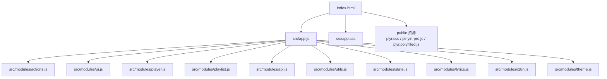
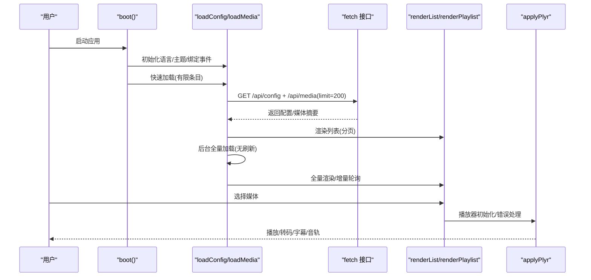
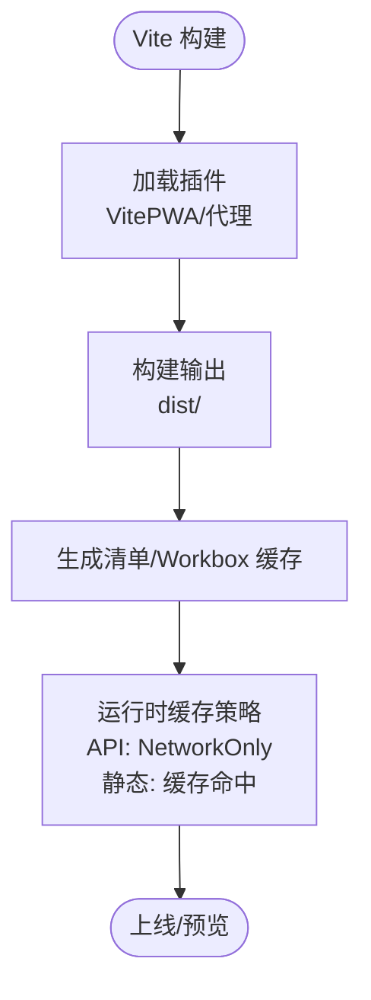
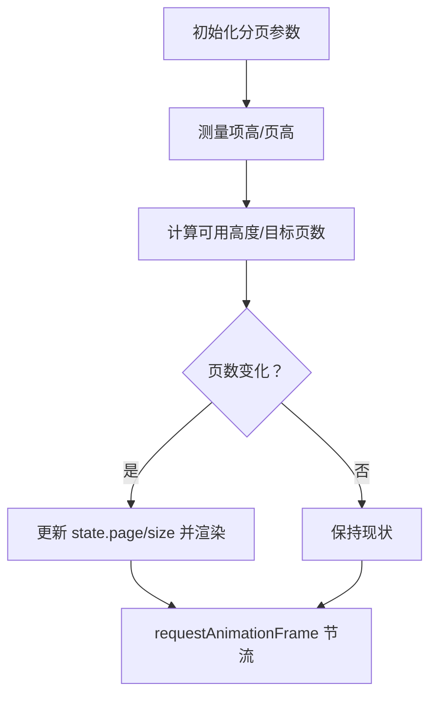
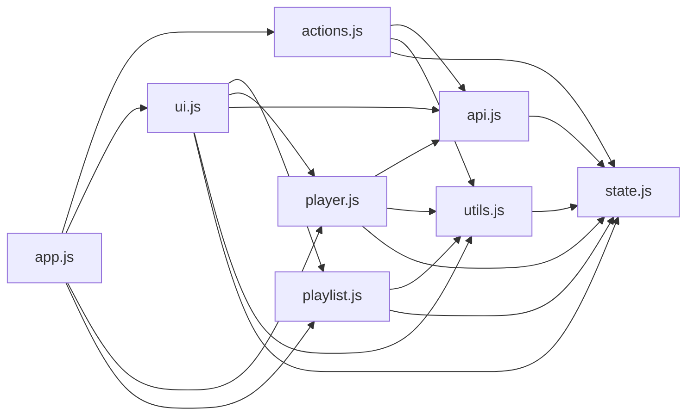

# 前端性能优化

<cite>
**本文引用的文件**
- [vite.config.js](file://web/vite.config.js)
- [package.json](file://web/package.json)
- [index.html](file://web/index.html)
- [app.js](file://web/src/app.js)
- [app.css](file://web/src/app.css)
- [actions.js](file://web/src/modules/actions.js)
- [player.js](file://web/src/modules/player.js)
- [ui.js](file://web/src/modules/ui.js)
- [utils.js](file://web/src/modules/utils.js)
- [state.js](file://web/src/modules/state.js)
- [lyrics.js](file://web/src/modules/lyrics.js)
- [playlist.js](file://web/src/modules/playlist.js)
- [api.js](file://web/src/modules/api.js)
- [i18n.js](file://web/src/modules/i18n.js)
- [theme.js](file://web/src/modules/theme.js)
</cite>

## 目录
1. [简介](#简介)
2. [项目结构](#项目结构)
3. [核心组件](#核心组件)
4. [架构总览](#架构总览)
5. [详细组件分析](#详细组件分析)
6. [依赖关系分析](#依赖关系分析)
7. [性能考量](#性能考量)
8. [故障排查指南](#故障排查指南)
9. [结论](#结论)
10. [附录](#附录)

## 简介
本文件面向 MSP 项目的前端性能优化，围绕资源加载优化、渲染性能提升、内存管理、构建优化（Vite）、媒体资源优化、JavaScript 执行优化以及性能监控与调试方法展开。文档结合实际代码文件，给出可操作的优化策略与可视化图示，帮助开发者在保证功能完整性的同时，显著提升用户体验与运行效率。

## 项目结构
前端位于 web 子目录，采用模块化组织，入口为 index.html，主应用脚本为 src/app.js，样式集中在 src/app.css，业务逻辑拆分为多个模块（actions、player、ui、playlist、api、utils、state、lyrics、i18n、theme），并由 Vite 进行开发与构建。

图表来源
- [index.html](file://web/index.html#L1-L195)
- [app.js](file://web/src/app.js#L1-L5)
- [actions.js](file://web/src/modules/actions.js#L1-L164)
- [player.js](file://web/src/modules/player.js#L1-L1292)
- [ui.js](file://web/src/modules/ui.js#L1-L417)
- [playlist.js](file://web/src/modules/playlist.js#L1-L457)
- [api.js](file://web/src/modules/api.js#L1-L155)
- [utils.js](file://web/src/modules/utils.js#L1-L124)
- [state.js](file://web/src/modules/state.js#L1-L127)
- [lyrics.js](file://web/src/modules/lyrics.js#L1-L74)
- [i18n.js](file://web/src/modules/i18n.js#L1-L201)
- [theme.js](file://web/src/modules/theme.js#L1-L67)
- [app.css](file://web/src/app.css#L1-L1373)

章节来源
- [index.html](file://web/index.html#L1-L195)
- [app.js](file://web/src/app.js#L1-L5)

## 核心组件
- 应用启动与引导：app.js 负责引入样式与启动 boot 流程。
- 数据与状态：state.js 统一管理全局状态与本地存储键值。
- 行为与交互：actions.js 负责配置与媒体列表的加载、缓存与重试；ui.js 负责界面绑定与渲染；player.js 负责播放器初始化、错误处理与智能回退；playlist.js 负责播放列表构建与分页自适应；api.js 负责请求封装与偏好批处理；utils.js 提供格式化与能力探测；lyrics.js 负责歌词解析与高亮滚动；i18n.js 负责多语言；theme.js 负责主题切换与过渡动画。
- 构建与缓存：vite.config.js 配置 PWA、代理与输出目录；package.json 管理依赖与脚本。

章节来源
- [state.js](file://web/src/modules/state.js#L1-L127)
- [actions.js](file://web/src/modules/actions.js#L1-L164)
- [ui.js](file://web/src/modules/ui.js#L1-L417)
- [player.js](file://web/src/modules/player.js#L1-L1292)
- [playlist.js](file://web/src/modules/playlist.js#L1-L457)
- [api.js](file://web/src/modules/api.js#L1-L155)
- [utils.js](file://web/src/modules/utils.js#L1-L124)
- [lyrics.js](file://web/src/modules/lyrics.js#L1-L74)
- [i18n.js](file://web/src/modules/i18n.js#L1-L201)
- [theme.js](file://web/src/modules/theme.js#L1-L67)
- [vite.config.js](file://web/vite.config.js#L1-L48)
- [package.json](file://web/package.json#L1-L25)

## 架构总览
前端采用“模块化分层 + 渐进式加载”的架构：入口页面加载最小必要资源，随后通过 actions 的快速加载与后台全量加载策略，结合 UI 分页渲染与播放器按需初始化，降低首屏压力。PWA 与 Service Worker 提升离线体验与缓存命中率。

图表来源
- [actions.js](file://web/src/modules/actions.js#L93-L164)
- [ui.js](file://web/src/modules/ui.js#L74-L170)
- [player.js](file://web/src/modules/player.js#L356-L706)
- [api.js](file://web/src/modules/api.js#L16-L36)

## 详细组件分析

### Vite 构建与 PWA 优化
- 插件与配置
  - 使用 VitePWA 插件，开启自动更新注册、静态资源缓存与运行时缓存策略，区分 API 请求与静态资源缓存，避免缓存污染。
  - 代理配置将 /api 前缀转发到后端，便于开发联调。
  - 输出目录 dist，空目录清理，避免历史产物残留。
- 依赖与脚本
  - 依赖 workbox-window 实现 SW 注册与更新提示。
  - 使用 pnpm 并通过 overrides 固定 sourcemap 相关包版本，减少打包链路不确定性。

图表来源
- [vite.config.js](file://web/vite.config.js#L5-L47)
- [package.json](file://web/package.json#L11-L25)

章节来源
- [vite.config.js](file://web/vite.config.js#L1-L48)
- [package.json](file://web/package.json#L1-L25)

### 资源加载优化
- 首屏最小化
  - index.html 仅引入必要的样式与第三方脚本，应用主模块以 module 方式延迟加载，避免阻塞渲染。
  - app.js 仅导入样式与启动函数，减少初始 JS 体积。
- 渐进式加载
  - actions.boot 中先进行快速加载（有限条目），再在后台发起全量加载与轮询，降低首屏等待。
- 缓存与重试
  - loadMedia 支持 ETag 条件请求与 304 协商缓存；失败时通过 apiRetry 重试，提升稳定性。
- PWA 与静态资源
  - PWA 缓存静态资源与图标，减少重复下载；API 走 NetworkOnly，避免缓存污染。

章节来源
- [index.html](file://web/index.html#L1-L195)
- [app.js](file://web/src/app.js#L1-L5)
- [actions.js](file://web/src/modules/actions.js#L38-L91)
- [api.js](file://web/src/modules/api.js#L5-L14)
- [vite.config.js](file://web/vite.config.js#L7-L33)

### 渲染性能提升
- 分页与虚拟化思路
  - UI 渲染采用分页策略（列表与播放列表），通过 state.listPageSize 控制每页数量，避免一次性渲染大量节点。
  - 播放列表提供自适应分页测量与节流更新，减少布局抖动。
- DOM 操作最小化
  - 通过统一的 el 工具函数获取元素，集中事件绑定与状态更新，避免重复查询与多次重排。
- 动画与过渡
  - app.css 中对主题切换、面板、按钮等元素设置合理的过渡时间与缓动曲线，减少视觉跳变。
  - 主题切换使用 View Transition 或渐隐类名，兼顾性能与体验。

图表来源
- [ui.js](file://web/src/modules/ui.js#L74-L170)
- [playlist.js](file://web/src/modules/playlist.js#L190-L236)

章节来源
- [ui.js](file://web/src/modules/ui.js#L74-L170)
- [playlist.js](file://web/src/modules/playlist.js#L190-L236)
- [app.css](file://web/src/app.css#L240-L256)

### 内存管理与资源释放
- 播放器生命周期
  - destroyPlyr 与 resetMediaEl 在切换媒体或隐藏播放器时主动销毁实例与释放资源，防止内存泄漏。
- 事件监听与定时器
  - 退出播放器时清理心跳检查定时器与持久化定时器，避免悬挂回调。
- 字幕与音轨
  - 切换媒体时移除旧 track，避免重复叠加导致的内存占用上升。

章节来源
- [player.js](file://web/src/modules/player.js#L157-L200)
- [player.js](file://web/src/modules/player.js#L283-L288)
- [player.js](file://web/src/modules/player.js#L228-L255)

### JavaScript 执行优化
- 异步与批处理
  - apiRetry 提供指数退避重试，降低瞬时失败对主线程的影响。
  - 偏好设置采用批量写入（300ms 窗口），减少频繁 IO 与网络请求。
- 防抖与节流
  - 播放列表自适应分页使用 requestAnimationFrame 节流，避免高频重排。
- 事件委托与最小绑定
  - UI 绑定集中在根节点，利用事件冒泡与委托减少监听器数量。
- 智能回退与降级
  - 播放器对解码错误与源不可用进行智能回退（转码），并在 UI 层提示，避免崩溃与卡死。

章节来源
- [api.js](file://web/src/modules/api.js#L5-L14)
- [api.js](file://web/src/modules/api.js#L129-L144)
- [playlist.js](file://web/src/modules/playlist.js#L111-L117)
- [ui.js](file://web/src/modules/ui.js#L275-L416)
- [player.js](file://web/src/modules/player.js#L356-L706)

### 图片与媒体资源优化
- 媒体能力探测
  - utils.canPlayMedia 基于 MIME 类型与浏览器 canPlayType 判断直播放放可行性，避免无效尝试。
- 智能转码与回退
  - player 对特定容器（如 avi/wmv）与解码错误进行转码回退，结合 Plyr 与原生元素双通道切换，提升兼容性。
- 播放器集成
  - 通过 Plyr 管理字幕、音轨、倍速、全屏等特性，减少自研复杂度。
- 图片展示
  - app.css 对图片容器设置 object-fit 与圆角，兼顾清晰度与性能。

章节来源
- [utils.js](file://web/src/modules/utils.js#L95-L124)
- [player.js](file://web/src/modules/player.js#L270-L281)
- [player.js](file://web/src/modules/player.js#L394-L437)
- [player.js](file://web/src/modules/player.js#L568-L624)
- [app.css](file://web/src/app.css#L666-L672)

### 性能监控与调试
- 远程日志
  - logRemote 将关键事件上报到后端，便于定位问题。
- 进度记录
  - reportProgress 与 getProgress 结合本地存储与远端接口，记录播放进度，用于恢复播放与统计。
- 错误提示
  - mediaErrorText 将浏览器错误码映射为用户可理解的信息，辅助诊断。
- 诊断缓存
  - probeCache 限制大小（100），避免无限增长；probePeek/ProbeText 提供快速诊断信息。

章节来源
- [api.js](file://web/src/modules/api.js#L38-L40)
- [api.js](file://web/src/modules/api.js#L95-L108)
- [api.js](file://web/src/modules/api.js#L84-L93)
- [api.js](file://web/src/modules/api.js#L42-L64)

## 依赖关系分析
模块间依赖清晰，遵循“单向数据流 + 事件驱动”原则：app.js 作为入口协调各模块；actions 负责数据获取与缓存；ui/playlist/player 负责视图与交互；api/utils/state 提供通用能力与状态。

图表来源
- [app.js](file://web/src/app.js#L1-L5)
- [actions.js](file://web/src/modules/actions.js#L1-L164)
- [ui.js](file://web/src/modules/ui.js#L1-L417)
- [player.js](file://web/src/modules/player.js#L1-L1292)
- [playlist.js](file://web/src/modules/playlist.js#L1-L457)
- [api.js](file://web/src/modules/api.js#L1-L155)
- [utils.js](file://web/src/modules/utils.js#L1-L124)
- [state.js](file://web/src/modules/state.js#L1-L127)

## 性能考量
- 构建与缓存
  - 使用 Vite 的模块化打包与 PWA 缓存，减少首屏与二次加载时间。
  - API 走 NetworkOnly，避免缓存干扰；静态资源走 Workbox 缓存。
- 渲染与交互
  - 分页与自适应分页减少 DOM 数量；过渡动画使用 CSS 属性而非昂贵属性（如 width/height）。
  - 事件委托与最小化 DOM 查询，降低主线程压力。
- 媒体播放
  - 能力探测与智能回退减少失败重试次数；心跳检测与错误拦截避免卡死。
- 数据与状态
  - ETag 协商缓存与有限条目快速加载，缩短感知等待；偏好批处理降低网络与 IO 压力。

[本节为通用指导，无需列出章节来源]

## 故障排查指南
- 媒体无法播放
  - 检查 canPlayType 与 MIME 映射；若报错接近结尾，考虑转码回退；确认字幕/音轨轨道是否存在。
- 播放卡顿或停滞
  - 关注心跳定时器与 readyState；必要时暂停后重建播放器实例。
- 列表渲染卡顿
  - 检查分页参数与 RAF 节流；避免在渲染过程中进行昂贵计算。
- 主题切换闪烁
  - 确认 View Transition 是否可用；否则使用渐隐类名过渡。
- PWA 缓存异常
  - 检查 Workbox 缓存策略与导航回退规则；确认 API 请求未被缓存。

章节来源
- [player.js](file://web/src/modules/player.js#L356-L706)
- [playlist.js](file://web/src/modules/playlist.js#L190-L236)
- [theme.js](file://web/src/modules/theme.js#L41-L48)
- [vite.config.js](file://web/vite.config.js#L10-L18)

## 结论
通过模块化设计、渐进式加载、分页渲染、智能回退与 PWA 缓存，MSP 前端在保证功能完整性的同时，有效提升了首屏速度、交互流畅度与稳定性。建议持续关注浏览器兼容性、缓存策略与媒体转码策略，结合监控指标进行迭代优化。

[本节为总结性内容，无需列出章节来源]

## 附录
- 关键优化点速览
  - 构建：Vite + PWA；API 缓存隔离；输出目录清理。
  - 加载：ETag 协商；有限条目快速加载；后台全量加载与轮询。
  - 渲染：分页与自适应分页；RAF 节流；过渡动画优化。
  - 媒体：能力探测；智能回退；心跳检测；字幕/音轨管理。
  - 交互：事件委托；批处理偏好；错误映射与提示。
  - 主题：系统偏好联动；View Transition 或渐隐过渡。

[本节为概览性内容，无需列出章节来源]