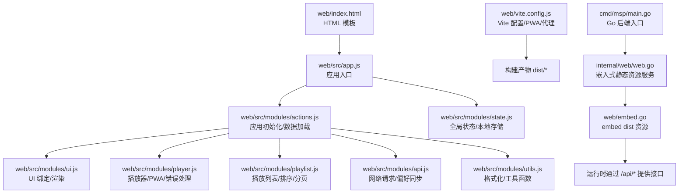
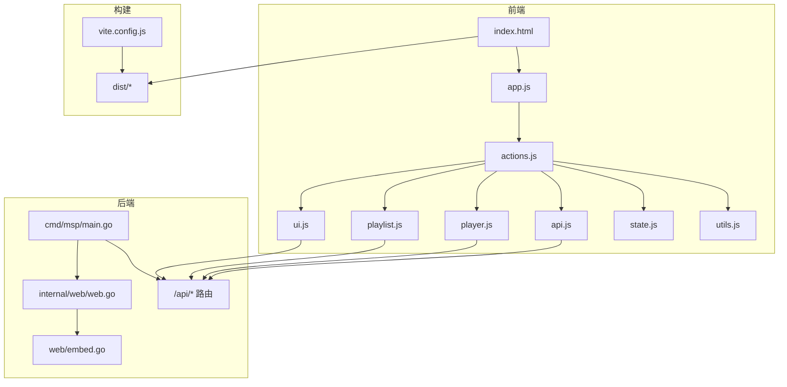
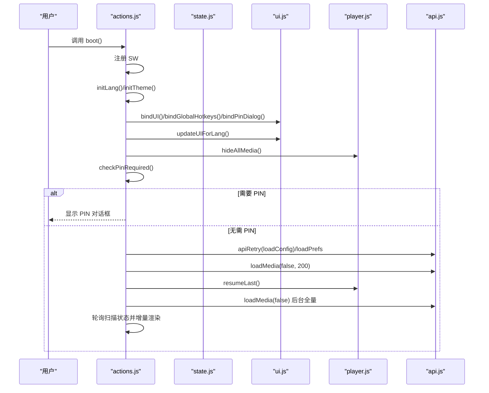
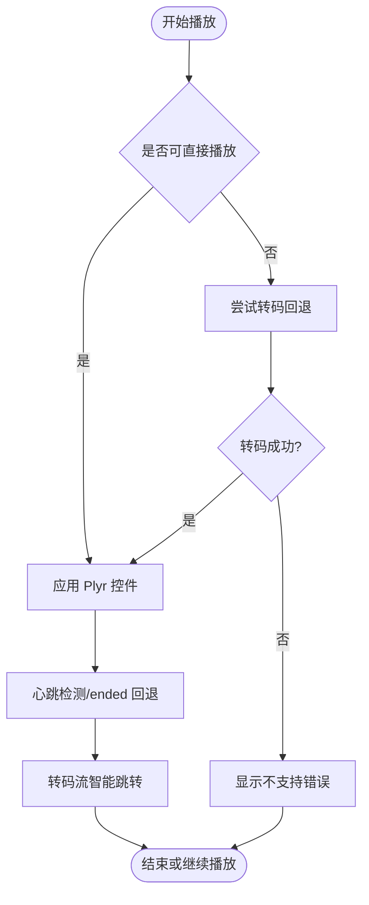
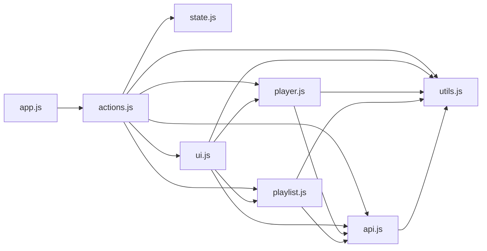

# 单页应用架构

<cite>
**本文档引用的文件**
- [web/index.html](file://web/index.html)
- [web/src/app.js](file://web/src/app.js)
- [web/src/modules/actions.js](file://web/src/modules/actions.js)
- [web/src/modules/state.js](file://web/src/modules/state.js)
- [web/src/modules/ui.js](file://web/src/modules/ui.js)
- [web/src/modules/player.js](file://web/src/modules/player.js)
- [web/src/modules/api.js](file://web/src/modules/api.js)
- [web/src/modules/playlist.js](file://web/src/modules/playlist.js)
- [web/src/modules/utils.js](file://web/src/modules/utils.js)
- [web/vite.config.js](file://web/vite.config.js)
- [web/package.json](file://web/package.json)
- [cmd/msp/main.go](file://cmd/msp/main.go)
- [internal/web/web.go](file://internal/web/web.go)
- [web/embed.go](file://web/embed.go)
</cite>

## 目录
1. [简介](#简介)
2. [项目结构](#项目结构)
3. [核心组件](#核心组件)
4. [架构总览](#架构总览)
5. [详细组件分析](#详细组件分析)
6. [依赖关系分析](#依赖关系分析)
7. [性能考虑](#性能考虑)
8. [故障排除指南](#故障排除指南)
9. [结论](#结论)
10. [附录](#附录)

## 简介
本文件系统性阐述 MSP 项目的单页应用（SPA）架构设计与实现，覆盖 HTML 模板结构、主应用入口、路由机制、组件组织方式、应用初始化流程、Vite 构建配置与优化策略、生命周期管理与最佳实践等内容。目标是帮助开发者快速理解并高效扩展该 SPA 的功能。

## 项目结构
MSP 的前端位于 web 目录，采用模块化组织，核心入口为 index.html，JavaScript 入口为 web/src/app.js，所有业务逻辑按职责拆分为多个模块，如 actions、state、ui、player、playlist、api、utils 等。构建工具使用 Vite，配合 PWA 插件生成可部署产物并提供开发代理与缓存策略。

**图表来源**
- [web/index.html](file://web/index.html#L1-L195)
- [web/src/app.js](file://web/src/app.js#L1-L5)
- [web/src/modules/actions.js](file://web/src/modules/actions.js#L1-L164)
- [web/src/modules/state.js](file://web/src/modules/state.js#L1-L127)
- [web/src/modules/ui.js](file://web/src/modules/ui.js#L1-L417)
- [web/src/modules/player.js](file://web/src/modules/player.js#L1-L800)
- [web/src/modules/playlist.js](file://web/src/modules/playlist.js#L1-L457)
- [web/src/modules/api.js](file://web/src/modules/api.js#L1-L155)
- [web/src/modules/utils.js](file://web/src/modules/utils.js#L1-L124)
- [web/vite.config.js](file://web/vite.config.js#L1-L48)
- [cmd/msp/main.go](file://cmd/msp/main.go#L1-L151)
- [internal/web/web.go](file://internal/web/web.go#L1-L84)
- [web/embed.go](file://web/embed.go#L1-L7)

**章节来源**
- [web/index.html](file://web/index.html#L1-L195)
- [web/src/app.js](file://web/src/app.js#L1-L5)
- [web/vite.config.js](file://web/vite.config.js#L1-L48)
- [cmd/msp/main.go](file://cmd/msp/main.go#L1-L151)
- [internal/web/web.go](file://internal/web/web.go#L1-L84)
- [web/embed.go](file://web/embed.go#L1-L7)

## 核心组件
- 应用入口与初始化
  - HTML 模板定义页面骨架、对话框、媒体容器与脚本加载入口。
  - JavaScript 入口导入样式与 actions，执行启动流程。
- 全局状态与本地存储
  - 统一的 state 对象承载语言、配置、媒体库、播放列表、排序、扫描状态等。
  - 本地存储键值常量集中管理，提供 lsGet/lsSet 辅助。
- UI 与交互
  - 绑定事件、国际化更新、搜索过滤、排序、分页、设置面板、PIN 认证弹窗。
- 媒体播放与播放列表
  - 播放器封装（Plyr）、错误处理、转码回退、智能跳转、心跳检测、音轨/字幕处理。
  - 播放列表构建、随机播放、循环、分页自适应、导航按钮。
- 网络与偏好
  - 统一封装 fetch 请求、重试机制、进度上报、偏好批处理保存。
- 工具与格式化
  - 文件大小/时间格式化、路径解析、MIME 推断、流地址生成。
- 构建与部署
  - Vite 配置 PWA、Workbox 缓存策略、开发代理、输出目录。

**章节来源**
- [web/index.html](file://web/index.html#L1-L195)
- [web/src/app.js](file://web/src/app.js#L1-L5)
- [web/src/modules/state.js](file://web/src/modules/state.js#L1-L127)
- [web/src/modules/ui.js](file://web/src/modules/ui.js#L1-L417)
- [web/src/modules/player.js](file://web/src/modules/player.js#L1-L800)
- [web/src/modules/playlist.js](file://web/src/modules/playlist.js#L1-L457)
- [web/src/modules/api.js](file://web/src/modules/api.js#L1-L155)
- [web/src/modules/utils.js](file://web/src/modules/utils.js#L1-L124)

## 架构总览
MSP 的前端采用“模块化单页应用”架构：HTML 模板作为根节点，JavaScript 模块负责状态管理、UI 渲染、播放控制与网络通信；后端 Go 服务通过嵌入式静态资源提供 SPA，并暴露 /api/* 接口。

**图表来源**
- [web/index.html](file://web/index.html#L1-L195)
- [web/src/app.js](file://web/src/app.js#L1-L5)
- [web/src/modules/actions.js](file://web/src/modules/actions.js#L1-L164)
- [web/src/modules/ui.js](file://web/src/modules/ui.js#L1-L417)
- [web/src/modules/playlist.js](file://web/src/modules/playlist.js#L1-L457)
- [web/src/modules/player.js](file://web/src/modules/player.js#L1-L800)
- [web/src/modules/api.js](file://web/src/modules/api.js#L1-L155)
- [web/src/modules/state.js](file://web/src/modules/state.js#L1-L127)
- [web/src/modules/utils.js](file://web/src/modules/utils.js#L1-L124)
- [cmd/msp/main.go](file://cmd/msp/main.go#L85-L107)
- [internal/web/web.go](file://internal/web/web.go#L14-L32)
- [web/embed.go](file://web/embed.go#L1-L7)
- [web/vite.config.js](file://web/vite.config.js#L1-L48)

## 详细组件分析

### HTML 模板与主入口
- 模板结构
  - 顶部栏包含标题、元信息、语言切换、主题切换、设置与刷新按钮。
  - 侧边栏包含标签页（视频/音频/图片/其他）、搜索输入、排序字段与顺序切换、媒体列表与提示信息。
  - 主区域包含当前预览区（视频/音频/图片）、歌词、播放列表面板。
  - 底部包含版权与链接。
  - 包含 PIN 认证与设置对话框。
  - 引入第三方库（Plyr、拼音检索），以模块方式加载应用入口。
- 主入口
  - 导入样式与 actions，直接调用启动函数，完成初始化流程。

**章节来源**
- [web/index.html](file://web/index.html#L1-L195)
- [web/src/app.js](file://web/src/app.js#L1-L5)

### 应用初始化流程（actions）
- 启动步骤
  - 注册 Service Worker（PWA 自动更新）。
  - 初始化语言与主题。
  - 绑定 UI 事件、全局快捷键、PIN 对话框。
  - 初始 UI 文案更新。
  - 隐藏媒体元素，禁用相关按钮，清空预览文本。
  - 检查是否需要 PIN，若需要则弹窗等待验证。
  - 加载配置与偏好（带重试），快速加载少量媒体项，随后在后台全量加载并轮询扫描状态。
- 关键特性
  - ETag 条件请求与 304 处理，避免重复渲染。
  - 限流与轮询策略，提升首屏体验。
  - 异常捕获与提示，保证健壮性。

**图表来源**
- [web/src/modules/actions.js](file://web/src/modules/actions.js#L93-L163)
- [web/src/modules/state.js](file://web/src/modules/state.js#L1-L127)
- [web/src/modules/ui.js](file://web/src/modules/ui.js#L275-L416)
- [web/src/modules/player.js](file://web/src/modules/player.js#L72-L155)
- [web/src/modules/api.js](file://web/src/modules/api.js#L5-L36)

**章节来源**
- [web/src/modules/actions.js](file://web/src/modules/actions.js#L93-L163)

### 全局状态管理（state）
- 数据模型
  - 语言、配置、媒体库、当前播放项、播放列表、排序、扫描状态、分页参数等。
  - 本地存储键名集中定义，提供安全的读写封装。
- 初始化
  - 从本地存储恢复排序设置。
- 使用场景
  - actions、ui、player、playlist、api 等模块共享状态，保持一致性。

**章节来源**
- [web/src/modules/state.js](file://web/src/modules/state.js#L1-L127)

### UI 组织与交互（ui）
- 功能点
  - 国际化文案与占位符批量更新。
  - 媒体列表渲染（分页、排序、过滤）。
  - 设置面板（分享目录、黑名单、默认标签页、播放器特性开关）。
  - 事件绑定（语言切换、刷新、添加/移除分享、保存黑名单、搜索、排序、标签页切换、播放列表导航）。
- 设计要点
  - 通过 data-i18n 系列属性实现动态文案。
  - 分页组件与列表渲染解耦，便于复用。

**章节来源**
- [web/src/modules/ui.js](file://web/src/modules/ui.js#L1-L417)

### 媒体播放与播放列表（player 与 playlist）
- 播放器
  - 基于 Plyr，适配移动端控件、字幕、音轨、倍速、静音/音量、全屏。
  - 智能错误拦截与转码回退，心跳检测防止卡死。
  - 智能跳转：对转码流进行二次源切换以支持精确跳转。
  - 进度持久化与音量/速率/字幕偏好保存。
- 播放列表
  - 支持按文件夹/共享范围构建，支持随机与循环。
  - 自适应分页：根据容器高度动态计算每页条数。
  - 导航按钮与标签文案随类型变化。

**图表来源**
- [web/src/modules/player.js](file://web/src/modules/player.js#L356-L706)
- [web/src/modules/playlist.js](file://web/src/modules/playlist.js#L238-L325)

**章节来源**
- [web/src/modules/player.js](file://web/src/modules/player.js#L1-L800)
- [web/src/modules/playlist.js](file://web/src/modules/playlist.js#L1-L457)

### 网络与偏好（api）
- 请求封装
  - GET/POST 统一处理响应与错误。
  - 带重试的辅助函数，降低初始加载失败概率。
- 偏好同步
  - 用户偏好优先使用远程配置，本地存储作为后备。
  - 批量保存减少网络往返。
- 媒体探测
  - 通过探针缓存避免重复请求。

**章节来源**
- [web/src/modules/api.js](file://web/src/modules/api.js#L1-L155)

### 工具与格式化（utils）
- 格式化：字节单位、时间本地化。
- 路径与 MIME：绝对路径解析、扩展名到 MIME 映射。
- 流地址：带时间戳与起始偏移参数。

**章节来源**
- [web/src/modules/utils.js](file://web/src/modules/utils.js#L1-L124)

### Vite 构建配置与优化（vite.config.js）
- PWA 与 Workbox
  - 自动更新注册、清单配置、运行时缓存策略（/api/ NetworkOnly）。
- 开发服务器
  - 代理 /api 到后端地址，host 绑定 0.0.0.0。
- 输出
  - 输出目录 dist，清空旧产物。

**章节来源**
- [web/vite.config.js](file://web/vite.config.js#L1-L48)
- [web/package.json](file://web/package.json#L1-L25)

## 依赖关系分析
前端模块之间存在清晰的职责边界与依赖方向：入口模块依赖 actions；actions 依赖 state、ui、player、playlist、api、utils；ui 依赖 state、i18n、playlist、player、utils、api；player 依赖 state、i18n、api、utils、playlist；playlist 依赖 state、i18n、utils、api、player；api 依赖 state、i18n、utils；utils 依赖 state、i18n。

**图表来源**
- [web/src/app.js](file://web/src/app.js#L1-L5)
- [web/src/modules/actions.js](file://web/src/modules/actions.js#L1-L164)
- [web/src/modules/state.js](file://web/src/modules/state.js#L1-L127)
- [web/src/modules/ui.js](file://web/src/modules/ui.js#L1-L417)
- [web/src/modules/player.js](file://web/src/modules/player.js#L1-L800)
- [web/src/modules/playlist.js](file://web/src/modules/playlist.js#L1-L457)
- [web/src/modules/api.js](file://web/src/modules/api.js#L1-L155)
- [web/src/modules/utils.js](file://web/src/modules/utils.js#L1-L124)

**章节来源**
- [web/src/app.js](file://web/src/app.js#L1-L5)
- [web/src/modules/actions.js](file://web/src/modules/actions.js#L1-L164)
- [web/src/modules/ui.js](file://web/src/modules/ui.js#L1-L417)
- [web/src/modules/player.js](file://web/src/modules/player.js#L1-L800)
- [web/src/modules/playlist.js](file://web/src/modules/playlist.js#L1-L457)
- [web/src/modules/api.js](file://web/src/modules/api.js#L1-L155)
- [web/src/modules/utils.js](file://web/src/modules/utils.js#L1-L124)

## 性能考虑
- 首屏优化
  - 快速加载少量媒体项（200），随后后台全量加载并轮询扫描状态，提升感知速度。
  - ETag 条件请求与 304 处理，避免重复渲染。
- 播放体验
  - 智能错误拦截与转码回退，心跳检测与 ended 回退，保障稳定性。
  - 智能跳转与源切换，减少转码流卡顿。
- UI 渲染
  - 列表与播放列表分页自适应，减少 DOM 节点数量。
  - 事件委托与最小化重排，提高交互流畅度。
- 构建与缓存
  - PWA 与 Workbox 缓存策略，区分 API 与静态资源缓存。
  - 开发代理直连后端，避免跨域与中间层开销。

[本节为通用指导，无需特定文件来源]

## 故障排除指南
- 媒体无法播放
  - 检查后端转码配置与权限；查看播放器错误拦截日志；确认转码回退是否生效。
  - 若为转码流，确认智能跳转逻辑是否触发。
- 列表不更新
  - 确认扫描状态轮询是否仍在进行；检查 ETag 是否导致 304。
  - 查看 UI 渲染函数是否被正确调用。
- 偏好未保存
  - 检查批处理保存定时器是否触发；确认网络请求是否被拦截。
- PWA 更新问题
  - 检查 Service Worker 注册与 Workbox 配置；确认清单与缓存策略。

**章节来源**
- [web/src/modules/player.js](file://web/src/modules/player.js#L356-L706)
- [web/src/modules/ui.js](file://web/src/modules/ui.js#L74-L170)
- [web/src/modules/api.js](file://web/src/modules/api.js#L129-L144)
- [web/vite.config.js](file://web/vite.config.js#L7-L33)

## 结论
MSP 的单页应用以模块化为核心，通过清晰的状态管理、完善的 UI/播放器抽象与稳健的网络层，实现了良好的用户体验与可维护性。结合 Vite 与 PWA 的工程化能力，既满足开发效率也兼顾生产环境的性能与可靠性。建议在后续迭代中持续关注首屏体验、播放稳定性与跨设备兼容性。

[本节为总结性内容，无需特定文件来源]

## 附录

### 生命周期管理最佳实践
- 内存管理
  - 播放器销毁与定时器清理，避免内存泄漏。
  - 播放列表重建时及时释放旧对象引用。
- 事件清理
  - 组件卸载时移除事件监听；PWA 注册与更新监听需在合适时机取消。
- 性能监控
  - 通过日志上报与心跳检测识别异常；对关键路径（渲染、网络、播放）埋点统计。

**章节来源**
- [web/src/modules/player.js](file://web/src/modules/player.js#L157-L168)
- [web/src/modules/player.js](file://web/src/modules/player.js#L535-L555)
- [web/src/modules/api.js](file://web/src/modules/api.js#L38-L40)

### 关键架构模式示例（代码片段路径）
- 应用初始化流程
  - [web/src/modules/actions.js](file://web/src/modules/actions.js#L93-L163)
- 媒体列表渲染与分页
  - [web/src/modules/ui.js](file://web/src/modules/ui.js#L74-L170)
- 播放列表构建与随机播放
  - [web/src/modules/playlist.js](file://web/src/modules/playlist.js#L400-L424)
- 播放器错误拦截与转码回退
  - [web/src/modules/player.js](file://web/src/modules/player.js#L363-L439)
- 偏好批处理保存
  - [web/src/modules/api.js](file://web/src/modules/api.js#L129-L144)
- Vite PWA 与代理配置
  - [web/vite.config.js](file://web/vite.config.js#L7-L42)