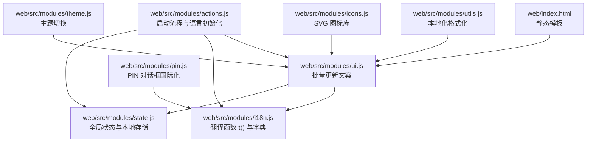
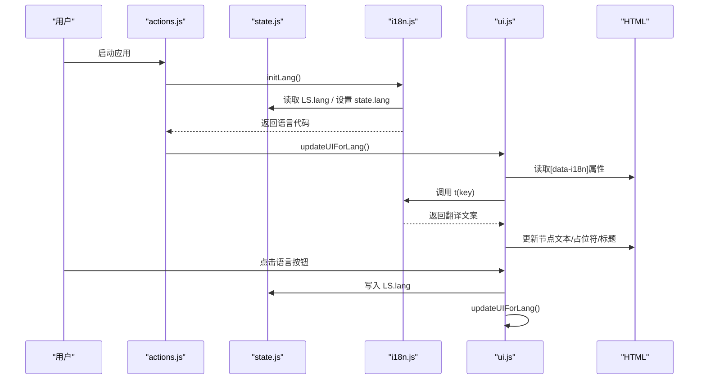
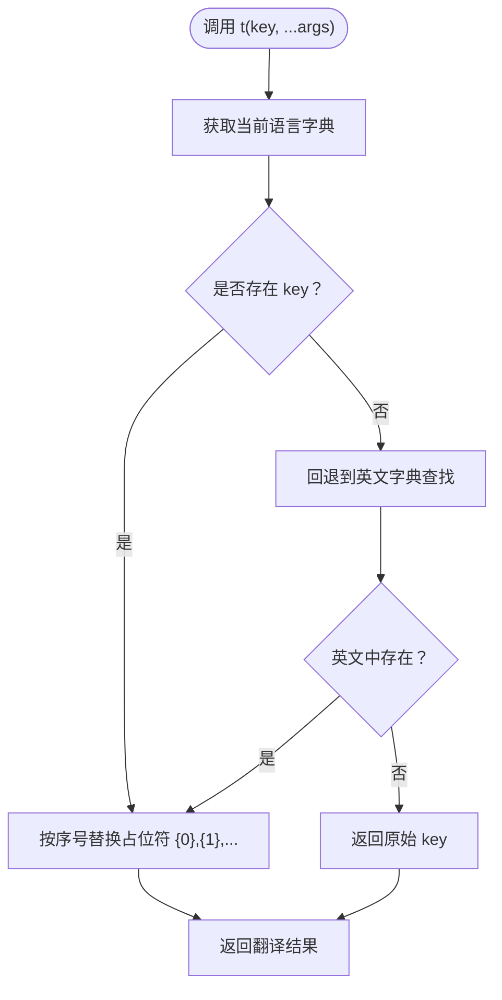
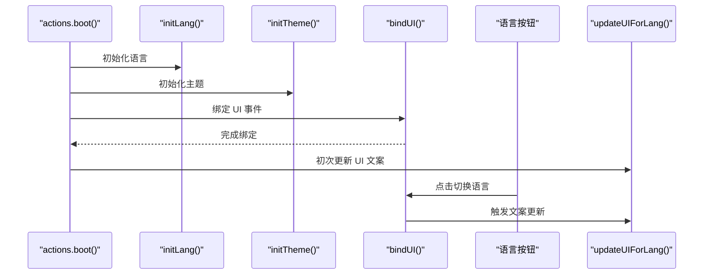

# 国际化支持

<cite>
**本文引用的文件**
- [web/src/modules/i18n.js](file://web/src/modules/i18n.js)
- [web/src/modules/state.js](file://web/src/modules/state.js)
- [web/src/modules/actions.js](file://web/src/modules/actions.js)
- [web/src/modules/ui.js](file://web/src/modules/ui.js)
- [web/src/modules/utils.js](file://web/src/modules/utils.js)
- [web/src/modules/icons.js](file://web/src/modules/icons.js)
- [web/src/modules/theme.js](file://web/src/modules/theme.js)
- [web/src/modules/pin.js](file://web/src/modules/pin.js)
- [web/index.html](file://web/index.html)
- [config.example.json](file://config.example.json)
- [internal/media/scanner.go](file://internal/media/scanner.go)
</cite>

## 目录
1. [简介](#简介)
2. [项目结构](#项目结构)
3. [核心组件](#核心组件)
4. [架构总览](#架构总览)
5. [详细组件分析](#详细组件分析)
6. [依赖关系分析](#依赖关系分析)
7. [性能考量](#性能考量)
8. [故障排查指南](#故障排查指南)
9. [结论](#结论)
10. [附录](#附录)

## 简介
本文件系统性阐述 MSP 项目的国际化支持方案，覆盖多语言文本管理、语言文件组织、动态加载与语言切换流程；解释本地化资源处理（日期/时间、数字、货币等）；描述图标系统与视觉一致性的维护；并提供翻译管理、测试策略与维护流程的最佳实践。

## 项目结构
MSP 的国际化主要集中在前端模块化结构中，采用“键值对字典 + 运行时动态替换”的轻量级实现。核心文件分布如下：
- web/src/modules/i18n.js：定义英文/中文键值对字典与翻译函数
- web/src/modules/state.js：全局状态与本地存储键名
- web/src/modules/actions.js：应用启动、语言初始化与 UI 初次渲染
- web/src/modules/ui.js：静态文案与占位符的批量更新、语言切换绑定
- web/src/modules/utils.js：本地化格式化（时间、字节显示）
- web/src/modules/icons.js：SVG 图标库（太阳/月亮/上下箭头）
- web/src/modules/theme.js：主题切换与图标配色
- web/src/modules/pin.js：PIN 认证对话框的国际化
- web/index.html：HTML 中通过 data-i18n 属性声明静态文案来源
- config.example.json：服务端配置示例（含安全与功能开关）
- internal/media/scanner.go：服务端字幕语言标签映射（补充说明）



图表来源
- [web/index.html](file://web/index.html#L1-L195)
- [web/src/modules/ui.js](file://web/src/modules/ui.js#L1-L417)
- [web/src/modules/i18n.js](file://web/src/modules/i18n.js#L1-L201)
- [web/src/modules/state.js](file://web/src/modules/state.js#L1-L127)
- [web/src/modules/actions.js](file://web/src/modules/actions.js#L1-L164)
- [web/src/modules/utils.js](file://web/src/modules/utils.js#L1-L124)
- [web/src/modules/icons.js](file://web/src/modules/icons.js#L1-L34)
- [web/src/modules/theme.js](file://web/src/modules/theme.js#L1-L67)
- [web/src/modules/pin.js](file://web/src/modules/pin.js#L1-L112)

章节来源
- [web/index.html](file://web/index.html#L1-L195)
- [web/src/modules/i18n.js](file://web/src/modules/i18n.js#L1-L201)
- [web/src/modules/state.js](file://web/src/modules/state.js#L1-L127)
- [web/src/modules/actions.js](file://web/src/modules/actions.js#L1-L164)
- [web/src/modules/ui.js](file://web/src/modules/ui.js#L1-L417)
- [web/src/modules/utils.js](file://web/src/modules/utils.js#L1-L124)
- [web/src/modules/icons.js](file://web/src/modules/icons.js#L1-L34)
- [web/src/modules/theme.js](file://web/src/modules/theme.js#L1-L67)
- [web/src/modules/pin.js](file://web/src/modules/pin.js#L1-L112)

## 核心组件
- 翻译字典与函数
  - 字典结构：I18N 对象包含 en 与 zh 两套键值对，覆盖界面文本、错误提示、PIN 认证等
  - 翻译函数 t(key, ...args)：根据当前语言返回对应文案，支持占位符替换
  - 初始化 initLang()：从本地存储读取语言偏好，默认英文，设置根元素 lang 属性
- 全局状态与本地存储
  - state.lang：当前语言代码
  - LS.lang：本地存储键名
- 启动与语言切换
  - actions.boot()：应用启动时调用 initLang() 并执行 UI 初次渲染
  - ui.updateUIForLang()：批量更新页面静态文案、占位符、标题与平台提示
  - ui.bindUI()：绑定语言按钮事件，切换 state.lang 并持久化
- 本地化资源处理
  - utils.formatTime()：基于当前语言选择区域化时间格式
  - utils.formatBytes()：字节单位显示（本地化单位符号）
- 图标系统
  - icons.createSunIcon()/createMoonIcon()/createArrowUpIcon()/createArrowDownIcon()：纯 SVG 图标，无文字，保证跨语言一致性
  - theme.initTheme()：根据主题切换图标与样式
- PIN 认证国际化
  - pin.showPinDialog()/bindPinDialog()：动态设置对话框标题、说明、占位符与按钮文案

章节来源
- [web/src/modules/i18n.js](file://web/src/modules/i18n.js#L1-L201)
- [web/src/modules/state.js](file://web/src/modules/state.js#L1-L127)
- [web/src/modules/actions.js](file://web/src/modules/actions.js#L1-L164)
- [web/src/modules/ui.js](file://web/src/modules/ui.js#L1-L417)
- [web/src/modules/utils.js](file://web/src/modules/utils.js#L1-L124)
- [web/src/modules/icons.js](file://web/src/modules/icons.js#L1-L34)
- [web/src/modules/theme.js](file://web/src/modules/theme.js#L1-L67)
- [web/src/modules/pin.js](file://web/src/modules/pin.js#L1-L112)

## 架构总览
MSP 的国际化采用“前端纯 JS 字典 + HTML data-i18n 属性”的轻量实现，无需外部 i18n 库，具备以下特点：
- 文案集中管理：所有可本地化的文本统一存放于 i18n.js 字典
- 动态加载：运行时根据 state.lang 选择字典条目
- 批量更新：ui.updateUIForLang() 一次性更新页面静态文案
- 低耦合：各模块仅通过 t() 与 data-i18n 协作



图表来源
- [web/src/modules/actions.js](file://web/src/modules/actions.js#L93-L108)
- [web/src/modules/i18n.js](file://web/src/modules/i18n.js#L194-L200)
- [web/src/modules/ui.js](file://web/src/modules/ui.js#L19-L72)
- [web/src/modules/state.js](file://web/src/modules/state.js#L42-L58)
- [web/index.html](file://web/index.html#L14-L18)

## 详细组件分析

### 翻译字典与函数
- 结构与职责
  - I18N.en/zh：分别包含界面文本、错误消息、PIN 认证等键值
  - t(key, ...args)：优先使用当前语言字典，回退至英文，最后回退为键名本身；支持按序号占位符替换
  - initLang()：从本地存储恢复语言偏好，设置 documentElement.lang，返回语言代码
- 复杂度与性能
  - 字典查找为 O(1)，字符串替换为 O(n)（n 为文案长度），整体开销极低
  - 通过一次性批量更新减少 DOM 操作次数



图表来源
- [web/src/modules/i18n.js](file://web/src/modules/i18n.js#L185-L192)

章节来源
- [web/src/modules/i18n.js](file://web/src/modules/i18n.js#L1-L201)

### 全局状态与本地存储
- 关键点
  - state.lang：应用级语言状态
  - LS.lang：localStorage 键名，用于持久化用户偏好
  - state 初始化与恢复：在 actions.boot() 中完成语言初始化与 UI 更新
- 设计要点
  - 本地存储异常时优雅降级（canStorage/lsGet/lsSet 的容错）
  - 语言切换后立即持久化，避免刷新丢失

章节来源
- [web/src/modules/state.js](file://web/src/modules/state.js#L42-L58)
- [web/src/modules/state.js](file://web/src/modules/state.js#L114-L126)
- [web/src/modules/actions.js](file://web/src/modules/actions.js#L93-L108)

### 启动流程与语言初始化
- 流程
  - actions.boot()：注册 SW、initLang、initTheme、绑定 UI、绑定热键、绑定 PIN 对话框
  - 初次渲染：调用 updateUIForLang()，确保 HTML 中 data-i18n 的静态文案被替换
- 语言切换
  - ui.bindUI() 绑定语言按钮事件：切换 state.lang → 写入 LS.lang → 调用 updateUIForLang()



图表来源
- [web/src/modules/actions.js](file://web/src/modules/actions.js#L93-L108)
- [web/src/modules/ui.js](file://web/src/modules/ui.js#L275-L280)
- [web/src/modules/ui.js](file://web/src/modules/ui.js#L19-L72)

章节来源
- [web/src/modules/actions.js](file://web/src/modules/actions.js#L93-L108)
- [web/src/modules/ui.js](file://web/src/modules/ui.js#L275-L280)

### 静态文案与占位符的批量更新
- 实现方式
  - ui.updateUIForLang() 遍历带 data-i18n/data-i18n-ph/data-i18n-title 的节点，调用 t() 替换文本/占位符/标题
  - 特殊处理：根据平台动态生成共享路径占位符
  - 动态文案：根据当前媒体项动态生成预览副标题
- 性能与一致性
  - 一次遍历完成批量更新，减少多次 DOM 查询
  - 保持与 icons.js 的图标一致性（纯 SVG 无文本）

章节来源
- [web/src/modules/ui.js](file://web/src/modules/ui.js#L19-L72)
- [web/src/modules/ui.js](file://web/src/modules/ui.js#L74-L170)
- [web/src/modules/icons.js](file://web/src/modules/icons.js#L1-L34)

### 本地化资源处理（日期/时间、数字）
- 时间格式
  - utils.formatTime(ts)：根据 state.lang 选择 zh-CN 或 en-US 的本地化时间格式
- 数字与字节
  - utils.formatBytes(n)：按 1024 进制计算，保留一位或整数位，单位数组包含 B/KB/MB/GB/TB
- 货币
  - 当前未实现专用货币格式化函数；如需支持可在工具层新增 formatCurrency(locale, amount) 并在 UI 中调用

章节来源
- [web/src/modules/utils.js](file://web/src/modules/utils.js#L4-L21)

### 图标系统与视觉一致性
- 图标来源
  - icons.createSunIcon()/createMoonIcon()：主题切换图标
  - icons.createArrowUpIcon()/createArrowDownIcon()：排序方向图标
- 一致性保障
  - 所有图标均为 SVG，无文字，跨语言无歧义
  - 主题切换时动态替换图标，配合 CSS 动画过渡

章节来源
- [web/src/modules/icons.js](file://web/src/modules/icons.js#L1-L34)
- [web/src/modules/theme.js](file://web/src/modules/theme.js#L1-L67)

### PIN 认证的国际化
- 实现要点
  - showPinDialog()：设置标题、说明、占位符与按钮文案
  - bindPinDialog()：提交事件中调用 t() 显示错误文案
  - checkPinRequired()：通过 HTTP 状态判断是否需要 PIN
- 用户体验
  - 输入为空时即时反馈错误文案
  - 验证成功后刷新页面进入已认证状态

章节来源
- [web/src/modules/pin.js](file://web/src/modules/pin.js#L5-L30)
- [web/src/modules/pin.js](file://web/src/modules/pin.js#L74-L112)

### 服务端字幕语言标签映射（补充说明）
- 作用
  - internal/media/scanner.go 中的 SubtitleLabel() 将语言代码映射为人类可读标签（如 zh→中文、en→English 等）
- 影响
  - 与前端 UI 的语言切换相互独立，但共同服务于多语言环境下的字幕显示与选择

章节来源
- [internal/media/scanner.go](file://internal/media/scanner.go#L392-L488)

## 依赖关系分析
- 模块内聚与耦合
  - i18n.js 与 state.js：通过 state.lang 与 LS.lang 协作，耦合度低
  - ui.js 与 i18n.js：ui.updateUIForLang() 依赖 t()，形成单向依赖
  - actions.js 与 ui.js：启动阶段调用 ui.updateUIForLang()，形成控制流依赖
  - utils.js 与 i18n.js：formatTime 使用 state.lang，形成弱依赖
  - icons.js 与 theme.js：图标与主题切换协作，无强依赖
- 外部依赖
  - HTML 中 data-i18n 属性作为桥接，降低 JS 与 DOM 的紧耦合

```mermaid
graph LR
I18N["i18n.js"] <- --> STATE["state.js"]
UI["ui.js"] --> I18N
ACTIONS["actions.js"] --> I18N
ACTIONS --> UI
UTILS["utils.js"] --> I18N
ICONS["icons.js"] -.-> THEME["theme.js"]
```

图表来源
- [web/src/modules/i18n.js](file://web/src/modules/i18n.js#L1-L201)
- [web/src/modules/state.js](file://web/src/modules/state.js#L1-L127)
- [web/src/modules/ui.js](file://web/src/modules/ui.js#L1-L417)
- [web/src/modules/actions.js](file://web/src/modules/actions.js#L1-L164)
- [web/src/modules/utils.js](file://web/src/modules/utils.js#L1-L124)
- [web/src/modules/icons.js](file://web/src/modules/icons.js#L1-L34)
- [web/src/modules/theme.js](file://web/src/modules/theme.js#L1-L67)

章节来源
- [web/src/modules/i18n.js](file://web/src/modules/i18n.js#L1-L201)
- [web/src/modules/state.js](file://web/src/modules/state.js#L1-L127)
- [web/src/modules/ui.js](file://web/src/modules/ui.js#L1-L417)
- [web/src/modules/actions.js](file://web/src/modules/actions.js#L1-L164)
- [web/src/modules/utils.js](file://web/src/modules/utils.js#L1-L124)
- [web/src/modules/icons.js](file://web/src/modules/icons.js#L1-L34)
- [web/src/modules/theme.js](file://web/src/modules/theme.js#L1-L67)

## 性能考量
- 字典查找与字符串替换
  - t() 为 O(1) 字典查找 + O(n) 占位符替换，整体开销很小
- DOM 更新策略
  - updateUIForLang() 一次性批量更新，避免频繁查询与写入
- 本地存储
  - 仅在语言切换时写入，频率低，且具备异常容错
- 建议
  - 如需支持更多语言，建议将字典拆分为按功能域分片的模块，结合动态导入按需加载
  - 对高频文案可引入缓存层（如 Map），避免重复 t() 调用

## 故障排查指南
- 语言未生效
  - 检查 state.lang 是否正确写入 LS.lang，确认 actions.boot() 已调用 initLang()
  - 确认 HTML 中 data-i18n 属性是否齐全
- 文案缺失或回退为键名
  - 检查 i18n.js 中对应 key 是否存在，或是否遗漏英文回退
- 时间格式不符合预期
  - 确认 utils.formatTime() 使用的 locale 来自 state.lang
- 图标显示异常
  - 确认 icons.js 的 SVG 未被 CSS 覆盖，主题切换逻辑正常
- PIN 认证文案不显示
  - 检查 pin.showPinDialog() 是否在对话框显示后调用了 t() 设置文案

章节来源
- [web/src/modules/i18n.js](file://web/src/modules/i18n.js#L185-L192)
- [web/src/modules/ui.js](file://web/src/modules/ui.js#L19-L72)
- [web/src/modules/utils.js](file://web/src/modules/utils.js#L16-L21)
- [web/src/modules/pin.js](file://web/src/modules/pin.js#L5-L30)

## 结论
MSP 的国际化方案以“前端纯 JS 字典 + HTML 属性桥接”为核心，实现了简洁、高效、可维护的多语言支持。通过统一的翻译函数与批量更新机制，确保界面文案的一致性与可扩展性。未来可在多语言字典模块化与货币格式化方面进一步增强。

## 附录
- 最佳实践清单
  - 翻译管理
    - 所有可本地化文本集中于 i18n.js，避免硬编码字符串散布各处
    - 新增文案先在英文字典添加，再补充中文翻译
    - 使用 data-i18n 属性标记静态文案，动态文案使用 t() 注入
  - 测试策略
    - 单元测试：针对 t() 的回退逻辑与占位符替换
    - 端到端测试：切换语言后检查所有 data-i18n 节点是否更新
    - 平台差异：验证不同操作系统下的占位符提示
  - 维护流程
    - 评审 PR 时检查新增/修改的文案是否覆盖双语
    - 发布前执行“语言切换回归测试”
    - 对高频文案建立缓存或模块化加载策略