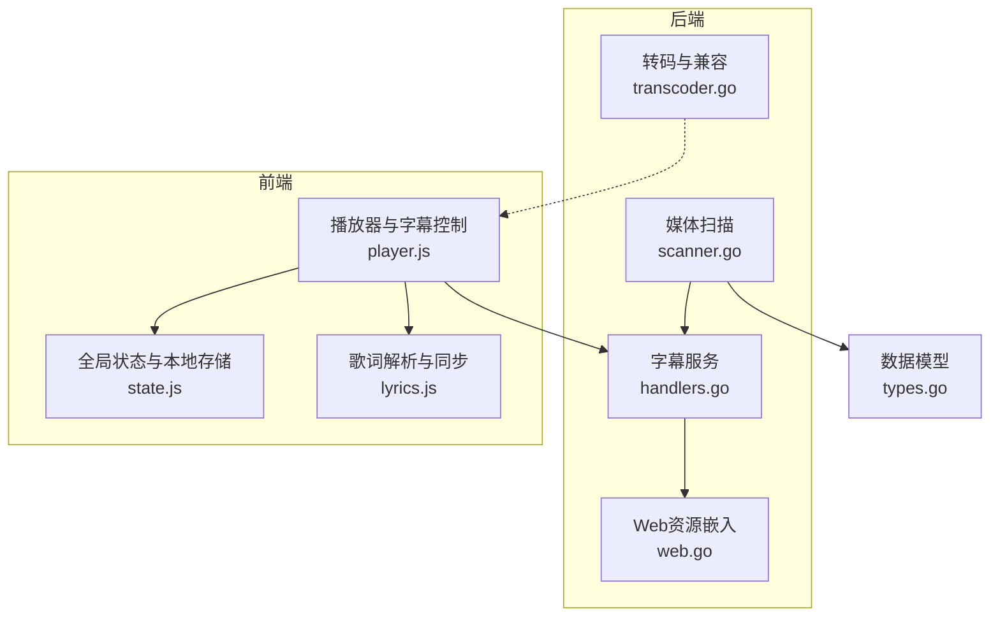
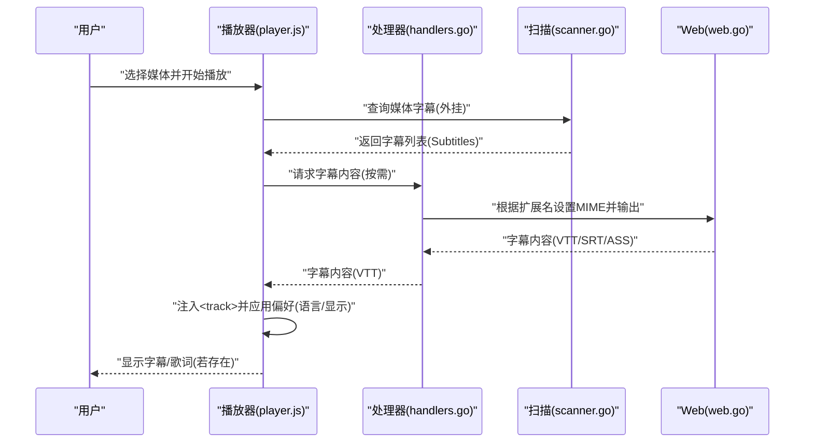
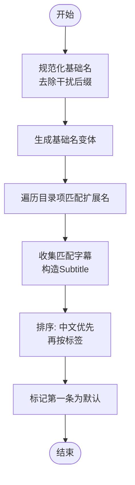
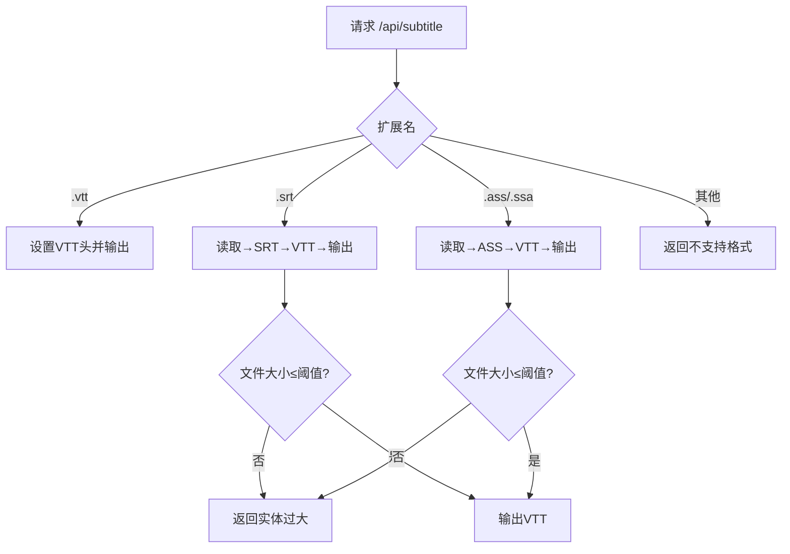
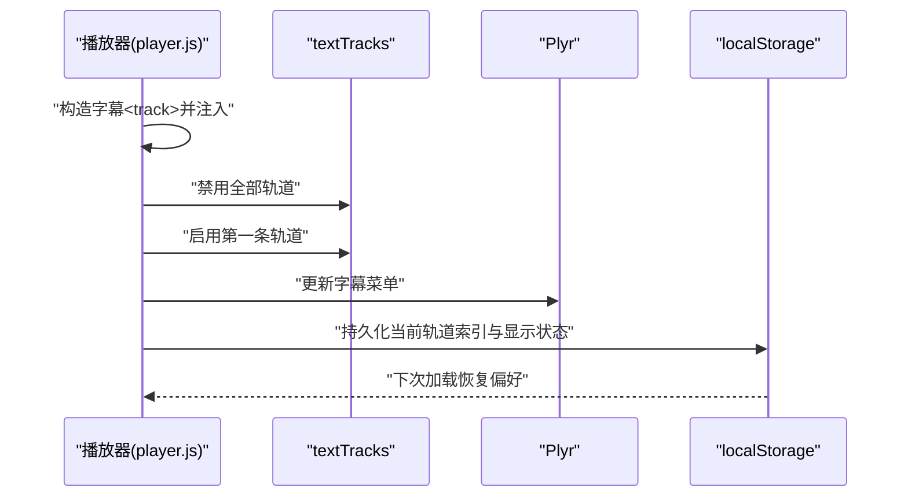
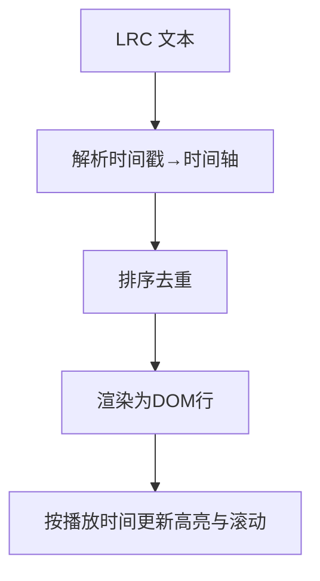

# 字幕支持

<cite>
**本文引用的文件**
- [internal/media/scanner.go](file://internal/media/scanner.go)
- [internal/media/transcoder.go](file://internal/media/transcoder.go)
- [internal/handler/handlers.go](file://internal/handler/handlers.go)
- [internal/web/web.go](file://internal/web/web.go)
- [internal/times/types.go](file://internal/types/types.go)
- [web/src/modules/player.js](file://web/src/modules/player.js)
- [web/src/modules/lyrics.js](file://web/src/modules/lyrics.js)
- [web/src/modules/state.js](file://web/src/modules/state.js)
- [internal/constants/constants.go](file://internal/constants/constants.go)
</cite>

## 目录
1. [简介](#简介)
2. [项目结构](#项目结构)
3. [核心组件](#核心组件)
4. [架构总览](#架构总览)
5. [详细组件分析](#详细组件分析)
6. [依赖关系分析](#依赖关系分析)
7. [性能考量](#性能考量)
8. [故障排除指南](#故障排除指南)
9. [结论](#结论)
10. [附录](#附录)

## 简介
本文件系统化阐述 MSP 项目的字幕支持能力，覆盖外挂字幕的发现与加载、内封字幕的检测与切换、字幕轨道管理与持久化、字幕显示控制（语言选择、样式与位置）、以及与歌词系统的集成（LRC 解析与同步）。同时给出配置项、兼容性处理与常见问题排查建议。

## 项目结构
围绕字幕功能的关键模块分布如下：
- 后端扫描与服务
  - 媒体扫描与字幕发现：internal/media/scanner.go
  - 字幕格式转换与输出：internal/handler/handlers.go
  - Web 资源嵌入与 MIME 处理：internal/web/web.go
  - 转码与兼容播放：internal/media/transcoder.go
- 前端播放与字幕控制
  - 播放器初始化与字幕轨道注入：web/src/modules/player.js
  - 歌词解析与同步：web/src/modules/lyrics.js
  - 全局状态与本地存储键：web/src/modules/state.js
- 数据模型与常量
  - 字幕数据结构：internal/types/types.go
  - 应用常量（含错误消息等）：internal/constants/constants.go

**图表来源**
- [internal/media/scanner.go](file://internal/media/scanner.go#L255-L446)
- [internal/handler/handlers.go](file://internal/handler/handlers.go#L623-L684)
- [internal/web/web.go](file://internal/web/web.go#L14-L58)
- [internal/media/transcoder.go](file://internal/media/transcoder.go#L138-L200)
- [web/src/modules/player.js](file://web/src/modules/player.js#L588-L705)
- [web/src/modules/lyrics.js](file://web/src/modules/lyrics.js#L1-L74)
- [web/src/modules/state.js](file://web/src/modules/state.js#L42-L93)
- [internal/types/types.go](file://internal/types/types.go#L8-L32)

**章节来源**
- [internal/media/scanner.go](file://internal/media/scanner.go#L255-L446)
- [internal/handler/handlers.go](file://internal/handler/handlers.go#L623-L684)
- [internal/web/web.go](file://internal/web/web.go#L14-L58)
- [internal/media/transcoder.go](file://internal/media/transcoder.go#L138-L200)
- [web/src/modules/player.js](file://web/src/modules/player.js#L588-L705)
- [web/src/modules/lyrics.js](file://web/src/modules/lyrics.js#L1-L74)
- [web/src/modules/state.js](file://web/src/modules/state.js#L42-L93)
- [internal/types/types.go](file://internal/types/types.go#L8-L32)

## 核心组件
- 外挂字幕发现与排序
  - 基于媒体文件名的规范化匹配，识别同目录下符合命名约定的 .vtt/.srt/.ass/.ssa 字幕。
  - 自动将中文字幕置前，其余按标签排序；首个字幕标记为默认。
- 字幕服务端路由
  - 统一入口 /api/subtitle 支持 .vtt/.srt/.ass/.ssa；.srt/.ass 会被转换为 VTT 输出。
  - 限制单次字幕文件大小，防止过大文件导致内存压力。
- 前端播放器注入与控制
  - 构造 HTML5 <track> 字幕轨道，自动禁用所有轨道并默认显示第一个。
  - 通过 Plyr 控件与 textTracks API 实现字幕语言切换、显示/隐藏与持久化。
- 歌词系统集成
  - LRC 歌词解析与逐行高亮滚动，与播放进度联动。
- 转码与兼容播放
  - 对部分容器或编码存在兼容性问题的媒体，提供“转码”回退路径，确保可播放与可跳转。

**章节来源**
- [internal/media/scanner.go](file://internal/media/scanner.go#L255-L446)
- [internal/handler/handlers.go](file://internal/handler/handlers.go#L623-L684)
- [web/src/modules/player.js](file://web/src/modules/player.js#L588-L705)
- [web/src/modules/lyrics.js](file://web/src/modules/lyrics.js#L1-L74)
- [internal/media/transcoder.go](file://internal/media/transcoder.go#L138-L200)

## 架构总览
下面以序列图展示一次典型播放流程中的字幕加载与显示过程：

**图表来源**
- [web/src/modules/player.js](file://web/src/modules/player.js#L588-L705)
- [internal/handler/handlers.go](file://internal/handler/handlers.go#L623-L684)
- [internal/web/web.go](file://internal/web/web.go#L14-L58)
- [internal/media/scanner.go](file://internal/media/scanner.go#L255-L446)

## 详细组件分析

### 外挂字幕发现与排序
- 关键点
  - 通过提取视频文件名基础名并进行“规范化”，去除分辨率、编码、发布组等干扰后缀，提升匹配成功率。
  - 支持多种扩展名：.vtt/.srt/.ass/.ssa；当扩展名为 .srt/.ass/.ssa 时，前端直接指向 /api/subtitle 路由。
  - 语言标签映射：将常见语言代码映射为本地化显示标签（如 zh → 中文）。
  - 排序策略：中文字幕优先，其他按标签字母序；首条字幕标记为默认。
- 复杂度
  - 单媒体目录读取一次，O(n) 遍历目录项；排序 O(k log k)，k 为候选字幕数量。

**图表来源**
- [internal/media/scanner.go](file://internal/media/scanner.go#L287-L399)

**章节来源**
- [internal/media/scanner.go](file://internal/media/scanner.go#L255-L446)

### 字幕服务端路由与格式转换
- 关键点
  - 统一入口：/api/subtitle，按扩展名分派到对应处理器。
  - .vtt：直接输出，设置文本类型与缓存头。
  - .srt：读取后转换为 VTT，再输出。
  - .ass/.ssa：读取后转换为 VTT，再输出。
  - 大小限制：超过阈值拒绝转换，避免内存压力。
- 错误处理
  - 不支持格式返回错误；读取失败返回内部错误；过大文件返回实体过大。

**图表来源**
- [internal/handler/handlers.go](file://internal/handler/handlers.go#L623-L684)
- [internal/web/web.go](file://internal/web/web.go#L34-L58)

**章节来源**
- [internal/handler/handlers.go](file://internal/handler/handlers.go#L623-L684)
- [internal/web/web.go](file://internal/web/web.go#L34-L58)
- [internal/constants/constants.go](file://internal/constants/constants.go#L97-L115)

### 前端播放器与字幕轨道管理
- 关键点
  - 注入 <track>：根据媒体的字幕列表动态创建轨道，设置 srclang、label、src、default。
  - 默认行为：注入后立即禁用所有轨道，将第一条设为显示。
  - 用户偏好持久化：记录当前选中的轨道索引与显示状态，按媒体 ID 为维度区分存储。
  - 与 Plyr 集成：启用 captions 控件与设置菜单，允许用户在可用轨道间切换。
  - 内封字幕检测：监听 loadedmetadata，打印 textTracks 信息并尝试刷新 Plyr 字幕菜单。
  - 音轨检测：对多音轨场景，保存并恢复用户选择。
- 复杂度
  - 注入与切换为 O(k)，k 为轨道数；持久化为定时器周期性写入，开销低。

**图表来源**
- [web/src/modules/player.js](file://web/src/modules/player.js#L588-L705)
- [web/src/modules/state.js](file://web/src/modules/state.js#L42-L93)

**章节来源**
- [web/src/modules/player.js](file://web/src/modules/player.js#L588-L705)
- [web/src/modules/state.js](file://web/src/modules/state.js#L42-L93)

### 歌词系统与 LRC 集成
- 关键点
  - LRC 解析：按时间戳片段提取，统一为秒级时间轴，去重并排序。
  - 渲染：将歌词行渲染为 DOM 片段，支持空状态提示。
  - 同步：基于播放时间定位当前活动行，高亮并平滑滚动至可视区域。
- 适用范围
  - 音频媒体的歌词文件（.lrc）与字幕不同源，但共享 UI 区域，便于用户在同一界面体验字幕与歌词。

**图表来源**
- [web/src/modules/lyrics.js](file://web/src/modules/lyrics.js#L8-L73)

**章节来源**
- [web/src/modules/lyrics.js](file://web/src/modules/lyrics.js#L1-L74)

### 转码与兼容播放
- 关键点
  - 当检测到某些容器或编码存在兼容性问题时，自动回退到“转码”播放路径，保证可播放与可跳转。
  - 转码参数白名单与并发限制，避免资源耗尽。
  - 智能转码：根据输入编码选择 copy 或转码策略，兼顾质量与性能。
- 与字幕的关系
  - 转码流支持标准 seek，配合前端“智能跳转”逻辑，确保字幕与画面同步。

**章节来源**
- [internal/media/transcoder.go](file://internal/media/transcoder.go#L138-L200)
- [web/src/modules/player.js](file://web/src/modules/player.js#L556-L624)

## 依赖关系分析
- 数据模型
  - Subtitle 结构承载字幕 ID、标签、语言与源地址；MediaItem 中包含字幕数组。
- 扫描到服务端
  - 扫描器将外挂字幕信息注入到媒体项；前端据此构造 <track>。
- 服务端到前端
  - 字幕路由按扩展名输出对应格式；前端统一以 VTT 形式消费。
- 前端到用户
  - 通过 Plyr 控件与 textTracks API 实现字幕语言选择、显示/隐藏与持久化。

**图表来源**
- [internal/types/types.go](file://internal/types/types.go#L8-L32)
- [internal/media/scanner.go](file://internal/media/scanner.go#L255-L446)
- [internal/handler/handlers.go](file://internal/handler/handlers.go#L623-L684)
- [web/src/modules/player.js](file://web/src/modules/player.js#L588-L705)

**章节来源**
- [internal/types/types.go](file://internal/types/types.go#L8-L32)
- [internal/media/scanner.go](file://internal/media/scanner.go#L255-L446)
- [internal/handler/handlers.go](file://internal/handler/handlers.go#L623-L684)
- [web/src/modules/player.js](file://web/src/modules/player.js#L588-L705)

## 性能考量
- 字幕文件大小限制：避免大体积字幕导致内存峰值与转换延迟。
- 目录扫描缓存：扫描器对同一目录读取结果进行缓存，减少重复 IO。
- 转码并发限制：全局信号量限制并发转码任务，防止 CPU 与内存过载。
- 前端持久化频率：字幕轨道与显示状态定期写入本地存储，降低频繁访问成本。
- 智能转码：仅在必要时触发转码，优先 copy，减少额外处理开销。

**章节来源**
- [internal/handler/handlers.go](file://internal/handler/handlers.go#L33-L36)
- [internal/media/scanner.go](file://internal/media/scanner.go#L264-L285)
- [internal/media/transcoder.go](file://internal/media/transcoder.go#L15-L17)
- [web/src/modules/player.js](file://web/src/modules/player.js#L687-L699)

## 故障排除指南
- 无法显示字幕
  - 检查外挂字幕命名是否与媒体文件一致（含语言后缀），确认扩展名正确。
  - 确认字幕文件大小未超过服务端阈值。
  - 若为 MKV 内封字幕，浏览器支持有限，建议使用外挂 .vtt/.srt 并确保已注入到 <track>。
- 字幕语言不正确
  - 确认字幕文件名语言后缀（如 .chi、.eng）被正确识别；查看标签映射是否生效。
  - 前端偏好会持久化当前轨道索引与显示状态，可在设置中重置。
- 歌词不显示
  - 确认音频媒体存在对应的 .lrc 文件，且文件名与音频匹配。
  - 检查歌词时间戳格式是否规范，解析后应有序排列。
- 播放卡顿或无法跳转
  - 后端会自动尝试转码回退；若仍失败，检查转码工具可用性与并发限制。
  - 智能跳转仅在转码流有效，非转码流的标准 seek 可能失效。

**章节来源**
- [internal/handler/handlers.go](file://internal/handler/handlers.go#L623-L684)
- [internal/media/scanner.go](file://internal/media/scanner.go#L255-L446)
- [web/src/modules/player.js](file://web/src/modules/player.js#L556-L624)
- [web/src/modules/lyrics.js](file://web/src/modules/lyrics.js#L1-L74)

## 结论
MSP 的字幕支持以“外挂字幕优先、内封字幕补充”的策略实现，结合服务端格式转换与前端 Plyr 控件，提供了稳定、可定制的字幕体验。与歌词系统的集成进一步丰富了音频媒体的展示能力。通过大小限制、目录缓存、并发控制与智能转码，系统在易用性与性能之间取得平衡。

## 附录
- 配置项与偏好键
  - 字幕轨道索引与显示状态：msp.subTrack.{mediaId}/msp.subTrack；msp.subActive.{mediaId}/msp.subActive
  - 音轨选择：msp.audioTrack.{mediaId}
  - 其他播放偏好：msp.volume、msp.muted、msp.rate 等
- 常用 MIME 与扩展名
  - .vtt → text/vtt；.srt/.lrc → text/plain
- 错误码参考
  - 不支持格式、读取失败、实体过大、方法不允许等

**章节来源**
- [web/src/modules/state.js](file://web/src/modules/state.js#L42-L93)
- [internal/web/web.go](file://internal/web/web.go#L34-L58)
- [internal/constants/constants.go](file://internal/constants/constants.go#L97-L115)