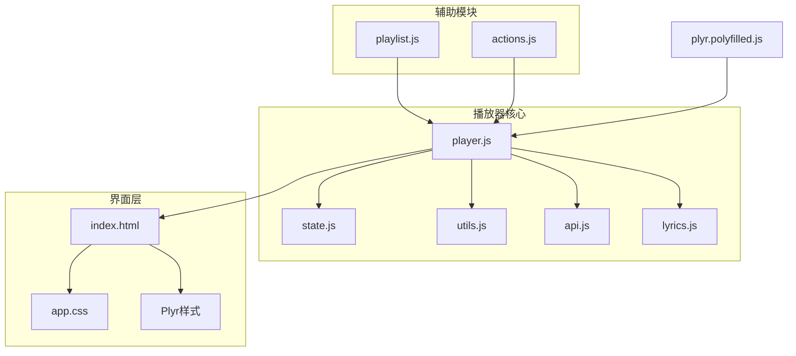
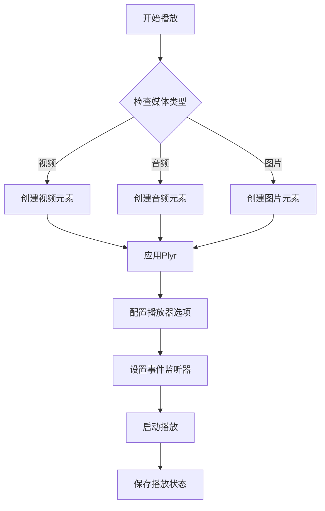
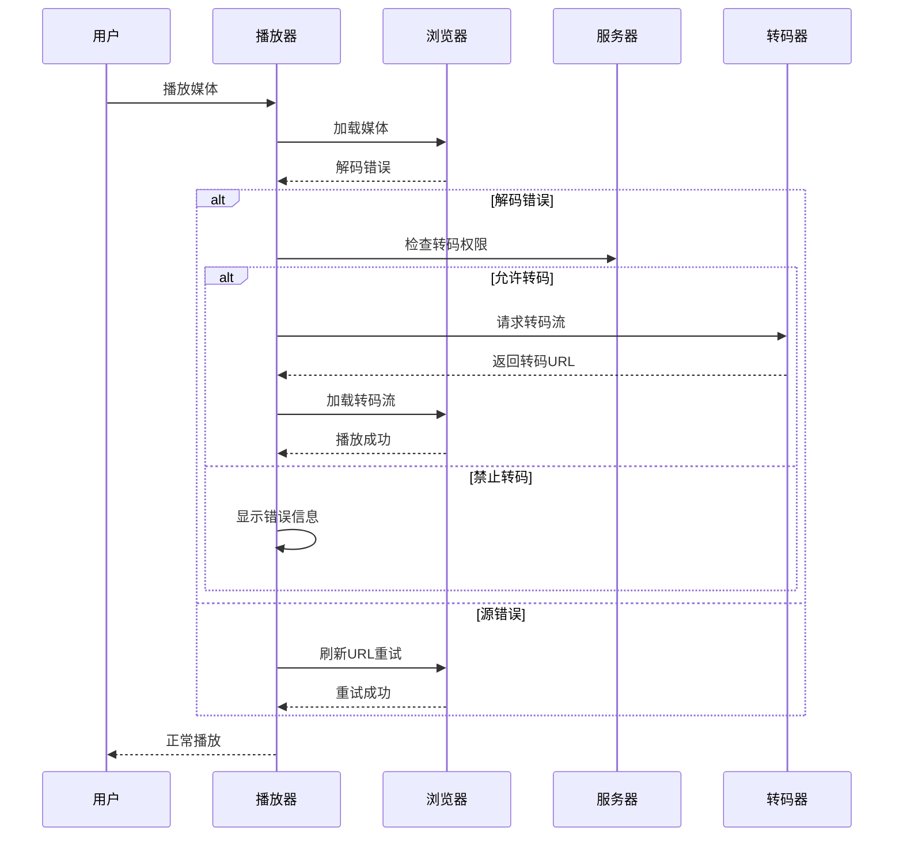
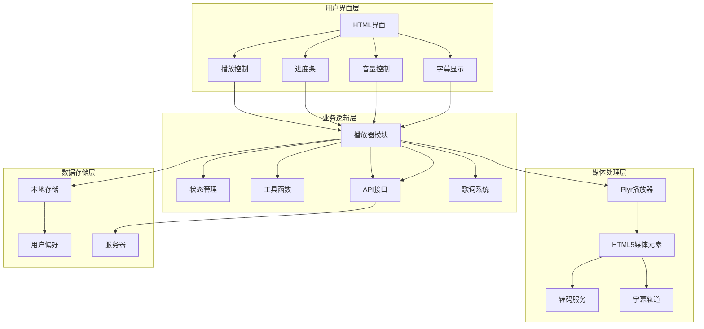
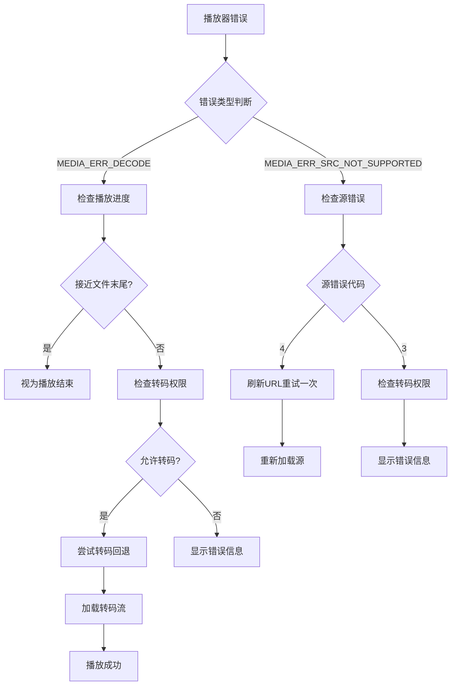
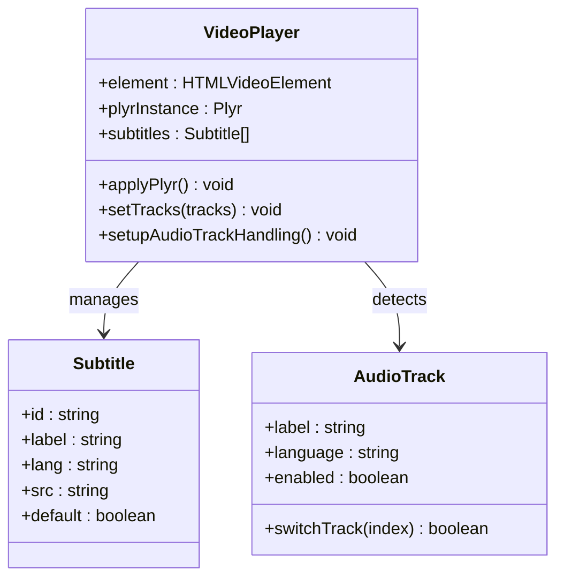
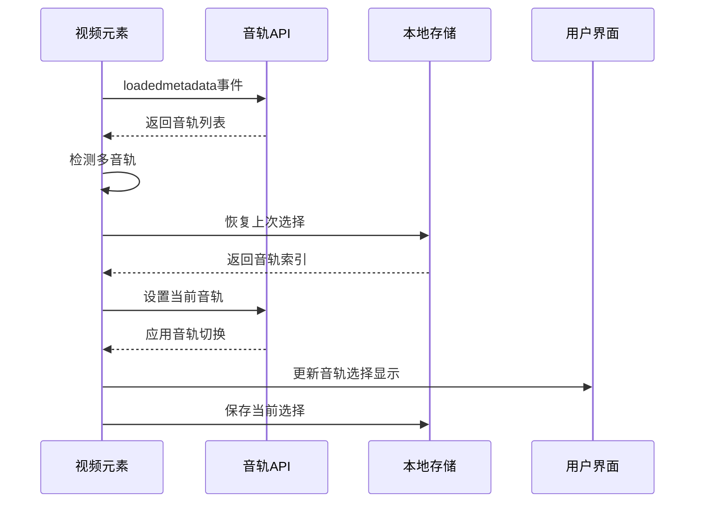
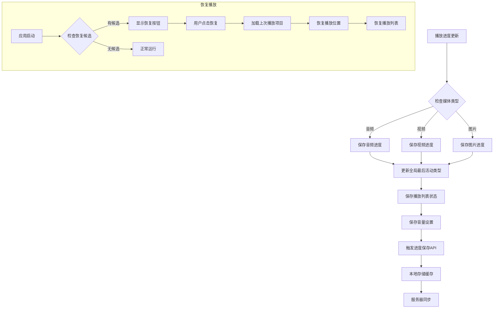
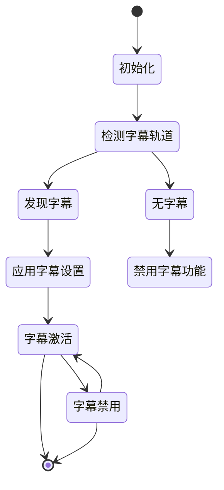
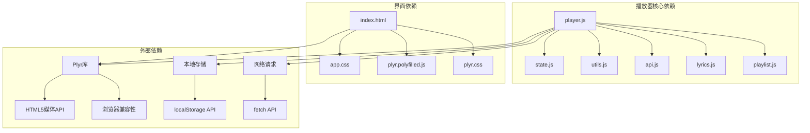

# 播放器集成

<cite>
**本文档引用的文件**
- [web/index.html](file://web/index.html)
- [web/src/modules/player.js](file://web/src/modules/player.js)
- [web/src/modules/state.js](file://web/src/modules/state.js)
- [web/src/modules/utils.js](file://web/src/modules/utils.js)
- [web/src/modules/api.js](file://web/src/modules/api.js)
- [web/src/modules/playlist.js](file://web/src/modules/playlist.js)
- [web/src/modules/actions.js](file://web/src/modules/actions.js)
- [web/src/modules/lyrics.js](file://web/src/modules/lyrics.js)
- [web/public/assets/plyr/plyr.css](file://web/public/assets/plyr/plyr.css)
- [web/public/assets/plyr/plyr.polyfilled.js](file://web/public/assets/plyr/plyr.polyfilled.js)
- [web/src/app.css](file://web/src/app.css)
</cite>

## 目录
1. [简介](#简介)
2. [项目结构](#项目结构)
3. [核心组件](#核心组件)
4. [架构概览](#架构概览)
5. [详细组件分析](#详细组件分析)
6. [依赖关系分析](#依赖关系分析)
7. [性能考虑](#性能考虑)
8. [故障排除指南](#故障排除指南)
9. [结论](#结论)

## 简介

MSP项目中的播放器集成为整个媒体播放系统的核心，基于Plyr播放器库实现了完整的视频和音频播放功能。该集成不仅提供了基础的播放控制，还包括了智能错误处理、转码回退、进度跟踪、字幕支持等高级功能。

播放器集成的主要特点包括：
- 支持视频和音频两种媒体类型的播放
- 智能错误处理和转码回退机制
- 进度保存和恢复功能
- 字幕支持和语言切换
- 响应式设计和主题适配
- 高级播放控制功能

## 项目结构

播放器相关的代码主要分布在以下目录和文件中：



**图表来源**
- [web/src/modules/player.js](file://web/src/modules/player.js#L1-L50)
- [web/index.html](file://web/index.html#L79-L96)
- [web/public/assets/plyr/plyr.css](file://web/public/assets/plyr/plyr.css#L1-L50)

**章节来源**
- [web/src/modules/player.js](file://web/src/modules/player.js#L1-L100)
- [web/index.html](file://web/index.html#L1-L195)

## 核心组件

### 播放器初始化系统

播放器初始化是整个播放系统的基础，负责创建和配置Plyr实例。



**图表来源**
- [web/src/modules/player.js](file://web/src/modules/player.js#L829-L1191)

### 错误处理和转码机制

系统实现了智能的错误处理和转码回退机制：



**图表来源**
- [web/src/modules/player.js](file://web/src/modules/player.js#L365-L442)

**章节来源**
- [web/src/modules/player.js](file://web/src/modules/player.js#L356-L630)

## 架构概览

播放器系统的整体架构采用模块化设计，各个组件职责明确：



**图表来源**
- [web/src/modules/player.js](file://web/src/modules/player.js#L1-L50)
- [web/src/modules/state.js](file://web/src/modules/state.js#L61-L93)

## 详细组件分析

### 播放器初始化流程

播放器初始化过程包含多个关键步骤：

#### 基础播放器配置
播放器使用统一的配置选项，确保视频和音频播放器的一致性：

| 配置项 | 视频播放器 | 音频播放器 | 说明 |
|--------|------------|------------|------|
| controls | play-large, play, progress, current-time, duration, mute, volume, captions, settings, fullscreen | play, progress, current-time, duration, mute, volume, settings | 控制按钮配置 |
| captions | active: true, update: true, language: "auto" | 无 | 字幕功能启用 |
| settings | captions, quality, speed, loop | quality, speed, loop | 设置菜单项 |
| fullscreen | enabled: true, fallback: true | 无 | 全屏模式支持 |
| storage | enabled: true | 无 | 播放状态持久化 |

#### 智能错误拦截机制
播放器实现了多层次的错误处理：



**图表来源**
- [web/src/modules/player.js](file://web/src/modules/player.js#L365-L442)

**章节来源**
- [web/src/modules/player.js](file://web/src/modules/player.js#L486-L520)

### 视频播放器实现

视频播放器具有完整的功能集，包括字幕支持和高级控制：

#### 字幕系统
字幕系统支持多种格式和语言：



**图表来源**
- [web/src/modules/player.js](file://web/src/modules/player.js#L228-L255)
- [web/src/modules/player.js](file://web/src/modules/player.js#L708-L795)

#### 全屏模式处理
全屏模式提供了沉浸式观看体验：

| 模式 | 行为 | 触发条件 |
|------|------|----------|
| 标准全屏 | 使用浏览器原生全屏API | 用户点击全屏按钮 |
| 回退全屏 | 使用CSS类切换实现 | 浏览器不支持原生全屏 |
| 自适应填充 | 根据内容比例调整显示 | 全屏状态切换 |
| iOS原生全屏 | 使用webkitEnterFullscreen | 移动设备iOS环境 |

**章节来源**
- [web/src/modules/player.js](file://web/src/modules/player.js#L632-L647)

### 音频播放器实现

音频播放器专注于音乐播放体验：

#### 音频轨道检测
系统能够自动检测和切换多音轨：



**图表来源**
- [web/src/modules/player.js](file://web/src/modules/player.js#L708-L795)

#### 歌词同步显示
歌词系统提供实时同步显示：

| 功能 | 实现方式 | 性能特性 |
|------|----------|----------|
| LRC格式解析 | 正则表达式匹配时间戳 | O(n)时间复杂度 |
| 实时滚动 | CSS transform动画 | GPU加速渲染 |
| 活跃状态高亮 | CSS类切换 | 即时响应 |
| 平滑滚动 | requestAnimationFrame优化 | 流畅体验 |

**章节来源**
- [web/src/modules/lyrics.js](file://web/src/modules/lyrics.js#L1-L74)

### 播放进度跟踪系统

进度跟踪系统实现了完整的播放历史记录功能：



**图表来源**
- [web/src/modules/player.js](file://web/src/modules/player.js#L15-L50)
- [web/src/modules/player.js](file://web/src/modules/player.js#L72-L155)

**章节来源**
- [web/src/modules/player.js](file://web/src/modules/player.js#L15-L155)

### 字幕支持机制

字幕系统提供了完整的多语言字幕支持：

#### 字幕文件解析
系统支持多种字幕格式的自动解析：

| 格式 | 特征 | 解析方式 |
|------|------|----------|
| LRC | 时间戳格式 [mm:ss.xx] | 正则表达式匹配 |
| ASS/SSA | 复杂样式标记 | 文本预处理 |
| VTT | WebVTT标准 | 原生HTML5支持 |
| SRT | 简单文本格式 | 分行解析 |

#### 字幕显示控制
字幕显示系统具有智能的显示控制逻辑：



**图表来源**
- [web/src/modules/player.js](file://web/src/modules/player.js#L228-L255)

**章节来源**
- [web/src/modules/player.js](file://web/src/modules/player.js#L228-L255)

### 播放器自定义样式

播放器样式系统采用了现代化的设计理念：

#### 主题系统
播放器支持深色和浅色两种主题模式：

```css
:root {
  --plyr-color-main: var(--md-primary);
  --plyr-video-control-color: #ffffff;
  --plyr-video-control-color-hover: #ffffff;
  --plyr-video-controls-background: linear-gradient(to top, rgba(0, 0, 0, 0.85), rgba(0, 0, 0, 0));
}

[data-theme="dark"] {
  --plyr-color-main: var(--md-primary);
  --plyr-menu-background: var(--md-bg);
  --plyr-menu-color: var(--md-text);
  --plyr-tooltip-background: var(--md-text);
  --plyr-tooltip-color: var(--md-bg);
}
```

#### 响应式设计
播放器在不同设备上提供优化的用户体验：

| 设备类型 | 屏幕宽度 | 布局调整 | 功能优化 |
|----------|----------|----------|----------|
| 桌面端 | > 980px | 标准布局 | 完整功能 |
| 平板端 | 640px-980px | 侧边栏折叠 | 功能简化 |
| 移动端 | < 640px | 单列布局 | 触摸优化 |

**章节来源**
- [web/src/app.css](file://web/src/app.css#L690-L701)
- [web/src/app.css](file://web/src/app.css#L798-L800)

## 依赖关系分析

播放器系统的依赖关系清晰且模块化：



**图表来源**
- [web/src/modules/player.js](file://web/src/modules/player.js#L1-L10)
- [web/index.html](file://web/index.html#L8-L9)

**章节来源**
- [web/src/modules/player.js](file://web/src/modules/player.js#L1-L10)
- [web/src/modules/state.js](file://web/src/modules/state.js#L1-L50)

## 性能考虑

播放器系统在性能方面采用了多项优化策略：

### 内存管理
- 播放器实例销毁时清理所有事件监听器
- 及时释放媒体资源和字节缓冲区
- 避免内存泄漏的闭包引用清理

### 渲染优化
- 使用CSS transform进行动画，避免重排
- requestAnimationFrame优化滚动和动画
- GPU加速的滤镜效果应用

### 网络优化
- 智能的转码回退机制减少不必要的请求
- 播放进度批量保存减少API调用
- 缓存策略优化频繁访问的数据

## 故障排除指南

### 常见问题诊断

#### 播放器无法初始化
**症状**: 播放器按钮不可用或出现错误提示

**排查步骤**:
1. 检查浏览器控制台是否有JavaScript错误
2. 验证Plyr库文件是否正确加载
3. 确认媒体元素的DOM结构完整
4. 检查网络连接和服务器状态

#### 字幕显示异常
**症状**: 字幕不显示或显示错乱

**排查步骤**:
1. 验证字幕文件格式是否受支持
2. 检查字幕语言设置是否正确
3. 确认字幕轨道是否被浏览器识别
4. 尝试刷新页面重新加载字幕

#### 进度保存失败
**症状**: 播放进度无法恢复

**排查步骤**:
1. 检查浏览器是否支持localStorage
2. 验证服务器API是否正常工作
3. 确认用户权限设置
4. 清除浏览器缓存后重试

**章节来源**
- [web/src/modules/player.js](file://web/src/modules/player.js#L365-L442)
- [web/src/modules/api.js](file://web/src/modules/api.js#L95-L108)

## 结论

MSP项目的播放器集成为现代Web媒体播放提供了完整的解决方案。通过精心设计的架构和丰富的功能特性，系统实现了：

**技术优势**:
- 基于Plyr的成熟播放器框架，稳定可靠
- 智能的错误处理和转码回退机制
- 完整的进度跟踪和恢复功能
- 丰富的字幕支持和语言切换
- 响应式设计和主题适配

**用户体验**:
- 直观的播放控制界面
- 流畅的播放体验
- 沉浸式的观看环境
- 个性化的播放设置

**扩展性**:
- 模块化的代码结构便于维护
- 插件化的功能扩展能力
- 良好的性能优化策略
- 完善的错误处理机制

该播放器集成系统为MSP项目提供了坚实的技术基础，能够满足各种媒体播放场景的需求，并为未来的功能扩展奠定了良好的基础。