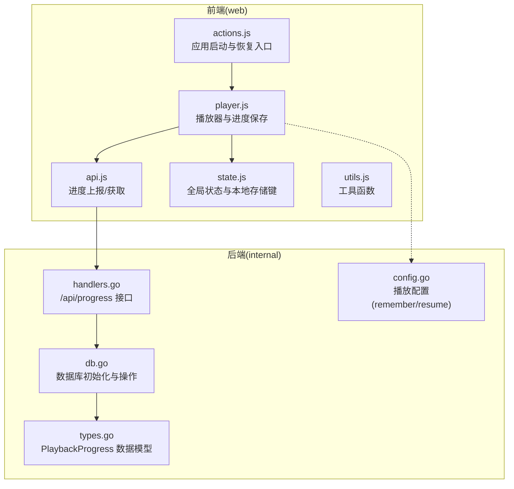
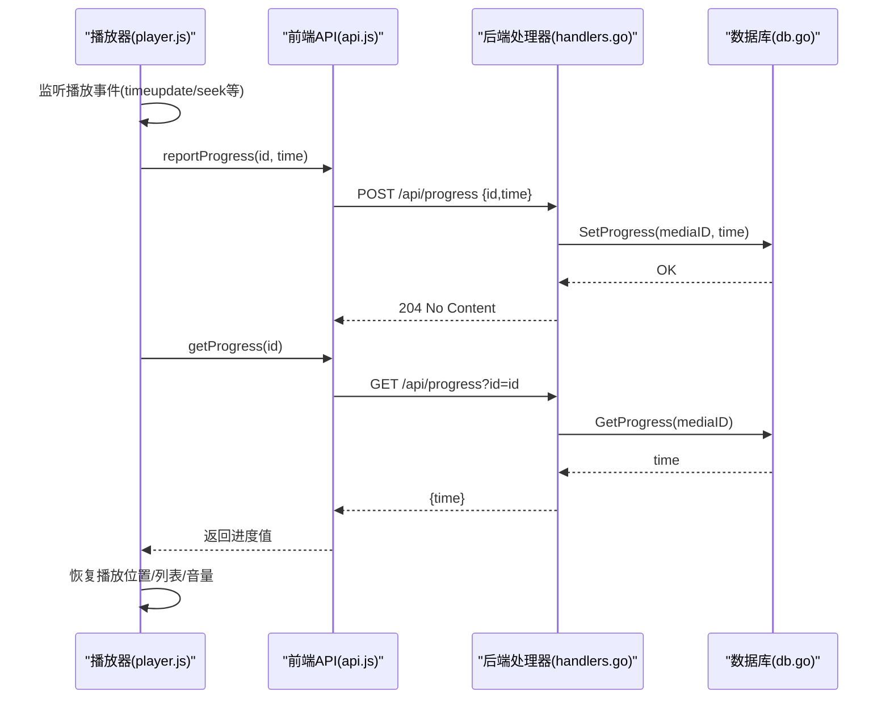
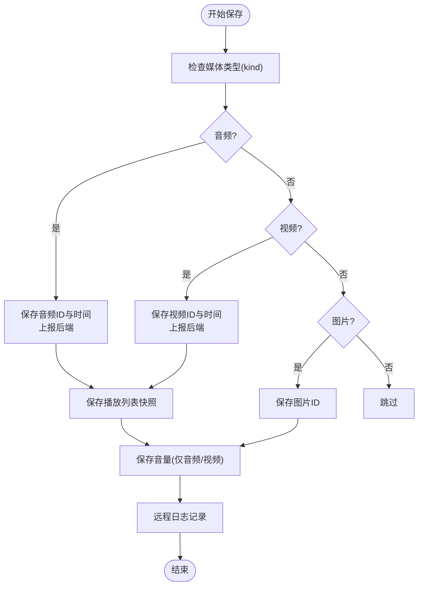
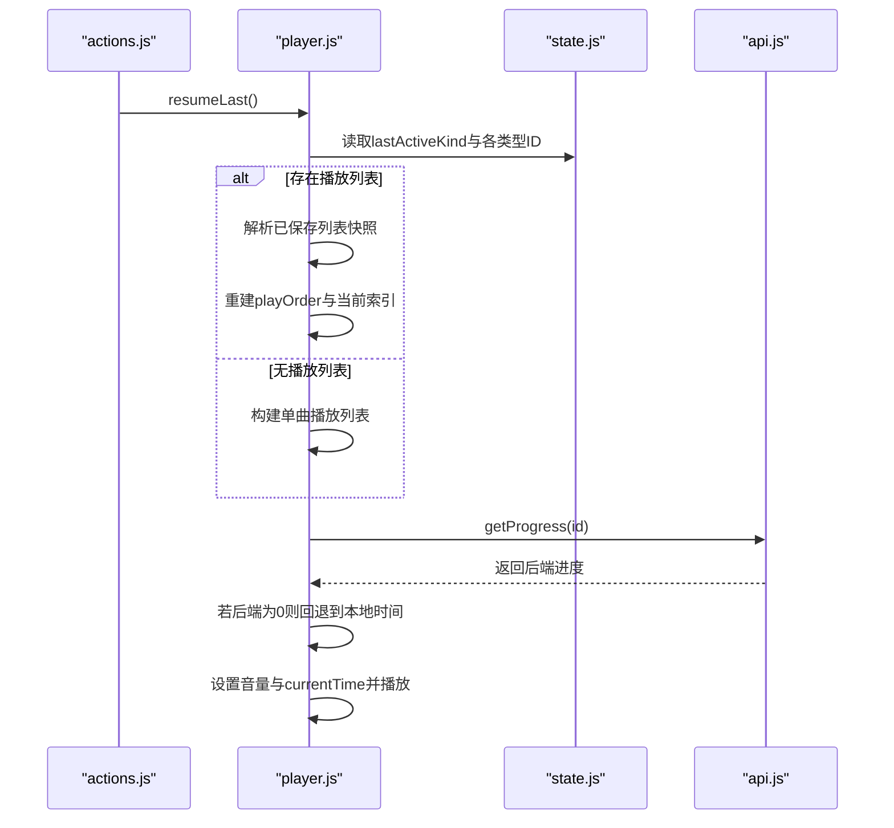
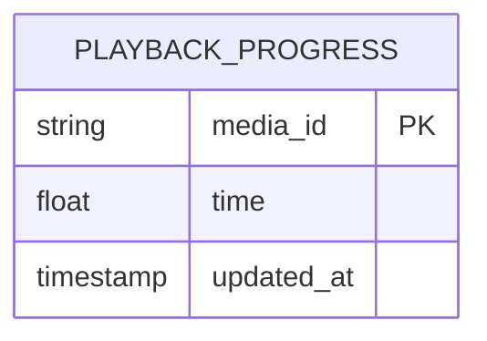
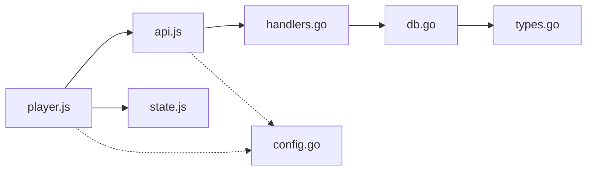

# 播放进度跟踪

<cite>
**本文引用的文件**
- [player.js](file://web/src/modules/player.js)
- [api.js](file://web/src/modules/api.js)
- [state.js](file://web/src/modules/state.js)
- [handlers.go](file://internal/handler/handlers.go)
- [db.go](file://internal/db/db.go)
- [types.go](file://internal/types/types.go)
- [config.go](file://internal/config/config.go)
- [actions.js](file://web/src/modules/actions.js)
- [utils.js](file://web/src/modules/utils.js)
</cite>

## 目录
1. [简介](#简介)
2. [项目结构](#项目结构)
3. [核心组件](#核心组件)
4. [架构总览](#架构总览)
5. [详细组件分析](#详细组件分析)
6. [依赖关系分析](#依赖关系分析)
7. [性能考量](#性能考量)
8. [故障排查指南](#故障排查指南)
9. [结论](#结论)
10. [附录](#附录)

## 简介
本文件聚焦于MSP项目的“播放进度跟踪”能力，系统性阐述其保存机制（本地存储 + 远程API同步）、进度恢复流程（断点续播、播放列表恢复、音量与播放状态恢复）、配置项（自动保存间隔、进度保留策略、隐私设置）以及最佳实践与性能优化建议。目标是帮助开发者与运维人员快速理解并正确使用该功能，同时为后续扩展提供清晰的参考路径。

## 项目结构
围绕播放进度跟踪的关键代码分布在前端模块与后端服务之间：
- 前端负责：播放事件监听、进度上报、本地持久化、断点恢复、播放列表与音量状态恢复
- 后端负责：进度API接口、SQLite数据库持久化、用户偏好同步

图表来源
- [player.js](file://web/src/modules/player.js#L15-L50)
- [api.js](file://web/src/modules/api.js#L95-L108)
- [state.js](file://web/src/modules/state.js#L42-L58)
- [handlers.go](file://internal/handler/handlers.go#L192-L233)
- [db.go](file://internal/db/db.go#L32-L72)
- [types.go](file://internal/types/types.go#L48-L52)
- [config.go](file://internal/config/config.go#L23-L47)

章节来源
- [player.js](file://web/src/modules/player.js#L15-L50)
- [api.js](file://web/src/modules/api.js#L95-L108)
- [state.js](file://web/src/modules/state.js#L42-L58)
- [handlers.go](file://internal/handler/handlers.go#L192-L233)
- [db.go](file://internal/db/db.go#L32-L72)
- [types.go](file://internal/types/types.go#L48-L52)
- [config.go](file://internal/config/config.go#L23-L47)

## 核心组件
- 前端进度保存与恢复
  - 进度保存：在播放过程中定期上报当前时间，同时写入本地存储与用户偏好（带批处理）
  - 断点续播：根据“最后活动类型”与“记住开关”判断是否可恢复
  - 播放列表恢复：保存完整播放列表索引与顺序，支持恢复播放队列
  - 音量与播放状态：恢复音量、字幕轨道、播放速率等
- 后端进度API与数据库
  - GET /api/progress：按媒体ID查询进度
  - POST /api/progress：上报进度并写入数据库
  - 数据库：PlaybackProgress表，按媒体ID唯一键更新

章节来源
- [player.js](file://web/src/modules/player.js#L15-L50)
- [player.js](file://web/src/modules/player.js#L72-L155)
- [api.js](file://web/src/modules/api.js#L95-L108)
- [handlers.go](file://internal/handler/handlers.go#L192-L233)
- [db.go](file://internal/db/db.go#L74-L99)
- [types.go](file://internal/types/types.go#L48-L52)

## 架构总览
播放进度跟踪的端到端流程如下：

图表来源
- [player.js](file://web/src/modules/player.js#L15-L50)
- [api.js](file://web/src/modules/api.js#L95-L108)
- [handlers.go](file://internal/handler/handlers.go#L192-L233)
- [db.go](file://internal/db/db.go#L74-L99)

## 详细组件分析

### 前端播放器与进度保存
- 进度上报时机
  - 通过播放器事件触发，调用保存函数，写入本地存储与用户偏好，并异步上报后端
  - 保存内容包括：最后活动类型、音频/视频最后ID与时间、播放列表快照、音量
- 用户偏好批处理
  - 偏好写入采用300ms窗口批处理，减少网络请求与数据库写入压力
- 断点续播
  - 依据“记住开关”与“最后活动类型”判断是否具备恢复条件
  - 恢复时优先使用后端进度，若无则回退到本地存储中的全局时间

图表来源
- [player.js](file://web/src/modules/player.js#L15-L50)
- [api.js](file://web/src/modules/api.js#L95-L98)

章节来源
- [player.js](file://web/src/modules/player.js#L15-L50)
- [api.js](file://web/src/modules/api.js#L129-L144)

### 断点续播与播放列表恢复
- 条件判断
  - lastActiveKind存在且对应“记住开关”开启
  - 对应类型的最后ID存在
- 恢复步骤
  - 选择媒体池（按类型），定位最后播放项
  - 若启用播放列表功能，则尝试恢复播放列表快照；否则构建单曲播放列表
  - 恢复音量（仅音频/视频）
  - 优先使用后端进度，若无效则回退到本地存储的全局时间
  - 设置播放元素的currentTime并播放

图表来源
- [actions.js](file://web/src/modules/actions.js#L88-L90)
- [player.js](file://web/src/modules/player.js#L72-L155)
- [api.js](file://web/src/modules/api.js#L100-L108)
- [state.js](file://web/src/modules/state.js#L42-L58)

章节来源
- [actions.js](file://web/src/modules/actions.js#L88-L90)
- [player.js](file://web/src/modules/player.js#L72-L155)
- [api.js](file://web/src/modules/api.js#L100-L108)

### 后端进度API与数据库
- 进度API
  - GET /api/progress?id=...：返回time
  - POST /api/progress：接收{id,time}并写入数据库
- 数据库设计
  - PlaybackProgress表：主键为mediaId，字段包含time与更新时间
  - 使用ON CONFLICT UPDATE ALL保证幂等更新
- 初始化与性能
  - SQLite连接池设置为单连接，启用WAL与NORMAL同步，缓存大小优化
  - 预编译语句提升写入性能

图表来源
- [types.go](file://internal/types/types.go#L48-L52)
- [db.go](file://internal/db/db.go#L32-L72)
- [db.go](file://internal/db/db.go#L88-L99)

章节来源
- [handlers.go](file://internal/handler/handlers.go#L192-L233)
- [db.go](file://internal/db/db.go#L74-L99)
- [types.go](file://internal/types/types.go#L48-L52)

### 配置项与隐私策略
- 记住开关
  - msp.remember.{audio,video,image}：用户偏好覆盖
  - 若未设置，回退到配置中的playback.{audio,video,image}.remember
- 播放列表与恢复
  - features.playlist：是否启用播放列表
  - playback.video.resume：是否启用断点续播
- 隐私与偏好
  - 偏好写入采用批处理，减少频繁网络请求
  - 本地存储键集中定义于state.js的LS对象，便于统一管理

章节来源
- [config.go](file://internal/config/config.go#L23-L47)
- [config.go](file://internal/config/config.go#L111-L129)
- [api.js](file://web/src/modules/api.js#L129-L144)
- [state.js](file://web/src/modules/state.js#L42-L58)

## 依赖关系分析
- 前端模块耦合
  - player.js依赖api.js进行进度上报与获取，依赖state.js读写本地存储键
  - actions.js在应用启动时调用resumeLast，形成恢复入口
- 后端模块耦合
  - handlers.go的HandleProgress依赖db.go的GetProgress/SetProgress
  - db.go依赖types.go的PlaybackProgress模型
- 配置影响
  - config.go中的remember与resume配置直接影响前端恢复逻辑

图表来源
- [player.js](file://web/src/modules/player.js#L1-L7)
- [api.js](file://web/src/modules/api.js#L1-L3)
- [handlers.go](file://internal/handler/handlers.go#L1-L26)
- [db.go](file://internal/db/db.go#L1-L16)
- [types.go](file://internal/types/types.go#L1-L6)
- [config.go](file://internal/config/config.go#L1-L4)

章节来源
- [player.js](file://web/src/modules/player.js#L1-L7)
- [api.js](file://web/src/modules/api.js#L1-L3)
- [handlers.go](file://internal/handler/handlers.go#L1-L26)
- [db.go](file://internal/db/db.go#L1-L16)
- [types.go](file://internal/types/types.go#L1-L6)
- [config.go](file://internal/config/config.go#L1-L4)

## 性能考量
- 前端批处理
  - 偏好写入采用300ms窗口批处理，降低网络与数据库压力
- 数据库优化
  - SQLite单连接、WAL模式、NORMAL同步、缓存大小调整，减少锁竞争与I/O开销
  - 预编译语句提升写入效率
- 转码与智能Seek
  - 后端按需转码并支持服务端Seek，避免前端频繁重载导致的进度丢失
- 建议
  - 控制上报频率：避免过于频繁的时间上报造成抖动
  - 合理使用批处理：在用户体验与数据实时性间取得平衡
  - 监控慢请求：结合日志与错误上报，定位网络与后端瓶颈

章节来源
- [api.js](file://web/src/modules/api.js#L129-L144)
- [db.go](file://internal/db/db.go#L32-L72)
- [handlers.go](file://internal/handler/handlers.go#L534-L564)

## 故障排查指南
- 无法恢复进度
  - 检查remember开关与lastActiveKind是否存在
  - 确认后端进度API是否返回有效time
  - 若后端无数据，确认前端是否成功上报
- 播放列表未恢复
  - 确认features.playlist是否启用
  - 检查本地存储中的播放列表快照是否完整
- 音量未恢复
  - 确认音量键是否正确写入与读取
  - 检查媒体元素是否支持volume属性
- 后端错误
  - 查看后端日志中的错误信息
  - 确认数据库连接与权限
  - 检查SQLite配置（WAL、同步级别）

章节来源
- [player.js](file://web/src/modules/player.js#L72-L155)
- [api.js](file://web/src/modules/api.js#L100-L108)
- [handlers.go](file://internal/handler/handlers.go#L192-L233)
- [db.go](file://internal/db/db.go#L74-L99)

## 结论
MSP的播放进度跟踪通过“前端事件驱动 + 后端数据库持久化”的方式，提供了可靠、可恢复的播放体验。其关键优势在于：
- 专用数据库表降低I/O压力
- 偏好批处理与SQLite优化提升性能
- 断点续播与播放列表恢复增强用户体验
- 清晰的配置项与隐私策略便于定制

建议在生产环境中结合监控与日志，持续评估上报频率与批处理窗口，以获得最佳的性能与体验平衡。

## 附录
- 本地存储键（示例）
  - msp.audio.lastId / msp.audio.lastTime
  - msp.video.lastId / msp.video.lastTime
  - msp.image.lastId
  - msp.lastActiveKind
  - msp.playlist
  - msp.volume
- 关键API
  - GET /api/progress?id={id}
  - POST /api/progress {id,time}
  - GET /api/prefs
  - POST /api/prefs {prefs}

章节来源
- [state.js](file://web/src/modules/state.js#L42-L58)
- [api.js](file://web/src/modules/api.js#L95-L108)
- [handlers.go](file://internal/handler/handlers.go#L192-L233)