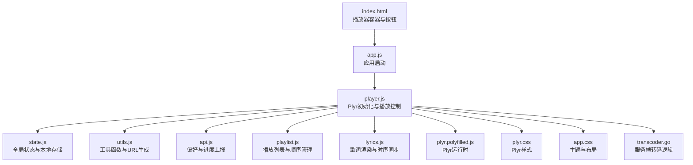
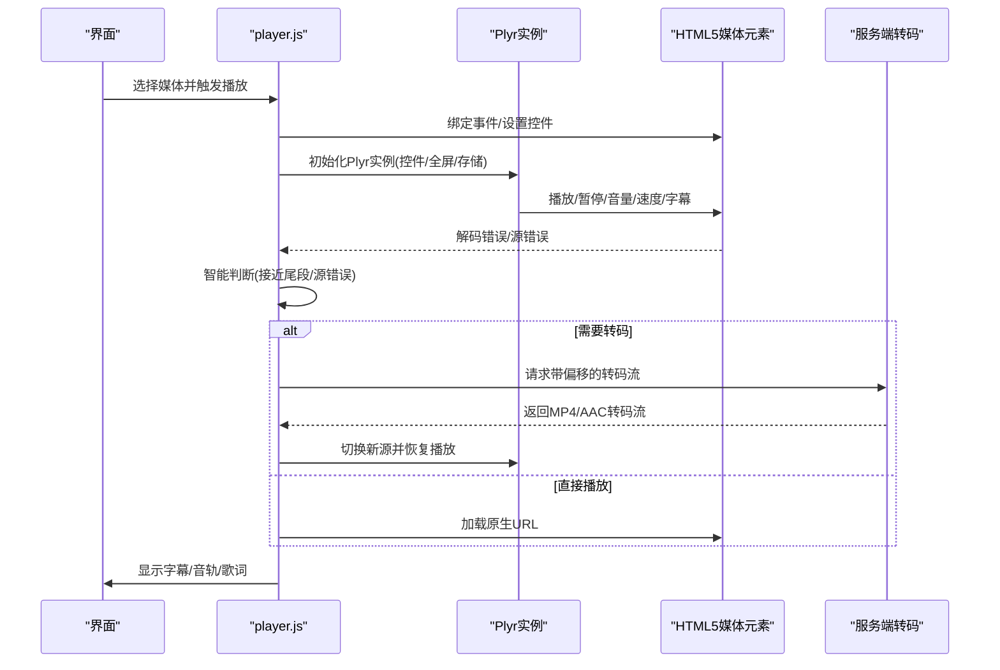
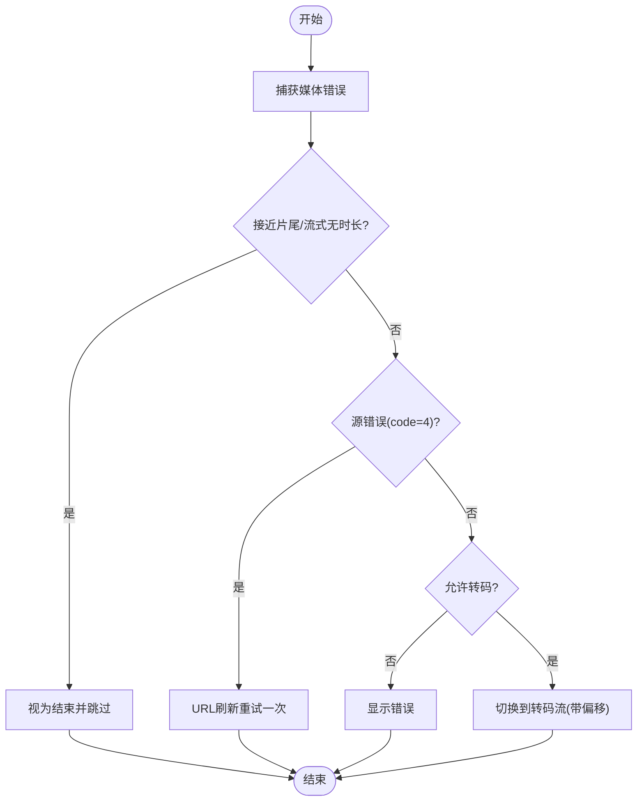
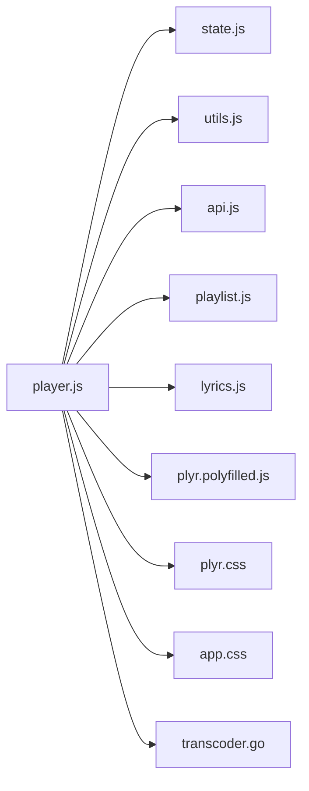

# 视频播放器

<cite>
**本文引用的文件**
- [player.js](file://web/src/modules/player.js)
- [state.js](file://web/src/modules/state.js)
- [utils.js](file://web/src/modules/utils.js)
- [api.js](file://web/src/modules/api.js)
- [playlist.js](file://web/src/modules/playlist.js)
- [lyrics.js](file://web/src/modules/lyrics.js)
- [plyr.css](file://web/public/assets/plyr/plyr.css)
- [plyr.polyfilled.js](file://web/public/assets/plyr/plyr.polyfilled.js)
- [app.css](file://web/src/app.css)
- [index.html](file://web/index.html)
- [transcoder.go](file://internal/media/transcoder.go)
- [config.example.json](file://config.example.json)
</cite>

## 目录
1. [简介](#简介)
2. [项目结构](#项目结构)
3. [核心组件](#核心组件)
4. [架构总览](#架构总览)
5. [详细组件分析](#详细组件分析)
6. [依赖关系分析](#依赖关系分析)
7. [性能考量](#性能考量)
8. [故障排查指南](#故障排查指南)
9. [结论](#结论)
10. [附录](#附录)

## 简介
本文件面向MSP项目的“视频播放器”模块，系统性阐述基于Plyr的播放器初始化流程、配置参数、控件与全屏设置、播放控制、进度条、音量、字幕与音轨、画质选择、智能错误拦截与自动转码回退、移动端触摸适配、以及可定制化配置与最佳实践。文档以代码为依据，结合可视化图示帮助读者快速理解与落地。

## 项目结构
播放器相关前端代码集中在web/src/modules目录，核心入口在web/src/app.js；Plyr资源位于web/public/assets/plyr；样式位于web/src/app.css与Plyr内置样式；播放器挂载点在web/index.html中定义。

图表来源
- [index.html](file://web/index.html#L79-L96)
- [app.js](file://web/src/app.js#L1-L5)
- [player.js](file://web/src/modules/player.js#L356-L706)
- [state.js](file://web/src/modules/state.js#L61-L93)
- [utils.js](file://web/src/modules/utils.js#L53-L60)
- [api.js](file://web/src/modules/api.js#L95-L108)
- [playlist.js](file://web/src/modules/playlist.js#L91-L102)
- [lyrics.js](file://web/src/modules/lyrics.js#L27-L47)
- [plyr.polyfilled.js](file://web/public/assets/plyr/plyr.polyfilled.js#L1-L3)
- [plyr.css](file://web/public/assets/plyr/plyr.css#L32-L80)
- [app.css](file://web/src/app.css#L631-L711)
- [transcoder.go](file://internal/media/transcoder.go#L138-L248)

章节来源
- [index.html](file://web/index.html#L79-L96)
- [app.js](file://web/src/app.js#L1-L5)

## 核心组件
- Plyr实例管理与初始化：负责控件、全屏、音量、速度、画质、字幕、循环等配置，绑定事件与持久化。
- 媒体元素重置与销毁：清理播放器与媒体元素，避免内存泄漏与残留状态。
- 智能错误拦截与自动转码回退：针对解码错误与源错误进行判定与回退策略。
- 智能 Seeking：对转码流进行起始偏移重载，保证进度跳转一致性。
- 字幕与音轨：内封字幕轨道检测与切换，音轨多音轨选择与持久化。
- 移动端适配：触摸设备自动启用原生控件、内联播放、全屏覆盖模式。
- 进度与偏好：本地与远端进度上报、偏好持久化、恢复播放。

章节来源
- [player.js](file://web/src/modules/player.js#L356-L706)
- [state.js](file://web/src/modules/state.js#L61-L93)
- [utils.js](file://web/src/modules/utils.js#L53-L60)
- [api.js](file://web/src/modules/api.js#L95-L108)
- [playlist.js](file://web/src/modules/playlist.js#L91-L102)
- [lyrics.js](file://web/src/modules/lyrics.js#L27-L47)

## 架构总览
播放器采用“前端Plyr + 服务端转码”的混合架构。前端负责UI与交互，服务端在必要时通过FFmpeg进行转码，以兼容浏览器无法直接播放的容器或编码。

图表来源
- [player.js](file://web/src/modules/player.js#L356-L706)
- [transcoder.go](file://internal/media/transcoder.go#L138-L248)

## 详细组件分析

### Plyr初始化与控件配置
- 控件清单：播放大按钮、播放/暂停、进度条、当前时间、时长、静音/音量、字幕、设置菜单、全屏。
- 设置菜单：字幕、画质、速度、循环。
- 全屏：启用全屏，支持回退模式。
- 存储：根据本地存储能力启用Plyr本地存储。
- 键盘：启用键盘控制（聚焦/全局）。
- 事件：绑定“结束”、“timeupdate”心跳监控、“seeking”智能跳转。

章节来源
- [player.js](file://web/src/modules/player.js#L486-L520)
- [plyr.polyfilled.js](file://web/public/assets/plyr/plyr.polyfilled.js#L1-L3)

### 智能错误拦截与自动转码回退
- 解码错误判定：当处于播放且满足“接近片尾/剩余时间极短/流式无时长但已播放过”条件时，抑制错误并视为正常结束，避免卡死与错误提示。
- 源错误重试：对“源不可用”错误进行一次性URL刷新重试，缓解范围请求问题。
- 自动转码回退：若配置允许且当前非转码流，则切换到带偏移的转码流；若再次失败则展示可见错误提示。
- 心跳监控：若播放中超过阈值无进度推进，强制结束，防止播放器假死。

图表来源
- [player.js](file://web/src/modules/player.js#L360-L443)

章节来源
- [player.js](file://web/src/modules/player.js#L360-L443)

### 智能 Seeking 与转码流跳转
- 当前源为转码流时，监听“seeking”事件。
- 计算目标时间并构造带偏移的新URL，先暂停、再切换源、最后恢复播放。
- 保持UI时间与实际流偏移一致，避免跳转无效。

章节来源
- [player.js](file://web/src/modules/player.js#L557-L624)

### 字幕与音轨处理
- 字幕：动态注入track节点，自动禁用除首个外的字幕轨道，支持按配置启用字幕。
- 音轨：在元数据加载后检测多音轨，尝试恢复上次选择，并定时持久化当前音轨索引。
- 字幕菜单：通过Plyr API刷新字幕菜单项。

章节来源
- [player.js](file://web/src/modules/player.js#L228-L255)
- [player.js](file://web/src/modules/player.js#L709-L795)

### 移动端触摸适配
- 自动识别触摸设备，启用原生控件、内联播放、全屏覆盖模式。
- 全屏进入/退出时更新画布填充模式（contain/cover）与按钮文案。

章节来源
- [player.js](file://web/src/modules/player.js#L445-L467)
- [player.js](file://web/src/modules/player.js#L626-L648)

### 进度与偏好持久化
- 进度上报：播放进度与时间点上报服务端，支持按文件维度优先。
- 偏好存储：音量、静音、播放速率、字幕语言与轨道、画质等持久化。
- 恢复播放：根据上次活动类型与ID恢复播放列表、音量与时间点。

章节来源
- [player.js](file://web/src/modules/player.js#L15-L50)
- [player.js](file://web/src/modules/player.js#L72-L155)
- [api.js](file://web/src/modules/api.js#L95-L108)
- [state.js](file://web/src/modules/state.js#L42-L58)

### 服务端转码策略
- 限制并发：使用信号量限制同时转码任务数量，避免CPU过载。
- 参数智能选择：根据容器/编码头判断是否复制流或进行转码；视频使用常用预设，音频按需转码；MP4输出启用faststart；偏移时保留时间戳。
- 校验与安全：输入路径校验、格式白名单、码率格式校验、偏移量校正。

章节来源
- [transcoder.go](file://internal/media/transcoder.go#L15-L17)
- [transcoder.go](file://internal/media/transcoder.go#L138-L248)

### UI与主题适配
- Plyr主题变量：主色、控件背景、菜单与提示样式统一到应用主题。
- 响应式布局：在窄屏下调整音频封面与歌词区域布局。
- 动画过渡：媒体元素与控件使用较短过渡，提升交互流畅度。

章节来源
- [app.css](file://web/src/app.css#L690-L701)
- [app.css](file://web/src/app.css#L798-L800)
- [plyr.css](file://web/public/assets/plyr/plyr.css#L32-L80)

## 依赖关系分析
播放器模块内部依赖清晰，职责分离明确：player.js作为中枢协调各模块；state.js提供全局状态与本地存储；utils.js提供URL与格式化工具；api.js负责偏好与进度；playlist.js管理播放列表；lyrics.js负责歌词；Plyr运行时与样式独立于业务逻辑。

图表来源
- [player.js](file://web/src/modules/player.js#L1-L10)
- [state.js](file://web/src/modules/state.js#L1-L10)
- [utils.js](file://web/src/modules/utils.js#L1-L5)
- [api.js](file://web/src/modules/api.js#L1-L5)
- [playlist.js](file://web/src/modules/playlist.js#L1-L5)
- [lyrics.js](file://web/src/modules/lyrics.js#L1-L5)
- [plyr.polyfilled.js](file://web/public/assets/plyr/plyr.polyfilled.js#L1-L3)
- [plyr.css](file://web/public/assets/plyr/plyr.css#L1-L10)
- [app.css](file://web/src/app.css#L1-L10)
- [transcoder.go](file://internal/media/transcoder.go#L1-L10)

章节来源
- [player.js](file://web/src/modules/player.js#L1-L10)
- [state.js](file://web/src/modules/state.js#L1-L10)
- [utils.js](file://web/src/modules/utils.js#L1-L5)
- [api.js](file://web/src/modules/api.js#L1-L5)
- [playlist.js](file://web/src/modules/playlist.js#L1-L5)
- [lyrics.js](file://web/src/modules/lyrics.js#L1-L5)
- [plyr.polyfilled.js](file://web/public/assets/plyr/plyr.polyfilled.js#L1-L3)
- [plyr.css](file://web/public/assets/plyr/plyr.css#L1-L10)
- [app.css](file://web/src/app.css#L1-L10)
- [transcoder.go](file://internal/media/transcoder.go#L1-L10)

## 性能考量
- 转码并发限制：通过信号量限制同时转码任务，避免CPU争用。
- 智能参数：视频使用常用预设与像素格式，音频按需转码，MP4输出faststart优化网络首开。
- 心跳监控：播放器侧检测播放停滞，及时结束避免资源占用。
- UI过渡：媒体元素与控件使用短时过渡，减少重绘与合成压力。

章节来源
- [transcoder.go](file://internal/media/transcoder.go#L15-L17)
- [transcoder.go](file://internal/media/transcoder.go#L195-L222)
- [player.js](file://web/src/modules/player.js#L522-L555)
- [app.css](file://web/src/app.css#L258-L262)

## 故障排查指南
- 播放失败但提示“转码已禁用/失败”：检查服务端转码开关与FFmpeg可用性；确认客户端配置允许转码。
- 字幕/音轨不显示：确认媒体内封轨道存在；检查字幕功能开关；查看浏览器对特定容器的支持情况。
- 移动端无法全屏：确认iOS全屏回退模式开启；检查内联播放与触摸设备识别。
- 进度不同步：确认进度上报接口可用；检查本地存储权限；验证恢复播放逻辑。

章节来源
- [player.js](file://web/src/modules/player.js#L394-L443)
- [player.js](file://web/src/modules/player.js#L709-L795)
- [player.js](file://web/src/modules/player.js#L445-L467)
- [api.js](file://web/src/modules/api.js#L95-L108)

## 结论
MSP视频播放器以Plyr为核心，结合服务端转码与前端智能策略，在兼容性、稳定性与用户体验之间取得良好平衡。通过可配置的特性开关、完善的错误处理与回退机制、移动端适配与主题统一，满足个人与局域网场景下的多样化需求。

## 附录

### 播放器配置要点（来自配置示例）
- 通用特性：速度、画质、字幕、播放列表。
- 播放行为：音频/视频/图片启用、作用域、转码、恢复播放。
- 安全：IP白/黑名单、PIN保护。

章节来源
- [config.example.json](file://config.example.json#L7-L20)
- [config.example.json](file://config.example.json#L25-L43)