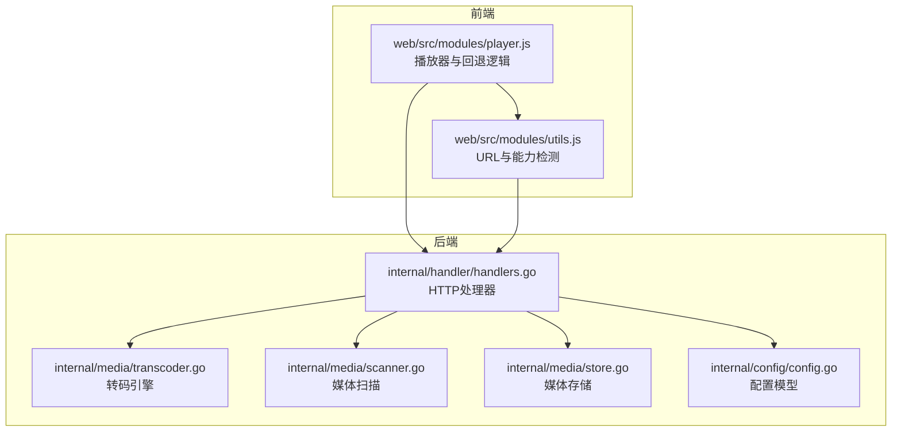
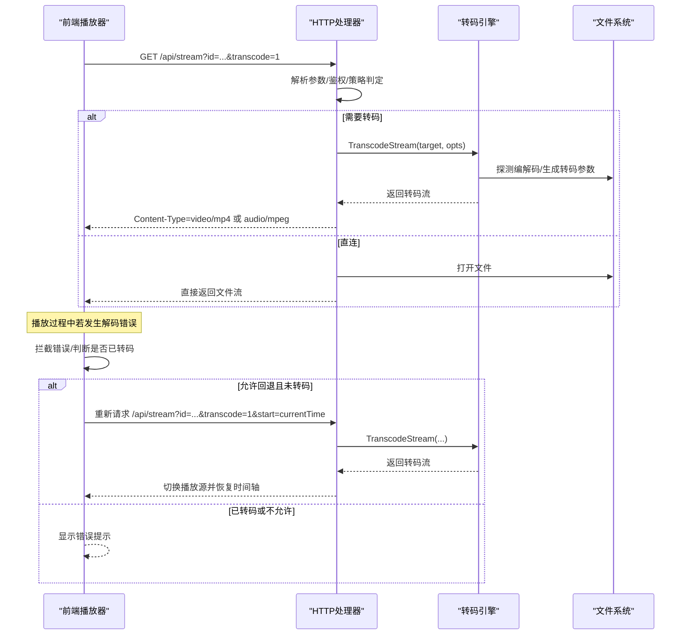
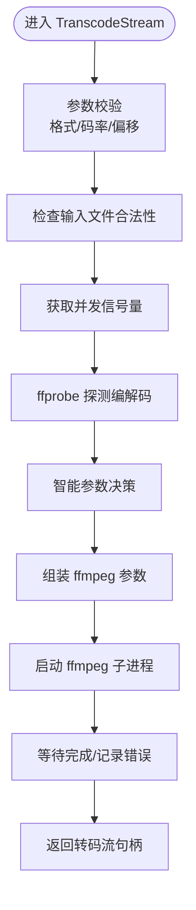
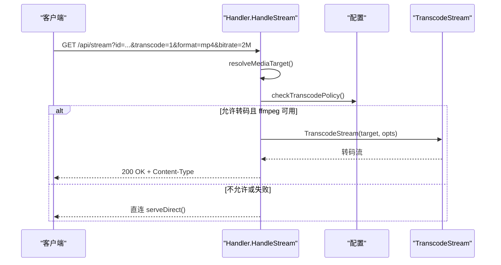
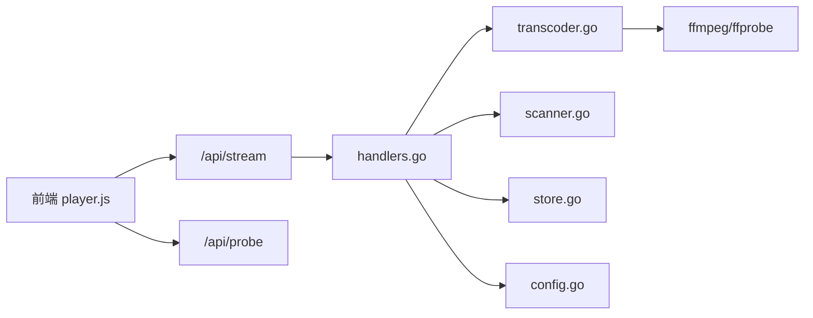

# 转码回退机制

<cite>
**本文引用的文件**
- [internal/media/transcoder.go](file://internal/media/transcoder.go)
- [internal/media/transcoder_test.go](file://internal/media/transcoder_test.go)
- [internal/media/scanner.go](file://internal/media/scanner.go)
- [internal/media/store.go](file://internal/media/store.go)
- [internal/handler/handlers.go](file://internal/handler/handlers.go)
- [web/src/modules/player.js](file://web/src/modules/player.js)
- [web/src/modules/utils.js](file://web/src/modules/utils.js)
- [internal/config/config.go](file://internal/config/config.go)
- [docs/API_REFERENCE.md](file://docs/API_REFERENCE.md)
- [docs/CONFIG_EXAMPLE.md](file://docs/CONFIG_EXAMPLE.md)
</cite>

## 目录
1. [简介](#简介)
2. [项目结构](#项目结构)
3. [核心组件](#核心组件)
4. [架构总览](#架构总览)
5. [详细组件分析](#详细组件分析)
6. [依赖关系分析](#依赖关系分析)
7. [性能考量](#性能考量)
8. [故障排查指南](#故障排查指南)
9. [结论](#结论)
10. [附录](#附录)

## 简介
本文档系统化阐述 MSP 项目的“转码回退机制”，覆盖以下方面：
- 回退触发条件与判断逻辑：不支持格式检测、解码错误识别、播放器兼容性检查
- 实现流程：转码 URL 生成、播放源切换、播放状态保持
- 智能转码优化策略：预检转码、转码参数设置、转码质量控制
- 用户体验保障：无缝切换、进度保持、错误提示
- 转码配置选项与故障排除

## 项目结构
围绕转码回退机制的关键模块与职责如下：
- 后端处理器：解析请求、判定是否转码、执行转码或直连
- 转码引擎：校验参数、探测编解码、生成转码流
- 媒体扫描与存储：构建媒体索引、辅助前端决策
- 前端播放器：错误拦截、自动回退、播放源切换、进度保持



图表来源
- [web/src/modules/player.js](file://web/src/modules/player.js#L360-L444)
- [web/src/modules/utils.js](file://web/src/modules/utils.js#L53-L60)
- [internal/handler/handlers.go](file://internal/handler/handlers.go#L413-L446)
- [internal/media/transcoder.go](file://internal/media/transcoder.go#L138-L248)
- [internal/media/scanner.go](file://internal/media/scanner.go#L25-L57)
- [internal/media/store.go](file://internal/media/store.go#L17-L47)
- [internal/config/config.go](file://internal/config/config.go#L77-L88)

章节来源
- [internal/handler/handlers.go](file://internal/handler/handlers.go#L413-L446)
- [internal/media/transcoder.go](file://internal/media/transcoder.go#L138-L248)
- [web/src/modules/player.js](file://web/src/modules/player.js#L360-L444)
- [web/src/modules/utils.js](file://web/src/modules/utils.js#L53-L60)
- [internal/media/scanner.go](file://internal/media/scanner.go#L25-L57)
- [internal/media/store.go](file://internal/media/store.go#L17-L47)
- [internal/config/config.go](file://internal/config/config.go#L77-L88)

## 核心组件
- 转码引擎（Transcoder）
  - 参数校验、并发限制、编解码探测、智能参数选择、转码流输出
- HTTP 处理器（Handler）
  - 请求解析、转码策略判定、直连/转码分流、内容类型设置
- 前端播放器（Player）
  - 错误拦截与自动回退、播放源切换、进度保持、字幕与音轨处理
- 配置系统（Config）
  - 播放与转码开关、默认值与应用逻辑

章节来源
- [internal/media/transcoder.go](file://internal/media/transcoder.go#L19-L70)
- [internal/handler/handlers.go](file://internal/handler/handlers.go#L513-L532)
- [web/src/modules/player.js](file://web/src/modules/player.js#L360-L444)
- [internal/config/config.go](file://internal/config/config.go#L111-L146)

## 架构总览
整体工作流：前端发起媒体流请求，后端根据配置与文件特征决定直连或转码；若直连失败，前端自动回退到转码流；转码流支持起始偏移与无缝切换。



图表来源
- [internal/handler/handlers.go](file://internal/handler/handlers.go#L413-L446)
- [internal/media/transcoder.go](file://internal/media/transcoder.go#L138-L248)
- [web/src/modules/player.js](file://web/src/modules/player.js#L360-L444)

## 详细组件分析

### 转码引擎（Transcoder）
- 参数校验与默认值
  - 格式白名单、码率格式校验、偏移量归一化
- 并发限制
  - 全局信号量限制同时转码会话数量，避免 CPU 抢占
- 编解码探测
  - 使用 ffprobe 获取首视频/音频流编解码器，作为智能转码依据
- 智能参数选择
  - 音频：若目标格式与源一致则复制，否则按目标格式编码
  - 视频：h264 直拷贝，否则使用 libx264 快速预设与 yuv420p，必要时 AAC 音频
  - MP4 输出启用 faststart 优化网络传输，偏移时使用 -copyts 保持时间轴
- 错误处理
  - 启动失败捕获 stderr，便于定位问题
  - 输入路径合法性校验（存在性、常规文件）



图表来源
- [internal/media/transcoder.go](file://internal/media/transcoder.go#L138-L248)

章节来源
- [internal/media/transcoder.go](file://internal/media/transcoder.go#L19-L70)
- [internal/media/transcoder.go](file://internal/media/transcoder.go#L91-L104)
- [internal/media/transcoder.go](file://internal/media/transcoder.go#L106-L136)
- [internal/media/transcoder.go](file://internal/media/transcoder.go#L138-L248)
- [internal/media/transcoder_test.go](file://internal/media/transcoder_test.go#L147-L191)

### HTTP 处理器（Handler）
- 媒体流接口
  - 解析媒体 ID、校验路径、确定内容类型
  - 转码策略判定：查询参数 transcode=1 且配置允许
  - 直连策略：设置缓存控制、Accept-Ranges、Content-Disposition
  - 转码策略：调用 TranscodeStream，设置 X-MSP-Transcode 标记与 no-store
- 转码策略判定
  - 仅当请求携带 transcode=1 且配置允许时才转码
  - 音视频分别受各自开关控制



图表来源
- [internal/handler/handlers.go](file://internal/handler/handlers.go#L413-L446)
- [internal/handler/handlers.go](file://internal/handler/handlers.go#L513-L532)
- [internal/handler/handlers.go](file://internal/handler/handlers.go#L534-L564)
- [internal/handler/handlers.go](file://internal/handler/handlers.go#L666-L579)

章节来源
- [internal/handler/handlers.go](file://internal/handler/handlers.go#L413-L446)
- [internal/handler/handlers.go](file://internal/handler/handlers.go#L513-L532)
- [internal/handler/handlers.go](file://internal/handler/handlers.go#L534-L564)
- [internal/handler/handlers.go](file://internal/handler/handlers.go#L666-L579)

### 前端播放器（Player）
- 播放策略
  - 预转码：对 AVI/WMV 在播放前直接请求转码，避免浏览器下载对话框
  - 直连优先：其余格式先尝试直连，失败后自动回退转码
- 自动回退
  - 捕获 MEDIA_ERR_DECODE/MEDIA_ERR_SRC_NOT_SUPPORTED
  - 中途解码失败时，若未转码且配置允许，则构造带 transcode=1 的 URL 并切换源
  - 对源错误（code=4）做一次性刷新重试（追加 ts 参数）
- 播放源切换
  - 优先使用 Plyr API 切换源，失败则回退到原生元素
  - 保持封面、字幕轨道、播放速率、音量等状态
- 进度保持
  - 通过 start 参数在转码流中恢复时间轴
  - 播放结束心跳检测，避免卡死导致无法结束
- 错误提示
  - 永远失败时显示明确错误文案，区分“转码失败”和“转码未启用”

```mermaid
flowchart TD
E(["播放器 error 事件"]) --> CheckErr{"错误码/位置"}
CheckErr --> |解码错误且接近结尾| TreatAsEnd["视为播放结束"]
CheckErr --> |源错误(code=4)| RetryOnce["刷新URL重试一次"]
CheckErr --> |中途解码失败| CheckAllow{"允许转码且未转码?"}
CheckAllow --> |否| ShowError["显示错误提示"]
CheckAllow --> |是| BuildURL["构造 /api/stream?id=...&transcode=1&start=currentTime"]
BuildURL --> Switch["切换播放源(Plyr/原生)"]
Switch --> Resume["恢复时间轴/播放"]
```

图表来源
- [web/src/modules/player.js](file://web/src/modules/player.js#L360-L444)
- [web/src/modules/player.js](file://web/src/modules/player.js#L290-L339)
- [web/src/modules/player.js](file://web/src/modules/player.js#L557-L624)

章节来源
- [web/src/modules/player.js](file://web/src/modules/player.js#L270-L281)
- [web/src/modules/player.js](file://web/src/modules/player.js#L360-L444)
- [web/src/modules/player.js](file://web/src/modules/player.js#L557-L624)
- [web/src/modules/utils.js](file://web/src/modules/utils.js#L53-L60)

### 媒体扫描与存储
- 扫描与索引
  - WalkShares 遍历共享目录，构建媒体项并缓存
  - 支持黑名单过滤、大小规则、子标题与歌词关联
- 数据库存储
  - 支持 SQLite 增量扫描与缓存元数据，加速响应
- 探针与嗅探
  - SniffContainerCodecs 通过文件头/尾部字节推断编解码，辅助前端决策

章节来源
- [internal/media/scanner.go](file://internal/media/scanner.go#L25-L57)
- [internal/media/scanner.go](file://internal/media/scanner.go#L578-L687)
- [internal/media/store.go](file://internal/media/store.go#L17-L47)

### 配置系统
- 播放与转码开关
  - playback.audio.transcode / playback.video.transcode 控制是否允许转码
  - 默认关闭，家庭场景推荐开启
- 默认值与应用
  - ApplyDefaults 为缺失字段填充默认值，保证行为一致性

章节来源
- [internal/config/config.go](file://internal/config/config.go#L111-L146)
- [docs/CONFIG_EXAMPLE.md](file://docs/CONFIG_EXAMPLE.md#L80-L86)

## 依赖关系分析
- 前端依赖后端 API 与配置
  - 通过 /api/stream 获取直连或转码流
  - 通过 /api/probe 获取容器与编解码信息，辅助预转码决策
- 后端依赖系统工具
  - ffmpeg/ffprobe 可用性检测与转码执行
- 组件耦合
  - Handler 与 Transcoder 高内聚，职责清晰
  - Player 与 Handler 通过 URL 协议耦合，利于前后端解耦



图表来源
- [web/src/modules/player.js](file://web/src/modules/player.js#L1068-L1094)
- [internal/handler/handlers.go](file://internal/handler/handlers.go#L413-L446)
- [internal/media/transcoder.go](file://internal/media/transcoder.go#L91-L104)
- [internal/media/scanner.go](file://internal/media/scanner.go#L578-L687)
- [internal/media/store.go](file://internal/media/store.go#L17-L47)
- [internal/config/config.go](file://internal/config/config.go#L77-L88)

章节来源
- [web/src/modules/player.js](file://web/src/modules/player.js#L1068-L1094)
- [internal/handler/handlers.go](file://internal/handler/handlers.go#L413-L446)
- [internal/media/transcoder.go](file://internal/media/transcoder.go#L91-L104)

## 性能考量
- 并发限制
  - 全局信号量限制同时转码会话数量，避免 CPU 争用
- 转码参数优化
  - 视频：h264 直拷贝，非 h264 使用 libx264 快速预设与 yuv420p
  - 音频：尽可能复制，减少编码开销
  - MP4 输出启用 faststart，改善网络首帧延迟
- 直连优先
  - 降低服务器负载，仅在必要时转码
- 心跳检测
  - 播放器检测播放停滞，超时强制结束，避免资源占用

章节来源
- [internal/media/transcoder.go](file://internal/media/transcoder.go#L17-L17)
- [internal/media/transcoder.go](file://internal/media/transcoder.go#L195-L222)
- [web/src/modules/player.js](file://web/src/modules/player.js#L522-L555)

## 故障排查指南
- 常见问题与定位
  - ffmpeg/ffprobe 未安装：后端转码策略失效，前端回退逻辑不触发
  - 配置未开启转码：即使直连失败也不会回退
  - 源错误（code=4）：浏览器范围请求异常，前端已做一次性刷新重试
  - 解码错误（code=3）：播放器拦截并尝试回退转码
- 建议排查步骤
  - 检查后端日志与 ffmpeg/ffprobe 可用性
  - 确认配置 playback.video.transcode / playback.audio.transcode 已启用
  - 使用 /api/probe 获取容器与编解码信息，确认是否命中预转码
  - 观察前端错误提示，区分“转码失败”和“转码未启用”
- 相关接口与配置
  - /api/stream：直连/转码流
  - /api/probe：容器与编解码信息
  - 配置项：playback.video.transcode / playback.audio.transcode

章节来源
- [internal/handler/handlers.go](file://internal/handler/handlers.go#L437-L442)
- [web/src/modules/player.js](file://web/src/modules/player.js#L405-L439)
- [docs/API_REFERENCE.md](file://docs/API_REFERENCE.md#L88-L135)
- [docs/CONFIG_EXAMPLE.md](file://docs/CONFIG_EXAMPLE.md#L80-L86)

## 结论
MSP 的转码回退机制以“直连优先、自动回退、无缝切换”为核心设计：
- 前端在播放过程中主动拦截解码错误并回退转码，结合起始偏移实现进度保持
- 后端通过智能参数与并发限制，在保证体验的同时控制资源消耗
- 配置系统提供细粒度开关，满足不同场景需求
- 媒体扫描与存储为前端决策提供数据支撑，提升预转码命中率

## 附录
- 关键接口与参数
  - /api/stream：id、transcode、start、format、bitrate
  - /api/probe：id
- 配置要点
  - playback.video.transcode / playback.audio.transcode
  - features.captions、features.playlist 等影响播放体验

章节来源
- [docs/API_REFERENCE.md](file://docs/API_REFERENCE.md#L88-L135)
- [docs/CONFIG_EXAMPLE.md](file://docs/CONFIG_EXAMPLE.md#L80-L86)