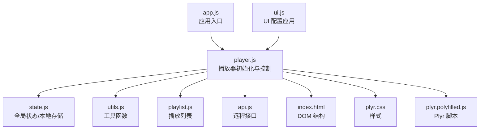
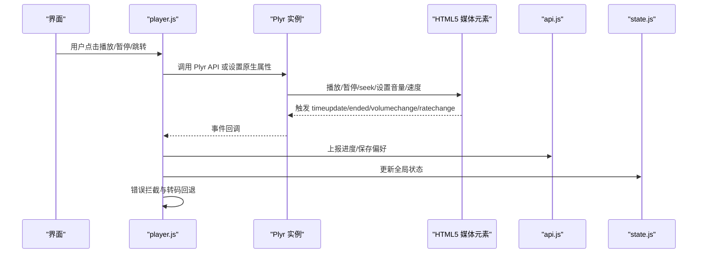
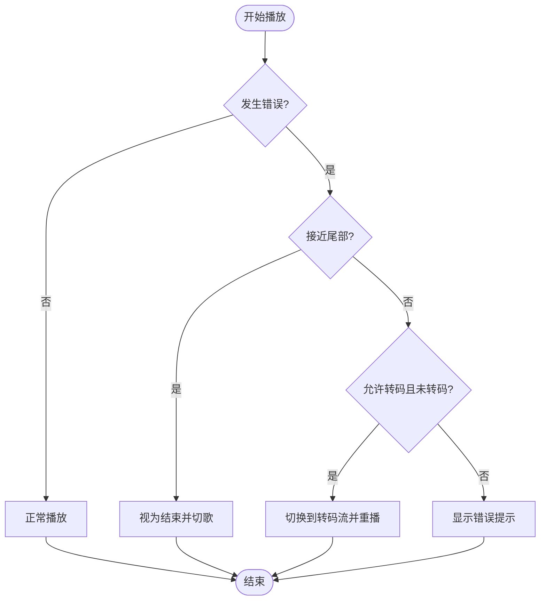
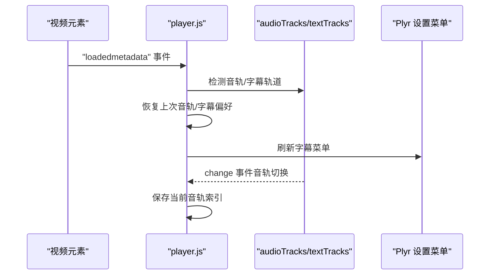
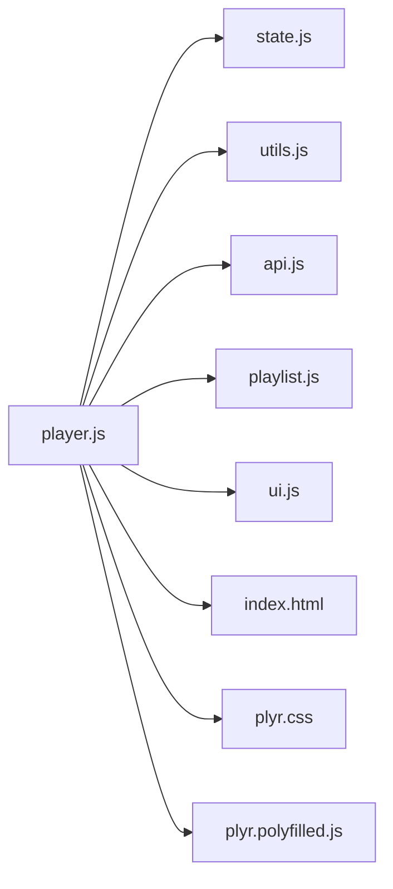

# 音频播放器

<cite>
**本文引用的文件**
- [player.js](file://web/src/modules/player.js)
- [state.js](file://web/src/modules/state.js)
- [utils.js](file://web/src/modules/utils.js)
- [playlist.js](file://web/src/modules/playlist.js)
- [api.js](file://web/src/modules/api.js)
- [ui.js](file://web/src/modules/ui.js)
- [index.html](file://web/index.html)
- [plyr.css](file://web/public/assets/plyr/plyr.css)
- [plyr.polyfilled.js](file://web/public/assets/plyr/plyr.polyfilled.js)
- [app.js](file://web/src/app.js)
</cite>

## 目录
1. [简介](#简介)
2. [项目结构](#项目结构)
3. [核心组件](#核心组件)
4. [架构总览](#架构总览)
5. [详细组件分析](#详细组件分析)
6. [依赖关系分析](#依赖关系分析)
7. [性能考量](#性能考量)
8. [故障排查指南](#故障排查指南)
9. [结论](#结论)
10. [附录：配置与使用指南](#附录配置与使用指南)

## 简介
本文件面向 MSP 项目的音频播放器模块，系统性阐述基于 Plyr 的音频播放器初始化与配置流程、核心功能实现（播放控制、进度显示、音量调节、播放速度设置）、音轨处理机制（多音轨检测、音轨切换、音轨状态持久化）、以及特殊功能（播放速度控制、循环播放、音频封面显示）。同时提供配置项说明与使用指导，帮助开发者与使用者快速上手并进行定制。

## 项目结构
音频播放器位于前端 Web 前端模块中，主要由以下文件构成：
- player.js：音频播放器初始化、Plyr 实例管理、错误拦截与回退、音轨与字幕处理、进度与偏好持久化等
- state.js：全局状态与本地存储键名定义
- utils.js：工具函数（格式化、MIME 推断、流地址生成等）
- playlist.js：播放列表构建与播放顺序管理
- api.js：远程接口封装（进度上报、偏好读写、探测信息等）
- ui.js：UI 配置应用（播放列表开关、随机/循环等）
- index.html：页面结构，包含音频元素与 Plyr 样式脚本
- plyr.css / plyr.polyfilled.js：Plyr 样式与 Polyfill 脚本
- app.js：应用入口，触发初始化

图表来源
- [app.js](file://web/src/app.js#L1-L5)
- [player.js](file://web/src/modules/player.js#L1-L1292)
- [state.js](file://web/src/modules/state.js#L1-L127)
- [utils.js](file://web/src/modules/utils.js#L1-L124)
- [playlist.js](file://web/src/modules/playlist.js#L1-L457)
- [api.js](file://web/src/modules/api.js#L1-L155)
- [index.html](file://web/index.html#L1-L195)
- [plyr.css](file://web/public/assets/plyr/plyr.css#L1-L1401)
- [plyr.polyfilled.js](file://web/public/assets/plyr/plyr.polyfilled.js#L1-L3)

章节来源
- [app.js](file://web/src/app.js#L1-L5)
- [index.html](file://web/index.html#L1-L195)

## 核心组件
- Plyr 实例管理与初始化：负责创建/销毁 Plyr 实例、绑定事件、处理错误与回退、智能跳转与转码回退
- 音频元素与封面：提供音频元素、封面展示区域与歌词渲染
- 进度与偏好持久化：记录播放进度、音量、播放速度、字幕偏好、播放列表状态等
- 音轨与字幕处理：检测并切换音轨；字幕轨道管理与偏好持久化
- 播放列表与播放顺序：构建播放列表、随机/循环策略、前后曲目导航

章节来源
- [player.js](file://web/src/modules/player.js#L1-L1292)
- [state.js](file://web/src/modules/state.js#L1-L127)
- [playlist.js](file://web/src/modules/playlist.js#L1-L457)
- [api.js](file://web/src/modules/api.js#L1-L155)

## 架构总览
音频播放器采用“模块化分层”设计：
- 表现层：index.html 提供 DOM 结构，plyr.css 提供样式，plyr.polyfilled.js 提供 Plyr 能力
- 控制层：player.js 负责播放器实例生命周期、事件绑定、错误处理、音轨/字幕处理
- 数据层：state.js 维护全局状态与本地存储键名；api.js 提供进度/偏好/探测等远程能力；utils.js 提供 MIME/时间/URL 工具
- 交互层：ui.js 应用服务端配置到 UI；playlist.js 管理播放列表与播放顺序

图表来源
- [player.js](file://web/src/modules/player.js#L356-L655)
- [api.js](file://web/src/modules/api.js#L95-L155)
- [state.js](file://web/src/modules/state.js#L61-L93)

## 详细组件分析

### Plyr 初始化与配置
- 控件与设置菜单
  - 控件集合包含播放、进度条、当前时间、时长、静音、音量、字幕、设置、全屏
  - 设置菜单包含字幕、清晰度、速度、循环
  - 字幕按钮在视频模式下默认启用，可从文本轨道读取
- 速度控制
  - 从配置读取 speedOptions，若未指定则使用默认值
  - 仅当速度值在允许范围内才应用
- 存储与键盘
  - 若本地存储可用则启用 Plyr Storage
  - 键盘支持：聚焦与全局均可响应
- 全屏
  - 启用全屏，支持回退模式
- 触摸设备适配
  - 自动开启原生 controls，并在触摸设备上禁用自动隐藏控制栏
- 事件监听
  - 绑定 ended 事件以自动切歌
  - 心跳检测：若播放中超过阈值无进度更新则视为卡死并结束

章节来源
- [player.js](file://web/src/modules/player.js#L486-L520)
- [player.js](file://web/src/modules/player.js#L522-L556)

### 播放控制与进度显示
- 播放/暂停/跳转
  - 通过 Plyr API 或原生属性控制
  - 支持 seek 事件与标准 seek 行为
- 进度上报与恢复
  - 播放进度定时上报
  - 支持“继续上次播放”：恢复播放列表、音量、时间点
- 智能错误拦截与回退
  - 解码错误或源不可用时，若接近尾部则视为成功结束
  - 若允许转码且当前未转码，则尝试转码回退
  - 失败时显示可见错误提示

图表来源
- [player.js](file://web/src/modules/player.js#L360-L443)

章节来源
- [player.js](file://web/src/modules/player.js#L15-L50)
- [player.js](file://web/src/modules/player.js#L72-L155)
- [player.js](file://web/src/modules/player.js#L341-L354)
- [player.js](file://web/src/modules/player.js#L360-L443)

### 音量与播放速度
- 音量
  - 从本地存储读取上次音量与静音状态
  - 监听 volumechange 事件并去抖保存
- 播放速度
  - 从本地存储读取上次速度
  - 仅在配置允许的速度范围内应用
  - 通过 Plyr 设置菜单或原生属性生效

章节来源
- [player.js](file://web/src/modules/player.js#L469-L486)
- [player.js](file://web/src/modules/player.js#L656-L666)

### 音轨处理机制
- 多音轨检测
  - 在媒体元数据加载完成后检测 audioTracks
  - 若存在多个音轨，打印各音轨信息
- 音轨切换
  - 恢复上次选择的音轨索引
  - 监听 change 事件，定期保存当前启用音轨索引
- 字幕处理
  - 通过 Plyr 文本轨道 API 管理字幕
  - 保存字幕语言与激活状态，周期性持久化

图表来源
- [player.js](file://web/src/modules/player.js#L708-L795)
- [player.js](file://web/src/modules/player.js#L684-L701)

章节来源
- [player.js](file://web/src/modules/player.js#L708-L795)

### 循环播放与播放列表
- 播放列表构建
  - 支持按“全部/文件夹/共享”范围构建
  - 支持随机播放（Fisher-Yates 洗牌，保持起始项在首位）
- 循环与前后曲
  - 支持循环播放：到达末尾回到开头或上一个
  - 支持随机：根据 playOrder 与 playIndex 导航
- UI 开关
  - 从配置读取播放列表开关、默认标签页、随机/循环状态
  - 本地存储持久化随机/循环状态

章节来源
- [playlist.js](file://web/src/modules/playlist.js#L400-L424)
- [playlist.js](file://web/src/modules/playlist.js#L383-L398)
- [playlist.js](file://web/src/modules/playlist.js#L361-L381)
- [ui.js](file://web/src/modules/ui.js#L223-L273)

### 音频封面显示与歌词
- 封面显示
  - 音频封面容器与占位图标
  - 通过封面 ID 生成封面 URL 并显示
- 歌词
  - 歌词渲染与按时间同步更新

章节来源
- [index.html](file://web/index.html#L82-L93)
- [player.js](file://web/src/modules/player.js#L1-L8)

## 依赖关系分析
- player.js 依赖
  - state.js：全局状态、本地存储键名
  - utils.js：MIME 推断、流地址生成、格式化
  - api.js：进度上报、偏好读写、探测信息
  - playlist.js：播放列表构建与导航
  - index.html：DOM 结构（audioEl、audioMeta、audioCover 等）
  - plyr.css / plyr.polyfilled.js：Plyr 样式与脚本
- ui.js 与 player.js 协作
  - ui.js 应用服务端配置到 UI，影响播放器行为（如播放列表开关、随机/循环）

图表来源
- [player.js](file://web/src/modules/player.js#L1-L10)
- [state.js](file://web/src/modules/state.js#L1-L127)
- [utils.js](file://web/src/modules/utils.js#L1-L124)
- [api.js](file://web/src/modules/api.js#L1-L155)
- [playlist.js](file://web/src/modules/playlist.js#L1-L457)
- [ui.js](file://web/src/modules/ui.js#L1-L273)
- [index.html](file://web/index.html#L1-L195)
- [plyr.css](file://web/public/assets/plyr/plyr.css#L1-L1401)
- [plyr.polyfilled.js](file://web/public/assets/plyr/plyr.polyfilled.js#L1-L3)

## 性能考量
- 智能错误拦截与心跳检测
  - 减少无效重试与卡顿感知，提升稳定性
- 转码回退
  - 在解码失败时自动尝试转码，避免长时间卡顿
- 进度上报批处理
  - 300ms 批量保存偏好，降低网络与存储压力
- 播放列表自适应
  - 根据容器高度动态调整每页数量，减少重排

章节来源
- [player.js](file://web/src/modules/player.js#L522-L556)
- [player.js](file://web/src/modules/player.js#L360-L443)
- [api.js](file://web/src/modules/api.js#L126-L144)
- [playlist.js](file://web/src/modules/playlist.js#L190-L236)

## 故障排查指南
- 播放失败
  - 若为源错误且接近尾部：视为成功结束并切歌
  - 若允许转码且未转码：尝试转码回退
  - 否则显示错误提示
- 无法显示字幕
  - 确认服务端配置启用字幕功能
  - 检查媒体是否包含内封字幕轨道
- 音轨切换无效
  - 确认媒体支持 audioTracks
  - 检查本地存储中的音轨索引是否正确
- 进度不恢复
  - 确认服务端支持进度查询与上报
  - 检查本地存储键名是否匹配

章节来源
- [player.js](file://web/src/modules/player.js#L360-L443)
- [player.js](file://web/src/modules/player.js#L684-L701)
- [api.js](file://web/src/modules/api.js#L95-L108)

## 结论
MSP 的音频播放器以 Plyr 为核心，结合本地存储与服务端接口，实现了稳定、可配置、可扩展的音频播放体验。其特性包括：
- 完整的播放控制与进度管理
- 智能错误拦截与转码回退
- 音轨与字幕的检测与持久化
- 播放列表与随机/循环策略
- 配置驱动的 UI 与功能开关

这些能力共同构成了一个面向个人使用的局域网媒体播放解决方案。

## 附录：配置与使用指南

### 关键配置项（来自服务端配置）
- features
  - speed：是否启用播放速度控制
  - speedOptions：允许的速度值数组
  - captions：是否启用字幕
  - playlist：是否启用播放列表
- ui
  - defaultTab：默认标签页（video/audio/image/other）
  - showOthers：是否显示 Other 标签页
- playback.audio
  - enabled：是否启用音频播放
  - shuffle：默认随机播放
  - remember：是否记住播放进度
  - scope：播放范围（all/folder/share）
  - transcode：是否允许音频转码

章节来源
- [config.go](file://internal/config/config.go#L181-L227)

### 前端配置应用
- 播放列表开关、随机/循环状态、默认标签页由 UI 模块根据配置应用
- 随机/循环状态持久化到本地存储与服务端偏好

章节来源
- [ui.js](file://web/src/modules/ui.js#L223-L273)
- [api.js](file://web/src/modules/api.js#L120-L155)

### 使用建议
- 首次使用建议启用“记住播放进度”，以便在不同会话间继续播放
- 若遇到特定格式无法播放，可在服务端开启“音频转码”
- 随机播放时建议配合播放列表，便于管理播放顺序
- 如需跨设备同步播放进度，确保服务端支持进度查询与上报