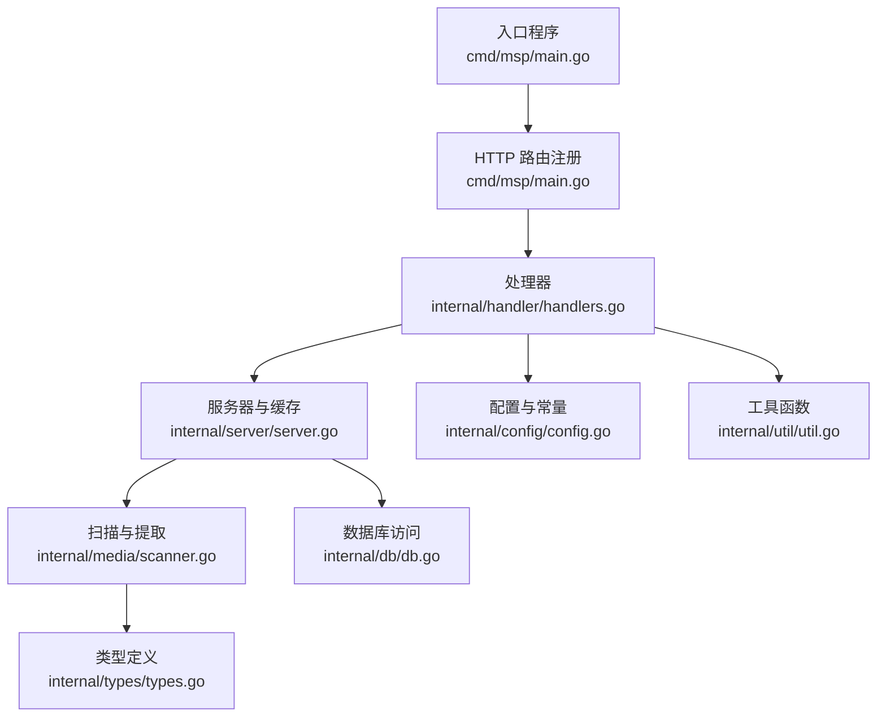
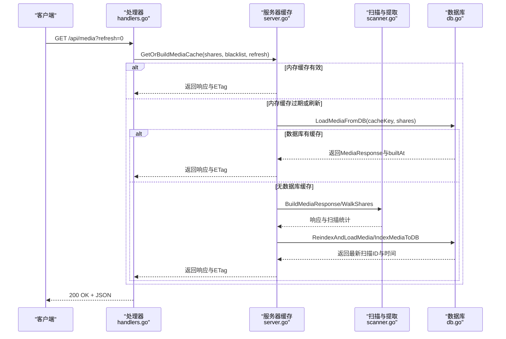
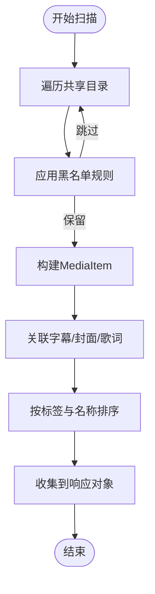
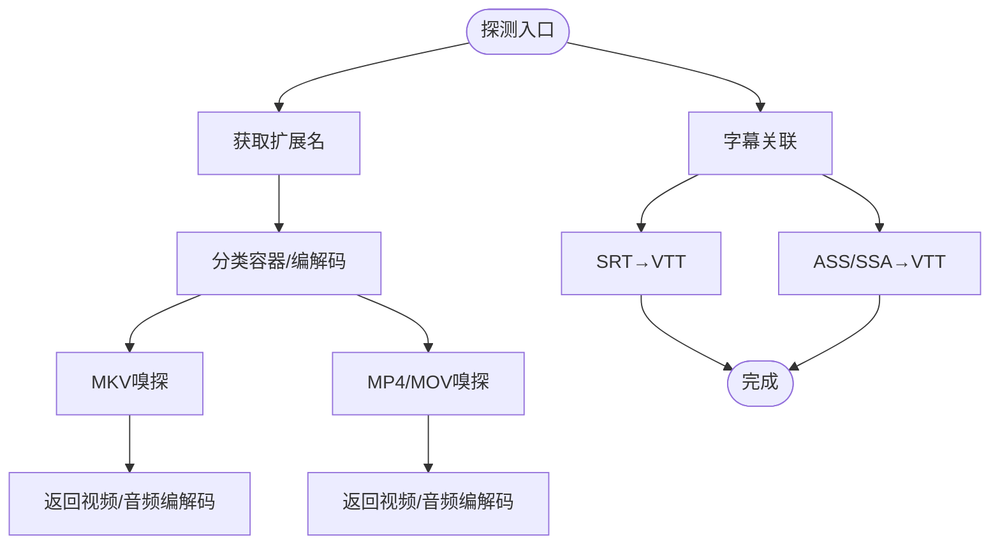
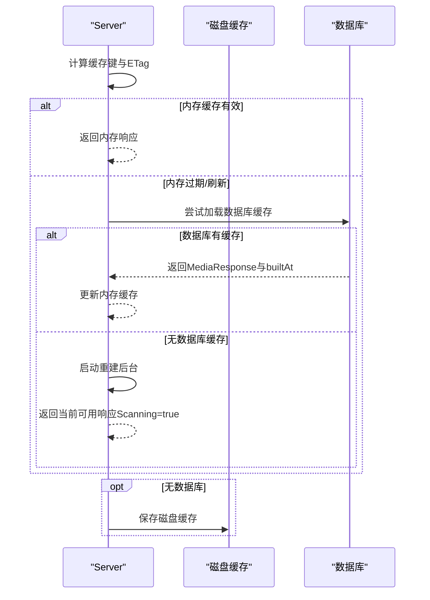
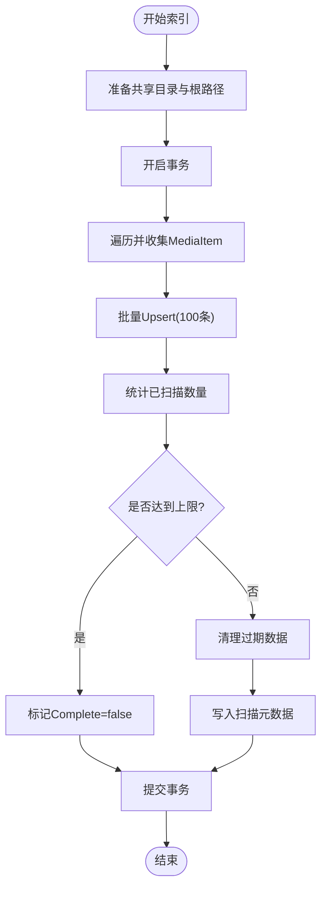
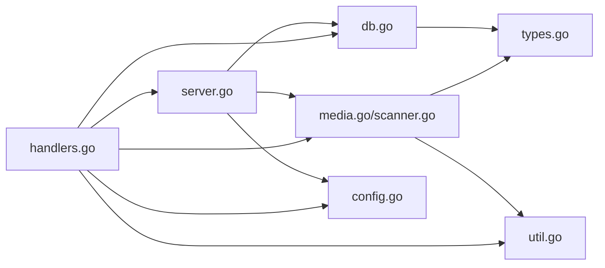

# 元数据提取系统

<cite>
**本文档引用的文件**
- [cmd/msp/main.go](file://cmd/msp/main.go)
- [internal/media/media.go](file://internal/media/media.go)
- [internal/media/scanner.go](file://internal/media/scanner.go)
- [internal/media/store.go](file://internal/media/store.go)
- [internal/media/transcoder.go](file://internal/media/transcoder.go)
- [internal/db/db.go](file://internal/db/db.go)
- [internal/types/types.go](file://internal/types/types.go)
- [internal/server/server.go](file://internal/server/server.go)
- [internal/handler/handlers.go](file://internal/handler/handlers.go)
- [internal/config/config.go](file://internal/config/config.go)
- [internal/constants/constants.go](file://internal/constants/constants.go)
- [internal/util/util.go](file://internal/util/util.go)
- [internal/media/scanner_test.go](file://internal/media/scanner_test.go)
- [internal/db/db_test.go](file://internal/db/db_test.go)
- [README.md](file://README.md)
</cite>

## 目录
1. [简介](#简介)
2. [项目结构](#项目结构)
3. [核心组件](#核心组件)
4. [架构总览](#架构总览)
5. [详细组件分析](#详细组件分析)
6. [依赖关系分析](#依赖关系分析)
7. [性能考量](#性能考量)
8. [故障排查指南](#故障排查指南)
9. [结论](#结论)
10. [附录](#附录)

## 简介
本文件面向元数据提取系统的技术文档，围绕以下目标展开：
- 全面解释媒体文件元数据提取算法，包括视频时长计算、分辨率识别、音频采样率提取、图像尺寸获取等。
- 详细描述元数据缓存机制，包括缓存策略、缓存失效、缓存更新等。
- 解释元数据存储结构，包括数据库字段设计、索引优化、查询性能等。
- 描述元数据同步机制，包括增量更新、批量处理、冲突解决等。
- 提供元数据格式支持列表，包括常见视频格式、音频格式、图片格式的元数据提取方法。
- 包含元数据提取失败的处理策略和错误恢复机制。

## 项目结构
系统采用分层架构，主要模块包括：
- 入口与路由：cmd/msp/main.go 注册 HTTP 路由并启动服务。
- 服务器与缓存：internal/server/server.go 管理媒体缓存、ETag、内存与磁盘持久化。
- 扫描与提取：internal/media/scanner.go 实现目录扫描、媒体分类、字幕/封面/歌词关联。
- 数据库存取：internal/db/db.go 提供 GORM 访问、Upsert、清理过期数据等。
- 响应与接口：internal/handler/handlers.go 处理 API 请求，提供媒体列表、探测、字幕转换等。
- 类型定义：internal/types/types.go 定义数据库模型与 API 结构。
- 配置与常量：internal/config/config.go、internal/constants/constants.go 提供配置与常量。
- 工具函数：internal/util/util.go 提供路径、ID 编解码、安全校验等工具。



**图表来源**
- [cmd/msp/main.go](file://cmd/msp/main.go#L85-L107)
- [internal/handler/handlers.go](file://internal/handler/handlers.go#L333-L362)
- [internal/server/server.go](file://internal/server/server.go#L332-L396)
- [internal/media/scanner.go](file://internal/media/scanner.go#L25-L57)
- [internal/db/db.go](file://internal/db/db.go#L32-L72)
- [internal/types/types.go](file://internal/types/types.go#L16-L66)
- [internal/config/config.go](file://internal/config/config.go#L77-L88)
- [internal/util/util.go](file://internal/util/util.go#L18-L34)

**章节来源**
- [cmd/msp/main.go](file://cmd/msp/main.go#L26-L83)
- [internal/handler/handlers.go](file://internal/handler/handlers.go#L333-L362)
- [internal/server/server.go](file://internal/server/server.go#L31-L74)

## 核心组件
- 媒体扫描与构建响应：internal/media/media.go 提供 BuildMediaResponse，按共享目录与黑名单过滤，构建视频/音频/图片/其他分类列表，并进行排序。
- 目录扫描与过滤：internal/media/scanner.go 实现 WalkShares，支持黑名单扩展名、文件名、文件夹名、大小规则；对字幕、封面、歌词进行关联。
- 缓存与索引：internal/media/store.go 提供 LoadMediaFromDB、ReindexAndLoadMedia、IndexMediaToDB，基于数据库的增量扫描与清理。
- 服务器缓存：internal/server/server.go 实现内存缓存、ETag、磁盘缓存、TTL、重建与广播通知。
- 数据库模型：internal/types/types.go 定义 MediaItem、MediaScan、UserPref、PlaybackProgress 等模型及索引。
- 数据库操作：internal/db/db.go 提供 Upsert、查询、清理、进度存储等。
- 处理器接口：internal/handler/handlers.go 提供 /api/media、/api/probe、/api/stream、/subtitle 等接口。
- 转码与探测：internal/media/transcoder.go 提供 ffprobe/ffmpeg 探测与转码能力。

**章节来源**
- [internal/media/media.go](file://internal/media/media.go#L12-L52)
- [internal/media/scanner.go](file://internal/media/scanner.go#L25-L57)
- [internal/media/store.go](file://internal/media/store.go#L17-L47)
- [internal/server/server.go](file://internal/server/server.go#L31-L74)
- [internal/types/types.go](file://internal/types/types.go#L16-L66)
- [internal/db/db.go](file://internal/db/db.go#L116-L142)
- [internal/handler/handlers.go](file://internal/handler/handlers.go#L581-L621)
- [internal/media/transcoder.go](file://internal/media/transcoder.go#L106-L136)

## 架构总览
系统通过 HTTP 路由接收请求，处理器根据配置与缓存策略选择直接返回或触发扫描/索引流程。扫描阶段使用目录遍历与黑名单过滤，提取媒体基本信息并关联字幕/封面/歌词；索引阶段将结果写入数据库并生成缓存键与 ETag。查询阶段优先命中内存缓存，其次查询数据库，最后回退到磁盘缓存或实时扫描。



**图表来源**
- [internal/handler/handlers.go](file://internal/handler/handlers.go#L333-L362)
- [internal/server/server.go](file://internal/server/server.go#L332-L396)
- [internal/media/store.go](file://internal/media/store.go#L17-L47)
- [internal/media/media.go](file://internal/media/media.go#L12-L52)
- [internal/media/scanner.go](file://internal/media/scanner.go#L25-L57)
- [internal/db/db.go](file://internal/db/db.go#L116-L142)

## 详细组件分析

### 媒体扫描与构建响应
- WalkShares：遍历共享目录，应用黑名单规则（扩展名、文件名、文件夹名、大小），对每个文件构建 MediaItem，关联字幕/封面/歌词。
- BuildMediaResponse：将回调收集的 MediaItem 按共享标签与名称排序，分别归类到视频/音频/图片/其他。
- 黑名单规则：
  - Extensions/Filenames/Folders 支持精确匹配与正则（/pattern/）。
  - SizeRule 支持范围与比较运算符（如 >=100MB、<=1GB、>10MB、<1TB）。
- 字幕/封面/歌词关联：
  - 视频：基于基础名与语言标记匹配字幕，中文优先，首个字幕标记为默认。
  - 音频：封面与歌词文件名匹配策略，支持多种候选命名。



**图表来源**
- [internal/media/scanner.go](file://internal/media/scanner.go#L25-L57)
- [internal/media/scanner.go](file://internal/media/scanner.go#L148-L179)
- [internal/media/scanner.go](file://internal/media/scanner.go#L259-L285)
- [internal/media/media.go](file://internal/media/media.go#L12-L52)

**章节来源**
- [internal/media/scanner.go](file://internal/media/scanner.go#L25-L57)
- [internal/media/scanner.go](file://internal/media/scanner.go#L108-L146)
- [internal/media/scanner.go](file://internal/media/scanner.go#L259-L285)
- [internal/media/media.go](file://internal/media/media.go#L12-L52)

### 元数据提取算法与格式支持
- 容器与编解码嗅探：
  - 通过读取文件头部与尾部（针对 MOV/MP4 原子结构）检测容器类型，匹配特征字符串以识别视频/音频编解码器。
  - 支持 MKV 与 MP4/MP4 家族（MOV）容器。
- 字幕格式转换：
  - SRT → WebVTT：标准化时间轴、换行符与编码。
  - ASS/SSA → WebVTT：解析事件段落、样式标签清理、时间格式转换。
- 格式支持列表：
  - 视频：.mp4、.webm、.mkv、.mov、.avi、.m4v、.wmv
  - 音频：.mp3、.aac、.wav、.flac、.m4a、.ogg、.opus
  - 图片：.jpg、.jpeg、.png、.gif、.webp、.bmp、.svg
  - 字幕：.vtt、.srt、.ass、.ssa
  - 歌词：.lrc



**图表来源**
- [internal/handler/handlers.go](file://internal/handler/handlers.go#L581-L621)
- [internal/media/scanner.go](file://internal/media/scanner.go#L578-L687)
- [internal/media/scanner.go](file://internal/media/scanner.go#L689-L714)
- [internal/media/scanner.go](file://internal/media/scanner.go#L716-L799)

**章节来源**
- [internal/media/scanner.go](file://internal/media/scanner.go#L578-L687)
- [internal/media/scanner.go](file://internal/media/scanner.go#L689-L714)
- [internal/media/scanner.go](file://internal/media/scanner.go#L716-L799)
- [internal/handler/handlers.go](file://internal/handler/handlers.go#L581-L621)

### 元数据缓存机制
- 内存缓存：
  - 键：基于共享目录与黑名单规则生成稳定键，结合构建时间生成弱 ETag。
  - TTL：默认 2 分钟，到期后异步重建。
  - 并发：读写锁保护，广播条件变量通知等待者。
- 磁盘缓存（无数据库时）：
  - 将内存缓存序列化为 JSON 文件，包含键、构建时间与 ETag，便于重启后快速恢复。
- ETag 生成：基于缓存键与构建时间的 FNV 哈希，前缀 W/ 作为弱校验。
- 刷新策略：显式刷新或内存过期时触发后台重建，同时返回当前可用数据。



**图表来源**
- [internal/server/server.go](file://internal/server/server.go#L332-L396)
- [internal/server/server.go](file://internal/server/server.go#L487-L536)
- [internal/server/server.go](file://internal/server/server.go#L556-L568)

**章节来源**
- [internal/server/server.go](file://internal/server/server.go#L322-L396)
- [internal/server/server.go](file://internal/server/server.go#L487-L536)
- [internal/server/server.go](file://internal/server/server.go#L556-L568)

### 元数据存储结构与索引优化
- 数据库模型：
  - MediaItem：主键 ID（路径 Base64）、Path（唯一索引）、Kind（索引）、ShareLabel（索引）、ScanID（多处索引）、CoverID/LyricsID、Subtitles JSON。
  - MediaScan：CacheKey（PK）、ScanID、BuiltAt、Complete。
  - PlaybackProgress：MediaID（PK）、Time。
  - UserPref：Key（PK）、Value。
- 索引设计：
  - MediaItem：Kind、ShareLabel、ScanID 多列索引，提升按扫描会话与类型查询效率。
  - MediaScan：CacheKey 主键，保证按键检索。
- 查询与清理：
  - 按 ScanID 与 Kind 查询媒体列表，自动排序。
  - 清理过期数据：按 ScanID 与共享根目录清理，避免孤儿数据。

```mermaid
erDiagram
MEDIA_ITEM {
string id PK
string path UK
string kind IDX
string share_label IDX
int64 scan_id IDX
string audio_cover
string audio_lyrics
json subtitles
}
MEDIA_SCAN {
string cache_key PK
int64 scan_id
int64 built_at
boolean complete
}
PLAYBACK_PROGRESS {
string media_id PK
float time
}
USER_PREF {
string key PK
string value
}
MEDIA_ITEM ||--o{ SUBTITLE : "has"
MEDIA_ITEM }o--|| MEDIA_SCAN : "belongs_to"
```

**图表来源**
- [internal/types/types.go](file://internal/types/types.go#L16-L66)
- [internal/db/db.go](file://internal/db/db.go#L201-L212)
- [internal/db/db.go](file://internal/db/db.go#L174-L184)

**章节来源**
- [internal/types/types.go](file://internal/types/types.go#L16-L66)
- [internal/db/db.go](file://internal/db/db.go#L201-L212)
- [internal/db/db.go](file://internal/db/db.go#L174-L184)

### 元数据同步机制与增量更新
- 增量扫描：
  - IndexMediaToDB 生成扫描 ID 与时间戳，批量写入 MediaItem，完成后清理过期数据。
  - performScan 使用 100 条批次批量 Upsert，减少事务开销。
- 冲突解决：
  - Upsert 使用 ON CONFLICT UPDATE ALL，保证同 ID 的记录更新。
  - 清理策略：DeleteStaleByScan 与 DeleteByShareRootsNotIn，确保仅保留当前扫描与当前共享根目录内的数据。
- 完成标志：
  - 当扫描数量小于上限时标记 Complete，便于后续缓存策略调整。



**图表来源**
- [internal/media/store.go](file://internal/media/store.go#L49-L94)
- [internal/media/store.go](file://internal/media/store.go#L111-L152)
- [internal/db/db.go](file://internal/db/db.go#L174-L184)
- [internal/db/db.go](file://internal/db/db.go#L186-L199)
- [internal/db/db.go](file://internal/db/db.go#L129-L142)

**章节来源**
- [internal/media/store.go](file://internal/media/store.go#L49-L94)
- [internal/media/store.go](file://internal/media/store.go#L111-L152)
- [internal/db/db.go](file://internal/db/db.go#L129-L142)
- [internal/db/db.go](file://internal/db/db.go#L174-L184)
- [internal/db/db.go](file://internal/db/db.go#L186-L199)

### 处理器接口与错误处理
- /api/media：返回媒体列表，支持 ETag 条件返回与 limit 参数。
- /api/probe：返回容器、视频/音频编解码与字幕列表。
- /api/stream：直播放或转码（受配置与内容类型控制）。
- /api/subtitle：SRT/ASS/SSA 转 VTT，限制大小。
- 错误处理：
  - JSON 解码错误、负载过大、未找到、禁止访问等统一返回 API 错误结构。
  - 转码失败时降级为直播放并记录警告。

**章节来源**
- [internal/handler/handlers.go](file://internal/handler/handlers.go#L333-L362)
- [internal/handler/handlers.go](file://internal/handler/handlers.go#L581-L621)
- [internal/handler/handlers.go](file://internal/handler/handlers.go#L413-L446)
- [internal/handler/handlers.go](file://internal/handler/handlers.go#L623-L684)

### 转码与探测
- ffprobe 探测：获取视频/音频流编解码器名称。
- ffmpeg 转码：限制并发（信号量）、智能参数选择（复制/转码）、格式与比特率控制、偏移与时间戳保留。
- 策略说明：默认直放优先，仅在必要时转码（例如容器或编解码器风险较高时）。

**章节来源**
- [internal/media/transcoder.go](file://internal/media/transcoder.go#L91-L136)
- [internal/media/transcoder.go](file://internal/media/transcoder.go#L138-L248)
- [README.md](file://README.md#L33-L40)

## 依赖关系分析
- 组件耦合：
  - handlers 依赖 server 缓存、config、util；间接依赖 media 与 db。
  - server 依赖 media 扫描与 store、db。
  - media 依赖 config、types、util。
  - db 依赖 types。
- 外部依赖：
  - SQLite + GORM（ORM）、ffmpeg/ffprobe（媒体探测/转码）。
- 循环依赖：
  - 未发现循环导入；各模块职责清晰，接口边界明确。



**图表来源**
- [internal/handler/handlers.go](file://internal/handler/handlers.go#L38-L43)
- [internal/server/server.go](file://internal/server/server.go#L31-L74)
- [internal/media/media.go](file://internal/media/media.go#L12-L52)
- [internal/media/scanner.go](file://internal/media/scanner.go#L25-L57)
- [internal/db/db.go](file://internal/db/db.go#L18-L72)
- [internal/types/types.go](file://internal/types/types.go#L16-L66)
- [internal/util/util.go](file://internal/util/util.go#L18-L34)
- [internal/config/config.go](file://internal/config/config.go#L77-L88)

**章节来源**
- [internal/handler/handlers.go](file://internal/handler/handlers.go#L38-L43)
- [internal/server/server.go](file://internal/server/server.go#L31-L74)
- [internal/media/media.go](file://internal/media/media.go#L12-L52)
- [internal/media/scanner.go](file://internal/media/scanner.go#L25-L57)
- [internal/db/db.go](file://internal/db/db.go#L18-L72)
- [internal/types/types.go](file://internal/types/types.go#L16-L66)
- [internal/util/util.go](file://internal/util/util.go#L18-L34)
- [internal/config/config.go](file://internal/config/config.go#L77-L88)

## 性能考量
- 扫描与索引：
  - 批量写入（100 条/批）降低事务开销。
  - SQLite 单连接 + WAL + NORMAL 同步，兼顾一致性与性能。
- 查询优化：
  - 多列索引（Kind、ShareLabel、ScanID）提升按扫描会话与类型查询效率。
  - 按扫描会话与类型排序，避免额外排序成本。
- 缓存策略：
  - 内存缓存 + 弱 ETag + 磁盘后备，显著降低重复扫描与数据库压力。
  - 2 分钟 TTL 平衡新鲜度与性能。
- 转码并发：
  - 限制并发（2 个）避免 CPU 抢占，保障系统稳定性。

**章节来源**
- [internal/media/store.go](file://internal/media/store.go#L118-L134)
- [internal/db/db.go](file://internal/db/db.go#L54-L69)
- [internal/db/db.go](file://internal/db/db.go#L201-L212)
- [internal/server/server.go](file://internal/server/server.go#L39-L46)
- [internal/media/transcoder.go](file://internal/media/transcoder.go#L15-L17)

## 故障排查指南
- 常见问题与处理：
  - ffprobe/ffmpeg 未安装：转码功能不可用，系统自动降级为直放；可通过 CheckFFprobe/CheckFFmpeg 检测。
  - 转码失败：记录警告并回退直放；检查输入路径、格式与权限。
  - 路径越界/符号链接：IsAllowedFile 与 WithinRoot 防护，确保仅允许共享目录内文件。
  - 数据库异常：DB 为 nil 时降级为内存/磁盘缓存；检查数据库初始化与 WAL 设置。
  - 黑名单误判：检查黑名单规则（扩展名、文件名、文件夹名、大小规则）。
- 测试覆盖：
  - 单元测试涵盖分类、嗅探、字幕转换、路径安全、并发访问等场景。
  - 基准测试覆盖分类、黑名单匹配、SRT→VTT 转换等热点路径。

**章节来源**
- [internal/media/transcoder.go](file://internal/media/transcoder.go#L91-L104)
- [internal/handler/handlers.go](file://internal/handler/handlers.go#L437-L442)
- [internal/util/util.go](file://internal/util/util.go#L148-L182)
- [internal/db/db.go](file://internal/db/db.go#L32-L72)
- [internal/media/scanner_test.go](file://internal/media/scanner_test.go#L432-L447)
- [internal/db/db_test.go](file://internal/db/db_test.go#L471-L501)

## 结论
本系统通过“扫描+索引+缓存”的三层架构，实现了高效、可扩展的元数据提取与服务。扫描阶段利用黑名单与特征嗅探提升准确性；索引阶段以批量写入与多列索引优化查询；缓存阶段以内存+磁盘+ETag 降低重复工作。配合严格的路径安全与错误降级策略，系统在家庭 LAN 场景下具备良好的可用性与性能表现。

## 附录
- 配置项概览（部分）：
  - Port、Shares、Features、UI、Playback（音频/视频/图片）、Blacklist、Security、LogLevel、LogFile、MaxItems。
- 默认行为：
  - 默认端口 8099；默认最大项目数 0（不限制，利于 SQLite 增量扫描）。
  - 默认直放优先，仅在必要时转码。

**章节来源**
- [internal/config/config.go](file://internal/config/config.go#L77-L88)
- [internal/constants/constants.go](file://internal/constants/constants.go#L9-L14)
- [README.md](file://README.md#L33-L40)