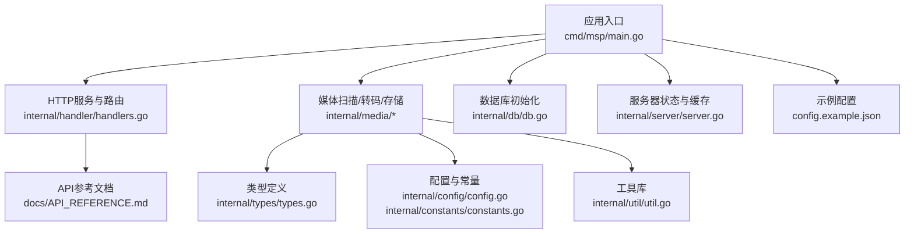
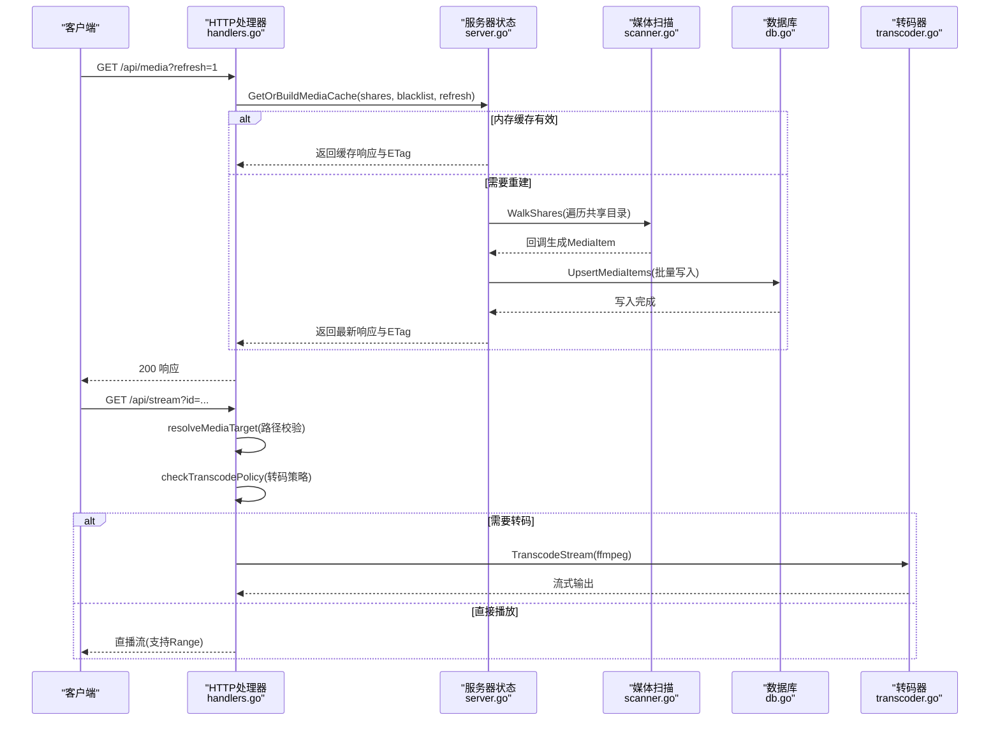
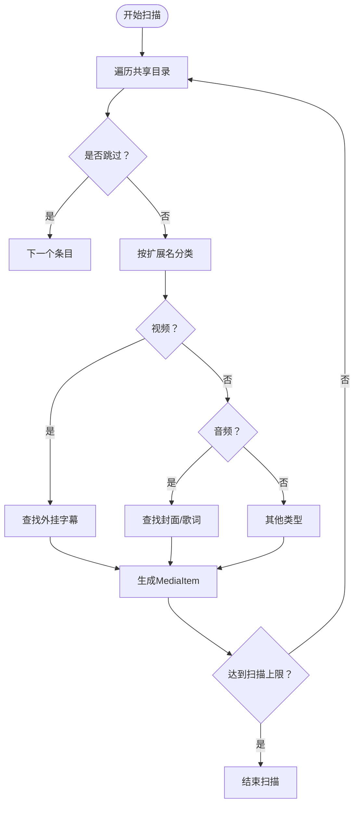
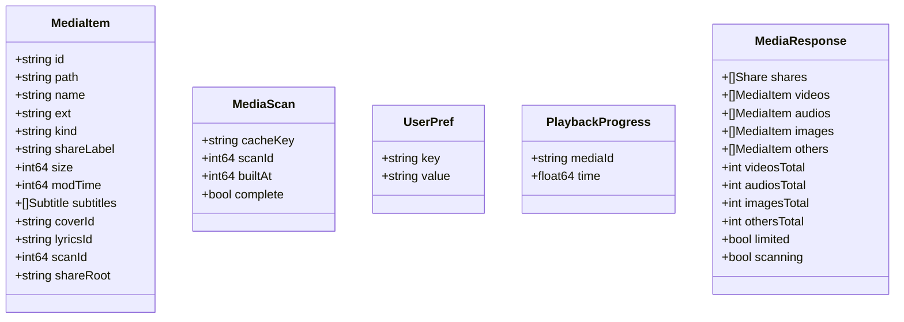
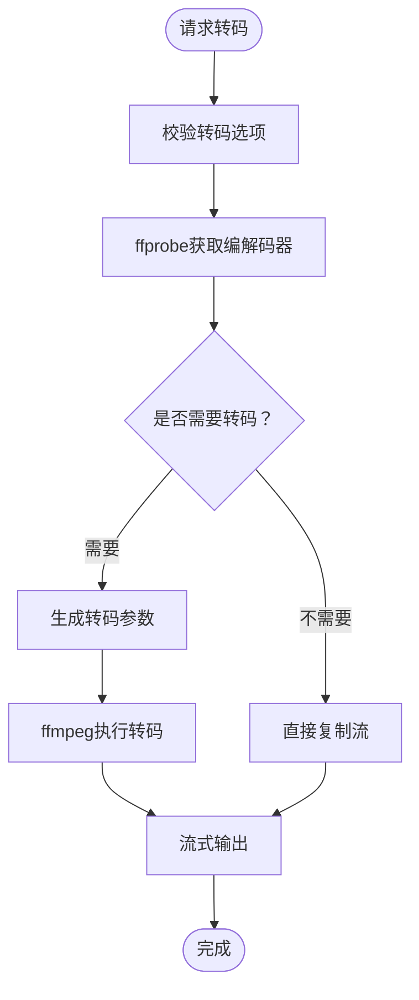
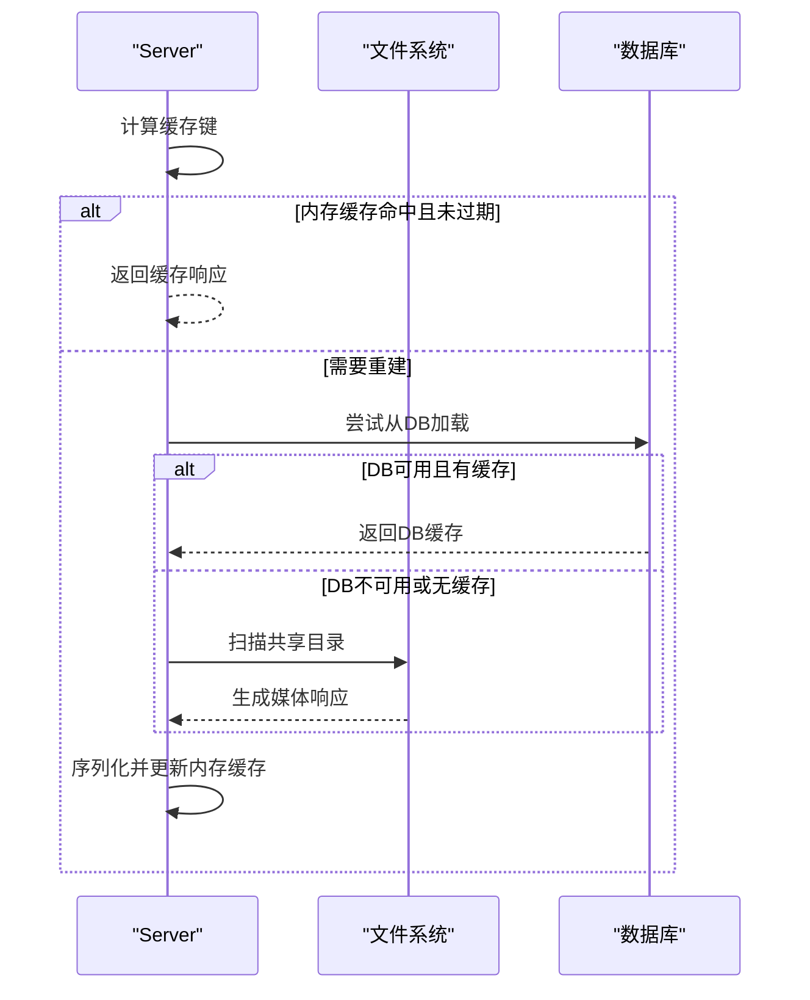
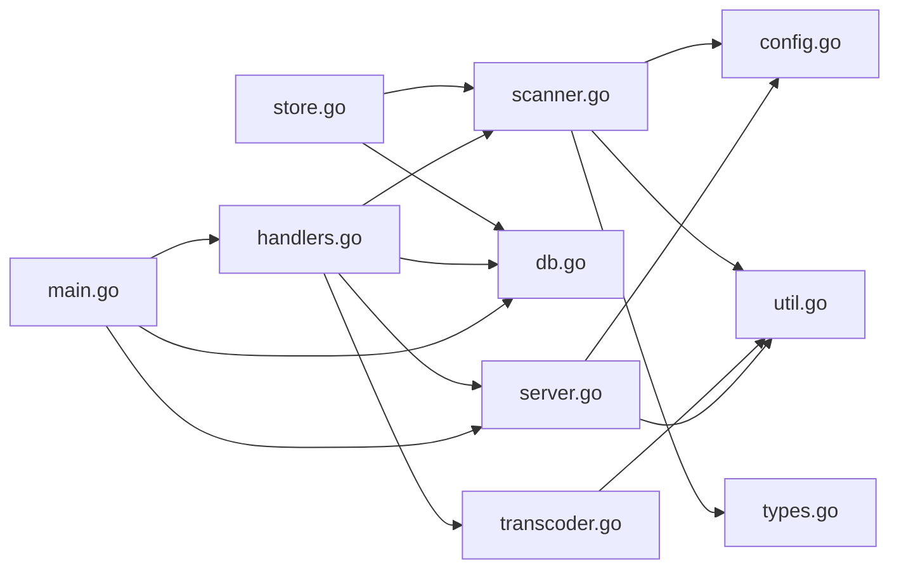

# 媒体处理系统

<cite>
**本文引用的文件**
- [cmd/msp/main.go](file://cmd/msp/main.go)
- [internal/media/scanner.go](file://internal/media/scanner.go)
- [internal/media/transcoder.go](file://internal/media/transcoder.go)
- [internal/media/store.go](file://internal/media/store.go)
- [internal/media/store.go](file://internal/media/store.go)
- [internal/db/db.go](file://internal/db/db.go)
- [internal/types/types.go](file://internal/types/types.go)
- [internal/config/config.go](file://internal/config/config.go)
- [internal/server/server.go](file://internal/server/server.go)
- [internal/handler/handlers.go](file://internal/handler/handlers.go)
- [internal/util/util.go](file://internal/util/util.go)
- [internal/constants/constants.go](file://internal/constants/constants.go)
- [docs/API_REFERENCE.md](file://docs/API_REFERENCE.md)
- [config.example.json](file://config.example.json)
- [README.md](file://README.md)
</cite>

## 目录
1. [简介](#简介)
2. [项目结构](#项目结构)
3. [核心组件](#核心组件)
4. [架构总览](#架构总览)
5. [详细组件分析](#详细组件分析)
6. [依赖关系分析](#依赖关系分析)
7. [性能考量](#性能考量)
8. [故障排除指南](#故障排除指南)
9. [结论](#结论)
10. [附录](#附录)

## 简介
本文件面向MSP项目的媒体处理系统，围绕以下目标展开：媒体扫描引擎（文件系统遍历、类型识别、元数据提取）、媒体索引管理（数据库存储、索引更新、增量扫描）、智能转码系统（直播放优先策略、转码触发条件、质量控制）、媒体存储与缓存机制（临时文件管理、缓存清理策略）、媒体格式支持与兼容性说明，以及性能优化与故障排除建议。文档力求以循序渐进的方式呈现，既适合技术读者深入理解实现细节，也便于非技术用户快速掌握使用要点。

## 项目结构
MSP采用模块化分层设计，核心模块包括：
- 应用入口与HTTP服务：cmd/msp/main.go负责启动HTTP服务器、注册路由、初始化数据库与配置热重载。
- 媒体处理：internal/media/下包含扫描、转码、存储等核心逻辑。
- 数据持久化：internal/db/封装SQLite/GORM操作，提供索引与用户数据的增删改查。
- 类型定义：internal/types/定义数据库模型与API响应结构。
- 配置与常量：internal/config/与internal/constants/分别管理运行配置与系统常量。
- 服务与处理器：internal/server/与internal/handler/分别负责缓存、会话、日志与HTTP路由处理。
- 工具库：internal/util/提供路径规范化、ID编解码、大小解析、IP检测等通用能力。

图表来源
- [cmd/msp/main.go](file://cmd/msp/main.go#L26-L83)
- [internal/handler/handlers.go](file://internal/handler/handlers.go#L38-L43)
- [internal/media/scanner.go](file://internal/media/scanner.go#L1-L800)
- [internal/media/transcoder.go](file://internal/media/transcoder.go#L1-L249)
- [internal/media/store.go](file://internal/media/store.go#L1-L198)
- [internal/db/db.go](file://internal/db/db.go#L32-L72)
- [internal/server/server.go](file://internal/server/server.go#L65-L74)

章节来源
- [cmd/msp/main.go](file://cmd/msp/main.go#L26-L83)
- [internal/handler/handlers.go](file://internal/handler/handlers.go#L38-L43)

## 核心组件
- 媒体扫描引擎：负责遍历共享目录，识别媒体类型，提取元数据（含字幕、封面、歌词），并生成媒体项。
- 媒体索引管理：将扫描结果写入SQLite数据库，支持增量扫描与缓存失效。
- 智能转码系统：根据容器与编解码器风险评估决定是否转码，控制并发与质量。
- 媒体存储与缓存：内存缓存（ETag弱校验）、磁盘缓存（无数据库时使用），以及日志与会话管理。
- API与安全：统一的HTTP接口、PIN认证、IP白黑名单、内容类型与范围请求支持。

章节来源
- [internal/media/scanner.go](file://internal/media/scanner.go#L25-L57)
- [internal/media/store.go](file://internal/media/store.go#L49-L94)
- [internal/media/transcoder.go](file://internal/media/transcoder.go#L138-L249)
- [internal/server/server.go](file://internal/server/server.go#L332-L437)
- [docs/API_REFERENCE.md](file://docs/API_REFERENCE.md#L1-L215)

## 架构总览
MSP的媒体处理系统以“扫描-索引-缓存-播放”为主线，结合数据库与内存缓存实现高效检索与低延迟响应。整体流程如下：

图表来源
- [internal/handler/handlers.go](file://internal/handler/handlers.go#L333-L446)
- [internal/server/server.go](file://internal/server/server.go#L332-L437)
- [internal/media/scanner.go](file://internal/media/scanner.go#L25-L57)
- [internal/db/db.go](file://internal/db/db.go#L159-L172)
- [internal/media/transcoder.go](file://internal/media/transcoder.go#L138-L249)

## 详细组件分析

### 媒体扫描引擎
媒体扫描引擎负责：
- 文件系统遍历：遍历共享目录，尊重黑名单规则（扩展名、文件名、文件夹名、大小规则）。
- 类型识别：根据扩展名将文件归类为video/audio/image/other。
- 元数据提取：为视频附加外挂字幕，为音频附加封面与歌词；通过容器头嗅探获取编解码器信息。
- 字幕与歌词匹配：针对视频文件名进行规范化匹配，支持多语言字幕排序与默认字幕标记。
- 性能优化：目录读取缓存、批量回调、扫描限制与上下文取消。

图表来源
- [internal/media/scanner.go](file://internal/media/scanner.go#L25-L106)
- [internal/media/scanner.go](file://internal/media/scanner.go#L148-L179)
- [internal/media/scanner.go](file://internal/media/scanner.go#L259-L285)
- [internal/media/scanner.go](file://internal/media/scanner.go#L490-L509)

章节来源
- [internal/media/scanner.go](file://internal/media/scanner.go#L25-L106)
- [internal/media/scanner.go](file://internal/media/scanner.go#L148-L179)
- [internal/media/scanner.go](file://internal/media/scanner.go#L259-L285)
- [internal/media/scanner.go](file://internal/media/scanner.go#L490-L509)

### 媒体索引管理机制
索引管理通过数据库实现：
- 数据模型：MediaItem、MediaScan、UserPref、PlaybackProgress。
- 索引流程：准备共享根目录、开启事务、批量写入、清理过期数据、更新扫描元数据、提交事务。
- 缓存策略：内存缓存（ETag弱校验）、磁盘缓存（无数据库时使用）、配置热重载。
- 查询与统计：按扫描ID与类型查询、统计数量、按标签排序。

图表来源
- [internal/types/types.go](file://internal/types/types.go#L16-L66)

章节来源
- [internal/media/store.go](file://internal/media/store.go#L49-L94)
- [internal/media/store.go](file://internal/media/store.go#L111-L152)
- [internal/db/db.go](file://internal/db/db.go#L116-L142)
- [internal/db/db.go](file://internal/db/db.go#L201-L212)

### 智能转码系统
转码系统遵循“直连优先、按需转码”的策略：
- 并发控制：全局信号量限制同时转码会话数量，避免CPU资源枯竭。
- 转码选项：格式白名单（mp4、mp3、aac、webm、ogg），码率校验，起始偏移。
- 编解码器探测：使用ffprobe获取视频/音频编解码器，作为转码决策依据。
- 转码参数：视频优先复制h264，否则使用libx264 fast预设；音频优先复制aac/mp3，否则转aac；MP4输出启用faststart；保留时间戳以支持进度条。
- 回退策略：转码失败时回退到直接播放。

图表来源
- [internal/media/transcoder.go](file://internal/media/transcoder.go#L36-L70)
- [internal/media/transcoder.go](file://internal/media/transcoder.go#L106-L136)
- [internal/media/transcoder.go](file://internal/media/transcoder.go#L175-L222)
- [internal/media/transcoder.go](file://internal/media/transcoder.go#L226-L248)

章节来源
- [internal/media/transcoder.go](file://internal/media/transcoder.go#L138-L249)
- [internal/handler/handlers.go](file://internal/handler/handlers.go#L513-L564)

### 媒体存储与缓存机制
- 内存缓存：服务器维护媒体响应的JSON字节、ETag、构建时间与键，支持弱ETag校验与TTL失效。
- 磁盘缓存：当数据库未初始化时，将媒体缓存序列化到磁盘文件，启动时尝试加载。
- 配置热重载：监控配置文件变更，自动重载并使缓存失效。
- 日志与会话：统一日志级别与轮转策略，PIN认证会话管理。

图表来源
- [internal/server/server.go](file://internal/server/server.go#L332-L437)
- [internal/media/store.go](file://internal/media/store.go#L17-L31)

章节来源
- [internal/server/server.go](file://internal/server/server.go#L332-L437)
- [internal/media/store.go](file://internal/media/store.go#L17-L31)

### API与安全
- API参考：涵盖配置、共享目录、媒体索引、流媒体、字幕、探针、播放进度、偏好设置、系统与安全等端点。
- 安全：IP白名单/黑名单、PIN认证（HttpOnly Cookie）、会话令牌、常量时间比较防时序攻击。
- 内容类型与范围请求：根据扩展名确定Content-Type，支持Accept-Ranges与缓存控制。

章节来源
- [docs/API_REFERENCE.md](file://docs/API_REFERENCE.md#L1-L215)
- [internal/handler/handlers.go](file://internal/handler/handlers.go#L255-L331)
- [internal/handler/handlers.go](file://internal/handler/handlers.go#L488-L511)

## 依赖关系分析
- 模块耦合：媒体扫描依赖配置与工具库；索引管理依赖数据库；转码依赖外部工具；HTTP处理器依赖服务器状态与配置。
- 外部依赖：GORM（SQLite）、ffmpeg/ffprobe（媒体处理）、浏览器前端（静态资源）。
- 循环依赖：未发现循环导入；各模块职责清晰，通过接口与类型进行交互。

图表来源
- [internal/media/scanner.go](file://internal/media/scanner.go#L1-L19)
- [internal/media/store.go](file://internal/media/store.go#L1-L15)
- [internal/media/transcoder.go](file://internal/media/transcoder.go#L1-L13)
- [internal/handler/handlers.go](file://internal/handler/handlers.go#L3-L26)
- [internal/server/server.go](file://internal/server/server.go#L3-L29)
- [cmd/msp/main.go](file://cmd/msp/main.go#L3-L24)

章节来源
- [internal/media/scanner.go](file://internal/media/scanner.go#L1-L19)
- [internal/media/store.go](file://internal/media/store.go#L1-L15)
- [internal/media/transcoder.go](file://internal/media/transcoder.go#L1-L13)
- [internal/handler/handlers.go](file://internal/handler/handlers.go#L3-L26)
- [internal/server/server.go](file://internal/server/server.go#L3-L29)
- [cmd/msp/main.go](file://cmd/msp/main.go#L3-L24)

## 性能考量
- 扫描与索引
  - 批量写入：使用批量插入减少事务开销。
  - 扫描限制：默认上限避免长时间扫描阻塞。
  - 目录缓存：减少重复读取目录的IO。
- 转码
  - 并发限制：全局信号量限制同时转码任务数量。
  - 参数优化：libx264 fast预设、yuv420p像素格式、faststart优化、线程数限制。
  - 编解码器探测：仅在必要时转码，优先复制。
- 缓存
  - 内存缓存：ETag弱校验与TTL，降低重复扫描成本。
  - 磁盘缓存：无数据库时的降级方案。
- IO与网络
  - 直接播放支持Range请求，提升大文件播放体验。
  - 大文件设置较长缓存，小文件禁用缓存，平衡性能与一致性。

章节来源
- [internal/media/store.go](file://internal/media/store.go#L118-L151)
- [internal/media/transcoder.go](file://internal/media/transcoder.go#L15-L17)
- [internal/media/transcoder.go](file://internal/media/transcoder.go#L200-L206)
- [internal/server/server.go](file://internal/server/server.go#L556-L568)
- [internal/handler/handlers.go](file://internal/handler/handlers.go#L566-L579)

## 故障排除指南
- 数据库问题
  - 初始化失败：检查数据库路径权限与SQLite可用性；确认WAL与同步模式设置。
  - 写入冲突：使用ON CONFLICT更新策略；确保唯一索引（如MediaItem.id）。
- 扫描异常
  - 路径不可达：确认共享目录存在且可访问；使用规范化路径。
  - 黑名单误判：检查扩展名、文件名、文件夹名与大小规则。
- 转码失败
  - ffmpeg/ffprobe缺失：安装并确保PATH可用；检查转码选项格式。
  - 并发超限：调整并发限制或等待现有任务完成。
- 缓存与响应
  - 缓存未更新：强制刷新参数或等待TTL到期；检查ETag匹配。
  - 直播播放失败：尝试转码参数或更换格式；检查容器与编解码器兼容性。
- 安全与认证
  - PIN错误：确认PIN长度与配置；使用常量时间比较避免时序泄露。
  - IP限制：核对白名单/黑名单配置。

章节来源
- [internal/db/db.go](file://internal/db/db.go#L32-L72)
- [internal/media/store.go](file://internal/media/store.go#L51-L94)
- [internal/media/transcoder.go](file://internal/media/transcoder.go#L91-L104)
- [internal/handler/handlers.go](file://internal/handler/handlers.go#L513-L564)
- [internal/server/server.go](file://internal/server/server.go#L570-L626)

## 结论
MSP媒体处理系统通过“扫描-索引-缓存-播放”的闭环设计，在保证易用性的同时兼顾性能与可靠性。扫描引擎提供精准的媒体识别与元数据提取；索引管理以SQLite为基础实现高效检索；智能转码系统在直连优先的前提下按需转码；缓存与安全机制共同保障用户体验与系统稳定。建议在生产环境中合理配置扫描上限、并发限制与缓存策略，并定期检查外部依赖（ffmpeg/ffprobe）与数据库状态。

## 附录

### 媒体格式支持与兼容性
- 支持容器与扩展名
  - 视频：mp4、m4v、webm、mkv、mov、avi、wmv、ts
  - 音频：mp3、aac、wav、flac、m4a、ogg、opus
  - 图像：jpg/jpeg、png、gif、webp、bmp、svg
  - 字幕：vtt、srt、ass、ssa
  - 歌词：lrc
- 编解码器嗅探
  - MKV：H.265/HEVC、H.264/AVC、AV1、VP9、AC-3/E-AC-3、Opus、AAC/Vorbis、FLAC、DTS、TrueHD
  - MP4/MOV：hvc1/hev1、avc1、av01、vp09、ec-3/ac-3、mp4a、opus
- 兼容性建议
  - 优先使用H.264/AAC组合以获得最佳兼容性。
  - 对高风险容器（如AVI/WMV）与高风险编解码器（HEVC/H.265、VC-1、AC-3、DTS、TrueHD）建议启用转码。

章节来源
- [internal/media/scanner.go](file://internal/media/scanner.go#L233-L246)
- [internal/media/scanner.go](file://internal/media/scanner.go#L618-L687)
- [README.md](file://README.md#L33-L40)

### 配置与示例
- 关键配置项
  - 端口、共享目录、功能开关、UI设置、播放策略、黑名单、安全策略、日志级别与文件。
- 示例配置
  - 参考示例文件，按需修改端口、共享目录、转码开关与安全设置。

章节来源
- [config.example.json](file://config.example.json#L1-L56)
- [internal/config/config.go](file://internal/config/config.go#L77-L88)