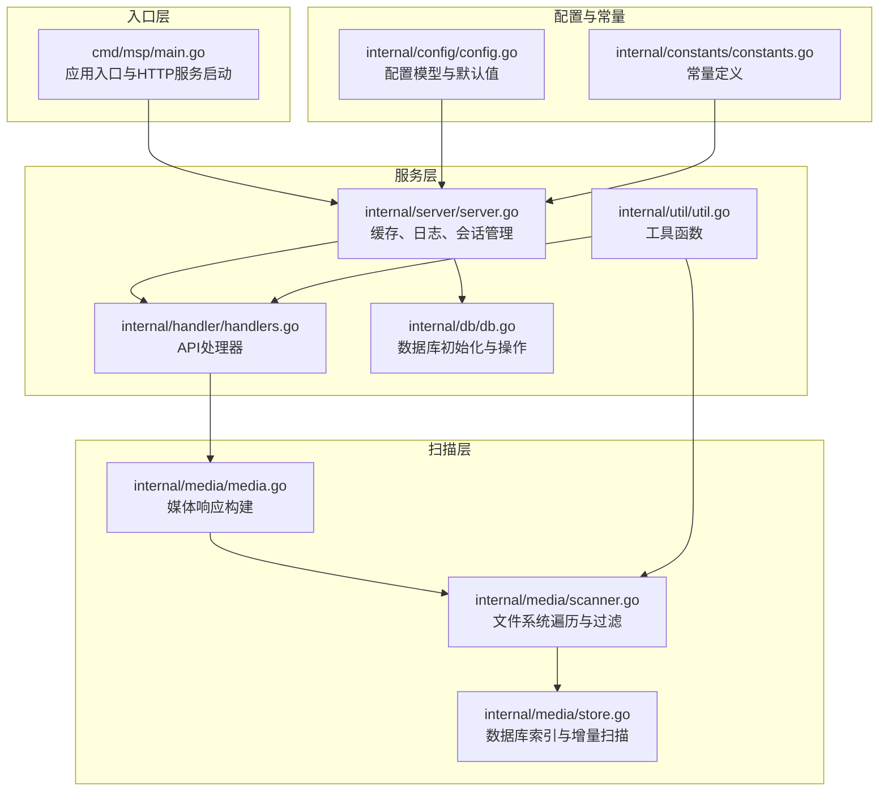
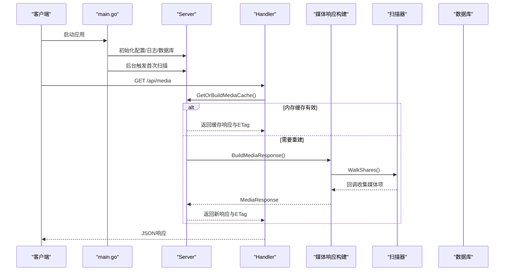
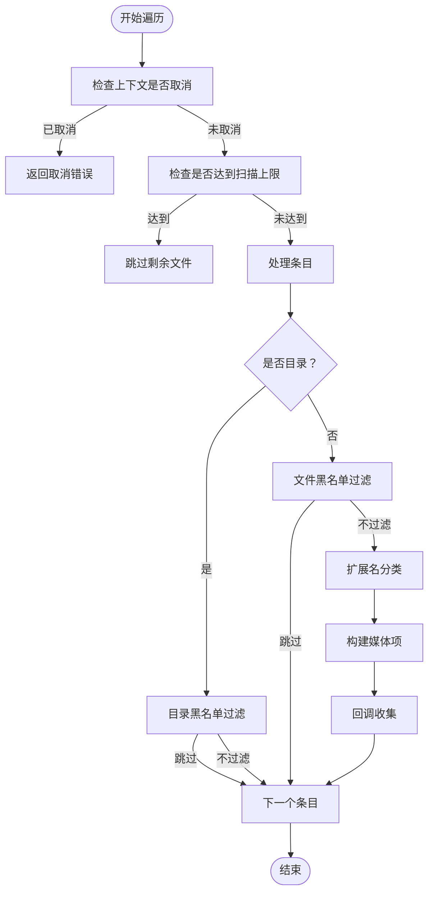
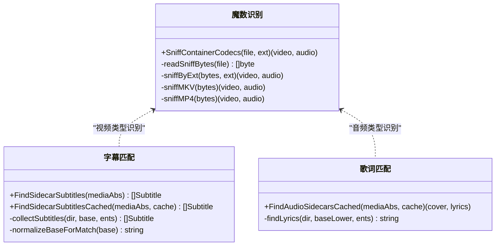
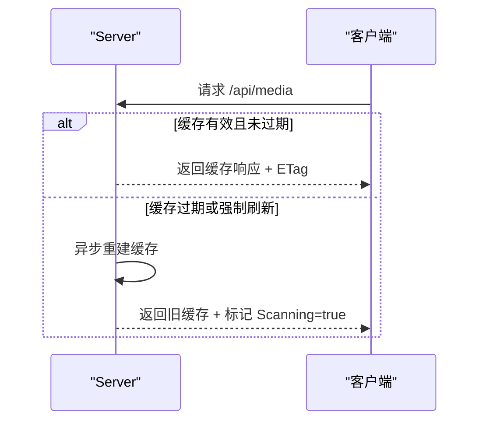
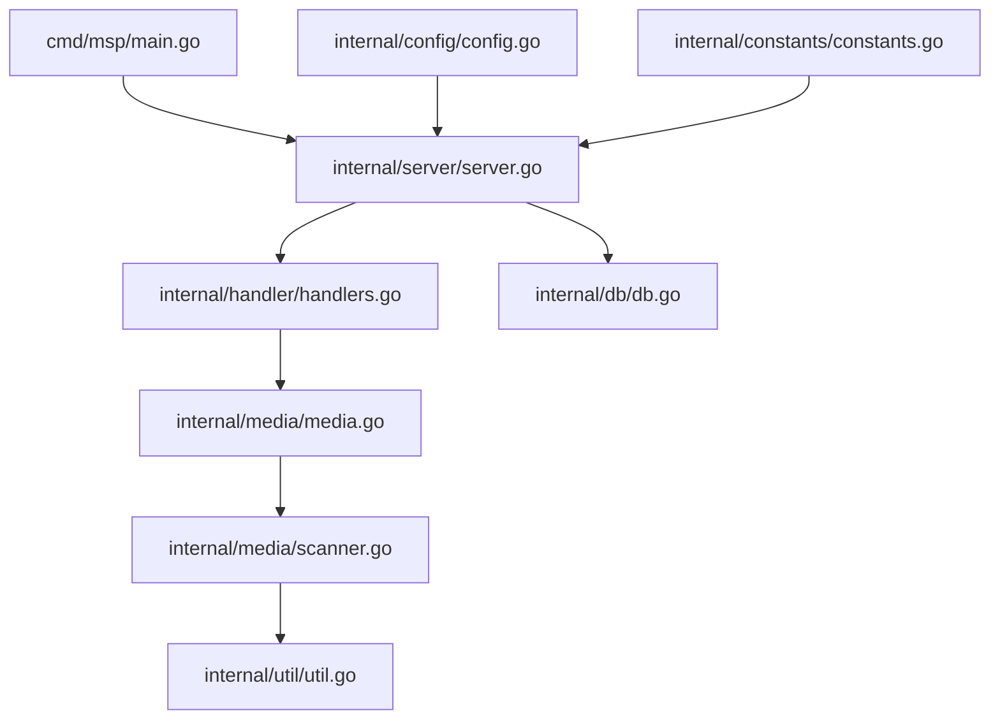

# 媒体扫描引擎

<cite>
**本文档引用的文件**
- [cmd/msp/main.go](file://cmd/msp/main.go)
- [internal/media/scanner.go](file://internal/media/scanner.go)
- [internal/media/media.go](file://internal/media/media.go)
- [internal/media/store.go](file://internal/media/store.go)
- [internal/config/config.go](file://internal/config/config.go)
- [internal/constants/constants.go](file://internal/constants/constants.go)
- [internal/server/server.go](file://internal/server/server.go)
- [internal/handler/handlers.go](file://internal/handler/handlers.go)
- [internal/util/util.go](file://internal/util/util.go)
- [internal/db/db.go](file://internal/db/db.go)
- [docs/CONFIG_EXAMPLE.md](file://docs/CONFIG_EXAMPLE.md)
- [PERFORMANCE_ANALYSIS.md](file://PERFORMANCE_ANALYSIS.md)
</cite>

## 目录
1. [简介](#简介)
2. [项目结构](#项目结构)
3. [核心组件](#核心组件)
4. [架构总览](#架构总览)
5. [详细组件分析](#详细组件分析)
6. [依赖关系分析](#依赖关系分析)
7. [性能考量](#性能考量)
8. [故障排查指南](#故障排查指南)
9. [结论](#结论)
10. [附录](#附录)

## 简介
本文件为媒体扫描引擎的详细技术文档，聚焦于文件系统遍历算法、文件类型识别、扫描进度与状态管理、性能优化策略以及扫描配置选项。文档基于仓库现有实现进行深入分析，帮助开发者与运维人员理解扫描流程、优化策略与最佳实践。

## 项目结构
媒体扫描引擎采用分层架构，入口程序负责初始化配置、数据库与HTTP服务；扫描模块负责文件系统遍历与媒体识别；服务层负责缓存与持久化；处理器层负责API路由与内容传输；工具层提供通用辅助能力。

**图表来源**
- [cmd/msp/main.go](file://cmd/msp/main.go#L26-L83)
- [internal/server/server.go](file://internal/server/server.go#L31-L74)
- [internal/handler/handlers.go](file://internal/handler/handlers.go#L38-L43)
- [internal/media/media.go](file://internal/media/media.go#L12-L52)
- [internal/media/scanner.go](file://internal/media/scanner.go#L25-L57)
- [internal/media/store.go](file://internal/media/store.go#L49-L94)
- [internal/config/config.go](file://internal/config/config.go#L77-L88)
- [internal/constants/constants.go](file://internal/constants/constants.go#L5-L115)
- [internal/util/util.go](file://internal/util/util.go#L18-L34)
- [internal/db/db.go](file://internal/db/db.go#L32-L72)

**章节来源**
- [cmd/msp/main.go](file://cmd/msp/main.go#L26-L83)
- [internal/server/server.go](file://internal/server/server.go#L31-L74)

## 核心组件
- 文件系统遍历与过滤：基于filepath.WalkDir的递归扫描，结合黑名单规则与数量限制，支持上下文取消。
- 媒体类型识别：扩展名分类、字幕与歌词侧车文件匹配、容器魔数识别。
- 响应构建：按类型聚合媒体项，支持排序与限制。
- 缓存与持久化：内存缓存（含ETag）、磁盘缓存、SQLite索引与增量扫描。
- 配置与安全：配置热重载、IP白名单/黑名单、PIN认证。

**章节来源**
- [internal/media/scanner.go](file://internal/media/scanner.go#L25-L57)
- [internal/media/media.go](file://internal/media/media.go#L12-L52)
- [internal/server/server.go](file://internal/server/server.go#L332-L437)
- [internal/config/config.go](file://internal/config/config.go#L49-L88)

## 架构总览
媒体扫描引擎通过HTTP接口对外提供服务，内部以“扫描-缓存-响应”为主线，结合数据库实现增量索引与快速查询。

**图表来源**
- [cmd/msp/main.go](file://cmd/msp/main.go#L50-L51)
- [internal/server/server.go](file://internal/server/server.go#L332-L396)
- [internal/handler/handlers.go](file://internal/handler/handlers.go#L333-L362)
- [internal/media/media.go](file://internal/media/media.go#L12-L52)
- [internal/media/scanner.go](file://internal/media/scanner.go#L25-L57)

## 详细组件分析

### 文件系统遍历与过滤
- 递归扫描策略：使用filepath.WalkDir遍历共享目录，遇到目录时根据黑名单决定是否跳过，遇到文件时进行过滤与类型识别。
- 黑名单处理机制：
  - 目录过滤：隐藏目录（以.开头）、文件夹名匹配、正则支持。
  - 文件过滤：扩展名黑名单、文件名黑名单、字幕/歌词扩展名自动排除、文件大小规则（支持范围与比较运算符）。
- 上下文与限流：支持上下文取消、扫描上限（默认10万，SQLite场景可达10亿），避免无限扫描。
- 目录缓存：对目录内容进行缓存，减少重复读取，提升字幕/歌词侧车文件查找效率。

**图表来源**
- [internal/media/scanner.go](file://internal/media/scanner.go#L68-L106)
- [internal/media/scanner.go](file://internal/media/scanner.go#L108-L146)
- [internal/media/scanner.go](file://internal/media/scanner.go#L233-L246)

**章节来源**
- [internal/media/scanner.go](file://internal/media/scanner.go#L25-L57)
- [internal/media/scanner.go](file://internal/media/scanner.go#L108-L146)
- [internal/media/scanner.go](file://internal/media/scanner.go#L233-L246)
- [internal/constants/constants.go](file://internal/constants/constants.go#L52-L59)

### 文件类型识别与魔数检测
- 扩展名分类：对常见音视频图片扩展名进行分类，区分video/audio/image/other。
- 字幕与歌词侧车文件：视频文件旁的字幕（.vtt/.srt/.ass/.ssa）与音频文件旁的歌词（.lrc）自动关联，中文字幕优先。
- 容器魔数识别：针对MKV/MP4/MOV等容器，读取头部与尾部特征字节，识别视频/音频编码类型（如H.264/HEVC/AV1/Vorbis/FLAC等）。

**图表来源**
- [internal/media/scanner.go](file://internal/media/scanner.go#L578-L626)
- [internal/media/scanner.go](file://internal/media/scanner.go#L628-L640)
- [internal/media/scanner.go](file://internal/media/scanner.go#L259-L285)
- [internal/media/scanner.go](file://internal/media/scanner.go#L490-L509)

**章节来源**
- [internal/media/scanner.go](file://internal/media/scanner.go#L578-L626)
- [internal/media/scanner.go](file://internal/media/scanner.go#L628-L640)
- [internal/media/scanner.go](file://internal/media/scanner.go#L259-L285)
- [internal/media/scanner.go](file://internal/media/scanner.go#L490-L509)

### 媒体响应构建与排序
- 按类型聚合：将扫描结果分为视频、音频、图片与其他类型。
- 排序规则：先按共享标签排序，再按名称排序（大小写不敏感）。
- 限制输出：支持limit参数裁剪响应，避免一次性返回过多数据。

**章节来源**
- [internal/media/media.go](file://internal/media/media.go#L12-L52)
- [internal/handler/handlers.go](file://internal/handler/handlers.go#L364-L396)

### 缓存与状态管理
- 内存缓存：包含响应JSON、ETag、构建时间与失效时间（TTL），支持并发条件变量通知。
- 磁盘缓存：在无数据库时将响应序列化到磁盘文件，加速启动。
- 弱ETag：基于缓存键与构建时间生成弱校验标识，支持条件请求。
- 重建策略：缓存过期或刷新时异步重建，保证请求快速返回旧数据。

**图表来源**
- [internal/server/server.go](file://internal/server/server.go#L332-L396)
- [internal/server/server.go](file://internal/server/server.go#L439-L441)

**章节来源**
- [internal/server/server.go](file://internal/server/server.go#L332-L437)
- [internal/server/server.go](file://internal/server/server.go#L480-L536)

### 数据库索引与增量扫描
- 索引流程：开启事务，批量扫描并写入数据库，完成后再提交；支持清理过期数据与孤儿数据。
- 扫描元数据：记录扫描会话ID、构建时间与完成状态，便于查询与清理。
- 批量写入：使用批量UPSERT减少写入开销，提升吞吐。

**章节来源**
- [internal/media/store.go](file://internal/media/store.go#L49-L94)
- [internal/media/store.go](file://internal/media/store.go#L111-L152)
- [internal/db/db.go](file://internal/db/db.go#L101-L142)

### 配置与安全
- 配置模型：包含端口、共享目录、功能开关、UI设置、播放策略、黑名单、安全策略与日志级别。
- 默认值：未配置字段自动填充默认值，确保系统稳定运行。
- 安全策略：IP白名单/黑名单、PIN认证（会话Cookie），支持热重载。

**章节来源**
- [internal/config/config.go](file://internal/config/config.go#L77-L146)
- [docs/CONFIG_EXAMPLE.md](file://docs/CONFIG_EXAMPLE.md#L94-L134)
- [internal/server/server.go](file://internal/server/server.go#L140-L188)

## 依赖关系分析

**图表来源**
- [cmd/msp/main.go](file://cmd/msp/main.go#L30-L45)
- [internal/server/server.go](file://internal/server/server.go#L31-L74)
- [internal/handler/handlers.go](file://internal/handler/handlers.go#L38-L43)
- [internal/media/media.go](file://internal/media/media.go#L12-L52)
- [internal/media/scanner.go](file://internal/media/scanner.go#L25-L57)
- [internal/util/util.go](file://internal/util/util.go#L18-L34)
- [internal/db/db.go](file://internal/db/db.go#L32-L72)
- [internal/config/config.go](file://internal/config/config.go#L77-L88)
- [internal/constants/constants.go](file://internal/constants/constants.go#L5-L115)

**章节来源**
- [cmd/msp/main.go](file://cmd/msp/main.go#L30-L45)
- [internal/server/server.go](file://internal/server/server.go#L31-L74)

## 性能考量
- 扫描性能优化
  - 批量写入：数据库索引阶段使用批量UPSERT，减少事务次数。
  - 目录缓存：避免重复读取目录，降低I/O压力。
  - 上下文取消：及时响应取消信号，避免无效扫描。
  - 默认扫描上限：防止大规模扫描导致资源耗尽。
- 内存管理
  - 积极GC与内存回收：启动时设置GC比例，索引完成后主动回收。
  - 缓存键与ETag：减少重复序列化与传输。
- I/O优化
  - SQLite WAL模式与连接池优化，减少锁竞争。
  - 大文件直传与缓存策略：提升播放体验。
- 并发扫描
  - 当前实现为单线程扫描，建议在保持一致性前提下引入轻量并发（如按共享目录并行扫描，合并结果）。

**章节来源**
- [internal/media/store.go](file://internal/media/store.go#L111-L152)
- [internal/media/scanner.go](file://internal/media/scanner.go#L37-L38)
- [cmd/msp/main.go](file://cmd/msp/main.go#L27)
- [internal/db/db.go](file://internal/db/db.go#L54-L69)
- [PERFORMANCE_ANALYSIS.md](file://PERFORMANCE_ANALYSIS.md#L54-L127)

## 故障排查指南
- 扫描无结果
  - 检查共享目录是否正确配置且存在，确认路径规范化与去重逻辑。
  - 核对黑名单规则是否误判，特别是扩展名、文件名与文件夹名。
- 扫描卡顿或超时
  - 检查扫描上限与上下文取消是否生效，确认是否有大目录导致I/O瓶颈。
  - 关注日志中的慢查询与错误信息。
- 响应缓存异常
  - 检查ETag生成与条件请求处理，确认缓存键是否随配置变化而更新。
  - 若使用磁盘缓存，确认缓存文件读写权限与路径。
- 数据库相关
  - 确认数据库初始化成功，WAL模式与PRAGMA设置是否生效。
  - 检查索引与事务配置，避免长时间锁等待。
- 安全与访问控制
  - 核对IP白名单/黑名单与PIN配置，确认热重载是否生效。

**章节来源**
- [internal/util/util.go](file://internal/util/util.go#L101-L140)
- [internal/media/scanner.go](file://internal/media/scanner.go#L108-L146)
- [internal/server/server.go](file://internal/server/server.go#L332-L437)
- [internal/db/db.go](file://internal/db/db.go#L32-L72)
- [internal/handler/handlers.go](file://internal/handler/handlers.go#L398-L411)

## 结论
媒体扫描引擎通过清晰的分层设计与完善的扫描、缓存与持久化机制，实现了高效、稳定的媒体索引与检索能力。建议在保持一致性的基础上进一步探索并发扫描与缓存淘汰策略，以应对更大规模的数据集与更高的并发需求。

## 附录

### 扫描配置选项说明
- 基本配置：端口、日志级别与文件、最大扫描项目数、共享目录列表。
- 功能配置：播放速度、画质选择、字幕与播放列表开关。
- UI配置：默认标签页、是否显示其他类型。
- 播放配置：音频/视频/图片播放范围与转码策略。
- 黑名单配置：扩展名、文件名、文件夹名与文件大小规则。
- 安全配置：IP白名单/黑名单、PIN认证与会话管理。

**章节来源**
- [docs/CONFIG_EXAMPLE.md](file://docs/CONFIG_EXAMPLE.md#L6-L24)
- [docs/CONFIG_EXAMPLE.md](file://docs/CONFIG_EXAMPLE.md#L26-L92)
- [docs/CONFIG_EXAMPLE.md](file://docs/CONFIG_EXAMPLE.md#L94-L134)
- [internal/config/config.go](file://internal/config/config.go#L77-L146)