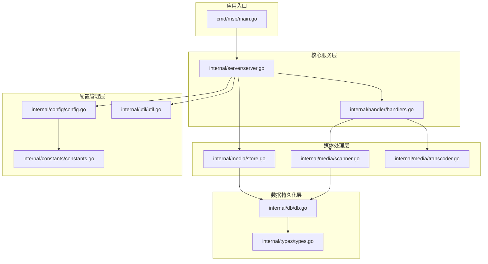
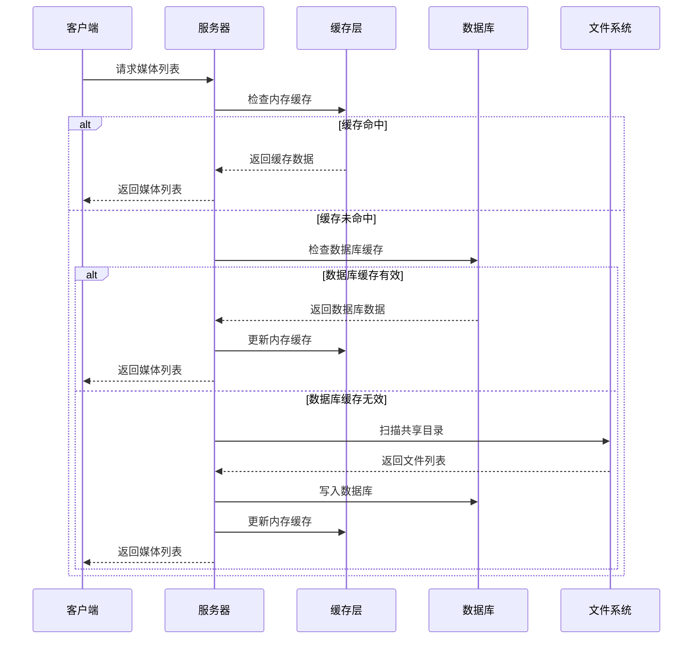
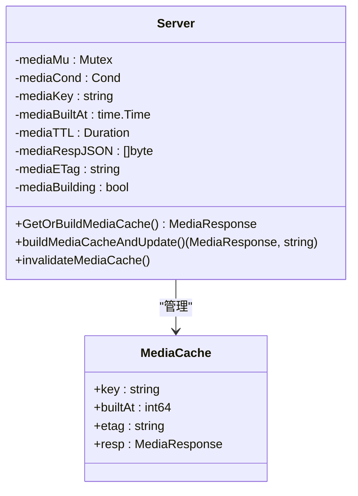
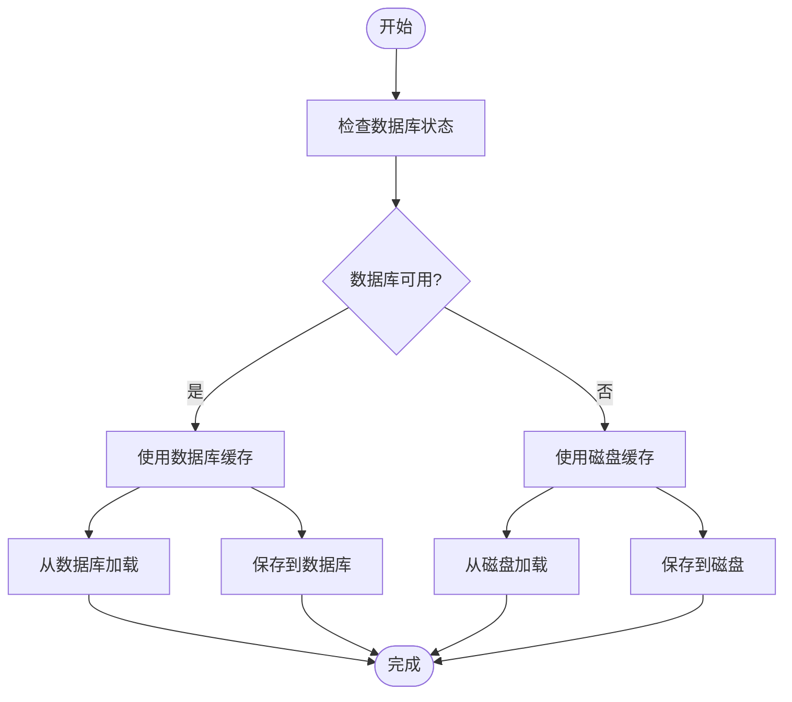
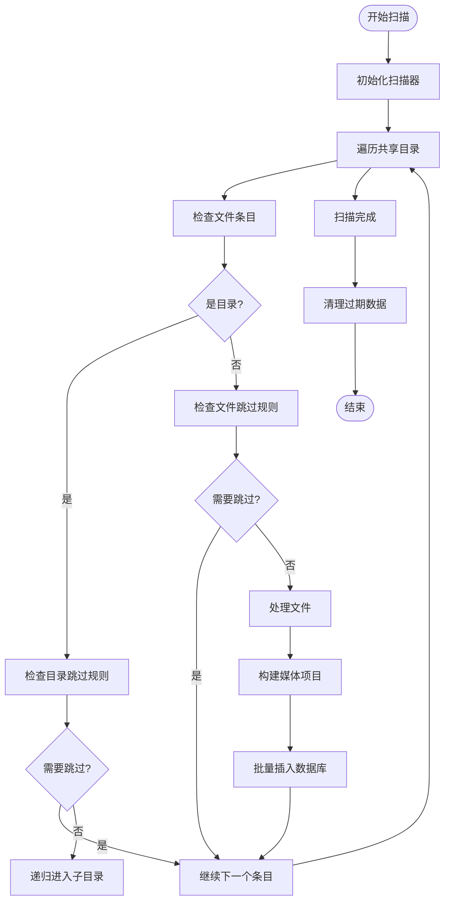
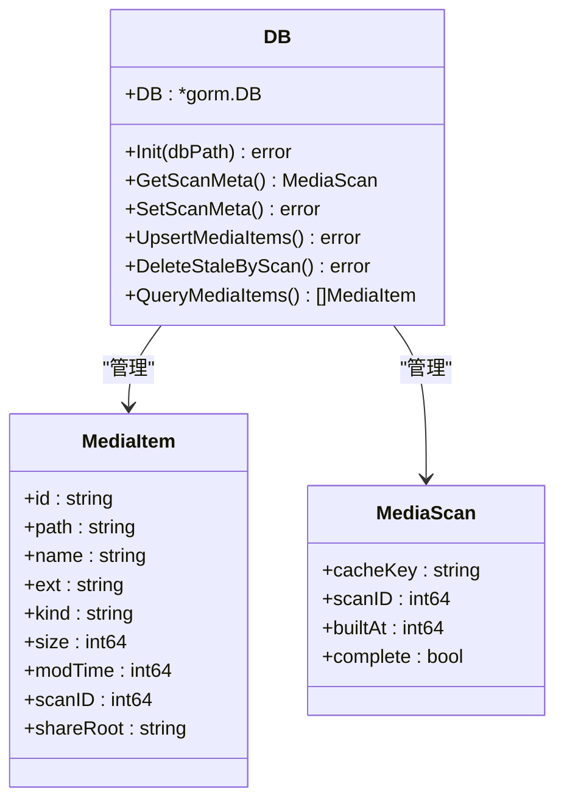
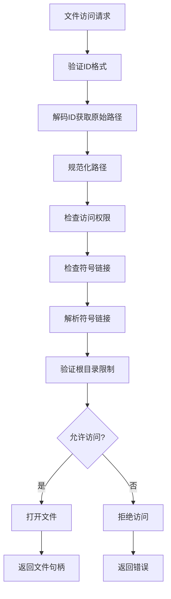
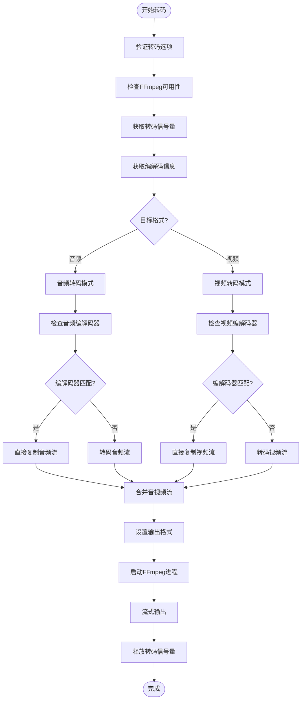
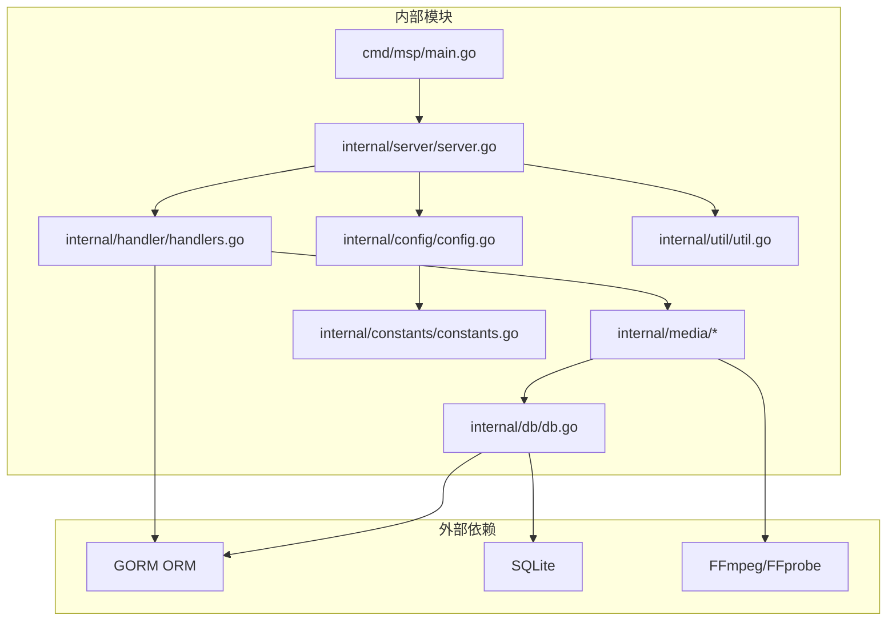
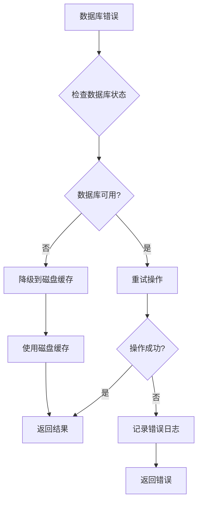

# 存储管理系统

<cite>
**本文档引用的文件**
- [main.go](file://cmd/msp/main.go)
- [server.go](file://internal/server/server.go)
- [store.go](file://internal/media/store.go)
- [scanner.go](file://internal/media/scanner.go)
- [transcoder.go](file://internal/media/transcoder.go)
- [db.go](file://internal/db/db.go)
- [config.go](file://internal/config/config.go)
- [handlers.go](file://internal/handler/handlers.go)
- [util.go](file://internal/util/util.go)
- [constants.go](file://internal/constants/constants.go)
- [CONFIG_EXAMPLE.md](file://docs/CONFIG_EXAMPLE.md)
- [PERFORMANCE_ANALYSIS.md](file://PERFORMANCE_ANALYSIS.md)
</cite>

## 目录
1. [简介](#简介)
2. [项目结构](#项目结构)
3. [核心组件](#核心组件)
4. [架构概览](#架构概览)
5. [详细组件分析](#详细组件分析)
6. [依赖关系分析](#依赖关系分析)
7. [性能考量](#性能考量)
8. [故障处理指南](#故障处理指南)
9. [结论](#结论)

## 简介

存储管理系统是一个基于 Go 语言开发的媒体文件存储和管理平台，主要功能包括：

- **临时文件管理**：实现媒体文件的扫描、索引和缓存机制
- **缓存清理策略**：提供内存缓存和磁盘缓存的双重缓存体系
- **存储空间优化**：通过数据库索引优化和批量操作提升存储效率
- **存储权限管理**：实现严格的文件访问控制和安全保护机制
- **存储配置选项**：支持灵活的配置管理和动态热重载
- **存储故障处理**：提供完整的错误处理和数据恢复机制
- **存储性能监控**：内置性能指标收集和监控能力

该系统采用模块化设计，通过清晰的分层架构实现了高性能的媒体文件管理功能。

## 项目结构

**图表来源**
- [main.go](file://cmd/msp/main.go#L26-L83)
- [server.go](file://internal/server/server.go#L65-L74)
- [store.go](file://internal/media/store.go#L1-L198)

**章节来源**
- [main.go](file://cmd/msp/main.go#L1-L151)
- [server.go](file://internal/server/server.go#L1-L627)

## 核心组件

### 1. 服务器核心组件

服务器组件是整个系统的核心控制器，负责协调各个子系统的运行：

- **媒体缓存管理**：实现内存缓存和磁盘缓存的双重缓存机制
- **配置管理**：支持配置文件的热重载和动态更新
- **会话管理**：提供 PIN 认证和会话令牌管理
- **日志管理**：实现结构化的日志记录和轮转

### 2. 媒体存储组件

媒体存储组件负责媒体文件的索引和管理：

- **数据库索引**：通过 GORM 实现高效的媒体文件索引
- **批量操作**：支持批量插入和更新操作提升性能
- **数据清理**：自动清理过期和无效的数据

### 3. 文件扫描组件

文件扫描组件实现媒体文件的递归扫描和分类：

- **深度优先扫描**：递归遍历共享目录中的所有文件
- **黑名单过滤**：支持基于扩展名、文件名和文件夹的过滤
- **类型分类**：自动识别和分类不同类型的媒体文件

### 4. 转码组件

转码组件提供媒体文件的实时转码功能：

- **智能转码**：根据目标格式和编码需求进行智能转码
- **并发控制**：限制同时进行的转码任务数量
- **格式支持**：支持多种主流媒体格式的转码

**章节来源**
- [server.go](file://internal/server/server.go#L31-L56)
- [store.go](file://internal/media/store.go#L17-L94)
- [scanner.go](file://internal/media/scanner.go#L25-L57)
- [transcoder.go](file://internal/media/transcoder.go#L15-L34)

## 架构概览

**图表来源**
- [server.go](file://internal/server/server.go#L332-L396)
- [store.go](file://internal/media/store.go#L18-L47)

系统采用分层架构设计，各层之间职责明确，通过接口进行交互，确保了系统的可维护性和可扩展性。

## 详细组件分析

### 服务器缓存管理

服务器实现了多层次的缓存机制来提升性能：

#### 内存缓存机制

**图表来源**
- [server.go](file://internal/server/server.go#L31-L74)
- [server.go](file://internal/server/server.go#L480-L536)

内存缓存具有以下特点：
- **TTL 机制**：2分钟的缓存有效期
- **ETag 标识**：使用 FNV 哈希算法生成弱 ETag
- **并发安全**：使用互斥锁保证线程安全
- **自动重建**：缓存过期时自动触发后台重建

#### 磁盘缓存机制

当数据库不可用时，系统会自动切换到磁盘缓存模式：

**图表来源**
- [server.go](file://internal/server/server.go#L487-L536)
- [server.go](file://internal/server/server.go#L520-L536)

**章节来源**
- [server.go](file://internal/server/server.go#L322-L437)

### 媒体扫描和索引

媒体扫描组件实现了高效的文件扫描和索引功能：

#### 扫描流程

**图表来源**
- [scanner.go](file://internal/media/scanner.go#L27-L57)
- [scanner.go](file://internal/media/scanner.go#L68-L106)

#### 黑名单过滤机制

系统提供了强大的黑名单过滤功能：

| 过滤类型 | 规则格式 | 示例 | 说明 |
|---------|---------|------|-----|
| 扩展名过滤 | `.ext` | `.tmp`, `.part` | 基于文件扩展名过滤 |
| 文件名过滤 | `filename` | `Thumbs.db`, `*.log` | 基于完整文件名过滤 |
| 文件夹过滤 | `foldername` | `.git`, `__pycache__` | 基于文件夹名称过滤 |
| 大小过滤 | `>100MB`, `<1KB` | `>=1GB`, `<=500MB` | 基于文件大小范围过滤 |

**章节来源**
- [scanner.go](file://internal/media/scanner.go#L108-L146)
- [config.go](file://internal/config/config.go#L49-L54)

### 数据库存储管理

数据库组件使用 GORM 和 SQLite 实现高效的数据存储：

#### 数据库初始化

**图表来源**
- [db.go](file://internal/db/db.go#L18-L72)
- [types.go](file://internal/types/types.go#L16-L40)

#### 性能优化策略

数据库采用了多项性能优化措施：

1. **WAL 模式**：启用写入-ahead 日志模式提升并发性能
2. **预编译语句**：缓存预编译的 SQL 语句减少解析开销
3. **批量操作**：使用批量插入提升大量数据的写入性能
4. **索引优化**：为常用查询字段建立复合索引

**章节来源**
- [db.go](file://internal/db/db.go#L32-L72)
- [PERFORMANCE_ANALYSIS.md](file://PERFORMANCE_ANALYSIS.md#L9-L29)

### 权限控制系统

系统实现了多层次的安全控制机制：

#### 文件访问控制

**图表来源**
- [handlers.go](file://internal/handler/handlers.go#L448-L486)
- [util.go](file://internal/util/util.go#L148-L182)

#### PIN 认证机制

系统支持 PIN 码认证来增强安全性：

| 配置项 | 默认值 | 说明 |
|--------|--------|------|
| `pinEnabled` | `false` | 是否启用 PIN 认证 |
| `pin` | `"0000"` | 默认 PIN 码（4-8位数字） |
| Cookie 有效期 | 7天 | 会话 Cookie 的最大生存时间 |

**章节来源**
- [handlers.go](file://internal/handler/handlers.go#L255-L319)
- [config.go](file://internal/config/config.go#L56-L75)

### 转码系统

转码组件提供了智能的媒体文件转码功能：

#### 转码策略

**图表来源**
- [transcoder.go](file://internal/media/transcoder.go#L138-L249)

#### 并发控制

转码系统通过信号量机制限制并发转码任务：

| 参数 | 值 | 说明 |
|------|-----|------|
| 最大并发数 | 2 | 同时进行的转码任务数量 |
| 转码格式白名单 | `mp4`, `mp3`, `aac`, `webm`, `ogg` | 支持的输出格式 |
| 视频转码参数 | `libx264 + preset fast + threads 2` | 平衡质量和性能的参数 |

**章节来源**
- [transcoder.go](file://internal/media/transcoder.go#L15-L34)
- [transcoder.go](file://internal/media/transcoder.go#L138-L249)

## 依赖关系分析

**图表来源**
- [main.go](file://cmd/msp/main.go#L18-L26)
- [db.go](file://internal/db/db.go#L12-L16)

系统的主要依赖关系如下：

1. **数据库层**：使用 GORM 作为 ORM 框架，SQLite 作为数据库引擎
2. **媒体处理**：依赖 FFmpeg 和 FFprobe 进行媒体文件转码和探测
3. **配置管理**：通过 JSON 文件进行配置管理
4. **工具函数**：提供路径处理、编码转换等通用工具

**章节来源**
- [main.go](file://cmd/msp/main.go#L1-L151)
- [db.go](file://internal/db/db.go#L1-L270)

## 性能考量

### 缓存策略优化

系统采用了多层次的缓存策略来提升性能：

#### 内存缓存优化

- **TTL 机制**：2分钟的缓存有效期，平衡数据新鲜度和性能
- **ETag 生成**：使用 FNV 哈希算法生成弱 ETag，支持条件请求
- **并发控制**：使用读写锁保证缓存的线程安全
- **自动重建**：缓存过期时自动触发后台重建，不影响用户体验

#### 数据库性能优化

- **WAL 模式**：启用写入-ahead 日志模式提升并发写入性能
- **批量操作**：扫描过程中使用批量插入提升性能
- **索引优化**：为常用查询字段建立复合索引
- **连接池配置**：SQLite 单连接模式避免锁竞争

### 内存管理

系统采用了积极的内存管理策略：

- **垃圾回收**：设置 GC 百分比为 50，积极回收内存
- **内存释放**：索引完成后主动释放操作系统内存
- **缓存淘汰**：定期清理过期的 IP 访问记录

**章节来源**
- [PERFORMANCE_ANALYSIS.md](file://PERFORMANCE_ANALYSIS.md#L1-L986)
- [server.go](file://internal/server/server.go#L433-L435)

## 故障处理指南

### 错误处理机制

系统实现了完善的错误处理机制：

#### 数据库错误处理

**图表来源**
- [server.go](file://internal/server/server.go#L403-L414)

#### 转码错误处理

转码过程中的错误处理机制：

| 错误类型 | 处理方式 | 用户反馈 |
|----------|----------|----------|
| FFmpeg 未安装 | 回退到直连播放 | 显示直连播放按钮 |
| 转码参数错误 | 使用默认参数重试 | 显示转码失败提示 |
| 转码超时 | 重试一次 | 显示转码超时 |
| 硬件资源不足 | 返回错误 | 显示服务器繁忙 |

#### 日志记录

系统实现了结构化的日志记录：

- **日志级别**：支持 debug、info、error 三种级别
- **日志轮转**：超过 10MB 自动轮转
- **性能监控**：记录请求耗时和错误统计
- **安全审计**：记录访问尝试和认证事件

**章节来源**
- [server.go](file://internal/server/server.go#L222-L284)
- [handlers.go](file://internal/handler/handlers.go#L534-L564)

### 数据恢复机制

系统提供了完善的数据恢复能力：

#### 缓存恢复

- **内存缓存恢复**：重启后自动从磁盘缓存恢复
- **数据库恢复**：自动检测和修复损坏的数据库文件
- **索引重建**：数据库损坏时自动重建媒体索引

#### 配置恢复

- **配置备份**：自动备份配置文件到 `.bak` 文件
- **配置验证**：启动时验证配置文件的完整性
- **默认配置**：配置文件损坏时使用默认配置

**章节来源**
- [server.go](file://internal/server/server.go#L487-L536)
- [PERFORMANCE_ANALYSIS.md](file://PERFORMANCE_ANALYSIS.md#L388-L426)

## 结论

存储管理系统是一个设计精良的媒体文件管理平台，具有以下特点：

### 技术优势

1. **高性能架构**：采用多层缓存和批量操作策略，确保系统响应速度
2. **安全可靠**：实现多层次的安全控制和权限管理机制
3. **易于扩展**：模块化设计支持功能的灵活扩展
4. **运维友好**：提供完善的监控、日志和故障处理机制

### 应用价值

- **企业级应用**：适合中小企业的媒体资产管理需求
- **个人使用**：满足个人用户的媒体文件管理需求
- **开发参考**：为类似项目提供优秀的架构参考

### 发展方向

1. **存储优化**：考虑实现去重存储和压缩存储功能
2. **分布式支持**：扩展支持分布式部署和集群模式
3. **云集成**：增加云存储服务的集成能力
4. **AI增强**：引入 AI 技术进行智能内容识别和分类

该系统为媒体文件管理提供了一个完整、可靠的解决方案，具有良好的扩展性和维护性。