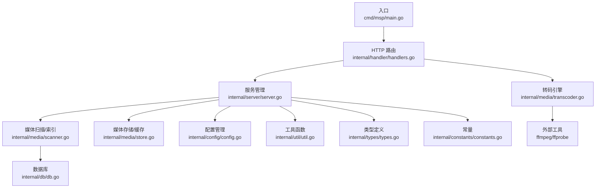
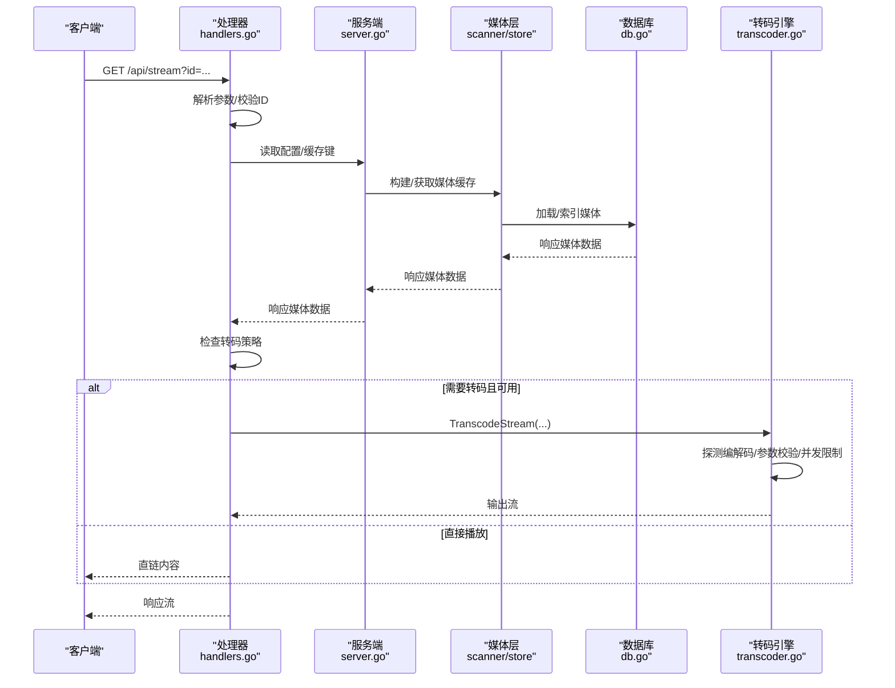
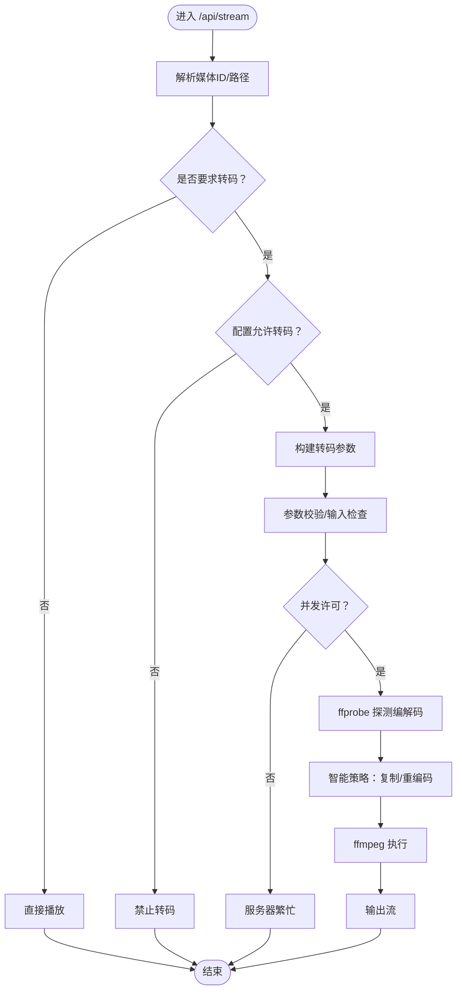
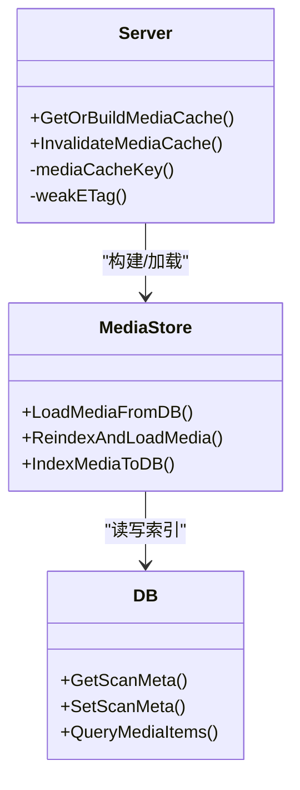
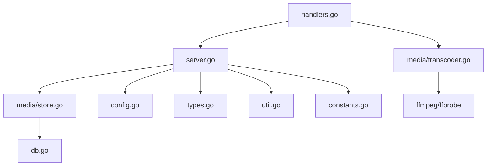

# 智能转码系统

<cite>
**本文档引用的文件**
- [cmd\msp\main.go](file://cmd/msp/main.go)
- [internal\media\transcoder.go](file://internal/media/transcoder.go)
- [internal\media\scanner.go](file://internal/media/scanner.go)
- [internal\media\store.go](file://internal/media/store.go)
- [internal\handler\handlers.go](file://internal/handler/handlers.go)
- [internal\server\server.go](file://internal/server/server.go)
- [internal\config\config.go](file://internal/config/config.go)
- [internal\types\types.go](file://internal/types/types.go)
- [internal\constants\constants.go](file://internal/constants/constants.go)
- [internal\db\db.go](file://internal/db/db.go)
- [internal\util\util.go](file://internal/util/util.go)
- [config.example.json](file://config.example.json)
</cite>

## 目录
1. [简介](#简介)
2. [项目结构](#项目结构)
3. [核心组件](#核心组件)
4. [架构总览](#架构总览)
5. [详细组件分析](#详细组件分析)
6. [依赖关系分析](#依赖关系分析)
7. [性能考量](#性能考量)
8. [故障排查指南](#故障排查指南)
9. [结论](#结论)
10. [附录](#附录)

## 简介
本文件面向智能转码系统的技术实现，围绕转码触发机制、质量控制策略、性能优化、缓存机制、格式支持与监控运维进行系统化说明。系统通过 HTTP 服务对外提供媒体浏览与转码能力，内部采用多层缓存与数据库索引加速媒体发现，转码流程基于 ffmpeg/ffprobe 实现，并通过并发限制与资源调度保障稳定性。

## 项目结构
系统采用分层设计：
- 入口层：cmd/msp/main.go 启动 HTTP 服务、初始化配置与数据库、注册路由。
- 服务层：internal/server/server.go 提供配置热加载、媒体缓存、日志与会话管理。
- 处理层：internal/handler/handlers.go 实现 API 路由与业务处理（媒体、转码、字幕、探测等）。
- 媒体层：internal/media/* 提供扫描、索引、转码、嗅探与存储。
- 数据层：internal/db/db.go 基于 sqlite 的持久化与查询。
- 工具层：internal/util/* 提供路径、ID 编解码、网络与工具函数。
- 类型定义：internal/types/* 定义 API 与数据库模型。
- 配置定义：internal/config/* 定义配置结构与默认值。
- 常量：internal/constants/* 定义系统常量。

图表来源
- [cmd\msp\main.go](file://cmd/msp/main.go#L26-L83)
- [internal\handler\handlers.go](file://internal/handler/handlers.go#L85-L107)
- [internal\server\server.go](file://internal/server/server.go#L31-L74)
- [internal\media\scanner.go](file://internal/media/scanner.go#L25-L57)
- [internal\media\store.go](file://internal/media/store.go#L17-L47)
- [internal\db\db.go](file://internal/db/db.go#L32-L72)
- [internal\media\transcoder.go](file://internal/media/transcoder.go#L91-L104)
- [internal\config\config.go](file://internal/config/config.go#L77-L88)
- [internal\types\types.go](file://internal/types/types.go#L16-L66)
- [internal\util\util.go](file://internal/util/util.go#L18-L50)
- [internal\constants\constants.go](file://internal/constants/constants.go#L7-L50)

章节来源
- [cmd\msp\main.go](file://cmd/msp/main.go#L26-L83)
- [internal\server\server.go](file://internal/server/server.go#L31-L74)

## 核心组件
- 转码引擎：负责转码参数校验、并发限制、调用 ffmpeg/ffprobe、智能策略选择与输出流管理。
- 媒体扫描与索引：递归扫描共享目录，应用黑名单规则，构建媒体清单并写入数据库。
- 媒体缓存：内存缓存媒体响应与 ETag，支持磁盘缓存与数据库缓存，配合 TTL 与重建策略。
- 路由与策略：根据配置与请求参数决定是否转码，支持音频/视频转码开关与格式/码率参数。
- 数据库：SQLite 存储媒体项、扫描元数据、用户偏好与播放进度。
- 工具与安全：路径规范化、ID 编解码、符号链接解析、IP 白黑名单与 PIN 认证。

章节来源
- [internal\media\transcoder.go](file://internal/media/transcoder.go#L19-L70)
- [internal\media\scanner.go](file://internal/media/scanner.go#L25-L57)
- [internal\media\store.go](file://internal/media/store.go#L17-L47)
- [internal\handler\handlers.go](file://internal/handler/handlers.go#L513-L532)
- [internal\db\db.go](file://internal/db/db.go#L32-L72)
- [internal\util\util.go](file://internal/util/util.go#L148-L182)

## 架构总览
系统通过 HTTP 路由接收请求，根据配置与请求参数决定直链播放或转码输出。转码时先探测容器与编解码信息，再依据策略选择复制或重编码，最后通过管道输出。媒体扫描与索引通过数据库持久化，媒体缓存提供快速响应与弱 ETag 支持。

图表来源
- [internal\handler\handlers.go](file://internal/handler/handlers.go#L413-L446)
- [internal\handler\handlers.go](file://internal/handler/handlers.go#L513-L564)
- [internal\media\transcoder.go](file://internal/media/transcoder.go#L138-L248)
- [internal\media\scanner.go](file://internal/media/scanner.go#L25-L57)
- [internal\media\store.go](file://internal/media/store.go#L17-L47)
- [internal\db\db.go](file://internal/db/db.go#L116-L142)

## 详细组件分析

### 转码触发机制
- 请求入口：/api/stream 根据 transcode 参数与配置决定是否转码。
- 策略判定：根据媒体类型（音频/视频）与配置中的 Transcode 开关判断是否允许转码。
- 转码参数：format/bitrate/start（offset）来自查询参数；音频默认 format=mp3。
- 转码执行：调用 TranscodeStream，内部进行参数校验、输入合法性检查、并发限制、编解码探测与 ffmpeg 调用。

图表来源
- [internal\handler\handlers.go](file://internal/handler/handlers.go#L413-L446)
- [internal\handler\handlers.go](file://internal/handler/handlers.go#L513-L564)
- [internal\media\transcoder.go](file://internal/media/transcoder.go#L138-L248)

章节来源
- [internal\handler\handlers.go](file://internal/handler/handlers.go#L513-L564)
- [internal\media\transcoder.go](file://internal/media/transcoder.go#L19-L70)

### 转码质量控制策略
- 质量等级与比特率：支持通过 bitrate 参数指定目标码率；若未指定，采用默认策略（例如视频使用 libx264 的 preset/fast 与 yuv420p，音频尽可能复制）。
- 编码参数优化：
  - 视频：h264 复制优先，否则使用 libx264 preset=fast、像素格式 yuv420p、限制线程数避免过度占用。
  - 音频：mp3/aac 复制优先，否则输出 aac；音频码率可按需设置。
  - 输出格式：MP4 输出启用 faststart 优化网络传输。
- 时间戳保留：当存在 offset 时保留时间戳，确保前端进度条准确。

章节来源
- [internal\media\transcoder.go](file://internal/media/transcoder.go#L185-L222)

### 转码性能优化
- 并发转码管理：全局信号量限制并发会话数量，避免 CPU 争用导致系统卡顿。
- 资源分配：视频编码限制线程数，音频尽量复制，减少计算开销。
- 转码队列调度：当前实现为信号量限流，无显式队列；高并发场景建议结合外部任务队列或容器编排。
- 进程生命周期：命令执行后后台等待退出，stderr 用于调试输出。

章节来源
- [internal\media\transcoder.go](file://internal/media/transcoder.go#L15-L17)
- [internal\media\transcoder.go](file://internal/media/transcoder.go#L201-L206)
- [internal\media\transcoder.go](file://internal/media/transcoder.go#L242-L244)

### 转码缓存机制
- 媒体缓存：内存缓存媒体响应与 ETag，TTL 为 2 分钟；支持磁盘缓存与数据库缓存。
- 弱 ETag：基于缓存键与构建时间生成弱验证标记，支持条件请求。
- 数据库索引：扫描完成后写入数据库，后续查询直接从 DB 读取，提升响应速度。
- 缓存失效：配置变更、共享目录变更、缓存过期或显式刷新会触发重建。

图表来源
- [internal\server\server.go](file://internal/server/server.go#L332-L437)
- [internal\media\store.go](file://internal/media/store.go#L17-L47)
- [internal\db\db.go](file://internal/db/db.go#L116-L142)

章节来源
- [internal\server\server.go](file://internal/server/server.go#L332-L437)
- [internal\media\store.go](file://internal/media/store.go#L17-L47)

### 转码格式支持列表
- 允许的转码输出格式：mp4、mp3、aac、webm、ogg。
- 容器与编解码嗅探：通过 ffprobe/头部嗅探识别容器与编解码类型，支持 MKV/MP4/AVI/MOV 等常见容器。
- 编解码识别：视频支持 H.264/AVC、H.265/HEVC、AV1、VP9 等；音频支持 AAC、Opus、FLAC、AC-3/E-AC-3、DTS、TrueHD 等。

章节来源
- [internal\media\transcoder.go](file://internal/media/transcoder.go#L26-L33)
- [internal\media\scanner.go](file://internal/media/scanner.go#L618-L687)

### 转码过程监控、错误处理与性能调优
- 监控：日志级别可配置，支持错误级别日志记录；请求日志包含方法、路径、状态码与耗时。
- 错误处理：参数校验失败、输入非法、转码进程启动失败、并发上限等均有明确错误反馈。
- 性能调优：数据库连接池仅 1 连接避免锁竞争；WAL 模式、缓存大小与同步模式优化；媒体扫描批量化写入；内存与磁盘缓存结合。

章节来源
- [internal\server\server.go](file://internal/server/server.go#L190-L220)
- [internal\server\server.go](file://internal/server/server.go#L286-L311)
- [internal\db\db.go](file://internal/db/db.go#L54-L69)
- [internal\media\transcoder.go](file://internal/media/transcoder.go#L36-L70)

## 依赖关系分析
- 组件耦合：处理器依赖服务端配置与缓存，服务端依赖媒体层与数据库；媒体层依赖外部工具与数据库。
- 外部依赖：ffmpeg/ffprobe、sqlite、GORM。
- 潜在风险：转码并发限制为固定值，高负载下可能成为瓶颈；数据库单连接在高写入场景需谨慎。

图表来源
- [internal\handler\handlers.go](file://internal/handler/handlers.go#L38-L43)
- [internal\server\server.go](file://internal/server/server.go#L31-L74)
- [internal\media\transcoder.go](file://internal/media/transcoder.go#L91-L104)
- [internal\media\store.go](file://internal/media/store.go#L17-L47)
- [internal\db\db.go](file://internal/db/db.go#L32-L72)
- [internal\config\config.go](file://internal/config/config.go#L77-L88)
- [internal\types\types.go](file://internal/types/types.go#L16-L66)
- [internal\util\util.go](file://internal/util/util.go#L18-L50)
- [internal\constants\constants.go](file://internal/constants/constants.go#L7-L50)

章节来源
- [internal\handler\handlers.go](file://internal/handler/handlers.go#L38-L43)
- [internal\server\server.go](file://internal/server/server.go#L31-L74)

## 性能考量
- 并发控制：全局信号量限制并发转码会话，避免 CPU 过载。
- I/O 与数据库：扫描阶段批量写入，减少事务次数；数据库连接池仅 1 连接，适合单机部署。
- 缓存策略：内存与磁盘/数据库双缓存，弱 ETag 减少带宽消耗。
- 外部工具：ffmpeg/ffprobe 的可用性直接影响转码能力，建议在部署环境中预先验证。

## 故障排查指南
- 转码失败
  - 检查 ffmpeg/ffprobe 是否安装并可在 PATH 中找到。
  - 查看 stderr 输出定位问题。
  - 确认输入文件存在且为常规文件。
- 并发受限
  - 当前并发上限为 2；如遇“服务器繁忙”，请稍后再试或降低同时转码请求数。
- 媒体未显示
  - 检查共享目录配置与黑名单规则，确认文件未被过滤。
  - 刷新媒体缓存或等待 TTL 过期自动重建。
- 配置热更新
  - 修改配置文件后，服务会周期性检测并自动重载；必要时重启服务确保生效。

章节来源
- [internal\media\transcoder.go](file://internal/media/transcoder.go#L91-L104)
- [internal\media\transcoder.go](file://internal/media/transcoder.go#L159-L173)
- [internal\server\server.go](file://internal/server/server.go#L140-L188)

## 结论
本系统通过清晰的分层架构与完善的缓存策略，在保证稳定性的前提下提供了灵活的转码能力。转码策略以“复制优先、必要时重编码”为核心，兼顾兼容性与性能。建议在高并发场景引入外部队列或容器编排以进一步提升吞吐与弹性。

## 附录
- 配置示例：参考 config.example.json，包含端口、共享目录、功能开关、播放策略、黑名单与安全配置。
- 常量：端口、日志轮转、缓存 TTL、扫描限制等默认值集中定义，便于统一管理。

章节来源
- [config.example.json](file://config.example.json#L1-L56)
- [internal\constants\constants.go](file://internal/constants/constants.go#L7-L50)