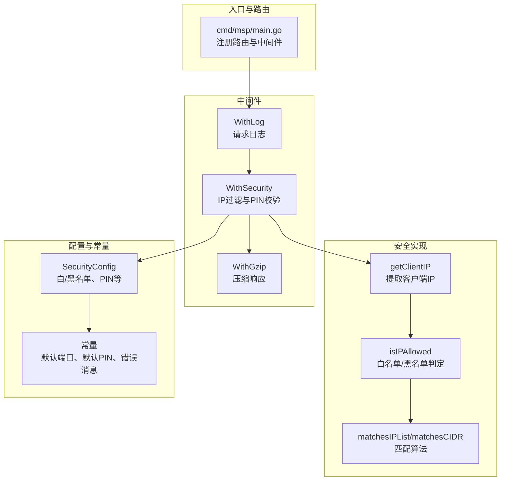
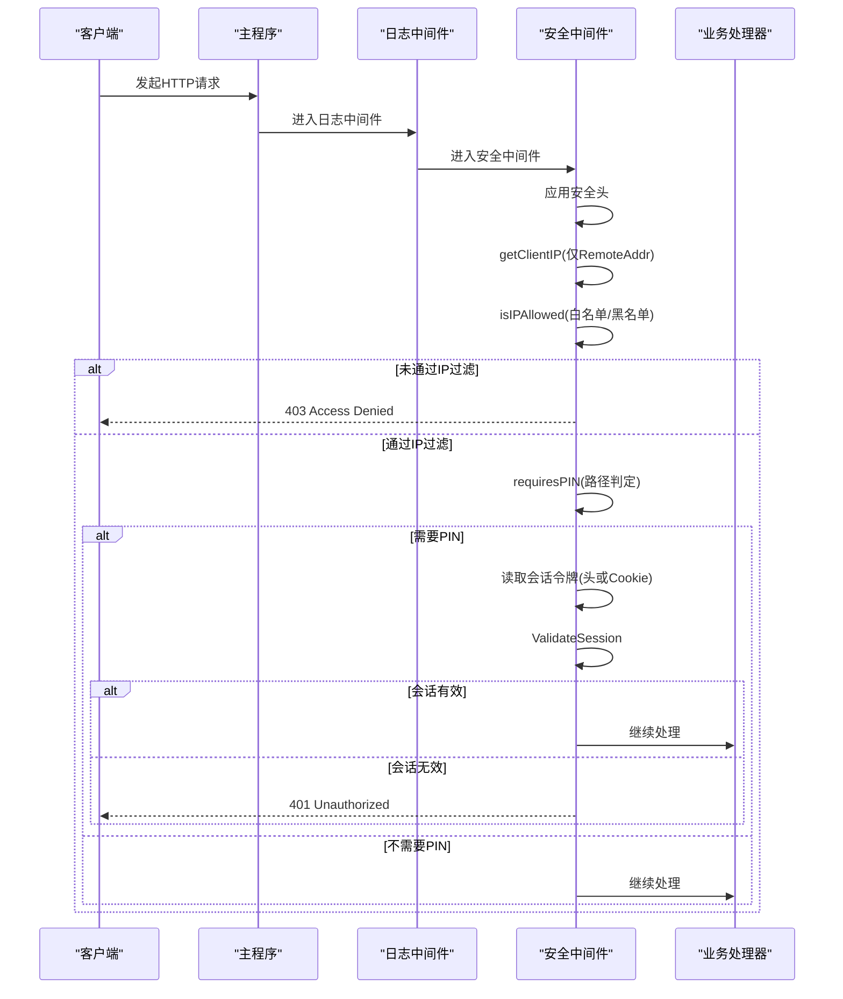
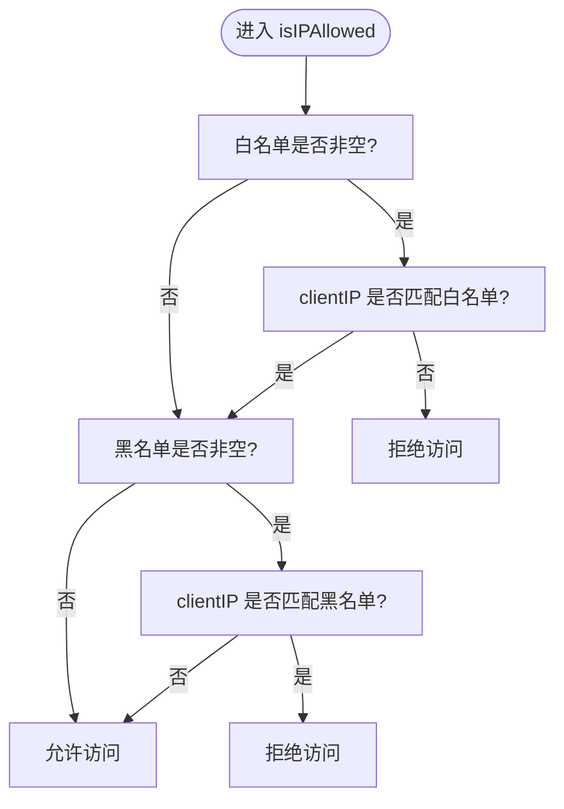
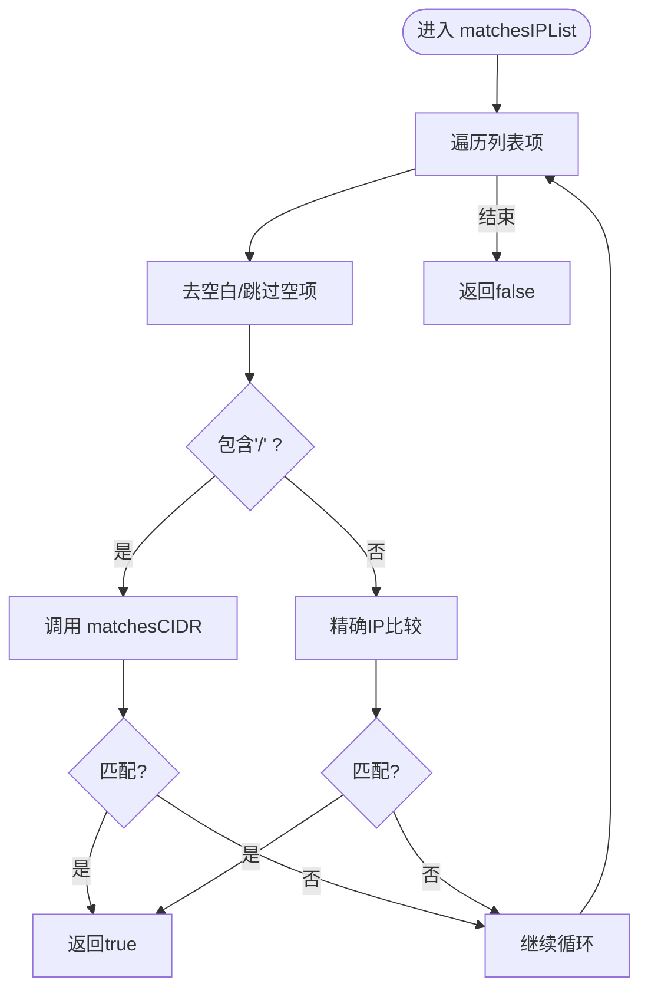
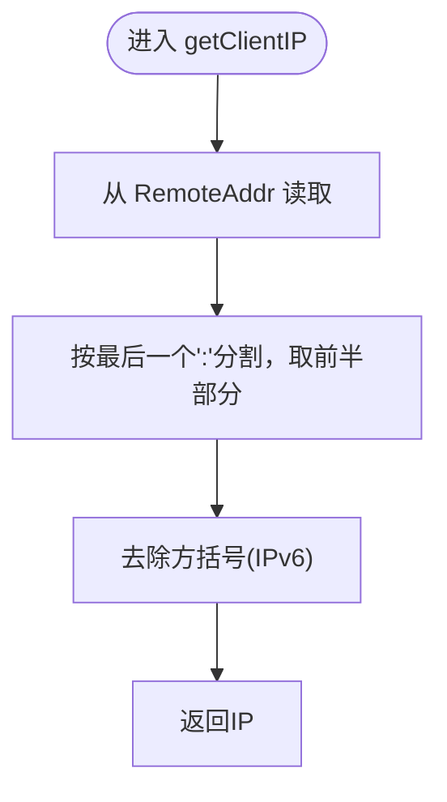
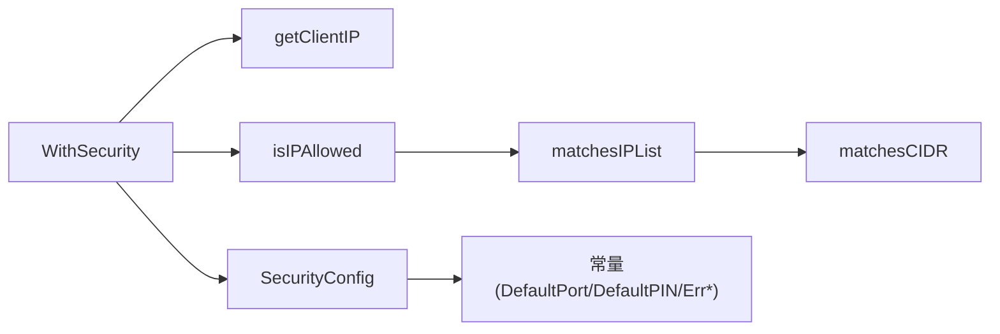
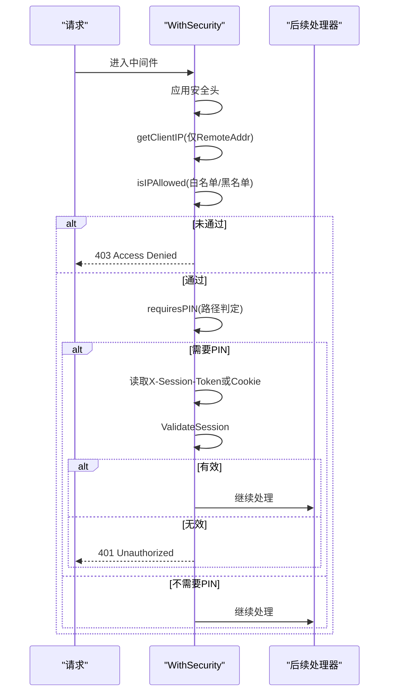

# IP访问控制

<cite>
**本文引用的文件**
- [internal/handler/middleware.go](file://internal/handler/middleware.go)
- [internal/config/config.go](file://internal/config/config.go)
- [internal/constants/constants.go](file://internal/constants/constants.go)
- [internal/constants/errors.go](file://internal/constants/errors.go)
- [cmd/msp/main.go](file://cmd/msp/main.go)
- [docs/CONFIG_EXAMPLE.md](file://docs/CONFIG_EXAMPLE.md)
- [docs/SECURITY.md](file://docs/SECURITY.md)
- [config.example.json](file://config.example.json)
- [internal/handler/middleware_test.go](file://internal/handler/middleware_test.go)
</cite>

## 目录
1. [简介](#简介)
2. [项目结构](#项目结构)
3. [核心组件](#核心组件)
4. [架构总览](#架构总览)
5. [组件详解](#组件详解)
6. [依赖关系分析](#依赖关系分析)
7. [性能考量](#性能考量)
8. [故障排除指南](#故障排除指南)
9. [结论](#结论)
10. [附录](#附录)

## 简介
本文件系统性阐述 MSP 的 IP 访问控制系统，重点覆盖以下方面：
- 白名单与黑名单机制的实现原理与优先级
- IP 地址匹配算法与 CIDR 网络范围支持
- getClientIP 函数在不同部署环境下的 IP 获取策略
- isIPAllowed 判断逻辑与处理流程
- 完整配置示例与常见网络拓扑下的配置指南
- 故障排除与常见配置错误的解决方案

## 项目结构
与 IP 访问控制直接相关的代码主要分布在以下模块：
- 中间件层：负责安全校验与请求拦截
- 配置层：定义安全配置结构与默认值
- 常量层：提供默认端口、默认 PIN、错误消息等常量
- 文档层：提供配置示例与安全指南
- 主程序：组装中间件链路，应用安全中间件

图表来源
- [cmd/msp/main.go](file://cmd/msp/main.go#L65-L83)
- [internal/handler/middleware.go](file://internal/handler/middleware.go#L77-L120)
- [internal/handler/middleware.go](file://internal/handler/middleware.go#L134-L201)
- [internal/config/config.go](file://internal/config/config.go#L56-L75)
- [internal/constants/constants.go](file://internal/constants/constants.go#L8-L14)

章节来源
- [cmd/msp/main.go](file://cmd/msp/main.go#L65-L83)
- [internal/handler/middleware.go](file://internal/handler/middleware.go#L77-L120)
- [internal/config/config.go](file://internal/config/config.go#L56-L75)

## 核心组件
- WithSecurity 中间件：统一应用安全头、提取客户端 IP、执行白/黑名单与 PIN 校验
- getClientIP：在家庭/局域网模式下仅从 RemoteAddr 提取 IP，不信任代理头
- isIPAllowed：白名单优先、黑名单拒绝的判定逻辑
- matchesIPList/matchesCIDR：支持精确 IP 与 CIDR 范围匹配
- SecurityConfig：配置结构，包含 ipWhitelist、ipBlacklist、pinEnabled、pin 等字段

章节来源
- [internal/handler/middleware.go](file://internal/handler/middleware.go#L77-L120)
- [internal/handler/middleware.go](file://internal/handler/middleware.go#L134-L201)
- [internal/config/config.go](file://internal/config/config.go#L56-L75)

## 架构总览
安全中间件在日志与压缩中间件之后，作为请求处理链的第二道防线，先进行 IP 过滤，再进行 PIN 认证（如启用）。其调用顺序如下：

图表来源
- [cmd/msp/main.go](file://cmd/msp/main.go#L65-L83)
- [internal/handler/middleware.go](file://internal/handler/middleware.go#L77-L120)
- [internal/handler/middleware.go](file://internal/handler/middleware.go#L134-L201)

## 组件详解

### IP 白名单与黑名单机制
- 白名单优先：若配置了非空白名单，仅允许白名单内的 IP 访问
- 黑名单拒绝：若 IP 在黑名单中，无论是否在白名单，均拒绝访问
- 判定顺序：先检查白名单，再检查黑名单；黑名单优先级高于白名单

图表来源
- [internal/handler/middleware.go](file://internal/handler/middleware.go#L146-L163)

章节来源
- [internal/handler/middleware.go](file://internal/handler/middleware.go#L146-L163)

### IP 地址匹配算法与 CIDR 支持
- 支持两种匹配方式：
  - 精确 IP 匹配：字符串完全相等
  - CIDR 匹配：使用标准库解析 CIDR 并判断 IP 是否落入网段
- matchesCIDR 内部使用 net.ParseCIDR 与 net.ParseIP，确保 IPv4/IPv6 的正确解析与判断

图表来源
- [internal/handler/middleware.go](file://internal/handler/middleware.go#L165-L187)
- [internal/handler/middleware.go](file://internal/handler/middleware.go#L189-L201)

章节来源
- [internal/handler/middleware.go](file://internal/handler/middleware.go#L165-L201)

### getClientIP 函数工作机制
- 家庭/局域网模式：仅从请求的 RemoteAddr 提取 IP，不信任代理头（如 X-Forwarded-For、X-Real-IP）
- IPv6 处理：移除外层方括号
- 端口剥离：RemoteAddr 中的端口部分会被剥离，仅保留 IP

图表来源
- [internal/handler/middleware.go](file://internal/handler/middleware.go#L134-L144)

章节来源
- [internal/handler/middleware.go](file://internal/handler/middleware.go#L134-L144)

### isIPAllowed 判断逻辑
- 若白名单非空：clientIP 必须匹配白名单
- 若黑名单非空：clientIP 不能匹配黑名单
- 黑名单优先级高于白名单：即使在白名单中，只要在黑名单中即拒绝

章节来源
- [internal/handler/middleware.go](file://internal/handler/middleware.go#L146-L163)

### PIN 认证与会话令牌
- PINEnabled 开启后，除特定豁免端点外，所有 /api/* 请求均需会话令牌
- 会话令牌来源：请求头 X-Session-Token 或 Cookie msp_session
- 豁免端点：/api/pin、/api/ip、/api/config

章节来源
- [internal/handler/middleware.go](file://internal/handler/middleware.go#L96-L118)
- [internal/handler/middleware.go](file://internal/handler/middleware.go#L203-L228)

### 安全头与错误消息
- 安全头：X-Content-Type-Options、X-Frame-Options、X-XSS-Protection、Referrer-Policy
- 错误消息：Access Denied、Unauthorized 等

章节来源
- [internal/handler/middleware.go](file://internal/handler/middleware.go#L122-L132)
- [internal/constants/errors.go](file://internal/constants/errors.go#L53-L57)

## 依赖关系分析
- WithSecurity 依赖：
  - 客户端 IP 提取：getClientIP
  - 白/黑名单判定：isIPAllowed -> matchesIPList -> matchesCIDR
  - 配置读取：s.Config()
  - 会话校验：s.ValidateSession
- 配置与常量：
  - SecurityConfig 定义白/黑名单与 PIN
  - 默认端口、默认 PIN、错误消息常量

图表来源
- [internal/handler/middleware.go](file://internal/handler/middleware.go#L77-L120)
- [internal/handler/middleware.go](file://internal/handler/middleware.go#L134-L201)
- [internal/config/config.go](file://internal/config/config.go#L56-L75)
- [internal/constants/constants.go](file://internal/constants/constants.go#L8-L14)

章节来源
- [internal/handler/middleware.go](file://internal/handler/middleware.go#L77-L120)
- [internal/config/config.go](file://internal/config/config.go#L56-L75)
- [internal/constants/constants.go](file://internal/constants/constants.go#L8-L14)

## 性能考量
- IP 匹配复杂度：线性遍历白/黑名单列表，每个条目进行一次 CIDR 解析或字符串比较
- CIDR 解析：使用标准库 net.ParseCIDR/net.ParseIP，解析成本低
- 中间件链路：WithSecurity 在 WithLog 之后，避免对静态资源施加额外开销
- 配置热重载：配置文件监控独立 goroutine，检查间隔 2 秒，平衡响应速度与系统负载

章节来源
- [internal/handler/middleware.go](file://internal/handler/middleware.go#L165-L201)
- [docs/SECURITY.md](file://docs/SECURITY.md#L113-L118)

## 故障排除指南
- 问题：访问被拒绝（403）
  - 检查是否配置了白名单且包含当前 IP
  - 检查是否误将自身 IP 加入黑名单
  - 确认未启用 PIN 导致会话缺失
- 问题：PIN 验证失败（401）
  - 确认 PINEnabled 已启用且 PIN 码正确
  - 确认会话令牌来自 X-Session-Token 或 Cookie msp_session
  - 确认请求路径不在豁免列表中
- 问题：代理/负载均衡场景 IP 显示异常
  - 家庭/局域网模式下仅使用 RemoteAddr，不信任代理头
  - 如需代理支持，应在边界设备上做网络隔离或在上游反向代理中正确设置代理头（本项目默认不信任代理头）
- 问题：配置未生效
  - 确认配置文件保存后约 2 秒内热重载生效
  - 查看日志确认配置已加载

章节来源
- [internal/handler/middleware.go](file://internal/handler/middleware.go#L77-L120)
- [docs/SECURITY.md](file://docs/SECURITY.md#L176-L187)

## 结论
MSP 的 IP 访问控制采用“白名单优先、黑名单拒绝”的简单而高效策略，结合精确 IP 与 CIDR 范围匹配，满足家庭/局域网场景下的安全需求。通过仅使用 RemoteAddr 的 IP 提取策略，避免了代理头带来的安全风险。配合 PIN 认证与安全头，形成多层防护。建议在生产环境中谨慎启用公网暴露，并结合网络隔离与边界设备策略提升整体安全性。

## 附录

### 配置示例与最佳实践
- 仅允许本地网络访问
  - ipWhitelist：["127.0.0.1", "192.168.1.0/24"]
  - ipBlacklist：[]
  - pinEnabled：false
- 启用 PIN 认证（局域网增强）
  - ipWhitelist：[]
  - ipBlacklist：[]
  - pinEnabled：true
  - pin：自定义 4-8 位数字
- 组合使用（最安全）
  - ipWhitelist：["192.168.1.0/24"]
  - ipBlacklist：["192.168.1.100"]
  - pinEnabled：true
  - pin：自定义 6-8 位数字

章节来源
- [docs/CONFIG_EXAMPLE.md](file://docs/CONFIG_EXAMPLE.md#L139-L176)
- [docs/SECURITY.md](file://docs/SECURITY.md#L82-L128)

### 常见网络拓扑下的配置指南
- NAT 环境
  - 仅使用内网 IP 作为白名单
  - 不信任代理头，避免被伪造
- 代理服务器/负载均衡器
  - 本项目默认不信任代理头（X-Forwarded-For、X-Real-IP）
  - 建议在网络边界设备上进行隔离与策略控制
- IPv6 环境
  - getClientIP 支持 IPv6 地址，去除方括号后进行匹配

章节来源
- [docs/SECURITY.md](file://docs/SECURITY.md#L176-L187)
- [internal/handler/middleware.go](file://internal/handler/middleware.go#L134-L144)

### 关键流程图：WithSecurity 中间件处理链

图表来源
- [internal/handler/middleware.go](file://internal/handler/middleware.go#L77-L120)

### 单元测试要点（参考）
- IP 过滤：覆盖空列表、精确匹配、CIDR 匹配、白/黑名单优先级
- CIDR 匹配：/24、/16、/8 等常见网段
- getClientIP：RemoteAddr 优先、代理头忽略、IPv6 方括号处理
- requiresPIN：豁免端点与 API 路径判定

章节来源
- [internal/handler/middleware_test.go](file://internal/handler/middleware_test.go#L13-L87)
- [internal/handler/middleware_test.go](file://internal/handler/middleware_test.go#L89-L142)
- [internal/handler/middleware_test.go](file://internal/handler/middleware_test.go#L144-L210)
- [internal/handler/middleware_test.go](file://internal/handler/middleware_test.go#L212-L258)