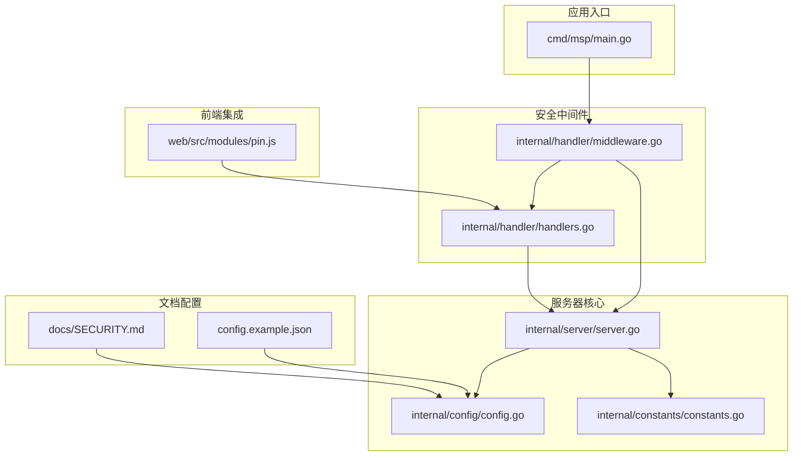
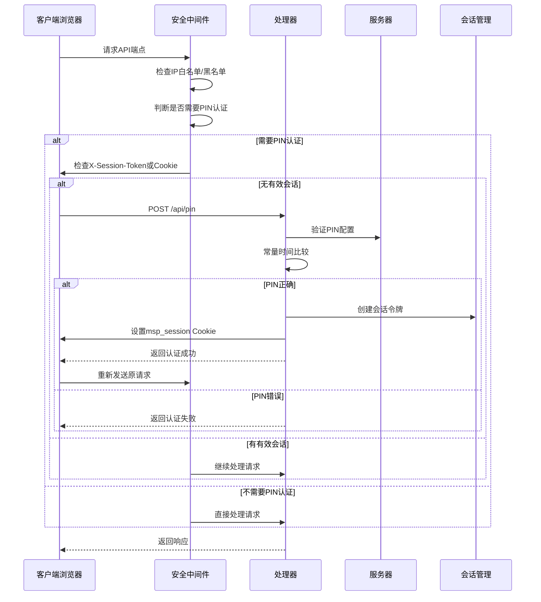
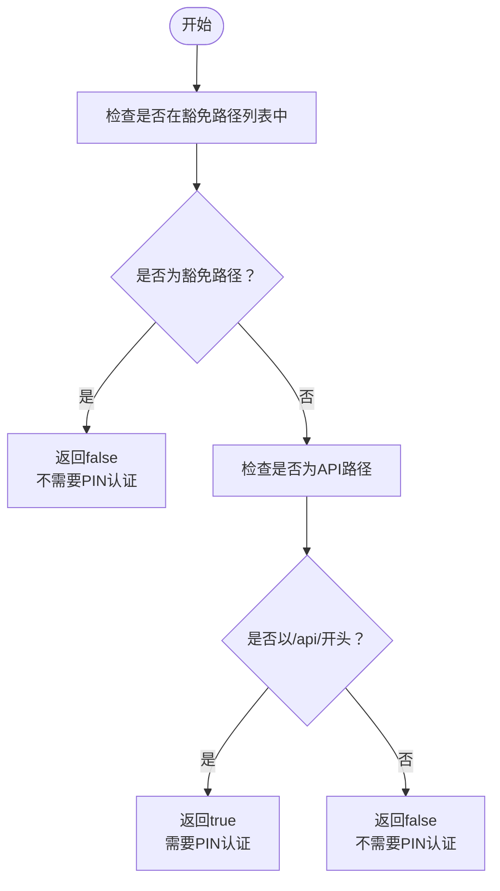
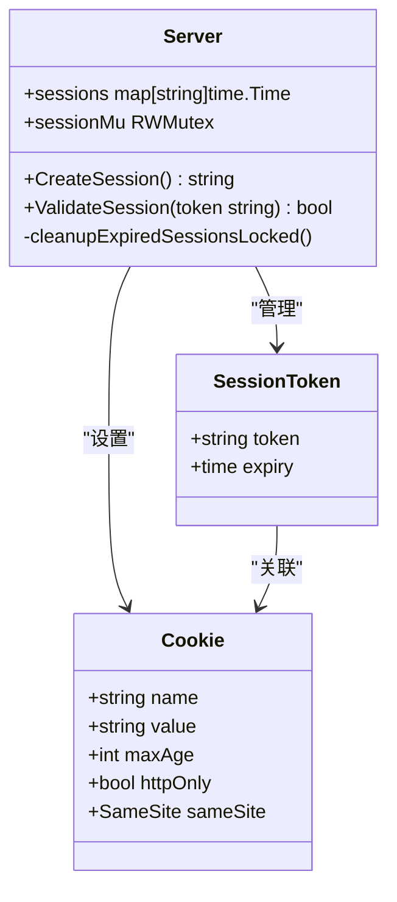
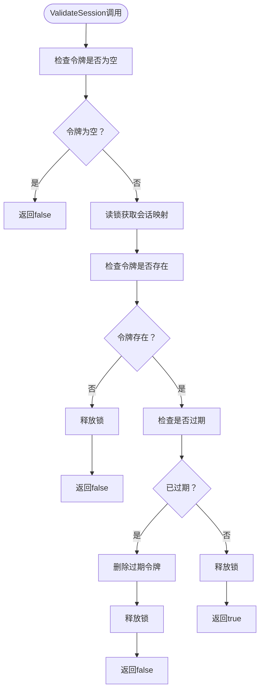
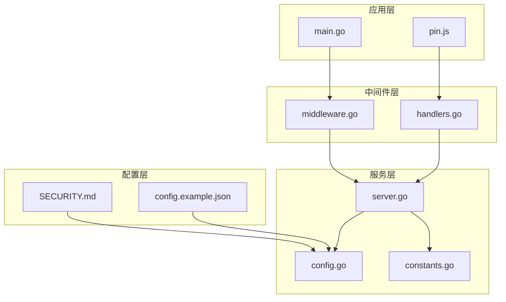

# PIN认证系统

<cite>
**本文档引用的文件**
- [middleware.go](file://internal/handler/middleware.go)
- [handlers.go](file://internal/handler/handlers.go)
- [server.go](file://internal/server/server.go)
- [config.go](file://internal/config/config.go)
- [constants.go](file://internal/constants/constants.go)
- [pin.js](file://web/src/modules/pin.js)
- [main.go](file://cmd/msp/main.go)
- [SECURITY.md](file://docs/SECURITY.md)
- [config.example.json](file://config.example.json)
</cite>

## 目录
1. [简介](#简介)
2. [项目结构](#项目结构)
3. [核心组件](#核心组件)
4. [架构概览](#架构概览)
5. [详细组件分析](#详细组件分析)
6. [依赖关系分析](#依赖关系分析)
7. [性能考虑](#性能考虑)
8. [故障排除指南](#故障排除指南)
9. [结论](#结论)

## 简介

PIN认证系统是MSP媒体服务器的核心安全机制，为家庭局域网环境提供简单而有效的访问控制。该系统通过4-8位数字PIN码实现用户身份验证，结合会话管理和静态资源放行策略，确保在保持易用性的同时提供必要的安全保护。

系统采用分层安全架构，包括IP白名单/黑名单过滤、PIN认证和会话管理三个层面的安全控制。PIN认证仅作用于API端点，静态资源（如前端页面、CSS、JavaScript等）无需认证即可访问，这样设计确保了用户体验的流畅性。

## 项目结构

MSP项目的PIN认证系统主要分布在以下模块中：



**图表来源**
- [main.go](file://cmd/msp/main.go#L85-L107)
- [middleware.go](file://internal/handler/middleware.go#L77-L120)
- [server.go](file://internal/server/server.go#L31-L56)

**章节来源**
- [main.go](file://cmd/msp/main.go#L26-L83)
- [middleware.go](file://internal/handler/middleware.go#L1-L229)

## 核心组件

### 安全中间件 (WithSecurity)

安全中间件是PIN认证系统的核心组件，负责执行IP过滤和PIN认证双重检查。其工作流程如下：

1. **IP白名单/黑名单检查**：基于配置的IP列表进行访问控制
2. **PIN认证决策**：根据路径判断是否需要PIN验证
3. **会话令牌验证**：检查请求头或Cookie中的会话令牌
4. **安全头设置**：为所有响应添加安全相关的HTTP头部

### PIN验证处理器 (HandlePIN)

专门处理PIN验证请求的处理器，提供以下功能：
- 验证用户提交的PIN码
- 创建持久化会话令牌
- 设置HttpOnly Cookie
- 实施常量时间比较防止时序攻击

### 会话管理系统

内置的会话管理机制，包括：
- 随机会话令牌生成
- 7天有效期管理
- 自动过期清理
- 并发安全的令牌存储

**章节来源**
- [middleware.go](file://internal/handler/middleware.go#L77-L120)
- [handlers.go](file://internal/handler/handlers.go#L255-L319)
- [server.go](file://internal/server/server.go#L570-L626)

## 架构概览

PIN认证系统的整体架构采用中间件模式，通过HTTP中间件链实现安全控制：



**图表来源**
- [middleware.go](file://internal/handler/middleware.go#L77-L120)
- [handlers.go](file://internal/handler/handlers.go#L255-L319)
- [server.go](file://internal/server/server.go#L572-L615)

## 详细组件分析

### requiresPIN函数路径判断逻辑

requiresPIN函数实现了精确的路径判断逻辑，确保只有必要的API端点需要PIN认证：



**豁免路径包括：**
- `/api/pin` - PIN验证端点本身
- `/api/ip` - IP信息端点（UI需要）
- `/api/config` - 配置端点（用于检查PIN状态）

**图表来源**
- [middleware.go](file://internal/handler/middleware.go#L203-L228)

**章节来源**
- [middleware.go](file://internal/handler/middleware.go#L203-L228)

### 会话令牌处理机制

会话令牌的处理遵循严格的双通道策略：

#### 令牌提取顺序
1. **请求头优先**：检查`X-Session-Token`头部
2. **Cookie回退**：若头部缺失，检查`msp_session` Cookie
3. **验证流程**：通过服务器端的ValidateSession函数验证令牌有效性

#### 会话状态管理



**图表来源**
- [server.go](file://internal/server/server.go#L31-L56)
- [server.go](file://internal/server/server.go#L572-L615)

**章节来源**
- [server.go](file://internal/server/server.go#L572-L615)
- [handlers.go](file://internal/handler/handlers.go#L303-L312)

### ValidateSession函数工作原理

ValidateSession函数实现了完整的会话验证逻辑：



**实现特点：**
- 使用读写锁确保并发安全
- 自动清理过期会话
- 常量时间复杂度O(1)
- 内存中存储，性能优异

**图表来源**
- [server.go](file://internal/server/server.go#L592-L615)

**章节来源**
- [server.go](file://internal/server/server.go#L592-L615)

### API端点认证策略

系统对不同类型的API端点实施差异化认证策略：

| 端点类型 | 认证需求 | 说明 |
|---------|---------|------|
| `/api/pin` | 可选 | 即使PIN未启用也需访问 |
| `/api/config` | 可选 | 用于检测PIN状态 |
| `/api/ip` | 可选 | UI需要获取IP信息 |
| `/api/media` | 必需 | 媒体内容访问 |
| `/api/stream` | 必需 | 媒体流传输 |
| `/api/subtitle` | 必需 | 字幕文件访问 |
| `/api/probe` | 必需 | 媒体探测 |
| `/api/shares` | 必需 | 共享管理 |
| `/api/prefs` | 必需 | 用户偏好设置 |
| `/api/progress` | 必需 | 播放进度记录 |
| `/api/log` | 必需 | 日志记录 |

**章节来源**
- [middleware.go](file://internal/handler/middleware.go#L203-L228)
- [main.go](file://cmd/msp/main.go#L85-L107)

## 依赖关系分析

PIN认证系统的依赖关系呈现清晰的层次结构：



**依赖特点：**
- **低耦合高内聚**：各组件职责明确，接口清晰
- **单向依赖**：数据流向自上而下，便于理解和维护
- **配置驱动**：安全策略完全由配置文件控制
- **可测试性强**：每个组件都有对应的测试用例

**图表来源**
- [main.go](file://cmd/msp/main.go#L85-L107)
- [middleware.go](file://internal/handler/middleware.go#L77-L120)
- [server.go](file://internal/server/server.go#L31-L56)

**章节来源**
- [main.go](file://cmd/msp/main.go#L85-L107)
- [middleware.go](file://internal/handler/middleware.go#L77-L120)
- [server.go](file://internal/server/server.go#L31-L56)

## 性能考虑

### 会话存储优化

系统采用内存中的哈希表存储会话令牌，具有以下性能优势：
- **O(1)查找复杂度**：基于令牌的直接索引访问
- **内存友好**：避免磁盘I/O操作
- **自动清理**：定期清理过期会话，防止内存泄漏
- **并发安全**：使用读写锁支持高并发访问

### 中间件链优化

安全中间件采用高效的执行顺序：
- **早期短路**：IP过滤在前，快速拒绝无效请求
- **静态资源放行**：前端资源无需认证，提升用户体验
- **最小化开销**：仅对必要端点执行PIN验证

### 缓存策略

系统实现了多层次的缓存机制：
- **媒体缓存**：2分钟TTL，平衡新鲜度和性能
- **配置缓存**：配置文件监控，2秒检查间隔
- **会话缓存**：内存中存储，7天有效期

## 故障排除指南

### 常见问题诊断

#### 1. PIN认证失败

**症状**：提交正确PIN后仍提示认证失败
**排查步骤**：
1. 检查配置文件中的PIN设置
2. 确认浏览器已接收并存储Cookie
3. 验证会话令牌是否过期
4. 查看服务器日志中的认证记录

#### 2. 静态资源无法加载

**症状**：前端页面无法正常显示PIN对话框
**排查步骤**：
1. 确认`/api/pin`、`/api/ip`、`/api/config`端点可访问
2. 检查浏览器网络面板中的请求状态
3. 验证安全中间件的路径判断逻辑

#### 3. 会话超时问题

**症状**：认证成功后一段时间又需要重新登录
**排查步骤**：
1. 检查Cookie的Max-Age设置（7天）
2. 验证服务器时间同步状态
3. 确认会话清理机制正常运行

### 调试技巧

#### 启用详细日志
```bash
# 设置日志级别为debug
export MSP_LOG_LEVEL=debug
./msp
```

#### 使用curl测试
```bash
# 测试PIN验证
curl -X POST http://localhost:8099/api/pin \
  -H "Content-Type: application/json" \
  -d '{"pin":"1234"}'

# 测试受保护端点
curl -H "Cookie: msp_session=YOUR_TOKEN" \
  http://localhost:8099/api/media
```

#### 配置验证
```bash
# 验证配置文件语法
cat config.json | jq .
```

**章节来源**
- [SECURITY.md](file://docs/SECURITY.md#L169-L188)
- [handlers.go](file://internal/handler/handlers.go#L255-L319)

## 结论

MSP的PIN认证系统通过精心设计的架构实现了安全与易用性的完美平衡。系统的核心优势包括：

### 设计亮点
- **智能路径判断**：精确区分静态资源和API端点
- **双通道会话**：支持请求头和Cookie两种令牌传递方式
- **常量时间比较**：有效防止时序攻击
- **内存会话存储**：高性能的会话管理

### 安全特性
- **多层防护**：IP过滤、PIN认证、会话管理三重保障
- **安全头设置**：完整的HTTP安全头配置
- **Cookie安全**：HttpOnly、SameSite、Secure等安全属性
- **配置驱动**：灵活的安全策略调整

### 最佳实践建议
1. **PIN强度**：使用6-8位数字，定期更换
2. **会话管理**：合理设置会话超时时间
3. **监控告警**：建立访问日志和异常检测
4. **备份恢复**：定期备份配置文件和数据库

该系统为家庭局域网环境提供了实用而可靠的安全解决方案，在保证易用性的同时确保了必要的安全防护。