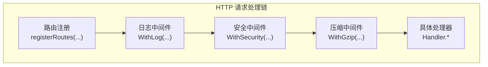
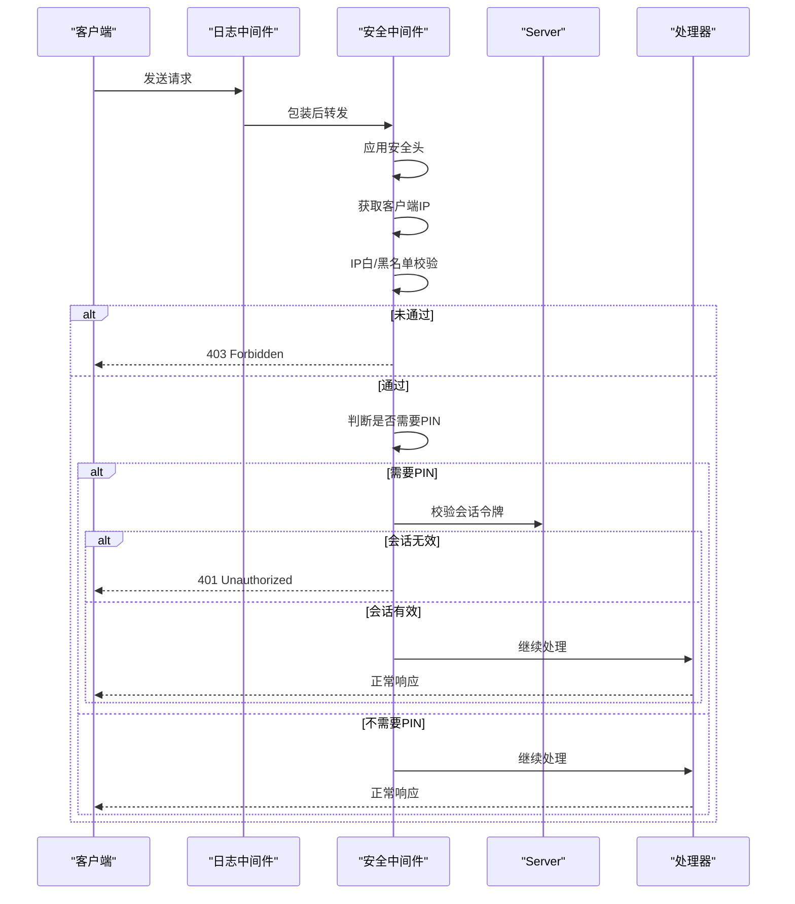
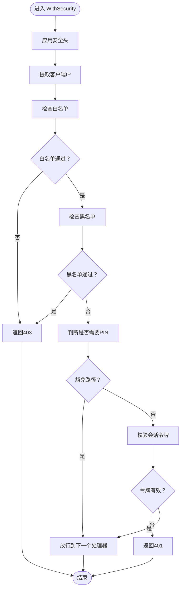
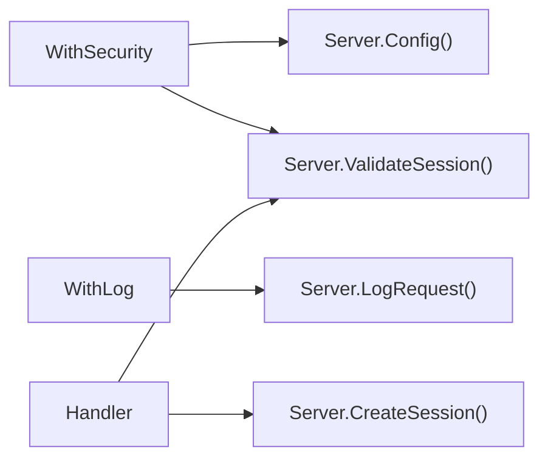

# 安全中间件

<cite>
**本文引用的文件**
- [internal/handler/middleware.go](file://internal/handler/middleware.go)
- [internal/handler/handlers.go](file://internal/handler/handlers.go)
- [internal/handler/middleware_test.go](file://internal/handler/middleware_test.go)
- [internal/handler/pin_test.go](file://internal/handler/pin_test.go)
- [internal/handler/handlers_safety_test.go](file://internal/handler/handlers_safety_test.go)
- [internal/config/config.go](file://internal/config/config.go)
- [internal/constants/errors.go](file://internal/constants/errors.go)
- [internal/constants/constants.go](file://internal/constants/constants.go)
- [internal/server/server.go](file://internal/server/server.go)
- [cmd/msp/main.go](file://cmd/msp/main.go)
- [docs/SECURITY.md](file://docs/SECURITY.md)
- [PERFORMANCE_ANALYSIS.md](file://PERFORMANCE_ANALYSIS.md)
</cite>

## 目录
1. [简介](#简介)
2. [项目结构](#项目结构)
3. [核心组件](#核心组件)
4. [架构总览](#架构总览)
5. [详细组件分析](#详细组件分析)
6. [依赖关系分析](#依赖关系分析)
7. [性能考量](#性能考量)
8. [故障排查指南](#故障排查指南)
9. [结论](#结论)
10. [附录](#附录)

## 简介
本文档围绕 WithSecurity 安全中间件展开，系统性阐述其整体架构、执行流程、错误处理策略、与其他 HTTP 中间件的协作关系、配置选项与扩展方式、性能优化建议、测试策略以及在不同部署环境下的配置差异与注意事项。目标是帮助开发者与运维人员快速理解并正确使用该中间件，保障服务在家庭局域网场景下的安全与稳定运行。

## 项目结构
安全中间件位于内部处理器模块，与日志中间件、压缩中间件共同构成 HTTP 请求处理链路。主程序在注册路由后，按“日志 → 安全 → 压缩 → 路由”的顺序组装中间件，确保安全前置、日志在最后统计完整状态码。

图表来源
- [cmd/msp/main.go](file://cmd/msp/main.go#L58-L75)
- [internal/handler/middleware.go](file://internal/handler/middleware.go#L25-L43)
- [internal/handler/middleware.go](file://internal/handler/middleware.go#L45-L52)
- [internal/handler/middleware.go](file://internal/handler/middleware.go#L77-L120)

章节来源
- [cmd/msp/main.go](file://cmd/msp/main.go#L58-L75)

## 核心组件
- WithSecurity：负责安全头设置、IP 白名单/黑名单校验、PIN 认证与会话校验。
- WithLog：负责记录请求耗时、状态码、UA 等信息。
- WithGzip：负责对符合条件的 API 响应进行 gzip 压缩。
- Handler：提供各类 API 处理器，其中 PIN 验证与会话设置在处理器中完成。

章节来源
- [internal/handler/middleware.go](file://internal/handler/middleware.go#L77-L120)
- [internal/handler/middleware.go](file://internal/handler/middleware.go#L45-L52)
- [internal/handler/middleware.go](file://internal/handler/middleware.go#L25-L43)
- [internal/handler/handlers.go](file://internal/handler/handlers.go#L255-L319)

## 架构总览
WithSecurity 的执行顺序与职责如下：
1) 应用安全头：统一设置安全相关的响应头，增强浏览器防护。
2) 提取客户端 IP：在家庭模式下仅信任直连 TCP Peer 地址，忽略代理头。
3) IP 白名单/黑名单校验：若命中黑名单或不在白名单，直接拒绝访问。
4) PIN 认证判定：对需要认证的 API 路径，检查会话令牌（请求头或 Cookie），校验失败返回未授权。
5) 放行后续处理器。

图表来源
- [internal/handler/middleware.go](file://internal/handler/middleware.go#L77-L120)
- [internal/handler/middleware.go](file://internal/handler/middleware.go#L122-L132)
- [internal/handler/middleware.go](file://internal/handler/middleware.go#L134-L144)
- [internal/handler/middleware.go](file://internal/handler/middleware.go#L146-L163)
- [internal/handler/middleware.go](file://internal/handler/middleware.go#L203-L228)
- [internal/server/server.go](file://internal/server/server.go#L572-L615)
- [internal/handler/handlers.go](file://internal/handler/handlers.go#L255-L319)

## 详细组件分析

### WithSecurity 中间件
- 安全头设置：统一设置 nosniff、DENY、XSS 防护、Referrer 策略等。
- IP 提取：仅使用 RemoteAddr，不信任代理头，保证家庭模式下的可信源。
- IP 校验：先检查白名单（存在时必须匹配），再检查黑名单（命中即拒绝），黑名单优先级更高。
- PIN 认证：对 API 路径进行判定，跳过特定豁免端点；通过 X-Session-Token 或 Cookie msp_session 校验；校验失败返回未授权。
- 放行：通过校验后交由下一个处理器。

图表来源
- [internal/handler/middleware.go](file://internal/handler/middleware.go#L77-L120)
- [internal/handler/middleware.go](file://internal/handler/middleware.go#L122-L132)
- [internal/handler/middleware.go](file://internal/handler/middleware.go#L134-L144)
- [internal/handler/middleware.go](file://internal/handler/middleware.go#L146-L163)
- [internal/handler/middleware.go](file://internal/handler/middleware.go#L203-L228)
- [internal/server/server.go](file://internal/server/server.go#L592-L615)

章节来源
- [internal/handler/middleware.go](file://internal/handler/middleware.go#L77-L120)
- [internal/handler/middleware.go](file://internal/handler/middleware.go#L122-L132)
- [internal/handler/middleware.go](file://internal/handler/middleware.go#L134-L144)
- [internal/handler/middleware.go](file://internal/handler/middleware.go#L146-L163)
- [internal/handler/middleware.go](file://internal/handler/middleware.go#L203-L228)

### WithLog 中间件
- 包裹下一个处理器，记录请求开始时间与最终状态码，输出到日志系统。
- 通过 statusWriter 捕获 WriteHeader 的状态码，确保日志记录准确。

章节来源
- [internal/handler/middleware.go](file://internal/handler/middleware.go#L45-L69)
- [internal/server/server.go](file://internal/server/server.go#L286-L311)

### WithGzip 中间件
- 根据 Accept-Encoding 判断是否支持 gzip。
- 对 /api/*（除特定例外）且非 /api/stream、/api/subtitle 的响应进行压缩。
- 设置 Vary: Accept-Encoding 与 Content-Encoding: gzip，并使用 gzip.Writer 包装响应。

章节来源
- [internal/handler/middleware.go](file://internal/handler/middleware.go#L25-L43)

### PIN 认证与会话管理
- PIN 验证端点：POST /api/pin，使用常量时间比较防止时序攻击。
- 会话创建：成功验证后生成随机会话令牌，设置 HttpOnly、SameSite=Lax 的 msp_session Cookie（Home/LAN 模式不启用 Secure）。
- 会话校验：通过 X-Session-Token 或 Cookie 校验，支持过期自动清理。

章节来源
- [internal/handler/handlers.go](file://internal/handler/handlers.go#L255-L319)
- [internal/handler/handlers.go](file://internal/handler/handlers.go#L321-L331)
- [internal/server/server.go](file://internal/server/server.go#L572-L615)
- [internal/constants/constants.go](file://internal/constants/constants.go#L45-L49)

### IP 白/黑名单与路径豁免
- 白名单为空表示不限制；非空时仅允许白名单内的 IP。
- 黑名单命中即拒绝；黑名单优先级高于白名单。
- 路径豁免：/api/pin、/api/ip、/api/config 不需要 PIN；根路径与静态资源不需 PIN。

章节来源
- [internal/handler/middleware.go](file://internal/handler/middleware.go#L146-L163)
- [internal/handler/middleware.go](file://internal/handler/middleware.go#L203-L228)
- [docs/SECURITY.md](file://docs/SECURITY.md#L164-L167)

## 依赖关系分析
- WithSecurity 依赖 Server.Config() 获取安全配置，依赖 Server.ValidateSession() 校验会话。
- WithLog 依赖 Server.LogRequest() 输出请求日志。
- WithGzip 与处理器无关，仅影响响应。
- Handler.HandlePIN 与 Server.CreateSession()/ValidateSession() 协作完成会话生命周期管理。

图表来源
- [internal/handler/middleware.go](file://internal/handler/middleware.go#L77-L120)
- [internal/server/server.go](file://internal/server/server.go#L286-L311)
- [internal/server/server.go](file://internal/server/server.go#L572-L615)
- [internal/handler/handlers.go](file://internal/handler/handlers.go#L255-L319)

章节来源
- [internal/handler/middleware.go](file://internal/handler/middleware.go#L77-L120)
- [internal/server/server.go](file://internal/server/server.go#L286-L311)
- [internal/server/server.go](file://internal/server/server.go#L572-L615)
- [internal/handler/handlers.go](file://internal/handler/handlers.go#L255-L319)

## 性能考量
- 中间件顺序对性能的影响：日志中间件放在安全中间件之后，确保能拿到最终状态码；压缩中间件放在路由之后，避免对静态资源过度压缩。
- WithGzip 对 /api/* 的限制减少不必要的压缩开销；对 /api/stream、/api/subtitle 不压缩，避免阻塞流式传输。
- WithSecurity 仅做必要检查，避免复杂计算；IP 匹配使用标准库解析 CIDR，性能可控。
- 会话令牌采用随机生成与常量时间比较，降低侧信道风险。

章节来源
- [cmd/msp/main.go](file://cmd/msp/main.go#L65-L74)
- [internal/handler/middleware.go](file://internal/handler/middleware.go#L25-L43)
- [internal/handler/middleware.go](file://internal/handler/middleware.go#L77-L120)
- [internal/handler/handlers.go](file://internal/handler/handlers.go#L321-L331)
- [PERFORMANCE_ANALYSIS.md](file://PERFORMANCE_ANALYSIS.md#L220-L258)

## 故障排查指南
- 访问被拒绝（403）：检查 IP 是否在白名单/黑名单中；确认白名单为空时是否期望不限制。
- 未授权（401）：确认是否启用了 PIN；检查请求头 X-Session-Token 或 Cookie msp_session 是否正确传递；核对会话是否过期。
- 日志异常：确认日志级别与日志文件路径配置；检查日志轮转阈值与权限。
- 压缩异常：确认客户端 Accept-Encoding；检查 /api/* 路径是否命中压缩条件。

章节来源
- [internal/constants/errors.go](file://internal/constants/errors.go#L53-L57)
- [internal/server/server.go](file://internal/server/server.go#L190-L284)
- [internal/handler/middleware.go](file://internal/handler/middleware.go#L25-L43)

## 结论
WithSecurity 中间件在家庭局域网场景下提供了简洁而有效的安全防护：通过统一的安全头、严格的 IP 控制与可选的 PIN 认证，结合会话管理与日志记录，形成完整的安全闭环。配合 WithGzip 的合理压缩策略与 WithLog 的精确统计，整体性能与可观测性得到平衡。建议在生产环境中谨慎启用 PIN，并定期轮换 PIN；同时根据网络拓扑选择合适的白/黑名单策略。

## 附录

### 配置选项与扩展
- 安全配置项（来自配置模型）：
  - ipWhitelist：IP 白名单（支持单 IP 与 CIDR）
  - ipBlacklist：IP 黑名单（支持单 IP 与 CIDR）
  - pinEnabled：是否启用 PIN 认证
  - pin：PIN 码（默认值来自常量）

- 自定义扩展建议：
  - 新增路径豁免：在 requiresPIN 判定中增加新端点。
  - 新增 IP 来源策略：在 getClientIP 中增加对代理头的信任开关（当前家庭模式默认不信任）。
  - 新增会话存储：替换内存会话为持久化存储（如 Redis）以支持多实例部署。

章节来源
- [internal/config/config.go](file://internal/config/config.go#L56-L75)
- [internal/config/config.go](file://internal/config/config.go#L136-L142)
- [internal/handler/middleware.go](file://internal/handler/middleware.go#L203-L228)
- [internal/handler/middleware.go](file://internal/handler/middleware.go#L134-L144)

### 测试策略与示例
- IP 过滤与 CIDR 匹配：覆盖空列表、精确匹配、CIDR 匹配、白/黑名单优先级等场景。
- 客户端 IP 提取：验证家庭模式下忽略代理头的行为。
- 路径是否需要 PIN：验证豁免端点与 API 端点的区分。
- PIN 认证：验证未登录访问受保护端点返回 401，登录后携带 Cookie/请求头可正常访问。
- 安全边界：PIN 登录接口拒绝过大负载；Cookie Secure 始终关闭（家庭模式）。

章节来源
- [internal/handler/middleware_test.go](file://internal/handler/middleware_test.go#L13-L87)
- [internal/handler/middleware_test.go](file://internal/handler/middleware_test.go#L89-L142)
- [internal/handler/middleware_test.go](file://internal/handler/middleware_test.go#L144-L210)
- [internal/handler/middleware_test.go](file://internal/handler/middleware_test.go#L212-L258)
- [internal/handler/pin_test.go](file://internal/handler/pin_test.go#L16-L135)
- [internal/handler/handlers_safety_test.go](file://internal/handler/handlers_safety_test.go#L42-L100)

### 不同部署环境下的配置差异
- 开发环境：可不启用任何安全功能，便于调试。
- 局域网环境：建议使用 IP 白名单限制访问范围。
- 公网环境：当前版本默认面向家庭局域网，不建议直接暴露公网；如需公网部署，需重新评估代理头信任策略与安全头策略。
- 代理与反向代理：家庭模式不信任代理头，若需在公网部署，需重新设计 IP 提取策略与代理头信任开关。

章节来源
- [docs/SECURITY.md](file://docs/SECURITY.md#L169-L187)
- [internal/handler/middleware.go](file://internal/handler/middleware.go#L134-L144)