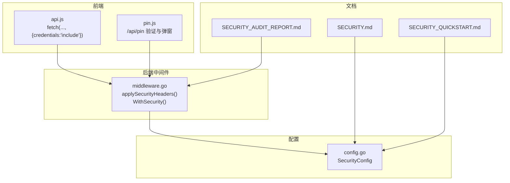
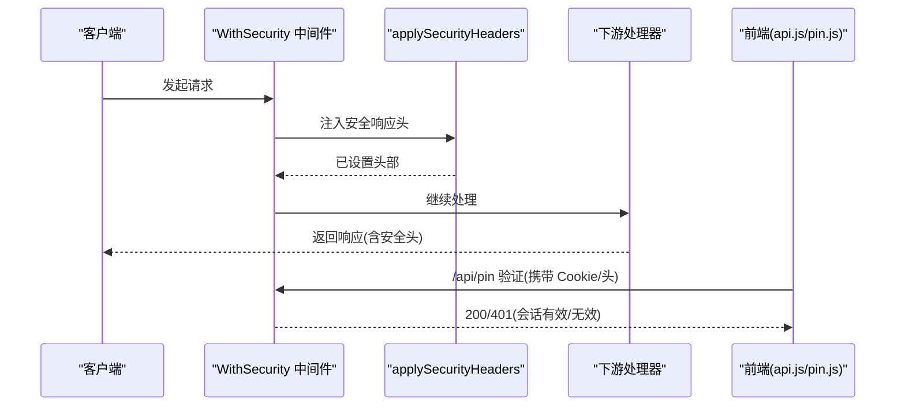
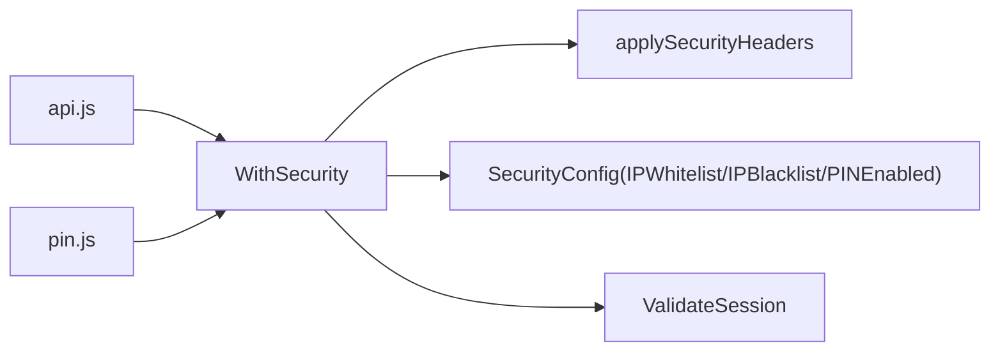

# 安全响应头

<cite>
**本文引用的文件**
- [middleware.go](file://internal/handler/middleware.go)
- [middleware_test.go](file://internal/handler/middleware_test.go)
- [SECURITY.md](file://docs/SECURITY.md)
- [SECURITY_QUICKSTART.md](file://docs/SECURITY_QUICKSTART.md)
- [SECURITY_AUDIT_REPORT.md](file://SECURITY_AUDIT_REPORT.md)
- [api.js](file://web/src/modules/api.js)
- [pin.js](file://web/src/modules/pin.js)
- [config.go](file://internal/config/config.go)
</cite>

## 目录
1. [简介](#简介)
2. [项目结构](#项目结构)
3. [核心组件](#核心组件)
4. [架构总览](#架构总览)
5. [详细组件分析](#详细组件分析)
6. [依赖关系分析](#依赖关系分析)
7. [性能考量](#性能考量)
8. [故障排查指南](#故障排查指南)
9. [结论](#结论)
10. [附录](#附录)

## 简介
本文件聚焦于 MSP 项目的“安全响应头”体系，围绕后端中间件中统一设置的关键安全响应头展开，包括：
- X-Content-Type-Options: nosniff
- X-Frame-Options: DENY
- X-XSS-Protection: 1; mode=block
- Referrer-Policy: strict-origin-when-cross-origin

我们将解释这些头部的作用、防护机制、浏览器兼容性、最佳实践配置、不同部署环境下的调整建议、测试与验证方法，以及与内容安全策略（CSP）的关系与配合方式。

## 项目结构
与安全响应头相关的核心代码集中在后端中间件层，前端侧通过会话 Cookie 与后端交互，形成“响应头 + 会话认证”的双重安全防线。

图表来源
- [middleware.go](file://internal/handler/middleware.go#L77-L132)
- [api.js](file://web/src/modules/api.js#L17-L36)
- [pin.js](file://web/src/modules/pin.js#L32-L40)
- [config.go](file://internal/config/config.go#L56-L75)
- [SECURITY.md](file://docs/SECURITY.md#L1-L188)
- [SECURITY_QUICKSTART.md](file://docs/SECURITY_QUICKSTART.md#L1-L248)
- [SECURITY_AUDIT_REPORT.md](file://SECURITY_AUDIT_REPORT.md#L508-L530)

章节来源
- [middleware.go](file://internal/handler/middleware.go#L77-L132)
- [config.go](file://internal/config/config.go#L56-L75)
- [SECURITY.md](file://docs/SECURITY.md#L1-L188)
- [SECURITY_QUICKSTART.md](file://docs/SECURITY_QUICKSTART.md#L1-L248)
- [SECURITY_AUDIT_REPORT.md](file://SECURITY_AUDIT_REPORT.md#L508-L530)

## 核心组件
- applySecurityHeaders：在每次 HTTP 响应前统一注入关键安全响应头，确保所有接口具备基础安全防护。
- WithSecurity：整合 IP 白/黑名单与 PIN 会话认证，同时调用 applySecurityHeaders，形成“响应头 + 访问控制”的中间件链。
- 前端会话：通过 Cookie 与请求头携带会话令牌，配合后端会话校验，避免明文暴露。

章节来源
- [middleware.go](file://internal/handler/middleware.go#L77-L132)
- [api.js](file://web/src/modules/api.js#L17-L36)
- [pin.js](file://web/src/modules/pin.js#L32-L40)

## 架构总览
下图展示安全响应头在请求处理链中的位置与作用范围。

图表来源
- [middleware.go](file://internal/handler/middleware.go#L77-L132)
- [api.js](file://web/src/modules/api.js#L17-L36)
- [pin.js](file://web/src/modules/pin.js#L32-L40)

## 详细组件分析

### applySecurityHeaders 函数
该函数负责在每次响应前设置四项关键安全响应头，覆盖 MIME 嗅探、点击劫持、XSS 保护与引用来源策略。

- X-Content-Type-Options: nosniff
  - 作用：禁止浏览器对响应内容进行 MIME 类型嗅探，降低因错误的 Content-Type 导致的脚本执行风险。
  - 兼容性：现代浏览器广泛支持。
  - 风险提示：若后端动态输出脚本但未设置正确类型，可能影响浏览器渲染行为，需确保响应类型准确。
- X-Frame-Options: DENY
  - 作用：防止页面被嵌入到其他站点的 iframe 中，有效防范点击劫持与水坑攻击。
  - 兼容性：IE8+、Chrome、Firefox、Safari 等主流浏览器支持。
  - 替代方案：现代推荐使用 CSP 的 frame-ancestors 替代。
- X-XSS-Protection: 1; mode=block
  - 作用：启用浏览器内置 XSS 过滤器，并在检测到攻击时阻断页面渲染。
  - 兼容性：主要在旧版 IE/Chrome 内核中生效；现代浏览器已逐步弃用。
  - 建议：结合 CSP 的 script-src 等策略，形成更全面的 XSS 防护。
- Referrer-Policy: strict-origin-when-cross-origin
  - 作用：在跨站导航时尽量发送最小化引用信息，提升隐私与安全。
  - 兼容性：现代浏览器普遍支持。

章节来源
- [middleware.go](file://internal/handler/middleware.go#L122-L132)
- [SECURITY_AUDIT_REPORT.md](file://SECURITY_AUDIT_REPORT.md#L508-L530)

### WithSecurity 中间件与 applySecurityHeaders 的协作
- 每次请求进入 WithSecurity 后，首先调用 applySecurityHeaders 注入安全响应头。
- 接着执行 IP 白/黑名单校验与 PIN 会话认证，再将请求交给下游处理器。
- 该顺序保证：即便认证失败，响应仍带有安全头，便于前端与运维识别。

章节来源
- [middleware.go](file://internal/handler/middleware.go#L77-L120)

### 前端会话与 Cookie
- 前端通过 fetch 默认携带 Cookie（credentials: include），后端在 /api/pin 成功后设置会话 Cookie，后续请求可免重复输入 PIN。
- 该机制与安全响应头共同构成“响应头 + 会话认证”的安全基线。

章节来源
- [api.js](file://web/src/modules/api.js#L17-L36)
- [pin.js](file://web/src/modules/pin.js#L32-L40)
- [SECURITY.md](file://docs/SECURITY.md#L135-L167)

### 安全响应头与 CSP 的关系与配合
- 现状：applySecurityHeaders 未设置 Content-Security-Policy。
- 建议：在生产环境中补充 CSP，与现有安全响应头协同，形成更完善的前端安全策略。
- 常见 CSP 策略要点（示例思路，具体值需按业务定制）：
  - default-src 'self'：默认仅允许同源资源。
  - script-src 'self'：脚本仅允许同源。
  - style-src 'self' 'unsafe-inline'：样式允许同源与内联（视前端框架而定）。
  - frame-ancestors 'none'：替代 X-Frame-Options。
  - upgrade-insecure-requests：强制 HTTPS。
- 与 applySecurityHeaders 的配合：CSP 与安全响应头互补，前者侧重资源加载与脚本执行控制，后者侧重通用安全基线。

章节来源
- [SECURITY_AUDIT_REPORT.md](file://SECURITY_AUDIT_REPORT.md#L523-L529)

## 依赖关系分析
- 中间件依赖关系
  - WithSecurity 依赖 applySecurityHeaders 注入安全头。
  - WithSecurity 依赖配置模块中的 SecurityConfig 进行 IP 白/黑名单与 PIN 开关判断。
  - WithSecurity 依赖会话校验逻辑（ValidateSession）与常量消息（Err 信息）。
- 前端依赖关系
  - api.js 通过 credentials: include 与后端会话交互。
  - pin.js 通过 /api/pin 验证 PIN 并触发会话设置。

图表来源
- [middleware.go](file://internal/handler/middleware.go#L77-L132)
- [config.go](file://internal/config/config.go#L56-L75)

章节来源
- [middleware.go](file://internal/handler/middleware.go#L77-L132)
- [config.go](file://internal/config/config.go#L56-L75)

## 性能考量
- applySecurityHeaders 是纯响应头设置，开销极小，几乎不影响性能。
- WithSecurity 中间件在每次请求都会执行 IP 匹配与会话校验，建议：
  - 合理配置白/黑名单，避免过多规则导致匹配成本上升。
  - PIN 验证仅针对受保护 API，静态资源与 /api/pin、/api/config 等豁免路径不进行 PIN 校验，减少不必要的鉴权开销。

章节来源
- [middleware.go](file://internal/handler/middleware.go#L203-L228)

## 故障排查指南
- 无法加载静态资源或 PIN 弹窗异常
  - 现象：静态资源或 /api/pin、/api/config 等接口返回 401。
  - 原因：这些接口被设计为豁免路径，不强制 PIN；若出现 401，可能前端未正确携带会话（Cookie/头）。
  - 处理：确认前端请求是否携带 credentials: include，或在请求头中传入 X-Session-Token。
- 认证失败
  - 现象：访问受保护 API 返回 401。
  - 原因：会话无效或过期。
  - 处理：重新调用 /api/pin 验证 PIN，刷新会话。
- IP 被拒绝
  - 现象：返回 403。
  - 原因：不在白名单或在黑名单中。
  - 处理：检查配置中的 IPWhitelist/IPBlacklist，确认当前访问 IP 是否符合预期。
- 安全响应头缺失
  - 现象：安全扫描工具提示缺少某些安全头。
  - 处理：确认 applySecurityHeaders 是否在 WithSecurity 中被调用；若自定义路由未使用 WithSecurity，需手动注入。

章节来源
- [middleware_test.go](file://internal/handler/middleware_test.go#L212-L258)
- [SECURITY.md](file://docs/SECURITY.md#L135-L167)

## 结论
- applySecurityHeaders 提供了基础且必要的安全响应头，覆盖 MIME 嗅探、点击劫持、XSS 保护与引用来源策略。
- WithSecurity 将安全响应头与 IP 白/黑名单、PIN 会话认证结合，形成“响应头 + 访问控制”的安全基线。
- 建议在生产环境中补充 CSP，与现有安全响应头协同，进一步强化前端资源与脚本执行控制。
- 配置层面，建议在家庭/局域网环境下启用 IP 白名单与 PIN，公网直连不建议开启。

## 附录

### 安全响应头最佳实践配置
- 开发环境：可暂时关闭 IP 白名单与 PIN，但建议保留 applySecurityHeaders。
- 局域网环境：启用 IP 白名单限制来源；PIN 可选，建议开启以增加一层访问控制。
- 生产环境（公网）：当前版本默认面向家庭局域网，不建议直接公网暴露；若确需公网部署，建议：
  - 启用 IP 白名单与严格的 CIDR 范围；
  - 强制启用 PIN；
  - 补充 CSP；
  - 使用反向代理（如 Nginx/Caddy）统一设置安全头与 TLS 终止。

章节来源
- [SECURITY.md](file://docs/SECURITY.md#L169-L187)
- [SECURITY_QUICKSTART.md](file://docs/SECURITY_QUICKSTART.md#L180-L239)
- [SECURITY_AUDIT_REPORT.md](file://SECURITY_AUDIT_REPORT.md#L523-L529)

### 安全响应头与浏览器兼容性
- X-Content-Type-Options: nosniff：现代浏览器广泛支持。
- X-Frame-Options: DENY：IE8+、Chrome、Firefox、Safari 等主流浏览器支持；现代推荐使用 CSP 的 frame-ancestors。
- X-XSS-Protection: 1; mode=block：主要在旧版 IE/Chrome 内核中生效；现代浏览器已逐步弃用。
- Referrer-Policy: strict-origin-when-cross-origin：现代浏览器普遍支持。

章节来源
- [middleware.go](file://internal/handler/middleware.go#L122-L132)

### 安全头部的测试方法与验证工具
- 自动化测试
  - 单元测试：参考 middleware_test.go 中的 IP 过滤、CIDR 匹配、客户端 IP 解析、PIN 路径豁免等测试用例，确保逻辑正确。
- 手动验证
  - 使用浏览器开发者工具查看响应头是否包含 X-Content-Type-Options、X-Frame-Options、X-XSS-Protection、Referrer-Policy。
  - 使用 curl 或 Postman 发送请求，检查响应头。
  - 使用安全扫描工具（如安全审计报告中建议的工具）进行自动化扫描。
- 前端会话验证
  - 通过 /api/pin 验证 PIN，确认会话 Cookie 设置与后续请求携带是否正常。

章节来源
- [middleware_test.go](file://internal/handler/middleware_test.go#L13-L87)
- [middleware_test.go](file://internal/handler/middleware_test.go#L144-L210)
- [middleware_test.go](file://internal/handler/middleware_test.go#L212-L258)
- [SECURITY_AUDIT_REPORT.md](file://SECURITY_AUDIT_REPORT.md#L579-L608)

### 与内容安全策略（CSP）的关系与配合
- applySecurityHeaders 未设置 CSP，建议在生产环境补充 CSP。
- 常见策略方向（示例思路）：
  - default-src 'self'
  - script-src 'self'
  - style-src 'self' 'unsafe-inline'
  - frame-ancestors 'none'
  - upgrade-insecure-requests
- 与 applySecurityHeaders 的配合：CSP 与安全响应头互补，前者侧重资源加载与脚本执行控制，后者侧重通用安全基线。

章节来源
- [SECURITY_AUDIT_REPORT.md](file://SECURITY_AUDIT_REPORT.md#L523-L529)