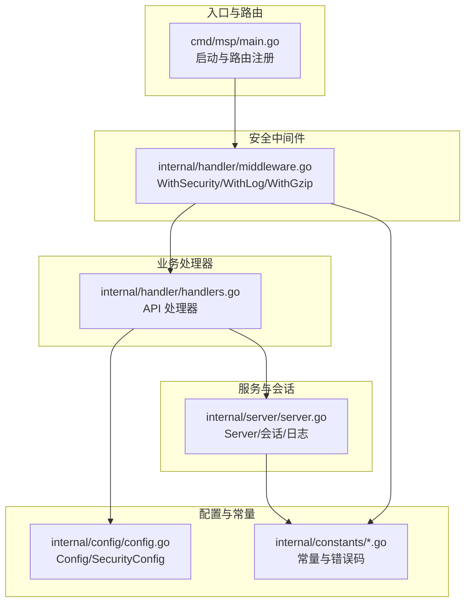
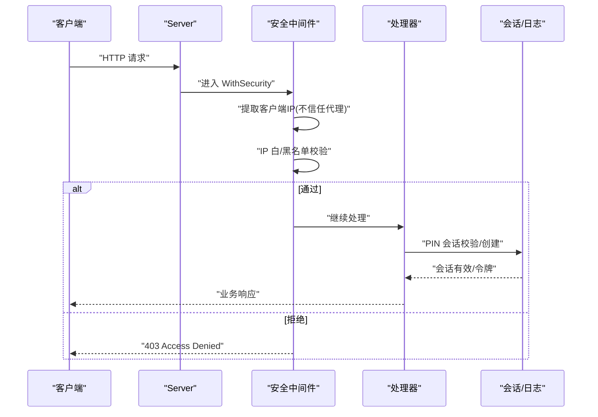
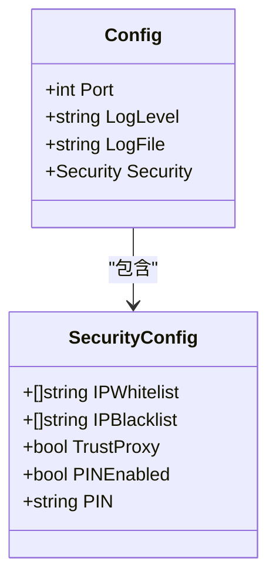
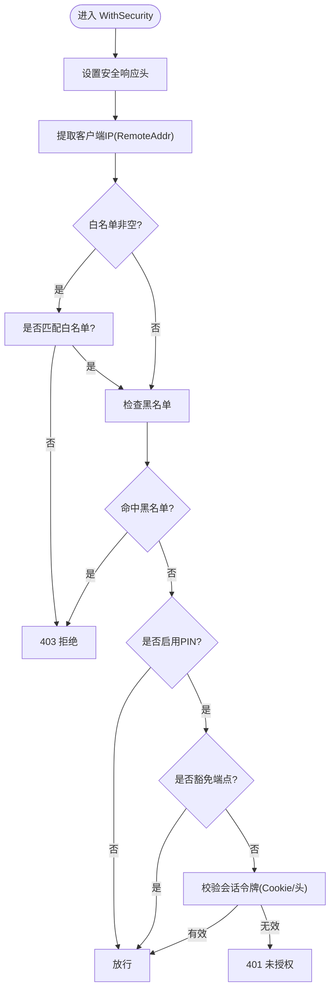
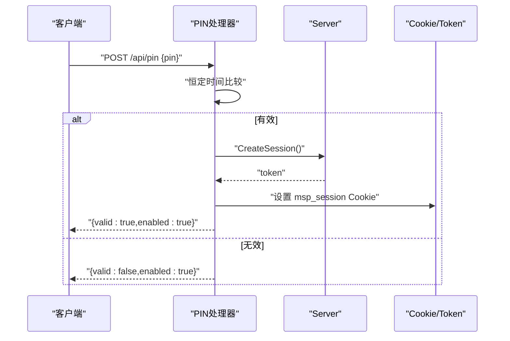
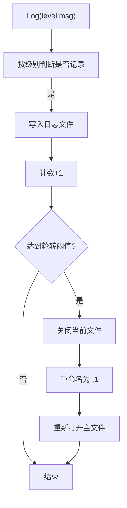
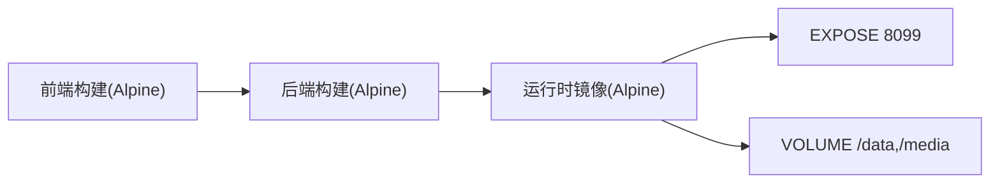
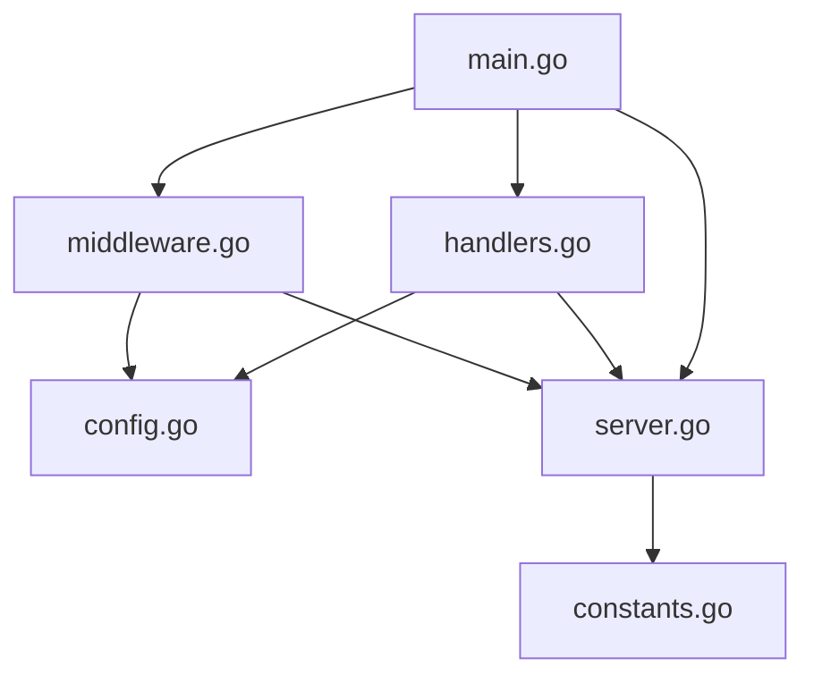

# 安全最佳实践

<cite>
**本文引用的文件**
- [docs/SECURITY.md](file://docs/SECURITY.md)
- [docs/SECURITY_QUICKSTART.md](file://docs/SECURITY_QUICKSTART.md)
- [docs/CONFIG_EXAMPLE.md](file://docs/CONFIG_EXAMPLE.md)
- [SECURITY_AUDIT_REPORT.md](file://SECURITY_AUDIT_REPORT.md)
- [internal/config/config.go](file://internal/config/config.go)
- [internal/handler/middleware.go](file://internal/handler/middleware.go)
- [internal/handler/handlers.go](file://internal/handler/handlers.go)
- [internal/server/server.go](file://internal/server/server.go)
- [internal/constants/constants.go](file://internal/constants/constants.go)
- [internal/constants/errors.go](file://internal/constants/errors.go)
- [cmd/msp/main.go](file://cmd/msp/main.go)
- [Dockerfile](file://Dockerfile)
- [docker-compose.yml](file://docker-compose.yml)
- [config.example.json](file://config.example.json)
</cite>

## 目录
1. [简介](#简介)
2. [项目结构](#项目结构)
3. [核心组件](#核心组件)
4. [架构总览](#架构总览)
5. [详细组件分析](#详细组件分析)
6. [依赖关系分析](#依赖关系分析)
7. [性能与安全特性](#性能与安全特性)
8. [故障排查与安全事件响应](#故障排查与安全事件响应)
9. [生产部署安全策略](#生产部署安全策略)
10. [常见威胁防护](#常见威胁防护)
11. [安全评估与漏洞扫描](#安全评估与漏洞扫描)
12. [合规性与标准遵循](#合规性与标准遵循)
13. [安全培训与意识提升](#安全培训与意识提升)
14. [结论](#结论)

## 简介
本指南面向 MSP 项目的运维与开发团队，提供一套可落地的安全最佳实践，涵盖网络隔离、访问控制、认证与会话、日志审计、容器与编排、以及生产环境安全部署策略。同时给出针对常见威胁（如路径穿越、命令注入、暴力破解、会话劫持等）的防护建议，并提供安全事件监控与响应流程、定期安全评估与漏洞扫描的实施建议，以及合规性与安全标准的遵循要点。

## 项目结构
MSP 采用 Go 语言后端与嵌入式前端资源的单体服务，核心安全逻辑集中在配置模型、中间件与处理器中，配合日志与会话管理模块完成访问控制与审计。

**图表来源**
- [cmd/msp/main.go](file://cmd/msp/main.go#L85-L107)
- [internal/handler/middleware.go](file://internal/handler/middleware.go#L77-L120)
- [internal/handler/handlers.go](file://internal/handler/handlers.go#L255-L319)
- [internal/server/server.go](file://internal/server/server.go#L570-L626)
- [internal/config/config.go](file://internal/config/config.go#L56-L88)
- [internal/constants/constants.go](file://internal/constants/constants.go#L7-L50)

**章节来源**
- [cmd/msp/main.go](file://cmd/msp/main.go#L26-L83)
- [docs/SECURITY.md](file://docs/SECURITY.md#L1-L188)

## 核心组件
- 配置模型与默认值：定义安全配置项（IP 白名单/黑名单、PIN 开关与值），并提供默认值与应用逻辑。
- 安全中间件：统一注入安全响应头、提取客户端 IP、执行 IP 白/黑名单校验、PIN 会话校验。
- API 处理器：提供 PIN 验证端点、会话创建与 Cookie 设置、媒体与转码接口。
- 服务器与会话：会话令牌生成与校验、过期清理、日志记录与轮转。
- 常量与错误码：统一错误消息、Cookie 有效期、会话长度、端口与文件权限等。

**章节来源**
- [internal/config/config.go](file://internal/config/config.go#L56-L146)
- [internal/handler/middleware.go](file://internal/handler/middleware.go#L77-L229)
- [internal/handler/handlers.go](file://internal/handler/handlers.go#L255-L331)
- [internal/server/server.go](file://internal/server/server.go#L570-L626)
- [internal/constants/constants.go](file://internal/constants/constants.go#L7-L50)
- [internal/constants/errors.go](file://internal/constants/errors.go#L1-L68)

## 架构总览
MSP 的安全架构围绕“最小暴露面 + 多层防护”展开：默认不信任代理头、严格的 IP 白/黑名单、PIN 会话认证、安全响应头、日志审计与轮转、容器与卷持久化。

**图表来源**
- [internal/handler/middleware.go](file://internal/handler/middleware.go#L77-L120)
- [internal/handler/handlers.go](file://internal/handler/handlers.go#L255-L319)
- [internal/server/server.go](file://internal/server/server.go#L570-L626)

## 详细组件分析

### 安全配置模型与默认值
- 安全配置项：IP 白名单、IP 黑名单、信任代理标志、PIN 开关与 PIN 值。
- 默认值策略：未设置时使用默认端口、默认 PIN、默认日志级别与文件路径。
- 配置热重载：监听配置文件变更，自动加载并应用新配置。

**图表来源**
- [internal/config/config.go](file://internal/config/config.go#L56-L88)
- [internal/config/config.go](file://internal/config/config.go#L94-L146)

**章节来源**
- [internal/config/config.go](file://internal/config/config.go#L56-L146)
- [docs/CONFIG_EXAMPLE.md](file://docs/CONFIG_EXAMPLE.md#L113-L135)

### 安全中间件：IP 与会话控制
- 安全响应头：X-Content-Type-Options、X-Frame-Options、X-XSS-Protection、Referrer-Policy。
- IP 提取：仅使用 RemoteAddr，不信任代理头，避免 IP 欺骗。
- IP 白/黑名单：支持 CIDR 与精确 IP；黑名单优先级高于白名单。
- PIN 会话：对 /api/*（除特定豁免端点）要求会话令牌；支持 Cookie 与请求头传递。

**图表来源**
- [internal/handler/middleware.go](file://internal/handler/middleware.go#L77-L229)

**章节来源**
- [internal/handler/middleware.go](file://internal/handler/middleware.go#L77-L229)
- [docs/SECURITY.md](file://docs/SECURITY.md#L135-L188)

### PIN 认证与会话管理
- 端点：/api/pin 接收 PIN，成功后创建会话令牌并设置 msp_session Cookie（HttpOnly、SameSite、有效期 7 天）。
- 会话校验：服务端生成加密安全的随机令牌，按期清理过期会话。
- 恒定时间比较：PIN 比较使用恒定时间算法，降低时序攻击风险。

**图表来源**
- [internal/handler/handlers.go](file://internal/handler/handlers.go#L255-L319)
- [internal/server/server.go](file://internal/server/server.go#L570-L626)
- [internal/constants/constants.go](file://internal/constants/constants.go#L38-L50)

**章节来源**
- [internal/handler/handlers.go](file://internal/handler/handlers.go#L255-L331)
- [internal/server/server.go](file://internal/server/server.go#L570-L626)
- [docs/SECURITY.md](file://docs/SECURITY.md#L135-L168)

### 日志审计与轮转
- 日志级别与输出：支持 debug/info/error/no 级别，文件权限为 0600，目录权限 0750。
- 日志轮转：超过阈值触发轮转，避免磁盘占用过大。
- 请求审计：记录方法、路径、状态码、User-Agent、耗时；对新设备访问进行提示。

**图表来源**
- [internal/server/server.go](file://internal/server/server.go#L222-L284)

**章节来源**
- [internal/server/server.go](file://internal/server/server.go#L190-L284)
- [internal/constants/constants.go](file://internal/constants/constants.go#L16-L35)

### 容器与编排安全
- 多阶段构建：前端构建与后端构建分离，最终镜像基于 Alpine，CGO 关闭，减少攻击面。
- 端口与卷：默认暴露 8099，数据卷映射至 /data（config.json、msp.db）与 /media。
- 环境变量：禁用自动打开浏览器，便于容器环境运行。

**图表来源**
- [Dockerfile](file://Dockerfile#L1-L49)
- [docker-compose.yml](file://docker-compose.yml#L1-L20)

**章节来源**
- [Dockerfile](file://Dockerfile#L1-L49)
- [docker-compose.yml](file://docker-compose.yml#L1-L20)

## 依赖关系分析
- 组件耦合：中间件依赖配置与服务器实例；处理器依赖服务器与服务层；服务器依赖配置与常量。
- 外部依赖：标准库 net/http、net、crypto/rand、encoding/hex、os、time 等；SQLite 通过 modernc.org/sqlite（CGO 关闭）。
- 潜在循环：未发现直接循环依赖；会话与日志通过互斥锁保护共享状态。

**图表来源**
- [cmd/msp/main.go](file://cmd/msp/main.go#L85-L107)
- [internal/handler/middleware.go](file://internal/handler/middleware.go#L77-L120)
- [internal/handler/handlers.go](file://internal/handler/handlers.go#L255-L319)
- [internal/server/server.go](file://internal/server/server.go#L570-L626)
- [internal/config/config.go](file://internal/config/config.go#L56-L88)
- [internal/constants/constants.go](file://internal/constants/constants.go#L7-L50)

**章节来源**
- [cmd/msp/main.go](file://cmd/msp/main.go#L26-L83)

## 性能与安全特性
- 超时配置：读取头 10s、读取 15s、空闲 60s；媒体流场景未设置写超时以支持长连接。
- 压缩：对 /api/*（除特定端点）启用 gzip 响应压缩，减少带宽。
- 缓存与 ETag：媒体缓存弱 ETag，支持条件请求与刷新策略。
- 转码并发：限制并发转码会话数量，防止资源耗尽。

**章节来源**
- [cmd/msp/main.go](file://cmd/msp/main.go#L67-L74)
- [internal/handler/middleware.go](file://internal/handler/middleware.go#L25-L43)
- [internal/server/server.go](file://internal/server/server.go#L332-L437)
- [SECURITY_AUDIT_REPORT.md](file://SECURITY_AUDIT_REPORT.md#L380-L387)

## 故障排查与安全事件响应
- 常见问题定位：检查配置文件格式、查看 msp.log、确认配置热重载是否生效。
- 访问被拒：确认白名单是否包含当前 IP、CIDR 是否正确、是否存在黑名单命中。
- 忘记 PIN：编辑 config.json 修改或禁用 PIN，或删除配置文件使用默认值。
- 安全事件响应流程建议：
  - 异常访问检测：结合日志中的新设备标记与频繁 401/403，识别可疑行为。
  - 入侵检测：监控 /api/pin 的失败尝试频率，必要时临时收紧 IP 白名单或启用 PIN。
  - 安全告警：对连续失败、异常 UA、异常路径访问设置阈值告警。

**章节来源**
- [docs/SECURITY_QUICKSTART.md](file://docs/SECURITY_QUICKSTART.md#L106-L248)
- [internal/server/server.go](file://internal/server/server.go#L286-L311)
- [docs/SECURITY.md](file://docs/SECURITY.md#L169-L188)

## 生产部署安全策略
- 网络隔离与防火墙
  - 仅开放 8099 端口，限制来源 IP（建议仅内网或必要公网 IP）。
  - 使用主机防火墙策略，结合 IP 白名单进一步收敛暴露面。
- 反向代理与 TLS
  - 建议通过反向代理（Nginx/Caddy）前置，统一处理 HTTPS/TLS 终止与证书管理。
  - 若使用反代，谨慎配置代理头信任策略，避免 IP 欺骗。
- HTTPS 与安全头部
  - 强制 HTTPS，设置 HSTS（如通过反代）。
  - 完善安全头部（CSP、X-Content-Type-Options、X-Frame-Options、X-XSS-Protection、Referrer-Policy）。
- 会话与 Cookie
  - 在 HTTPS 环境下为 Cookie 设置 Secure 标志；保持 HttpOnly 与 SameSite。
- 配置与密钥
  - 将 config.json、msp.db 放置于受控卷，限制文件权限（0600）。
  - 避免在配置中明文存储敏感信息；PIN 应定期轮换。

**章节来源**
- [docs/SECURITY.md](file://docs/SECURITY.md#L169-L188)
- [docs/CONFIG_EXAMPLE.md](file://docs/CONFIG_EXAMPLE.md#L178-L202)
- [SECURITY_AUDIT_REPORT.md](file://SECURITY_AUDIT_REPORT.md#L342-L356)

## 常见威胁防护
- 路径遍历与符号链接绕过
  - 现状：文件访问前进行路径合法性检查，但未对符号链接进行解析与二次校验。
  - 建议：在路径检查后增加符号链接解析与目标路径校验，确保链接目标仍在允许范围内。
- 命令注入（FFmpeg）
  - 现状：转码调用使用参数列表，但输入路径未经严格字符与格式验证。
  - 建议：对输入路径进行白名单字符与扩展名校验，限制允许的转码格式与码率格式。
- SQL 注入
  - 现状：GORM 使用参数化查询，未发现字符串拼接构建 SQL 的情况。
  - 建议：继续保持参数化查询，避免动态拼接 SQL。
- XSS 与内容安全
  - 现状：安全响应头已设置，前端使用 textContent 防止 XSS。
  - 建议：补充 CSP 头，限制脚本与样式来源。
- 暴力破解与会话劫持
  - 现状：PIN 比较使用恒定时间算法，会话令牌加密安全，Cookie 设置 HttpOnly/SameSite。
  - 建议：在 HTTPS 环境下启用 Secure 标志；考虑对 /api/pin 的失败尝试进行速率限制。

**章节来源**
- [SECURITY_AUDIT_REPORT.md](file://SECURITY_AUDIT_REPORT.md#L19-L122)
- [SECURITY_AUDIT_REPORT.md](file://SECURITY_AUDIT_REPORT.md#L124-L244)
- [SECURITY_AUDIT_REPORT.md](file://SECURITY_AUDIT_REPORT.md#L406-L438)
- [SECURITY_AUDIT_REPORT.md](file://SECURITY_AUDIT_REPORT.md#L508-L530)
- [internal/handler/middleware.go](file://internal/handler/middleware.go#L122-L132)
- [internal/handler/handlers.go](file://internal/handler/handlers.go#L289-L331)

## 安全评估与漏洞扫描
- 自动化测试建议
  - 增加符号链接绕过与路径遍历的单元测试，覆盖典型攻击向量。
  - 增加转码输入验证的边界测试，覆盖非法字符、超长路径、不支持格式。
- 手动渗透测试
  - 使用 Burp Suite 对 API 端点进行模糊测试与会话劫持验证。
  - 验证 /api/pin 的暴力破解防护与速率限制效果。
- 漏洞扫描
  - 定期对容器镜像进行镜像扫描（Trivy/Snyk），关注基础镜像与依赖漏洞。
  - 对前端静态资源与第三方依赖进行前端安全扫描。

**章节来源**
- [SECURITY_AUDIT_REPORT.md](file://SECURITY_AUDIT_REPORT.md#L579-L609)

## 合规性与标准遵循
- 数据保护与隐私
  - 限制日志中用户输入的记录，必要时进行脱敏处理。
  - 遵循最小权限原则，仅授予必要的文件系统访问权限。
- 安全基线
  - 参考 OWASP Top 10、CIS Controls，结合项目现状逐项对齐。
- 文档与审计
  - 保留安全配置与变更记录，确保可追溯性。

**章节来源**
- [SECURITY_AUDIT_REPORT.md](file://SECURITY_AUDIT_REPORT.md#L466-L481)
- [internal/constants/constants.go](file://internal/constants/constants.go#L16-L23)

## 安全培训与意识提升
- 培训内容
  - 基础安全知识：OWASP Top 10、社会工程、密码学与会话安全。
  - MSP 特定场景：配置安全、日志审计、容器与反代安全。
- 实践演练
  - 模拟暴力破解、路径遍历、命令注入等场景，检验现有防护有效性。
- 持续改进
  - 建立安全评审机制，定期回顾与更新安全策略。

## 结论
MSP 在安全设计上已具备良好的基础：参数化查询、恒定时间比较、安全响应头、会话管理与日志轮转等。建议优先修复符号链接绕过与命令注入两大高危问题，完善转码参数验证与配置信息过滤，补充 CSP 与 HTTPS 环境下的 Cookie Secure 标志，并建立自动化与手动相结合的安全评估与漏洞扫描流程，持续提升整体安全水平。