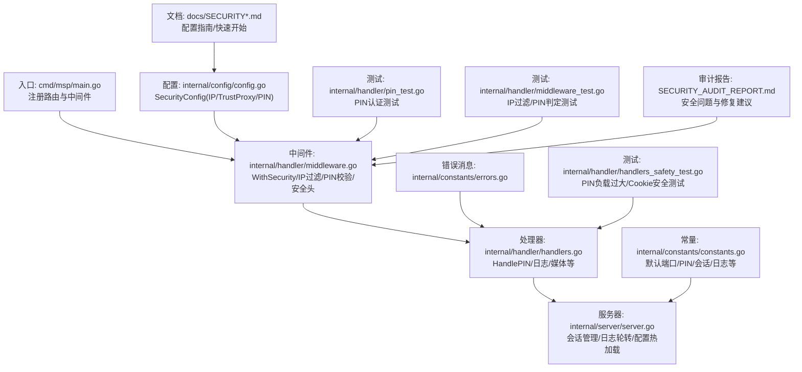
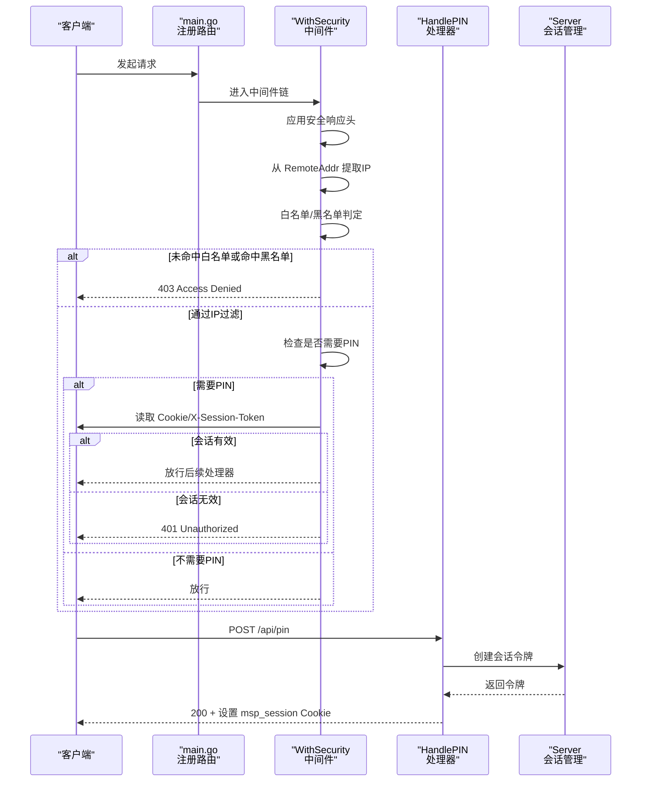
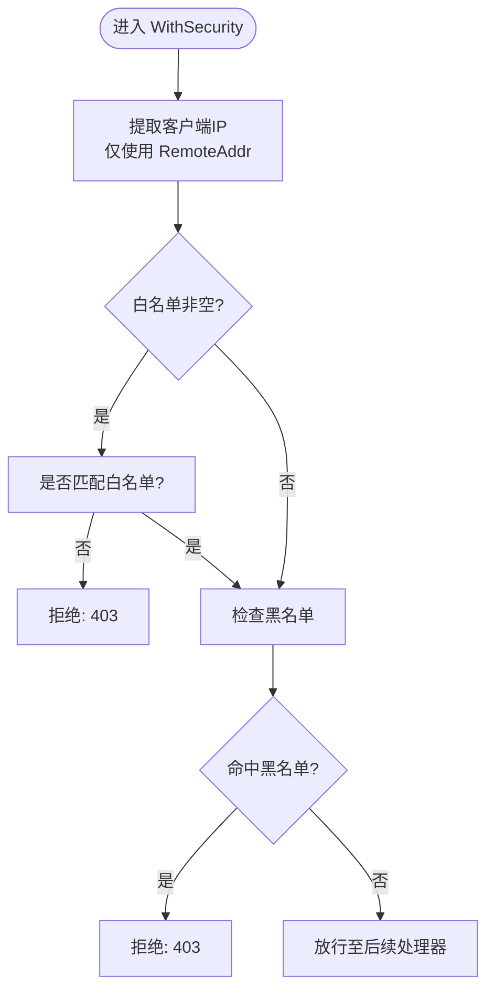
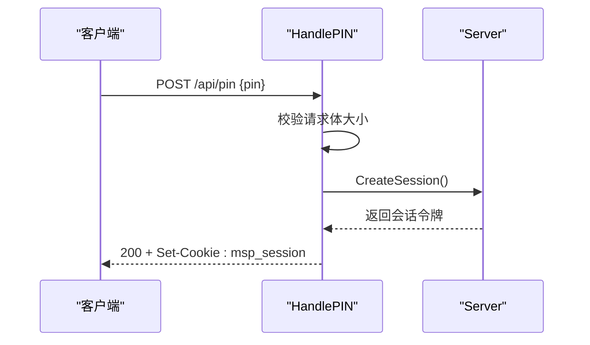
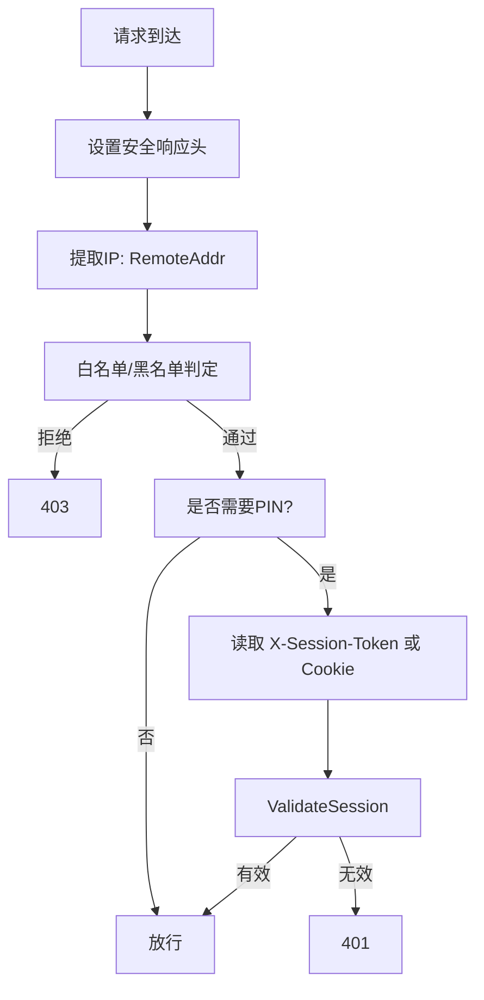
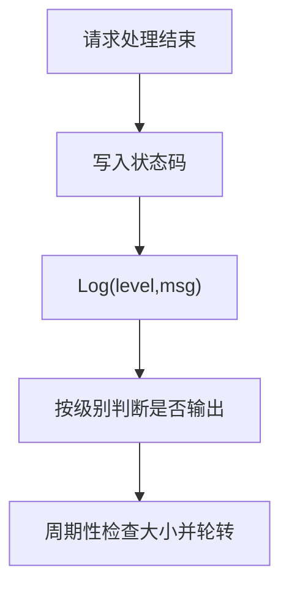
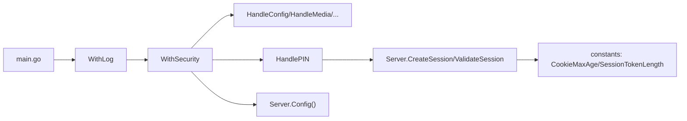

# 安全系统

<cite>
**本文引用的文件**
- [docs/SECURITY.md](file://docs/SECURITY.md)
- [docs/SECURITY_QUICKSTART.md](file://docs/SECURITY_QUICKSTART.md)
- [internal/handler/middleware.go](file://internal/handler/middleware.go)
- [internal/handler/handlers.go](file://internal/handler/handlers.go)
- [internal/config/config.go](file://internal/config/config.go)
- [internal/constants/constants.go](file://internal/constants/constants.go)
- [internal/constants/errors.go](file://internal/constants/errors.go)
- [internal/server/server.go](file://internal/server/server.go)
- [internal/handler/pin_test.go](file://internal/handler/pin_test.go)
- [internal/handler/middleware_test.go](file://internal/handler/middleware_test.go)
- [internal/handler/handlers_safety_test.go](file://internal/handler/handlers_safety_test.go)
- [cmd/msp/main.go](file://cmd/msp/main.go)
- [SECURITY_AUDIT_REPORT.md](file://SECURITY_AUDIT_REPORT.md)
</cite>

## 目录
1. [简介](#简介)
2. [项目结构](#项目结构)
3. [核心组件](#核心组件)
4. [架构总览](#架构总览)
5. [详细组件分析](#详细组件分析)
6. [依赖关系分析](#依赖关系分析)
7. [性能考量](#性能考量)
8. [故障排查指南](#故障排查指南)
9. [结论](#结论)
10. [附录](#附录)

## 简介
本文件系统性梳理 MSP 项目的安全体系，重点覆盖：
- IP 访问控制（白名单/黑名单）的配置与执行逻辑
- PIN 认证系统（生成、验证、会话管理、安全策略）
- 中间件安全验证流程与安全策略
- 安全最佳实践（网络安全、访问控制、数据保护）
- 审计日志记录与分析
- 常见安全威胁与防护、安全配置检查清单与定期评估指南
- 安全事件监控与响应机制

## 项目结构
MSP 的安全能力主要由以下模块协同实现：
- 配置层：定义安全配置项（IP 白名单/黑名单、PIN 开关与值）
- 中间件层：统一执行 IP 过滤与 PIN 会话校验
- 处理器层：提供 /api/pin 端点完成 PIN 验证与会话发放
- 服务器层：负责会话生命周期管理、日志与安全头部设置
- 文档与测试：提供安全配置指南、快速开始、单元测试与安全审计报告

**图表来源**
- [cmd/msp/main.go](file://cmd/msp/main.go#L85-L107)
- [internal/handler/middleware.go](file://internal/handler/middleware.go#L77-L120)
- [internal/handler/handlers.go](file://internal/handler/handlers.go#L255-L319)
- [internal/server/server.go](file://internal/server/server.go#L570-L626)
- [internal/config/config.go](file://internal/config/config.go#L56-L88)
- [internal/constants/constants.go](file://internal/constants/constants.go#L7-L50)
- [internal/constants/errors.go](file://internal/constants/errors.go#L3-L67)
- [internal/handler/pin_test.go](file://internal/handler/pin_test.go#L16-L135)
- [internal/handler/middleware_test.go](file://internal/handler/middleware_test.go#L13-L311)
- [internal/handler/handlers_safety_test.go](file://internal/handler/handlers_safety_test.go#L42-L100)
- [docs/SECURITY.md](file://docs/SECURITY.md#L1-L188)
- [SECURITY_AUDIT_REPORT.md](file://SECURITY_AUDIT_REPORT.md#L1-L632)

**章节来源**
- [cmd/msp/main.go](file://cmd/msp/main.go#L85-L107)
- [docs/SECURITY.md](file://docs/SECURITY.md#L1-L188)
- [docs/SECURITY_QUICKSTART.md](file://docs/SECURITY_QUICKSTART.md#L1-L248)

## 核心组件
- 安全配置模型（SecurityConfig）
  - IP 白名单与黑名单：支持单 IP 与 CIDR
  - TrustProxy：配置兼容保留（家庭模式忽略代理头）
  - PINEnabled 与 PIN：PIN 开关与默认值
- 中间件 WithSecurity
  - 应用安全响应头
  - 从 RemoteAddr 提取客户端 IP（家庭模式不信任代理头）
  - IP 白名单/黑名单判定
  - PIN 会话校验（基于 Cookie/X-Session-Token）
- PIN 处理器 HandlePIN
  - 校验请求体负载上限
  - 使用恒定时间比较验证 PIN
  - 成功后创建会话令牌并下发 HttpOnly Cookie
- 服务器会话管理
  - 会话令牌生成（加密安全随机数）
  - 会话存储与过期清理
  - Cookie 安全属性（HttpOnly/SameSite/Lax）
- 日志与审计
  - 统一日志接口与轮转
  - 请求日志记录（含 UA、状态码、耗时）
  - 新设备首次访问提示

**章节来源**
- [internal/config/config.go](file://internal/config/config.go#L56-L88)
- [internal/handler/middleware.go](file://internal/handler/middleware.go#L77-L132)
- [internal/handler/handlers.go](file://internal/handler/handlers.go#L255-L319)
- [internal/server/server.go](file://internal/server/server.go#L570-L626)
- [internal/constants/constants.go](file://internal/constants/constants.go#L7-L50)
- [internal/constants/errors.go](file://internal/constants/errors.go#L3-L67)

## 架构总览
MSP 的安全控制链路如下：
- 请求进入后，按顺序应用 WithGzip、WithLog、WithSecurity
- WithSecurity 决定是否放行：先做 IP 白/黑名单过滤，再做 PIN 会话校验
- HandlePIN 仅在 PIN 开启时生效，成功后下发会话 Cookie
- 服务器侧维护会话表，定期清理过期会话

**图表来源**
- [cmd/msp/main.go](file://cmd/msp/main.go#L65-L74)
- [internal/handler/middleware.go](file://internal/handler/middleware.go#L77-L120)
- [internal/handler/handlers.go](file://internal/handler/handlers.go#L255-L319)
- [internal/server/server.go](file://internal/server/server.go#L570-L626)

## 详细组件分析

### IP 访问控制（白名单/黑名单）
- IP 来源提取
  - 家庭模式仅信任 RemoteAddr，不采用代理头，避免 IP 欺骗
- 规则匹配
  - 白名单优先：若配置非空，仅允许白名单内的 IP
  - 黑名单：命中黑名单直接拒绝
  - 支持 CIDR 与精确 IP
- 测试覆盖
  - 单元测试覆盖 CIDR 匹配、白/黑名单组合、代理头忽略等场景

**图表来源**
- [internal/handler/middleware.go](file://internal/handler/middleware.go#L134-L163)
- [internal/handler/middleware_test.go](file://internal/handler/middleware_test.go#L13-L87)

**章节来源**
- [internal/handler/middleware.go](file://internal/handler/middleware.go#L77-L132)
- [internal/handler/middleware_test.go](file://internal/handler/middleware_test.go#L13-L87)

### PIN 认证系统
- 端点与流程
  - /api/pin：POST 接收 PIN，校验后下发 msp_session Cookie
  - 会话令牌长度与有效期由常量控制
- 安全设计
  - 恒定时间比较，防止时序攻击
  - Cookie 属性：HttpOnly、SameSite=Lax、非 HTTPS（家庭模式）
  - 会话过期自动清理
- 测试覆盖
  - PIN 正确/错误、负载过大、Cookie 安全标志等

**图表来源**
- [internal/handler/handlers.go](file://internal/handler/handlers.go#L255-L319)
- [internal/server/server.go](file://internal/server/server.go#L570-L590)
- [internal/constants/constants.go](file://internal/constants/constants.go#L45-L49)

**章节来源**
- [internal/handler/handlers.go](file://internal/handler/handlers.go#L255-L319)
- [internal/server/server.go](file://internal/server/server.go#L570-L626)
- [internal/constants/constants.go](file://internal/constants/constants.go#L7-L50)
- [internal/handler/pin_test.go](file://internal/handler/pin_test.go#L16-L135)
- [internal/handler/handlers_safety_test.go](file://internal/handler/handlers_safety_test.go#L42-L100)

### 中间件安全验证执行流程
- 安全响应头：X-Content-Type-Options、X-Frame-Options、X-XSS-Protection、Referrer-Policy
- IP 过滤：白/黑名单判定
- PIN 判定：仅对 /api/*（除 /api/pin、/api/ip、/api/config）生效
- 会话校验：优先读取 X-Session-Token，其次读取 Cookie msp_session

**图表来源**
- [internal/handler/middleware.go](file://internal/handler/middleware.go#L77-L120)
- [internal/handler/middleware.go](file://internal/handler/middleware.go#L203-L228)

**章节来源**
- [internal/handler/middleware.go](file://internal/handler/middleware.go#L77-L132)
- [internal/handler/middleware.go](file://internal/handler/middleware.go#L203-L228)

### 审计日志与监控
- 日志接口：统一级别（debug/info/error）、按配置输出
- 日志轮转：达到阈值自动轮转
- 请求日志：记录方法、路径、状态码、User-Agent、耗时
- 新设备识别：首次访问 IP 输出提示

**图表来源**
- [internal/server/server.go](file://internal/server/server.go#L286-L311)
- [internal/server/server.go](file://internal/server/server.go#L190-L284)

**章节来源**
- [internal/server/server.go](file://internal/server/server.go#L190-L311)
- [internal/constants/constants.go](file://internal/constants/constants.go#L25-L35)

### 安全最佳实践
- 网络安全
  - 家庭模式默认不信任代理头，仅使用 RemoteAddr
  - 仅在受控局域网部署，避免直接暴露公网
- 访问控制
  - 优先使用 IP 白名单限制来源
  - PIN 开启后，所有 /api/* 需要有效会话
- 数据保护
  - Cookie 设置 HttpOnly 与 SameSite
  - 恒定时间比较防止时序攻击
  - 负载限制与超时配置防止滥用

**章节来源**
- [docs/SECURITY.md](file://docs/SECURITY.md#L169-L187)
- [docs/SECURITY_QUICKSTART.md](file://docs/SECURITY_QUICKSTART.md#L234-L239)
- [internal/handler/middleware.go](file://internal/handler/middleware.go#L122-L132)
- [internal/handler/handlers.go](file://internal/handler/handlers.go#L289-L313)

### 常见威胁与防护
- 符号链接绕过与路径遍历
  - 审计报告指出：IsAllowedFile 仅检查路径在共享根内，未防符号链接跳转
  - 建议：在文件打开前解析并校验符号链接目标仍在允许范围内
- FFmpeg 命令注入
  - TranscodeStream 直接使用用户输入构建命令
  - 建议：对输入路径进行字符集与格式验证，限制允许扩展名
- 配置信息泄露
  - /api/config 返回完整配置，包含敏感字段
  - 建议：对外返回时过滤敏感字段（如 PIN）

**章节来源**
- [SECURITY_AUDIT_REPORT.md](file://SECURITY_AUDIT_REPORT.md#L19-L121)
- [SECURITY_AUDIT_REPORT.md](file://SECURITY_AUDIT_REPORT.md#L128-L207)
- [SECURITY_AUDIT_REPORT.md](file://SECURITY_AUDIT_REPORT.md#L466-L481)

## 依赖关系分析
- 组件耦合
  - WithSecurity 依赖 Server.Config 读取安全配置
  - HandlePIN 依赖 Server.CreateSession/ValidateSession
  - 日志与轮转依赖 Server.Log/LogRequest
- 关键依赖链
  - main.go → WithLog → WithSecurity → 处理器
  - WithSecurity → getClientIP/isIPAllowed/requirePIN
  - HandlePIN → constantTimeCompare → Server.CreateSession

**图表来源**
- [cmd/msp/main.go](file://cmd/msp/main.go#L65-L74)
- [internal/handler/middleware.go](file://internal/handler/middleware.go#L77-L120)
- [internal/handler/handlers.go](file://internal/handler/handlers.go#L255-L319)
- [internal/server/server.go](file://internal/server/server.go#L570-L626)
- [internal/constants/constants.go](file://internal/constants/constants.go#L45-L49)

**章节来源**
- [cmd/msp/main.go](file://cmd/msp/main.go#L85-L107)
- [internal/handler/middleware.go](file://internal/handler/middleware.go#L77-L132)
- [internal/handler/handlers.go](file://internal/handler/handlers.go#L255-L319)
- [internal/server/server.go](file://internal/server/server.go#L570-L626)

## 性能考量
- 会话存储：内存 map 存储令牌与过期时间，读写加锁
- 日志轮转：按日志条数周期性检查，减少 Stat 调用开销
- 媒体缓存：内存缓存 + ETag，降低重复扫描成本
- 超时配置：合理设置读取/空闲超时，避免连接泄漏

**章节来源**
- [internal/server/server.go](file://internal/server/server.go#L54-L56)
- [internal/server/server.go](file://internal/server/server.go#L250-L284)
- [internal/constants/constants.go](file://internal/constants/constants.go#L37-L47)

## 故障排查指南
- 无法访问
  - 检查白名单是否包含当前 IP
  - 确认未被黑名单命中
  - 参考启动日志中的可用访问地址
- 401 未授权
  - 确认 PIN 已开启
  - 通过 /api/pin 验证并确认 Cookie 设置
  - 检查 X-Session-Token 是否随请求携带
- 403 访问被拒绝
  - 检查 IP 是否在白名单/黑名单配置中
  - 家庭模式不信任代理头，确认来源 IP 正确
- 日志问题
  - 检查日志文件路径与权限
  - 观察轮转是否正常触发

**章节来源**
- [docs/SECURITY_QUICKSTART.md](file://docs/SECURITY_QUICKSTART.md#L106-L135)
- [docs/SECURITY.md](file://docs/SECURITY.md#L169-L187)
- [internal/server/server.go](file://internal/server/server.go#L190-L284)

## 结论
MSP 的安全系统在家庭/局域网场景下提供了清晰的边界：通过严格的 IP 白/黑名单与 PIN 会话机制，结合安全响应头与日志审计，形成多层防护。同时，审计报告也明确了符号链接绕过与命令注入等高危隐患，建议优先修复并持续完善安全测试与监控。

## 附录

### 安全配置检查清单
- [ ] IP 白名单已配置并包含必要来源
- [ ] 黑名单已配置并覆盖已知恶意来源
- [ ] PIN 已启用并设置为 6-8 位数字
- [ ] Cookie 安全属性（HttpOnly/SameSite）已满足
- [ ] 日志轮转与保留策略已启用
- [ ] 超时与资源限制已按需配置
- [ ] 审计日志包含必要的访问与错误信息

### 定期安全评估指南
- 代码静态分析：重点检查路径解析、命令拼接、输入验证
- 渗透测试：模拟符号链接绕过、命令注入、暴力破解
- 配置审计：核对白/黑名单、PIN 强度、日志与告警策略
- 回归测试：新增安全特性后补充单元测试与集成测试