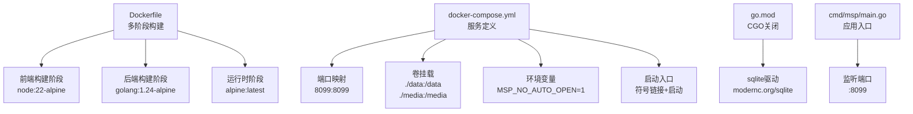
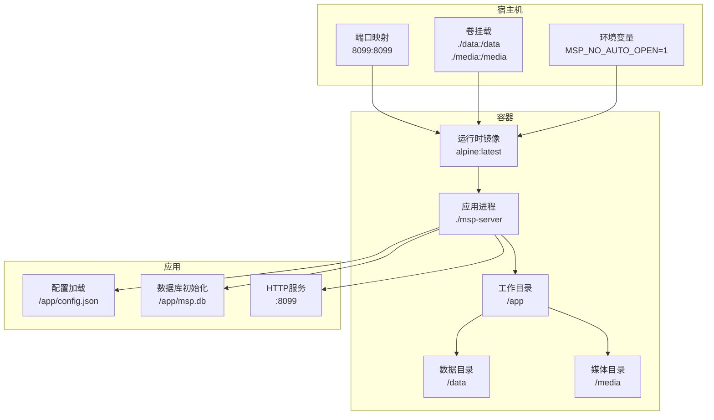
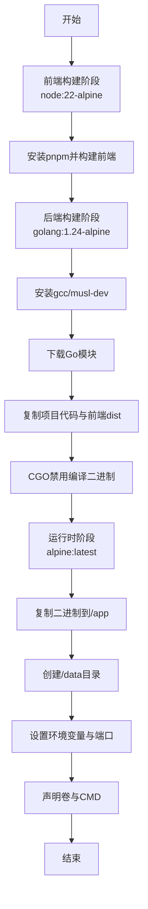
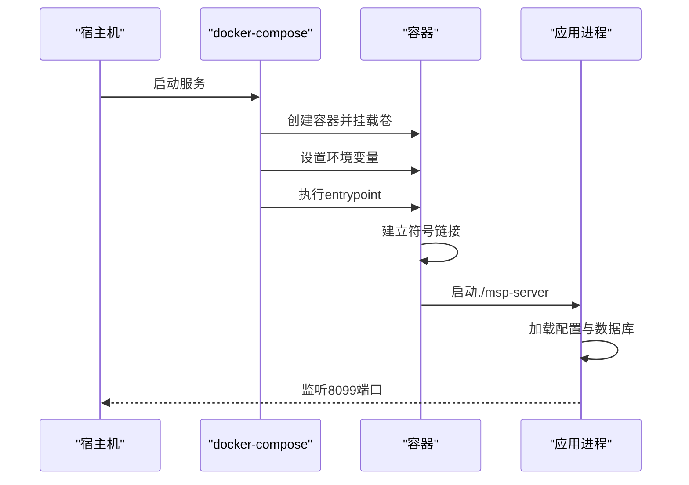
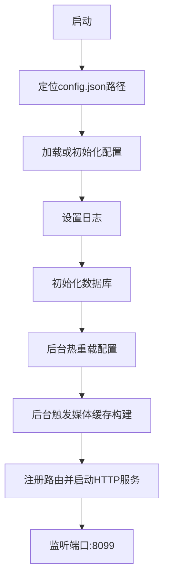
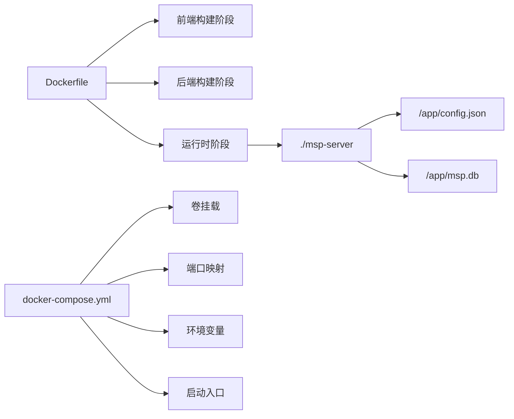

# Docker容器部署

<cite>
**本文引用的文件**
- [Dockerfile](file://Dockerfile)
- [docker-compose.yml](file://docker-compose.yml)
- [scripts/build.sh](file://scripts/build.sh)
- [scripts/dev.sh](file://scripts/dev.sh)
- [config.example.json](file://config.example.json)
- [docs/CONFIG_EXAMPLE.md](file://docs/CONFIG_EXAMPLE.md)
- [docs/SECURITY.md](file://docs/SECURITY.md)
- [go.mod](file://go.mod)
- [cmd/msp/main.go](file://cmd/msp/main.go)
- [README.md](file://README.md)
</cite>

## 目录
1. [简介](#简介)
2. [项目结构](#项目结构)
3. [核心组件](#核心组件)
4. [架构总览](#架构总览)
5. [详细组件分析](#详细组件分析)
6. [依赖关系分析](#依赖关系分析)
7. [性能考虑](#性能考虑)
8. [故障排查指南](#故障排查指南)
9. [结论](#结论)
10. [附录](#附录)

## 简介
本指南面向希望使用Docker部署MSP媒体服务器的用户，覆盖以下内容：
- Dockerfile多阶段构建详解：前端构建、后端编译、最终镜像优化
- docker-compose.yml配置说明：卷挂载、端口映射、环境变量、启动入口
- 完整部署命令与配置示例：数据持久化、网络设置、健康检查
- 运行时注意事项：数据目录权限、端口冲突、资源限制
- 运维操作：容器监控、日志查看、容器重建

## 项目结构
围绕Docker部署的关键文件与职责如下：
- Dockerfile：定义三阶段构建（前端、后端、运行时），输出精简Alpine镜像
- docker-compose.yml：定义服务、端口映射、卷挂载、环境变量、启动入口
- scripts/build.sh：跨平台二进制构建脚本（非容器构建，供理解项目产物）
- scripts/dev.sh：开发环境脚本（非容器构建，便于理解前后端分离）
- config.example.json 与 docs/CONFIG_EXAMPLE.md/docs/SECURITY.md：配置与安全参考
- go.mod：后端依赖（CGO关闭，sqlite驱动来自modernc.org/sqlite）
- cmd/msp/main.go：应用入口，监听端口、加载配置与数据库、注册路由

图表来源
- [Dockerfile](file://Dockerfile#L1-L49)
- [docker-compose.yml](file://docker-compose.yml#L1-L20)
- [go.mod](file://go.mod#L1-L31)
- [cmd/msp/main.go](file://cmd/msp/main.go#L60-L83)

章节来源
- [Dockerfile](file://Dockerfile#L1-L49)
- [docker-compose.yml](file://docker-compose.yml#L1-L20)
- [go.mod](file://go.mod#L1-L31)
- [cmd/msp/main.go](file://cmd/msp/main.go#L60-L83)

## 核心组件
- 多阶段构建镜像
  - 前端构建：基于node:22-alpine，使用pnpm安装依赖并打包静态资源
  - 后端构建：基于golang:1.24-alpine，下载模块，复制前端产物，CGO禁用编译
  - 运行时：基于alpine:latest，创建/data目录，暴露8099端口，声明/data与/media卷
- Compose服务
  - 映射宿主机8099端口至容器8099
  - 卷挂载：./data映射到容器/data（存放config.json与msp.db），./media映射到容器/media（媒体库）
  - 环境变量：MSP_NO_AUTO_OPEN=1（避免容器内自动打开浏览器）
  - 启动入口：先建立符号链接将/data/config.json与/data/msp.db指向/app目录，再启动服务

章节来源
- [Dockerfile](file://Dockerfile#L3-L11)
- [Dockerfile](file://Dockerfile#L13-L27)
- [Dockerfile](file://Dockerfile#L29-L48)
- [docker-compose.yml](file://docker-compose.yml#L7-L19)

## 架构总览
下图展示Docker部署的整体架构与数据流：

图表来源
- [docker-compose.yml](file://docker-compose.yml#L7-L19)
- [Dockerfile](file://Dockerfile#L35-L48)
- [cmd/msp/main.go](file://cmd/msp/main.go#L30-L45)

## 详细组件分析

### Dockerfile多阶段构建
- 前端构建阶段
  - 基础镜像：node:22-alpine
  - 工具链：启用Corepack并准备pnpm
  - 步骤：复制前端包管理文件、安装依赖、复制源码、执行构建
- 后端构建阶段
  - 基础镜像：golang:1.24-alpine
  - 工具：安装gcc与musl-dev（为CGO/sqlite做准备）
  - 步骤：复制go.mod/go.sum并下载依赖，复制项目代码，复制前端dist产物，CGO禁用编译出Linux二进制
- 运行时阶段
  - 基础镜像：alpine:latest
  - 步骤：复制后端二进制至/app，创建/data目录，设置MSP_NO_AUTO_OPEN=1，暴露8099端口，声明/data与/media卷，设置CMD为./msp-server

图表来源
- [Dockerfile](file://Dockerfile#L3-L11)
- [Dockerfile](file://Dockerfile#L13-L27)
- [Dockerfile](file://Dockerfile#L29-L48)

章节来源
- [Dockerfile](file://Dockerfile#L1-L49)

### docker-compose.yml配置详解
- 服务定义
  - build: .（使用当前目录的Dockerfile）
  - image: msp-server:latest（镜像名称）
  - container_name: msp（容器名）
  - restart: unless-stopped（异常退出重启策略）
- 端口映射
  - 8099:8099（宿主机端口:容器端口）
- 卷挂载
  - ./data:/data（持久化配置与数据库）
  - ./media:/media（媒体库映射）
- 环境变量
  - MSP_NO_AUTO_OPEN=1（避免容器内自动打开浏览器）
- 启动入口
  - 先建立符号链接：/data/config.json -> /app/config.json，/data/msp.db -> /app/msp.db，再启动./msp-server

图表来源
- [docker-compose.yml](file://docker-compose.yml#L1-L20)
- [cmd/msp/main.go](file://cmd/msp/main.go#L30-L45)

章节来源
- [docker-compose.yml](file://docker-compose.yml#L1-L20)

### 应用入口与配置加载
- 应用入口
  - 从可执行文件所在目录拼接config.json路径并加载
  - 初始化日志、数据库（失败时记录警告）
  - 注册路由并启动HTTP服务，监听端口
- 配置与数据库
  - 配置文件与数据库默认位于应用工作目录（/app）
  - Compose通过符号链接将/data下的config.json与msp.db映射到/app

图表来源
- [cmd/msp/main.go](file://cmd/msp/main.go#L26-L83)
- [docker-compose.yml](file://docker-compose.yml#L17-L19)

章节来源
- [cmd/msp/main.go](file://cmd/msp/main.go#L26-L83)
- [docker-compose.yml](file://docker-compose.yml#L17-L19)

### 配置与安全参考
- 配置文件位置
  - config.json位于应用工作目录（/app），通过符号链接由/data映射
- 关键配置项
  - 端口：默认8099
  - 日志：logLevel、logFile
  - 共享目录：shares
  - 功能开关：features（speed、quality、captions、playlist）
  - UI设置：ui（defaultTab、showOthers）
  - 播放行为：playback（audio/video/image）
  - 黑名单：blacklist（extensions、filenames、folders、sizeRule）
  - 安全：security（ipWhitelist、ipBlacklist、pinEnabled、pin）
- 安全建议
  - 局域网建议使用IP白名单
  - 可结合PIN认证提升访问控制
  - 配置支持热重载，保存后约2秒生效

章节来源
- [config.example.json](file://config.example.json#L1-L56)
- [docs/CONFIG_EXAMPLE.md](file://docs/CONFIG_EXAMPLE.md#L1-L202)
- [docs/SECURITY.md](file://docs/SECURITY.md#L1-L188)

## 依赖关系分析
- 构建依赖
  - 前端：node:22-alpine + pnpm
  - 后端：golang:1.24-alpine + gcc/musl-dev
  - 运行时：alpine:latest
- 运行依赖
  - 应用二进制：./msp-server
  - 数据库：msp.db（SQLite）
  - 配置：config.json
- 外部集成
  - Compose负责卷挂载、端口映射、环境变量注入与启动入口

图表来源
- [Dockerfile](file://Dockerfile#L1-L49)
- [docker-compose.yml](file://docker-compose.yml#L1-L20)

章节来源
- [Dockerfile](file://Dockerfile#L1-L49)
- [docker-compose.yml](file://docker-compose.yml#L1-L20)

## 性能考虑
- 多阶段构建优势
  - 构建阶段使用完整工具链，运行阶段仅包含最小运行时，减小镜像体积与攻击面
- CGO与sqlite
  - 构建时CGO禁用，使用modernc.org/sqlite，避免动态库依赖，提升可移植性
- 进程与内存
  - 应用入口设置GC百分比以降低内存占用
- I/O与缓存
  - 媒体库通过卷挂载共享，避免重复拷贝
  - 配置与数据库持久化，减少冷启动开销

章节来源
- [Dockerfile](file://Dockerfile#L26-L27)
- [go.mod](file://go.mod#L6-L29)
- [cmd/msp/main.go](file://cmd/msp/main.go#L26-L28)

## 故障排查指南
- 端口冲突
  - 确认宿主机8099端口未被占用；如冲突，修改compose的宿主机端口映射
- 数据目录权限
  - 确保宿主机./data目录对运行容器用户可读写；若权限不足，可能导致配置或数据库写入失败
- 端口映射错误
  - 检查compose中ports字段是否为8099:8099；容器内应用默认监听8099
- 卷挂载路径
  - 确认./data与./media存在且路径正确；容器内期望/data与/media目录
- 自动打开浏览器
  - 如需在宿主机打开浏览器，可移除MSP_NO_AUTO_OPEN=1或设置为0
- 配置热重载
  - 修改config.json后，应用会在约2秒内热重载；如无效，检查文件格式与权限
- 日志查看
  - 容器标准输出包含启动日志与访问URL；也可查看日志文件（logFile）所在目录

章节来源
- [docker-compose.yml](file://docker-compose.yml#L7-L19)
- [cmd/msp/main.go](file://cmd/msp/main.go#L109-L123)
- [docs/CONFIG_EXAMPLE.md](file://docs/CONFIG_EXAMPLE.md#L195-L198)

## 结论
通过Docker多阶段构建与Compose编排，MSP实现了：
- 前后端分离的构建流程与最小化的运行时镜像
- 易于维护的数据持久化与媒体库共享
- 简洁的端口映射与环境变量配置
- 可靠的配置热重载与日志输出
按本指南完成部署后，即可在家庭局域网中快速运行MSP媒体服务器。

## 附录

### 完整部署命令与示例
- 构建镜像
  - 使用Dockerfile构建：docker build -t msp-server:latest .
- 启动服务
  - 使用Compose启动：docker compose up -d
- 停止与删除
  - 停止：docker compose down
  - 删除：docker compose down -v（同时删除命名卷）
- 查看日志
  - 实时日志：docker compose logs -f
  - 指定服务：docker compose logs -f msp
- 进入容器
  - docker compose exec msp sh
- 重建镜像
  - docker compose build --no-cache
  - docker compose up -d

章节来源
- [Dockerfile](file://Dockerfile#L1-L49)
- [docker-compose.yml](file://docker-compose.yml#L1-L20)

### 数据持久化配置
- 卷挂载
  - ./data:/data：持久化config.json与msp.db
  - ./media:/media：媒体库映射
- 启动入口符号链接
  - 将/data/config.json与/data/msp.db软链接到/app目录，保证应用读取到宿主机数据

章节来源
- [docker-compose.yml](file://docker-compose.yml#L9-L19)

### 网络与安全设置
- 端口映射
  - 8099:8099（宿主机:容器）
- 环境变量
  - MSP_NO_AUTO_OPEN=1（避免容器内自动打开浏览器）
- 安全配置
  - IP白名单与黑名单：限制访问来源
  - PIN认证：增强访问控制
  - 配置热重载：保存后约2秒生效

章节来源
- [docker-compose.yml](file://docker-compose.yml#L7-L16)
- [docs/SECURITY.md](file://docs/SECURITY.md#L1-L188)
- [docs/CONFIG_EXAMPLE.md](file://docs/CONFIG_EXAMPLE.md#L1-L202)

### 健康检查建议
- 当前Compose未配置健康检查；可在生产环境中增加HTTP健康检查端点（如GET /api/config），以实现自动重启与监控联动

[本节为通用建议，不直接分析具体文件]