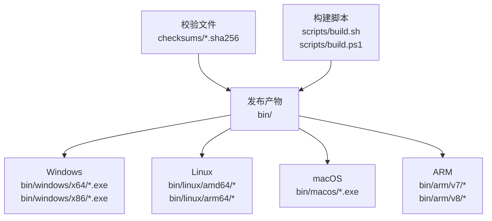
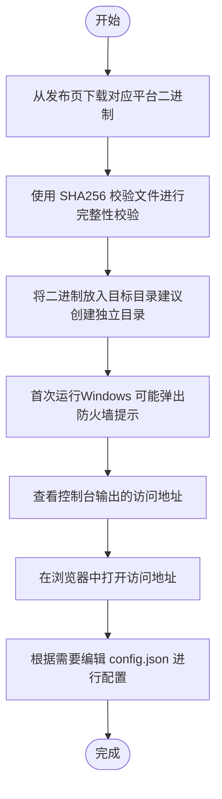
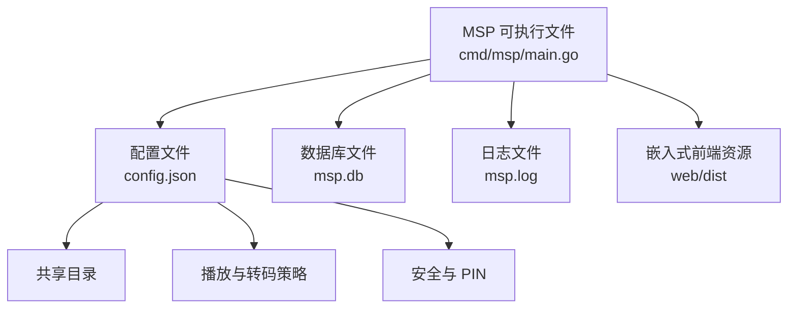

# 二进制文件安装

<cite>
**本文引用的文件**
- [README.md](file://README.md)
- [Installation.md](file://msp.wiki/Installation.md)
- [Installation_CN.md](file://msp.wiki/Installation_CN.md)
- [build.sh](file://scripts/build.sh)
- [build.ps1](file://scripts/build.ps1)
- [main.go](file://cmd/msp/main.go)
- [util.go](file://internal/util/util.go)
- [constants.go](file://internal/constants/constants.go)
- [config.example.json](file://config.example.json)
- [bin.windows.x64.config.json](file://bin/windows/x64/config.json)
- [bin.dev.config.json](file://bin/dev/config.json)
- [msp-windows-amd64.sha256](file://checksums/msp-windows-amd64.sha256)
- [msp-linux-amd64.sha256](file://checksums/msp-linux-amd64.sha256)
- [msp-macos-amd64.sha256](file://checksums/msp-macos-amd64.sha256)
- [msp-arm-v7.sha256](file://checksums/msp-arm-v7.sha256)
- [msp-arm-v8.sha256](file://checksums/msp-arm-v8.sha256)
</cite>

## 目录
1. [简介](#简介)
2. [项目结构](#项目结构)
3. [核心组件](#核心组件)
4. [架构总览](#架构总览)
5. [详细组件分析](#详细组件分析)
6. [依赖关系分析](#依赖关系分析)
7. [性能考量](#性能考量)
8. [故障排查指南](#故障排查指南)
9. [结论](#结论)
10. [附录](#附录)

## 简介
本指南面向首次安装与部署 MSP 二进制文件的用户，覆盖 Windows、Linux、macOS 以及 ARM 架构版本的下载、校验、安装与运行流程。文档同时提供平台特定注意事项（如 Windows 服务、Linux 系统服务、macOS 权限），以及安装后的基础验证步骤与常见问题排查方法。

## 项目结构
仓库提供了多平台二进制文件与对应的 SHA256 校验文件，便于用户在不同操作系统上进行下载与完整性校验。构建脚本展示了官方产物的命名规范与生成流程，帮助用户识别正确的文件名与架构标识。

图表来源
- [build.sh](file://scripts/build.sh#L150-L201)
- [build.ps1](file://scripts/build.ps1#L146-L240)

章节来源
- [build.sh](file://scripts/build.sh#L150-L201)
- [build.ps1](file://scripts/build.ps1#L146-L240)

## 核心组件
- 启动入口与运行行为
  - 可执行文件在启动时自动定位自身所在目录作为配置与数据的根目录，并加载 config.json。
  - 默认监听端口由常量定义，可在配置中调整；首次启动会打印本地与局域网访问地址。
- 配置与数据存储
  - 配置文件 config.json 放置于可执行文件同目录，支持热更新。
  - 数据库文件 msp.db 与日志文件 msp.log 也位于该目录下。
- 平台差异
  - Windows：可双击运行，首次运行可能触发防火墙提示。
  - macOS/Linux：直接执行二进制文件；若需要自动打开浏览器，需确保系统已安装对应命令。

章节来源
- [main.go](file://cmd/msp/main.go#L26-L83)
- [util.go](file://internal/util/util.go#L116-L123)
- [constants.go](file://internal/constants/constants.go#L8-L14)
- [Installation.md](file://msp.wiki/Installation.md#L11-L26)

## 架构总览
下图展示 MSP 二进制文件的安装与运行概览：从下载到校验、放置、运行与访问。

图表来源
- [Installation.md](file://msp.wiki/Installation.md#L3-L26)
- [msp-windows-amd64.sha256](file://checksums/msp-windows-amd64.sha256#L1-L1)
- [msp-linux-amd64.sha256](file://checksums/msp-linux-amd64.sha256#L1-L1)
- [msp-macos-amd64.sha256](file://checksums/msp-macos-amd64.sha256#L1-L1)

## 详细组件分析

### Windows 安装与运行
- 下载与选择
  - 从发布页下载 msp-windows-amd64.exe（64 位系统）。
- 放置与运行
  - 将下载的文件放入任意目录（如 D:\Tools\msp），可按需重命名为 msp.exe。
  - 双击运行，首次运行可能弹出 Windows 防火墙提示，允许“专用网络”和“公用网络”访问。
- 访问地址
  - 控制台会打印本地与局域网访问地址，通常为 http://127.0.0.1:8099 与 http://192.168.x.x:8099。
- 配置与数据
  - 配置文件 config.json 与数据库文件 msp.db 位于可执行文件同目录。
- 服务安装（可选）
  - 可使用 NSSM 或 PowerShell 将二进制注册为系统服务，以实现开机自启与后台运行。
- 环境变量
  - 若需禁用自动打开浏览器，可设置环境变量 MSP_NO_AUTO_OPEN=1。

章节来源
- [Installation.md](file://msp.wiki/Installation.md#L7-L22)
- [bin.windows.x64.config.json](file://bin/windows/x64/config.json#L1-L74)
- [main.go](file://cmd/msp/main.go#L76-L78)

### Linux 安装与运行
- 下载与选择
  - 从发布页下载 msp-linux-amd64（或 msp-linux-arm64）。
- 放置与权限
  - 将二进制放入 /usr/local/bin 或用户主目录下的 bin 目录，赋予可执行权限。
- 运行与访问
  - 直接执行二进制文件，查看控制台输出的访问地址。
- 配置与数据
  - 配置文件 config.json 与数据库文件 msp.db 位于可执行文件同目录。
- 系统服务配置（可选）
  - 使用 systemd 创建服务单元，设置 WorkingDirectory 与 ExecStart 指向二进制文件，启用 Restart 与 User。
- 环境变量
  - 设置 MSP_NO_AUTO_OPEN=1 可禁用自动打开浏览器。

章节来源
- [Installation.md](file://msp.wiki/Installation.md#L8-L26)
- [build.sh](file://scripts/build.sh#L155-L165)
- [build.ps1](file://scripts/build.ps1#L151-L161)

### macOS 安装与运行
- 下载与选择
  - 从发布页下载 msp-macos-amd64（Intel）或 msp-macos-arm64（Apple Silicon）。
- 放置与权限
  - 将二进制放入 /usr/local/bin 或 ~/bin，赋予可执行权限。
  - 如遇 Gatekeeper 提示，可在“系统偏好设置 > 安全性与隐私”中允许该应用。
- 运行与访问
  - 直接执行二进制文件，查看控制台输出的访问地址。
- 配置与数据
  - 配置文件 config.json 与数据库文件 msp.db 位于可执行文件同目录。
- 自动打开浏览器
  - macOS 会调用 open 命令打开浏览器；若未生效，检查系统默认浏览器设置。

章节来源
- [Installation.md](file://msp.wiki/Installation.md#L9-L26)
- [build.sh](file://scripts/build.sh#L179-L189)
- [build.ps1](file://scripts/build.ps1#L175-L185)
- [main.go](file://cmd/msp/main.go#L141-L150)

### ARM 架构安装与运行
- 下载与选择
  - 从发布页下载 msp-arm-v7（适用于 ARMv7）或 msp-arm-v8（ARMv8/AArch64）。
- 放置与运行
  - 将二进制放入合适目录并赋予可执行权限，直接运行查看访问地址。
- 配置与数据
  - 配置文件 config.json 与数据库文件 msp.db 位于可执行文件同目录。

章节来源
- [Installation.md](file://msp.wiki/Installation.md#L8-L26)
- [build.sh](file://scripts/build.sh#L167-L177)
- [build.ps1](file://scripts/build.ps1#L163-L173)

### 文件校验（SHA256）
- 校验流程
  - 在 Linux/macOS 上使用 sha256sum 或 shasum -a 256 对下载的二进制文件进行哈希计算。
  - 将计算结果与对应 .sha256 文件中的内容对比，确保一致。
- 示例
  - Windows: 使用 Get-FileHash -Algorithm SHA256 校验 msp-windows-amd64.exe。
  - Linux/macOS: 使用 sha256sum 输出格式为 “哈希 原文件名”，与 .sha256 文件逐行比对。
- 校验文件示例
  - Windows: msp-windows-amd64.sha256
  - Linux: msp-linux-amd64.sha256
  - macOS: msp-macos-amd64.sha256
  - ARM: msp-arm-v7.sha256、msp-arm-v8.sha256

章节来源
- [build.sh](file://scripts/build.sh#L69-L81)
- [build.ps1](file://scripts/build.ps1#L108-L115)
- [msp-windows-amd64.sha256](file://checksums/msp-windows-amd64.sha256#L1-L1)
- [msp-linux-amd64.sha256](file://checksums/msp-linux-amd64.sha256#L1-L1)
- [msp-macos-amd64.sha256](file://checksums/msp-macos-amd64.sha256#L1-L1)
- [msp-arm-v7.sha256](file://checksums/msp-arm-v7.sha256#L1-L1)
- [msp-arm-v8.sha256](file://checksums/msp-arm-v8.sha256#L1-L1)

### 安装后基本验证
- 浏览器访问
  - 打开控制台输出的访问地址，确认页面可正常加载。
- 共享目录
  - 在首次运行时添加共享目录，确保路径有效且可读。
- 端口与网络
  - 若端口被占用，修改 config.json 中的 port 字段并重启程序。
  - 确保防火墙允许程序通过（Windows 需允许专用/公用网络；Linux/macOS 需放行相应进程）。
- 日志与数据库
  - 查看 msp.log 与 msp.db 是否生成，确认无异常错误。

章节来源
- [Installation.md](file://msp.wiki/Installation.md#L24-L37)
- [bin.dev.config.json](file://bin/dev/config.json#L1-L56)
- [bin.windows.x64.config.json](file://bin/windows/x64/config.json#L1-L74)

## 依赖关系分析
下图展示 MSP 二进制文件运行时的关键依赖与交互：可执行文件、配置文件、数据库与前端资源的关系。

图表来源
- [main.go](file://cmd/msp/main.go#L30-L58)
- [config.example.json](file://config.example.json#L1-L56)
- [bin.dev.config.json](file://bin/dev/config.json#L1-L56)

章节来源
- [main.go](file://cmd/msp/main.go#L30-L58)
- [config.example.json](file://config.example.json#L1-L56)

## 性能考量
- 内存与 GC
  - 启动时设置 GC 百分比以降低内存占用，适合家庭服务器场景。
- 端口与超时
  - 默认端口为 8099；HTTP 服务器设置了合理的读取与空闲超时，以适配长时媒体流。
- 日志轮转
  - 日志文件达到一定大小后会进行轮转，避免日志过大影响性能。

章节来源
- [main.go](file://cmd/msp/main.go#L26-L28)
- [constants.go](file://internal/constants/constants.go#L27-L35)

## 故障排查指南
- 端口被占用
  - 修改 config.json 中的 port 字段为其他可用端口（如 8090），重启程序。
- 无法在手机上访问
  - 确保手机与电脑在同一 Wi-Fi 下；检查防火墙设置允许程序通过；使用 ipconfig 或 ifconfig 查看本机局域网 IP。
- Windows 首次运行弹出防火墙提示
  - 允许“专用网络”和“公用网络”访问，以便局域网设备连接。
- 自动打开浏览器无效
  - 设置环境变量 MSP_NO_AUTO_OPEN=1 禁用自动打开；或检查系统默认浏览器设置。
- macOS 提示无法打开
  - 在“系统偏好设置 > 安全性与隐私”中允许该应用；或手动打开浏览器访问本地地址。

章节来源
- [Installation.md](file://msp.wiki/Installation.md#L28-L37)
- [Installation_CN.md](file://msp.wiki/Installation_CN.md#L28-L37)
- [main.go](file://cmd/msp/main.go#L76-L78)

## 结论
通过本指南，您可以在 Windows、Linux、macOS 与 ARM 架构上完成 MSP 的二进制文件下载、校验、安装与运行。建议在独立目录中放置二进制文件与配置文件，按需配置共享目录与端口，并结合防火墙与系统服务设置保障稳定运行。遇到问题时，可依据故障排查章节快速定位与解决。

## 附录
- 快速参考
  - 下载地址：发布页
  - 默认端口：8099
  - 配置文件：config.json（与二进制同目录）
  - 数据库文件：msp.db（与二进制同目录）
  - 日志文件：msp.log（与二进制同目录）

章节来源
- [README.md](file://README.md#L61-L71)
- [constants.go](file://internal/constants/constants.go#L8-L14)
- [config.example.json](file://config.example.json#L1-L56)