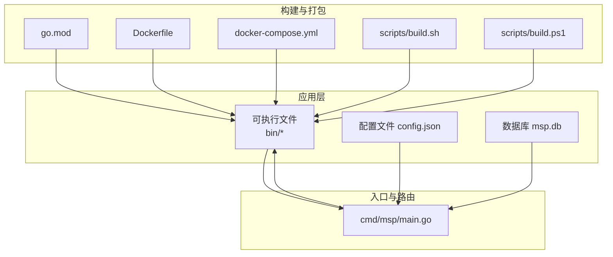
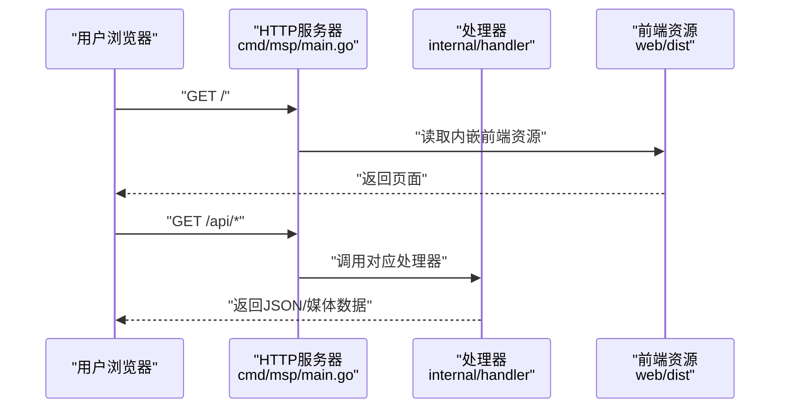
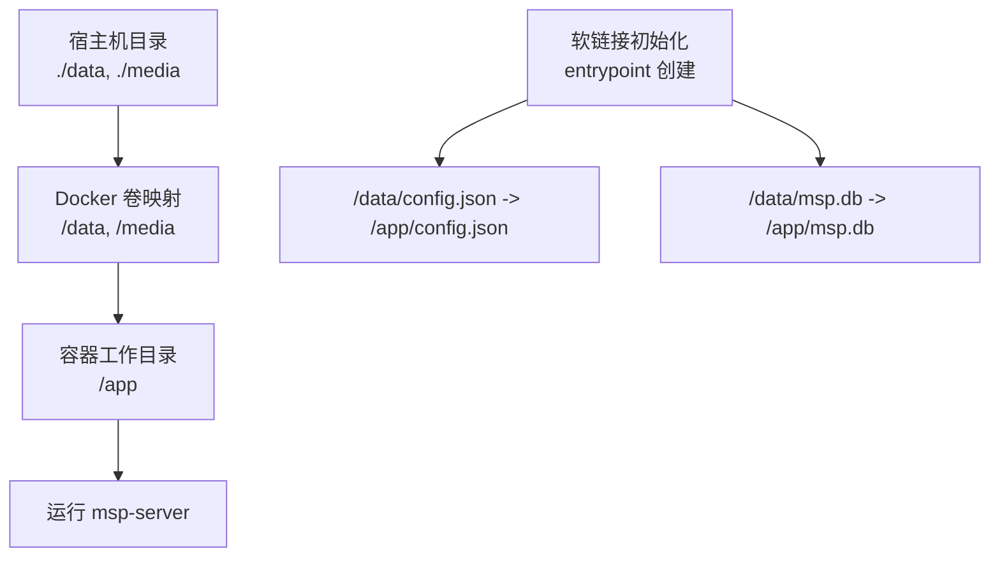
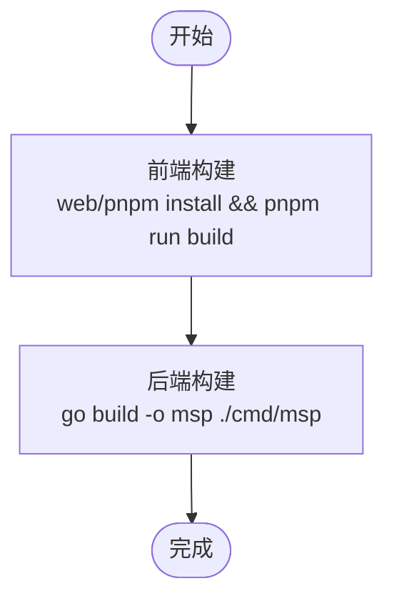
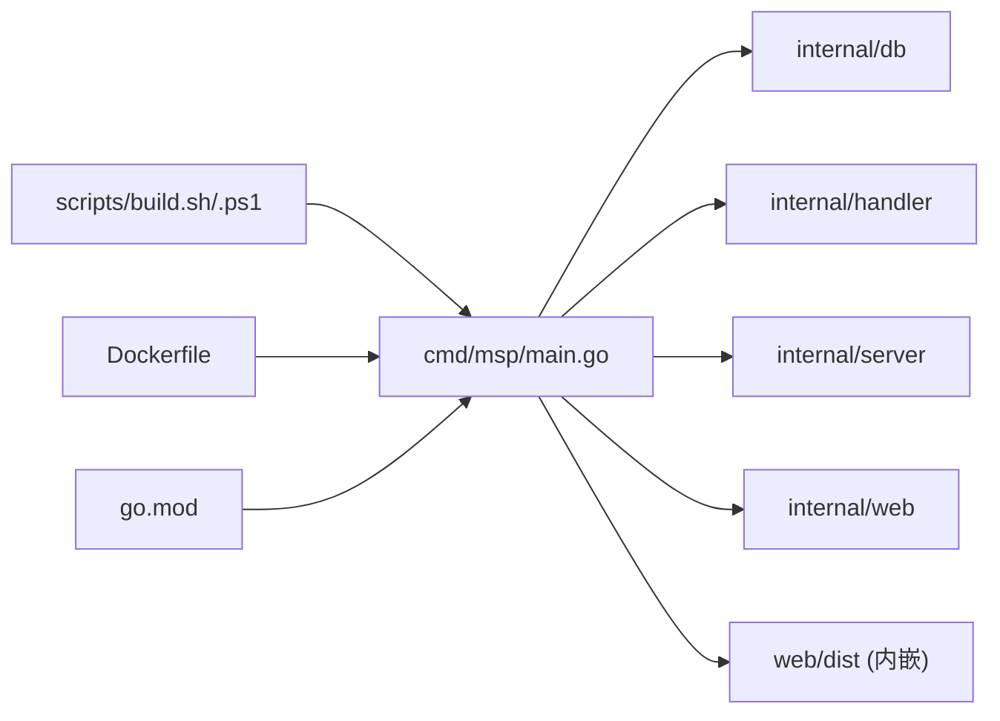

# 安装与部署

<cite>
**本文引用的文件**
- [README.md](file://README.md)
- [Dockerfile](file://Dockerfile)
- [docker-compose.yml](file://docker-compose.yml)
- [scripts/build.sh](file://scripts/build.sh)
- [scripts/build.ps1](file://scripts/build.ps1)
- [scripts/dev.sh](file://scripts/dev.sh)
- [scripts/dev.ps1](file://scripts/dev.ps1)
- [cmd/msp/main.go](file://cmd/msp/main.go)
- [config.example.json](file://config.example.json)
- [go.mod](file://go.mod)
- [msp.wiki/Installation.md](file://msp.wiki/Installation.md)
- [msp.wiki/Configuration.md](file://msp.wiki/Configuration.md)
- [msp.wiki/Development.md](file://msp.wiki/Development.md)
- [msp.wiki/Build.md](file://msp.wiki/Build.md)
</cite>

## 目录
1. [简介](#简介)
2. [项目结构](#项目结构)
3. [核心组件](#核心组件)
4. [架构总览](#架构总览)
5. [详细组件分析](#详细组件分析)
6. [依赖关系分析](#依赖关系分析)
7. [性能考虑](#性能考虑)
8. [故障排查指南](#故障排查指南)
9. [结论](#结论)
10. [附录](#附录)

## 简介
本文件面向运维与开发人员，提供 MSP 项目的完整安装与部署指南。内容覆盖：
- 二进制文件安装（Windows/Linux/macOS）
- Docker 容器化部署与 docker-compose 使用
- 源码编译安装（含跨平台构建与校验）
- 生产环境最佳实践（系统配置、安全设置、性能优化）
- 部署后验证与常见问题解决

## 项目结构
MSP 是一个单二进制媒体服务器，采用 Go 编写后端，前端资源通过嵌入式文件系统提供。项目支持多平台运行，并提供一键构建脚本与 Dockerfile。

图表来源
- [Dockerfile](file://Dockerfile#L1-L49)
- [docker-compose.yml](file://docker-compose.yml#L1-L20)
- [scripts/build.sh](file://scripts/build.sh#L1-L206)
- [scripts/build.ps1](file://scripts/build.ps1#L1-L245)
- [cmd/msp/main.go](file://cmd/msp/main.go#L1-L151)
- [go.mod](file://go.mod#L1-L31)

章节来源
- [README.md](file://README.md#L1-L106)
- [go.mod](file://go.mod#L1-L31)

## 核心组件
- 可执行程序：位于 bin/ 下，按平台与架构命名，直接运行即可启动服务。
- 配置文件：config.json，默认在可执行文件同目录生成，支持热重载。
- 数据库：msp.db（SQLite），默认与可执行文件同目录，持久化媒体索引与播放进度。
- 前端资源：web/dist 内嵌于二进制，无需单独部署静态文件。
- Docker 镜像：多阶段构建，包含前端构建与后端编译，运行时以 Alpine 为基础镜像。

章节来源
- [cmd/msp/main.go](file://cmd/msp/main.go#L26-L83)
- [config.example.json](file://config.example.json#L1-L56)
- [Dockerfile](file://Dockerfile#L1-L49)
- [docker-compose.yml](file://docker-compose.yml#L1-L20)

## 架构总览
MSP 的运行时由以下要素构成：
- 启动流程：解析配置 → 初始化日志 → 初始化数据库 → 注册路由 → 启动 HTTP 服务器 → 可选自动打开浏览器
- 访问路径：/api/* 提供媒体与控制接口，/ 返回内嵌前端页面
- 容器化：Dockerfile 分三阶段构建前端、后端与运行时，暴露 8099 端口，挂载 /data 与 /media

图表来源
- [cmd/msp/main.go](file://cmd/msp/main.go#L85-L107)
- [Dockerfile](file://Dockerfile#L29-L48)

## 详细组件分析

### 二进制文件安装（Windows/Linux/macOS）
- 下载：从 Releases 页面下载对应平台的可执行文件
- 运行：双击或命令行运行，首次运行会显示访问地址（本地与局域网）
- 首次运行注意事项：Windows 防火墙可能弹窗，允许私有/公共网络访问

章节来源
- [msp.wiki/Installation.md](file://msp.wiki/Installation.md#L1-L38)
- [README.md](file://README.md#L61-L71)

### Docker 容器部署
- 单机部署：使用 docker-compose.yml 将宿主机目录映射到容器的 /data 与 /media，自动创建软链指向工作目录下的 config.json 与 msp.db
- 端口映射：默认 8099 映射至宿主机
- 环境变量：禁用自动打开浏览器（MSP_NO_AUTO_OPEN=1）
- 多阶段构建：前端构建在 node:alpine，后端在 golang:alpine，运行时基于 alpine，CGO 关闭使用 modernc.org/sqlite

图表来源
- [docker-compose.yml](file://docker-compose.yml#L1-L20)
- [Dockerfile](file://Dockerfile#L29-L48)

章节来源
- [docker-compose.yml](file://docker-compose.yml#L1-L20)
- [Dockerfile](file://Dockerfile#L1-L49)

### 源码编译安装
- 环境要求：Go 1.24+，Node.js 18+，pnpm（可使用 corepack enable）
- 构建步骤：
  - 前端：进入 web 目录，安装依赖并构建
  - 后端：在项目根目录使用 go build 生成可执行文件
- 自动化脚本：
  - Windows：PowerShell 脚本，支持多平台/多架构批量构建、生成校验与调试符号
  - Linux/macOS：Bash 脚本，功能与 Windows 脚本一致

图表来源
- [scripts/build.sh](file://scripts/build.sh#L126-L203)
- [scripts/build.ps1](file://scripts/build.ps1#L40-L79)
- [go.mod](file://go.mod#L1-L31)

章节来源
- [msp.wiki/Development.md](file://msp.wiki/Development.md#L1-L97)
- [msp.wiki/Build.md](file://msp.wiki/Build.md#L1-L52)
- [scripts/build.sh](file://scripts/build.sh#L1-L206)
- [scripts/build.ps1](file://scripts/build.ps1#L1-L245)

### 开发模式（热重载与前后端联调）
- Windows：使用 dev.ps1，自动监听 *.go 变更并重启后端，前端使用 Vite 开发服务器
- Linux/macOS：使用 dev.sh，行为类似，支持端口自定义与配置自动更新

图表来源
- [scripts/dev.sh](file://scripts/dev.sh#L92-L174)
- [scripts/dev.ps1](file://scripts/dev.ps1#L13-L160)

章节来源
- [scripts/dev.sh](file://scripts/dev.sh#L1-L175)
- [scripts/dev.ps1](file://scripts/dev.ps1#L1-L160)

## 依赖关系分析
- 运行时依赖：Go 标准库、GORM、sqlite 驱动（modernc.org/sqlite）
- 构建时依赖：Node.js、pnpm、Vite（前端构建）
- 容器镜像：node:alpine（前端）、golang:alpine（后端）、alpine:latest（运行时）

图表来源
- [cmd/msp/main.go](file://cmd/msp/main.go#L1-L24)
- [go.mod](file://go.mod#L1-L31)
- [Dockerfile](file://Dockerfile#L1-L49)
- [scripts/build.sh](file://scripts/build.sh#L1-L206)
- [scripts/build.ps1](file://scripts/build.ps1#L1-L245)

章节来源
- [go.mod](file://go.mod#L1-L31)
- [cmd/msp/main.go](file://cmd/msp/main.go#L1-L24)

## 性能考虑
- 内存回收：启动时设置 GC 百分比，降低内存占用
- 超时配置：读取头超时、读取超时、空闲超时，适合长连接媒体流
- 传输压缩：内置 gzip 中间件，减少带宽占用
- 媒体扫描：默认不限量扫描，利用 SQLite 实现增量更新，后续启动接近瞬开
- 转码策略：优先直播，仅在高风险容器或失败回退时转码

章节来源
- [cmd/msp/main.go](file://cmd/msp/main.go#L26-L83)
- [README.md](file://README.md#L33-L40)

## 故障排查指南
- 端口被占用
  - 修改 config.json 的 port 字段为其他端口并重启
- 无法从手机访问
  - 确保手机与电脑在同一 Wi-Fi
  - 检查防火墙放行程序（Windows 防火墙）
  - 使用 ipconfig/ifconfig 查看局域网 IP
- 首次运行无响应
  - 等待程序完成媒体缓存扫描（初始扫描较慢）
  - 检查日志文件（默认 msp.log）
- Docker 容器无法访问
  - 确认卷映射正确（/data 与 /media）
  - 确认端口映射 8099 正常
  - 检查容器内软链接是否创建成功（entrypoint）
- 配置热重载无效
  - 确认未显式覆盖 MSP_NO_AUTO_OPEN 导致自动打开影响日志输出
  - 确认 config.json 语法正确（可参考 config.example.json）

章节来源
- [msp.wiki/Installation.md](file://msp.wiki/Installation.md#L28-L38)
- [config.example.json](file://config.example.json#L1-L56)
- [docker-compose.yml](file://docker-compose.yml#L15-L19)

## 结论
MSP 提供了极简的安装与部署体验：单二进制即可运行，支持 Docker 一键部署，源码构建自动化完善。生产部署建议结合安全策略（白名单/黑名单/PIN）与合理的媒体扫描策略，以获得稳定、安全、高性能的局域网媒体服务。

## 附录

### 配置文件字段说明（节选）
- 基础设置：port、shares、logLevel、logFile、maxItems
- 黑名单过滤：extensions、filenames、folders、sizeRule
- 功能开关：features.speed、features.captions、features.playlist
- UI 设置：ui.defaultTab、ui.showOthers
- 播放行为：playback.audio/video/image 的启用、范围、转码、续播
- 安全设置：security.ipWhitelist、security.ipBlacklist、security.pinEnabled、security.pin

章节来源
- [msp.wiki/Configuration.md](file://msp.wiki/Configuration.md#L1-L178)
- [config.example.json](file://config.example.json#L1-L56)

### 生产环境最佳实践清单
- 系统配置
  - 固定端口与防火墙放行
  - 使用 systemd 或 Docker Compose 管理进程与自启动
- 安全设置
  - 启用 IP 白名单/黑名单
  - 启用 PIN 认证
  - 限制 shares 路径范围，避免敏感目录泄露
- 性能优化
  - 初始扫描完成后，maxItems 设为 0 以启用增量更新
  - 合理设置日志级别与日志轮转
  - 在容器中禁用自动打开浏览器（MSP_NO_AUTO_OPEN=1）

章节来源
- [cmd/msp/main.go](file://cmd/msp/main.go#L65-L82)
- [msp.wiki/Configuration.md](file://msp.wiki/Configuration.md#L140-L163)