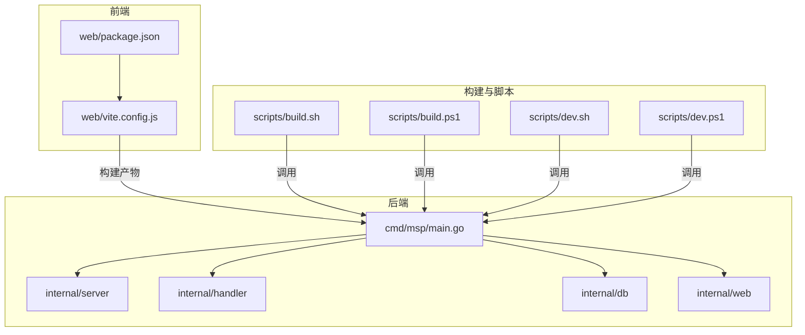
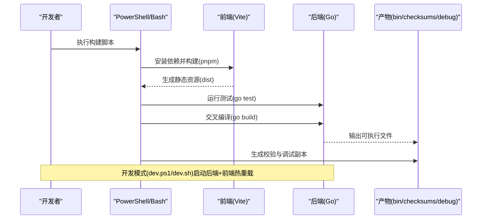
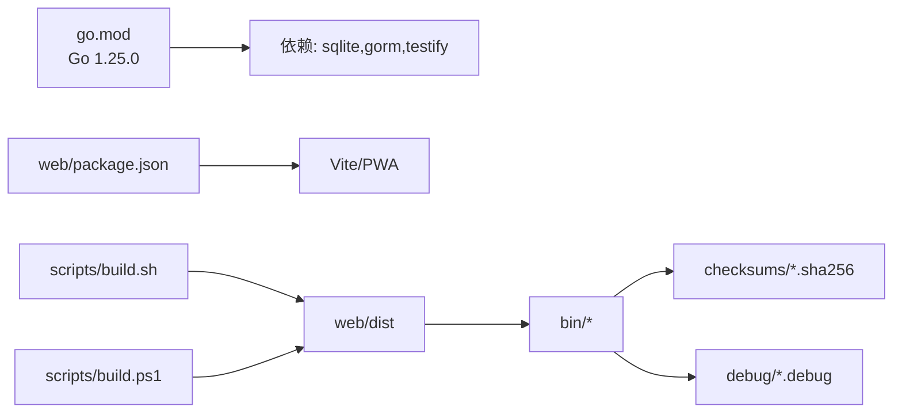

# 源码编译安装

<cite>
**本文引用的文件**
- [scripts/build.sh](file://scripts/build.sh)
- [scripts/build.ps1](file://scripts/build.ps1)
- [scripts/dev.sh](file://scripts/dev.sh)
- [scripts/dev.ps1](file://scripts/dev.ps1)
- [scripts/README.md](file://scripts/README.md)
- [go.mod](file://go.mod)
- [Dockerfile](file://Dockerfile)
- [cmd/msp/main.go](file://cmd/msp/main.go)
- [web/package.json](file://web/package.json)
- [web/vite.config.js](file://web/vite.config.js)
- [README.md](file://README.md)
- [msp.wiki/Build.md](file://msp.wiki/Build.md)
- [msp.wiki/Development.md](file://msp.wiki/Development.md)
- [config.example.json](file://config.example.json)
</cite>

## 目录
1. [简介](#简介)
2. [项目结构](#项目结构)
3. [核心组件](#核心组件)
4. [架构总览](#架构总览)
5. [详细组件分析](#详细组件分析)
6. [依赖关系分析](#依赖关系分析)
7. [性能考虑](#性能考虑)
8. [故障排查指南](#故障排查指南)
9. [结论](#结论)
10. [附录](#附录)

## 简介
本指南面向希望从源码编译并安装 MSP 的用户与维护者，覆盖编译前环境准备、跨平台编译步骤、构建脚本使用方法、开发模式与生产模式差异、常见问题与解决方案等内容。MSP 是一个单二进制媒体服务器，支持 Windows、Linux、macOS，并通过前端 PWA 与后端 API 提供本地局域网媒体共享与播放能力。

## 项目结构
- 后端入口位于 cmd/msp/main.go，负责初始化配置、数据库、路由注册与 HTTP 服务启动。
- 前端位于 web/，使用 Vite 构建，PWA 插件提供离线缓存与自动更新。
- 构建脚本位于 scripts/，提供生产构建与开发模式脚本，分别适配 Windows PowerShell 与 Linux/macOS Bash。
- go.mod 指定 Go 版本与依赖，Dockerfile 提供多阶段构建与运行时镜像。

图表来源
- [cmd/msp/main.go](file://cmd/msp/main.go#L26-L83)
- [web/vite.config.js](file://web/vite.config.js#L1-L48)
- [web/package.json](file://web/package.json#L1-L25)
- [scripts/build.sh](file://scripts/build.sh#L126-L203)
- [scripts/build.ps1](file://scripts/build.ps1#L40-L241)
- [scripts/dev.sh](file://scripts/dev.sh#L92-L150)
- [scripts/dev.ps1](file://scripts/dev.ps1#L13-L125)

章节来源
- [README.md](file://README.md#L82-L95)
- [go.mod](file://go.mod#L1-L31)
- [Dockerfile](file://Dockerfile#L1-L49)

## 核心组件
- 后端入口与路由
  - main.go 完成日志、配置加载、数据库初始化、配置热更新、媒体缓存预扫描、嵌入式前端资源挂载与 HTTP 服务启动。
- 前端构建与开发
  - package.json 定义 pnpm 脚本与依赖；vite.config.js 提供 PWA、代理与开发服务器配置。
- 构建脚本
  - build.sh/build.ps1：完成前端构建、Go 测试、交叉编译、产物与校验文件生成。
  - dev.sh/dev.ps1：开发模式，前后端热重载，自动重启后端，便于联调。

章节来源
- [cmd/msp/main.go](file://cmd/msp/main.go#L26-L83)
- [web/package.json](file://web/package.json#L6-L10)
- [web/vite.config.js](file://web/vite.config.js#L34-L47)
- [scripts/build.sh](file://scripts/build.sh#L126-L203)
- [scripts/build.ps1](file://scripts/build.ps1#L40-L241)
- [scripts/dev.sh](file://scripts/dev.sh#L92-L150)
- [scripts/dev.ps1](file://scripts/dev.ps1#L13-L125)

## 架构总览
下图展示从源码到可执行文件的构建路径，以及开发模式下的前后端协作流程。

图表来源
- [scripts/build.sh](file://scripts/build.sh#L126-L203)
- [scripts/build.ps1](file://scripts/build.ps1#L40-L241)
- [web/vite.config.js](file://web/vite.config.js#L34-L47)
- [cmd/msp/main.go](file://cmd/msp/main.go#L26-L83)

## 详细组件分析

### 环境准备
- Go 版本要求
  - go.mod 指定 Go 版本为 1.25.0；建议使用与之兼容的更高版本以获得最新特性与修复。
- Node.js 与包管理器
  - 前端构建依赖 Node.js 18+；推荐使用 pnpm（可通过 corepack enable 启用）。
- 可选工具
  - Windows：PowerShell（一键脚本）。
  - macOS：用于生成 universal 二进制与签名（可选）。
  - Docker：用于多阶段构建与运行时容器化部署。

章节来源
- [go.mod](file://go.mod#L3-L3)
- [README.md](file://README.md#L84-L85)
- [web/package.json](file://web/package.json#L18-L24)
- [msp.wiki/Build.md](file://msp.wiki/Build.md#L3-L8)

### 跨平台编译
- Windows
  - 使用 PowerShell 脚本，默认构建 Windows x64；可指定平台与架构组合进行批量构建。
- Linux/macOS
  - 使用 Bash 脚本，默认构建 Windows x64；可指定平台与架构组合进行批量构建。
- 交叉编译要点
  - 通过设置 GOOS、GOARCH、CGO_ENABLED 等环境变量实现跨平台编译。
  - 产物输出至 bin/，校验文件输出至 checksums/，调试副本输出至 debug/。

章节来源
- [scripts/build.sh](file://scripts/build.sh#L4-L21)
- [scripts/build.sh](file://scripts/build.sh#L150-L203)
- [scripts/build.ps1](file://scripts/build.ps1#L1-L4)
- [scripts/build.ps1](file://scripts/build.ps1#L146-L241)
- [scripts/README.md](file://scripts/README.md#L11-L47)
- [msp.wiki/Build.md](file://msp.wiki/Build.md#L10-L28)

### 构建脚本使用方法
- 生产构建脚本
  - build.sh/build.ps1：完成前端构建、Go 测试、交叉编译、产物与校验生成。
  - 参数
    - Platforms：目标平台列表（windows、linux、macos、arm）。
    - Architectures：目标架构列表（x64/amd64、x86/386、arm64、v7、v8）。
- 开发模式脚本
  - dev.sh/dev.ps1：本地开发，自动编译后端并在 Go 文件变更时重启；前端使用 Vite 开发服务器，支持代理到后端。
  - 参数
    - BackendPort：后端监听端口（默认 8099）。

章节来源
- [scripts/README.md](file://scripts/README.md#L7-L70)
- [scripts/README.md](file://scripts/README.md#L72-L139)
- [scripts/dev.sh](file://scripts/dev.sh#L8-L19)
- [scripts/dev.ps1](file://scripts/dev.ps1#L1-L3)

### 开发模式与生产模式对比
- 生产模式
  - 生成可在任意目标平台运行的静态二进制，去除符号表以减小体积，生成校验文件与调试副本。
- 开发模式
  - 本地编译后端，开启前后端热重载；后端禁用自动打开浏览器，前端通过代理连接后端，便于联调。

章节来源
- [scripts/README.md](file://scripts/README.md#L129-L139)
- [scripts/dev.sh](file://scripts/dev.sh#L97-L131)
- [scripts/dev.ps1](file://scripts/dev.ps1#L79-L118)

### 编译命令与参数示例
- Windows（PowerShell）
  - 默认：执行脚本无参。
  - 指定平台/架构：参考脚本参数说明。
- Linux/macOS（Bash）
  - 添加执行权限后运行脚本。
  - 指定平台/架构：使用逗号分隔的字符串传参。

章节来源
- [README.md](file://README.md#L90-L95)
- [scripts/README.md](file://scripts/README.md#L18-L47)
- [msp.wiki/Development.md](file://msp.wiki/Development.md#L65-L76)

## 依赖关系分析
- 后端依赖
  - 数据库：modernc.org/sqlite（无需 CGO）。
  - 测试框架：testify。
  - ORM：gorm。
- 前端依赖
  - Vite、PWA 插件、Workbox 等。
- 构建链路
  - 前端构建 → 后端测试 → 交叉编译 → 产物与校验生成。

图表来源
- [go.mod](file://go.mod#L5-L30)
- [web/package.json](file://web/package.json#L11-L17)
- [scripts/build.sh](file://scripts/build.sh#L126-L203)
- [scripts/build.ps1](file://scripts/build.ps1#L40-L241)

章节来源
- [go.mod](file://go.mod#L1-L31)
- [web/package.json](file://web/package.json#L1-L25)
- [scripts/build.sh](file://scripts/build.sh#L126-L203)
- [scripts/build.ps1](file://scripts/build.ps1#L40-L241)

## 性能考虑
- 体积优化
  - 交叉编译时使用裁剪与去符号标志，减少二进制体积。
- 前端缓存与更新
  - PWA 配置提供运行时缓存与网络回退策略，提升离线与弱网体验。
- 运行时内存
  - 后端入口设置了更积极的 GC 策略以降低内存占用。

章节来源
- [scripts/build.sh](file://scripts/build.sh#L63-L63)
- [scripts/build.ps1](file://scripts/build.ps1#L98-L98)
- [web/vite.config.js](file://web/vite.config.js#L7-L32)
- [cmd/msp/main.go](file://cmd/msp/main.go#L27-L27)

## 故障排查指南
- pnpm 未安装或 corepack 启用失败
  - 现象：构建前端时报错。
  - 处理：启用 corepack 或手动安装 pnpm；脚本会在找不到 pnpm 时尝试启用 corepack。
- Go 版本不满足要求
  - 现象：go build 或 go test 失败。
  - 处理：升级到与 go.mod 指定版本兼容的 Go 版本。
- CGO 相关编译错误
  - 现象：在需要 CGO 的环境中编译失败。
  - 处理：当前项目使用不依赖 CGO 的 SQLite 实现；若需启用 CGO，请参考 Dockerfile 中的示例做法（在特定场景下启用 CGO）。
- 交叉编译平台/架构不匹配
  - 现象：产物缺失或无法运行。
  - 处理：确认脚本参数中的平台与架构是否正确，遵循脚本参数规范。
- 前端依赖安装失败
  - 现象：pnpm install 失败。
  - 处理：检查网络与缓存，必要时清理 node_modules 后重试。
- 开发模式端口冲突
  - 现象：后端无法绑定端口。
  - 处理：调整 dev 脚本的 BackendPort 参数。

章节来源
- [scripts/build.sh](file://scripts/build.sh#L127-L134)
- [scripts/build.ps1](file://scripts/build.ps1#L42-L48)
- [go.mod](file://go.mod#L3-L3)
- [Dockerfile](file://Dockerfile#L16-L17)
- [scripts/README.md](file://scripts/README.md#L11-L47)
- [scripts/dev.sh](file://scripts/dev.sh#L112-L118)
- [scripts/dev.ps1](file://scripts/dev.ps1#L93-L100)

## 结论
通过本指南，您可以完成 MSP 的环境准备、跨平台编译与安装，并根据需求选择生产构建或开发模式。生产构建适合发布与分发，开发模式适合本地联调与迭代。遇到问题时，可依据故障排查指南快速定位与解决。

## 附录
- 配置模板
  - 开发模式配置文件位置与示例：bin/dev/config.json 由 config.example.json 初始化而来。
- 前端开发
  - 使用 pnpm run dev 启动 Vite 开发服务器，代理到后端；使用 pnpm run build 生成生产资源。
- 容器化部署
  - Dockerfile 提供多阶段构建与运行时镜像，适合在容器中部署 MSP。

章节来源
- [config.example.json](file://config.example.json#L1-L56)
- [scripts/dev.sh](file://scripts/dev.sh#L58-L90)
- [scripts/dev.ps1](file://scripts/dev.ps1#L50-L77)
- [web/vite.config.js](file://web/vite.config.js#L34-L47)
- [Dockerfile](file://Dockerfile#L1-L49)