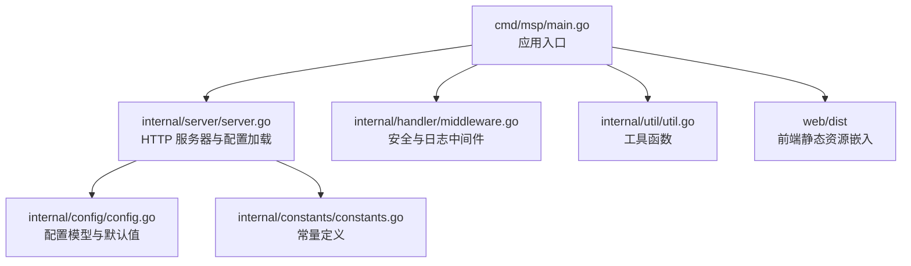
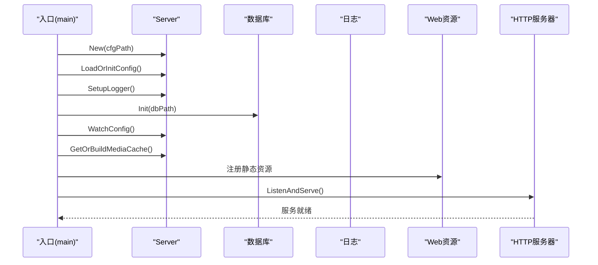
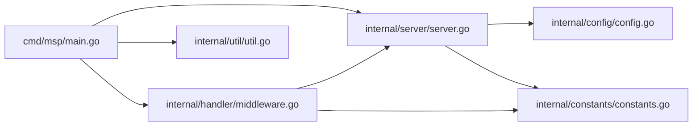

# 部署验证与配置

<cite>
**本文引用的文件**
- [cmd/msp/main.go](file://cmd/msp/main.go)
- [internal/server/server.go](file://internal/server/server.go)
- [internal/config/config.go](file://internal/config/config.go)
- [internal/constants/constants.go](file://internal/constants/constants.go)
- [internal/handler/middleware.go](file://internal/handler/middleware.go)
- [internal/util/util.go](file://internal/util/util.go)
- [config.example.json](file://config.example.json)
- [docs/CONFIG_EXAMPLE.md](file://docs/CONFIG_EXAMPLE.md)
- [docs/SECURITY.md](file://docs/SECURITY.md)
- [docs/SECURITY_QUICKSTART.md](file://docs/SECURITY_QUICKSTART.md)
- [docker-compose.yml](file://docker-compose.yml)
- [scripts/build.sh](file://scripts/build.sh)
</cite>

## 目录
1. [简介](#简介)
2. [项目结构](#项目结构)
3. [核心组件](#核心组件)
4. [架构总览](#架构总览)
5. [详细组件分析](#详细组件分析)
6. [依赖关系分析](#依赖关系分析)
7. [性能考量](#性能考量)
8. [故障排查指南](#故障排查指南)
9. [结论](#结论)
10. [附录](#附录)

## 简介
本指南面向在生产环境中部署 MSP 的运维与开发人员，提供从启动验证、配置设置到安全加固的完整流程。内容涵盖：
- 如何验证 MSP 服务是否正确启动（端口、进程、日志）
- 初始配置文件设置（媒体目录、端口、安全策略等）
- 配置优先级与覆盖机制（环境变量、命令行参数、配置文件）
- 常见部署验证命令与故障排查方法（curl、浏览器访问、日志分析）
- 生产环境推荐配置与安全加固建议

## 项目结构
MSP 采用 Go 语言实现，入口位于 cmd/msp/main.go，核心逻辑分布在 internal 子包中，包含配置、服务器、处理器中间件、工具函数等模块。前端资源被打包嵌入到二进制中，通过 web 子目录构建。

图表来源
- [cmd/msp/main.go](file://cmd/msp/main.go#L26-L83)
- [internal/server/server.go](file://internal/server/server.go#L65-L74)
- [internal/handler/middleware.go](file://internal/handler/middleware.go#L77-L120)
- [internal/util/util.go](file://internal/util/util.go#L116-L123)
- [internal/config/config.go](file://internal/config/config.go#L77-L88)
- [internal/constants/constants.go](file://internal/constants/constants.go#L9-L14)

章节来源
- [cmd/msp/main.go](file://cmd/msp/main.go#L26-L83)
- [internal/server/server.go](file://internal/server/server.go#L65-L74)

## 核心组件
- 应用入口与生命周期
  - 加载配置、初始化日志、启动数据库、注册路由、监听端口、自动打开浏览器、热重载配置。
- 服务器与配置
  - 配置文件读取/保存、默认值填充、热重载、日志轮转、媒体缓存管理。
- 安全中间件
  - IP 白/黑名单、PIN 认证、安全响应头、会话管理。
- 工具与常量
  - 路径处理、IP 判定、日志轮转阈值、默认端口等。

章节来源
- [cmd/msp/main.go](file://cmd/msp/main.go#L26-L83)
- [internal/server/server.go](file://internal/server/server.go#L76-L125)
- [internal/handler/middleware.go](file://internal/handler/middleware.go#L77-L120)
- [internal/util/util.go](file://internal/util/util.go#L218-L256)
- [internal/constants/constants.go](file://internal/constants/constants.go#L9-L14)

## 架构总览
MSP 的启动流程如下：入口加载配置并初始化日志；随后初始化数据库；启动配置文件监控；后台触发媒体缓存构建；注册路由并启动 HTTP 服务器；自动打开浏览器访问。

图表来源
- [cmd/msp/main.go](file://cmd/msp/main.go#L30-L83)
- [internal/server/server.go](file://internal/server/server.go#L76-L125)
- [internal/server/server.go](file://internal/server/server.go#L140-L188)

## 详细组件分析

### 启动与验证
- 端口检查
  - 通过打印启动横幅输出访问 URL（包含 127.0.0.1 与本机局域网 IP），便于快速验证。
  - 默认端口来自常量，可在配置中覆盖。
- 进程状态确认
  - 启动后会尝试探测端口是否可用，若可用则自动打开浏览器。
- 日志输出验证
  - 初始化日志文件路径，支持轮转；错误/信息/调试级别按配置输出。

章节来源
- [cmd/msp/main.go](file://cmd/msp/main.go#L109-L123)
- [cmd/msp/main.go](file://cmd/msp/main.go#L125-L139)
- [internal/server/server.go](file://internal/server/server.go#L190-L220)
- [internal/constants/constants.go](file://internal/constants/constants.go#L9-L14)

### 配置文件与默认值
- 配置结构
  - 包含端口、共享目录、功能开关、UI、播放、黑名单、安全、日志级别与文件等字段。
- 默认值填充
  - 若缺失或非法，自动填充默认值；保存到磁盘并记录日志。
- 热重载
  - 定时检查配置文件修改时间，变更后重新加载并应用默认值。

章节来源
- [internal/config/config.go](file://internal/config/config.go#L77-L146)
- [internal/server/server.go](file://internal/server/server.go#L76-L125)
- [internal/server/server.go](file://internal/server/server.go#L140-L188)

### 安全中间件与会话
- IP 白/黑名单
  - 仅基于直接连接地址（Home/LAN 模式不信任代理头），支持 CIDR。
- PIN 认证
  - 对 /api/*（除特定豁免端点）启用认证；成功后设置会话 Cookie 或通过请求头传递。
- 安全响应头
  - 设置 X-Content-Type-Options、X-Frame-Options、X-XSS-Protection、Referrer-Policy。

章节来源
- [internal/handler/middleware.go](file://internal/handler/middleware.go#L77-L120)
- [internal/handler/middleware.go](file://internal/handler/middleware.go#L146-L201)
- [internal/handler/middleware.go](file://internal/handler/middleware.go#L203-L228)
- [internal/server/server.go](file://internal/server/server.go#L570-L626)

### 日志与媒体缓存
- 日志
  - 支持按级别输出与轮转；轮转阈值与检查间隔由常量控制。
- 媒体缓存
  - 内存缓存 + 数据库/磁盘持久化；支持弱 ETag 与 TTL 控制；后台重建。

章节来源
- [internal/server/server.go](file://internal/server/server.go#L222-L284)
- [internal/server/server.go](file://internal/server/server.go#L332-L437)
- [internal/constants/constants.go](file://internal/constants/constants.go#L26-L50)

## 依赖关系分析
MSP 的关键依赖关系如下图所示：

图表来源
- [cmd/msp/main.go](file://cmd/msp/main.go#L26-L83)
- [internal/server/server.go](file://internal/server/server.go#L65-L74)
- [internal/handler/middleware.go](file://internal/handler/middleware.go#L77-L120)
- [internal/util/util.go](file://internal/util/util.go#L116-L123)
- [internal/config/config.go](file://internal/config/config.go#L77-L88)
- [internal/constants/constants.go](file://internal/constants/constants.go#L9-L14)

## 性能考量
- 媒体缓存与重建
  - 内存缓存 + 弱 ETag，降低重复扫描成本；数据库/磁盘持久化保证重启后复用。
- 日志轮转
  - 达到阈值后轮转，减少磁盘占用与 IO 压力。
- 压缩传输
  - 对非流媒体 API 自动启用 gzip 压缩，减少带宽消耗。

章节来源
- [internal/server/server.go](file://internal/server/server.go#L332-L437)
- [internal/server/server.go](file://internal/server/server.go#L250-L284)
- [internal/handler/middleware.go](file://internal/handler/middleware.go#L25-L43)

## 故障排查指南

### 启动与端口验证
- 检查端口占用
  - 默认端口为常量定义，可在配置中修改；启动时会打印访问 URL，包含本机局域网 IP。
- 浏览器访问
  - 启动后自动打开浏览器；也可手动访问打印的 URL。
- curl 测试
  - 使用 curl 访问根路径与 API 端点，观察状态码与响应。

章节来源
- [cmd/msp/main.go](file://cmd/msp/main.go#L109-L123)
- [cmd/msp/main.go](file://cmd/msp/main.go#L125-L139)
- [internal/constants/constants.go](file://internal/constants/constants.go#L9-L14)

### 日志分析
- 日志文件位置
  - 默认位于可执行文件目录下的 logs 子目录；可在配置中指定。
- 日志级别
  - 支持 debug/info/error/none；错误/信息/调试按级别输出。
- 轮转策略
  - 超过阈值自动轮转，保留最近一份旧日志。

章节来源
- [internal/server/server.go](file://internal/server/server.go#L190-L220)
- [internal/server/server.go](file://internal/server/server.go#L222-L284)
- [internal/constants/constants.go](file://internal/constants/constants.go#L26-L35)

### 安全问题排查
- IP 白/黑名单
  - 确认白名单包含自身 IP；黑名单优先级高于白名单；支持 CIDR。
- PIN 认证
  - 确认 PIN 已启用且正确；会话 Cookie 有效期为 7 天；可通过请求头传递会话令牌。
- 豁免端点
  - /api/pin、/api/ip、/api/config 不需要 PIN。

章节来源
- [internal/handler/middleware.go](file://internal/handler/middleware.go#L146-L201)
- [internal/handler/middleware.go](file://internal/handler/middleware.go#L203-L228)
- [docs/SECURITY.md](file://docs/SECURITY.md#L135-L167)

### 配置热重载
- 修改配置后通常 2 秒内生效；建议观察日志确认重载成功。
- 若忘记 PIN，可编辑配置文件修改或禁用。

章节来源
- [docs/SECURITY_QUICKSTART.md](file://docs/SECURITY_QUICKSTART.md#L102-L104)
- [docs/SECURITY.md](file://docs/SECURITY.md#L182-L187)

## 结论
MSP 提供了开箱即用的启动流程与完善的配置体系，结合安全中间件与日志轮转，适合在家庭与小型办公环境中稳定运行。生产部署建议：
- 明确端口与日志路径，确保防火墙放行
- 启用 IP 白名单与 PIN 认证，必要时结合反向代理
- 关注媒体缓存与日志轮转策略，保障长期稳定性

## 附录

### 初始配置文件设置
- 配置文件位置
  - 可执行文件同目录下的 config.json；首次运行会自动生成。
- 关键参数
  - 端口、共享目录、功能开关、UI、播放、黑名单、安全、日志级别与文件。
- 示例与说明
  - 参考示例配置与带注释的配置说明文档。

章节来源
- [config.example.json](file://config.example.json#L1-L56)
- [docs/CONFIG_EXAMPLE.md](file://docs/CONFIG_EXAMPLE.md#L1-L202)

### 配置优先级与覆盖机制
- 配置来源
  - 配置文件（config.json）为唯一来源；默认值在加载时填充。
- 环境变量与命令行参数
  - 未发现环境变量与命令行参数的解析逻辑；建议通过配置文件统一管理。

章节来源
- [internal/server/server.go](file://internal/server/server.go#L76-L125)
- [internal/config/config.go](file://internal/config/config.go#L94-L146)

### 生产环境推荐配置与安全加固
- 端口与网络
  - 使用非默认端口并在防火墙放行；仅开放内网访问。
- 安全策略
  - 启用 IP 白名单（包含自身 IP）；必要时启用 PIN 认证；定期更换 PIN。
- 日志与监控
  - 指定日志文件路径并启用轮转；关注错误级别日志。
- 媒体缓存
  - 合理设置 maxItems 与黑名单，避免过度扫描。

章节来源
- [docs/SECURITY.md](file://docs/SECURITY.md#L169-L187)
- [docs/SECURITY_QUICKSTART.md](file://docs/SECURITY_QUICKSTART.md#L180-L232)
- [internal/constants/constants.go](file://internal/constants/constants.go#L26-L50)

### 部署方式与容器化
- Docker Compose
  - 映射数据卷至宿主机，持久化配置与数据库；端口映射 8099:8099；禁用自动打开浏览器。
- 构建脚本
  - 支持多平台交叉编译，生成校验和与调试符号。

章节来源
- [docker-compose.yml](file://docker-compose.yml#L1-L20)
- [scripts/build.sh](file://scripts/build.sh#L150-L201)