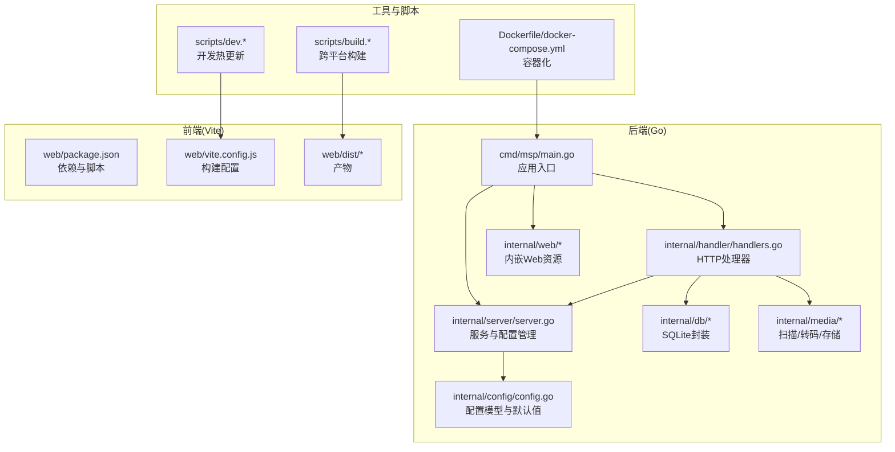
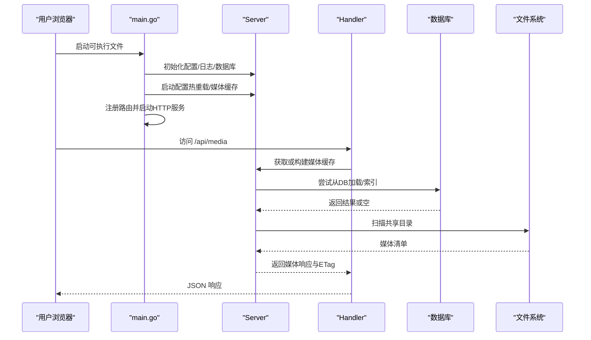
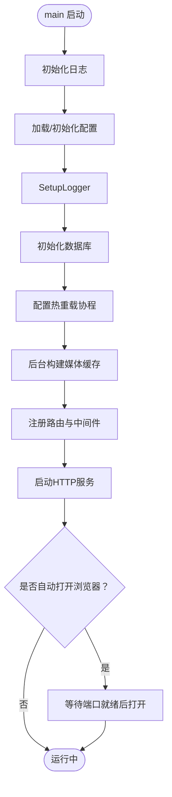
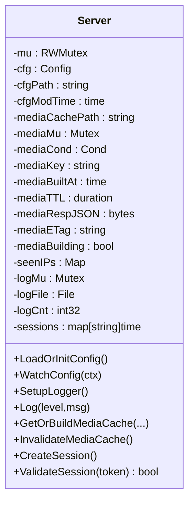
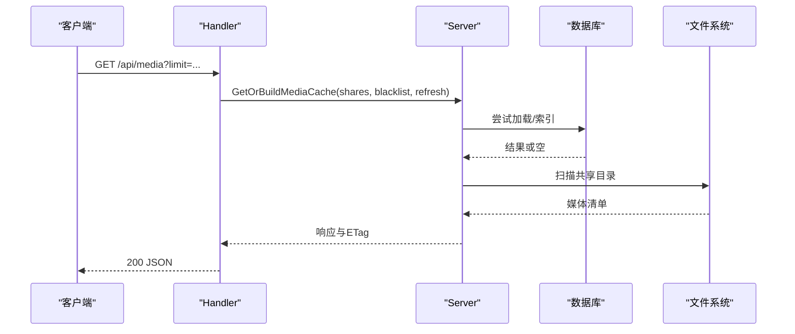
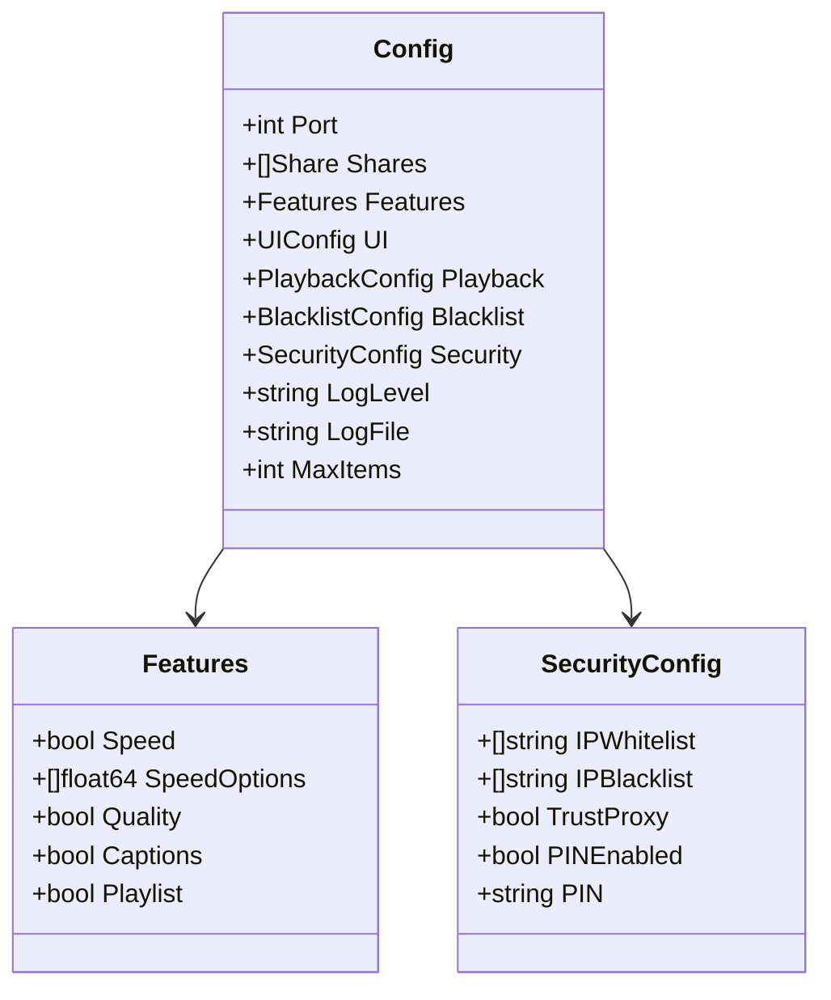
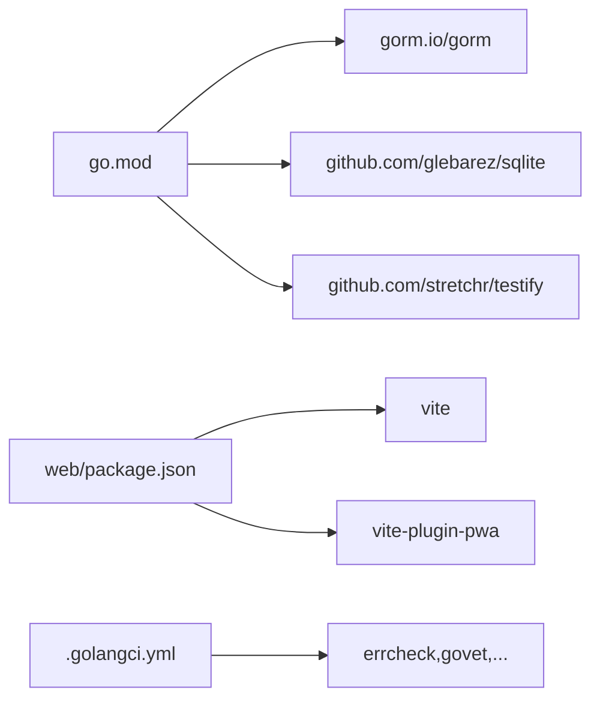

# 开发指南

<cite>
**本文引用的文件**
- [README.md](file://README.md)
- [CONTRIBUTING.md](file://CONTRIBUTING.md)
- [go.mod](file://go.mod)
- [.golangci.yml](file://.golangci.yml)
- [cmd/msp/main.go](file://cmd/msp/main.go)
- [internal/config/config.go](file://internal/config/config.go)
- [internal/server/server.go](file://internal/server/server.go)
- [internal/handler/handlers.go](file://internal/handler/handlers.go)
- [Dockerfile](file://Dockerfile)
- [docker-compose.yml](file://docker-compose.yml)
- [config.example.json](file://config.example.json)
- [scripts/build.sh](file://scripts/build.sh)
- [scripts/build.ps1](file://scripts/build.ps1)
- [scripts/dev.sh](file://scripts/dev.sh)
- [scripts/dev.ps1](file://scripts/dev.ps1)
- [web/package.json](file://web/package.json)
</cite>

## 目录
1. [简介](#简介)
2. [项目结构](#项目结构)
3. [核心组件](#核心组件)
4. [架构总览](#架构总览)
5. [详细组件分析](#详细组件分析)
6. [依赖关系分析](#依赖关系分析)
7. [性能考虑](#性能考虑)
8. [测试策略](#测试策略)
9. [调试技巧与工具](#调试技巧与工具)
10. [贡献流程与代码审查](#贡献流程与代码审查)
11. [开发工作流最佳实践](#开发工作流最佳实践)
12. [常见问题与故障排除](#常见问题与故障排除)
13. [结语](#结语)

## 简介
MSP 是一个面向家庭局域网的轻量级媒体服务器，支持在浏览器中直接播放本地共享文件夹中的音视频内容。其特性包括零外部依赖部署、智能直播放优先、断点续播、跨平台服务端以及前端浏览器客户端。

- 零设置：无需外部数据库或复杂部署
- 智能播放：默认直放，必要时转码
- 断点续播：跨设备继续上次播放位置
- 跨平台服务端：Windows、Linux、macOS
- 浏览器客户端：桌面与移动端现代浏览器
- 本地优先：无云账户、无追踪

## 项目结构
项目采用前后端分离的多模块组织方式：
- 后端（Go）：入口程序、HTTP路由、处理器、服务层、数据库、媒体扫描与转码、Web资源嵌入
- 前端（Vite + PWA）：静态资源打包、开发服务器、PWA 支持
- 构建与脚本：跨平台构建、开发热更新、Docker 容器化
- 文档与示例：配置示例、发布说明、安全指南、Wiki

图表来源
- [cmd/msp/main.go](file://cmd/msp/main.go#L26-L83)
- [internal/server/server.go](file://internal/server/server.go#L65-L74)
- [internal/handler/handlers.go](file://internal/handler/handlers.go#L38-L43)
- [internal/config/config.go](file://internal/config/config.go#L77-L88)
- [web/package.json](file://web/package.json#L6-L10)
- [scripts/build.sh](file://scripts/build.sh#L126-L143)
- [scripts/dev.sh](file://scripts/dev.sh#L92-L131)
- [Dockerfile](file://Dockerfile#L26-L48)

章节来源
- [README.md](file://README.md#L21-L31)
- [go.mod](file://go.mod#L1-L31)

## 核心组件
- 应用入口与生命周期
  - 初始化日志、加载/初始化配置、数据库初始化、配置热重载、媒体缓存预构建、注册路由、启动HTTP服务、自动打开浏览器
- 服务器与配置
  - 配置读取/保存、热监控、日志级别与轮转、媒体缓存内存/磁盘双层、ETag弱校验、会话管理（PIN）
- 处理器与API
  - 配置读写、共享目录增删、媒体列表、直播放/转码、字幕转换、进度与偏好、探针、IP查询、PIN认证
- 媒体与存储
  - 媒体扫描、索引与增量更新、SQLite 存储、FFmpeg 转码、内嵌Web资源打包

章节来源
- [cmd/msp/main.go](file://cmd/msp/main.go#L26-L83)
- [internal/server/server.go](file://internal/server/server.go#L76-L188)
- [internal/handler/handlers.go](file://internal/handler/handlers.go#L45-L362)

## 架构总览
MSP 的运行时由“入口程序 → 服务器 → 处理器 → 服务/存储 → 媒体”构成，前端通过静态资源内嵌于二进制，运行时由入口程序挂载。

图表来源
- [cmd/msp/main.go](file://cmd/msp/main.go#L85-L107)
- [internal/server/server.go](file://internal/server/server.go#L332-L437)
- [internal/handler/handlers.go](file://internal/handler/handlers.go#L333-L362)

## 详细组件分析

### 组件A：应用入口与路由注册
- 职责
  - 设置GC策略、日志格式
  - 加载配置、初始化日志与数据库
  - 启动配置热重载与媒体缓存预构建
  - 注册API路由与静态资源
  - 启动HTTP服务，按需自动打开浏览器
- 关键点
  - 中间件链：日志 → 安全 → Gzip
  - 自动打开浏览器前等待端口就绪
  - 静态资源来自内嵌的 web/dist

图表来源
- [cmd/msp/main.go](file://cmd/msp/main.go#L26-L83)

章节来源
- [cmd/msp/main.go](file://cmd/msp/main.go#L26-L83)

### 组件B：服务器与配置管理
- 职责
  - 配置持久化与默认值填充
  - 日志级别控制与轮转
  - 媒体缓存内存/磁盘双层与弱ETag
  - 会话管理（PIN）
- 设计要点
  - 使用互斥锁保护配置与日志
  - 缓存过期与重建并发控制
  - 会话令牌随机生成与过期清理

图表来源
- [internal/server/server.go](file://internal/server/server.go#L31-L74)

章节来源
- [internal/server/server.go](file://internal/server/server.go#L76-L188)
- [internal/server/server.go](file://internal/server/server.go#L190-L284)
- [internal/server/server.go](file://internal/server/server.go#L332-L437)
- [internal/server/server.go](file://internal/server/server.go#L570-L626)

### 组件C：处理器与API
- 职责
  - 配置读取/更新
  - 共享目录增删
  - 媒体列表、直播放/转码、字幕转换
  - 进度与偏好、探针、IP查询、PIN认证
- 错误处理
  - JSON解码错误、负载过大、权限拒绝、转码失败回退

图表来源
- [internal/handler/handlers.go](file://internal/handler/handlers.go#L333-L362)
- [internal/server/server.go](file://internal/server/server.go#L332-L437)

章节来源
- [internal/handler/handlers.go](file://internal/handler/handlers.go#L45-L362)

### 组件D：配置模型与默认值
- 职责
  - 定义配置结构体（端口、共享目录、功能开关、UI、播放、黑名单、安全、日志等）
  - 提供默认值与字段补齐逻辑
- 特性
  - 可选字段指针化，便于区分未设置与显式空值
  - 默认值覆盖策略按模块分层

图表来源
- [internal/config/config.go](file://internal/config/config.go#L77-L88)
- [internal/config/config.go](file://internal/config/config.go#L5-L11)
- [internal/config/config.go](file://internal/config/config.go#L56-L75)

章节来源
- [internal/config/config.go](file://internal/config/config.go#L77-L146)
- [internal/config/config.go](file://internal/config/config.go#L148-L286)

## 依赖关系分析
- 后端依赖
  - 数据库：sqlite（modernc.org/sqlite）
  - ORM：gorm
  - 断言与测试：testify
- 前端依赖
  - Vite、PWA 插件、Workbox
- 工具链
  - golangci-lint（errcheck、govet、staticcheck、gosec、gocyclo、misspell 等）

图表来源
- [go.mod](file://go.mod#L5-L9)
- [web/package.json](file://web/package.json#L14-L17)
- [.golangci.yml](file://.golangci.yml#L7-L17)

章节来源
- [go.mod](file://go.mod#L1-L31)
- [.golangci.yml](file://.golangci.yml#L1-L21)
- [web/package.json](file://web/package.json#L1-L25)

## 性能考虑
- 内存与GC
  - 设置GC百分比以降低内存占用
  - 媒体索引后触发GC回收
- 媒体缓存
  - 内存缓存 + 磁盘缓存（无DB时），弱ETag减少重复传输
  - 并发重建与条件广播，避免阻塞请求
- 直放与转码
  - 优先直放；转码失败自动回退
  - 大文件启用缓存头，小文件禁用缓存
- 日志
  - 按级别输出与周期性轮转，降低IO开销

章节来源
- [cmd/msp/main.go](file://cmd/msp/main.go#L27-L28)
- [internal/server/server.go](file://internal/server/server.go#L433-L437)
- [internal/server/server.go](file://internal/server/server.go#L520-L536)
- [internal/handler/handlers.go](file://internal/handler/handlers.go#L566-L579)

## 测试策略
- 单元测试与集成测试
  - 使用 go test ./... 运行全部测试
  - golangci-lint 作为静态检查流水线的一部分
- 端到端测试
  - 建议通过浏览器访问 /api/media、/api/stream、/api/probe 等接口进行验证
  - 使用 /api/prefs、/api/progress、/api/pin 等接口验证偏好与进度
- 前端测试
  - 建议在开发模式下运行 Vite 并手动验证页面交互与PWA行为

章节来源
- [CONTRIBUTING.md](file://CONTRIBUTING.md#L42-L52)
- [scripts/build.sh](file://scripts/build.sh#L145-L148)
- [web/package.json](file://web/package.json#L6-L10)

## 调试技巧与工具
- 开发环境
  - Windows：使用 scripts/dev.ps1 启动后端与前端，自动监听Go文件变更并重启后端
  - Linux/macOS：使用 scripts/dev.sh 启动后端与前端，自动监听Go文件变更并重启后端
- 日志
  - 通过配置项 logLevel 与 logFile 控制日志级别与输出文件
  - 服务端内置日志轮转
- 调试建议
  - 使用浏览器开发者工具查看网络与缓存头
  - 通过 /api/log 接口向服务端注入日志
  - 使用 /api/probe 探测容器与音视频编解码信息
- 容器化调试
  - 使用 docker-compose 启动，映射数据卷与媒体目录，便于持久化与排查

章节来源
- [scripts/dev.ps1](file://scripts/dev.ps1#L13-L23)
- [scripts/dev.sh](file://scripts/dev.sh#L92-L131)
- [internal/server/server.go](file://internal/server/server.go#L190-L220)
- [internal/handler/handlers.go](file://internal/handler/handlers.go#L235-L253)
- [docker-compose.yml](file://docker-compose.yml#L1-L20)

## 贡献流程与代码审查
- 开发环境要求
  - Go 1.24+、Node.js 20+、pnpm（通过 corepack enable）
- 提交流程
  - Fork 仓库 → 新建分支 → 提交代码 → 运行测试与静态检查 → 发起 PR 至 main 分支
- 代码风格
  - Go 使用 gofmt
  - JavaScript 使用 ES 模块风格
  - 提交信息遵循 Conventional Commits 规范

章节来源
- [CONTRIBUTING.md](file://CONTRIBUTING.md#L5-L12)
- [CONTRIBUTING.md](file://CONTRIBUTING.md#L26-L52)

## 开发工作流最佳实践
- 分支管理
  - 功能分支命名：feat/xxx、fix/xxx、docs/xxx
  - 合并与发布：PR 合并至 main，使用 GitHub Releases 发布
- 提交规范
  - 使用 Conventional Commits，如 feat、fix、docs、chore
- 版本发布
  - 使用 scripts/build.ps1/scripts/build.sh 进行跨平台构建与校验和生成
  - Dockerfile 与 docker-compose.yml 支持容器化部署

章节来源
- [CONTRIBUTING.md](file://CONTRIBUTING.md#L58-L68)
- [scripts/build.ps1](file://scripts/build.ps1#L146-L241)
- [scripts/build.sh](file://scripts/build.sh#L150-L203)
- [Dockerfile](file://Dockerfile#L1-L49)
- [docker-compose.yml](file://docker-compose.yml#L1-L20)

## 常见问题与故障排除
- 启动后无法访问
  - 检查端口占用与防火墙；确认配置文件路径与端口
  - 查看控制台打印的访问地址
- 媒体无法播放
  - 若直放失败，尝试开启转码或更换浏览器
  - 使用 /api/probe 检查容器与编解码信息
- 配置热重载无效
  - 确认配置文件未被外部编辑器锁定
  - 检查日志中“Config file changed, reloading...”提示
- 前端开发异常
  - 确保 pnpm 安装完成；检查 MSP_DEV_BACKEND 环境变量
- 容器部署
  - 确认数据卷映射与软链接已建立；检查 MSP_NO_AUTO_OPEN 环境变量

章节来源
- [cmd/msp/main.go](file://cmd/msp/main.go#L109-L123)
- [internal/handler/handlers.go](file://internal/handler/handlers.go#L581-L621)
- [internal/server/server.go](file://internal/server/server.go#L140-L188)
- [scripts/dev.sh](file://scripts/dev.sh#L111-L131)
- [docker-compose.yml](file://docker-compose.yml#L17-L19)

## 结语
本指南围绕开发环境搭建、代码结构与规范、测试策略、调试技巧、贡献流程与工作流进行了系统阐述，并结合项目实际文件提供了可视化图示与定位依据。建议在开发过程中持续关注配置与日志、媒体缓存与转码策略、以及前后端联调细节，以获得稳定高效的开发体验。