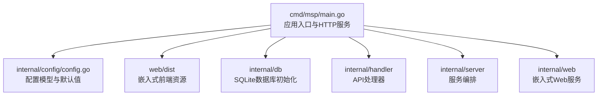
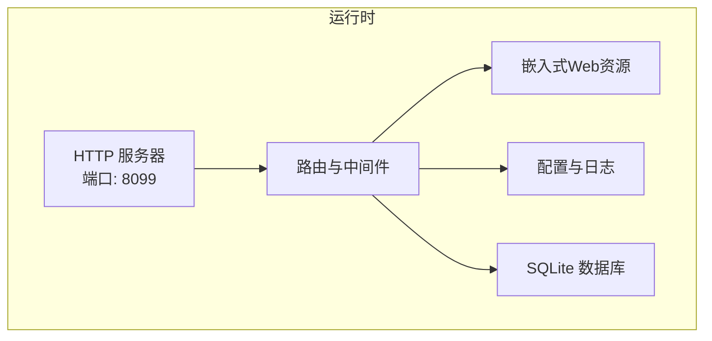
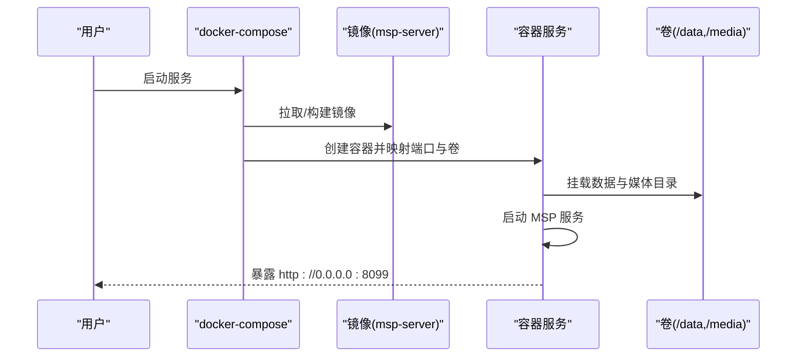
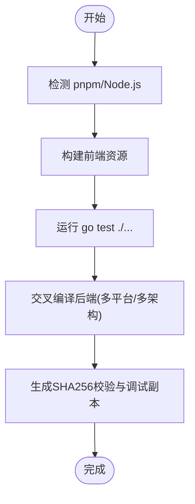
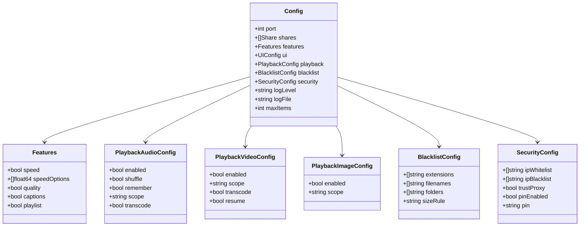
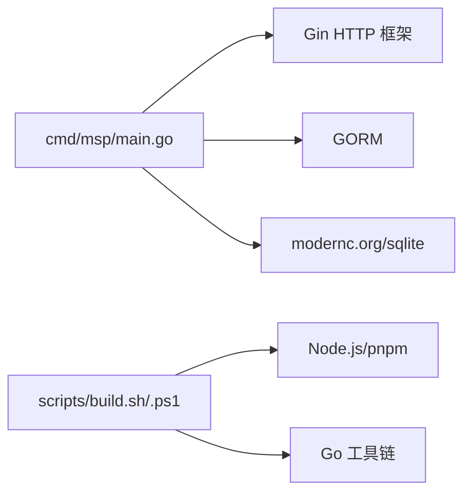

# 快速开始

<cite>
**本文引用的文件**
- [README.md](file://README.md)
- [README_CN.md](file://README_CN.md)
- [Dockerfile](file://Dockerfile)
- [docker-compose.yml](file://docker-compose.yml)
- [scripts/build.sh](file://scripts/build.sh)
- [scripts/build.ps1](file://scripts/build.ps1)
- [scripts/dev.sh](file://scripts/dev.sh)
- [scripts/dev.ps1](file://scripts/dev.ps1)
- [go.mod](file://go.mod)
- [cmd/msp/main.go](file://cmd/msp/main.go)
- [internal/config/config.go](file://internal/config/config.go)
- [config.example.json](file://config.example.json)
- [msp.wiki/Installation.md](file://msp.wiki/Installation.md)
- [msp.wiki/Installation_CN.md](file://msp.wiki/Installation_CN.md)
</cite>

## 目录
1. [简介](#简介)
2. [项目结构](#项目结构)
3. [核心组件](#核心组件)
4. [架构总览](#架构总览)
5. [详细组件分析](#详细组件分析)
6. [依赖关系分析](#依赖关系分析)
7. [性能考虑](#性能考虑)
8. [故障排除指南](#故障排除指南)
9. [结论](#结论)
10. [附录](#附录)

## 简介
MSP 是一款零配置、跨平台的局域网媒体服务器，支持 Windows、Linux、macOS；通过浏览器即可在局域网内直接播放本地媒体，具备智能直连优先、按需转码、断点续播、本地优先等特性。首次启动后可通过 Web 界面添加共享文件夹并进行基础配置。

## 项目结构
- 后端入口位于 cmd/msp/main.go，负责加载配置、初始化日志与数据库、注册路由、启动 HTTP 服务，并在非禁用自动打开时尝试打开浏览器。
- 配置模型位于 internal/config/config.go，定义了端口、共享目录、功能开关、UI、播放行为、黑名单与安全策略等字段及默认值。
- 前端资源以嵌入式静态资源形式打包，随二进制发布，首次启动会打印访问地址（本地与局域网）。
- 提供多平台预编译二进制与 Docker 镜像，亦可从源码构建。

图表来源
- [cmd/msp/main.go](file://cmd/msp/main.go#L26-L83)
- [internal/config/config.go](file://internal/config/config.go#L77-L146)

章节来源
- [cmd/msp/main.go](file://cmd/msp/main.go#L26-L83)
- [internal/config/config.go](file://internal/config/config.go#L77-L146)

## 核心组件
- 应用入口与服务启动：加载配置、初始化日志与数据库、注册路由、启动 HTTP 服务器、打印访问地址、可选自动打开浏览器。
- 配置系统：提供默认配置与字段校验/补全逻辑，支持热更新监听。
- 前端嵌入：构建后静态资源被打包进二进制，首次访问即提供 Web 界面。
- Docker 支持：多阶段构建前端与后端，运行时暴露端口并挂载数据卷。

章节来源
- [cmd/msp/main.go](file://cmd/msp/main.go#L26-L83)
- [internal/config/config.go](file://internal/config/config.go#L148-L162)
- [Dockerfile](file://Dockerfile#L1-L49)

## 架构总览
MSP 的运行时由“单二进制”组成：内置前端静态资源、内置 SQLite 数据库、内置配置与日志系统。启动后通过 HTTP 暴露 Web 界面与 API，支持跨平台运行。

图表来源
- [cmd/msp/main.go](file://cmd/msp/main.go#L67-L83)
- [Dockerfile](file://Dockerfile#L41-L48)

章节来源
- [cmd/msp/main.go](file://cmd/msp/main.go#L67-L83)
- [Dockerfile](file://Dockerfile#L41-L48)

## 详细组件分析

### 安装方式与系统要求
- 系统要求
  - 后端：Go 1.24+（项目 go.mod 显示 go 1.25.0，建议使用 1.24+）
  - 前端构建：Node.js 18+（用于 scripts/build.sh）
  - 运行时：无需额外数据库，内置 SQLite
- 多种安装方式
  - 从 GitHub Releases 下载预编译二进制（Windows/Linux/macOS）
  - 使用 Docker 一键部署（含 docker-compose 示例）
  - 从源码编译（Windows 使用 PowerShell 脚本，Linux/macOS 使用 Bash 脚本）

章节来源
- [README.md](file://README.md#L82-L95)
- [README_CN.md](file://README_CN.md#L82-L95)
- [go.mod](file://go.mod#L3-L3)
- [Dockerfile](file://Dockerfile#L1-L49)
- [docker-compose.yml](file://docker-compose.yml#L1-L20)
- [scripts/build.sh](file://scripts/build.sh#L1-L206)
- [scripts/build.ps1](file://scripts/build.ps1#L1-L245)

### 首次启动与基本配置
- 启动后控制台会打印访问地址（本地与局域网），首次访问 Web 界面。
- 配置文件位置：与可执行文件同目录的 config.json（未找到时自动初始化）。
- 基本设置建议
  - 在“设置”中添加共享文件夹（Shares）
  - 如需局域网访问，确保防火墙允许程序通过（Windows 首次运行可能弹窗）
  - 如需转码，可在播放设置中开启相应选项（默认部分高风险格式会按策略转码）
  - 如需安全限制，可配置 IP 白名单/黑名单与 PIN 认证

章节来源
- [cmd/msp/main.go](file://cmd/msp/main.go#L109-L123)
- [cmd/msp/main.go](file://cmd/msp/main.go#L30-L45)
- [config.example.json](file://config.example.json#L1-L56)
- [internal/config/config.go](file://internal/config/config.go#L77-L146)
- [msp.wiki/Installation.md](file://msp.wiki/Installation.md#L19-L22)
- [msp.wiki/Installation_CN.md](file://msp.wiki/Installation_CN.md#L19-L22)

### Docker 容器部署
- 多阶段构建：前端使用 node:22-alpine，后端使用 golang:1.24-alpine，最终运行于 alpine。
- 端口：默认暴露 8099。
- 卷：/data（存放 config.json 与 msp.db），/media（映射媒体目录）。
- 环境变量：MSP_NO_AUTO_OPEN=1（避免容器内自动打开浏览器）。
- docker-compose：示例将宿主 ./data 与 ./media 分别映射至容器卷，并在启动时建立符号链接以兼容工作目录期望。

图表来源
- [Dockerfile](file://Dockerfile#L29-L48)
- [docker-compose.yml](file://docker-compose.yml#L1-L20)

章节来源
- [Dockerfile](file://Dockerfile#L1-L49)
- [docker-compose.yml](file://docker-compose.yml#L1-L20)

### 从源码编译
- Windows
  - 使用 PowerShell 脚本，自动安装 pnpm（通过 corepack），构建前端与后端，生成多平台产物并写入校验与调试副本。
- Linux/macOS
  - 使用 Bash 脚本，逻辑与 Windows 脚本一致，支持指定平台与架构参数。
- 开发模式
  - 提供 dev.sh/dev.ps1，分别在 Linux/macOS 与 Windows 上同时启动后端与前端开发服务器，自动监听 Go 文件变更并热重建。

图表来源
- [scripts/build.sh](file://scripts/build.sh#L126-L203)
- [scripts/build.ps1](file://scripts/build.ps1#L40-L241)

章节来源
- [scripts/build.sh](file://scripts/build.sh#L1-L206)
- [scripts/build.ps1](file://scripts/build.ps1#L1-L245)
- [scripts/dev.sh](file://scripts/dev.sh#L1-L175)
- [scripts/dev.ps1](file://scripts/dev.ps1#L1-L160)

### 配置模型与默认值
- 关键字段
  - 端口、共享目录、功能开关（速度、画质、字幕、播放列表）、UI 默认标签页与显示策略、播放行为（音频/视频/图片）、黑名单（扩展名/文件名/目录/大小规则）、安全策略（白名单/黑名单/PIN）。
- 默认值与补全
  - 若缺失字段，系统会自动填充默认值，保证配置一致性与可用性。
- 配置示例
  - 提供完整示例文件，便于参考与定制。

图表来源
- [internal/config/config.go](file://internal/config/config.go#L77-L88)
- [internal/config/config.go](file://internal/config/config.go#L5-L75)

章节来源
- [internal/config/config.go](file://internal/config/config.go#L77-L146)
- [config.example.json](file://config.example.json#L1-L56)

## 依赖关系分析
- 运行时依赖
  - Go 运行时与标准库
  - SQLite（modernc.org/sqlite）
  - Gin（HTTP 框架）
  - GORM（ORM）
- 构建时依赖
  - Node.js 与 pnpm（前端构建）
  - Go 工具链（后端构建）

图表来源
- [go.mod](file://go.mod#L5-L30)
- [scripts/build.sh](file://scripts/build.sh#L126-L143)
- [scripts/build.ps1](file://scripts/build.ps1#L40-L64)

章节来源
- [go.mod](file://go.mod#L1-L31)
- [scripts/build.sh](file://scripts/build.sh#L126-L143)
- [scripts/build.ps1](file://scripts/build.ps1#L40-L64)

## 性能考虑
- 内存回收策略：设置 GC 百分比以降低内存占用。
- 传输优化：启用 gzip 中间件减少带宽消耗。
- I/O 与扫描：后台触发媒体缓存构建，支持增量扫描与黑名单过滤，避免重复扫描大目录。
- 转码策略：默认优先直连，仅在高风险场景按策略转码，减少 CPU 压力。

章节来源
- [cmd/msp/main.go](file://cmd/msp/main.go#L27-L28)
- [cmd/msp/main.go](file://cmd/msp/main.go#L65-L65)
- [cmd/msp/main.go](file://cmd/msp/main.go#L51-L51)

## 故障排除指南
- 端口被占用
  - 修改 config.json 中的 port 字段为其他端口（如 8090），重启程序。
- 无法在手机/其他设备访问
  - 确保设备在同一 Wi-Fi 下
  - 检查防火墙是否允许程序通过
  - 使用 ipconfig/ifconfig 查看本机局域网 IP 地址
- Windows 首次运行弹出防火墙提示
  - 允许“专用网络”和“公用网络”访问
- 自动打开浏览器
  - 如需在容器或无人值守环境下运行，设置环境变量 MSP_NO_AUTO_OPEN=1
- 前端开发依赖
  - 若 pnpm 未安装，脚本会尝试通过 corepack 启用；若失败，请手动安装 pnpm

章节来源
- [msp.wiki/Installation.md](file://msp.wiki/Installation.md#L30-L36)
- [msp.wiki/Installation_CN.md](file://msp.wiki/Installation_CN.md#L30-L36)
- [cmd/msp/main.go](file://cmd/msp/main.go#L76-L78)
- [Dockerfile](file://Dockerfile#L38-L39)
- [scripts/build.sh](file://scripts/build.sh#L127-L134)
- [scripts/build.ps1](file://scripts/build.ps1#L42-L47)

## 结论
通过本快速开始指南，您可以在 Windows、Linux、macOS 上以多种方式安装并运行 MSP；首次启动后即可在 Web 界面中添加共享文件夹并开始播放本地媒体。如需在生产环境中长期运行，推荐使用 Docker 方式；如需二次开发或自定义，可使用源码构建脚本。遇到常见问题时，可依据故障排除章节逐一排查。

## 附录
- 快速命令摘要
  - 从 Releases 下载对应平台二进制后直接运行
  - Docker：docker-compose up -d
  - 源码：Windows 使用 ./scripts/build.ps1，Linux/macOS 使用 ./scripts/build.sh
- 首次访问
  - 控制台会打印访问地址（本地与局域网），首次进入 Web 界面后在“设置”中添加共享目录

章节来源
- [README.md](file://README.md#L59-L71)
- [README_CN.md](file://README_CN.md#L59-L71)
- [docker-compose.yml](file://docker-compose.yml#L1-L20)
- [scripts/build.sh](file://scripts/build.sh#L1-L206)
- [scripts/build.ps1](file://scripts/build.ps1#L1-L245)