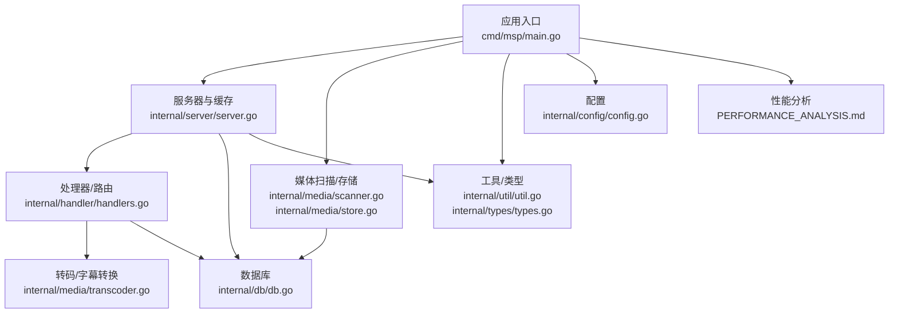
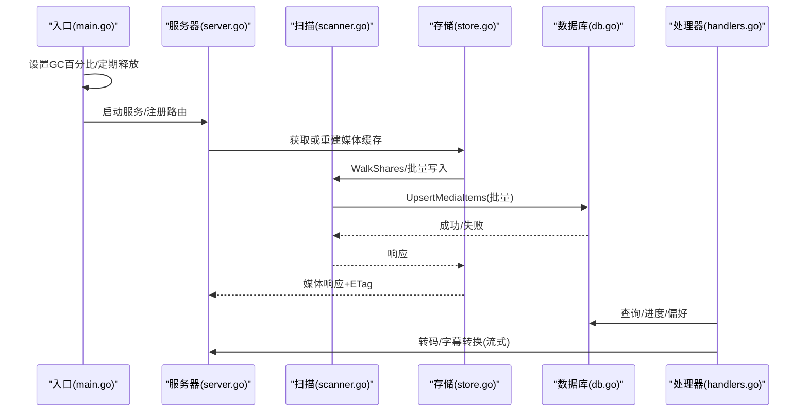
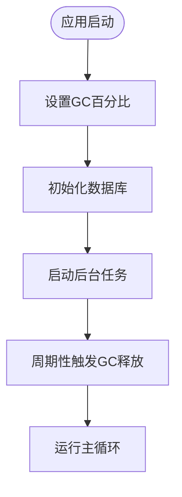
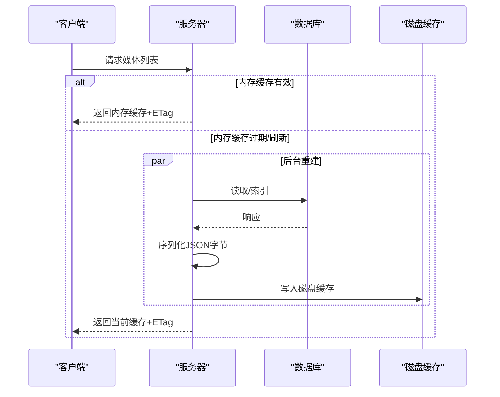
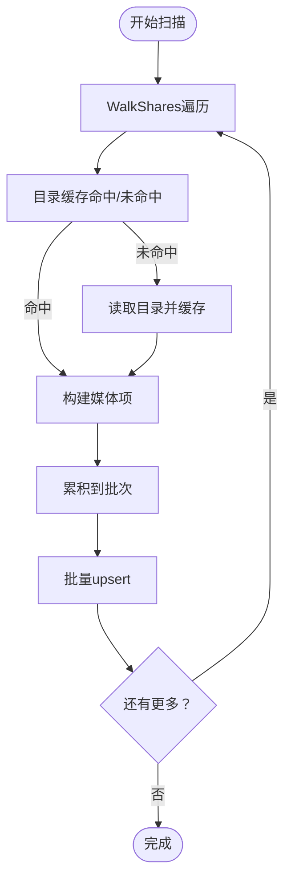
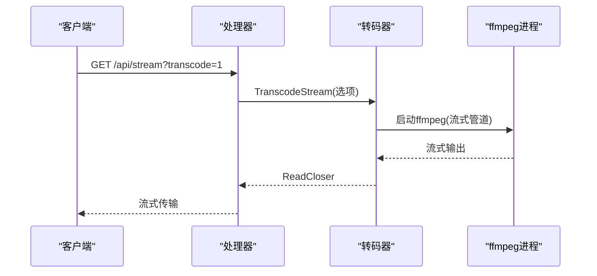
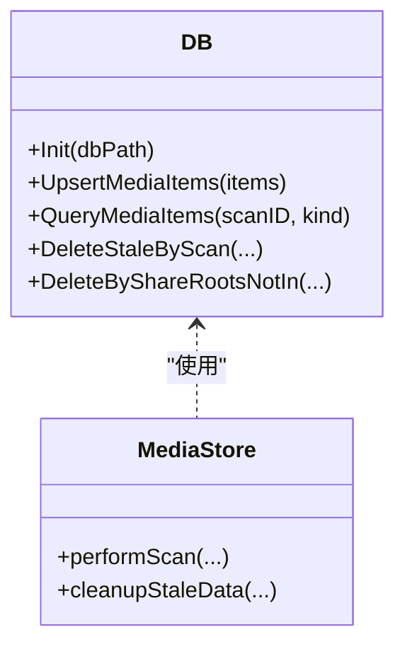
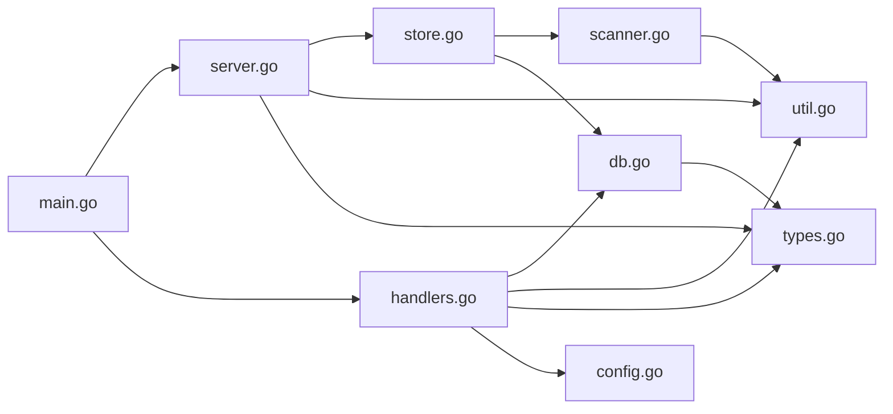

# 内存管理优化

<cite>
**本文引用的文件**
- [cmd/msp/main.go](file://cmd/msp/main.go)
- [internal/media/transcoder.go](file://internal/media/transcoder.go)
- [internal/media/scanner.go](file://internal/media/scanner.go)
- [internal/media/store.go](file://internal/media/store.go)
- [internal/db/db.go](file://internal/db/db.go)
- [internal/handler/handlers.go](file://internal/handler/handlers.go)
- [internal/server/server.go](file://internal/server/server.go)
- [internal/util/util.go](file://internal/util/util.go)
- [internal/types/types.go](file://internal/types/types.go)
- [internal/config/config.go](file://internal/config/config.go)
- [PERFORMANCE_ANALYSIS.md](file://PERFORMANCE_ANALYSIS.md)
</cite>

## 目录
1. [简介](#简介)
2. [项目结构](#项目结构)
3. [核心组件](#核心组件)
4. [架构总览](#架构总览)
5. [详细组件分析](#详细组件分析)
6. [依赖关系分析](#依赖关系分析)
7. [性能考量](#性能考量)
8. [故障排查指南](#故障排查指南)
9. [结论](#结论)
10. [附录](#附录)

## 简介
本指南聚焦于 MSP 项目的内存管理优化，围绕大文件处理、字幕转换、媒体嗅探等场景，系统阐述内存使用模式与优化策略；同时覆盖垃圾回收优化（GC 百分比、内存限制、定期触发）、内存泄漏预防（缓存淘汰、资源清理、锁使用）、高效数据结构（LRU 缓存、并发映射、缓冲池）以及内存监控与调优建议。内容基于仓库现有实现进行提炼与扩展，旨在帮助开发者在保证功能正确性的前提下，显著降低内存占用并提升稳定性。

## 项目结构
MSP 的内存管理涉及以下关键模块：
- 应用入口与全局 GC 设置：cmd/msp/main.go
- 媒体扫描与缓存：internal/media/scanner.go、internal/media/store.go、internal/server/server.go
- 媒体转码与字幕转换：internal/media/transcoder.go、internal/handler/handlers.go
- 数据库存储与查询：internal/db/db.go
- 工具与类型定义：internal/util/util.go、internal/types/types.go
- 配置与默认值：internal/config/config.go
- 性能分析与建议：PERFORMANCE_ANALYSIS.md

图表来源
- [cmd/msp/main.go](file://cmd/msp/main.go#L26-L83)
- [internal/server/server.go](file://internal/server/server.go#L31-L74)
- [internal/media/scanner.go](file://internal/media/scanner.go#L25-L57)
- [internal/media/store.go](file://internal/media/store.go#L17-L47)
- [internal/handler/handlers.go](file://internal/handler/handlers.go#L28-L43)
- [internal/media/transcoder.go](file://internal/media/transcoder.go#L15-L17)
- [internal/db/db.go](file://internal/db/db.go#L32-L72)
- [internal/util/util.go](file://internal/util/util.go#L18-L34)
- [internal/types/types.go](file://internal/types/types.go#L16-L32)
- [internal/config/config.go](file://internal/config/config.go#L77-L88)
- [PERFORMANCE_ANALYSIS.md](file://PERFORMANCE_ANALYSIS.md#L1-L502)

章节来源
- [cmd/msp/main.go](file://cmd/msp/main.go#L26-L83)
- [internal/server/server.go](file://internal/server/server.go#L31-L74)
- [internal/media/scanner.go](file://internal/media/scanner.go#L25-L57)
- [internal/media/store.go](file://internal/media/store.go#L17-L47)
- [internal/handler/handlers.go](file://internal/handler/handlers.go#L28-L43)
- [internal/media/transcoder.go](file://internal/media/transcoder.go#L15-L17)
- [internal/db/db.go](file://internal/db/db.go#L32-L72)
- [internal/util/util.go](file://internal/util/util.go#L18-L34)
- [internal/types/types.go](file://internal/types/types.go#L16-L32)
- [internal/config/config.go](file://internal/config/config.go#L77-L88)
- [PERFORMANCE_ANALYSIS.md](file://PERFORMANCE_ANALYSIS.md#L1-L502)

## 核心组件
- 全局 GC 策略：应用启动时设置积极的 GC 百分比，并在索引完成后主动释放系统内存。
- 媒体缓存与重建：服务端维护内存缓存与磁盘缓存，结合弱 ETag 实现高效命中与失效。
- 扫描与索引：扫描器采用目录缓存与批量写入，减少 IO 与内存峰值。
- 转码与字幕：转码使用流式管道，字幕转换限制最大体积并流式处理。
- 数据库：SQLite WAL、连接池与预编译语句优化，配合批量 upsert。
- 并发与锁：细粒度锁、条件变量与原子计数，避免热点竞争。

章节来源
- [cmd/msp/main.go](file://cmd/msp/main.go#L26-L28)
- [internal/server/server.go](file://internal/server/server.go#L332-L437)
- [internal/media/scanner.go](file://internal/media/scanner.go#L27-L57)
- [internal/media/store.go](file://internal/media/store.go#L111-L152)
- [internal/media/transcoder.go](file://internal/media/transcoder.go#L15-L17)
- [internal/handler/handlers.go](file://internal/handler/handlers.go#L654-L679)
- [internal/db/db.go](file://internal/db/db.go#L32-L72)

## 架构总览
下图展示内存相关的关键交互：入口设置 GC → 服务器缓存 → 扫描/索引 → 数据库 → 处理器（转码/字幕）。

图表来源
- [cmd/msp/main.go](file://cmd/msp/main.go#L26-L83)
- [internal/server/server.go](file://internal/server/server.go#L332-L437)
- [internal/media/scanner.go](file://internal/media/scanner.go#L27-L57)
- [internal/media/store.go](file://internal/media/store.go#L111-L152)
- [internal/db/db.go](file://internal/db/db.go#L159-L172)
- [internal/handler/handlers.go](file://internal/handler/handlers.go#L534-L564)

## 详细组件分析

### 入口与全局 GC 优化
- 全局 GC 百分比设置：启动时设置积极的 GC 百分比，降低内存峰值。
- 定期释放系统内存：索引完成后触发释放，避免长时间驻留内存。
- 可选内存上限：建议通过环境变量设置内存上限，便于容器/平台资源约束。
- 定期强制 GC：建议周期性触发 GC，保持内存水位稳定。

图表来源
- [cmd/msp/main.go](file://cmd/msp/main.go#L26-L28)
- [cmd/msp/main.go](file://cmd/msp/main.go#L42-L45)
- [cmd/msp/main.go](file://cmd/msp/main.go#L76-L82)
- [internal/server/server.go](file://internal/server/server.go#L433-L435)

章节来源
- [cmd/msp/main.go](file://cmd/msp/main.go#L26-L28)
- [cmd/msp/main.go](file://cmd/msp/main.go#L42-L45)
- [cmd/msp/main.go](file://cmd/msp/main.go#L76-L82)
- [internal/server/server.go](file://internal/server/server.go#L433-L435)
- [PERFORMANCE_ANALYSIS.md](file://PERFORMANCE_ANALYSIS.md#L434-L460)

### 媒体缓存与重建（内存缓存与磁盘缓存）
- 内存缓存：以 JSON 字节形式存储响应，缩短序列化开销，避免重复构建。
- 弱 ETag：基于缓存键与构建时间生成弱校验，支持条件请求与缓存命中。
- 磁盘缓存：在无数据库时持久化缓存，重启后快速恢复。
- 并发重建：使用信号量限制重建并发，避免抖动；条件变量协调等待。

图表来源
- [internal/server/server.go](file://internal/server/server.go#L332-L396)
- [internal/server/server.go](file://internal/server/server.go#L398-L437)
- [internal/server/server.go](file://internal/server/server.go#L487-L536)

章节来源
- [internal/server/server.go](file://internal/server/server.go#L332-L396)
- [internal/server/server.go](file://internal/server/server.go#L398-L437)
- [internal/server/server.go](file://internal/server/server.go#L487-L536)

### 扫描与索引（批量写入与目录缓存）
- 目录缓存：对目录读取结果进行缓存，避免重复 IO；建议引入 LRU 控制容量。
- 批量写入：使用固定批次大小进行 upsert，降低事务开销与内存峰值。
- 限流与取消：扫描过程支持上下文取消，避免长时间阻塞。

图表来源
- [internal/media/scanner.go](file://internal/media/scanner.go#L27-L57)
- [internal/media/scanner.go](file://internal/media/scanner.go#L264-L285)
- [internal/media/store.go](file://internal/media/store.go#L111-L152)

章节来源
- [internal/media/scanner.go](file://internal/media/scanner.go#L27-L57)
- [internal/media/scanner.go](file://internal/media/scanner.go#L264-L285)
- [internal/media/store.go](file://internal/media/store.go#L111-L152)
- [PERFORMANCE_ANALYSIS.md](file://PERFORMANCE_ANALYSIS.md#L384-L426)

### 转码与字幕转换（流式与体积限制）
- 转码流式输出：通过子进程管道直接输出，避免将大文件完整读入内存。
- 并发限制：全局信号量限制并发转码会话，防止 CPU 抢占。
- 字幕转换体积限制：对 SRT/ASS 等字幕文件设置最大体积，超限拒绝转换。
- 字幕格式转换：SRT/ASS 转 VTT 采用流式处理，减少中间缓冲。

图表来源
- [internal/handler/handlers.go](file://internal/handler/handlers.go#L534-L564)
- [internal/media/transcoder.go](file://internal/media/transcoder.go#L138-L248)

章节来源
- [internal/handler/handlers.go](file://internal/handler/handlers.go#L534-L564)
- [internal/media/transcoder.go](file://internal/media/transcoder.go#L138-L248)
- [internal/handler/handlers.go](file://internal/handler/handlers.go#L654-L684)

### 数据库（连接池、预编译与批量写入）
- 连接池：单连接模式，避免 SQLite 过多锁竞争；启用 WAL 提升并发写入。
- 预编译语句：缓存预编译语句，减少 SQL 解析开销。
- 批量 upsert：使用 ON CONFLICT 更新，降低事务次数。
- 事务控制：业务层手动控制事务，避免默认事务带来的额外开销。

图表来源
- [internal/db/db.go](file://internal/db/db.go#L32-L72)
- [internal/db/db.go](file://internal/db/db.go#L159-L172)
- [internal/db/db.go](file://internal/db/db.go#L201-L212)
- [internal/media/store.go](file://internal/media/store.go#L111-L152)

章节来源
- [internal/db/db.go](file://internal/db/db.go#L32-L72)
- [internal/db/db.go](file://internal/db/db.go#L159-L172)
- [internal/db/db.go](file://internal/db/db.go#L201-L212)
- [internal/media/store.go](file://internal/media/store.go#L111-L152)

### 并发与锁（细粒度与原子操作）
- 细粒度锁：配置、日志、会话分别使用独立锁，降低竞争。
- 条件变量：缓存构建阶段使用条件变量协调等待，避免忙轮询。
- 原子计数：使用原子计数器替代锁，减少同步成本。
- 会话清理：定期清理过期会话，避免无限增长。

章节来源
- [internal/server/server.go](file://internal/server/server.go#L31-L56)
- [internal/server/server.go](file://internal/server/server.go#L332-L396)
- [internal/server/server.go](file://internal/server/server.go#L570-L626)

## 依赖关系分析
- 入口依赖服务器与处理器，服务器依赖扫描/存储与数据库，处理器依赖转码与工具。
- 类型与配置贯穿各层，确保跨模块一致性。

图表来源
- [cmd/msp/main.go](file://cmd/msp/main.go#L18-L24)
- [internal/server/server.go](file://internal/server/server.go#L31-L74)
- [internal/media/store.go](file://internal/media/store.go#L17-L47)
- [internal/media/scanner.go](file://internal/media/scanner.go#L25-L57)
- [internal/db/db.go](file://internal/db/db.go#L18-L26)
- [internal/handler/handlers.go](file://internal/handler/handlers.go#L28-L43)
- [internal/util/util.go](file://internal/util/util.go#L18-L34)
- [internal/types/types.go](file://internal/types/types.go#L16-L32)
- [internal/config/config.go](file://internal/config/config.go#L77-L88)

章节来源
- [cmd/msp/main.go](file://cmd/msp/main.go#L18-L24)
- [internal/server/server.go](file://internal/server/server.go#L31-L74)
- [internal/media/store.go](file://internal/media/store.go#L17-L47)
- [internal/media/scanner.go](file://internal/media/scanner.go#L25-L57)
- [internal/db/db.go](file://internal/db/db.go#L18-L26)
- [internal/handler/handlers.go](file://internal/handler/handlers.go#L28-L43)
- [internal/util/util.go](file://internal/util/util.go#L18-L34)
- [internal/types/types.go](file://internal/types/types.go#L16-L32)
- [internal/config/config.go](file://internal/config/config.go#L77-L88)

## 性能考量
- 大文件处理
  - 转码：使用流式管道，避免整文件加载；并发限制防止 CPU 抢占。
  - 字幕：限制最大体积，超限拒绝；SRT/ASS 转 VTT 采用流式处理。
  - 媒体嗅探：限制读取大小，兼顾准确性与内存占用。
- 内存泄漏预防
  - 目录缓存：建议引入 LRU 淘汰，避免大目录导致内存膨胀。
  - 转码资源：确保异常路径也能释放信号量；及时关闭文件句柄与 ReadCloser。
  - 会话与 IP：定期清理过期会话与已见 IP，避免无限增长。
- 数据结构效率
  - LRU 缓存：替换目录缓存为 LRU，控制容量上限。
  - 并发映射：使用 sync.Map 存放轻量状态；复杂结构使用互斥锁。
  - 缓冲池：对于频繁分配的小对象，可考虑自定义缓冲池（视场景而定）。
- 监控与调优
  - 指标采集：建议增加 expvar 指标，记录请求量、缓存命中、转码并发、内存统计等。
  - GC 调优：根据部署环境设置内存上限；周期性触发 GC 保持水位稳定。

章节来源
- [internal/media/transcoder.go](file://internal/media/transcoder.go#L138-L248)
- [internal/handler/handlers.go](file://internal/handler/handlers.go#L654-L684)
- [internal/media/scanner.go](file://internal/media/scanner.go#L588-L616)
- [PERFORMANCE_ANALYSIS.md](file://PERFORMANCE_ANALYSIS.md#L301-L460)
- [PERFORMANCE_ANALYSIS.md](file://PERFORMANCE_ANALYSIS.md#L464-L541)

## 故障排查指南
- 转码失败或卡顿
  - 检查 ffmpeg/ffprobe 是否可用；确认并发限制是否被占满。
  - 查看处理器日志与转码错误输出。
- 媒体列表加载缓慢
  - 检查数据库连接池与 WAL 设置；确认批量 upsert 是否正常。
  - 观察缓存命中情况与重建频率。
- 内存持续上涨
  - 确认是否设置了积极的 GC 百分比与定期释放。
  - 检查目录缓存是否过大；考虑引入 LRU。
  - 关注会话与已见 IP 是否定期清理。
- 字幕转换报错
  - 确认文件大小未超过限制；检查转换流程与错误日志。

章节来源
- [internal/media/transcoder.go](file://internal/media/transcoder.go#L92-L104)
- [internal/media/transcoder.go](file://internal/media/transcoder.go#L159-L173)
- [internal/handler/handlers.go](file://internal/handler/handlers.go#L654-L684)
- [internal/db/db.go](file://internal/db/db.go#L54-L70)
- [internal/server/server.go](file://internal/server/server.go#L433-L435)
- [PERFORMANCE_ANALYSIS.md](file://PERFORMANCE_ANALYSIS.md#L378-L426)

## 结论
MSP 在内存管理方面已具备良好的基础：积极的 GC 策略、流式转码与字幕处理、批量数据库写入、细粒度锁与缓存策略。为进一步提升稳定性与资源利用率，建议引入 LRU 目录缓存、定期清理会话/IP、expvar 指标采集、内存上限与周期性 GC 触发等增强措施。这些优化将使系统在高并发与大规模媒体库场景下保持更低的内存占用与更稳定的性能表现。

## 附录
- 环境变量与配置要点
  - MSP_NO_AUTO_OPEN：控制自动打开浏览器行为（不影响内存）。
  - MSP_MEMORY_LIMIT：可选设置内存上限（参考性能分析建议）。
- 常用路径与职责
  - 入口与 GC：cmd/msp/main.go
  - 服务器与缓存：internal/server/server.go
  - 扫描与索引：internal/media/scanner.go、internal/media/store.go
  - 转码与字幕：internal/media/transcoder.go、internal/handler/handlers.go
  - 数据库：internal/db/db.go
  - 工具与类型：internal/util/util.go、internal/types/types.go
  - 配置：internal/config/config.go
  - 性能分析：PERFORMANCE_ANALYSIS.md

章节来源
- [cmd/msp/main.go](file://cmd/msp/main.go#L76-L78)
- [PERFORMANCE_ANALYSIS.md](file://PERFORMANCE_ANALYSIS.md#L443-L448)