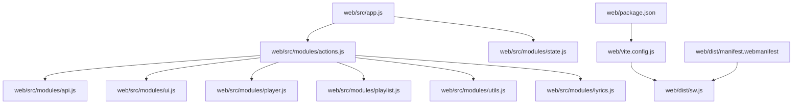
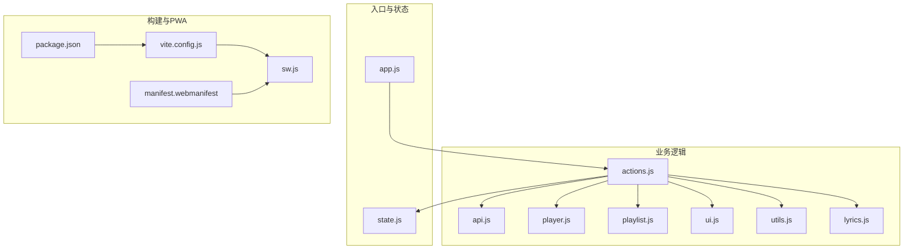
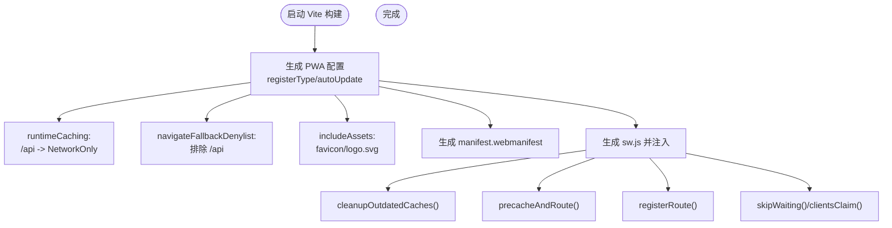
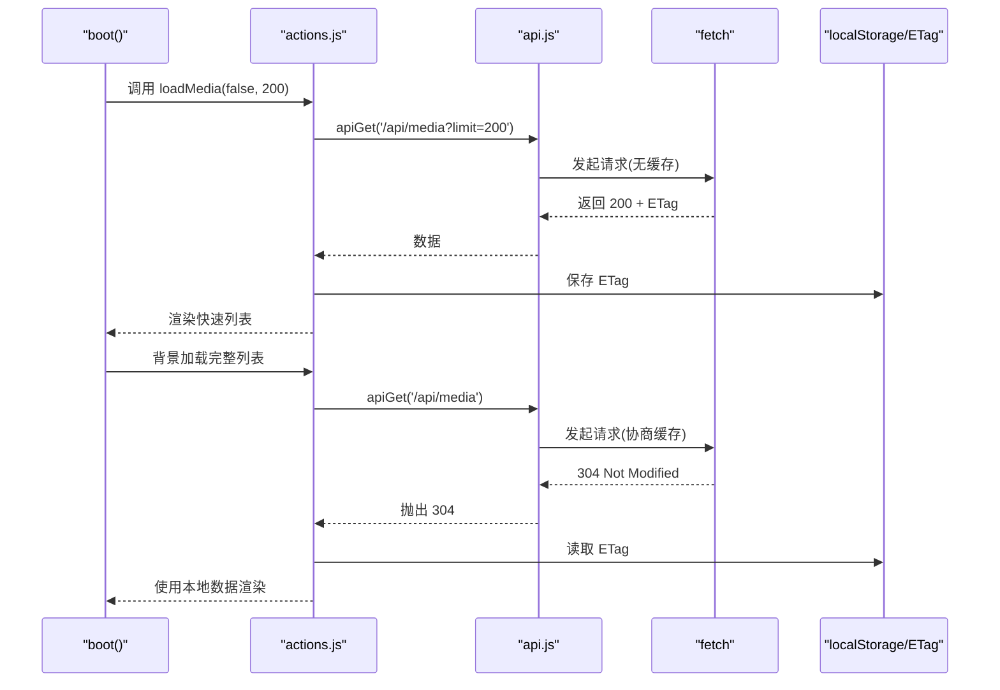
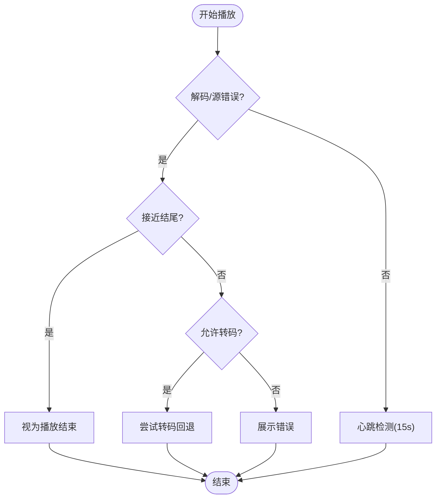
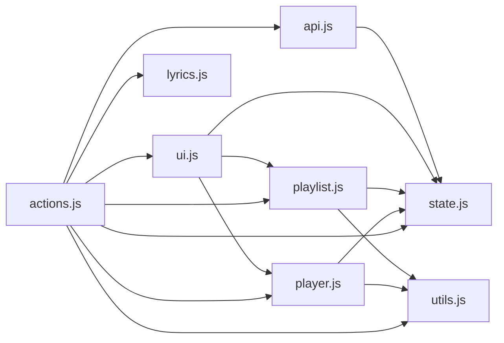

# 前端性能优化

<cite>
**本文引用的文件**
- [vite.config.js](file://web/vite.config.js)
- [package.json](file://web/package.json)
- [app.js](file://web/src/app.js)
- [sw.js](file://web/dist/sw.js)
- [manifest.webmanifest](file://web/dist/manifest.webmanifest)
- [actions.js](file://web/src/modules/actions.js)
- [api.js](file://web/src/modules/api.js)
- [player.js](file://web/src/modules/player.js)
- [state.js](file://web/src/modules/state.js)
- [ui.js](file://web/src/modules/ui.js)
- [utils.js](file://web/src/modules/utils.js)
- [playlist.js](file://web/src/modules/playlist.js)
- [lyrics.js](file://web/src/modules/lyrics.js)
- [app.css](file://web/src/app.css)
- [PERFORMANCE_ANALYSIS.md](file://PERFORMANCE_ANALYSIS.md)
</cite>

## 目录
1. [简介](#简介)
2. [项目结构](#项目结构)
3. [核心组件](#核心组件)
4. [架构总览](#架构总览)
5. [详细组件分析](#详细组件分析)
6. [依赖关系分析](#依赖关系分析)
7. [性能考量](#性能考量)
8. [故障排查指南](#故障排查指南)
9. [结论](#结论)
10. [附录](#附录)

## 简介
本指南聚焦于 MSP 项目前端性能优化，围绕 Vite 构建优化、PWA 性能策略、API 请求优化、资源加载优化以及前端性能监控与测试方法展开。通过对现有代码的深入分析，总结可落地的优化建议与最佳实践，帮助在局域网媒体共享场景下获得更流畅的用户体验。

## 项目结构
前端位于 web 子目录，采用 Vite 作为构建工具，PWA 由 vite-plugin-pwa 插件生成 Service Worker 与清单文件。应用入口为 src/app.js，核心业务逻辑分布在 modules 目录下的多个模块中，样式集中在 app.css。

**图表来源**
- [app.js](file://web/src/app.js#L1-L5)
- [actions.js](file://web/src/modules/actions.js#L1-L164)
- [api.js](file://web/src/modules/api.js#L1-L155)
- [player.js](file://web/src/modules/player.js#L1-L800)
- [vite.config.js](file://web/vite.config.js#L1-L48)
- [package.json](file://web/package.json#L1-L25)
- [manifest.webmanifest](file://web/dist/manifest.webmanifest#L1-L2)
- [sw.js](file://web/dist/sw.js#L1-L2)

**章节来源**
- [vite.config.js](file://web/vite.config.js#L1-L48)
- [package.json](file://web/package.json#L1-L25)
- [app.js](file://web/src/app.js#L1-L5)

## 核心组件
- 构建与打包：Vite 配置启用 PWA、代理后端、输出目录等。
- PWA 与缓存：自动生成 Service Worker、预缓存清单、运行时缓存策略。
- API 层：统一的请求封装、重试机制、批量偏好保存、探测缓存。
- 播放器与播放列表：智能错误处理、心跳检测、转码回退、字幕与音轨管理。
- UI 与状态：响应式布局、分页与排序、主题与语言切换。
- 资源与样式：字体预加载策略、CSS 动画优化、媒体元素过渡。

**章节来源**
- [vite.config.js](file://web/vite.config.js#L1-L48)
- [actions.js](file://web/src/modules/actions.js#L1-L164)
- [api.js](file://web/src/modules/api.js#L1-L155)
- [player.js](file://web/src/modules/player.js#L1-L800)
- [ui.js](file://web/src/modules/ui.js#L1-L417)
- [state.js](file://web/src/modules/state.js#L1-L127)
- [utils.js](file://web/src/modules/utils.js#L1-L124)
- [playlist.js](file://web/src/modules/playlist.js#L1-L457)
- [lyrics.js](file://web/src/modules/lyrics.js#L1-L74)
- [app.css](file://web/src/app.css#L1-L800)

## 架构总览
前端以模块化方式组织，入口负责引导启动流程；actions 负责初始化与数据加载；api 提供网络访问能力；player/playlist 控制媒体播放与列表；ui/state 负责界面与状态管理；vite.config.js 驱动构建与 PWA。

**图表来源**
- [app.js](file://web/src/app.js#L1-L5)
- [actions.js](file://web/src/modules/actions.js#L1-L164)
- [api.js](file://web/src/modules/api.js#L1-L155)
- [player.js](file://web/src/modules/player.js#L1-L800)
- [playlist.js](file://web/src/modules/playlist.js#L1-L457)
- [ui.js](file://web/src/modules/ui.js#L1-L417)
- [utils.js](file://web/src/modules/utils.js#L1-L124)
- [lyrics.js](file://web/src/modules/lyrics.js#L1-L74)
- [state.js](file://web/src/modules/state.js#L1-L127)
- [vite.config.js](file://web/vite.config.js#L1-L48)
- [package.json](file://web/package.json#L1-L25)
- [sw.js](file://web/dist/sw.js#L1-L2)
- [manifest.webmanifest](file://web/dist/manifest.webmanifest#L1-L2)

## 详细组件分析

### Vite 构建与 PWA 优化
- PWA 配置要点
  - 自动更新注册类型，减少手动干预。
  - includeAssets 包含图标与 favicon，提升安装体验。
  - 运行时缓存策略：对 /api 前缀使用 NetworkOnly，避免缓存接口响应。
  - 导航回退白名单排除 /api，保证 SPA 导航可用。
  - 清理过时缓存与预缓存清单，降低存储占用。
- 服务端代理
  - 将 /api 代理到后端地址，开发环境跨域友好。
- 输出目录
  - outDir 指向 dist，便于部署与缓存控制。

**图表来源**
- [vite.config.js](file://web/vite.config.js#L5-L33)
- [sw.js](file://web/dist/sw.js#L1-L2)
- [manifest.webmanifest](file://web/dist/manifest.webmanifest#L1-L2)

**章节来源**
- [vite.config.js](file://web/vite.config.js#L1-L48)
- [sw.js](file://web/dist/sw.js#L1-L2)
- [manifest.webmanifest](file://web/dist/manifest.webmanifest#L1-L2)

### API 请求优化
- 重试机制
  - apiRetry 提供指数退避的重试能力，降低瞬时异常影响。
- 请求去重
  - 当前未实现请求去重，存在重复请求风险。建议引入 pendingRequests Map，按 URL 去重。
- 批量偏好保存
  - 使用 gpBatchQueue 与定时器合并多次偏好变更，减少网络请求频率。
- 探测缓存
  - probeCache 限制大小并淘汰最旧条目，避免无限增长。
- 条件缓存与 ETag
  - loadMedia 使用 If-None-Match 头与 304 协商缓存，减少带宽消耗。
- 错误处理
  - 统一解析响应体中的错误信息，抛出明确错误，便于上层捕获。

**图表来源**
- [actions.js](file://web/src/modules/actions.js#L38-L91)
- [api.js](file://web/src/modules/api.js#L16-L22)
- [state.js](file://web/src/modules/state.js#L42-L58)

**章节来源**
- [actions.js](file://web/src/modules/actions.js#L1-L164)
- [api.js](file://web/src/modules/api.js#L1-L155)
- [state.js](file://web/src/modules/state.js#L1-L127)

### 播放器与播放列表优化
- 智能错误处理
  - 解码错误与源不可用时，近结尾场景视为成功结束，避免卡顿。
  - 支持一次直连重试与转码回退，提升兼容性。
- 心跳检测
  - 15 秒无进度判定为冻结，主动结束播放，防止 UI 卡死。
- 转码流智能寻址
  - 转码流下监听 seeking，动态替换源并保持时间轴一致。
- 字幕与音轨
  - 自动检测内封字幕与多音轨，支持持久化用户偏好。
- 播放列表
  - 自适应分页，根据容器高度动态计算每页项数，减少重排。

**图表来源**
- [player.js](file://web/src/modules/player.js#L360-L443)
- [player.js](file://web/src/modules/player.js#L557-L624)

**章节来源**
- [player.js](file://web/src/modules/player.js#L1-L800)
- [playlist.js](file://web/src/modules/playlist.js#L1-L457)

### UI 与状态管理
- 响应式布局与主题
  - CSS 变量驱动明暗主题，媒体元素过渡时间缩短，减少重绘。
- 分页与排序
  - 列表与播放列表均支持分页，排序支持中文自然序。
- 语言与元信息
  - i18n 注入静态文本，元信息随配置动态更新。

**章节来源**
- [ui.js](file://web/src/modules/ui.js#L1-L417)
- [state.js](file://web/src/modules/state.js#L1-L127)
- [app.css](file://web/src/app.css#L1-L800)

### 资源加载优化
- 字体加载
  - 使用 font-display: swap，避免阻塞渲染。
- 预加载与 DNS
  - 建议在 index.html 中添加 preconnect/dns-prefetch 与 preload，加速关键资源。
- 静态资源
  - 通过 PWA 预缓存与 Service Worker 缓存策略，减少二次加载时间。

**章节来源**
- [app.css](file://web/src/app.css#L1-L800)
- [PERFORMANCE_ANALYSIS.md](file://PERFORMANCE_ANALYSIS.md#L590-L651)

## 依赖关系分析
- 模块耦合
  - actions 作为中枢，依赖 api、ui、player、playlist、utils、lyrics、state。
  - player/playlist 与 utils/state 紧密耦合，共同维护播放状态。
- 外部依赖
  - PWA 依赖 vite-plugin-pwa 与 workbox-window。
  - 字体与第三方库通过静态资源或 CDN 引入。

**图表来源**
- [actions.js](file://web/src/modules/actions.js#L1-L164)
- [api.js](file://web/src/modules/api.js#L1-L155)
- [player.js](file://web/src/modules/player.js#L1-L800)
- [playlist.js](file://web/src/modules/playlist.js#L1-L457)
- [ui.js](file://web/src/modules/ui.js#L1-L417)
- [utils.js](file://web/src/modules/utils.js#L1-L124)
- [state.js](file://web/src/modules/state.js#L1-L127)
- [lyrics.js](file://web/src/modules/lyrics.js#L1-L74)

**章节来源**
- [actions.js](file://web/src/modules/actions.js#L1-L164)
- [api.js](file://web/src/modules/api.js#L1-L155)
- [player.js](file://web/src/modules/player.js#L1-L800)
- [playlist.js](file://web/src/modules/playlist.js#L1-L457)
- [ui.js](file://web/src/modules/ui.js#L1-L417)
- [utils.js](file://web/src/modules/utils.js#L1-L124)
- [state.js](file://web/src/modules/state.js#L1-L127)
- [lyrics.js](file://web/src/modules/lyrics.js#L1-L74)

## 性能考量
- 构建与打包
  - 当前未启用代码分割，所有 JS 打包为单文件。建议拆分 vendor 与业务代码，利用路由级懒加载与动态导入，降低首屏体积。
  - 启用压缩与资源指纹，结合 PWA 缓存策略，提升二次加载性能。
- PWA 缓存
  - /api 使用 NetworkOnly，避免缓存接口；其他静态资源与页面通过预缓存与运行时策略缓存，减少网络往返。
  - 建议对字体与关键 CSS 进行预缓存，进一步缩短首屏渲染时间。
- API 优化
  - 实现请求去重与并发控制，避免重复请求。
  - 批量保存偏好使用节流合并，减少网络抖动。
  - ETag 协商缓存已启用，建议在服务端正确设置 Last-Modified/ETag。
- 播放器性能
  - 心跳检测与错误回退减少卡顿；转码流智能寻址避免无效重载。
  - 建议对大列表使用虚拟滚动，减少 DOM 节点数量。
- 资源加载
  - 字体使用 swap；建议在 index.html 中添加关键资源的 preload 与 dns-prefetch。
  - 图片与封面图建议使用现代格式（如 AVIF/WebP）并按需懒加载。

[本节为通用性能指导，无需特定文件引用]

## 故障排查指南
- PWA 不生效
  - 检查 sw.js 是否注入，manifest.webmanifest 是否正确生成与引用。
  - 确认 registerSW 是否在受支持的环境中执行。
- API 请求失败
  - 查看 apiRetry 的重试次数与延迟；确认后端 CORS 与代理配置。
  - 关注 304 场景下的 ETag 一致性。
- 播放异常
  - 解码错误：检查转码开关与媒体格式；必要时启用转码回退。
  - 心跳停止：确认网络状况与缓冲状态；考虑增加缓冲策略。
- UI 卡顿
  - 大列表渲染：启用分页与虚拟滚动；减少不必要的重排。
  - 主题切换：检查 CSS 变量与过渡动画时长。

**章节来源**
- [sw.js](file://web/dist/sw.js#L1-L2)
- [manifest.webmanifest](file://web/dist/manifest.webmanifest#L1-L2)
- [actions.js](file://web/src/modules/actions.js#L93-L163)
- [api.js](file://web/src/modules/api.js#L5-L14)
- [player.js](file://web/src/modules/player.js#L360-L443)
- [ui.js](file://web/src/modules/ui.js#L74-L170)

## 结论
MSP 前端已具备良好的基础：Vite 构建与 PWA、协商缓存、播放器错误回退与心跳检测。为进一步提升性能，建议引入请求去重、代码分割与路由懒加载、关键资源预加载、虚拟滚动与资源格式优化，并完善性能监控与测试流程，以在局域网环境下提供更流畅的媒体播放体验。

[本节为总结性内容，无需特定文件引用]

## 附录
- 性能监控与测试
  - 建议集成 Web Vitals 监控，关注 Largest Contentful Paint(LCP)、First Input Delay(FID)、Cumulative Layout Shift(CLS)。
  - 使用 Lighthouse 或 Chrome DevTools Performance 面板进行定期评测。
  - 对关键路径（首屏、播放首帧）建立基准指标，持续跟踪回归。

[本节为通用指导，无需特定文件引用]